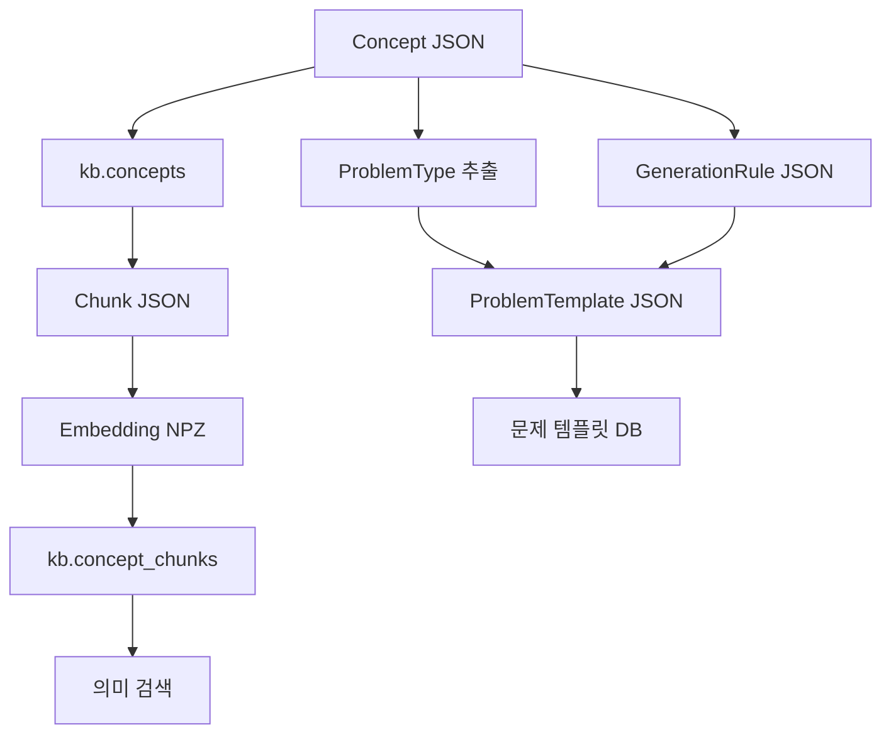

# 대학 수학 문제 플랫폼 — 전체 파일 안내

대학 수학 개념을 구조화하고, 검색용 지식 DB와 문제 생성용 템플릿을 구성하는 Python 프로젝트입니다. 이 문서는 **첨부된 `app.zip`의 실제 파일과 코드**를 기준으로 작성했습니다.

압축파일 이름은 `app.zip`이지만, 내부에는 `app/`뿐 아니라 `data/`, `scripts/`, `sql/`, `tests/`와 환경설정 파일이 포함되어 있습니다. 이 README는 해당 폴더들과 같은 높이인 **프로젝트 최상위**에 두면 됩니다.

> 확인 기준: 2026-09-18 업로드본. 폴더를 제외한 파일은 **5,854개**입니다. 코드·SQL·설정·테스트는 본문에서 설명하고, 모든 데이터 파일과 자동 생성 파일은 뒤의 전체 목록에 개별적으로 설명했습니다. 파일 내용의 정적 확인과 데이터 집계를 수행했으며, DB 연결·마이그레이션·문제 생성·프로젝트 테스트 실행 결과를 의미하지 않습니다.

## 목차

1. [프로젝트가 하는 일](#1-프로젝트가-하는-일)
2. [폴더 구조와 데이터 규모](#2-폴더-구조와-데이터-규모)
3. [코드·설정·SQL·테스트 파일 설명](#3-코드설정sql테스트-파일-설명)
4. [주요 파일을 함께 읽는 방법](#4-주요-파일을-함께-읽는-방법)
5. [DB 테이블과 데이터 형식](#5-db-테이블과-데이터-형식)
6. [실행 진입점](#6-실행-진입점)
7. [현재 업로드본에서 구분해야 할 상태](#7-현재-업로드본에서-구분해야-할-상태)
8. [데이터 파일 전체 목록](#8-데이터-파일-전체-목록)
9. [캐시·Git 내부 파일 전체 목록](#9-캐시git-내부-파일-전체-목록)
10. [내부 ZIP 파일의 내용](#10-내부-zip-파일의-내용)

## 1. 프로젝트가 하는 일

현재 코드의 중심은 **지식 데이터 처리**와 **ProblemTemplate 생성·저장**입니다. 검색, 문제 생성 규칙, 템플릿은 연결되어 있지만 실제 숫자가 들어간 문제를 만들어 검증하는 단계는 아직 함수 골격입니다.

| 용어 | 이 프로젝트에서의 의미 |
| --- | --- |
| Concept | 정의, 공식, 적용 조건, 성질, 선수 개념, 오개념 등을 모은 하나의 수학 개념 |
| Chunk | Concept의 일부를 검색에 적합한 의미 단위로 나눈 텍스트 |
| Embedding | Chunk나 검색어를 의미 비교에 사용하는 숫자 벡터로 바꾼 결과 |
| GenerationRule | 특정 과목·문제 유형에 필요한 파라미터, 제약조건, 구성 방법, 정답식, 검증기 설정 |
| ProblemTemplate | Concept의 분류 정보와 GenerationRule을 결합한 문제 생성 설계도 |
| ProblemInstance | 구체적인 파라미터·문제 본문·정답·검증 기록을 가진 개별 문제. 현재 생성 로직은 미구현 |
| Schema | JSON의 자료형, 필수 필드, 일부 참조 관계를 검사하는 Pydantic 모델 |
| Repository | DB에 조회·저장하는 SQL을 Python 함수로 묶은 모듈 |
| Manifest | 같은 폴더나 생성 작업에 속한 파일 목록·개수·상태를 기록하는 관리용 JSON |

### 현재 구성된 처리 흐름

아래 화살표는 코드상 입출력 관계입니다. 전체 흐름의 실행 성공을 보증하는 그림은 아닙니다.



Markdown 자료에서 Concept JSON으로 자동 변환하는 파일도 마련되어 있지만 비어 있습니다. 따라서 위 흐름은 현재 존재하는 Concept JSON부터 시작합니다.

ProblemInstance는 향후 **파라미터 생성 → 조건 검사 → 문장 렌더링·정답 계산 → 수학 검증 → 저장용 데이터 구성** 순서로 생성하도록 설계되어 있습니다. 이 단계의 네 모듈은 `scripts/problems/`에 있습니다.

## 2. 폴더 구조와 데이터 규모

### 최상위 구성

| 경로 | 파일 수 | 역할 |
| --- | ---: | --- |
| `app/` | 47 | 재사용 가능한 DB·지식 처리·템플릿·스키마 코드 27개와 Python 캐시 20개 |
| `data/` | 5,730 | Markdown, Concept, Chunk, Embedding, GenerationRule, ProblemTemplate 및 내부 ZIP |
| `scripts/` | 59 | 배치·점검·테스트 코드 20개와 중첩 Git 저장소 내부 파일 39개 |
| `sql/` | 9 | DB 스키마, 테이블, 인덱스 생성 SQL |
| `tests/` | 4 | 테스트 파일. 이 중 3개는 비어 있음 |
| `.vscode/` | 1 | VS Code의 Python 환경 관리 설정 |
| `.env`, `.gitignore`, `environment.yml`, 기존 `README.md` | 4 | 환경변수, Git 제외 규칙, Conda 환경, 기존 안내문 |
| **합계** | **5,854** | 디렉터리 항목 제외 |

`app/`은 다른 코드에서 가져다 쓰는 기능을, `scripts/`는 작업을 시작하는 배치·점검 코드를 주로 담습니다. 다만 현재 미구현인 문제 생성 네 모듈도 배치 용도로 `scripts/problems/`에 배치되어 있습니다.

### 데이터 종류별 구성

| 경로 | 파일 수 | 실제 내용 |
| --- | ---: | --- |
| `data/markdown/` | 48 | 수학 학습 자료 Markdown |
| `data/concepts/` | 51 | 단원별 Concept catalog. 전체 Concept 레코드는 1,117개 |
| `data/chunks/` | 1,117 | Concept별 Chunk 묶음. 내부 Chunk 합계는 6,617개 |
| `data/embeddings/` | 1,117 | Concept별 NPZ. 전체 벡터는 6,617개이며 차원은 모두 768 |
| `data/generation_rules/` | 6 | 과목별 Rule catalog 5개와 manifest 1개. Rule 합계는 556개 |
| `data/problem_templates/` | 3,389 | 템플릿 JSON 3,383개와 manifest 6개 |
| `data/generation_rules.zip` | 1 | Rule catalog 및 manifest 6개를 담은 별도 압축본 |
| `data/problem_templates.zip` | 1 | 템플릿 폴더의 파일 3,389개를 담은 별도 압축본 |

### 과목별 데이터 규모

아래 템플릿 수는 **파일 수**이며, 동일 ID·버전 중복을 제거하기 전입니다.

| 과목 ID | 과목 | Concept JSON | Concept | Chunk | Rule | 템플릿 JSON |
| --- | --- | ---: | ---: | ---: | ---: | ---: |
| `calculus_1` | 미분적분학 1 | 10 | 82 | 598 | 201 | 202 |
| `calculus_2` | 미분적분학 2 | 8 | 71 | 532 | 166 | 167 |
| `engineering_mathematics` | 공학수학 | 9 | 104 | 729 | 104 | 104 |
| `linear_algebra` | 선형대수학 | 6 | 50 | 350 | 62 | 118 |
| `probability_statistics` | 확률과 통계 | 18 | 810 | 4,408 | 23 | 2,792 |
| **합계** | | **51** | **1,117** | **6,617** | **556** | **3,383** |

템플릿은 `(template_id, template_version)` 기준으로 **56개 중복 그룹**이 있으며, 고유 키는 **3,327개**입니다. 현재 importer의 우선순위로 선택되는 파일의 상태는 `ready` 56개, `draft` 3,271개입니다. 이 수치는 실제 문제 생성·수학 검증 통과 건수가 아닙니다.

## 3. 코드·설정·SQL·테스트 파일 설명

다음 목록은 압축파일에 있는 각 코드·설정 파일의 역할을 설명합니다. 주요 함수 목록은 진입점과 탐색용 이름이며, 모든 내부 보조 함수를 나열한 API 문서는 아닙니다.

상태 표기의 의미:

- **구현 코드**: 함수 본문이 존재합니다. 실행 검증 완료라는 뜻은 아닙니다.
- **골격**: 자료형·함수 시그니처·TODO가 있으나 실제 동작 함수는 `NotImplementedError`를 발생시킵니다.
- **빈 파일**: 업로드본에서 0바이트입니다.
- **설정/데이터 정의**: 실행 로직보다 환경·스키마·SQL 선언을 담습니다.

### 최상위 설정

#### `.env`

DB 접속 정보와 EMBEDDING_MODEL 값을 보관합니다. 사용하는 키는 DB_HOST, DB_PORT, DB_NAME, DB_USER, DB_PASSWORD, EMBEDDING_MODEL이며 실제 값은 문서에 기재하지 않았습니다.

#### `.gitignore`

Git 추적 제외 패턴을 선언합니다. 업로드본에는 .env, __pycache__/, *.pyc, .pytest_cache/가 등록되어 있습니다. 이미 추적·압축에 포함된 파일을 자동 삭제하는 설정은 아닙니다.

#### `.vscode/settings.json`

VS Code의 Python 기본 환경 관리자와 패키지 관리자를 Conda로 지정합니다. 프로젝트 실행 로직은 아닙니다.

#### `README.md`

기존 프로젝트 안내문입니다. 업로드본에는 짧은 한 줄 메모만 있으며, 전달하는 이 문서가 전체 파일 안내를 제공합니다.

#### `environment.yml`

math-kb라는 Conda 환경과 Python 3.13, DB·스키마·배열·Excel·임베딩·테스트 관련 패키지 목록을 정의합니다. 패키지 버전은 고정되어 있지 않습니다.

### app/core

#### `app/core/__init__.py`

**상태:** 빈 파일, 0바이트.

app/core 디렉터리를 Python 패키지로 표시하는 초기화 파일입니다. 추가 초기화 동작은 없습니다.

#### `app/core/config.py`

**상태:** 빈 파일, 0바이트.

공통 설정을 둘 자리입니다. 현재 설정을 읽는 실제 코드는 app/db/connection.py와 각 배치 파일에 있습니다.

### app/db

#### `app/db/__init__.py`

**상태:** 빈 파일, 0바이트.

app/db 디렉터리를 Python 패키지로 표시하는 초기화 파일입니다. 추가 초기화 동작은 없습니다.

#### `app/db/connection.py`

**상태:** 구현 코드.

프로젝트 최상위의 `.env`를 읽고 PostgreSQL 연결을 생성합니다. DB_HOST·DB_PORT·DB_NAME·DB_USER·DB_PASSWORD의 누락을 확인하고 결과 행을 사전 형태로 반환하도록 설정합니다.

여러 repository와 배치·조회·테스트 코드가 공통으로 호출합니다.

주요 이름: `get_connection`.

#### `app/db/queries.py`

**상태:** 구현 코드.

`kb.concepts`의 INSERT/UPDATE와 개수 집계에 사용하는 SQL 문자열을 모읍니다. 같은 concept_id이면 갱신하고, content JSONB가 달라졌을 때 content_version을 증가시킵니다. 새 원문이 빈 문자열이면 기존 raw_markdown을 보존합니다.

`app/kb/repository.py`가 SQL 상수를 사용합니다.

주요 이름: `UPSERT_CONCEPT_SQL`, `COUNT_CONCEPTS_SQL`, `COUNT_CONCEPTS_BY_SUBJECT_SQL`.

### app/kb

#### `app/kb/__init__.py`

**상태:** 빈 파일, 0바이트.

app/kb 디렉터리를 Python 패키지로 표시하는 초기화 파일입니다. 추가 초기화 동작은 없습니다.

#### `app/kb/chunker.py`

**상태:** 구현 코드.

DB에서 읽은 Concept를 7종의 검색용 Chunk로 나눕니다. 과목·단원·개념 정보를 공통 헤더에 붙이고, 공식·조건·성질·오개념의 의미 단위를 보존합니다. tokenizer 기준 토큰 수, SHA-256 해시, 원본 content_version도 기록합니다.

입력은 ChunkSource, 출력은 ChunkCollection입니다. `scripts/kb/create_chunks.py`에서 사용합니다.

주요 이름: `ChunkSource`, `ConceptChunker.create_chunks`, `pack_items`, `split_long_text`, `build_formula_items`, `build_condition_items`.

#### `app/kb/concept_converter.py`

**상태:** 빈 파일, 0바이트.

원문에서 Concept 형식으로 변환하는 기능을 둘 자리입니다. 변환 로직은 없습니다.

#### `app/kb/embedder.py`

**상태:** 구현 코드.

SentenceTransformer로 문서와 검색어의 임베딩을 생성합니다. 문서에는 passage 접두어, 검색어에는 query 접두어를 붙이며, 벡터를 정규화합니다. 기본 모델은 intfloat/multilingual-e5-base입니다.

Chunk 텍스트 목록 또는 검색어를 받아 NumPy 벡터를 반환합니다. Embedding 생성 배치와 검색 모듈이 사용합니다.

주요 이름: `ConceptEmbedder`, `embed_passages`, `embed_query`.

#### `app/kb/markdown_parser.py`

**상태:** 빈 파일, 0바이트.

Markdown을 읽어 구조를 분석하는 기능을 둘 자리입니다. 파싱 로직은 없습니다.

#### `app/kb/repository.py`

**상태:** 구현 코드.

Concept 레코드를 JSONB로 변환해 DB에 upsert하고 전체·과목별 개수를 조회합니다. 연결 객체를 전달받아 사용하므로 연결과 트랜잭션의 수명은 호출부가 관리합니다.

`app/db/queries.py`의 SQL을 실행하며 Concept import 배치에서 사용합니다.

주요 이름: `upsert_concepts`, `count_concepts`, `count_concepts_by_subject`.

#### `app/kb/vector_search.py`

**상태:** 구현 코드.

검색어를 768차원 벡터로 변환하고 pgvector 코사인 거리로 유사한 Chunk를 조회합니다. 과목·Chunk 유형·최소 유사도·top_k 필터를 지원하며, 순위와 텍스트·개념 정보·유사도를 사전 목록으로 반환합니다.

입력은 검색어와 필터, 조회 대상은 kb.concept_chunks입니다. 현재 실제 검색 구현은 이 파일에 있습니다.

주요 이름: `VectorSearcher`, `embed_query`, `search`.

### app/problems

#### `app/problems/__init__.py`

**상태:** 빈 파일, 0바이트.

app/problems 디렉터리를 Python 패키지로 표시하는 초기화 파일입니다. 추가 초기화 동작은 없습니다.

#### `app/problems/generation_rule_registry.py`

**상태:** 구현 코드.

과목별 GenerationRule JSON catalog를 읽고 Pydantic으로 검증한 뒤 캐시합니다. 과목·문제 유형으로 Rule을 찾거나 전체 목록을 반환합니다. 필요한 catalog나 Rule이 없으면 KeyError를 발생시킵니다.

입력 파일은 data/generation_rules/{subject_id}.json입니다. Template Builder 배치와 Rule 등록 점검에서 사용합니다.

주요 이름: `load_rule_catalog`, `get_rule`, `has_rule`, `list_rules`, `registered_problem_types`.

#### `app/problems/problem_type_extractor.py`

**상태:** 구현 코드.

Concept catalog를 Pydantic으로 읽고, generation_profile.enabled=True인 개념의 지원 문제 유형을 추출합니다. 과목·단원·개념 ID, 공식, 답 유형, 난이도, 검증기, 원본 파일 경로 등을 ProblemTypeInfo로 묶습니다.

Concept 한 개, catalog, JSON 파일 또는 디렉터리에서 추출할 수 있습니다. Rule 생성과 Template 생성의 입력입니다.

주요 이름: `ProblemTypeInfo`, `extract_from_concept`, `extract_from_catalog`, `extract_from_file`, `extract_from_directory`, `unique_problem_types`.

#### `app/problems/template_builder.py`

**상태:** 구현 코드.

ProblemTypeInfo와 GenerationRule을 결합해 ProblemTemplate 객체를 만듭니다. 연결 정보·난이도·정답 유형·대표 공식을 확인하고 파라미터·조건·문장 템플릿·검증기 설정을 전달합니다.

출력은 ProblemTemplate입니다. ready는 Rule 메타데이터로 판정하며 여기서 실제 문제 생성이나 수학 검증은 수행하지 않습니다.

주요 이름: `build_template`, `_difficulty_range`, `_resolve_answer_type`, `_resolve_primary_formula_id`.

#### `app/problems/template_importer.py`

**상태:** 구현 코드.

템플릿 JSON을 스캔하고 동일 ID·버전 후보를 묶어 상태·executable·Rule 상태로 우선순위를 정합니다. 동순위 충돌은 오류로 처리합니다. 선택된 템플릿의 스키마와 답 유형을 확인하고 해시·상대경로·DB 레코드를 만듭니다.

파일 읽기와 정규화·검증을 담당하며 DB INSERT 자체는 repository가 담당합니다. 상태 우선순위는 현재 deprecated/draft/ready 3종입니다.

주요 이름: `scan_template_files`, `resolve_duplicates`, `choose_winner`, `validate_templates`, `calculate_content_hash`, `build_db_record`.

#### `app/problems/template_repository.py`

**상태:** 구현 코드.

템플릿 존재 여부와 content_hash를 조회하고, 템플릿 본문·개념 연결·가져오기 audit를 INSERT하는 DB 함수입니다. 전체 템플릿 JSON은 payload JSONB로 저장합니다.

problem.problem_templates, problem.template_concepts, problem.template_import_audit를 다룹니다. 연결은 호출부에서 전달합니다.

주요 이름: `find_existing_template`, `insert_template`, `insert_template_concept`, `insert_import_audit`.

### app/problems/generation_rules

#### `app/problems/generation_rules/__init__.py`

**상태:** 패키지 초기화 코드.

같은 패키지의 linear_algebra 모듈에서 LINEAR_ALGEBRA_RULES를 가져오도록 작성된 초기화 파일입니다.

대응하는 linear_algebra.py가 압축파일에 없습니다. 현재 JSON catalog 기반 Registry와 구분해야 하며, 이 패키지 자체를 import하면 실패할 수 있습니다.

주요 이름: `LINEAR_ALGEBRA_RULES import`.

### app/schemas

#### `app/schemas/__init__.py`

**상태:** 패키지 초기화 코드.

GenerationRule 클래스를 app.schemas 패키지에서 바로 가져올 수 있도록 재노출합니다.

실제 모델 정의는 app/schemas/generation_rule.py에 있습니다.

주요 이름: `GenerationRule import`.

#### `app/schemas/chunk.py`

**상태:** 구현 코드.

Chunk 한 개와 개념별 Chunk 묶음의 Pydantic 모델을 정의합니다. 7종 Chunk 유형, 식별자, 텍스트, 토큰 수, 해시 길이, 원본 버전 등을 검사하며 정의되지 않은 필드를 거부합니다.

Chunker가 반환하는 구조와 Chunk JSON의 형식 기준입니다.

주요 이름: `ChunkType`, `ConceptChunk`, `ChunkCollection`.

#### `app/schemas/concept.py`

**상태:** 구현 코드.

과목·단원·출처·표기법·공식·조건·학습목표·오개념·문제 생성 프로필·Concept catalog의 Pydantic 모델을 정의합니다. 난이도 범위, 중첩 ID 중복 등 내부 정합성을 확인하며 단일 source_file 문자열을 목록으로 정규화합니다.

Concept import와 ProblemType 추출에서 JSON 구조를 검증하는 기준입니다.

주요 이름: `ConceptCatalog`, `Concept`, `Formula`, `ApplicationCondition`, `GenerationProfile`, `SourceInfo`.

#### `app/schemas/generation_rule.py`

**상태:** 구현 코드.

GenerationRule의 파라미터·기호·크기·의존관계·파생값·조건·정답·검증·난이도 모델을 정의합니다. 미선언 참조, 파라미터와 기호 이름 중복, 명시적 의존관계 순환, 대표 공식 포함 여부, catalog 개수 등을 검사합니다.

shape는 고정 정수·범위·다른 값 참조를 지원하고 조건은 문자열 또는 구조화 객체를 받을 수 있습니다. 유연한 모델의 추가 필드 허용과 catalog의 엄격 검증이 혼합되어 있습니다.

주요 이름: `ParameterSpec`, `ShapeSpec`, `DerivedParameterSpec`, `SymbolSpec`, `StructuredConstraintSpec`, `GenerationRule`, `GenerationRuleCatalog`.

#### `app/schemas/problem_template.py`

**상태:** 구현 코드.

ProblemTemplate 전체 구조를 정의합니다. 분류·난이도·파라미터·기호·문제 구성·정답식·풀이 계획·검증기·저장 정책을 포함합니다. required_objects, 의존 대상, 대표 공식 및 ready의 일부 필수요건을 검사합니다.

Builder의 출력과 Template import의 검증 기준입니다. 현재 status는 draft/ready/deprecated 3종으로 제한되며 실제 수학 검증을 대신하지 않습니다.

주요 이름: `ProblemTemplate`, `TaxonomySpec`, `AnswerTemplateSpec`, `ValidatorTemplate`, `ValidationTemplateSpec`, `StoragePolicySpec`.

### app/search

#### `app/search/__init__.py`

**상태:** 빈 파일, 0바이트.

app/search 디렉터리를 Python 패키지로 표시하는 초기화 파일입니다. 추가 초기화 동작은 없습니다.

#### `app/search/vector_search.py`

**상태:** 빈 파일, 0바이트.

검색 계층용으로 마련된 파일이지만 현재 내용이 없습니다. 실제 검색 구현은 app/kb/vector_search.py입니다.

### app

#### `app/__init__.py`

**상태:** 빈 파일, 0바이트.

app 디렉터리를 Python 패키지로 표시하는 초기화 파일입니다. 추가 초기화 동작은 없습니다.

### scripts

#### `scripts/init_database.py`

**상태:** 구현 코드.

SQL_FILES에 지정된 SQL 8개를 순서대로 읽어 같은 DB 연결 문맥에서 실행합니다. 지식·문제 스키마와 테이블을 초기화하는 배치입니다.

sql/003_enable_pgvector.sql이 비어 있으며 HNSW 인덱스 SQL은 실행 목록에 없습니다. SQL 파일의 존재와 실제 실행 대상은 구분해야 합니다.

주요 이름: `SQL_FILES`, `main`.

### scripts/kb

#### `scripts/kb/check_vector_search.py`

**상태:** 구현 코드.

고정 검색어 행렬의 고유값과 고유벡터를 임베딩하고 DB에서 코사인 유사도 상위 5개 Chunk를 조회·출력하는 수동 점검 스크립트입니다.

ConceptEmbedder와 직접 작성한 SQL을 사용합니다. 사용자 검색 API나 자동 테스트는 아닙니다.

주요 이름: `main`.

#### `scripts/kb/convert_markdown.py`

**상태:** 빈 파일, 0바이트.

Markdown을 Concept 데이터로 변환하는 배치 진입점 자리입니다. 실행 로직은 없습니다.

#### `scripts/kb/create_chunks.py`

**상태:** 구현 코드.

DB에서 대상 Concept를 조회해 ChunkSource로 바꾸고 ConceptChunker를 호출하여 개념별 Chunk JSON을 저장합니다. --concept-id, --subject, --all로 대상을 지정합니다.

입력은 kb.concepts, 의도된 출력은 data/chunks/{subject}/{concept_id}_chunks.json입니다. 현재 PROJECT_ROOT 깊이 오류로 기본 출력이 scripts/data/chunks 아래로 계산됩니다.

주요 이름: `load_concepts`, `save_chunk_collection`, `parse_arguments`, `main`.

#### `scripts/kb/create_embeddings.py`

**상태:** 구현 코드.

Chunk JSON들의 content_text를 임베딩하고 768차원·개수 조건을 확인한 뒤 압축 NPZ에 벡터와 Concept·모델·인덱스·해시를 저장합니다.

의도된 입력은 data/chunks, 출력은 data/embeddings입니다. 현재 PROJECT_ROOT가 scripts를 가리켜 기본 경로 수정이 필요합니다.

주요 이름: `load_chunk_files`, `get_embedding_path`, `main`.

#### `scripts/kb/import_concepts.py`

**상태:** 구현 코드.

Concept catalog를 검증하고, source_file로 연결된 Markdown을 읽어 Concept별 DB 레코드를 만듭니다. 누락된 원문은 경고로 기록하고 개념 JSONB를 repository를 통해 저장합니다.

입력은 data/concepts와 data/markdown, 출력은 kb.concepts입니다. 현재 PROJECT_ROOT 기본 경로 및 원문 파일명·과목 폴더 매핑을 확인해야 합니다.

주요 이름: `load_catalog`, `read_source_markdown`, `build_content`, `catalog_to_records`, `collect_records`, `main`.

#### `scripts/kb/import_embeddings.py`

**상태:** 구현 코드.

Embedding NPZ와 대응 Chunk JSON을 읽어 Concept ID·개수·차원·Chunk 인덱스·해시를 대조합니다. 같은 Concept·모델의 기존 Chunk를 삭제하고 새 텍스트·벡터를 삽입하도록 구성되어 있습니다.

저장 대상은 kb.concept_chunks입니다. Concept 단위로 connection.transaction()을 사용하며, 현재 기본 데이터 루트 경로는 수정이 필요합니다.

주요 이름: `load_embedding_file`, `validate_files`, `save_concept_embeddings`, `main`.

#### `scripts/kb/validate_chunk_files.py`

**상태:** 구현 코드.

Chunk JSON의 스키마와 헤더·유형별 필수 정보·인덱스·해시·문장 끝·LaTeX/CAS 구분자·토큰 수 등을 점검합니다. 이슈를 ERROR/WARNING으로 모아 JSON/TXT 보고서를 만듭니다.

문법·내용 구조 점검이며 공식의 수학적 진위를 증명하지 않습니다. 현재 기본 입력은 scripts/data/chunks, 보고서는 scripts/scripts/search로 계산됩니다.

주요 이름: `validate_document`, `validate_chunk`, `check_latex`, `check_cas`, `recount_tokens`, `save_reports`, `main`.

#### `scripts/kb/view_concepts.py`

**상태:** 구현 코드.

DB의 Concept를 과목·검색어·최대 개수로 조회하고 pandas 표로 출력합니다. --excel을 지정하면 openpyxl을 이용해 서식을 적용한 Excel로 내보냅니다.

입력은 kb.concepts입니다. 내보내기 기본 위치는 프로젝트의 scripts/search이며, 이 업로드본에 Excel 결과물은 없습니다.

주요 이름: `fetch_concepts`, `create_dataframe`, `style_excel`, `save_excel`, `main`.

### scripts/problems

#### `scripts/problems/build_problem_templates.py`

**상태:** 구현 코드.

Concept에서 문제 유형을 추출하고 Registry의 Rule과 Builder를 연결해 템플릿 JSON을 생성하는 실행 진입점입니다. 과목·입출력 폴더·ready 필터·덮어쓰기 옵션을 지원하고 manifest와 처리 통계를 작성합니다.

기본 입력은 data/concepts와 data/generation_rules, 출력은 data/problem_templates입니다. 개별 생성 실패는 집계 후 종료 코드에 반영합니다.

주요 이름: `safe_filename`, `parse_args`, `main`.

#### `scripts/problems/constraint_evaluator.py`

**상태:** 골격 — 실제 동작 함수 미구현.

생성된 값에 대해 구조화 조건·기존 문자열 조건을 평가하고 ConstraintResult/ConstraintReport로 결과를 돌려주기 위한 골격입니다. 행렬 크기·대칭·가역성·rank·독립성·직교성·양의 정부호·대각화·LU 조건 함수가 선언되어 있습니다.

입력은 Rule/Template 조건과 파라미터 값입니다. 조건의 거짓과 조건 자체를 실행할 수 없는 오류를 구분하도록 설계했으며 현재 실제 판정은 미구현입니다.

주요 이름: `evaluate_constraints`, `evaluate_structured_constraint`, `evaluate_string_constraint`, `resolve_operand`, `is_invertible`, `is_full_rank`, `is_symmetric`.

#### `scripts/problems/generate_generation_rules.py`

**상태:** 구현 코드.

Concept의 생성 프로필을 과목·문제 유형별로 집계해 Rule catalog를 생성·동기화합니다. 신규 규칙은 draft_auto로 만들고, 기존 초안의 파라미터 크기·기호·조건 구조를 일부 변환하며 curated/reviewed 설계는 보존합니다.

--check는 차이만 확인합니다. 일반 실행은 catalog와 manifest를 씁니다. 기존 draft_auto의 executable 표시를 모두 일괄 해제하는 로직은 아닙니다.

주요 이름: `build_rules`, `_new_draft_rule`, `_refresh_existing_rule`, `_migrate_draft_structure`, `_write_outputs`, `main`.

#### `scripts/problems/generation_rule_validator.py`

**상태:** 구현 코드.

Rule의 스키마·선언된 변수와 수학 기호·문장/정답 표현식·행렬 크기와 수학 조건 선언·검증기 매핑을 정적으로 점검합니다. 실제 샘플링이나 수학 계산 없이 설정의 모순·누락을 찾는 도구입니다.

catalog 파일/폴더를 받아 error/warning/info 목록을 반환합니다. --subject, --status, --strict, --format을 지원하며 검증 결과에 따라 종료 코드를 반환합니다.

주요 이름: `ValidationIssue`, `validate_generation_rule`, `ensure_generation_rule_valid`, `validate_catalog_files`, `main`.

#### `scripts/problems/import_problem_templates.py`

**상태:** 구현 코드.

Template importer로 파일을 스캔·중복 해결·검증한 뒤 repository로 DB에 저장합니다. 템플릿, Concept 연결, audit를 같은 연결 문맥에서 처리합니다. 기존 ID·버전의 해시가 같으면 건너뛰고 다르면 실패합니다.

입력은 data/problem_templates, 출력은 problem 스키마의 세 테이블입니다. 원본 파일을 새 버전으로 바꾸거나 자동 병합하지 않습니다.

주요 이름: `import_to_database`, `main`.

#### `scripts/problems/math_validators.py`

**상태:** 골격 — 실제 동작 함수 미구현.

정답 계산, 답 정규화, 수식·수치·벡터·행렬 동치성, 대입·역행렬·고유쌍·정사영·행렬 분해 검증을 위한 골격입니다. 이름과 답 유형으로 검증기를 찾고 config를 전달하는 Registry 계약을 포함합니다.

입력은 AnswerTemplateSpec, 파라미터 값, ValidatorTemplate 목록입니다. MathValidationResult/Report 자료형은 있으나 실제 계산·등록·검증 함수는 미구현입니다.

주요 이름: `compute_expected_answer`, `run_math_validators`, `register_validator`, `get_validator`, `canonicalize_answer`, `validate_eigenpair`, `validate_projection`.

#### `scripts/problems/parameter_sampler.py`

**상태:** 골격 — 실제 동작 함수 미구현.

파라미터 정의와 seed를 받아 스칼라·벡터·행렬·파생값을 만들기 위한 함수 골격입니다. 생성 순서, shape 참조, 범위·선택지·제외값, 파생 계산의 계약이 TODO로 적혀 있습니다.

조건 재시도는 sampler가 아닌 생성 오케스트레이터가 맡도록 설계되어 있습니다. 현재 활성 동작 함수 8개 모두 미구현입니다.

주요 이름: `sample_parameters`, `resolve_parameter_order`, `sample_parameter`, `resolve_shape`, `sample_scalar`, `sample_vector`, `sample_matrix`, `evaluate_derived_parameter`.

#### `scripts/problems/problem_instance_generator.py`

**상태:** 골격 — 실제 동작 함수 미구현.

문제를 사전 생성하기 위한 오케스트레이터 골격입니다. 실행 조건 확인, 과목별 함수 연결, 샘플링, 조건 검사, 재시도, 문장 렌더링, 정답 계산·검증, seed·추적정보·snapshot을 포함한 payload 구성을 계획합니다.

SUBJECT_CONTEXT_BUILDERS에는 linear_algebra만 등록되어 있습니다. 다른 과목 연결은 주석이며, 선형대수의 실제 생성도 미구현입니다. DB 저장 구현은 없습니다.

주요 이름: `GenerationAttempt`, `GenerationResult`, `generate_problem_instance`, `generate_problem_instances`, `build_instance_payload`, `prepare_subject_context`, `SUBJECT_CONTEXT_BUILDERS`.

#### `scripts/problems/validate_generation_rules.py`

**상태:** 구현 코드.

Concept에서 추출한 모든 과목·문제 유형에 대응 Rule이 등록되어 있는지 확인하고 개수·상태·누락 목록을 출력하는 간단한 점검입니다.

generation_rule_validator.py의 정적 품질 검사와 목적이 다릅니다. 상대경로 data/concepts를 사용하므로 프로젝트 최상위에서 실행해야 합니다.

주요 이름: `main`.

#### `scripts/problems/verify_problem_template_db.py`

**상태:** 구현 코드.

Importer와 독립적으로 원본 JSON을 스캔해 중복 선택·개수를 확인하고, DB의 템플릿 수·상태·키·외래키 관계·payload 일치·해시·경로·audit를 대조합니다.

--source-only는 DB 조회를 생략합니다. EXPECTED_* 수치는 업로드본 규모로 고정되어 있으며 일부 한글 메시지에 인코딩 깨짐이 있습니다.

주요 이름: `SourceScanResult`, `scan_source_templates`, `verify_source`, `verify_db`, `canonical_hash`, `main`.

### scripts/tests

#### `scripts/tests/test_problem_template_db.py`

**상태:** 구현 코드.

소스 파일과 DB의 개수·중복·ready 표시·외래키 관계·payload·해시·audit 및 제약조건 거부 동작을 검사하는 pytest 파일입니다. 테스트 데이터를 rollback하도록 fixture를 구성합니다.

tests/test_problem_template_db.py와 유사한 별도 사본입니다. 현재 파일 위치에서 PROJECT_ROOT 계산이 맞지 않아 verifier 경로가 scripts/scripts/problems가 됩니다.

주요 이름: `db_conn`, `test_source_template_counts_are_reproducible`, `test_no_dangling_relationships`, `test_content_hash_matches_payload`, `test_invalid_status_is_rejected`.

### sql

#### `sql/001_create_kb_schema.sql`

지식 데이터용 kb 스키마를 없으면 생성합니다.

#### `sql/002_create_concepts_table.sql`

kb.concepts를 생성합니다. 개념 ID, 과목·단원, 원문, JSONB 내용, 상태·버전·시각을 저장하고 상태·내용 형식·버전 CHECK 및 검색용 인덱스를 정의합니다.

#### `sql/003_enable_pgvector.sql`

pgvector 확장을 준비할 이름의 파일이지만 업로드본은 0바이트입니다. vector 확장을 생성하는 SQL이 없습니다.

#### `sql/004_create_concept_chunks_table.sql`

kb.concept_chunks를 생성합니다. 개념 외래키, Chunk 텍스트·해시·메타데이터와 VECTOR(768) 임베딩을 저장하고 개념·인덱스·모델 조합의 유일성을 정의합니다.

#### `sql/005_create_concept_chunks_hnsw_index.sql`

kb.concept_chunks.embedding에 코사인 거리용 HNSW 인덱스를 생성합니다. 현재 init_database.py 실행 목록에는 포함되어 있지 않습니다.

#### `sql/005_create_problem_schema.sql`

문제 데이터용 problem 스키마를 없으면 생성합니다. 다른 005 SQL과 별도 파일입니다.

#### `sql/006_create_problem_templates.sql`

problem.problem_templates를 생성합니다. ID·버전 복합 기본키, 분류·난이도·상태·실행 표시, 원본 경로·해시·payload를 저장합니다. 상태 7종 CHECK와 ready/active 및 executable 조건의 부분 인덱스를 포함합니다.

#### `sql/007_create_template_concepts.sql`

템플릿과 Concept를 연결하는 problem.template_concepts를 생성합니다. 템플릿 삭제 시 연결 CASCADE, Concept 삭제 RESTRICT 외래키와 Concept 역조회 인덱스를 정의합니다.

#### `sql/008_create_template_import_audit.sql`

problem.template_import_audit를 생성합니다. 선택/제외 경로와 inserted/skipped/duplicate_resolved 작업·사유·시각을 기록합니다.

### tests

#### `tests/test_chunker.py`

**상태:** 빈 파일, 0바이트.

Chunker 검증을 위한 테스트 파일 자리입니다. 테스트 함수는 없습니다.

#### `tests/test_concept_schema.py`

**상태:** 빈 파일, 0바이트.

Concept 스키마 검증을 위한 테스트 파일 자리입니다. 테스트 함수는 없습니다.

#### `tests/test_database.py`

**상태:** 빈 파일, 0바이트.

DB 관련 테스트 파일 자리입니다. 테스트 함수는 없습니다.

#### `tests/test_problem_template_db.py`

**상태:** 구현 코드.

템플릿 소스와 DB의 개수·중복 선택·키·관계·payload·해시·audit를 확인하고 잘못된 상태·난이도·외래키·중복 기본키가 거부되는지 검사합니다. DB를 사용하는 통합 테스트입니다.

환경변수의 DB에 연결하며 fixture는 테스트 후 rollback합니다. 이 파일의 프로젝트 루트 계산은 최상위를 가리킵니다. 비슷한 파일이 scripts/tests에도 있습니다.

주요 이름: `db_conn`, `test_source_template_counts_are_reproducible`, `test_problem_template_db_counts`, `test_template_concept_links_match_payload`, `test_duplicate_primary_key_is_rejected`.

## 4. 주요 파일을 함께 읽는 방법

### Concept를 DB와 검색 데이터로 바꾸는 흐름

1. `app/schemas/concept.py`에서 Concept JSON의 필드와 검증 규칙을 확인합니다.
2. `scripts/kb/import_concepts.py`가 catalog를 읽고 Concept별 DB 레코드로 바꿉니다. 원문 Markdown은 `source.source_file`의 파일명으로 연결합니다.
3. `app/kb/repository.py`와 `app/db/queries.py`가 `kb.concepts`에 저장합니다. 같은 개념 ID이면 갱신하며, JSON 내용이 바뀌면 `content_version`을 증가시킵니다.
4. `scripts/kb/create_chunks.py`가 DB의 Concept를 읽고 `app/kb/chunker.py`로 나눠 `data/chunks/`에 저장합니다.
5. `scripts/kb/create_embeddings.py`가 Chunk 텍스트를 `app/kb/embedder.py`에 전달해 NPZ 벡터 파일을 만듭니다.
6. `scripts/kb/import_embeddings.py`가 Chunk와 NPZ의 식별자·개수·해시 등을 대조하고 `kb.concept_chunks`에 저장합니다.
7. `app/kb/vector_search.py`가 검색어 벡터와 DB 벡터의 코사인 유사도를 사용해 결과를 반환합니다.

Chunk는 `definition`, `formula`, `condition`, `property`, `learning`, `misconception`, `generation`의 7종입니다. Chunker는 공식·조건·성질·오개념을 하나의 의미 단위로 보존하며, 문장을 토큰 중간에서 강제로 자르지 않습니다. 따라서 `max_tokens=420`은 모든 Chunk가 반드시 지키는 절대 상한으로 이해하면 안 됩니다.

### GenerationRule에서 ProblemTemplate를 만드는 흐름

1. `app/problems/problem_type_extractor.py`가 Concept의 `generation_profile.enabled`와 `supported_problem_types`를 읽어 `ProblemTypeInfo`를 만듭니다.
2. `scripts/problems/generate_generation_rules.py`가 과목·문제 유형별 메타데이터를 모아 Rule catalog를 생성하거나 동기화합니다.
3. `app/problems/generation_rule_registry.py`가 `data/generation_rules/{subject_id}.json`을 Pydantic으로 읽고 캐시합니다. `get_rule()`은 필요한 Rule이 없으면 `KeyError`를 발생시킵니다.
4. `app/problems/template_builder.py`가 `ProblemTypeInfo`와 `GenerationRule`의 과목·유형·개념 연결을 확인하고 템플릿을 조립합니다.
5. `scripts/problems/build_problem_templates.py`가 템플릿을 과목/단원별 JSON으로 저장하고 manifest를 작성합니다.
6. `app/problems/template_importer.py`가 동일 ID·버전의 후보를 비교하고, 선택된 템플릿을 스키마로 검증해 DB 레코드로 변환합니다.
7. `scripts/problems/import_problem_templates.py`가 `app/problems/template_repository.py`를 사용해 템플릿·개념 연결·가져오기 이력을 저장합니다.

Builder의 주요 동작은 다음과 같습니다.

| 처리 | 현재 코드의 동작 |
| --- | --- |
| 난이도 | Concept와 Rule의 난이도 범위 교집합을 사용하며 교집합이 없으면 오류 |
| 정답 유형 | `curated/reviewed` Rule이 Concept의 지원 답 유형과 맞지 않으면 오류. 공유 `draft_auto` Rule은 답 유형을 맞추고 기존 정답식을 비움 |
| 대표 공식 | 지정된 공식이 현재 Concept에 속하는지 확인. 공식이 하나일 때만 자동 선택 |
| 파라미터·기호 | Rule의 `parameter_spec`, `symbol_spec`을 템플릿의 `parameters`, `symbols`로 전달 |
| 제약조건 | 문자열 또는 구조화된 조건을 템플릿에 복사. 이 시점에 수학 조건을 실제 실행하지 않음 |
| 검증기 | Rule의 검증기 이름과 Concept의 권장 검증기 이름을 합치고 중복 제거. 각 `config`는 빈 사전으로 생성 |
| `ready` 판정 | Rule이 `curated/reviewed`, `executable=True`, `manual_review_required=False`이면 `ready`로 설정 |

Importer는 상태, 실행 가능 표시, Rule 상태 순서로 중복 우선순위를 비교합니다. 상위 두 후보의 순위가 같으면 임의 선택하지 않고 실패합니다. DB에 같은 ID·버전이 이미 있으면 해시가 같을 때 건너뛰고, 해시가 다를 때 오류를 발생시킵니다. 기존 행을 자동 덮어쓰는 방식이 아닙니다.

### 실제 문제 생성 단계의 네 파일

| 파일 | 구현해야 할 역할 | 현재 상태 |
| --- | --- | --- |
| `scripts/problems/parameter_sampler.py` | seed와 파라미터 정의로 스칼라·벡터·행렬 생성, 크기·의존관계·파생값 처리 | 골격 |
| `scripts/problems/constraint_evaluator.py` | 생성된 값의 크기, 가역성, rank, 대칭성 등 조건 검사 및 실패 사유 반환 | 골격 |
| `scripts/problems/math_validators.py` | 정답 계산, 동치성 비교, 답 유형에 맞는 검증기 선택·실행 | 골격 |
| `scripts/problems/problem_instance_generator.py` | 위 기능의 호출 순서·재시도·문장 렌더링·검증 기록·문제 payload 구성 | 골격 |

과목 연결 설정은 `problem_instance_generator.py`의 `SUBJECT_CONTEXT_BUILDERS`가 담당합니다. 등록된 과목 키는 `linear_algebra` 하나이며, 다른 과목의 전용 함수는 주석으로 남아 있습니다. **선형대수도 실제 구현이 끝난 상태는 아닙니다.** 이 파일의 `GenerationAttempt`, `GenerationResult`는 생성 시도 기록과 결과를 표현하기 위한 자료형입니다.

## 5. DB 테이블과 데이터 형식

### DB 테이블

| 테이블 | 저장하는 내용 | 주요 관계·특징 |
| --- | --- | --- |
| `kb.concepts` | 개념 기본 정보, 원문 Markdown, 구조화된 `content` JSONB | 기본키 `concept_id`, 내용 버전 관리, JSONB GIN 인덱스 |
| `kb.concept_chunks` | 검색용 텍스트, Chunk 정보, 해시, 원본 버전, 768차원 임베딩 | Concept 외래키, `(concept_id, chunk_index, embedding_model)` 유일성 |
| `problem.problem_templates` | 템플릿 분류·상태·난이도와 전체 `payload` JSONB | 기본키 `(template_id, template_version)`, 파일 경로와 내용 해시 저장 |
| `problem.template_concepts` | 템플릿과 Concept의 연결 | 템플릿 및 Concept 외래키. 템플릿 삭제 시 연결 삭제, 참조 중인 Concept 삭제 제한 |
| `problem.template_import_audit` | 템플릿 삽입·건너뛰기·중복 후보 선택 이력 | `inserted`, `skipped`, `duplicate_resolved` action 기록 |

현재 SQL 묶음에는 **ProblemInstance 저장 테이블**이 없습니다. GenerationRule도 이 코드에서는 JSON catalog로 관리하며, 전용 Rule DB 테이블이 정의되어 있지 않습니다.

### 데이터 종류별 주요 필드

| 파일 종류 | 주요 필드 또는 배열 | 설명 |
| --- | --- | --- |
| Concept catalog JSON | `subject`, `unit`, `source`, `conventions`, `concepts` | 단원 하나의 개념 목록. 개념별로 `formulas`, `application_conditions`, `generation_profile` 등을 포함 |
| Chunk JSON | `concept_id`, `subject_id`, `chapter_id`, `embedding_model`, `max_tokens`, `chunks` | 개념 하나의 Chunk 묶음. 각 Chunk의 `content_text`, `token_count`, `content_hash`, `source_content_version` 등을 저장 |
| Embedding NPZ | `embeddings`, `concept_id`, `subject_id`, `embedding_model`, `chunk_indexes`, `content_hashes` | 해당 개념의 Chunk 순서와 벡터를 연결. 업로드본의 `embeddings`는 모두 float32의 `(Chunk 수, 768)` 배열 |
| GenerationRule catalog JSON | `subject_id`, `rule_count`, `rules` | 과목별 규칙 묶음. Rule별 파라미터·기호·조건·정답식·검증기 설정 |
| ProblemTemplate JSON | `template_id`, `template_version`, `taxonomy`, `classification`, `parameters`, `constraints`, `problem_builder`, `answer_spec`, `validation` | 특정 개념·문제 유형에 대한 생성 설계. 일부 파일은 이전 형식이라 현재 스키마 필드가 빠져 있음 |
| Manifest JSON | 파일별로 `counts`, `generated_files`, `templates`, `subjects` 등 | 생성 결과나 관련 파일을 정리한 관리용 데이터. manifest끼리도 구조가 같지는 않음 |

모든 NPZ의 저장 모델명은 `intfloat/multilingual-e5-base`입니다. Embedder는 문서 앞에 `passage:`, 검색어 앞에 `query:`를 붙이고 정규화한 벡터를 생성합니다. 현재 검색·DB 코드에는 768차원 검사가 있으므로 모델명만 바꿔 다른 차원의 임베딩을 바로 사용할 수 있는 구조는 아닙니다.

### 파일 이름과 연결 관계

| 경로 패턴 | 의미 |
| --- | --- |
| `data/concepts/{subject}/{filename}.json` | 단원별 개념 목록. 일부 파일은 `_concepts.json`으로 끝남. 정확한 단원 ID는 JSON의 `unit.unit_id` 확인 |
| `data/chunks/{subject}/{concept_id}_chunks.json` | 특정 Concept의 검색용 텍스트 |
| `data/embeddings/{subject}/{concept_id}_embeddings.npz` | 대응 Chunk의 벡터. `concept_id`·인덱스·해시로 연결 |
| `data/generation_rules/{subject}.json` | 과목별 GenerationRule catalog |
| `data/problem_templates/{subject}/{unit}/{concept_id}__{problem_type}.json` | Builder가 만드는 템플릿 파일명 형식 |
| `data/problem_templates/linear_algebra/.../01_...json` 등 | 번호가 붙은 별도 템플릿 파일. 번호 없는 파일과 같은 ID·버전을 가질 수 있음 |

실제 내용의 ID를 기준으로 파일을 연결해야 합니다. 파일명과 폴더명만으로 동일 템플릿이나 동일 버전인지 판단하면 중복·구버전을 놓칠 수 있습니다.

## 6. 실행 진입점

이 절은 **어떤 파일을 실행하면 어떤 작업이 시작되는지**를 설명합니다. 아래 명령은 프로젝트 최상위에서 사용하는 예시이며, 실제 실행 전에 7절의 경로·스키마·DB 준비 상태를 확인해야 합니다. 이 README 작성 과정에서는 실행하지 않았습니다.

### 환경설정

`environment.yml`은 Conda 환경 이름 `math-kb`, Python 3.13과 psycopg, python-dotenv, Pydantic, NumPy, pandas, openpyxl, transformers, sentence-transformers, pgvector, pytest를 선언합니다.

```bash
conda env create -f environment.yml
conda activate math-kb
```

Pydantic 코드는 `model_validate`, `model_dump`, `model_validator`를 사용합니다. 패키지 버전은 environment 파일에서 고정되어 있지 않습니다. SymPy·Jinja2를 사용하는 문제 생성 로직은 현재 TODO이며, 이 두 패키지는 직접 의존성으로 선언되어 있지 않습니다.

`.env`에서 사용하는 키는 `DB_HOST`, `DB_PORT`, `DB_NAME`, `DB_USER`, `DB_PASSWORD`, `EMBEDDING_MODEL`입니다. 실제 접속 값은 이 문서에 옮기지 않았습니다. `create_chunks.py`는 추가로 `CHUNK_MAX_TOKENS` 환경변수를 읽으며, 기본값은 420입니다.

### 문제 규칙·템플릿 관련

| 명령 | 동작·입출력 |
| --- | --- |
| `python -m scripts.problems.validate_generation_rules` | Concept에 필요한 과목·문제 유형의 Rule이 등록되어 있는지 검사. 수학적 정답 검증은 수행하지 않음 |
| `python -m scripts.problems.generation_rule_validator --subject linear_algebra` | 선형대수 Rule의 스키마·변수·조건·검증기 설정을 정적으로 검사 |
| `python -m scripts.problems.generation_rule_validator --subject linear_algebra --format json` | 같은 점검 결과를 JSON으로 표준출력에 표시 |
| `python -m scripts.problems.generate_generation_rules --subject linear_algebra --check` | 파일을 쓰지 않고 현재 Rule catalog와 동기화 결과의 차이를 확인 |
| `python -m scripts.problems.generate_generation_rules --subject linear_algebra` | 해당 과목 Rule catalog와 전체 manifest를 생성·갱신 |
| `python -m scripts.problems.build_problem_templates --subject linear_algebra` | 해당 과목 템플릿 JSON과 manifest 생성. 기존 개별 템플릿은 기본적으로 건너뜀 |
| `python -m scripts.problems.import_problem_templates` | 스캔·중복 선택·Pydantic 검증 후 DB에 템플릿·관계·audit 저장 |
| `python -m scripts.problems.verify_problem_template_db --source-only` | DB 쿼리 없이 원본 템플릿 파일의 개수·중복·선택 결과를 검사. DB 연결 모듈 import에 필요한 패키지는 필요 |
| `python -m scripts.problems.verify_problem_template_db` | 원본 파일 점검에 이어 DB 개수·관계·payload·해시·경로를 대조 |
| `python -m pytest tests/test_problem_template_db.py` | DB 통합 테스트 실행. 설정된 DB를 사용하므로 별도 테스트 DB 설정이 필요 |

`generation_rule_validator.py`의 `--strict`는 warning도 실패로 취급합니다. `--status curated`처럼 상태를 지정할 수 있고 여러 번 전달할 수 있습니다. `build_problem_templates.py`에는 `--concept-dir`, `--output-dir`, `--ready-only`, `--overwrite`도 있습니다. `--overwrite`는 기존 출력 파일을 갱신합니다.

### 지식 DB·검색 관련

| 실행 모듈 | 작업 | 주요 옵션·특징 |
| --- | --- | --- |
| `scripts.init_database` | 등록된 SQL 파일을 순서대로 적용 | 현재 빈 pgvector SQL과 HNSW SQL 누락에 유의 |
| `scripts.kb.import_concepts` | Concept catalog와 연결 Markdown을 읽어 `kb.concepts` 저장 | 현재 기본 루트 경로 수정 필요 |
| `scripts.kb.create_chunks` | DB Concept를 Chunk JSON으로 저장 | `--subject linear_algebra`, `--concept-id ...`, `--all` 중 대상 지정. 현재 기본 루트 경로 수정 필요 |
| `scripts.kb.validate_chunk_files` | Chunk의 필수 필드·내용 구조·해시·토큰 등 검사, JSON/TXT 보고서 저장 | `--input`, `--max-tokens`, `--skip-token-recount`, `--fail-on-warning`. 현재 기본 입력·출력 경로에 주의 |
| `scripts.kb.create_embeddings` | Chunk JSON 전체를 읽어 NPZ 생성 | 현재 기본 루트 경로 수정 필요 |
| `scripts.kb.import_embeddings` | Chunk·NPZ를 대조한 뒤 DB 벡터 데이터 저장 | 같은 Concept·모델의 기존 Chunk를 교체. 현재 기본 루트 경로 수정 필요 |
| `scripts.kb.check_vector_search` | 코드에 지정된 검색어로 DB 검색 시험 | 검색어는 `행렬의 고유값과 고유벡터`, 상위 5개 조회 |
| `scripts.kb.view_concepts` | DB 개념 목록 조회와 Excel 내보내기 | `--subject`, `--keyword`, `--limit`, `--excel` |

실행 형식은 `python -m <모듈명> [옵션]`입니다. DB 쓰기 스크립트와 파일 생성 스크립트는 실제 데이터를 변경하며, `--check`·조회용 명령과 역할이 다릅니다.

## 7. 현재 업로드본에서 구분해야 할 상태

### 미구현·불완전 연결

| 확인된 상태 | 코드 해석에 미치는 영향 |
| --- | --- |
| 문제 생성 네 모듈의 실제 동작 함수가 모두 `NotImplementedError` | 샘플링·조건 실행·정답 계산·개별 문제 생성이 완성된 것으로 보면 안 됨 |
| `app/core/config.py`, `app/kb/markdown_parser.py`, `app/kb/concept_converter.py`, `app/search/vector_search.py`, `scripts/kb/convert_markdown.py`가 빈 파일 | 파일명에 해당하는 기능이 아직 구현되지 않음. 실제 검색 구현은 `app/kb/vector_search.py` |
| `app/problems/generation_rules/__init__.py`가 존재하지 않는 `.linear_algebra`를 import | 해당 패키지를 import하면 실패 가능. 실제 JSON catalog 로더는 `generation_rule_registry.py` |
| `tests/test_chunker.py`, `tests/test_concept_schema.py`, `tests/test_database.py`가 빈 파일 | 이 이름의 테스트가 수행되는 상태가 아님 |
| 웹 서버 진입점·API 라우터·프런트엔드·ProblemInstance DB 정의가 이 압축파일에 없음 | 이 업로드본의 범위는 데이터·배치·템플릿 기반 코드 |

### 경로와 DB 초기화

`scripts/kb/import_concepts.py`, `create_chunks.py`, `create_embeddings.py`, `import_embeddings.py`, `validate_chunk_files.py`는 `Path(__file__).resolve().parents[1]`을 프로젝트 루트로 사용합니다. 현재 폴더 깊이에서 이 값은 최상위가 아니라 **`scripts/`**입니다. 따라서 기본 데이터 경로가 `scripts/data/...`로 계산됩니다. 최상위를 가리키려면 해당 위치에서는 `parents[2]` 등 올바른 루트 계산이 필요합니다. 실행 방식을 `python -m`으로 바꾸는 것만으로 이 데이터 경로가 수정되지는 않습니다.

또한 `scripts/tests/test_problem_template_db.py`는 같은 깊이 문제로 verifier 경로를 `scripts/scripts/problems`로 계산합니다. `tests/test_problem_template_db.py`와 비슷한 테스트이지만 경로 동작이 같지 않습니다.

`sql/003_enable_pgvector.sql`은 **빈 파일**입니다. `004_create_concept_chunks_table.sql`은 `VECTOR(768)`을 사용하므로 DB에 vector 확장이 이미 준비되어 있는지 확인해야 합니다. `005_create_concept_chunks_hnsw_index.sql`은 존재하지만 `scripts/init_database.py`의 `SQL_FILES`에 포함되어 있지 않습니다. 숫자 `005`를 쓰는 SQL이 두 개이므로 파일명 전체로 구분해야 합니다.

### 상태 표시와 실제 검증 수준

| 구분 | 업로드본의 상태 |
| --- | --- |
| GenerationRule | `curated` 56개, `draft_auto` 500개 |
| Rule의 `executable=True` | 총 101개. 그중 `draft_auto`도 45개 존재 |
| 원본 템플릿 파일 | `ready` 56개, `draft` 3,327개. 별도 manifest 6개 |
| 중복 선택 후 템플릿 | `ready` 56개, `draft` 3,271개 |
| 템플릿 스키마·importer의 상태 목록 | `draft`, `ready`, `deprecated` 3종 |
| SQL·DB verifier의 상태 목록 | 위 상태에 `schema_validated`, `math_validated`, `human_reviewed`, `active`를 추가한 7종 |

현재 Builder의 `ready` 판정은 Rule의 상태·플래그를 확인합니다. 생성된 수치의 조건 검사나 독립적인 수학 검증을 실행해서 판정하지 않습니다. `executable=True`와 `ready`는 현재 파일의 메타데이터로 읽어야 합니다.

`generate_generation_rules.py`는 새 초안을 `executable=False`, `manual_review_required=True`로 만듭니다. 그러나 기존 `draft_auto`를 갱신할 때 모든 실행 표시를 일괄 초기화하지는 않습니다. 기존 데이터의 45개 실행 표시가 자동으로 모두 해제된다고 가정하면 안 됩니다.

`generation_rule_validator.py`는 구조·참조·표현식 이름·조건 선언·검증기 매핑을 **정적으로 검사**합니다. `curated/reviewed`이면서 `executable=True`인 Rule의 실행 요건 문제는 error, 그 외는 주로 warning으로 분류합니다. 스키마 오류는 별도로 error이며, `executable=True`이면서 수동 검토가 남은 상태는 info로 기록합니다. 수치 샘플을 실제 생성하여 수학적 타당성을 증명하는 검증기는 아닙니다.

### 데이터와 검사 코드의 버전

- 선형대수의 번호가 붙은 기존 템플릿 56개에는 `generation_rule_id` 등 현재 스키마에서 요구하는 필드가 빠져 있습니다. 목록에 나타난다는 사실과 현재 스키마를 통과한다는 사실은 다릅니다.
- `verify_problem_template_db.py`는 JSON 3,389개, 템플릿 3,383개, 중복 56그룹, 고유 템플릿 3,327개 등의 기대값을 고정 상수로 사용합니다. 데이터가 정상적으로 늘어나도 기대값을 갱신하지 않으면 개수 검사에 실패할 수 있습니다.
- `data/generation_rules.zip` 내부 6개 파일은 같은 이름의 현재 폴더 파일과 **모두 바이트 내용이 다릅니다**. 두 묶음을 동일 버전으로 취급하면 안 됩니다. Registry는 ZIP이 아닌 `data/generation_rules/`를 읽습니다.
- `data/problem_templates.zip` 내부 3,389개 파일은 이번 업로드본의 `data/problem_templates/` 대응 파일과 **모두 바이트 내용이 같습니다**.
- Markdown의 공학수학 폴더명은 `engineering_math`, Concept의 과목 ID는 `engineering_mathematics`입니다. 원문 연결 코드는 과목 ID로 Markdown 폴더를 찾으므로 해당 매핑을 확인해야 합니다. 다른 과목도 `source_file` 이름과 실제 파일명이 일치해야 연결됩니다.
- `scripts/problems/.git/`은 그 하위 폴더에 포함된 별도 Git 관리 데이터입니다. 파일의 수학 기능과 관계없는 버전 관리 메타데이터입니다.

## 8. 데이터 파일 전체 목록

이하 표의 경로는 모두 프로젝트 최상위 기준입니다. 반복 파일도 생략하지 않았습니다. 데이터 폴더별로 접어 두었으므로 필요한 항목을 펼쳐 보거나 파일명을 검색하면 됩니다.

설명은 파일 본문의 과목·단원·개념명·문제 유형·개수·상태를 사용했습니다. `status`와 `executable`은 저장된 값이며, 해당 파일의 생성·검증 성공을 의미하지 않습니다. `executable=미지정`은 필드 자체가 없는 기존 형식입니다.
<details>
<summary>data/markdown/calculus_1 — 7개 파일</summary>

| 파일 경로 | 설명 |
| --- | --- |
| `data/markdown/calculus_1/volume1_chapter10_sequences_and_series (1).md` | Calculus Volume 2 — Chapter 5 / Sequences and Series / 수열과 급수 — 개념 정리용 Markdown 원문. 766줄. |
| `data/markdown/calculus_1/volume1_chapter2_limits_and_derivatives (1).md` | Calculus Volume 1 — Chapter 2 / Limits and Derivatives / 극한과 도함수 — 개념 정리용 Markdown 원문. 766줄. |
| `data/markdown/calculus_1/volume1_chapter3_differentiation_rules (1).md` | Calculus Volume 1 — Chapter 3 / Differentiation Rules / 미분법 — 개념 정리용 Markdown 원문. 778줄. |
| `data/markdown/calculus_1/volume1_chapter4_applications_of_differentiation (1).md` | Calculus Volume 1 — Chapter 4 / Applications of Differentiation / 미분의 응용 — 개념 정리용 Markdown 원문. 774줄. |
| `data/markdown/calculus_1/volume1_chapter5_integrals (1).md` | Calculus Volume 1 — Chapter 5 / Integrals / 적분 — 개념 정리용 Markdown 원문. 608줄. |
| `data/markdown/calculus_1/volume1_chapter6_applications_of_integration (1).md` | Calculus Volume 1 — Chapter 6 / Applications of Integration / 적분의 응용 — 개념 정리용 Markdown 원문. 437줄. |
| `data/markdown/calculus_1/volume1_chapter7&8 advanced integration (1).md` | Calculus — Chapter 7 / Techniques of Integration / 적분법 — 개념 정리용 Markdown 원문. 586줄. |

</details>

<details>
<summary>data/markdown/calculus_2 — 8개 파일</summary>

| 파일 경로 | 설명 |
| --- | --- |
| `data/markdown/calculus_2/volume2_chapter6_power_series.md` | Calculus Volume 2 — Chapter 6 / Power Series / 멱급수 — 개념 정리용 Markdown 원문. 752줄. |
| `data/markdown/calculus_2/volume2_chapter7_parametric_polar.md` | Calculus Volume 2 — Chapter 7 / Parametric Equations and Polar Coordinates / 매개방정식과 극좌표 — 개념 정리용 Markdown 원문. 987줄. |
| `data/markdown/calculus_2/volume3_chapter2_vectors_in_space.md` | Calculus Volume 3 — Chapter 2 / Vectors in Space / 공간의 벡터 — 개념 정리용 Markdown 원문. 1,017줄. |
| `data/markdown/calculus_2/volume3_chapter3_vector-valued_functions.md` | Calculus Volume 3 — Chapter 3 / Vector-Valued Functions / 벡터값 함수 — 개념 정리용 Markdown 원문. 840줄. |
| `data/markdown/calculus_2/volume3_chapter4_differentiation_of_functions_of_several_variables.md` | Calculus Volume 3 — Chapter 4 / Differentiation of Functions of Several Variables / 다변수함수의 미분 — 개념 정리용 Markdown 원문. 931줄. |
| `data/markdown/calculus_2/volume3_chapter5_multiple_integration.md` | Calculus Volume 3 — Chapter 5 / Multiple Integration / 다중적분 — 개념 정리용 Markdown 원문. 969줄. |
| `data/markdown/calculus_2/volume3_chapter6_vector_calculus.md` | Calculus Volume 3 — Chapter 6 / Vector Calculus / 벡터미적분 — 개념 정리용 Markdown 원문. 917줄. |
| `data/markdown/calculus_2/volume3_chapter7_second-order_differential_equations.md` | Calculus Volume 3 — Chapter 7 / Second-Order Differential Equations / 이계 미분방정식 — 개념 정리용 Markdown 원문. 949줄. |

</details>

<details>
<summary>data/markdown/engineering_math — 9개 파일</summary>

| 파일 경로 | 설명 |
| --- | --- |
| `data/markdown/engineering_math/01_1계 상미분방정식.md` | 공학수학 — 1계 상미분방정식 / 1.1 1계 상미분방정식 — 개념 정리용 Markdown 원문. 438줄. |
| `data/markdown/engineering_math/02_고계 선형 상미분방정식.md` | 공학수학 — 고계 선형 상미분방정식 / 2.1 고계 선형 상미분방정식 — 개념 정리용 Markdown 원문. 472줄. |
| `data/markdown/engineering_math/03_Laplace 변환.md` | 공학수학 — Laplace 변환 / 3.1 Laplace 변환의 정의와 존재조건 — 개념 정리용 Markdown 원문. 437줄. |
| `data/markdown/engineering_math/04_연립 상미분방정식.md` | 공학수학 — 연립 상미분방정식 / 4.1 연립 ODE의 행렬형 — 개념 정리용 Markdown 원문. 444줄. |
| `data/markdown/engineering_math/05_벡터미적분.md` | 공학수학 — 벡터미적분 / 5.1 스칼라장과 벡터장 — 개념 정리용 Markdown 원문. 505줄. |
| `data/markdown/engineering_math/06_Fourier 해석.md` | 공학수학 — Fourier 해석 / 6.1 주기함수와 기본주파수 — 개념 정리용 Markdown 원문. 455줄. |
| `data/markdown/engineering_math/07_편미분방정식.md` | 공학수학 — 편미분방정식 / 7.1 PDE의 차수·선형성과 분류 — 개념 정리용 Markdown 원문. 394줄. |
| `data/markdown/engineering_math/08_복소해석.md` | 공학수학 — 복소해석 / 8.1 복소수의 직교형과 극형식 — 개념 정리용 Markdown 원문. 554줄. |
| `data/markdown/engineering_math/09_수치해석.md` | 공학수학 — 수치해석 / 9.1 절대오차·상대오차·반올림오차 — 개념 정리용 Markdown 원문. 816줄. |

</details>

<details>
<summary>data/markdown/linear_algebra — 6개 파일</summary>

| 파일 경로 | 설명 |
| --- | --- |
| `data/markdown/linear_algebra/선형대수학 — PART 1. 연립방정식과 행렬대수.md` | 선형대수학 — PART 1. 연립방정식과 행렬대수 / 1.1 선형방정식계의 형태와 연립방정식의 대수적 표현 — 개념 정리용 Markdown 원문. 387줄. |
| `data/markdown/linear_algebra/선형대수학 — PART 2. 벡터 공간과 선형구조.md` | 선형대수학 — PART 2. 벡터 공간과 선형구조 / 2.1 벡터 공간과 부분공간 조건 검증 — 개념 정리용 Markdown 원문. 358줄. |
| `data/markdown/linear_algebra/선형대수학 — PART 3. 선형변환과 행렬식.md` | 선형대수학 — PART 3. 선형변환과 행렬식 / 3.1 선형변환의 판정과 성질 — 개념 정리용 Markdown 원문. 262줄. |
| `data/markdown/linear_algebra/선형대수학 — PART 4. 직교성과 최적화. 직교성과 최적화.md` | 선형대수학 — PART 4. 직교성과 최적화 / 4.1 내적 공간과 노름(Norm)·거리 계산 — 개념 정리용 Markdown 원문. 261줄. |
| `data/markdown/linear_algebra/선형대수학 — PART 5. 고윳값, 대각화 및 스펙트럼 정리.md` | 선형대수학 — PART 5. 고윳값, 대각화 및 스펙트럼 정리 / 5.1 특성방정식과 고윳값(Eigenvalue) 계산 — 개념 정리용 Markdown 원문. 248줄. |
| `data/markdown/linear_algebra/선형대수학 — PART 6. 현대적 심화 응용.md` | 선형대수학 — PART 6. 현대적 심화 응용 / 6.1 특이값 분해 (Singular Value Decomposition, SVD) — 개념 정리용 Markdown 원문. 201줄. |

</details>

<details>
<summary>data/markdown/probability_statistics — 18개 파일</summary>

| 파일 경로 | 설명 |
| --- | --- |
| `data/markdown/probability_statistics/01_probability_and_statistics_basics.md` | 확률과 통계 — 확률과 통계의 기초 / 1.1 통계학의 역할 — 개념 정리용 Markdown 원문. 238줄. |
| `data/markdown/probability_statistics/02_data_summary_and_descriptive_statistics.md` | 확률과 통계 — 자료의 정리와 기술통계 / 2.1 도수분포와 그래프 — 개념 정리용 Markdown 원문. 250줄. |
| `data/markdown/probability_statistics/03_counting_principles.md` | 확률과 통계 — 경우의 수 / 3.1 합의 법칙과 곱의 법칙 — 개념 정리용 Markdown 원문. 254줄. |
| `data/markdown/probability_statistics/04_probability_basics.md` | 확률과 통계 — 확률의 기본 개념 / 4.1 확률공간, 표본공간과 사건 — 개념 정리용 Markdown 원문. 200줄. |
| `data/markdown/probability_statistics/05_conditional_probability_and_independence.md` | 확률과 통계 — 조건부확률과 독립 / 5.1 조건부확률 — 개념 정리용 Markdown 원문. 250줄. |
| `data/markdown/probability_statistics/06_random_variables.md` | 확률과 통계 — 확률변수 / 6.1 확률변수와 분포 — 개념 정리용 Markdown 원문. 325줄. |
| `data/markdown/probability_statistics/07_discrete_probability_distributions.md` | 확률과 통계 — 주요 이산확률분포 / 7.1 Bernoulli 분포 — 개념 정리용 Markdown 원문. 371줄. |
| `data/markdown/probability_statistics/08_continuous_probability_distributions.md` | 확률과 통계 — 주요 연속확률분포 / 8.1 균등분포 — 개념 정리용 Markdown 원문. 471줄. |
| `data/markdown/probability_statistics/09_multivariate_probability_distributions.md` | 확률과 통계 — 다변량 확률분포 / 9.1 결합분포 — 개념 정리용 Markdown 원문. 408줄. |
| `data/markdown/probability_statistics/10_probability_inequalities_and_limit_theory.md` | 확률과 통계 — 확률부등식과 극한이론 / 10.1 Markov 부등식 — 개념 정리용 Markdown 원문. 252줄. |
| `data/markdown/probability_statistics/11_sampling_distributions.md` | 확률과 통계 — 표본분포 / 11.1 확률표본과 통계량 — 개념 정리용 Markdown 원문. 316줄. |
| `data/markdown/probability_statistics/12_estimation_theory.md` | 확률과 통계 — 추정이론 / 12.1 점추정과 추정량의 성질 — 개념 정리용 Markdown 원문. 528줄. |
| `data/markdown/probability_statistics/13_hypothesis_testing.md` | 확률과 통계 — 가설검정 / 13.1 가설검정의 구조 — 개념 정리용 Markdown 원문. 516줄. |
| `data/markdown/probability_statistics/14_categorical_data_analysis.md` | 확률과 통계 — 범주형 자료분석 / 14.1 적합도 검정 — 개념 정리용 Markdown 원문. 451줄. |
| `data/markdown/probability_statistics/15_correlation_analysis.md` | 확률과 통계 — 상관분석 / 15.1 Pearson 상관계수 — 개념 정리용 Markdown 원문. 315줄. |
| `data/markdown/probability_statistics/16_simple_linear_regression.md` | 확률과 통계 — 단순선형회귀분석 / 16.1 회귀모형 — 개념 정리용 Markdown 원문. 569줄. |
| `data/markdown/probability_statistics/17_multiple_linear_regression.md` | 확률과 통계 — 다중선형회귀분석 / 17.1 다중회귀모형 — 개념 정리용 Markdown 원문. 553줄. |
| `data/markdown/probability_statistics/18_analysis_of_variance.md` | 확률과 통계 — 분산분석 / 18.1 일원분산분석 — 개념 정리용 Markdown 원문. 460줄. |

</details>

<details>
<summary>data/concepts/calculus_1 — 10개 파일</summary>

| 파일 경로 | 설명 |
| --- | --- |
| `data/concepts/calculus_1/c1_01_functions_and_models_concepts.json` | 미분적분학 1 / 함수와 모델: 개념 11개와 공식·조건·생성 프로필을 담은 단원 catalog. |
| `data/concepts/calculus_1/c1_02_limits_and_derivatives_concepts.json` | 미분적분학 1 / 극한과 도함수: 개념 14개와 공식·조건·생성 프로필을 담은 단원 catalog. |
| `data/concepts/calculus_1/c1_03_differentiation_rules_concepts.json` | 미분적분학 1 / 미분법: 개념 13개와 공식·조건·생성 프로필을 담은 단원 catalog. |
| `data/concepts/calculus_1/c1_04_applications_of_differentiation_concepts.json` | 미분적분학 1 / 미분의 응용: 개념 8개와 공식·조건·생성 프로필을 담은 단원 catalog. |
| `data/concepts/calculus_1/c1_05_integrals_concepts.json` | 미분적분학 1 / 적분: 개념 7개와 공식·조건·생성 프로필을 담은 단원 catalog. |
| `data/concepts/calculus_1/c1_06_applications_of_integration_concepts.json` | 미분적분학 1 / 적분의 응용: 개념 4개와 공식·조건·생성 프로필을 담은 단원 catalog. |
| `data/concepts/calculus_1/c1_07_techniques_of_integration_concepts.json` | 미분적분학 1 / 적분법: 개념 5개와 공식·조건·생성 프로필을 담은 단원 catalog. |
| `data/concepts/calculus_1/c1_08_further_applications_of_integration_concepts.json` | 미분적분학 1 / 적분의 추가 응용: 개념 6개와 공식·조건·생성 프로필을 담은 단원 catalog. |
| `data/concepts/calculus_1/c1_09_parametric_equations_and_polar_coordinates_concepts.json` | 미분적분학 1 / 매개방정식과 극좌표: 개념 7개와 공식·조건·생성 프로필을 담은 단원 catalog. |
| `data/concepts/calculus_1/c1_10_sequences_and_series_concepts.json` | 미분적분학 1 / 수열과 급수: 개념 7개와 공식·조건·생성 프로필을 담은 단원 catalog. |

</details>

<details>
<summary>data/concepts/calculus_2 — 8개 파일</summary>

| 파일 경로 | 설명 |
| --- | --- |
| `data/concepts/calculus_2/c2_01_power_series_concepts.json` | 미분적분학 2 / 멱급수: 개념 8개와 공식·조건·생성 프로필을 담은 단원 catalog. |
| `data/concepts/calculus_2/c2_02_parametric_equations_and_polar_coordinates_concepts.json` | 미분적분학 2 / 매개방정식과 극좌표: 개념 6개와 공식·조건·생성 프로필을 담은 단원 catalog. |
| `data/concepts/calculus_2/c2_03_vectors_in_space_concepts.json` | 미분적분학 2 / 공간의 벡터: 개념 9개와 공식·조건·생성 프로필을 담은 단원 catalog. |
| `data/concepts/calculus_2/c2_04_vector_valued_functions_concepts.json` | 미분적분학 2 / 벡터값 함수: 개념 9개와 공식·조건·생성 프로필을 담은 단원 catalog. |
| `data/concepts/calculus_2/c2_05_differentiation_of_functions_of_several_variables_concepts.json` | 미분적분학 2 / 다변수함수의 미분: 개념 9개와 공식·조건·생성 프로필을 담은 단원 catalog. |
| `data/concepts/calculus_2/c2_06_multiple_integration_concepts.json` | 미분적분학 2 / 다중적분: 개념 9개와 공식·조건·생성 프로필을 담은 단원 catalog. |
| `data/concepts/calculus_2/c2_07_vector_calculus_concepts.json` | 미분적분학 2 / 벡터미적분: 개념 10개와 공식·조건·생성 프로필을 담은 단원 catalog. |
| `data/concepts/calculus_2/c2_08_second_order_differential_equations_concepts.json` | 미분적분학 2 / 이계 미분방정식: 개념 11개와 공식·조건·생성 프로필을 담은 단원 catalog. |

</details>

<details>
<summary>data/concepts/engineering_mathematics — 9개 파일</summary>

| 파일 경로 | 설명 |
| --- | --- |
| `data/concepts/engineering_mathematics/em_01_first_order_odes.json` | 공학수학 / 1계 상미분방정식: 개념 10개와 공식·조건·생성 프로필을 담은 단원 catalog. |
| `data/concepts/engineering_mathematics/em_02_higher_order_linear_odes.json` | 공학수학 / 고계 선형 상미분방정식: 개념 11개와 공식·조건·생성 프로필을 담은 단원 catalog. |
| `data/concepts/engineering_mathematics/em_03_laplace_transform.json` | 공학수학 / Laplace 변환: 개념 10개와 공식·조건·생성 프로필을 담은 단원 catalog. |
| `data/concepts/engineering_mathematics/em_04_systems_of_odes.json` | 공학수학 / 연립 상미분방정식: 개념 10개와 공식·조건·생성 프로필을 담은 단원 catalog. |
| `data/concepts/engineering_mathematics/em_05_vector_calculus.json` | 공학수학 / 벡터미적분: 개념 12개와 공식·조건·생성 프로필을 담은 단원 catalog. |
| `data/concepts/engineering_mathematics/em_06_fourier_analysis.json` | 공학수학 / Fourier 해석: 개념 10개와 공식·조건·생성 프로필을 담은 단원 catalog. |
| `data/concepts/engineering_mathematics/em_07_partial_differential_equations.json` | 공학수학 / 편미분방정식: 개념 9개와 공식·조건·생성 프로필을 담은 단원 catalog. |
| `data/concepts/engineering_mathematics/em_08_complex_analysis.json` | 공학수학 / 복소해석: 개념 13개와 공식·조건·생성 프로필을 담은 단원 catalog. |
| `data/concepts/engineering_mathematics/em_09_numerical_analysis.json` | 공학수학 / 수치해석: 개념 19개와 공식·조건·생성 프로필을 담은 단원 catalog. |

</details>

<details>
<summary>data/concepts/linear_algebra — 6개 파일</summary>

| 파일 경로 | 설명 |
| --- | --- |
| `data/concepts/linear_algebra/la_01_matrix_algebra.json` | 선형대수학 / 연립방정식과 행렬대수: 개념 11개와 공식·조건·생성 프로필을 담은 단원 catalog. |
| `data/concepts/linear_algebra/la_02_vector_spaces.json` | 선형대수학 / 벡터 공간과 선형구조: 개념 9개와 공식·조건·생성 프로필을 담은 단원 catalog. |
| `data/concepts/linear_algebra/la_03_linear_transformations_determinants.json` | 선형대수학 / 선형변환과 행렬식: 개념 8개와 공식·조건·생성 프로필을 담은 단원 catalog. |
| `data/concepts/linear_algebra/la_04_orthogonality_optimization.json` | 선형대수학 / 직교성과 최적화: 개념 8개와 공식·조건·생성 프로필을 담은 단원 catalog. |
| `data/concepts/linear_algebra/la_05_eigenvalues_diagonalization.json` | 선형대수학 / 고윳값, 대각화 및 스펙트럼 정리: 개념 8개와 공식·조건·생성 프로필을 담은 단원 catalog. |
| `data/concepts/linear_algebra/la_06_advanced_applications.json` | 선형대수학 / 현대적 심화 응용: 개념 6개와 공식·조건·생성 프로필을 담은 단원 catalog. |

</details>

<details>
<summary>data/concepts/probability_statistics — 18개 파일</summary>

| 파일 경로 | 설명 |
| --- | --- |
| `data/concepts/probability_statistics/01_확률과 통계의 기초.json` | 확률과 통계 / 확률과 통계의 기초: 개념 13개와 공식·조건·생성 프로필을 담은 단원 catalog. |
| `data/concepts/probability_statistics/02_자료의 정리와 기술통계.json` | 확률과 통계 / 자료의 정리와 기술통계: 개념 31개와 공식·조건·생성 프로필을 담은 단원 catalog. |
| `data/concepts/probability_statistics/03_경우의 수.json` | 확률과 통계 / 경우의 수: 개념 28개와 공식·조건·생성 프로필을 담은 단원 catalog. |
| `data/concepts/probability_statistics/04_확률의 기본 개념.json` | 확률과 통계 / 확률의 기본 개념: 개념 29개와 공식·조건·생성 프로필을 담은 단원 catalog. |
| `data/concepts/probability_statistics/05_조건부확률과 독립.json` | 확률과 통계 / 조건부확률과 독립: 개념 24개와 공식·조건·생성 프로필을 담은 단원 catalog. |
| `data/concepts/probability_statistics/06_확률변수.json` | 확률과 통계 / 확률변수: 개념 47개와 공식·조건·생성 프로필을 담은 단원 catalog. |
| `data/concepts/probability_statistics/07_주요 이산확률분포.json` | 확률과 통계 / 주요 이산확률분포: 개념 51개와 공식·조건·생성 프로필을 담은 단원 catalog. |
| `data/concepts/probability_statistics/08_주요 연속확률분포.json` | 확률과 통계 / 주요 연속확률분포: 개념 65개와 공식·조건·생성 프로필을 담은 단원 catalog. |
| `data/concepts/probability_statistics/09_다변량 확률분포.json` | 확률과 통계 / 다변량 확률분포: 개념 50개와 공식·조건·생성 프로필을 담은 단원 catalog. |
| `data/concepts/probability_statistics/10_확률부등식과 극한이론.json` | 확률과 통계 / 확률부등식과 극한이론: 개념 47개와 공식·조건·생성 프로필을 담은 단원 catalog. |
| `data/concepts/probability_statistics/11_표본분포.json` | 확률과 통계 / 표본분포: 개념 43개와 공식·조건·생성 프로필을 담은 단원 catalog. |
| `data/concepts/probability_statistics/12_추정이론.json` | 확률과 통계 / 추정이론: 개념 72개와 공식·조건·생성 프로필을 담은 단원 catalog. |
| `data/concepts/probability_statistics/13_가설검정.json` | 확률과 통계 / 가설검정: 개념 62개와 공식·조건·생성 프로필을 담은 단원 catalog. |
| `data/concepts/probability_statistics/14_범주형 자료분석.json` | 확률과 통계 / 범주형 자료분석: 개념 50개와 공식·조건·생성 프로필을 담은 단원 catalog. |
| `data/concepts/probability_statistics/15_상관분석.json` | 확률과 통계 / 상관분석: 개념 24개와 공식·조건·생성 프로필을 담은 단원 catalog. |
| `data/concepts/probability_statistics/16_단순선형회귀분석.json` | 확률과 통계 / 단순선형회귀분석: 개념 58개와 공식·조건·생성 프로필을 담은 단원 catalog. |
| `data/concepts/probability_statistics/17_다중선형회귀분석.json` | 확률과 통계 / 다중선형회귀분석: 개념 59개와 공식·조건·생성 프로필을 담은 단원 catalog. |
| `data/concepts/probability_statistics/18_분산분석.json` | 확률과 통계 / 분산분석: 개념 57개와 공식·조건·생성 프로필을 담은 단원 catalog. |

</details>

<details>
<summary>data/generation_rules — 6개 파일</summary>

| 파일 경로 | 설명 |
| --- | --- |
| `data/generation_rules/calculus_1.json` | `calculus_1` 과목의 생성 규칙 201개. draft_auto 201개; executable=True 표시 10개. |
| `data/generation_rules/calculus_2.json` | `calculus_2` 과목의 생성 규칙 166개. draft_auto 166개; executable=True 표시 2개. |
| `data/generation_rules/engineering_mathematics.json` | `engineering_mathematics` 과목의 생성 규칙 104개. draft_auto 104개; executable=True 표시 32개. |
| `data/generation_rules/linear_algebra.json` | `linear_algebra` 과목의 생성 규칙 62개. curated 56개, draft_auto 6개; executable=True 표시 57개. |
| `data/generation_rules/manifest.json` | 전체 5과목의 Rule 수·상태·실행 표시·검토 필요 건수를 집계한 관리 파일. 과목·문제 유형 조합 556개. |
| `data/generation_rules/probability_statistics.json` | `probability_statistics` 과목의 생성 규칙 23개. draft_auto 23개; executable=True 표시 0개. |

</details>

<details>
<summary>data/chunks/calculus_1 — 82개 파일</summary>

| 파일 경로 | 설명 |
| --- | --- |
| `data/chunks/calculus_1/calculus.alternating_series_and_absolute_convergence_chunks.json` | 교대급수와 절대수렴·조건수렴: 검색용 텍스트 Chunk 8개. 원본 개념 `calculus.alternating_series_and_absolute_convergence`. |
| `data/chunks/calculus_1/calculus.arc_length_chunks.json` | 호의 길이: 검색용 텍스트 Chunk 8개. 원본 개념 `calculus.arc_length`. |
| `data/chunks/calculus_1/calculus.area_between_curves_chunks.json` | 곡선 사이의 넓이: 검색용 텍스트 Chunk 7개. 원본 개념 `calculus.area_between_curves`. |
| `data/chunks/calculus_1/calculus.cardiac_output_dye_dilution_chunks.json` | 심박출량(색소희석법): 검색용 텍스트 Chunk 7개. 원본 개념 `calculus.cardiac_output_dye_dilution`. |
| `data/chunks/calculus_1/calculus.chain_rule_chunks.json` | 연쇄법칙: 검색용 텍스트 Chunk 8개. 원본 개념 `calculus.chain_rule`. |
| `data/chunks/calculus_1/calculus.closed_interval_method_chunks.json` | 폐구간법: 검색용 텍스트 Chunk 7개. 원본 개념 `calculus.closed_interval_method`. |
| `data/chunks/calculus_1/calculus.comparison_tests_chunks.json` | 비교판정법(직접비교·극한비교): 검색용 텍스트 Chunk 7개. 원본 개념 `calculus.comparison_tests`. |
| `data/chunks/calculus_1/calculus.concavity_and_second_derivative_test_chunks.json` | 오목성 판정법, 변곡점, 이계도함수 판정법: 검색용 텍스트 Chunk 7개. 원본 개념 `calculus.concavity_and_second_derivative_test`. |
| `data/chunks/calculus_1/calculus.conic_sections_chunks.json` | 원뿔곡선(포물선·타원·쌍곡선): 검색용 텍스트 Chunk 8개. 원본 개념 `calculus.conic_sections`. |
| `data/chunks/calculus_1/calculus.consumer_producer_surplus_chunks.json` | 소비자 잉여금과 생산자 잉여금: 검색용 텍스트 Chunk 7개. 원본 개념 `calculus.consumer_producer_surplus`. |
| `data/chunks/calculus_1/calculus.continuity_chunks.json` | 연속의 정의와 불연속의 유형: 검색용 텍스트 Chunk 7개. 원본 개념 `calculus.continuity`. |
| `data/chunks/calculus_1/calculus.continuous_function_algebra_and_composition_chunks.json` | 연속함수의 대수적 성질과 합성함수의 연속: 검색용 텍스트 Chunk 7개. 원본 개념 `calculus.continuous_function_algebra_and_composition`. |
| `data/chunks/calculus_1/calculus.derivative_chunks.json` | 함수로서의 도함수와 미분가능성: 검색용 텍스트 Chunk 7개. 원본 개념 `calculus.derivative`. |
| `data/chunks/calculus_1/calculus.derivative_definition_and_rates_of_change_chunks.json` | 미분계수의 정의와 변화율: 검색용 텍스트 Chunk 7개. 원본 개념 `calculus.derivative_definition_and_rates_of_change`. |
| `data/chunks/calculus_1/calculus.direct_substitution_and_algebraic_limit_techniques_chunks.json` | 직접대입성질과 대수적 극한 계산법: 검색용 텍스트 Chunk 7개. 원본 개념 `calculus.direct_substitution_and_algebraic_limit_techniques`. |
| `data/chunks/calculus_1/calculus.elementary_function_classification_chunks.json` | 선형모델·다항식·거듭제곱함수·유리함수·대수함수·초월함수: 검색용 텍스트 Chunk 7개. 원본 개념 `calculus.elementary_function_classification`. |
| `data/chunks/calculus_1/calculus.exponential_chunks.json` | 지수함수: 검색용 텍스트 Chunk 7개. 원본 개념 `calculus.exponential`. |
| `data/chunks/calculus_1/calculus.exponential_derivative_chunks.json` | 지수함수의 도함수와 수 e: 검색용 텍스트 Chunk 7개. 원본 개념 `calculus.exponential_derivative`. |
| `data/chunks/calculus_1/calculus.extreme_values_and_fermats_theorem_chunks.json` | 최댓값·최솟값, 극값 정리, 페르마 정리와 임계수: 검색용 텍스트 Chunk 8개. 원본 개념 `calculus.extreme_values_and_fermats_theorem`. |
| `data/chunks/calculus_1/calculus.function_arithmetic_and_composition_chunks.json` | 함수의 사칙연산과 합성함수: 검색용 텍스트 Chunk 7개. 원본 개념 `calculus.function_arithmetic_and_composition`. |
| `data/chunks/calculus_1/calculus.function_chunks.json` | 함수, 정의역과 치역: 검색용 텍스트 Chunk 7개. 원본 개념 `calculus.function`. |
| `data/chunks/calculus_1/calculus.function_symmetry_monotonicity_chunks.json` | 우함수·기함수와 증가·감소함수: 검색용 텍스트 Chunk 7개. 원본 개념 `calculus.function_symmetry_monotonicity`. |
| `data/chunks/calculus_1/calculus.function_transformations_chunks.json` | 함수의 평행이동·확장·압축·대칭: 검색용 텍스트 Chunk 8개. 원본 개념 `calculus.function_transformations`. |
| `data/chunks/calculus_1/calculus.fundamental_theorem_of_calculus_part1_chunks.json` | 미적분학의 기본 정리 1부(누적함수의 도함수): 검색용 텍스트 Chunk 7개. 원본 개념 `calculus.fundamental_theorem_of_calculus_part1`. |
| `data/chunks/calculus_1/calculus.fundamental_theorem_of_calculus_part2_chunks.json` | 미적분학의 기본 정리 2부(정적분의 계산): 검색용 텍스트 Chunk 7개. 원본 개념 `calculus.fundamental_theorem_of_calculus_part2`. |
| `data/chunks/calculus_1/calculus.higher_order_derivatives_chunks.json` | 고계도함수: 검색용 텍스트 Chunk 7개. 원본 개념 `calculus.higher_order_derivatives`. |
| `data/chunks/calculus_1/calculus.hydrostatic_force_chunks.json` | 유체 정역학적 힘: 검색용 텍스트 Chunk 7개. 원본 개념 `calculus.hydrostatic_force`. |
| `data/chunks/calculus_1/calculus.hyperbolic_functions_chunks.json` | 쌍곡선함수: 검색용 텍스트 Chunk 8개. 원본 개념 `calculus.hyperbolic_functions`. |
| `data/chunks/calculus_1/calculus.implicit_differentiation_chunks.json` | 음함수 미분법: 검색용 텍스트 Chunk 7개. 원본 개념 `calculus.implicit_differentiation`. |
| `data/chunks/calculus_1/calculus.improper_integral_chunks.json` | 이상적분: 검색용 텍스트 Chunk 8개. 원본 개념 `calculus.improper_integral`. |
| `data/chunks/calculus_1/calculus.increasing_decreasing_and_first_derivative_test_chunks.json` | 증가·감소 판정법과 일계도함수 판정법: 검색용 텍스트 Chunk 7개. 원본 개념 `calculus.increasing_decreasing_and_first_derivative_test`. |
| `data/chunks/calculus_1/calculus.indefinite_integral_chunks.json` | 원시함수(부정적분): 검색용 텍스트 Chunk 8개. 원본 개념 `calculus.indefinite_integral`. |
| `data/chunks/calculus_1/calculus.infinite_limit_and_vertical_asymptote_chunks.json` | 무한극한과 수직점근선: 검색용 텍스트 Chunk 7개. 원본 개념 `calculus.infinite_limit_and_vertical_asymptote`. |
| `data/chunks/calculus_1/calculus.integral_chunks.json` | 정적분의 정의와 적분가능성: 검색용 텍스트 Chunk 7개. 원본 개념 `calculus.integral`. |
| `data/chunks/calculus_1/calculus.integral_properties_chunks.json` | 정적분의 성질과 중점 법칙: 검색용 텍스트 Chunk 8개. 원본 개념 `calculus.integral_properties`. |
| `data/chunks/calculus_1/calculus.integral_test_chunks.json` | 적분판정법과 p급수: 검색용 텍스트 Chunk 7개. 원본 개념 `calculus.integral_test`. |
| `data/chunks/calculus_1/calculus.integration_by_parts_chunks.json` | 부분적분: 검색용 텍스트 Chunk 7개. 원본 개념 `calculus.integration_by_parts`. |
| `data/chunks/calculus_1/calculus.intermediate_value_theorem_chunks.json` | 중간값 정리: 검색용 텍스트 Chunk 7개. 원본 개념 `calculus.intermediate_value_theorem`. |
| `data/chunks/calculus_1/calculus.inverse_trig_derivatives_chunks.json` | 역함수의 미분법과 역삼각함수의 도함수: 검색용 텍스트 Chunk 8개. 원본 개념 `calculus.inverse_trig_derivatives`. |
| `data/chunks/calculus_1/calculus.inverse_trig_function_chunks.json` | 역삼각함수: 검색용 텍스트 Chunk 7개. 원본 개념 `calculus.inverse_trig_function`. |
| `data/chunks/calculus_1/calculus.lhopitals_rule_chunks.json` | 부정형과 로피탈 법칙: 검색용 텍스트 Chunk 8개. 원본 개념 `calculus.lhopitals_rule`. |
| `data/chunks/calculus_1/calculus.limit_at_infinity_and_horizontal_asymptote_chunks.json` | 무한대에서의 극한과 수평점근선: 검색용 텍스트 Chunk 8개. 원본 개념 `calculus.limit_at_infinity_and_horizontal_asymptote`. |
| `data/chunks/calculus_1/calculus.limit_definition_chunks.json` | 함수의 극한: 검색용 텍스트 Chunk 7개. 원본 개념 `calculus.limit_definition`. |
| `data/chunks/calculus_1/calculus.limit_laws_chunks.json` | 극한법칙: 검색용 텍스트 Chunk 8개. 원본 개념 `calculus.limit_laws`. |
| `data/chunks/calculus_1/calculus.linear_approximation_and_differentials_chunks.json` | 선형 근사와 미분: 검색용 텍스트 Chunk 7개. 원본 개념 `calculus.linear_approximation_and_differentials`. |
| `data/chunks/calculus_1/calculus.logarithm_chunks.json` | 로그함수와 로그법칙: 검색용 텍스트 Chunk 8개. 원본 개념 `calculus.logarithm`. |
| `data/chunks/calculus_1/calculus.logarithmic_derivative_chunks.json` | 로그함수의 도함수와 로그 미분법: 검색용 텍스트 Chunk 7개. 원본 개념 `calculus.logarithmic_derivative`. |
| `data/chunks/calculus_1/calculus.monotonic_and_bounded_sequence_chunks.json` | 단조수열·유계수열과 단조수열 정리: 검색용 텍스트 Chunk 7개. 원본 개념 `calculus.monotonic_and_bounded_sequence`. |
| `data/chunks/calculus_1/calculus.net_change_theorem_chunks.json` | 순변화 정리와 변위·이동 거리: 검색용 텍스트 Chunk 7개. 원본 개념 `calculus.net_change_theorem`. |
| `data/chunks/calculus_1/calculus.one_sided_limit_chunks.json` | 좌극한과 우극한: 검색용 텍스트 Chunk 7개. 원본 개념 `calculus.one_sided_limit`. |
| `data/chunks/calculus_1/calculus.one_to_one_and_inverse_function_chunks.json` | 일대일함수와 역함수: 검색용 텍스트 Chunk 7개. 원본 개념 `calculus.one_to_one_and_inverse_function`. |
| `data/chunks/calculus_1/calculus.optimization_problems_chunks.json` | 최적화 문제: 검색용 텍스트 Chunk 7개. 원본 개념 `calculus.optimization_problems`. |
| `data/chunks/calculus_1/calculus.pappus_theorem_chunks.json` | 파푸스 정리: 검색용 텍스트 Chunk 7개. 원본 개념 `calculus.pappus_theorem`. |
| `data/chunks/calculus_1/calculus.parametric_area_arc_length_and_surface_chunks.json` | 매개변수곡선의 넓이·호의 길이·곡면 넓이: 검색용 텍스트 Chunk 8개. 원본 개념 `calculus.parametric_area_arc_length_and_surface`. |
| `data/chunks/calculus_1/calculus.parametric_curves_chunks.json` | 매개변수로 정의되는 곡선: 검색용 텍스트 Chunk 7개. 원본 개념 `calculus.parametric_curves`. |
| `data/chunks/calculus_1/calculus.parametric_tangent_line_chunks.json` | 매개변수곡선의 접선과 이계도함수: 검색용 텍스트 Chunk 7개. 원본 개념 `calculus.parametric_tangent_line`. |
| `data/chunks/calculus_1/calculus.partial_fractions_chunks.json` | 부분분수에 의한 유리함수의 적분: 검색용 텍스트 Chunk 8개. 원본 개념 `calculus.partial_fractions`. |
| `data/chunks/calculus_1/calculus.piecewise_and_special_functions_chunks.json` | 조각마다 정의된 함수와 절댓값 함수: 검색용 텍스트 Chunk 7개. 원본 개념 `calculus.piecewise_and_special_functions`. |
| `data/chunks/calculus_1/calculus.polar_arc_length_and_tangent_chunks.json` | 극곡선의 호의 길이와 접선: 검색용 텍스트 Chunk 8개. 원본 개념 `calculus.polar_arc_length_and_tangent`. |
| `data/chunks/calculus_1/calculus.polar_area_chunks.json` | 극좌표에서 넓이: 검색용 텍스트 Chunk 7개. 원본 개념 `calculus.polar_area`. |
| `data/chunks/calculus_1/calculus.polar_coordinates_chunks.json` | 극좌표계와 극곡선: 검색용 텍스트 Chunk 7개. 원본 개념 `calculus.polar_coordinates`. |
| `data/chunks/calculus_1/calculus.power_rule_chunks.json` | 상수함수와 거듭제곱 법칙: 검색용 텍스트 Chunk 7개. 원본 개념 `calculus.power_rule`. |
| `data/chunks/calculus_1/calculus.product_rule_chunks.json` | 곱법칙: 검색용 텍스트 Chunk 7개. 원본 개념 `calculus.product_rule`. |
| `data/chunks/calculus_1/calculus.quotient_rule_chunks.json` | 몫법칙: 검색용 텍스트 Chunk 7개. 원본 개념 `calculus.quotient_rule`. |
| `data/chunks/calculus_1/calculus.ratio_and_root_tests_chunks.json` | 비판정법과 근판정법: 검색용 텍스트 Chunk 7개. 원본 개념 `calculus.ratio_and_root_tests`. |
| `data/chunks/calculus_1/calculus.related_rates_chunks.json` | 상관비율: 검색용 텍스트 Chunk 7개. 원본 개념 `calculus.related_rates`. |
| `data/chunks/calculus_1/calculus.riemann_sum_and_area_chunks.json` | 리만합과 넓이·거리의 근사: 검색용 텍스트 Chunk 7개. 원본 개념 `calculus.riemann_sum_and_area`. |
| `data/chunks/calculus_1/calculus.rolles_theorem_and_mvt_chunks.json` | 롤의 정리와 평균값 정리: 검색용 텍스트 Chunk 8개. 원본 개념 `calculus.rolles_theorem_and_mvt`. |
| `data/chunks/calculus_1/calculus.sequence_limit_chunks.json` | 수열의 극한: 검색용 텍스트 Chunk 8개. 원본 개념 `calculus.sequence_limit`. |
| `data/chunks/calculus_1/calculus.series_convergence_chunks.json` | 급수의 수렴, 기하급수, 발산판정법: 검색용 텍스트 Chunk 7개. 원본 개념 `calculus.series_convergence`. |
| `data/chunks/calculus_1/calculus.squeeze_theorem_chunks.json` | 조임정리: 검색용 텍스트 Chunk 7개. 원본 개념 `calculus.squeeze_theorem`. |
| `data/chunks/calculus_1/calculus.substitution_chunks.json` | 치환법: 검색용 텍스트 Chunk 7개. 원본 개념 `calculus.substitution`. |
| `data/chunks/calculus_1/calculus.sum_difference_constant_multiple_rule_chunks.json` | 상수배·합·차 법칙과 다항식의 미분: 검색용 텍스트 Chunk 7개. 원본 개념 `calculus.sum_difference_constant_multiple_rule`. |
| `data/chunks/calculus_1/calculus.surface_area_of_revolution_chunks.json` | 회전체의 겉넓이: 검색용 텍스트 Chunk 7개. 원본 개념 `calculus.surface_area_of_revolution`. |
| `data/chunks/calculus_1/calculus.tangent_and_velocity_problem_chunks.json` | 접선 문제와 속도 문제: 검색용 텍스트 Chunk 8개. 원본 개념 `calculus.tangent_and_velocity_problem`. |
| `data/chunks/calculus_1/calculus.trig_derivatives_chunks.json` | 삼각함수의 도함수: 검색용 텍스트 Chunk 7개. 원본 개념 `calculus.trig_derivatives`. |
| `data/chunks/calculus_1/calculus.trigonometric_functions_chunks.json` | 삼각함수의 정의역·치역·주기: 검색용 텍스트 Chunk 7개. 원본 개념 `calculus.trigonometric_functions`. |
| `data/chunks/calculus_1/calculus.trigonometric_integrals_chunks.json` | 삼각함수의 적분: 검색용 텍스트 Chunk 8개. 원본 개념 `calculus.trigonometric_integrals`. |
| `data/chunks/calculus_1/calculus.trigonometric_substitution_chunks.json` | 삼각치환: 검색용 텍스트 Chunk 7개. 원본 개념 `calculus.trigonometric_substitution`. |
| `data/chunks/calculus_1/calculus.volume_by_cross_section_chunks.json` | 절단면법에 의한 부피: 검색용 텍스트 Chunk 8개. 원본 개념 `calculus.volume_by_cross_section`. |
| `data/chunks/calculus_1/calculus.volume_by_cylindrical_shells_chunks.json` | 원통셸 방법에 의한 부피: 검색용 텍스트 Chunk 8개. 원본 개념 `calculus.volume_by_cylindrical_shells`. |
| `data/chunks/calculus_1/calculus.volume_by_disk_and_washer_chunks.json` | 원판법과 고리법: 검색용 텍스트 Chunk 7개. 원본 개념 `calculus.volume_by_disk_and_washer`. |

</details>

<details>
<summary>data/chunks/calculus_2 — 71개 파일</summary>

| 파일 경로 | 설명 |
| --- | --- |
| `data/chunks/calculus_2/calculus.bessel_equation_chunks.json` | Bessel 방정식과 Bessel 함수: 검색용 텍스트 Chunk 7개. 원본 개념 `calculus.bessel_equation`. |
| `data/chunks/calculus_2/calculus.binomial_series_and_series_applications_chunks.json` | 이항급수와 멱급수의 응용: 검색용 텍스트 Chunk 7개. 원본 개념 `calculus.binomial_series_and_series_applications`. |
| `data/chunks/calculus_2/calculus.center_of_mass_2d_chunks.json` | 얇은 판의 질량, 모멘트, 질량중심: 검색용 텍스트 Chunk 7개. 원본 개념 `calculus.center_of_mass_2d`. |
| `data/chunks/calculus_2/calculus.common_maclaurin_series_chunks.json` | 대표적인 Maclaurin 급수: 검색용 텍스트 Chunk 8개. 원본 개념 `calculus.common_maclaurin_series`. |
| `data/chunks/calculus_2/calculus.conic_eccentricity_and_polar_equation_chunks.json` | 이심률에 의한 원뿔곡선 정의와 극방정식: 검색용 텍스트 Chunk 7개. 원본 개념 `calculus.conic_eccentricity_and_polar_equation`. |
| `data/chunks/calculus_2/calculus.conservative_vector_field_chunks.json` | 보존적 벡터장과 선적분의 기본정리: 검색용 텍스트 Chunk 8개. 원본 개념 `calculus.conservative_vector_field`. |
| `data/chunks/calculus_2/calculus.constant_coefficient_homogeneous_ode_chunks.json` | 상수계수 동차방정식과 특성방정식: 검색용 텍스트 Chunk 8개. 원본 개념 `calculus.constant_coefficient_homogeneous_ode`. |
| `data/chunks/calculus_2/calculus.cross_product_chunks.json` | 외적: 검색용 텍스트 Chunk 7개. 원본 개념 `calculus.cross_product`. |
| `data/chunks/calculus_2/calculus.damped_harmonic_motion_chunks.json` | 감쇠조화운동: 검색용 텍스트 Chunk 7개. 원본 개념 `calculus.damped_harmonic_motion`. |
| `data/chunks/calculus_2/calculus.directional_derivative_and_gradient_chunks.json` | 방향도함수와 그래디언트: 검색용 텍스트 Chunk 8개. 원본 개념 `calculus.directional_derivative_and_gradient`. |
| `data/chunks/calculus_2/calculus.distance_formulas_in_space_chunks.json` | 공간에서 점·직선·평면 사이의 거리: 검색용 텍스트 Chunk 7개. 원본 개념 `calculus.distance_formulas_in_space`. |
| `data/chunks/calculus_2/calculus.divergence_and_curl_chunks.json` | 발산과 회전: 검색용 텍스트 Chunk 8개. 원본 개념 `calculus.divergence_and_curl`. |
| `data/chunks/calculus_2/calculus.divergence_theorem_chunks.json` | 발산정리: 검색용 텍스트 Chunk 7개. 원본 개념 `calculus.divergence_theorem`. |
| `data/chunks/calculus_2/calculus.dot_product_chunks.json` | 내적: 검색용 텍스트 Chunk 8개. 원본 개념 `calculus.dot_product`. |
| `data/chunks/calculus_2/calculus.double_integral_general_region_chunks.json` | 일반 영역에서의 이중적분: 검색용 텍스트 Chunk 8개. 원본 개념 `calculus.double_integral_general_region`. |
| `data/chunks/calculus_2/calculus.double_integral_over_rectangle_chunks.json` | 직사각형 영역에서의 이중적분: 검색용 텍스트 Chunk 8개. 원본 개념 `calculus.double_integral_over_rectangle`. |
| `data/chunks/calculus_2/calculus.double_integral_polar_chunks.json` | 극좌표에서의 이중적분: 검색용 텍스트 Chunk 7개. 원본 개념 `calculus.double_integral_polar`. |
| `data/chunks/calculus_2/calculus.forced_oscillation_and_resonance_chunks.json` | 강제진동과 공명: 검색용 텍스트 Chunk 7개. 원본 개념 `calculus.forced_oscillation_and_resonance`. |
| `data/chunks/calculus_2/calculus.frenet_frame_chunks.json` | Frenet frame(단위접선·주법선·종법선벡터)과 곡률반지름: 검색용 텍스트 Chunk 7개. 원본 개념 `calculus.frenet_frame`. |
| `data/chunks/calculus_2/calculus.general_conic_equation_classification_chunks.json` | 일반 이차방정식과 판별식에 의한 원뿔곡선 분류: 검색용 텍스트 Chunk 7개. 원본 개념 `calculus.general_conic_equation_classification`. |
| `data/chunks/calculus_2/calculus.gradient_and_level_sets_chunks.json` | 그래디언트와 등위곡선·등위곡면의 접평면: 검색용 텍스트 Chunk 7개. 원본 개념 `calculus.gradient_and_level_sets`. |
| `data/chunks/calculus_2/calculus.greens_theorem_chunks.json` | Green 정리: 검색용 텍스트 Chunk 7개. 원본 개념 `calculus.greens_theorem`. |
| `data/chunks/calculus_2/calculus.jacobian_and_change_of_variables_chunks.json` | 다중적분의 변수변환과 야코비안: 검색용 텍스트 Chunk 8개. 원본 개념 `calculus.jacobian_and_change_of_variables`. |
| `data/chunks/calculus_2/calculus.lagrange_multipliers_chunks.json` | 라그랑주 승수법: 검색용 텍스트 Chunk 8개. 원본 개념 `calculus.lagrange_multipliers`. |
| `data/chunks/calculus_2/calculus.line_integral_scalar_chunks.json` | 스칼라함수의 선적분: 검색용 텍스트 Chunk 7개. 원본 개념 `calculus.line_integral_scalar`. |
| `data/chunks/calculus_2/calculus.line_integral_vector_field_chunks.json` | 벡터장의 선적분과 일: 검색용 텍스트 Chunk 8개. 원본 개념 `calculus.line_integral_vector_field`. |
| `data/chunks/calculus_2/calculus.lines_in_space_chunks.json` | 공간에서 직선의 방정식: 검색용 텍스트 Chunk 7개. 원본 개념 `calculus.lines_in_space`. |
| `data/chunks/calculus_2/calculus.moment_of_inertia_and_3d_mass_chunks.json` | 관성모멘트와 공간물체의 질량·질량중심: 검색용 텍스트 Chunk 8개. 원본 개념 `calculus.moment_of_inertia_and_3d_mass`. |
| `data/chunks/calculus_2/calculus.multivariable_chain_rule_chunks.json` | 다변수 연쇄법칙과 암시적 미분: 검색용 텍스트 Chunk 8개. 원본 개념 `calculus.multivariable_chain_rule`. |
| `data/chunks/calculus_2/calculus.multivariable_extrema_chunks.json` | 다변수함수의 극값과 이차미분판정법: 검색용 텍스트 Chunk 7개. 원본 개념 `calculus.multivariable_extrema`. |
| `data/chunks/calculus_2/calculus.multivariable_functions_chunks.json` | 다변수함수, 정의역, 그래프와 등위곡선: 검색용 텍스트 Chunk 7개. 원본 개념 `calculus.multivariable_functions`. |
| `data/chunks/calculus_2/calculus.multivariable_limit_and_continuity_chunks.json` | 다변수함수의 극한과 연속: 검색용 텍스트 Chunk 7개. 원본 개념 `calculus.multivariable_limit_and_continuity`. |
| `data/chunks/calculus_2/calculus.named_polar_curves_and_symmetry_chunks.json` | 명명된 극곡선과 극좌표 대칭성 검사: 검색용 텍스트 Chunk 8개. 원본 개념 `calculus.named_polar_curves_and_symmetry`. |
| `data/chunks/calculus_2/calculus.nonhomogeneous_ode_general_solution_chunks.json` | 비동차방정식의 일반해 구조: 검색용 텍스트 Chunk 7개. 원본 개념 `calculus.nonhomogeneous_ode_general_solution`. |
| `data/chunks/calculus_2/calculus.parameter_elimination_and_line_parametrization_chunks.json` | 매개변수 제거와 직선·선분·타원의 매개화: 검색용 텍스트 Chunk 7개. 원본 개념 `calculus.parameter_elimination_and_line_parametrization`. |
| `data/chunks/calculus_2/calculus.parametric_surface_area_of_revolution_chunks.json` | 매개곡선의 회전체 표면적: 검색용 텍스트 Chunk 7개. 원본 개념 `calculus.parametric_surface_area_of_revolution`. |
| `data/chunks/calculus_2/calculus.parametric_surfaces_and_surface_area_chunks.json` | 매개곡면과 곡면적: 검색용 텍스트 Chunk 8개. 원본 개념 `calculus.parametric_surfaces_and_surface_area`. |
| `data/chunks/calculus_2/calculus.parametric_tangent_and_concavity_chunks.json` | 매개곡선의 접선의 방정식과 오목성: 검색용 텍스트 Chunk 7개. 원본 개념 `calculus.parametric_tangent_and_concavity`. |
| `data/chunks/calculus_2/calculus.partial_derivative_chunks.json` | 편도함수와 고계편도함수: 검색용 텍스트 Chunk 8개. 원본 개념 `calculus.partial_derivative`. |
| `data/chunks/calculus_2/calculus.planes_in_space_chunks.json` | 공간에서 평면의 방정식: 검색용 텍스트 Chunk 8개. 원본 개념 `calculus.planes_in_space`. |
| `data/chunks/calculus_2/calculus.power_series_algebra_chunks.json` | 멱급수의 대수적 연산과 계수의 유일성: 검색용 텍스트 Chunk 8개. 원본 개념 `calculus.power_series_algebra`. |
| `data/chunks/calculus_2/calculus.power_series_as_function_chunks.json` | 기하급수와 멱급수로 정의된 함수: 검색용 텍스트 Chunk 7개. 원본 개념 `calculus.power_series_as_function`. |
| `data/chunks/calculus_2/calculus.power_series_definition_and_convergence_chunks.json` | 멱급수의 정의, 수렴반지름과 수렴구간: 검색용 텍스트 Chunk 7개. 원본 개념 `calculus.power_series_definition_and_convergence`. |
| `data/chunks/calculus_2/calculus.power_series_solutions_of_ode_chunks.json` | 미분방정식의 멱급수해: 검색용 텍스트 Chunk 7개. 원본 개념 `calculus.power_series_solutions_of_ode`. |
| `data/chunks/calculus_2/calculus.power_series_term_by_term_calculus_chunks.json` | 멱급수의 항별 미분·적분과 변수 치환: 검색용 텍스트 Chunk 8개. 원본 개념 `calculus.power_series_term_by_term_calculus`. |
| `data/chunks/calculus_2/calculus.projectile_motion_chunks.json` | 발사체 운동: 검색용 텍스트 Chunk 7개. 원본 개념 `calculus.projectile_motion`. |
| `data/chunks/calculus_2/calculus.quadric_surfaces_chunks.json` | 이차곡면: 검색용 텍스트 Chunk 8개. 원본 개념 `calculus.quadric_surfaces`. |
| `data/chunks/calculus_2/calculus.rlc_circuit_chunks.json` | RLC 직렬회로: 검색용 텍스트 Chunk 7개. 원본 개념 `calculus.rlc_circuit`. |
| `data/chunks/calculus_2/calculus.scalar_triple_product_chunks.json` | 스칼라 삼중곱과 벡터 삼중곱: 검색용 텍스트 Chunk 7개. 원본 개념 `calculus.scalar_triple_product`. |
| `data/chunks/calculus_2/calculus.second_order_linear_ode_and_superposition_chunks.json` | 이계 선형 미분방정식과 중첩원리: 검색용 텍스트 Chunk 8개. 원본 개념 `calculus.second_order_linear_ode_and_superposition`. |
| `data/chunks/calculus_2/calculus.simple_harmonic_motion_chunks.json` | 용수철-질량계와 단순조화운동: 검색용 텍스트 Chunk 7개. 원본 개념 `calculus.simple_harmonic_motion`. |
| `data/chunks/calculus_2/calculus.stokes_theorem_chunks.json` | Stokes 정리: 검색용 텍스트 Chunk 7개. 원본 개념 `calculus.stokes_theorem`. |
| `data/chunks/calculus_2/calculus.surface_integral_and_flux_chunks.json` | 면적분과 플럭스: 검색용 텍스트 Chunk 8개. 원본 개념 `calculus.surface_integral_and_flux`. |
| `data/chunks/calculus_2/calculus.tangent_plane_and_linear_approximation_chunks.json` | 접평면과 선형근사: 검색용 텍스트 Chunk 8개. 원본 개념 `calculus.tangent_plane_and_linear_approximation`. |
| `data/chunks/calculus_2/calculus.tangential_normal_acceleration_chunks.json` | 접선가속도와 법선가속도: 검색용 텍스트 Chunk 8개. 원본 개념 `calculus.tangential_normal_acceleration`. |
| `data/chunks/calculus_2/calculus.taylor_maclaurin_series_chunks.json` | Taylor 급수와 Maclaurin 급수: 검색용 텍스트 Chunk 8개. 원본 개념 `calculus.taylor_maclaurin_series`. |
| `data/chunks/calculus_2/calculus.taylor_remainder_and_error_bound_chunks.json` | Taylor 정리와 오차 추정: 검색용 텍스트 Chunk 7개. 원본 개념 `calculus.taylor_remainder_and_error_bound`. |
| `data/chunks/calculus_2/calculus.triple_integral_chunks.json` | 삼중적분: 검색용 텍스트 Chunk 7개. 원본 개념 `calculus.triple_integral`. |
| `data/chunks/calculus_2/calculus.triple_integral_cylindrical_chunks.json` | 원기둥좌표의 삼중적분: 검색용 텍스트 Chunk 7개. 원본 개념 `calculus.triple_integral_cylindrical`. |
| `data/chunks/calculus_2/calculus.triple_integral_spherical_chunks.json` | 구면좌표의 삼중적분: 검색용 텍스트 Chunk 7개. 원본 개념 `calculus.triple_integral_spherical`. |
| `data/chunks/calculus_2/calculus.undetermined_coefficients_chunks.json` | 미정계수법: 검색용 텍스트 Chunk 8개. 원본 개념 `calculus.undetermined_coefficients`. |
| `data/chunks/calculus_2/calculus.variation_of_parameters_chunks.json` | 매개변수변환법: 검색용 텍스트 Chunk 8개. 원본 개념 `calculus.variation_of_parameters`. |
| `data/chunks/calculus_2/calculus.vector_derivative_and_tangent_chunks.json` | 벡터값 함수의 도함수와 접선: 검색용 텍스트 Chunk 8개. 원본 개념 `calculus.vector_derivative_and_tangent`. |
| `data/chunks/calculus_2/calculus.vector_differentiation_rules_chunks.json` | 벡터 미분법칙과 합성함수의 미분: 검색용 텍스트 Chunk 8개. 원본 개념 `calculus.vector_differentiation_rules`. |
| `data/chunks/calculus_2/calculus.vector_fields_chunks.json` | 벡터장: 검색용 텍스트 Chunk 7개. 원본 개념 `calculus.vector_fields`. |
| `data/chunks/calculus_2/calculus.vector_integral_chunks.json` | 벡터값 함수의 적분: 검색용 텍스트 Chunk 8개. 원본 개념 `calculus.vector_integral`. |
| `data/chunks/calculus_2/calculus.vector_valued_arc_length_and_curvature_chunks.json` | 공간곡선의 호의 길이와 곡률: 검색용 텍스트 Chunk 9개. 원본 개념 `calculus.vector_valued_arc_length_and_curvature`. |
| `data/chunks/calculus_2/calculus.vector_valued_functions_and_space_curves_chunks.json` | 벡터값 함수와 공간곡선: 검색용 텍스트 Chunk 8개. 원본 개념 `calculus.vector_valued_functions_and_space_curves`. |
| `data/chunks/calculus_2/calculus.vectors_in_3d_space_chunks.json` | 3차원 공간의 좌표와 벡터: 검색용 텍스트 Chunk 8개. 원본 개념 `calculus.vectors_in_3d_space`. |
| `data/chunks/calculus_2/calculus.vectors_in_plane_chunks.json` | 평면의 벡터: 검색용 텍스트 Chunk 8개. 원본 개념 `calculus.vectors_in_plane`. |
| `data/chunks/calculus_2/calculus.velocity_and_acceleration_in_space_chunks.json` | 공간에서의 위치·속도·가속도: 검색용 텍스트 Chunk 7개. 원본 개념 `calculus.velocity_and_acceleration_in_space`. |

</details>

<details>
<summary>data/chunks/engineering_mathematics — 104개 파일</summary>

| 파일 경로 | 설명 |
| --- | --- |
| `data/chunks/engineering_mathematics/em.complex.cartesian_polar_form_chunks.json` | 8.1 복소수의 직교형과 극형식: 검색용 텍스트 Chunk 7개. 원본 개념 `em.complex.cartesian_polar_form`. |
| `data/chunks/engineering_mathematics/em.complex.cauchy_integral_formula_chunks.json` | 8.10 Cauchy 적분공식: 검색용 텍스트 Chunk 7개. 원본 개념 `em.complex.cauchy_integral_formula`. |
| `data/chunks/engineering_mathematics/em.complex.cauchy_integral_theorem_chunks.json` | 8.9 Cauchy 적분정리: 검색용 텍스트 Chunk 7개. 원본 개념 `em.complex.cauchy_integral_theorem`. |
| `data/chunks/engineering_mathematics/em.complex.cauchy_riemann_chunks.json` | 8.5 Cauchy–Riemann 방정식: 검색용 텍스트 Chunk 7개. 원본 개념 `em.complex.cauchy_riemann`. |
| `data/chunks/engineering_mathematics/em.complex.differentiation_analytic_chunks.json` | 8.4 복소미분과 해석함수: 검색용 텍스트 Chunk 7개. 원본 개념 `em.complex.differentiation_analytic`. |
| `data/chunks/engineering_mathematics/em.complex.elementary_functions_chunks.json` | 8.7 복소지수·로그·삼각함수: 검색용 텍스트 Chunk 7개. 원본 개념 `em.complex.elementary_functions`. |
| `data/chunks/engineering_mathematics/em.complex.euler_demoivre_chunks.json` | 8.2 Euler 공식과 de Moivre 정리: 검색용 텍스트 Chunk 7개. 원본 개념 `em.complex.euler_demoivre`. |
| `data/chunks/engineering_mathematics/em.complex.harmonic_conjugate_chunks.json` | 8.6 조화함수와 조화켤레: 검색용 텍스트 Chunk 7개. 원본 개념 `em.complex.harmonic_conjugate`. |
| `data/chunks/engineering_mathematics/em.complex.isolated_singularities_chunks.json` | 8.12 고립특이점의 분류: 검색용 텍스트 Chunk 7개. 원본 개념 `em.complex.isolated_singularities`. |
| `data/chunks/engineering_mathematics/em.complex.limit_continuity_chunks.json` | 8.3 복소함수의 극한과 연속: 검색용 텍스트 Chunk 7개. 원본 개념 `em.complex.limit_continuity`. |
| `data/chunks/engineering_mathematics/em.complex.line_integrals_chunks.json` | 8.8 복소선적분과 원시함수: 검색용 텍스트 Chunk 7개. 원본 개념 `em.complex.line_integrals`. |
| `data/chunks/engineering_mathematics/em.complex.residue_theorem_chunks.json` | 8.13 유수와 유수정리: 검색용 텍스트 Chunk 7개. 원본 개념 `em.complex.residue_theorem`. |
| `data/chunks/engineering_mathematics/em.complex.taylor_laurent_series_chunks.json` | 8.11 Taylor·Laurent 급수: 검색용 텍스트 Chunk 7개. 원본 개념 `em.complex.taylor_laurent_series`. |
| `data/chunks/engineering_mathematics/em.fourier.complex_fourier_series_chunks.json` | 복소 Fourier 급수: 검색용 텍스트 Chunk 7개. 원본 개념 `em.fourier.complex_fourier_series`. |
| `data/chunks/engineering_mathematics/em.fourier.convergence_gibbs_phenomenon_chunks.json` | 수렴과 Gibbs 현상: 검색용 텍스트 Chunk 7개. 원본 개념 `em.fourier.convergence_gibbs_phenomenon`. |
| `data/chunks/engineering_mathematics/em.fourier.convolution_theorem_chunks.json` | Fourier convolution 정리: 검색용 텍스트 Chunk 7개. 원본 개념 `em.fourier.convolution_theorem`. |
| `data/chunks/engineering_mathematics/em.fourier.even_odd_symmetry_half_range_chunks.json` | 짝·홀 대칭과 반구간 전개: 검색용 텍스트 Chunk 7개. 원본 개념 `em.fourier.even_odd_symmetry_half_range`. |
| `data/chunks/engineering_mathematics/em.fourier.parseval_identity_chunks.json` | Parseval 항등식: 검색용 텍스트 Chunk 7개. 원본 개념 `em.fourier.parseval_identity`. |
| `data/chunks/engineering_mathematics/em.fourier.periodic_functions_fundamental_frequency_chunks.json` | 주기함수와 기본주파수: 검색용 텍스트 Chunk 7개. 원본 개념 `em.fourier.periodic_functions_fundamental_frequency`. |
| `data/chunks/engineering_mathematics/em.fourier.properties_shifting_scaling_differentiation_chunks.json` | 이동·스케일·미분 성질: 검색용 텍스트 Chunk 7개. 원본 개념 `em.fourier.properties_shifting_scaling_differentiation`. |
| `data/chunks/engineering_mathematics/em.fourier.series_and_coefficients_chunks.json` | Fourier 급수와 계수: 검색용 텍스트 Chunk 8개. 원본 개념 `em.fourier.series_and_coefficients`. |
| `data/chunks/engineering_mathematics/em.fourier.transform_and_inverse_chunks.json` | Fourier 변환과 역변환: 검색용 텍스트 Chunk 7개. 원본 개념 `em.fourier.transform_and_inverse`. |
| `data/chunks/engineering_mathematics/em.fourier.trigonometric_orthogonality_chunks.json` | 삼각함수의 직교성: 검색용 텍스트 Chunk 7개. 원본 개념 `em.fourier.trigonometric_orthogonality`. |
| `data/chunks/engineering_mathematics/em.laplace.convolution_chunks.json` | Convolution: 검색용 텍스트 Chunk 7개. 원본 개념 `em.laplace.convolution`. |
| `data/chunks/engineering_mathematics/em.laplace.definition_existence_chunks.json` | Laplace 변환의 정의와 존재조건: 검색용 텍스트 Chunk 7개. 원본 개념 `em.laplace.definition_existence`. |
| `data/chunks/engineering_mathematics/em.laplace.derivatives_transform_chunks.json` | 도함수의 Laplace 변환: 검색용 텍스트 Chunk 7개. 원본 개념 `em.laplace.derivatives_transform`. |
| `data/chunks/engineering_mathematics/em.laplace.dirac_delta_chunks.json` | Dirac delta와 충격입력: 검색용 텍스트 Chunk 7개. 원본 개념 `em.laplace.dirac_delta`. |
| `data/chunks/engineering_mathematics/em.laplace.first_shifting_theorem_chunks.json` | 주파수 이동정리: 검색용 텍스트 Chunk 7개. 원본 개념 `em.laplace.first_shifting_theorem`. |
| `data/chunks/engineering_mathematics/em.laplace.integration_s_differentiation_chunks.json` | 시간적분과 s-미분 성질: 검색용 텍스트 Chunk 7개. 원본 개념 `em.laplace.integration_s_differentiation`. |
| `data/chunks/engineering_mathematics/em.laplace.inverse_partial_fractions_chunks.json` | 역Laplace 변환과 부분분수: 검색용 텍스트 Chunk 7개. 원본 개념 `em.laplace.inverse_partial_fractions`. |
| `data/chunks/engineering_mathematics/em.laplace.ivp_solving_chunks.json` | Laplace 변환을 이용한 초기값 문제: 검색용 텍스트 Chunk 7개. 원본 개념 `em.laplace.ivp_solving`. |
| `data/chunks/engineering_mathematics/em.laplace.linearity_table_chunks.json` | 선형성과 기본 변환표: 검색용 텍스트 Chunk 7개. 원본 개념 `em.laplace.linearity_table`. |
| `data/chunks/engineering_mathematics/em.laplace.second_shifting_theorem_chunks.json` | 시간 이동과 단위계단함수: 검색용 텍스트 Chunk 7개. 원본 개념 `em.laplace.second_shifting_theorem`. |
| `data/chunks/engineering_mathematics/em.numerical.bisection_method_chunks.json` | 9.3 Bisection 방법: 검색용 텍스트 Chunk 7개. 원본 개념 `em.numerical.bisection_method`. |
| `data/chunks/engineering_mathematics/em.numerical.condition_number_stability_chunks.json` | 9.2 조건수와 알고리즘 안정성: 검색용 텍스트 Chunk 7개. 원본 개념 `em.numerical.condition_number_stability`. |
| `data/chunks/engineering_mathematics/em.numerical.errors_chunks.json` | 9.1 절대오차·상대오차·반올림오차: 검색용 텍스트 Chunk 7개. 원본 개념 `em.numerical.errors`. |
| `data/chunks/engineering_mathematics/em.numerical.euler_improved_euler_chunks.json` | 9.17 Euler와 개선 Euler 방법: 검색용 텍스트 Chunk 7개. 원본 개념 `em.numerical.euler_improved_euler`. |
| `data/chunks/engineering_mathematics/em.numerical.finite_difference_method_chunks.json` | 9.19 유한차분법: 검색용 텍스트 Chunk 7개. 원본 개념 `em.numerical.finite_difference_method`. |
| `data/chunks/engineering_mathematics/em.numerical.fixed_point_iteration_chunks.json` | 9.4 고정점 반복법: 검색용 텍스트 Chunk 7개. 원본 개념 `em.numerical.fixed_point_iteration`. |
| `data/chunks/engineering_mathematics/em.numerical.gaussian_elimination_pivoting_chunks.json` | 9.14 Gaussian 소거와 Pivoting: 검색용 텍스트 Chunk 7개. 원본 개념 `em.numerical.gaussian_elimination_pivoting`. |
| `data/chunks/engineering_mathematics/em.numerical.interpolation_error_runge_chunks.json` | 9.9 보간오차와 Runge 현상: 검색용 텍스트 Chunk 7개. 원본 개념 `em.numerical.interpolation_error_runge`. |
| `data/chunks/engineering_mathematics/em.numerical.jacobi_gauss_seidel_chunks.json` | 9.16 Jacobi·Gauss–Seidel 반복법: 검색용 텍스트 Chunk 7개. 원본 개념 `em.numerical.jacobi_gauss_seidel`. |
| `data/chunks/engineering_mathematics/em.numerical.lagrange_interpolation_chunks.json` | 9.7 Lagrange 보간: 검색용 텍스트 Chunk 7개. 원본 개념 `em.numerical.lagrange_interpolation`. |
| `data/chunks/engineering_mathematics/em.numerical.least_squares_approximation_chunks.json` | 9.10 최소제곱 근사: 검색용 텍스트 Chunk 7개. 원본 개념 `em.numerical.least_squares_approximation`. |
| `data/chunks/engineering_mathematics/em.numerical.lu_decomposition_chunks.json` | 9.15 LU 분해: 검색용 텍스트 Chunk 7개. 원본 개념 `em.numerical.lu_decomposition`. |
| `data/chunks/engineering_mathematics/em.numerical.newton_divided_difference_chunks.json` | 9.8 Newton 분할차분 보간: 검색용 텍스트 Chunk 7개. 원본 개념 `em.numerical.newton_divided_difference`. |
| `data/chunks/engineering_mathematics/em.numerical.newton_method_chunks.json` | 9.5 Newton 방법: 검색용 텍스트 Chunk 7개. 원본 개념 `em.numerical.newton_method`. |
| `data/chunks/engineering_mathematics/em.numerical.numerical_differentiation_chunks.json` | 9.11 수치미분: 검색용 텍스트 Chunk 7개. 원본 개념 `em.numerical.numerical_differentiation`. |
| `data/chunks/engineering_mathematics/em.numerical.runge_kutta_4th_chunks.json` | 9.18 4차 Runge–Kutta 방법: 검색용 텍스트 Chunk 7개. 원본 개념 `em.numerical.runge_kutta_4th`. |
| `data/chunks/engineering_mathematics/em.numerical.secant_method_chunks.json` | 9.6 Secant 방법: 검색용 텍스트 Chunk 7개. 원본 개념 `em.numerical.secant_method`. |
| `data/chunks/engineering_mathematics/em.numerical.simpson_rule_chunks.json` | 9.13 Simpson 공식: 검색용 텍스트 Chunk 7개. 원본 개념 `em.numerical.simpson_rule`. |
| `data/chunks/engineering_mathematics/em.numerical.trapezoidal_rule_chunks.json` | 9.12 Trapezoidal 공식: 검색용 텍스트 Chunk 7개. 원본 개념 `em.numerical.trapezoidal_rule`. |
| `data/chunks/engineering_mathematics/em.ode.autonomous_equilibrium_chunks.json` | 자율방정식과 평형해: 검색용 텍스트 Chunk 7개. 원본 개념 `em.ode.autonomous_equilibrium`. |
| `data/chunks/engineering_mathematics/em.ode.bernoulli_chunks.json` | Bernoulli 방정식: 검색용 텍스트 Chunk 7개. 원본 개념 `em.ode.bernoulli`. |
| `data/chunks/engineering_mathematics/em.ode.characteristic_roots_solutions_chunks.json` | 특성근에 따른 동차해: 검색용 텍스트 Chunk 7개. 원본 개념 `em.ode.characteristic_roots_solutions`. |
| `data/chunks/engineering_mathematics/em.ode.complex_eigenvalues_chunks.json` | 복소 고유값과 실수해: 검색용 텍스트 Chunk 7개. 원본 개념 `em.ode.complex_eigenvalues`. |
| `data/chunks/engineering_mathematics/em.ode.constant_coefficient_homogeneous_chunks.json` | 상수계수 동차방정식과 특성방정식: 검색용 텍스트 Chunk 7개. 원본 개념 `em.ode.constant_coefficient_homogeneous`. |
| `data/chunks/engineering_mathematics/em.ode.eigenvalue_method_chunks.json` | 고유값·고유벡터 해법: 검색용 텍스트 Chunk 7개. 원본 개념 `em.ode.eigenvalue_method`. |
| `data/chunks/engineering_mathematics/em.ode.euler_cauchy_chunks.json` | Euler–Cauchy 방정식: 검색용 텍스트 Chunk 7개. 원본 개념 `em.ode.euler_cauchy`. |
| `data/chunks/engineering_mathematics/em.ode.exact_chunks.json` | 완전미분방정식: 검색용 텍스트 Chunk 7개. 원본 개념 `em.ode.exact`. |
| `data/chunks/engineering_mathematics/em.ode.exact_integrating_factor_chunks.json` | 적분인자에 의한 완전화: 검색용 텍스트 Chunk 7개. 원본 개념 `em.ode.exact_integrating_factor`. |
| `data/chunks/engineering_mathematics/em.ode.first_order_intro_chunks.json` | 1계 상미분방정식: 검색용 텍스트 Chunk 7개. 원본 개념 `em.ode.first_order_intro`. |
| `data/chunks/engineering_mathematics/em.ode.higher_order_ivp_chunks.json` | 고계 초기값 문제: 검색용 텍스트 Chunk 7개. 원본 개념 `em.ode.higher_order_ivp`. |
| `data/chunks/engineering_mathematics/em.ode.higher_order_linear_chunks.json` | 2계 고계 선형 상미분방정식: 검색용 텍스트 Chunk 7개. 원본 개념 `em.ode.higher_order_linear`. |
| `data/chunks/engineering_mathematics/em.ode.homogeneous_chunks.json` | 1계 동차형 방정식: 검색용 텍스트 Chunk 7개. 원본 개념 `em.ode.homogeneous`. |
| `data/chunks/engineering_mathematics/em.ode.ivp_existence_uniqueness_chunks.json` | 초기값 문제와 존재·유일성: 검색용 텍스트 Chunk 7개. 원본 개념 `em.ode.ivp_existence_uniqueness`. |
| `data/chunks/engineering_mathematics/em.ode.linear_integrating_factor_chunks.json` | 1계 선형방정식과 적분인자: 검색용 텍스트 Chunk 7개. 원본 개념 `em.ode.linear_integrating_factor`. |
| `data/chunks/engineering_mathematics/em.ode.linear_stability_chunks.json` | 선형 안정성: 검색용 텍스트 Chunk 7개. 원본 개념 `em.ode.linear_stability`. |
| `data/chunks/engineering_mathematics/em.ode.matrix_exponential_chunks.json` | 행렬지수: 검색용 텍스트 Chunk 7개. 원본 개념 `em.ode.matrix_exponential`. |
| `data/chunks/engineering_mathematics/em.ode.mechanical_vibrations_chunks.json` | 기계진동: 검색용 텍스트 Chunk 7개. 원본 개념 `em.ode.mechanical_vibrations`. |
| `data/chunks/engineering_mathematics/em.ode.method_of_undetermined_coefficients_chunks.json` | 미정계수법과 공진: 검색용 텍스트 Chunk 7개. 원본 개념 `em.ode.method_of_undetermined_coefficients`. |
| `data/chunks/engineering_mathematics/em.ode.models_growth_logistic_chunks.json` | 성장·감소, Logistic, 혼합 모델: 검색용 텍스트 Chunk 7개. 원본 개념 `em.ode.models_growth_logistic`. |
| `data/chunks/engineering_mathematics/em.ode.nonhomogeneous_structure_chunks.json` | 비동차방정식의 해 구조: 검색용 텍스트 Chunk 7개. 원본 개념 `em.ode.nonhomogeneous_structure`. |
| `data/chunks/engineering_mathematics/em.ode.nonhomogeneous_systems_chunks.json` | 비동차 선형 시스템: 검색용 텍스트 Chunk 7개. 원본 개념 `em.ode.nonhomogeneous_systems`. |
| `data/chunks/engineering_mathematics/em.ode.nonlinear_linearization_chunks.json` | 비선형 시스템의 선형화: 검색용 텍스트 Chunk 7개. 원본 개념 `em.ode.nonlinear_linearization`. |
| `data/chunks/engineering_mathematics/em.ode.phase_plane_equilibrium_chunks.json` | 위상평면과 평형점: 검색용 텍스트 Chunk 7개. 원본 개념 `em.ode.phase_plane_equilibrium`. |
| `data/chunks/engineering_mathematics/em.ode.repeated_eigenvalues_generalized_chunks.json` | 중복 고유값과 일반화 고유벡터: 검색용 텍스트 Chunk 7개. 원본 개념 `em.ode.repeated_eigenvalues_generalized`. |
| `data/chunks/engineering_mathematics/em.ode.separable_chunks.json` | 변수분리형 방정식: 검색용 텍스트 Chunk 7개. 원본 개념 `em.ode.separable`. |
| `data/chunks/engineering_mathematics/em.ode.state_space_conversion_chunks.json` | 고계 ODE의 상태공간 변환: 검색용 텍스트 Chunk 7개. 원본 개념 `em.ode.state_space_conversion`. |
| `data/chunks/engineering_mathematics/em.ode.superposition_space_chunks.json` | 중첩원리와 해공간: 검색용 텍스트 Chunk 7개. 원본 개념 `em.ode.superposition_space`. |
| `data/chunks/engineering_mathematics/em.ode.systems_matrix_form_chunks.json` | 연립 ODE의 행렬형: 검색용 텍스트 Chunk 7개. 원본 개념 `em.ode.systems_matrix_form`. |
| `data/chunks/engineering_mathematics/em.ode.variation_of_parameters_chunks.json` | 매개변수변환법: 검색용 텍스트 Chunk 7개. 원본 개념 `em.ode.variation_of_parameters`. |
| `data/chunks/engineering_mathematics/em.ode.wronskian_chunks.json` | Wronskian과 기본해집합: 검색용 텍스트 Chunk 7개. 원본 개념 `em.ode.wronskian`. |
| `data/chunks/engineering_mathematics/em.pde.boundary_initial_conditions_chunks.json` | 7.2 초기조건과 경계조건: 검색용 텍스트 Chunk 7개. 원본 개념 `em.pde.boundary_initial_conditions`. |
| `data/chunks/engineering_mathematics/em.pde.classification_chunks.json` | 7.1 PDE의 차수·선형성과 분류: 검색용 텍스트 Chunk 7개. 원본 개념 `em.pde.classification`. |
| `data/chunks/engineering_mathematics/em.pde.fourier_eigenfunction_expansion_chunks.json` | 7.8 Fourier 고유함수 전개: 검색용 텍스트 Chunk 7개. 원본 개념 `em.pde.fourier_eigenfunction_expansion`. |
| `data/chunks/engineering_mathematics/em.pde.heat_equation_chunks.json` | 7.5 열방정식: 검색용 텍스트 Chunk 7개. 원본 개념 `em.pde.heat_equation`. |
| `data/chunks/engineering_mathematics/em.pde.laplace_poisson_chunks.json` | 7.7 Laplace·Poisson 방정식: 검색용 텍스트 Chunk 7개. 원본 개념 `em.pde.laplace_poisson`. |
| `data/chunks/engineering_mathematics/em.pde.separation_of_variables_chunks.json` | 7.3 변수분리법: 검색용 텍스트 Chunk 7개. 원본 개념 `em.pde.separation_of_variables`. |
| `data/chunks/engineering_mathematics/em.pde.steady_state_transient_chunks.json` | 7.9 정상상태와 과도상태: 검색용 텍스트 Chunk 7개. 원본 개념 `em.pde.steady_state_transient`. |
| `data/chunks/engineering_mathematics/em.pde.sturm_liouville_chunks.json` | 7.4 Sturm–Liouville 문제: 검색용 텍스트 Chunk 7개. 원본 개념 `em.pde.sturm_liouville`. |
| `data/chunks/engineering_mathematics/em.pde.wave_equation_chunks.json` | 7.6 파동방정식과 d'Alembert 해: 검색용 텍스트 Chunk 7개. 원본 개념 `em.pde.wave_equation`. |
| `data/chunks/engineering_mathematics/em.vector.conservative_fields_potentials_chunks.json` | 보존장과 퍼텐셜함수: 검색용 텍스트 Chunk 7개. 원본 개념 `em.vector.conservative_fields_potentials`. |
| `data/chunks/engineering_mathematics/em.vector.curl_chunks.json` | Curl: 검색용 텍스트 Chunk 7개. 원본 개념 `em.vector.curl`. |
| `data/chunks/engineering_mathematics/em.vector.cylindrical_spherical_coordinates_chunks.json` | 원통·구면좌표와 Jacobian: 검색용 텍스트 Chunk 7개. 원본 개념 `em.vector.cylindrical_spherical_coordinates`. |
| `data/chunks/engineering_mathematics/em.vector.divergence_chunks.json` | Divergence: 검색용 텍스트 Chunk 7개. 원본 개념 `em.vector.divergence`. |
| `data/chunks/engineering_mathematics/em.vector.divergence_theorem_chunks.json` | 발산정리: 검색용 텍스트 Chunk 7개. 원본 개념 `em.vector.divergence_theorem`. |
| `data/chunks/engineering_mathematics/em.vector.gradient_directional_derivative_chunks.json` | Gradient와 방향도함수: 검색용 텍스트 Chunk 7개. 원본 개념 `em.vector.gradient_directional_derivative`. |
| `data/chunks/engineering_mathematics/em.vector.green_theorem_chunks.json` | Green 정리: 검색용 텍스트 Chunk 7개. 원본 개념 `em.vector.green_theorem`. |
| `data/chunks/engineering_mathematics/em.vector.laplacian_chunks.json` | Laplacian: 검색용 텍스트 Chunk 7개. 원본 개념 `em.vector.laplacian`. |
| `data/chunks/engineering_mathematics/em.vector.line_integrals_chunks.json` | 곡선 매개화와 선적분: 검색용 텍스트 Chunk 7개. 원본 개념 `em.vector.line_integrals`. |
| `data/chunks/engineering_mathematics/em.vector.scalar_vector_fields_chunks.json` | 스칼라장과 벡터장: 검색용 텍스트 Chunk 7개. 원본 개념 `em.vector.scalar_vector_fields`. |
| `data/chunks/engineering_mathematics/em.vector.stokes_theorem_chunks.json` | Stokes 정리: 검색용 텍스트 Chunk 7개. 원본 개념 `em.vector.stokes_theorem`. |
| `data/chunks/engineering_mathematics/em.vector.surface_integrals_flux_chunks.json` | 곡면 매개화와 Flux: 검색용 텍스트 Chunk 7개. 원본 개념 `em.vector.surface_integrals_flux`. |

</details>

<details>
<summary>data/chunks/linear_algebra — 50개 파일</summary>

| 파일 경로 | 설명 |
| --- | --- |
| `data/chunks/linear_algebra/la.advanced.compact_svd_chunks.json` | 축소 SVD (Compact SVD)와 행렬 근사: 검색용 텍스트 Chunk 7개. 원본 개념 `la.advanced.compact_svd`. |
| `data/chunks/linear_algebra/la.advanced.complex_space_chunks.json` | 복소 내적 공간 (Hermitian & Unitary Matrices): 검색용 텍스트 Chunk 7개. 원본 개념 `la.advanced.complex_space`. |
| `data/chunks/linear_algebra/la.advanced.jordan_form_chunks.json` | 조르당 표준형 (Jordan Canonical Form): 검색용 텍스트 Chunk 7개. 원본 개념 `la.advanced.jordan_form`. |
| `data/chunks/linear_algebra/la.advanced.pca_chunks.json` | 주성분 분석 (Principal Component Analysis, PCA): 검색용 텍스트 Chunk 7개. 원본 개념 `la.advanced.pca`. |
| `data/chunks/linear_algebra/la.advanced.pseudoinverse_chunks.json` | 의사역행렬 (Pseudoinverse): 검색용 텍스트 Chunk 7개. 원본 개념 `la.advanced.pseudoinverse`. |
| `data/chunks/linear_algebra/la.advanced.svd_chunks.json` | 특이값 분해 (Singular Value Decomposition, SVD): 검색용 텍스트 Chunk 7개. 원본 개념 `la.advanced.svd`. |
| `data/chunks/linear_algebra/la.determinant.cofactor_chunks.json` | 여인수 전개를 통한 행렬식 계산: 검색용 텍스트 Chunk 7개. 원본 개념 `la.determinant.cofactor`. |
| `data/chunks/linear_algebra/la.determinant.cramer_chunks.json` | 크라메르 공식과 여인수 행렬: 검색용 텍스트 Chunk 7개. 원본 개념 `la.determinant.cramer`. |
| `data/chunks/linear_algebra/la.determinant.ero_chunks.json` | 행연산(ERO)을 활용한 행렬식 효율적 계산: 검색용 텍스트 Chunk 7개. 원본 개념 `la.determinant.ero`. |
| `data/chunks/linear_algebra/la.determinant.geometric_chunks.json` | 행렬식의 기하학적 의미 (면적·부피 및 스케일링 인자): 검색용 텍스트 Chunk 7개. 원본 개념 `la.determinant.geometric`. |
| `data/chunks/linear_algebra/la.determinant.triangular_block_chunks.json` | 삼각행렬 및 블록행렬의 행렬식: 검색용 텍스트 Chunk 7개. 원본 개념 `la.determinant.triangular_block`. |
| `data/chunks/linear_algebra/la.eigen.diagonalization_chunks.json` | 행렬의 대각화 (Diagonalization): 검색용 텍스트 Chunk 7개. 원본 개념 `la.eigen.diagonalization`. |
| `data/chunks/linear_algebra/la.eigen.eigenvalue_chunks.json` | 특성방정식과 고윳값(Eigenvalue) 계산: 검색용 텍스트 Chunk 7개. 원본 개념 `la.eigen.eigenvalue`. |
| `data/chunks/linear_algebra/la.eigen.eigenvector_chunks.json` | 고유벡터(Eigenvector) 및 고유공간(Eigenspace) 구하기: 검색용 텍스트 Chunk 7개. 원본 개념 `la.eigen.eigenvector`. |
| `data/chunks/linear_algebra/la.eigen.positive_definite_chunks.json` | 양의 정부호 행렬 (Positive Definite Matrix) 판정: 검색용 텍스트 Chunk 7개. 원본 개념 `la.eigen.positive_definite`. |
| `data/chunks/linear_algebra/la.eigen.powers_chunks.json` | 행렬 거듭제곱 A^k 및 행렬 지수함수 계산: 검색용 텍스트 Chunk 7개. 원본 개념 `la.eigen.powers`. |
| `data/chunks/linear_algebra/la.eigen.quadratic_forms_chunks.json` | 이차 형식 (Quadratic Forms)과 주축 정리: 검색용 텍스트 Chunk 7개. 원본 개념 `la.eigen.quadratic_forms`. |
| `data/chunks/linear_algebra/la.eigen.spectral_theorem_chunks.json` | 스펙트럼 정리 (Spectral Theorem): 검색용 텍스트 Chunk 7개. 원본 개념 `la.eigen.spectral_theorem`. |
| `data/chunks/linear_algebra/la.eigen.symmetric_diagonalization_chunks.json` | 대칭행렬의 직교 대각화 (Orthogonal Diagonalization): 검색용 텍스트 Chunk 7개. 원본 개념 `la.eigen.symmetric_diagonalization`. |
| `data/chunks/linear_algebra/la.matrix.elementary_matrices_chunks.json` | 기본행렬(Elementary Matrix)과 행연산의 행렬 표현: 검색용 텍스트 Chunk 7개. 원본 개념 `la.matrix.elementary_matrices`. |
| `data/chunks/linear_algebra/la.matrix.ero_ref_chunks.json` | 기본행연산(ERO)과 행사다리꼴(REF) 소거: 검색용 텍스트 Chunk 7개. 원본 개념 `la.matrix.ero_ref`. |
| `data/chunks/linear_algebra/la.matrix.imt_chunks.json` | 가역행렬 정리(IMT)와 가역성 동치 조건: 검색용 텍스트 Chunk 7개. 원본 개념 `la.matrix.imt`. |
| `data/chunks/linear_algebra/la.matrix.inverse_gauss_jordan_chunks.json` | 가우스-조르당 소거법을 이용한 역행렬 계산: 검색용 텍스트 Chunk 7개. 원본 개념 `la.matrix.inverse_gauss_jordan`. |
| `data/chunks/linear_algebra/la.matrix.lu_decomposition_chunks.json` | LU 분해와 PA=LU 분해: 검색용 텍스트 Chunk 7개. 원본 개념 `la.matrix.lu_decomposition`. |
| `data/chunks/linear_algebra/la.matrix.multiplication_chunks.json` | 행렬 곱셈 연산과 대수적 구조: 검색용 텍스트 Chunk 7개. 원본 개념 `la.matrix.multiplication`. |
| `data/chunks/linear_algebra/la.matrix.parametric_solution_chunks.json` | 기본변수·자유변수 분리와 벡터 매개변수해 전개: 검색용 텍스트 Chunk 7개. 원본 개념 `la.matrix.parametric_solution`. |
| `data/chunks/linear_algebra/la.matrix.rank_chunks.json` | 행렬의 랭크 (Rank): 검색용 텍스트 Chunk 7개. 원본 개념 `la.matrix.rank`. |
| `data/chunks/linear_algebra/la.matrix.rref_chunks.json` | 기약행사다리꼴(RREF)과 해의 형태 판정: 검색용 텍스트 Chunk 7개. 원본 개념 `la.matrix.rref`. |
| `data/chunks/linear_algebra/la.matrix.system_form_chunks.json` | 선형방정식계의 형태와 연립방정식의 대수적 표현: 검색용 텍스트 Chunk 7개. 원본 개념 `la.matrix.system_form`. |
| `data/chunks/linear_algebra/la.matrix.transpose_symmetric_chunks.json` | 전치행렬과 대칭행렬·교대대칭행렬의 연산: 검색용 텍스트 Chunk 7개. 원본 개념 `la.matrix.transpose_symmetric`. |
| `data/chunks/linear_algebra/la.ortho.complement_chunks.json` | 직교성과 직교 여공간 (Orthogonal Complement): 검색용 텍스트 Chunk 7개. 원본 개념 `la.ortho.complement`. |
| `data/chunks/linear_algebra/la.ortho.gram_schmidt_chunks.json` | 그람-슈미트 직교화 (Gram-Schmidt Process): 검색용 텍스트 Chunk 7개. 원본 개념 `la.ortho.gram_schmidt`. |
| `data/chunks/linear_algebra/la.ortho.least_squares_chunks.json` | 최소제곱법 (Least Squares Solution): 검색용 텍스트 Chunk 7개. 원본 개념 `la.ortho.least_squares`. |
| `data/chunks/linear_algebra/la.ortho.linear_regression_chunks.json` | 데이터 피팅 및 선형 회귀 (Linear Regression): 검색용 텍스트 Chunk 7개. 원본 개념 `la.ortho.linear_regression`. |
| `data/chunks/linear_algebra/la.ortho.norm_distance_chunks.json` | 내적 공간과 노름(Norm)·거리 계산: 검색용 텍스트 Chunk 7개. 원본 개념 `la.ortho.norm_distance`. |
| `data/chunks/linear_algebra/la.ortho.orthonormal_set_chunks.json` | 직교집합 및 정규직교집합 (Orthonormal Set): 검색용 텍스트 Chunk 7개. 원본 개념 `la.ortho.orthonormal_set`. |
| `data/chunks/linear_algebra/la.ortho.projection_chunks.json` | 부분공간으로의 직교 사영 (Orthogonal Projection): 검색용 텍스트 Chunk 7개. 원본 개념 `la.ortho.projection`. |
| `data/chunks/linear_algebra/la.ortho.qr_decomposition_chunks.json` | QR 분해 (QR Decomposition): 검색용 텍스트 Chunk 7개. 원본 개념 `la.ortho.qr_decomposition`. |
| `data/chunks/linear_algebra/la.space.basis_chunks.json` | 기저(Basis) 판정과 기저의 구성: 검색용 텍스트 Chunk 7개. 원본 개념 `la.space.basis`. |
| `data/chunks/linear_algebra/la.space.change_of_basis_chunks.json` | 기저 변환 행렬과 좌표벡터 (Change of Basis): 검색용 텍스트 Chunk 7개. 원본 개념 `la.space.change_of_basis`. |
| `data/chunks/linear_algebra/la.space.column_space_chunks.json` | 열공간 C(A)의 기저 추출 및 차원: 검색용 텍스트 Chunk 7개. 원본 개념 `la.space.column_space`. |
| `data/chunks/linear_algebra/la.space.linear_independence_chunks.json` | 선형독립과 선형종속 판정: 검색용 텍스트 Chunk 7개. 원본 개념 `la.space.linear_independence`. |
| `data/chunks/linear_algebra/la.space.null_space_chunks.json` | 영공간 N(A)와 좌영공간 N(A^T)의 해공간 기저: 검색용 텍스트 Chunk 7개. 원본 개념 `la.space.null_space`. |
| `data/chunks/linear_algebra/la.space.rank_nullity_chunks.json` | 랭크-차원 정리 (Rank-Nullity Theorem): 검색용 텍스트 Chunk 7개. 원본 개념 `la.space.rank_nullity`. |
| `data/chunks/linear_algebra/la.space.row_space_chunks.json` | 행공간 C(A^T)의 기저 추출 및 차원: 검색용 텍스트 Chunk 7개. 원본 개념 `la.space.row_space`. |
| `data/chunks/linear_algebra/la.space.span_chunks.json` | 선형결합과 생성공간 (Span): 검색용 텍스트 Chunk 7개. 원본 개념 `la.space.span`. |
| `data/chunks/linear_algebra/la.space.subspace_test_chunks.json` | 벡터 공간과 부분공간 조건 검증: 검색용 텍스트 Chunk 7개. 원본 개념 `la.space.subspace_test`. |
| `data/chunks/linear_algebra/la.transformation.image_kernel_chunks.json` | 선형변환의 상(Image)과 커널(Kernel): 검색용 텍스트 Chunk 7개. 원본 개념 `la.transformation.image_kernel`. |
| `data/chunks/linear_algebra/la.transformation.linear_test_chunks.json` | 선형변환의 판정과 성질: 검색용 텍스트 Chunk 7개. 원본 개념 `la.transformation.linear_test`. |
| `data/chunks/linear_algebra/la.transformation.matrix_chunks.json` | 기하학적 선형변환과 표준행렬: 검색용 텍스트 Chunk 7개. 원본 개념 `la.transformation.matrix`. |

</details>

<details>
<summary>data/chunks/probability_statistics — 810개 파일</summary>

| 파일 경로 | 설명 |
| --- | --- |
| `data/chunks/probability_statistics/ps.anova.ancova_interpretation_limits_chunks.json` | ANCOVA 해석 한계: 검색용 텍스트 Chunk 4개. 원본 개념 `ps.anova.ancova_interpretation_limits`. |
| `data/chunks/probability_statistics/ps.anova.ancova_model_chunks.json` | 공분산분석 모형: 검색용 텍스트 Chunk 6개. 원본 개념 `ps.anova.ancova_model`. |
| `data/chunks/probability_statistics/ps.anova.bonferroni_adjustment_chunks.json` | Bonferroni 보정: 검색용 텍스트 Chunk 5개. 원본 개념 `ps.anova.bonferroni_adjustment`. |
| `data/chunks/probability_statistics/ps.anova.contrast_definition_estimate.f01_chunks.json` | 대비의 정의와 추정량 — 정의: 검색용 텍스트 Chunk 6개. 원본 개념 `ps.anova.contrast_definition_estimate.f01`. |
| `data/chunks/probability_statistics/ps.anova.contrast_definition_estimate.f01_constraint_chunks.json` | 대비계수의 합 제약: 검색용 텍스트 Chunk 5개. 원본 개념 `ps.anova.contrast_definition_estimate.f01_constraint`. |
| `data/chunks/probability_statistics/ps.anova.contrast_definition_estimate.f02_chunks.json` | 대비의 정의와 추정량 — 정의: 검색용 텍스트 Chunk 6개. 원본 개념 `ps.anova.contrast_definition_estimate.f02`. |
| `data/chunks/probability_statistics/ps.anova.contrast_definition_estimate_chunks.json` | 대비의 정의와 추정량: 검색용 텍스트 Chunk 4개. 원본 개념 `ps.anova.contrast_definition_estimate`. |
| `data/chunks/probability_statistics/ps.anova.contrast_estimate_standard_error.f01_chunks.json` | 대비와 추정량 연결 개요: 검색용 텍스트 Chunk 5개. 원본 개념 `ps.anova.contrast_estimate_standard_error.f01`. |
| `data/chunks/probability_statistics/ps.anova.contrast_estimate_standard_error.f02_chunks.json` | 대비 추정량과 표준오차 — 표준오차: 검색용 텍스트 Chunk 6개. 원본 개념 `ps.anova.contrast_estimate_standard_error.f02`. |
| `data/chunks/probability_statistics/ps.anova.contrast_estimate_standard_error_chunks.json` | 대비 추정량과 표준오차: 검색용 텍스트 Chunk 4개. 원본 개념 `ps.anova.contrast_estimate_standard_error`. |
| `data/chunks/probability_statistics/ps.anova.effects_model_identifiability.f01_chunks.json` | ANOVA 효과모형과 식별 제약 — 모형식: 검색용 텍스트 Chunk 6개. 원본 개념 `ps.anova.effects_model_identifiability.f01`. |
| `data/chunks/probability_statistics/ps.anova.effects_model_identifiability.f02_chunks.json` | ANOVA 효과모형과 식별 제약 — 핵심 관계식: 검색용 텍스트 Chunk 6개. 원본 개념 `ps.anova.effects_model_identifiability.f02`. |
| `data/chunks/probability_statistics/ps.anova.effects_model_identifiability_chunks.json` | ANOVA 효과모형과 식별 제약: 검색용 텍스트 Chunk 4개. 원본 개념 `ps.anova.effects_model_identifiability`. |
| `data/chunks/probability_statistics/ps.anova.eta_omega_squared.f01_chunks.json` | ANOVA 효과크기 η²와 ω² — 효과크기: 검색용 텍스트 Chunk 6개. 원본 개념 `ps.anova.eta_omega_squared.f01`. |
| `data/chunks/probability_statistics/ps.anova.eta_omega_squared.f02_chunks.json` | ANOVA 효과크기 η²와 ω² — 핵심 관계식: 검색용 텍스트 Chunk 6개. 원본 개념 `ps.anova.eta_omega_squared.f02`. |
| `data/chunks/probability_statistics/ps.anova.eta_omega_squared_chunks.json` | ANOVA 효과크기 η²와 ω²: 검색용 텍스트 Chunk 4개. 원본 개념 `ps.anova.eta_omega_squared`. |
| `data/chunks/probability_statistics/ps.anova.exact_reference_robust_alternatives_chunks.json` | 일원 ANOVA의 정확 F 기준분포: 검색용 텍스트 Chunk 6개. 원본 개념 `ps.anova.exact_reference_robust_alternatives`. |
| `data/chunks/probability_statistics/ps.anova.fixed_random_effects_chunks.json` | 고정효과와 무작위효과: 검색용 텍스트 Chunk 4개. 원본 개념 `ps.anova.fixed_random_effects`. |
| `data/chunks/probability_statistics/ps.anova.games_howell_post_hoc_chunks.json` | Games–Howell 사후검정: 검색용 텍스트 Chunk 4개. 원본 개념 `ps.anova.games_howell_post_hoc`. |
| `data/chunks/probability_statistics/ps.anova.identifiability_contrasts_chunks.json` | 모형 식별 제약과 대비: 검색용 텍스트 Chunk 5개. 원본 개념 `ps.anova.identifiability_contrasts`. |
| `data/chunks/probability_statistics/ps.anova.mixed_effects_model_chunks.json` | 혼합효과모형: 검색용 텍스트 Chunk 6개. 원본 개념 `ps.anova.mixed_effects_model`. |
| `data/chunks/probability_statistics/ps.anova.one_way_anova.f02_chunks.json` | 일원분산분석 — 검정통계량: 검색용 텍스트 Chunk 6개. 원본 개념 `ps.anova.one_way_anova.f02`. |
| `data/chunks/probability_statistics/ps.anova.one_way_anova_chunks.json` | 일원분산분석: 검색용 텍스트 Chunk 4개. 원본 개념 `ps.anova.one_way_anova`. |
| `data/chunks/probability_statistics/ps.anova.oneway_exact_f_reference_chunks.json` | 일원 ANOVA F통계량의 정확 기준분포: 검색용 텍스트 Chunk 7개. 원본 개념 `ps.anova.oneway_exact_f_reference`. |
| `data/chunks/probability_statistics/ps.anova.oneway_f_test_chunks.json` | 일원 ANOVA F검정: 검색용 텍스트 Chunk 5개. 원본 개념 `ps.anova.oneway_f_test`. |
| `data/chunks/probability_statistics/ps.anova.oneway_sums_of_squares_and_df.f01_chunks.json` | 일원 ANOVA의 제곱합과 자유도 — 제곱합: 검색용 텍스트 Chunk 6개. 원본 개념 `ps.anova.oneway_sums_of_squares_and_df.f01`. |
| `data/chunks/probability_statistics/ps.anova.oneway_sums_of_squares_and_df.f02_chunks.json` | 일원 ANOVA의 제곱합과 자유도 — 제곱합: 검색용 텍스트 Chunk 6개. 원본 개념 `ps.anova.oneway_sums_of_squares_and_df.f02`. |
| `data/chunks/probability_statistics/ps.anova.oneway_sums_of_squares_and_df.f03_chunks.json` | 일원 ANOVA의 제곱합과 자유도 — 제곱합: 검색용 텍스트 Chunk 6개. 원본 개념 `ps.anova.oneway_sums_of_squares_and_df.f03`. |
| `data/chunks/probability_statistics/ps.anova.oneway_sums_of_squares_and_df.f04_chunks.json` | 일원 ANOVA의 제곱합과 자유도 — 제곱합: 검색용 텍스트 Chunk 6개. 원본 개념 `ps.anova.oneway_sums_of_squares_and_df.f04`. |
| `data/chunks/probability_statistics/ps.anova.oneway_sums_of_squares_and_df.f05_chunks.json` | 일원 ANOVA의 제곱합과 자유도 — 자유도: 검색용 텍스트 Chunk 7개. 원본 개념 `ps.anova.oneway_sums_of_squares_and_df.f05`. |
| `data/chunks/probability_statistics/ps.anova.oneway_sums_of_squares_and_df.f05_error_chunks.json` | 오차 자유도: 검색용 텍스트 Chunk 6개. 원본 개념 `ps.anova.oneway_sums_of_squares_and_df.f05_error`. |
| `data/chunks/probability_statistics/ps.anova.oneway_sums_of_squares_and_df.f05_total_chunks.json` | 전체 자유도: 검색용 텍스트 Chunk 6개. 원본 개념 `ps.anova.oneway_sums_of_squares_and_df.f05_total`. |
| `data/chunks/probability_statistics/ps.anova.oneway_sums_of_squares_and_df_chunks.json` | 일원 ANOVA의 제곱합과 자유도: 검색용 텍스트 Chunk 5개. 원본 개념 `ps.anova.oneway_sums_of_squares_and_df`. |
| `data/chunks/probability_statistics/ps.anova.partial_effect_size_chunks.json` | 부분 효과크기: 검색용 텍스트 Chunk 6개. 원본 개념 `ps.anova.partial_effect_size`. |
| `data/chunks/probability_statistics/ps.anova.post_hoc_selection_chunks.json` | 사후검정 선택: 검색용 텍스트 Chunk 4개. 원본 개념 `ps.anova.post_hoc_selection`. |
| `data/chunks/probability_statistics/ps.anova.post_hoc_tests_chunks.json` | 사후검정: 검색용 텍스트 Chunk 5개. 원본 개념 `ps.anova.post_hoc_tests`. |
| `data/chunks/probability_statistics/ps.anova.repeated_measures_ancova_chunks.json` | 반복측정·공분산분석: 검색용 텍스트 Chunk 5개. 원본 개념 `ps.anova.repeated_measures_ancova`. |
| `data/chunks/probability_statistics/ps.anova.repeated_measures_anova_chunks.json` | 반복측정 ANOVA: 검색용 텍스트 Chunk 4개. 원본 개념 `ps.anova.repeated_measures_anova`. |
| `data/chunks/probability_statistics/ps.anova.repeated_measures_correction_effect_size_chunks.json` | 반복측정 보정과 효과크기: 검색용 텍스트 Chunk 4개. 원본 개념 `ps.anova.repeated_measures_correction_effect_size`. |
| `data/chunks/probability_statistics/ps.anova.sphericity_df_correction_chunks.json` | 반복측정 구형성 자유도 보정: 검색용 텍스트 Chunk 5개. 원본 개념 `ps.anova.sphericity_df_correction`. |
| `data/chunks/probability_statistics/ps.anova.ss_df_details_chunks.json` | 제곱합과 자유도의 상세 공식: 검색용 텍스트 Chunk 4개. 원본 개념 `ps.anova.ss_df_details`. |
| `data/chunks/probability_statistics/ps.anova.sums_squares_anova_table.f01_chunks.json` | 제곱합과 ANOVA 표 — 제곱합: 검색용 텍스트 Chunk 6개. 원본 개념 `ps.anova.sums_squares_anova_table.f01`. |
| `data/chunks/probability_statistics/ps.anova.sums_squares_anova_table.f02_chunks.json` | 제곱합과 ANOVA 표 — 핵심 관계식: 검색용 텍스트 Chunk 6개. 원본 개념 `ps.anova.sums_squares_anova_table.f02`. |
| `data/chunks/probability_statistics/ps.anova.sums_squares_anova_table.f03_chunks.json` | 제곱합과 ANOVA 표 — 핵심 관계식: 검색용 텍스트 Chunk 6개. 원본 개념 `ps.anova.sums_squares_anova_table.f03`. |
| `data/chunks/probability_statistics/ps.anova.sums_squares_anova_table_chunks.json` | 제곱합과 ANOVA 표: 검색용 텍스트 Chunk 4개. 원본 개념 `ps.anova.sums_squares_anova_table`. |
| `data/chunks/probability_statistics/ps.anova.tukey_hsd_balanced_chunks.json` | 균형설계 Tukey HSD: 검색용 텍스트 Chunk 5개. 원본 개념 `ps.anova.tukey_hsd_balanced`. |
| `data/chunks/probability_statistics/ps.anova.two_group_f_t_equivalence_chunks.json` | 두 집단에서 F=t² 관계: 검색용 텍스트 Chunk 5개. 원본 개념 `ps.anova.two_group_f_t_equivalence`. |
| `data/chunks/probability_statistics/ps.anova.two_way_anova_chunks.json` | 이원분산분석: 검색용 텍스트 Chunk 7개. 원본 개념 `ps.anova.two_way_anova`. |
| `data/chunks/probability_statistics/ps.anova.two_way_unbalanced_cautions_chunks.json` | 이원 ANOVA와 불균형 설계의 주의: 검색용 텍스트 Chunk 4개. 원본 개념 `ps.anova.two_way_unbalanced_cautions`. |
| `data/chunks/probability_statistics/ps.anova.unbalanced_sums_squares_chunks.json` | 불균형 설계의 제곱합: 검색용 텍스트 Chunk 4개. 원본 개념 `ps.anova.unbalanced_sums_squares`. |
| `data/chunks/probability_statistics/ps.anova.welch_anova_chunks.json` | Welch 일원분산분석: 검색용 텍스트 Chunk 5개. 원본 개념 `ps.anova.welch_anova`. |
| `data/chunks/probability_statistics/ps.anova.welch_anova_statistic.f01_chunks.json` | Welch 일원분산분석의 통계량 — 정의: 검색용 텍스트 Chunk 6개. 원본 개념 `ps.anova.welch_anova_statistic.f01`. |
| `data/chunks/probability_statistics/ps.anova.welch_anova_statistic.f01_sum_chunks.json` | Welch 가중치 합: 검색용 텍스트 Chunk 6개. 원본 개념 `ps.anova.welch_anova_statistic.f01_sum`. |
| `data/chunks/probability_statistics/ps.anova.welch_anova_statistic.f01_weighted_mean_chunks.json` | Welch 가중평균: 검색용 텍스트 Chunk 6개. 원본 개념 `ps.anova.welch_anova_statistic.f01_weighted_mean`. |
| `data/chunks/probability_statistics/ps.anova.welch_anova_statistic.f02_chunks.json` | Welch 일원분산분석의 통계량 — 근사 검정통계량: 검색용 텍스트 Chunk 7개. 원본 개념 `ps.anova.welch_anova_statistic.f02`. |
| `data/chunks/probability_statistics/ps.anova.welch_anova_statistic.f03_chunks.json` | Welch 일원분산분석의 근사 분모 자유도: 검색용 텍스트 Chunk 7개. 원본 개념 `ps.anova.welch_anova_statistic.f03`. |
| `data/chunks/probability_statistics/ps.anova.welch_anova_statistic_chunks.json` | Welch 일원분산분석의 통계량: 검색용 텍스트 Chunk 4개. 원본 개념 `ps.anova.welch_anova_statistic`. |
| `data/chunks/probability_statistics/ps.categorical_analysis.adjusted_pearson_residual_chunks.json` | 조정 Pearson 잔차: 검색용 텍스트 Chunk 6개. 원본 개념 `ps.categorical_analysis.adjusted_pearson_residual`. |
| `data/chunks/probability_statistics/ps.categorical_analysis.binary_logistic_model_chunks.json` | 이항 로지스틱 회귀모형: 검색용 텍스트 Chunk 5개. 원본 개념 `ps.categorical_analysis.binary_logistic_model`. |
| `data/chunks/probability_statistics/ps.categorical_analysis.categorical_effect_sizes_chunks.json` | 범주형 효과크기: 검색용 텍스트 Chunk 5개. 원본 개념 `ps.categorical_analysis.categorical_effect_sizes`. |
| `data/chunks/probability_statistics/ps.categorical_analysis.cohen_kappa_chunks.json` | Cohen의 kappa: 검색용 텍스트 Chunk 6개. 원본 개념 `ps.categorical_analysis.cohen_kappa`. |
| `data/chunks/probability_statistics/ps.categorical_analysis.cramers_v_chunks.json` | Cramér의 V: 검색용 텍스트 Chunk 5개. 원본 개념 `ps.categorical_analysis.cramers_v`. |
| `data/chunks/probability_statistics/ps.categorical_analysis.design_effect_measure_interpretation_chunks.json` | 연구설계에 따른 효과지표의 해석 범위: 검색용 텍스트 Chunk 5개. 원본 개념 `ps.categorical_analysis.design_effect_measure_interpretation`. |
| `data/chunks/probability_statistics/ps.categorical_analysis.diagnostic_accuracy_chunks.json` | 진단검사의 정확도 지표: 검색용 텍스트 Chunk 7개. 원본 개념 `ps.categorical_analysis.diagnostic_accuracy`. |
| `data/chunks/probability_statistics/ps.categorical_analysis.diagnostic_likelihood_ratios.f01_chunks.json` | 진단 우도비 — 정의: 검색용 텍스트 Chunk 6개. 원본 개념 `ps.categorical_analysis.diagnostic_likelihood_ratios.f01`. |
| `data/chunks/probability_statistics/ps.categorical_analysis.diagnostic_likelihood_ratios.f02_chunks.json` | 진단 우도비 — 정의: 검색용 텍스트 Chunk 6개. 원본 개념 `ps.categorical_analysis.diagnostic_likelihood_ratios.f02`. |
| `data/chunks/probability_statistics/ps.categorical_analysis.diagnostic_likelihood_ratios_chunks.json` | 진단 우도비: 검색용 텍스트 Chunk 4개. 원본 개념 `ps.categorical_analysis.diagnostic_likelihood_ratios`. |
| `data/chunks/probability_statistics/ps.categorical_analysis.diagnostic_sensitivity_specificity_predictive_values.f01_chunks.json` | 민감도·특이도·예측도 — 정의: 검색용 텍스트 Chunk 6개. 원본 개념 `ps.categorical_analysis.diagnostic_sensitivity_specificity_predictive_values.f01`. |
| `data/chunks/probability_statistics/ps.categorical_analysis.diagnostic_sensitivity_specificity_predictive_values.f02_chunks.json` | 민감도·특이도·예측도 — 정의: 검색용 텍스트 Chunk 6개. 원본 개념 `ps.categorical_analysis.diagnostic_sensitivity_specificity_predictive_values.f02`. |
| `data/chunks/probability_statistics/ps.categorical_analysis.diagnostic_sensitivity_specificity_predictive_values.f03_chunks.json` | 민감도·특이도·예측도 — 정의: 검색용 텍스트 Chunk 6개. 원본 개념 `ps.categorical_analysis.diagnostic_sensitivity_specificity_predictive_values.f03`. |
| `data/chunks/probability_statistics/ps.categorical_analysis.diagnostic_sensitivity_specificity_predictive_values.f04_chunks.json` | 민감도·특이도·예측도 — 정의: 검색용 텍스트 Chunk 7개. 원본 개념 `ps.categorical_analysis.diagnostic_sensitivity_specificity_predictive_values.f04`. |
| `data/chunks/probability_statistics/ps.categorical_analysis.diagnostic_sensitivity_specificity_predictive_values_chunks.json` | 민감도·특이도·예측도: 검색용 텍스트 Chunk 4개. 원본 개념 `ps.categorical_analysis.diagnostic_sensitivity_specificity_predictive_values`. |
| `data/chunks/probability_statistics/ps.categorical_analysis.exact_paired_categorical_chunks.json` | 정확검정과 대응자료: 검색용 텍스트 Chunk 5개. 원본 개념 `ps.categorical_analysis.exact_paired_categorical`. |
| `data/chunks/probability_statistics/ps.categorical_analysis.expected_counts_small_sample_chunks.json` | 기대도수 조건과 작은 표본: 검색용 텍스트 Chunk 4개. 원본 개념 `ps.categorical_analysis.expected_counts_small_sample`. |
| `data/chunks/probability_statistics/ps.categorical_analysis.fisher_exact_two_by_two_chunks.json` | 2×2 Fisher 정확검정: 검색용 텍스트 Chunk 5개. 원본 개념 `ps.categorical_analysis.fisher_exact_two_by_two`. |
| `data/chunks/probability_statistics/ps.categorical_analysis.goodness_of_fit.f01_chunks.json` | 적합도 검정 — 점근 검정통계량: 검색용 텍스트 Chunk 7개. 원본 개념 `ps.categorical_analysis.goodness_of_fit.f01`. |
| `data/chunks/probability_statistics/ps.categorical_analysis.goodness_of_fit.f02_chunks.json` | 적합도 검정 — 자유도: 검색용 텍스트 Chunk 6개. 원본 개념 `ps.categorical_analysis.goodness_of_fit.f02`. |
| `data/chunks/probability_statistics/ps.categorical_analysis.goodness_of_fit_chunks.json` | 적합도 검정: 검색용 텍스트 Chunk 4개. 원본 개념 `ps.categorical_analysis.goodness_of_fit`. |
| `data/chunks/probability_statistics/ps.categorical_analysis.independence_homogeneity.f01_chunks.json` | 독립성·동질성 검정 — expected count: 검색용 텍스트 Chunk 6개. 원본 개념 `ps.categorical_analysis.independence_homogeneity.f01`. |
| `data/chunks/probability_statistics/ps.categorical_analysis.independence_homogeneity.f02_chunks.json` | 독립성·동질성 검정 — 점근 검정통계량: 검색용 텍스트 Chunk 7개. 원본 개념 `ps.categorical_analysis.independence_homogeneity.f02`. |
| `data/chunks/probability_statistics/ps.categorical_analysis.independence_homogeneity.f03_chunks.json` | 독립성·동질성 검정 — 자유도: 검색용 텍스트 Chunk 6개. 원본 개념 `ps.categorical_analysis.independence_homogeneity.f03`. |
| `data/chunks/probability_statistics/ps.categorical_analysis.independence_homogeneity_chunks.json` | 독립성·동질성 검정: 검색용 텍스트 Chunk 4개. 원본 개념 `ps.categorical_analysis.independence_homogeneity`. |
| `data/chunks/probability_statistics/ps.categorical_analysis.likelihood_ratio_chisq_extended_models.f01_chunks.json` | 가능도비 카이제곱 통계량 — 검정통계량: 검색용 텍스트 Chunk 7개. 원본 개념 `ps.categorical_analysis.likelihood_ratio_chisq_extended_models.f01`. |
| `data/chunks/probability_statistics/ps.categorical_analysis.likelihood_ratio_chisq_extended_models.f02_chunks.json` | 가능도비 카이제곱 통계량 — 표기 규약: 검색용 텍스트 Chunk 7개. 원본 개념 `ps.categorical_analysis.likelihood_ratio_chisq_extended_models.f02`. |
| `data/chunks/probability_statistics/ps.categorical_analysis.likelihood_ratio_chisq_extended_models_chunks.json` | 가능도비 카이제곱 통계량: 검색용 텍스트 Chunk 5개. 원본 개념 `ps.categorical_analysis.likelihood_ratio_chisq_extended_models`. |
| `data/chunks/probability_statistics/ps.categorical_analysis.mantel_haenszel_or_chunks.json` | Mantel--Haenszel 공통 오즈비: 검색용 텍스트 Chunk 6개. 원본 개념 `ps.categorical_analysis.mantel_haenszel_or`. |
| `data/chunks/probability_statistics/ps.categorical_analysis.mcnemar_test.f01_chunks.json` | McNemar 검정 — 점근 검정통계량: 검색용 텍스트 Chunk 6개. 원본 개념 `ps.categorical_analysis.mcnemar_test.f01`. |
| `data/chunks/probability_statistics/ps.categorical_analysis.mcnemar_test.f02_chunks.json` | McNemar 검정 — 점근 검정통계량: 검색용 텍스트 Chunk 6개. 원본 개념 `ps.categorical_analysis.mcnemar_test.f02`. |
| `data/chunks/probability_statistics/ps.categorical_analysis.mcnemar_test_chunks.json` | McNemar 검정: 검색용 텍스트 Chunk 4개. 원본 개념 `ps.categorical_analysis.mcnemar_test`. |
| `data/chunks/probability_statistics/ps.categorical_analysis.multinomial_logistic_model_chunks.json` | 다항 로지스틱 회귀모형: 검색용 텍스트 Chunk 5개. 원본 개념 `ps.categorical_analysis.multinomial_logistic_model`. |
| `data/chunks/probability_statistics/ps.categorical_analysis.multinomial_ordinal_logistic_models_chunks.json` | 다항·순서형 로지스틱 회귀모형: 검색용 텍스트 Chunk 3개. 원본 개념 `ps.categorical_analysis.multinomial_ordinal_logistic_models`. |
| `data/chunks/probability_statistics/ps.categorical_analysis.odds_ratio_2x2_chunks.json` | 2×2 표의 오즈비: 검색용 텍스트 Chunk 6개. 원본 개념 `ps.categorical_analysis.odds_ratio_2x2`. |
| `data/chunks/probability_statistics/ps.categorical_analysis.odds_ratio_log_wald_ci.f01_chunks.json` | 오즈비의 로그 Wald 근사 신뢰구간 — 표준오차: 검색용 텍스트 Chunk 6개. 원본 개념 `ps.categorical_analysis.odds_ratio_log_wald_ci.f01`. |
| `data/chunks/probability_statistics/ps.categorical_analysis.odds_ratio_log_wald_ci.f02_chunks.json` | 오즈비의 로그 Wald 근사 신뢰구간 — 신뢰구간: 검색용 텍스트 Chunk 7개. 원본 개념 `ps.categorical_analysis.odds_ratio_log_wald_ci.f02`. |
| `data/chunks/probability_statistics/ps.categorical_analysis.odds_ratio_log_wald_ci_chunks.json` | 오즈비의 로그 Wald 근사 신뢰구간: 검색용 텍스트 Chunk 4개. 원본 개념 `ps.categorical_analysis.odds_ratio_log_wald_ci`. |
| `data/chunks/probability_statistics/ps.categorical_analysis.or_rr_approx_ci_chunks.json` | 오즈비와 상대위험도의 근사 신뢰구간: 검색용 텍스트 Chunk 4개. 원본 개념 `ps.categorical_analysis.or_rr_approx_ci`. |
| `data/chunks/probability_statistics/ps.categorical_analysis.ordinal_proportional_odds_model_chunks.json` | 순서형 비례오즈 모형: 검색용 텍스트 Chunk 5개. 원본 개념 `ps.categorical_analysis.ordinal_proportional_odds_model`. |
| `data/chunks/probability_statistics/ps.categorical_analysis.pearson_residual_chunks.json` | Pearson 잔차: 검색용 텍스트 Chunk 6개. 원본 개념 `ps.categorical_analysis.pearson_residual`. |
| `data/chunks/probability_statistics/ps.categorical_analysis.phi_coefficient.f01_chunks.json` | 2×2 표의 φ 계수 — 정의: 검색용 텍스트 Chunk 6개. 원본 개념 `ps.categorical_analysis.phi_coefficient.f01`. |
| `data/chunks/probability_statistics/ps.categorical_analysis.phi_coefficient.f02_chunks.json` | 2×2 표의 φ 계수 — 효과크기: 검색용 텍스트 Chunk 6개. 원본 개념 `ps.categorical_analysis.phi_coefficient.f02`. |
| `data/chunks/probability_statistics/ps.categorical_analysis.phi_coefficient.f03_chunks.json` | 2×2 표의 φ 계수 — 효과크기 관계: 검색용 텍스트 Chunk 6개. 원본 개념 `ps.categorical_analysis.phi_coefficient.f03`. |
| `data/chunks/probability_statistics/ps.categorical_analysis.phi_coefficient_chunks.json` | 2×2 표의 φ 계수: 검색용 텍스트 Chunk 4개. 원본 개념 `ps.categorical_analysis.phi_coefficient`. |
| `data/chunks/probability_statistics/ps.categorical_analysis.risk_difference_2x2_chunks.json` | 2×2 표의 위험차: 검색용 텍스트 Chunk 6개. 원본 개념 `ps.categorical_analysis.risk_difference_2x2`. |
| `data/chunks/probability_statistics/ps.categorical_analysis.risk_ratio_2x2_chunks.json` | 2×2 표의 상대위험도: 검색용 텍스트 Chunk 6개. 원본 개념 `ps.categorical_analysis.risk_ratio_2x2`. |
| `data/chunks/probability_statistics/ps.categorical_analysis.risk_ratio_log_wald_se_chunks.json` | 상대위험도의 로그 Wald 표준오차: 검색용 텍스트 Chunk 6개. 원본 개념 `ps.categorical_analysis.risk_ratio_log_wald_se`. |
| `data/chunks/probability_statistics/ps.categorical_analysis.two_by_two_logistic_chunks.json` | 2×2 표의 셀 배치와 로지스틱 회귀: 검색용 텍스트 Chunk 5개. 원본 개념 `ps.categorical_analysis.two_by_two_logistic`. |
| `data/chunks/probability_statistics/ps.categorical_analysis.two_by_two_table_chunks.json` | 2×2 분할표: 검색용 텍스트 Chunk 5개. 원본 개념 `ps.categorical_analysis.two_by_two_table`. |
| `data/chunks/probability_statistics/ps.conditional_independence.bayes_theorem_chunks.json` | 베이즈 정리: 검색용 텍스트 Chunk 7개. 원본 개념 `ps.conditional_independence.bayes_theorem`. |
| `data/chunks/probability_statistics/ps.conditional_independence.chain_rule_chunks.json` | 연쇄법칙: 검색용 텍스트 Chunk 4개. 원본 개념 `ps.conditional_independence.chain_rule`. |
| `data/chunks/probability_statistics/ps.conditional_independence.conditional_independence_chunks.json` | 조건부 독립: 검색용 텍스트 Chunk 4개. 원본 개념 `ps.conditional_independence.conditional_independence`. |
| `data/chunks/probability_statistics/ps.conditional_independence.conditional_independence_density_chunks.json` | 조건부 밀도에 의한 조건부 독립: 검색용 텍스트 Chunk 5개. 원본 개념 `ps.conditional_independence.conditional_independence_density`. |
| `data/chunks/probability_statistics/ps.conditional_independence.conditional_independence_measure_chunks.json` | 조건부 독립의 일반 정의: 검색용 텍스트 Chunk 5개. 원본 개념 `ps.conditional_independence.conditional_independence_measure`. |
| `data/chunks/probability_statistics/ps.conditional_independence.conditional_probability.f01_chunks.json` | 조건부확률 — 핵심 관계식: 검색용 텍스트 Chunk 6개. 원본 개념 `ps.conditional_independence.conditional_probability.f01`. |
| `data/chunks/probability_statistics/ps.conditional_independence.conditional_probability.f02_chunks.json` | 조건부확률 — 핵심 관계식: 검색용 텍스트 Chunk 6개. 원본 개념 `ps.conditional_independence.conditional_probability.f02`. |
| `data/chunks/probability_statistics/ps.conditional_independence.conditional_probability_chunks.json` | 조건부확률: 검색용 텍스트 Chunk 4개. 원본 개념 `ps.conditional_independence.conditional_probability`. |
| `data/chunks/probability_statistics/ps.conditional_independence.continuous_bayes.f01_chunks.json` | 연속형 베이즈 공식 — 확률밀도함수: 검색용 텍스트 Chunk 6개. 원본 개념 `ps.conditional_independence.continuous_bayes.f01`. |
| `data/chunks/probability_statistics/ps.conditional_independence.continuous_bayes.f02_chunks.json` | 연속형 베이즈 공식 — 확률밀도함수: 검색용 텍스트 Chunk 6개. 원본 개념 `ps.conditional_independence.continuous_bayes.f02`. |
| `data/chunks/probability_statistics/ps.conditional_independence.continuous_bayes_chunks.json` | 연속형 베이즈 공식: 검색용 텍스트 Chunk 4개. 원본 개념 `ps.conditional_independence.continuous_bayes`. |
| `data/chunks/probability_statistics/ps.conditional_independence.density_chain_rule_chunks.json` | 결합밀도의 연쇄법칙: 검색용 텍스트 Chunk 5개. 원본 개념 `ps.conditional_independence.density_chain_rule`. |
| `data/chunks/probability_statistics/ps.conditional_independence.event_chain_rule_chunks.json` | 사건 확률의 연쇄법칙: 검색용 텍스트 Chunk 5개. 원본 개념 `ps.conditional_independence.event_chain_rule`. |
| `data/chunks/probability_statistics/ps.conditional_independence.independence.f01_chunks.json` | 독립 — 핵심 관계식: 검색용 텍스트 Chunk 6개. 원본 개념 `ps.conditional_independence.independence.f01`. |
| `data/chunks/probability_statistics/ps.conditional_independence.independence.f02_chunks.json` | 독립 — 핵심 관계식: 검색용 텍스트 Chunk 6개. 원본 개념 `ps.conditional_independence.independence.f02`. |
| `data/chunks/probability_statistics/ps.conditional_independence.independence_chunks.json` | 독립: 검색용 텍스트 Chunk 4개. 원본 개념 `ps.conditional_independence.independence`. |
| `data/chunks/probability_statistics/ps.conditional_independence.mutual_independence_three_events_chunks.json` | 세 사건의 상호독립: 검색용 텍스트 Chunk 6개. 원본 개념 `ps.conditional_independence.mutual_independence_three_events`. |
| `data/chunks/probability_statistics/ps.conditional_independence.pairwise_independence_chunks.json` | 쌍별독립: 검색용 텍스트 Chunk 6개. 원본 개념 `ps.conditional_independence.pairwise_independence`. |
| `data/chunks/probability_statistics/ps.conditional_independence.pairwise_mutual_independence_chunks.json` | 쌍별독립과 상호독립: 검색용 텍스트 Chunk 5개. 원본 개념 `ps.conditional_independence.pairwise_mutual_independence`. |
| `data/chunks/probability_statistics/ps.conditional_independence.random_variable_independence_cdf_chunks.json` | 결합 CDF에 의한 확률변수의 독립: 검색용 텍스트 Chunk 6개. 원본 개념 `ps.conditional_independence.random_variable_independence_cdf`. |
| `data/chunks/probability_statistics/ps.conditional_independence.random_variable_independence_chunks.json` | 확률변수의 독립: 검색용 텍스트 Chunk 4개. 원본 개념 `ps.conditional_independence.random_variable_independence`. |
| `data/chunks/probability_statistics/ps.conditional_independence.random_variable_independence_density_chunks.json` | 밀도 또는 질량함수에 의한 확률변수의 독립: 검색용 텍스트 Chunk 6개. 원본 개념 `ps.conditional_independence.random_variable_independence_density`. |
| `data/chunks/probability_statistics/ps.conditional_independence.total_probability.f01_chunks.json` | 전확률의 법칙 — 핵심 관계식: 검색용 텍스트 Chunk 6개. 원본 개념 `ps.conditional_independence.total_probability.f01`. |
| `data/chunks/probability_statistics/ps.conditional_independence.total_probability_chunks.json` | 전확률의 법칙: 검색용 텍스트 Chunk 4개. 원본 개념 `ps.conditional_independence.total_probability`. |
| `data/chunks/probability_statistics/ps.continuous_distributions.beta_distribution.f01_chunks.json` | 베타분포 — 확률밀도함수: 검색용 텍스트 Chunk 6개. 원본 개념 `ps.continuous_distributions.beta_distribution.f01`. |
| `data/chunks/probability_statistics/ps.continuous_distributions.beta_distribution.f02_chunks.json` | 베타분포 — 적률 관계: 검색용 텍스트 Chunk 6개. 원본 개념 `ps.continuous_distributions.beta_distribution.f02`. |
| `data/chunks/probability_statistics/ps.continuous_distributions.beta_distribution.f03_chunks.json` | 베타분포 — 분산: 검색용 텍스트 Chunk 6개. 원본 개념 `ps.continuous_distributions.beta_distribution.f03`. |
| `data/chunks/probability_statistics/ps.continuous_distributions.beta_distribution_chunks.json` | 베타분포: 검색용 텍스트 Chunk 4개. 원본 개념 `ps.continuous_distributions.beta_distribution`. |
| `data/chunks/probability_statistics/ps.continuous_distributions.beta_lognormal_weibull_chunks.json` | 베타·로그정규·와이블분포: 검색용 텍스트 Chunk 6개. 원본 개념 `ps.continuous_distributions.beta_lognormal_weibull`. |
| `data/chunks/probability_statistics/ps.continuous_distributions.beta_lognormal_weibull_details_chunks.json` | 베타·로그정규·와이블분포의 상세 공식: 검색용 텍스트 Chunk 4개. 원본 개념 `ps.continuous_distributions.beta_lognormal_weibull_details`. |
| `data/chunks/probability_statistics/ps.continuous_distributions.cauchy_chunks.json` | Cauchy 분포: 검색용 텍스트 Chunk 6개. 원본 개념 `ps.continuous_distributions.cauchy`. |
| `data/chunks/probability_statistics/ps.continuous_distributions.chi_square.f01_chunks.json` | 카이제곱분포 — 분포 관계: 검색용 텍스트 Chunk 6개. 원본 개념 `ps.continuous_distributions.chi_square.f01`. |
| `data/chunks/probability_statistics/ps.continuous_distributions.chi_square.f02_chunks.json` | 카이제곱분포 — 적률 관계: 검색용 텍스트 Chunk 6개. 원본 개념 `ps.continuous_distributions.chi_square.f02`. |
| `data/chunks/probability_statistics/ps.continuous_distributions.chi_square.f03_chunks.json` | 카이제곱분포 — 분산: 검색용 텍스트 Chunk 6개. 원본 개념 `ps.continuous_distributions.chi_square.f03`. |
| `data/chunks/probability_statistics/ps.continuous_distributions.chi_square_chunks.json` | 카이제곱분포: 검색용 텍스트 Chunk 4개. 원본 개념 `ps.continuous_distributions.chi_square`. |
| `data/chunks/probability_statistics/ps.continuous_distributions.distribution_generation_relations.f01_chunks.json` | 주요 분포의 생성 관계 — 분포 관계: 검색용 텍스트 Chunk 6개. 원본 개념 `ps.continuous_distributions.distribution_generation_relations.f01`. |
| `data/chunks/probability_statistics/ps.continuous_distributions.distribution_generation_relations.f02_chunks.json` | 주요 분포의 생성 관계 — 분포 관계: 검색용 텍스트 Chunk 6개. 원본 개념 `ps.continuous_distributions.distribution_generation_relations.f02`. |
| `data/chunks/probability_statistics/ps.continuous_distributions.distribution_generation_relations.f03_chunks.json` | 주요 분포의 생성 관계 — F분포 생성관계: 검색용 텍스트 Chunk 4개. 원본 개념 `ps.continuous_distributions.distribution_generation_relations.f03`. |
| `data/chunks/probability_statistics/ps.continuous_distributions.distribution_generation_relations_chunks.json` | 주요 분포의 생성 관계: 검색용 텍스트 Chunk 4개. 원본 개념 `ps.continuous_distributions.distribution_generation_relations`. |
| `data/chunks/probability_statistics/ps.continuous_distributions.exponential.f01_chunks.json` | 지수분포 — 확률밀도함수: 검색용 텍스트 Chunk 6개. 원본 개념 `ps.continuous_distributions.exponential.f01`. |
| `data/chunks/probability_statistics/ps.continuous_distributions.exponential.f02_chunks.json` | 지수분포 — 적률 관계: 검색용 텍스트 Chunk 6개. 원본 개념 `ps.continuous_distributions.exponential.f02`. |
| `data/chunks/probability_statistics/ps.continuous_distributions.exponential.f03_chunks.json` | 지수분포 — 분산: 검색용 텍스트 Chunk 6개. 원본 개념 `ps.continuous_distributions.exponential.f03`. |
| `data/chunks/probability_statistics/ps.continuous_distributions.exponential_cdf_survival_memoryless.f01_chunks.json` | 지수분포의 분포함수·생존함수·무기억성 — 누적분포함수: 검색용 텍스트 Chunk 7개. 원본 개념 `ps.continuous_distributions.exponential_cdf_survival_memoryless.f01`. |
| `data/chunks/probability_statistics/ps.continuous_distributions.exponential_cdf_survival_memoryless.f02_chunks.json` | 지수분포의 분포함수·생존함수·무기억성 — 정의: 검색용 텍스트 Chunk 6개. 원본 개념 `ps.continuous_distributions.exponential_cdf_survival_memoryless.f02`. |
| `data/chunks/probability_statistics/ps.continuous_distributions.exponential_cdf_survival_memoryless.f03_chunks.json` | 지수분포의 분포함수·생존함수·무기억성 — 핵심 관계식: 검색용 텍스트 Chunk 6개. 원본 개념 `ps.continuous_distributions.exponential_cdf_survival_memoryless.f03`. |
| `data/chunks/probability_statistics/ps.continuous_distributions.exponential_cdf_survival_memoryless_chunks.json` | 지수분포의 분포함수·생존함수·무기억성: 검색용 텍스트 Chunk 5개. 원본 개념 `ps.continuous_distributions.exponential_cdf_survival_memoryless`. |
| `data/chunks/probability_statistics/ps.continuous_distributions.exponential_chunks.json` | 지수분포: 검색용 텍스트 Chunk 4개. 원본 개념 `ps.continuous_distributions.exponential`. |
| `data/chunks/probability_statistics/ps.continuous_distributions.f_distribution_chunks.json` | F분포: 검색용 텍스트 Chunk 7개. 원본 개념 `ps.continuous_distributions.f_distribution`. |
| `data/chunks/probability_statistics/ps.continuous_distributions.f_distribution_moments.f01_chunks.json` | F분포의 평균과 분산 — 적률 관계: 검색용 텍스트 Chunk 6개. 원본 개념 `ps.continuous_distributions.f_distribution_moments.f01`. |
| `data/chunks/probability_statistics/ps.continuous_distributions.f_distribution_moments.f02_chunks.json` | F분포의 평균과 분산 — 분산: 검색용 텍스트 Chunk 6개. 원본 개념 `ps.continuous_distributions.f_distribution_moments.f02`. |
| `data/chunks/probability_statistics/ps.continuous_distributions.f_distribution_moments_chunks.json` | F분포의 평균과 분산: 검색용 텍스트 Chunk 4개. 원본 개념 `ps.continuous_distributions.f_distribution_moments`. |
| `data/chunks/probability_statistics/ps.continuous_distributions.gamma.f01_chunks.json` | 감마분포 — 확률밀도함수: 검색용 텍스트 Chunk 6개. 원본 개념 `ps.continuous_distributions.gamma.f01`. |
| `data/chunks/probability_statistics/ps.continuous_distributions.gamma.f02_chunks.json` | 감마분포 — 적률 관계: 검색용 텍스트 Chunk 6개. 원본 개념 `ps.continuous_distributions.gamma.f02`. |
| `data/chunks/probability_statistics/ps.continuous_distributions.gamma.f03_chunks.json` | 감마분포 — 분산: 검색용 텍스트 Chunk 6개. 원본 개념 `ps.continuous_distributions.gamma.f03`. |
| `data/chunks/probability_statistics/ps.continuous_distributions.gamma_chunks.json` | 감마분포: 검색용 텍스트 Chunk 4개. 원본 개념 `ps.continuous_distributions.gamma`. |
| `data/chunks/probability_statistics/ps.continuous_distributions.gamma_rate_weibull_hazard.f01_chunks.json` | 감마분포의 rate 모수화와 와이블 위험함수 — 확률밀도함수: 검색용 텍스트 Chunk 6개. 원본 개념 `ps.continuous_distributions.gamma_rate_weibull_hazard.f01`. |
| `data/chunks/probability_statistics/ps.continuous_distributions.gamma_rate_weibull_hazard.f02_chunks.json` | 감마분포의 rate 모수화와 와이블 위험함수 — 적률 관계: 검색용 텍스트 Chunk 6개. 원본 개념 `ps.continuous_distributions.gamma_rate_weibull_hazard.f02`. |
| `data/chunks/probability_statistics/ps.continuous_distributions.gamma_rate_weibull_hazard.f02_variance_chunks.json` | 감마분포(shape–rate)의 분산: 검색용 텍스트 Chunk 6개. 원본 개념 `ps.continuous_distributions.gamma_rate_weibull_hazard.f02_variance`. |
| `data/chunks/probability_statistics/ps.continuous_distributions.gamma_rate_weibull_hazard.f03_chunks.json` | 감마분포의 rate 모수화와 와이블 위험함수 — 핵심 관계식: 검색용 텍스트 Chunk 6개. 원본 개념 `ps.continuous_distributions.gamma_rate_weibull_hazard.f03`. |
| `data/chunks/probability_statistics/ps.continuous_distributions.gamma_rate_weibull_hazard_chunks.json` | 감마분포의 rate 모수화와 와이블 위험함수: 검색용 텍스트 Chunk 4개. 원본 개념 `ps.continuous_distributions.gamma_rate_weibull_hazard`. |
| `data/chunks/probability_statistics/ps.continuous_distributions.lognormal_distribution.f01_chunks.json` | 로그정규분포 — 분포 관계: 검색용 텍스트 Chunk 6개. 원본 개념 `ps.continuous_distributions.lognormal_distribution.f01`. |
| `data/chunks/probability_statistics/ps.continuous_distributions.lognormal_distribution.f02_chunks.json` | 로그정규분포 — 적률 관계: 검색용 텍스트 Chunk 6개. 원본 개념 `ps.continuous_distributions.lognormal_distribution.f02`. |
| `data/chunks/probability_statistics/ps.continuous_distributions.lognormal_distribution.f03_chunks.json` | 로그정규분포 — 분산: 검색용 텍스트 Chunk 6개. 원본 개념 `ps.continuous_distributions.lognormal_distribution.f03`. |
| `data/chunks/probability_statistics/ps.continuous_distributions.lognormal_distribution.f04_chunks.json` | 로그정규분포 — 핵심 관계식: 검색용 텍스트 Chunk 6개. 원본 개념 `ps.continuous_distributions.lognormal_distribution.f04`. |
| `data/chunks/probability_statistics/ps.continuous_distributions.lognormal_distribution_chunks.json` | 로그정규분포: 검색용 텍스트 Chunk 4개. 원본 개념 `ps.continuous_distributions.lognormal_distribution`. |
| `data/chunks/probability_statistics/ps.continuous_distributions.normal_cdf_notation.f01_chunks.json` | 표준정규 누적분포함수의 정의: 검색용 텍스트 Chunk 6개. 원본 개념 `ps.continuous_distributions.normal_cdf_notation.f01`. |
| `data/chunks/probability_statistics/ps.continuous_distributions.normal_cdf_notation.f02_chunks.json` | 정규분포 CDF의 표준화 관계: 검색용 텍스트 Chunk 6개. 원본 개념 `ps.continuous_distributions.normal_cdf_notation.f02`. |
| `data/chunks/probability_statistics/ps.continuous_distributions.normal_cdf_notation_chunks.json` | 정규분포의 분포함수 표기: 검색용 텍스트 Chunk 4개. 원본 개념 `ps.continuous_distributions.normal_cdf_notation`. |
| `data/chunks/probability_statistics/ps.continuous_distributions.normal_chunks.json` | 정규분포: 검색용 텍스트 Chunk 5개. 원본 개념 `ps.continuous_distributions.normal`. |
| `data/chunks/probability_statistics/ps.continuous_distributions.normal_density_standardization.f01_chunks.json` | 정규분포 밀도와 표준화 — 확률밀도함수: 검색용 텍스트 Chunk 6개. 원본 개념 `ps.continuous_distributions.normal_density_standardization.f01`. |
| `data/chunks/probability_statistics/ps.continuous_distributions.normal_density_standardization.f02_chunks.json` | 정규분포 밀도와 표준화 — 핵심 관계식: 검색용 텍스트 Chunk 6개. 원본 개념 `ps.continuous_distributions.normal_density_standardization.f02`. |
| `data/chunks/probability_statistics/ps.continuous_distributions.normal_density_standardization_chunks.json` | 정규분포 밀도와 표준화: 검색용 텍스트 Chunk 4개. 원본 개념 `ps.continuous_distributions.normal_density_standardization`. |
| `data/chunks/probability_statistics/ps.continuous_distributions.normal_mgf_chunks.json` | 정규분포의 MGF: 검색용 텍스트 Chunk 5개. 원본 개념 `ps.continuous_distributions.normal_mgf`. |
| `data/chunks/probability_statistics/ps.continuous_distributions.parameterization_check_chunks.json` | 모수화 확인표: 검색용 텍스트 Chunk 4개. 원본 개념 `ps.continuous_distributions.parameterization_check`. |
| `data/chunks/probability_statistics/ps.continuous_distributions.student_t.f01_chunks.json` | 검정통계량: 검색용 텍스트 Chunk 5개. 원본 개념 `ps.continuous_distributions.student_t.f01`. |
| `data/chunks/probability_statistics/ps.continuous_distributions.student_t.f02_chunks.json` | t분포 — 자유도: 검색용 텍스트 Chunk 6개. 원본 개념 `ps.continuous_distributions.student_t.f02`. |
| `data/chunks/probability_statistics/ps.continuous_distributions.student_t_chunks.json` | t분포: 검색용 텍스트 Chunk 4개. 원본 개념 `ps.continuous_distributions.student_t`. |
| `data/chunks/probability_statistics/ps.continuous_distributions.student_t_moments.f01_chunks.json` | Student t분포의 평균과 분산 — 적률 관계: 검색용 텍스트 Chunk 6개. 원본 개념 `ps.continuous_distributions.student_t_moments.f01`. |
| `data/chunks/probability_statistics/ps.continuous_distributions.student_t_moments.f02_chunks.json` | Student t분포의 평균과 분산 — 분산: 검색용 텍스트 Chunk 6개. 원본 개념 `ps.continuous_distributions.student_t_moments.f02`. |
| `data/chunks/probability_statistics/ps.continuous_distributions.student_t_moments_chunks.json` | Student t분포의 평균과 분산: 검색용 텍스트 Chunk 4개. 원본 개념 `ps.continuous_distributions.student_t_moments`. |
| `data/chunks/probability_statistics/ps.continuous_distributions.t_f_moment_existence_chunks.json` | t분포와 F분포의 적률 존재 조건: 검색용 텍스트 Chunk 5개. 원본 개념 `ps.continuous_distributions.t_f_moment_existence`. |
| `data/chunks/probability_statistics/ps.continuous_distributions.uniform.f01_chunks.json` | 균등분포 — 확률밀도함수: 검색용 텍스트 Chunk 6개. 원본 개념 `ps.continuous_distributions.uniform.f01`. |
| `data/chunks/probability_statistics/ps.continuous_distributions.uniform.f02_chunks.json` | 균등분포 — 적률 관계: 검색용 텍스트 Chunk 6개. 원본 개념 `ps.continuous_distributions.uniform.f02`. |
| `data/chunks/probability_statistics/ps.continuous_distributions.uniform.f03_chunks.json` | 균등분포 — 분산: 검색용 텍스트 Chunk 6개. 원본 개념 `ps.continuous_distributions.uniform.f03`. |
| `data/chunks/probability_statistics/ps.continuous_distributions.uniform_chunks.json` | 균등분포: 검색용 텍스트 Chunk 4개. 원본 개념 `ps.continuous_distributions.uniform`. |
| `data/chunks/probability_statistics/ps.continuous_distributions.weibull_distribution.f01_chunks.json` | 와이블분포 — 핵심 관계식: 검색용 텍스트 Chunk 6개. 원본 개념 `ps.continuous_distributions.weibull_distribution.f01`. |
| `data/chunks/probability_statistics/ps.continuous_distributions.weibull_distribution.f02_chunks.json` | 와이블분포 — 확률밀도함수: 검색용 텍스트 Chunk 6개. 원본 개념 `ps.continuous_distributions.weibull_distribution.f02`. |
| `data/chunks/probability_statistics/ps.continuous_distributions.weibull_distribution.f03_chunks.json` | 와이블분포 — 적률 관계: 검색용 텍스트 Chunk 6개. 원본 개념 `ps.continuous_distributions.weibull_distribution.f03`. |
| `data/chunks/probability_statistics/ps.continuous_distributions.weibull_distribution_chunks.json` | 와이블분포: 검색용 텍스트 Chunk 4개. 원본 개념 `ps.continuous_distributions.weibull_distribution`. |
| `data/chunks/probability_statistics/ps.correlation.correlation_defined_conditions_chunks.json` | 상관계수의 정의 가능 조건: 검색용 텍스트 Chunk 4개. 원본 개념 `ps.correlation.correlation_defined_conditions`. |
| `data/chunks/probability_statistics/ps.correlation.correlation_matrix.positive_semidefinite_chunks.json` | 상관행렬의 양의 준정부호성: 검색용 텍스트 Chunk 6개. 원본 개념 `ps.correlation.correlation_matrix.positive_semidefinite`. |
| `data/chunks/probability_statistics/ps.correlation.correlation_matrix.unit_diagonal_chunks.json` | 상관행렬의 단위 대각: 검색용 텍스트 Chunk 6개. 원본 개념 `ps.correlation.correlation_matrix.unit_diagonal`. |
| `data/chunks/probability_statistics/ps.correlation.correlation_matrix_chunks.json` | 상관행렬의 대칭성: 검색용 텍스트 Chunk 6개. 원본 개념 `ps.correlation.correlation_matrix`. |
| `data/chunks/probability_statistics/ps.correlation.correlation_test.df_chunks.json` | Pearson 상관 t검정의 자유도: 검색용 텍스트 Chunk 6개. 원본 개념 `ps.correlation.correlation_test.df`. |
| `data/chunks/probability_statistics/ps.correlation.correlation_test_chunks.json` | 상관계수 검정: 검색용 텍스트 Chunk 7개. 원본 개념 `ps.correlation.correlation_test`. |
| `data/chunks/probability_statistics/ps.correlation.inference_interpretation_cautions_chunks.json` | 추론과 해석의 추가 주의: 검색용 텍스트 Chunk 6개. 원본 개념 `ps.correlation.inference_interpretation_cautions`. |
| `data/chunks/probability_statistics/ps.correlation.kendall_correlation_chunks.json` | Kendall 순위상관: 검색용 텍스트 Chunk 4개. 원본 개념 `ps.correlation.kendall_correlation`. |
| `data/chunks/probability_statistics/ps.correlation.kendall_tau_a_chunks.json` | Kendall τ-a: 검색용 텍스트 Chunk 6개. 원본 개념 `ps.correlation.kendall_tau_a`. |
| `data/chunks/probability_statistics/ps.correlation.kendall_tau_b_chunks.json` | Kendall τ-b: 검색용 텍스트 Chunk 6개. 원본 개념 `ps.correlation.kendall_tau_b`. |
| `data/chunks/probability_statistics/ps.correlation.partial_correlation_causality_chunks.json` | 부분상관과 인과성: 검색용 텍스트 Chunk 7개. 원본 개념 `ps.correlation.partial_correlation_causality`. |
| `data/chunks/probability_statistics/ps.correlation.partial_correlation_test.f01_chunks.json` | 부분상관 검정 — 정확 검정통계량: 검색용 텍스트 Chunk 6개. 원본 개념 `ps.correlation.partial_correlation_test.f01`. |
| `data/chunks/probability_statistics/ps.correlation.partial_correlation_test.f02_chunks.json` | 부분상관 검정 — 자유도: 검색용 텍스트 Chunk 6개. 원본 개념 `ps.correlation.partial_correlation_test.f02`. |
| `data/chunks/probability_statistics/ps.correlation.partial_correlation_test_chunks.json` | 부분상관 검정: 검색용 텍스트 Chunk 4개. 원본 개념 `ps.correlation.partial_correlation_test`. |
| `data/chunks/probability_statistics/ps.correlation.pearson_affine_transformation_chunks.json` | Pearson 상관계수의 아핀변환 성질: 검색용 텍스트 Chunk 6개. 원본 개념 `ps.correlation.pearson_affine_transformation`. |
| `data/chunks/probability_statistics/ps.correlation.pearson_correlation_chunks.json` | Pearson 상관계수: 검색용 텍스트 Chunk 5개. 원본 개념 `ps.correlation.pearson_correlation`. |
| `data/chunks/probability_statistics/ps.correlation.pearson_fisher_transform.f01_chunks.json` | Pearson 상관계수의 Fisher z 변환 — 변환식: 검색용 텍스트 Chunk 6개. 원본 개념 `ps.correlation.pearson_fisher_transform.f01`. |
| `data/chunks/probability_statistics/ps.correlation.pearson_fisher_transform.f02_chunks.json` | Pearson 상관계수의 Fisher z 변환 — 근사 표준오차: 검색용 텍스트 Chunk 6개. 원본 개념 `ps.correlation.pearson_fisher_transform.f02`. |
| `data/chunks/probability_statistics/ps.correlation.pearson_fisher_transform_chunks.json` | Pearson 상관계수의 Fisher z 변환: 검색용 텍스트 Chunk 4개. 원본 개념 `ps.correlation.pearson_fisher_transform`. |
| `data/chunks/probability_statistics/ps.correlation.precision_matrix_partial_correlation_chunks.json` | 정밀도행렬과 부분상관: 검색용 텍스트 Chunk 6개. 원본 개념 `ps.correlation.precision_matrix_partial_correlation`. |
| `data/chunks/probability_statistics/ps.correlation.rank_correlation_chunks.json` | 순위상관: 검색용 텍스트 Chunk 5개. 원본 개념 `ps.correlation.rank_correlation`. |
| `data/chunks/probability_statistics/ps.correlation.sample_pearson_correlation_chunks.json` | 표본 Pearson 상관계수: 검색용 텍스트 Chunk 6개. 원본 개념 `ps.correlation.sample_pearson_correlation`. |
| `data/chunks/probability_statistics/ps.correlation.spearman_no_tie_difference_formula_chunks.json` | Spearman 무동점 차이공식: 검색용 텍스트 Chunk 5개. 원본 개념 `ps.correlation.spearman_no_tie_difference_formula`. |
| `data/chunks/probability_statistics/ps.correlation.spearman_rank_correlation_chunks.json` | Spearman 순위상관: 검색용 텍스트 Chunk 5개. 원본 개념 `ps.correlation.spearman_rank_correlation`. |
| `data/chunks/probability_statistics/ps.counting.addition_multiplication_rules_chunks.json` | 합의 법칙과 곱의 법칙: 검색용 텍스트 Chunk 5개. 원본 개념 `ps.counting.addition_multiplication_rules`. |
| `data/chunks/probability_statistics/ps.counting.addition_rule_chunks.json` | 합의 법칙: 검색용 텍스트 Chunk 5개. 원본 개념 `ps.counting.addition_rule`. |
| `data/chunks/probability_statistics/ps.counting.binomial_theorem_chunks.json` | 이항정리: 검색용 텍스트 Chunk 5개. 원본 개념 `ps.counting.binomial_theorem`. |
| `data/chunks/probability_statistics/ps.counting.binomial_theorem_inclusion_exclusion_chunks.json` | 이항정리와 포함배제: 검색용 텍스트 Chunk 5개. 원본 개념 `ps.counting.binomial_theorem_inclusion_exclusion`. |
| `data/chunks/probability_statistics/ps.counting.circular_permutation_chunks.json` | 원순열: 검색용 텍스트 Chunk 6개. 원본 개념 `ps.counting.circular_permutation`. |
| `data/chunks/probability_statistics/ps.counting.circular_permutation_general_inclusion_exclusion_chunks.json` | 원순열과 일반 포함배제: 검색용 텍스트 Chunk 5개. 원본 개념 `ps.counting.circular_permutation_general_inclusion_exclusion`. |
| `data/chunks/probability_statistics/ps.counting.combination_chunks.json` | 조합: 검색용 텍스트 Chunk 5개. 원본 개념 `ps.counting.combination`. |
| `data/chunks/probability_statistics/ps.counting.derangements.f01_chunks.json` | 중복 없는 배치와 완전순열 — 핵심 관계식: 검색용 텍스트 Chunk 6개. 원본 개념 `ps.counting.derangements.f01`. |
| `data/chunks/probability_statistics/ps.counting.derangements.f02_chunks.json` | 중복 없는 배치와 완전순열 — 핵심 관계식: 검색용 텍스트 Chunk 6개. 원본 개념 `ps.counting.derangements.f02`. |
| `data/chunks/probability_statistics/ps.counting.derangements_chunks.json` | 중복 없는 배치와 완전순열: 검색용 텍스트 Chunk 4개. 원본 개념 `ps.counting.derangements`. |
| `data/chunks/probability_statistics/ps.counting.formula_selection_chunks.json` | 공식 선택 체크: 검색용 텍스트 Chunk 4개. 원본 개념 `ps.counting.formula_selection`. |
| `data/chunks/probability_statistics/ps.counting.general_inclusion_exclusion_chunks.json` | 일반 포함배제 원리: 검색용 텍스트 Chunk 6개. 원본 개념 `ps.counting.general_inclusion_exclusion`. |
| `data/chunks/probability_statistics/ps.counting.generalized_pigeonhole_chunks.json` | 일반화된 비둘기집 원리: 검색용 텍스트 Chunk 6개. 원본 개념 `ps.counting.generalized_pigeonhole`. |
| `data/chunks/probability_statistics/ps.counting.multinomial_pigeonhole_chunks.json` | 다항정리와 비둘기집 원리: 검색용 텍스트 Chunk 4개. 원본 개념 `ps.counting.multinomial_pigeonhole`. |
| `data/chunks/probability_statistics/ps.counting.multinomial_theorem_chunks.json` | 다항정리: 검색용 텍스트 Chunk 6개. 원본 개념 `ps.counting.multinomial_theorem`. |
| `data/chunks/probability_statistics/ps.counting.multiplication_rule_chunks.json` | 곱의 법칙: 검색용 텍스트 Chunk 5개. 원본 개념 `ps.counting.multiplication_rule`. |
| `data/chunks/probability_statistics/ps.counting.multiset_combination_chunks.json` | 중복조합: 검색용 텍스트 Chunk 6개. 원본 개념 `ps.counting.multiset_combination`. |
| `data/chunks/probability_statistics/ps.counting.multiset_permutation_chunks.json` | 같은 것이 있는 순열: 검색용 텍스트 Chunk 5개. 원본 개념 `ps.counting.multiset_permutation`. |
| `data/chunks/probability_statistics/ps.counting.ordinary_combination.f01_chunks.json` | 일반 조합 — 핵심 관계식: 검색용 텍스트 Chunk 6개. 원본 개념 `ps.counting.ordinary_combination.f01`. |
| `data/chunks/probability_statistics/ps.counting.ordinary_combination.f02_chunks.json` | 일반 조합 — 핵심 관계식: 검색용 텍스트 Chunk 6개. 원본 개념 `ps.counting.ordinary_combination.f02`. |
| `data/chunks/probability_statistics/ps.counting.ordinary_combination_chunks.json` | 일반 조합: 검색용 텍스트 Chunk 4개. 원본 개념 `ps.counting.ordinary_combination`. |
| `data/chunks/probability_statistics/ps.counting.permutation_chunks.json` | 순열: 검색용 텍스트 Chunk 5개. 원본 개념 `ps.counting.permutation`. |
| `data/chunks/probability_statistics/ps.counting.permutation_with_repetition_chunks.json` | 중복순열: 검색용 텍스트 Chunk 5개. 원본 개념 `ps.counting.permutation_with_repetition`. |
| `data/chunks/probability_statistics/ps.counting.permutation_without_repetition_chunks.json` | 중복 없는 순열: 검색용 텍스트 Chunk 6개. 원본 개념 `ps.counting.permutation_without_repetition`. |
| `data/chunks/probability_statistics/ps.counting.pigeonhole_principle_chunks.json` | 비둘기집 원리: 검색용 텍스트 Chunk 6개. 원본 개념 `ps.counting.pigeonhole_principle`. |
| `data/chunks/probability_statistics/ps.counting.stars_and_bars.f02_chunks.json` | 별과 막대 비음수 해 개수 연결: 검색용 텍스트 Chunk 5개. 원본 개념 `ps.counting.stars_and_bars.f02`. |
| `data/chunks/probability_statistics/ps.counting.stars_and_bars_chunks.json` | 별과 막대: 검색용 텍스트 Chunk 4개. 원본 개념 `ps.counting.stars_and_bars`. |
| `data/chunks/probability_statistics/ps.counting.two_set_inclusion_exclusion_chunks.json` | 두 집합의 포함배제: 검색용 텍스트 Chunk 5개. 원본 개념 `ps.counting.two_set_inclusion_exclusion`. |
| `data/chunks/probability_statistics/ps.descriptive_statistics.central_tendency.f01_chunks.json` | 중심위치 — 정의: 검색용 텍스트 Chunk 6개. 원본 개념 `ps.descriptive_statistics.central_tendency.f01`. |
| `data/chunks/probability_statistics/ps.descriptive_statistics.central_tendency.f02_chunks.json` | 중심위치 — 핵심 관계식: 검색용 텍스트 Chunk 6개. 원본 개념 `ps.descriptive_statistics.central_tendency.f02`. |
| `data/chunks/probability_statistics/ps.descriptive_statistics.central_tendency_chunks.json` | 중심위치: 검색용 텍스트 Chunk 4개. 원본 개념 `ps.descriptive_statistics.central_tendency`. |
| `data/chunks/probability_statistics/ps.descriptive_statistics.covariance_cv_outliers.f01_chunks.json` | 공분산·변동계수·이상치 기준 — 정의: 검색용 텍스트 Chunk 6개. 원본 개념 `ps.descriptive_statistics.covariance_cv_outliers.f01`. |
| `data/chunks/probability_statistics/ps.descriptive_statistics.covariance_cv_outliers.f02_chunks.json` | 공분산·변동계수·이상치 기준 — 정의: 검색용 텍스트 Chunk 6개. 원본 개념 `ps.descriptive_statistics.covariance_cv_outliers.f02`. |
| `data/chunks/probability_statistics/ps.descriptive_statistics.covariance_cv_outliers.f03_chunks.json` | 공분산·변동계수·이상치 기준 — 경험적 기준: 검색용 텍스트 Chunk 6개. 원본 개념 `ps.descriptive_statistics.covariance_cv_outliers.f03`. |
| `data/chunks/probability_statistics/ps.descriptive_statistics.covariance_cv_outliers.f04_chunks.json` | 공분산·변동계수·이상치 기준 — 정의: 검색용 텍스트 Chunk 6개. 원본 개념 `ps.descriptive_statistics.covariance_cv_outliers.f04`. |
| `data/chunks/probability_statistics/ps.descriptive_statistics.covariance_cv_outliers.upper_fence_chunks.json` | IQR 상한 울타리: 검색용 텍스트 Chunk 6개. 원본 개념 `ps.descriptive_statistics.covariance_cv_outliers.upper_fence`. |
| `data/chunks/probability_statistics/ps.descriptive_statistics.covariance_cv_outliers_chunks.json` | 공분산·변동계수·이상치 기준: 검색용 텍스트 Chunk 5개. 원본 개념 `ps.descriptive_statistics.covariance_cv_outliers`. |
| `data/chunks/probability_statistics/ps.descriptive_statistics.dispersion_chunks.json` | 산포도: 검색용 텍스트 Chunk 5개. 원본 개념 `ps.descriptive_statistics.dispersion`. |
| `data/chunks/probability_statistics/ps.descriptive_statistics.ecdf_robust_dispersion.f01_chunks.json` | 경험적 분포함수와 강건한 산포도 — 정의: 검색용 텍스트 Chunk 6개. 원본 개념 `ps.descriptive_statistics.ecdf_robust_dispersion.f01`. |
| `data/chunks/probability_statistics/ps.descriptive_statistics.ecdf_robust_dispersion.f02_chunks.json` | 경험적 분포함수와 강건한 산포도 — 강건 산포도: 검색용 텍스트 Chunk 6개. 원본 개념 `ps.descriptive_statistics.ecdf_robust_dispersion.f02`. |
| `data/chunks/probability_statistics/ps.descriptive_statistics.ecdf_robust_dispersion_chunks.json` | 경험적 분포함수와 강건한 산포도: 검색용 텍스트 Chunk 4개. 원본 개념 `ps.descriptive_statistics.ecdf_robust_dispersion`. |
| `data/chunks/probability_statistics/ps.descriptive_statistics.frequency_distribution_graphs.f01_chunks.json` | 도수분포와 그래프 — 정의: 검색용 텍스트 Chunk 6개. 원본 개념 `ps.descriptive_statistics.frequency_distribution_graphs.f01`. |
| `data/chunks/probability_statistics/ps.descriptive_statistics.frequency_distribution_graphs.f02_chunks.json` | 도수분포와 그래프 — 정의: 검색용 텍스트 Chunk 6개. 원본 개념 `ps.descriptive_statistics.frequency_distribution_graphs.f02`. |
| `data/chunks/probability_statistics/ps.descriptive_statistics.frequency_distribution_graphs_chunks.json` | 도수분포와 그래프: 검색용 텍스트 Chunk 4개. 원본 개념 `ps.descriptive_statistics.frequency_distribution_graphs`. |
| `data/chunks/probability_statistics/ps.descriptive_statistics.geometric_harmonic_means_chunks.json` | 기하평균과 조화평균: 검색용 텍스트 Chunk 4개. 원본 개념 `ps.descriptive_statistics.geometric_harmonic_means`. |
| `data/chunks/probability_statistics/ps.descriptive_statistics.geometric_mean_chunks.json` | 기하평균: 검색용 텍스트 Chunk 6개. 원본 개념 `ps.descriptive_statistics.geometric_mean`. |
| `data/chunks/probability_statistics/ps.descriptive_statistics.harmonic_mean_chunks.json` | 조화평균: 검색용 텍스트 Chunk 6개. 원본 개념 `ps.descriptive_statistics.harmonic_mean`. |
| `data/chunks/probability_statistics/ps.descriptive_statistics.position_shape_chunks.json` | 표준점수(z-score): 검색용 텍스트 Chunk 7개. 원본 개념 `ps.descriptive_statistics.position_shape`. |
| `data/chunks/probability_statistics/ps.descriptive_statistics.range_iqr.f01_chunks.json` | 범위와 사분위범위 — 정의: 검색용 텍스트 Chunk 6개. 원본 개념 `ps.descriptive_statistics.range_iqr.f01`. |
| `data/chunks/probability_statistics/ps.descriptive_statistics.range_iqr.f02_chunks.json` | 범위와 사분위범위 — 핵심 관계식: 검색용 텍스트 Chunk 6개. 원본 개념 `ps.descriptive_statistics.range_iqr.f02`. |
| `data/chunks/probability_statistics/ps.descriptive_statistics.range_iqr_chunks.json` | 범위와 사분위범위: 검색용 텍스트 Chunk 4개. 원본 개념 `ps.descriptive_statistics.range_iqr`. |
| `data/chunks/probability_statistics/ps.descriptive_statistics.sample_variance_standard_deviation.f01_chunks.json` | 표본분산과 표본표준편차 — 핵심 관계식: 검색용 텍스트 Chunk 6개. 원본 개념 `ps.descriptive_statistics.sample_variance_standard_deviation.f01`. |
| `data/chunks/probability_statistics/ps.descriptive_statistics.sample_variance_standard_deviation.f02_chunks.json` | 표본분산과 표본표준편차 — 핵심 관계식: 검색용 텍스트 Chunk 6개. 원본 개념 `ps.descriptive_statistics.sample_variance_standard_deviation.f02`. |
| `data/chunks/probability_statistics/ps.descriptive_statistics.sample_variance_standard_deviation_chunks.json` | 표본분산과 표본표준편차: 검색용 텍스트 Chunk 4개. 원본 개념 `ps.descriptive_statistics.sample_variance_standard_deviation`. |
| `data/chunks/probability_statistics/ps.descriptive_statistics.skewness_kurtosis_moments.f01_chunks.json` | 왜도와 첨도의 모멘트 정의 — 정의: 검색용 텍스트 Chunk 6개. 원본 개념 `ps.descriptive_statistics.skewness_kurtosis_moments.f01`. |
| `data/chunks/probability_statistics/ps.descriptive_statistics.skewness_kurtosis_moments.f02_chunks.json` | 왜도와 첨도의 모멘트 정의 — 정의: 검색용 텍스트 Chunk 6개. 원본 개념 `ps.descriptive_statistics.skewness_kurtosis_moments.f02`. |
| `data/chunks/probability_statistics/ps.descriptive_statistics.skewness_kurtosis_moments_chunks.json` | 왜도와 첨도의 모멘트 정의: 검색용 텍스트 Chunk 4개. 원본 개념 `ps.descriptive_statistics.skewness_kurtosis_moments`. |
| `data/chunks/probability_statistics/ps.descriptive_statistics.trimmed_mean_quantile_rules_chunks.json` | 절사평균과 분위수 계산 규칙: 검색용 텍스트 Chunk 4개. 원본 개념 `ps.descriptive_statistics.trimmed_mean_quantile_rules`. |
| `data/chunks/probability_statistics/ps.descriptive_statistics.weighted_mean_interpretation_chunks.json` | 가중평균의 해석: 검색용 텍스트 Chunk 4개. 원본 개념 `ps.descriptive_statistics.weighted_mean_interpretation`. |
| `data/chunks/probability_statistics/ps.discrete_distributions.approximation_conditions_error_chunks.json` | 이산분포 근사의 연속성 수정: 검색용 텍스트 Chunk 7개. 원본 개념 `ps.discrete_distributions.approximation_conditions_error`. |
| `data/chunks/probability_statistics/ps.discrete_distributions.bernoulli.f01_chunks.json` | Bernoulli 분포 — 확률질량함수: 검색용 텍스트 Chunk 6개. 원본 개념 `ps.discrete_distributions.bernoulli.f01`. |
| `data/chunks/probability_statistics/ps.discrete_distributions.bernoulli.f02_chunks.json` | Bernoulli 분포 — 적률 관계: 검색용 텍스트 Chunk 6개. 원본 개념 `ps.discrete_distributions.bernoulli.f02`. |
| `data/chunks/probability_statistics/ps.discrete_distributions.bernoulli.f03_chunks.json` | Bernoulli 분포 — 분산: 검색용 텍스트 Chunk 6개. 원본 개념 `ps.discrete_distributions.bernoulli.f03`. |
| `data/chunks/probability_statistics/ps.discrete_distributions.bernoulli_chunks.json` | Bernoulli 분포: 검색용 텍스트 Chunk 4개. 원본 개념 `ps.discrete_distributions.bernoulli`. |
| `data/chunks/probability_statistics/ps.discrete_distributions.binomial.f01_chunks.json` | 이항분포 — 확률질량함수: 검색용 텍스트 Chunk 6개. 원본 개념 `ps.discrete_distributions.binomial.f01`. |
| `data/chunks/probability_statistics/ps.discrete_distributions.binomial.f02_chunks.json` | 이항분포 — 적률 관계: 검색용 텍스트 Chunk 6개. 원본 개념 `ps.discrete_distributions.binomial.f02`. |
| `data/chunks/probability_statistics/ps.discrete_distributions.binomial.f03_chunks.json` | 이항분포 — 분산: 검색용 텍스트 Chunk 6개. 원본 개념 `ps.discrete_distributions.binomial.f03`. |
| `data/chunks/probability_statistics/ps.discrete_distributions.binomial_chunks.json` | 이항분포: 검색용 텍스트 Chunk 4개. 원본 개념 `ps.discrete_distributions.binomial`. |
| `data/chunks/probability_statistics/ps.discrete_distributions.binomial_mgf_chunks.json` | 이항분포의 적률생성함수: 검색용 텍스트 Chunk 6개. 원본 개념 `ps.discrete_distributions.binomial_mgf`. |
| `data/chunks/probability_statistics/ps.discrete_distributions.binomial_normal_approximation_chunks.json` | 이항분포의 정규근사: 검색용 텍스트 Chunk 6개. 원본 개념 `ps.discrete_distributions.binomial_normal_approximation`. |
| `data/chunks/probability_statistics/ps.discrete_distributions.binomial_poisson_approximation_chunks.json` | 이항분포의 포아송근사: 검색용 텍스트 Chunk 7개. 원본 개념 `ps.discrete_distributions.binomial_poisson_approximation`. |
| `data/chunks/probability_statistics/ps.discrete_distributions.discrete_support_parameters_chunks.json` | 초기하분포의 지지집합: 검색용 텍스트 Chunk 7개. 원본 개념 `ps.discrete_distributions.discrete_support_parameters`. |
| `data/chunks/probability_statistics/ps.discrete_distributions.discrete_uniform.f01_chunks.json` | 이산균등분포 — 확률질량함수: 검색용 텍스트 Chunk 6개. 원본 개념 `ps.discrete_distributions.discrete_uniform.f01`. |
| `data/chunks/probability_statistics/ps.discrete_distributions.discrete_uniform.f02_chunks.json` | 이산균등분포 — 적률 관계: 검색용 텍스트 Chunk 6개. 원본 개념 `ps.discrete_distributions.discrete_uniform.f02`. |
| `data/chunks/probability_statistics/ps.discrete_distributions.discrete_uniform.f03_chunks.json` | 이산균등분포 — 분산: 검색용 텍스트 Chunk 6개. 원본 개념 `ps.discrete_distributions.discrete_uniform.f03`. |
| `data/chunks/probability_statistics/ps.discrete_distributions.discrete_uniform_chunks.json` | 이산균등분포: 검색용 텍스트 Chunk 4개. 원본 개념 `ps.discrete_distributions.discrete_uniform`. |
| `data/chunks/probability_statistics/ps.discrete_distributions.distribution_approximations_chunks.json` | 대표적인 분포 근사: 검색용 텍스트 Chunk 4개. 원본 개념 `ps.discrete_distributions.distribution_approximations`. |
| `data/chunks/probability_statistics/ps.discrete_distributions.geometric_negative_binomial.f01_chunks.json` | 기하분포 — 확률질량함수: 검색용 텍스트 Chunk 6개. 원본 개념 `ps.discrete_distributions.geometric_negative_binomial.f01`. |
| `data/chunks/probability_statistics/ps.discrete_distributions.geometric_negative_binomial.f02_chunks.json` | 기하분포 — 적률 관계: 검색용 텍스트 Chunk 6개. 원본 개념 `ps.discrete_distributions.geometric_negative_binomial.f02`. |
| `data/chunks/probability_statistics/ps.discrete_distributions.geometric_negative_binomial.f03_chunks.json` | 기하분포 — 분산: 검색용 텍스트 Chunk 6개. 원본 개념 `ps.discrete_distributions.geometric_negative_binomial.f03`. |
| `data/chunks/probability_statistics/ps.discrete_distributions.geometric_negative_binomial_chunks.json` | 기하분포: 검색용 텍스트 Chunk 4개. 원본 개념 `ps.discrete_distributions.geometric_negative_binomial`. |
| `data/chunks/probability_statistics/ps.discrete_distributions.hypergeometric.f01_chunks.json` | 초기하분포 — 확률질량함수: 검색용 텍스트 Chunk 7개. 원본 개념 `ps.discrete_distributions.hypergeometric.f01`. |
| `data/chunks/probability_statistics/ps.discrete_distributions.hypergeometric.f02_chunks.json` | 초기하분포 — 적률 관계: 검색용 텍스트 Chunk 7개. 원본 개념 `ps.discrete_distributions.hypergeometric.f02`. |
| `data/chunks/probability_statistics/ps.discrete_distributions.hypergeometric_chunks.json` | 초기하분포: 검색용 텍스트 Chunk 4개. 원본 개념 `ps.discrete_distributions.hypergeometric`. |
| `data/chunks/probability_statistics/ps.discrete_distributions.hypergeometric_multinomial_properties_chunks.json` | 초기하분포와 다항분포의 추가 성질: 검색용 텍스트 Chunk 6개. 원본 개념 `ps.discrete_distributions.hypergeometric_multinomial_properties`. |
| `data/chunks/probability_statistics/ps.discrete_distributions.hypergeometric_variance_chunks.json` | 초기하분포의 분산: 검색용 텍스트 Chunk 6개. 원본 개념 `ps.discrete_distributions.hypergeometric_variance`. |
| `data/chunks/probability_statistics/ps.discrete_distributions.indicator_expectation_chunks.json` | 지시변수의 기댓값: 검색용 텍스트 Chunk 6개. 원본 개념 `ps.discrete_distributions.indicator_expectation`. |
| `data/chunks/probability_statistics/ps.discrete_distributions.indicator_mgfs_chunks.json` | 지시변수와 대표 적률생성함수: 검색용 텍스트 Chunk 4개. 원본 개념 `ps.discrete_distributions.indicator_mgfs`. |
| `data/chunks/probability_statistics/ps.discrete_distributions.multinomial.f01_chunks.json` | 다항분포 — 핵심 관계식: 검색용 텍스트 Chunk 7개. 원본 개념 `ps.discrete_distributions.multinomial.f01`. |
| `data/chunks/probability_statistics/ps.discrete_distributions.multinomial.f02_chunks.json` | 다항분포 범주횟수 합 제약: 검색용 텍스트 Chunk 6개. 원본 개념 `ps.discrete_distributions.multinomial.f02`. |
| `data/chunks/probability_statistics/ps.discrete_distributions.multinomial.f02_probability_sum_chunks.json` | 다항분포 범주확률 합 제약: 검색용 텍스트 Chunk 6개. 원본 개념 `ps.discrete_distributions.multinomial.f02_probability_sum`. |
| `data/chunks/probability_statistics/ps.discrete_distributions.multinomial_chunks.json` | 다항분포: 검색용 텍스트 Chunk 4개. 원본 개념 `ps.discrete_distributions.multinomial`. |
| `data/chunks/probability_statistics/ps.discrete_distributions.multinomial_cross_covariance_chunks.json` | 다항분포의 서로 다른 범주 간 공분산: 검색용 텍스트 Chunk 6개. 원본 개념 `ps.discrete_distributions.multinomial_cross_covariance`. |
| `data/chunks/probability_statistics/ps.discrete_distributions.multinomial_mean_variance.f01_chunks.json` | 다항분포의 평균과 분산 — 적률 관계: 검색용 텍스트 Chunk 6개. 원본 개념 `ps.discrete_distributions.multinomial_mean_variance.f01`. |
| `data/chunks/probability_statistics/ps.discrete_distributions.multinomial_mean_variance.f02_chunks.json` | 다항분포의 평균과 분산 — 분산: 검색용 텍스트 Chunk 6개. 원본 개념 `ps.discrete_distributions.multinomial_mean_variance.f02`. |
| `data/chunks/probability_statistics/ps.discrete_distributions.multinomial_mean_variance_chunks.json` | 다항분포의 평균과 분산: 검색용 텍스트 Chunk 4개. 원본 개념 `ps.discrete_distributions.multinomial_mean_variance`. |
| `data/chunks/probability_statistics/ps.discrete_distributions.multinomial_moments_chunks.json` | 다항분포의 평균·분산·공분산: 검색용 텍스트 Chunk 4개. 원본 개념 `ps.discrete_distributions.multinomial_moments`. |
| `data/chunks/probability_statistics/ps.discrete_distributions.negative_binomial_parameterizations.f01_chunks.json` | 음이항분포의 두 정의 — 확률질량함수: 검색용 텍스트 Chunk 7개. 원본 개념 `ps.discrete_distributions.negative_binomial_parameterizations.f01`. |
| `data/chunks/probability_statistics/ps.discrete_distributions.negative_binomial_parameterizations.f02_chunks.json` | 음이항분포의 두 정의 — 적률 관계: 검색용 텍스트 Chunk 7개. 원본 개념 `ps.discrete_distributions.negative_binomial_parameterizations.f02`. |
| `data/chunks/probability_statistics/ps.discrete_distributions.negative_binomial_parameterizations.f02_variance_chunks.json` | 음이항분포 총 시행횟수의 분산: 검색용 텍스트 Chunk 8개. 원본 개념 `ps.discrete_distributions.negative_binomial_parameterizations.f02_variance`. |
| `data/chunks/probability_statistics/ps.discrete_distributions.negative_binomial_parameterizations.f03_chunks.json` | 음이항분포의 두 정의 — 정의: 검색용 텍스트 Chunk 7개. 원본 개념 `ps.discrete_distributions.negative_binomial_parameterizations.f03`. |
| `data/chunks/probability_statistics/ps.discrete_distributions.negative_binomial_parameterizations.f04_chunks.json` | 음이항분포의 두 정의 — 적률 관계: 검색용 텍스트 Chunk 7개. 원본 개념 `ps.discrete_distributions.negative_binomial_parameterizations.f04`. |
| `data/chunks/probability_statistics/ps.discrete_distributions.negative_binomial_parameterizations.f04_variance_chunks.json` | 음이항분포 성공 전 실패횟수의 분산: 검색용 텍스트 Chunk 8개. 원본 개념 `ps.discrete_distributions.negative_binomial_parameterizations.f04_variance`. |
| `data/chunks/probability_statistics/ps.discrete_distributions.negative_binomial_parameterizations_chunks.json` | 음이항분포의 두 정의: 검색용 텍스트 Chunk 5개. 원본 개념 `ps.discrete_distributions.negative_binomial_parameterizations`. |
| `data/chunks/probability_statistics/ps.discrete_distributions.poisson.f01_chunks.json` | 포아송분포 — 확률질량함수: 검색용 텍스트 Chunk 6개. 원본 개념 `ps.discrete_distributions.poisson.f01`. |
| `data/chunks/probability_statistics/ps.discrete_distributions.poisson.f02_chunks.json` | 포아송분포 — 적률 관계: 검색용 텍스트 Chunk 6개. 원본 개념 `ps.discrete_distributions.poisson.f02`. |
| `data/chunks/probability_statistics/ps.discrete_distributions.poisson.f03_chunks.json` | 포아송분포 — 분산: 검색용 텍스트 Chunk 6개. 원본 개념 `ps.discrete_distributions.poisson.f03`. |
| `data/chunks/probability_statistics/ps.discrete_distributions.poisson_chunks.json` | 포아송분포: 검색용 텍스트 Chunk 4개. 원본 개념 `ps.discrete_distributions.poisson`. |
| `data/chunks/probability_statistics/ps.discrete_distributions.poisson_mgf_chunks.json` | 포아송분포의 적률생성함수: 검색용 텍스트 Chunk 6개. 원본 개념 `ps.discrete_distributions.poisson_mgf`. |
| `data/chunks/probability_statistics/ps.discrete_distributions.poisson_reproductive_property_chunks.json` | 포아송 분포의 재생성질: 검색용 텍스트 Chunk 7개. 원본 개념 `ps.discrete_distributions.poisson_reproductive_property`. |
| `data/chunks/probability_statistics/ps.estimation.bernoulli_variance_upper_bound_chunks.json` | Bernoulli 분산계수의 상계: 검색용 텍스트 Chunk 6개. 원본 개념 `ps.estimation.bernoulli_variance_upper_bound`. |
| `data/chunks/probability_statistics/ps.estimation.bootstrap.f01_chunks.json` | Bootstrap 재표본추출 — 정의: 검색용 텍스트 Chunk 6개. 원본 개념 `ps.estimation.bootstrap.f01`. |
| `data/chunks/probability_statistics/ps.estimation.bootstrap.f02_chunks.json` | Bootstrap 재표본추출 — 부트스트랩 평균: 검색용 텍스트 Chunk 6개. 원본 개념 `ps.estimation.bootstrap.f02`. |
| `data/chunks/probability_statistics/ps.estimation.bootstrap.f03_chunks.json` | Bootstrap 재표본추출 — 표준오차: 검색용 텍스트 Chunk 6개. 원본 개념 `ps.estimation.bootstrap.f03`. |
| `data/chunks/probability_statistics/ps.estimation.bootstrap_chunks.json` | Bootstrap 재표본추출: 검색용 텍스트 Chunk 4개. 원본 개념 `ps.estimation.bootstrap`. |
| `data/chunks/probability_statistics/ps.estimation.confidence_interval.f01_chunks.json` | 신뢰구간의 포함확률 함수: 검색용 텍스트 Chunk 6개. 원본 개념 `ps.estimation.confidence_interval.f01`. |
| `data/chunks/probability_statistics/ps.estimation.confidence_interval.f02_chunks.json` | 신뢰구간 — 보수적 포함확률: 검색용 텍스트 Chunk 6개. 원본 개념 `ps.estimation.confidence_interval.f02`. |
| `data/chunks/probability_statistics/ps.estimation.confidence_interval.f03_chunks.json` | 신뢰구간 — 핵심 관계식: 검색용 텍스트 Chunk 6개. 원본 개념 `ps.estimation.confidence_interval.f03`. |
| `data/chunks/probability_statistics/ps.estimation.confidence_interval_chunks.json` | 신뢰구간: 검색용 텍스트 Chunk 4개. 원본 개념 `ps.estimation.confidence_interval`. |
| `data/chunks/probability_statistics/ps.estimation.confidence_interval_types.f01_chunks.json` | 신뢰구간의 세 종류 — 정확 결과: 검색용 텍스트 Chunk 6개. 원본 개념 `ps.estimation.confidence_interval_types.f01`. |
| `data/chunks/probability_statistics/ps.estimation.confidence_interval_types.f02_chunks.json` | 신뢰구간의 세 종류 — 보수적 포함확률: 검색용 텍스트 Chunk 6개. 원본 개념 `ps.estimation.confidence_interval_types.f02`. |
| `data/chunks/probability_statistics/ps.estimation.confidence_interval_types.f03_chunks.json` | 신뢰구간의 세 종류 — 점근 결과: 검색용 텍스트 Chunk 6개. 원본 개념 `ps.estimation.confidence_interval_types.f03`. |
| `data/chunks/probability_statistics/ps.estimation.confidence_interval_types_chunks.json` | 신뢰구간의 세 종류: 검색용 텍스트 Chunk 4개. 원본 개념 `ps.estimation.confidence_interval_types`. |
| `data/chunks/probability_statistics/ps.estimation.consistency_asymptotic_normality_delta.f01_chunks.json` | 일치성·점근정규성·Delta method — 점근 결과: 검색용 텍스트 Chunk 6개. 원본 개념 `ps.estimation.consistency_asymptotic_normality_delta.f01`. |
| `data/chunks/probability_statistics/ps.estimation.consistency_asymptotic_normality_delta.f02_chunks.json` | 일치성·점근정규성·Delta method — 점근 기준분포: 검색용 텍스트 Chunk 6개. 원본 개념 `ps.estimation.consistency_asymptotic_normality_delta.f02`. |
| `data/chunks/probability_statistics/ps.estimation.consistency_asymptotic_normality_delta.f03_chunks.json` | 일치성·점근정규성·Delta method — 점근 기준분포: 검색용 텍스트 Chunk 6개. 원본 개념 `ps.estimation.consistency_asymptotic_normality_delta.f03`. |
| `data/chunks/probability_statistics/ps.estimation.consistency_asymptotic_normality_delta_chunks.json` | 일치성·점근정규성·Delta method: 검색용 텍스트 Chunk 5개. 원본 개념 `ps.estimation.consistency_asymptotic_normality_delta`. |
| `data/chunks/probability_statistics/ps.estimation.cramer_rao_conditions_chunks.json` | Cramér--Rao 하한의 조건: 검색용 텍스트 Chunk 4개. 원본 개념 `ps.estimation.cramer_rao_conditions`. |
| `data/chunks/probability_statistics/ps.estimation.cramer_rao_general_bound_chunks.json` | 일반 Cramér–Rao 하한: 검색용 텍스트 Chunk 4개. 원본 개념 `ps.estimation.cramer_rao_general_bound`. |
| `data/chunks/probability_statistics/ps.estimation.cramer_rao_lower_bound_chunks.json` | Cramér–Rao 하한: 검색용 텍스트 Chunk 5개. 원본 개념 `ps.estimation.cramer_rao_lower_bound`. |
| `data/chunks/probability_statistics/ps.estimation.estimator_se_reporting_chunks.json` | 추정량·표준오차·불확실성 보고: 검색용 텍스트 Chunk 4개. 원본 개념 `ps.estimation.estimator_se_reporting`. |
| `data/chunks/probability_statistics/ps.estimation.factorization_theorem_chunks.json` | Neyman--Fisher 인수분해정리: 검색용 텍스트 Chunk 6개. 원본 개념 `ps.estimation.factorization_theorem`. |
| `data/chunks/probability_statistics/ps.estimation.finite_population_sample_size_correction_chunks.json` | 유한모집단 표본크기 보정: 검색용 텍스트 Chunk 6개. 원본 개념 `ps.estimation.finite_population_sample_size_correction`. |
| `data/chunks/probability_statistics/ps.estimation.fisher_information_additivity.f01_chunks.json` | Fisher 정보의 가법성 — Fisher 정보의 정의: 검색용 텍스트 Chunk 6개. 원본 개념 `ps.estimation.fisher_information_additivity.f01`. |
| `data/chunks/probability_statistics/ps.estimation.fisher_information_additivity.f02_chunks.json` | Fisher 정보의 가법성 — Fisher 정보의 가법성: 검색용 텍스트 Chunk 6개. 원본 개념 `ps.estimation.fisher_information_additivity.f02`. |
| `data/chunks/probability_statistics/ps.estimation.fisher_information_additivity_chunks.json` | Fisher 정보의 가법성: 검색용 텍스트 Chunk 4개. 원본 개념 `ps.estimation.fisher_information_additivity`. |
| `data/chunks/probability_statistics/ps.estimation.fisher_information_hessian_identity_chunks.json` | Fisher 정보의 Hessian 항등식: 검색용 텍스트 Chunk 5개. 원본 개념 `ps.estimation.fisher_information_hessian_identity`. |
| `data/chunks/probability_statistics/ps.estimation.fisher_information_iid_additivity_chunks.json` | i.i.d. 표본의 Fisher 정보 가법성: 검색용 텍스트 Chunk 4개. 원본 개념 `ps.estimation.fisher_information_iid_additivity`. |
| `data/chunks/probability_statistics/ps.estimation.identifiability_chunks.json` | 식별 가능성: 검색용 텍스트 Chunk 6개. 원본 개념 `ps.estimation.identifiability`. |
| `data/chunks/probability_statistics/ps.estimation.iid_likelihood.f01_chunks.json` | 독립표본 가능도와 로그가능도 — 가능도: 검색용 텍스트 Chunk 6개. 원본 개념 `ps.estimation.iid_likelihood.f01`. |
| `data/chunks/probability_statistics/ps.estimation.iid_likelihood.f02_chunks.json` | 독립표본 가능도와 로그가능도 — 핵심 관계식: 검색용 텍스트 Chunk 6개. 원본 개념 `ps.estimation.iid_likelihood.f02`. |
| `data/chunks/probability_statistics/ps.estimation.iid_likelihood_chunks.json` | 독립표본 가능도와 로그가능도: 검색용 텍스트 Chunk 4개. 원본 개념 `ps.estimation.iid_likelihood`. |
| `data/chunks/probability_statistics/ps.estimation.joint_likelihood.f01_chunks.json` | 일반 결합가능도 — 핵심 관계식: 검색용 텍스트 Chunk 6개. 원본 개념 `ps.estimation.joint_likelihood.f01`. |
| `data/chunks/probability_statistics/ps.estimation.joint_likelihood.f02_chunks.json` | 일반 결합가능도 — 추정량: 검색용 텍스트 Chunk 6개. 원본 개념 `ps.estimation.joint_likelihood.f02`. |
| `data/chunks/probability_statistics/ps.estimation.joint_likelihood_chunks.json` | 일반 결합가능도: 검색용 텍스트 Chunk 4개. 원본 개념 `ps.estimation.joint_likelihood`. |
| `data/chunks/probability_statistics/ps.estimation.lehmann_scheffe_theorem_chunks.json` | Lehmann–Scheffé 정리: 검색용 텍스트 Chunk 6개. 원본 개념 `ps.estimation.lehmann_scheffe_theorem`. |
| `data/chunks/probability_statistics/ps.estimation.likelihood_ratio_ci.f01_chunks.json` | 가능도비 신뢰구간 — 근사식: 검색용 텍스트 Chunk 7개. 원본 개념 `ps.estimation.likelihood_ratio_ci.f01`. |
| `data/chunks/probability_statistics/ps.estimation.likelihood_ratio_ci.f02_chunks.json` | 가능도비 신뢰구간 — 신뢰구간: 검색용 텍스트 Chunk 7개. 원본 개념 `ps.estimation.likelihood_ratio_ci.f02`. |
| `data/chunks/probability_statistics/ps.estimation.likelihood_ratio_ci_chunks.json` | 가능도비 신뢰구간: 검색용 텍스트 Chunk 4개. 원본 개념 `ps.estimation.likelihood_ratio_ci`. |
| `data/chunks/probability_statistics/ps.estimation.likelihood_ratio_profile.f01_chunks.json` | 가능도비와 Profile likelihood — 정의: 검색용 텍스트 Chunk 6개. 원본 개념 `ps.estimation.likelihood_ratio_profile.f01`. |
| `data/chunks/probability_statistics/ps.estimation.likelihood_ratio_profile.f02_chunks.json` | 가능도비와 Profile likelihood — 정의: 검색용 텍스트 Chunk 6개. 원본 개념 `ps.estimation.likelihood_ratio_profile.f02`. |
| `data/chunks/probability_statistics/ps.estimation.likelihood_ratio_profile_chunks.json` | 가능도비와 Profile likelihood: 검색용 텍스트 Chunk 4개. 원본 개념 `ps.estimation.likelihood_ratio_profile`. |
| `data/chunks/probability_statistics/ps.estimation.maximum_likelihood_chunks.json` | 최대가능도추정: 검색용 텍스트 Chunk 5개. 원본 개념 `ps.estimation.maximum_likelihood`. |
| `data/chunks/probability_statistics/ps.estimation.mean_ci_known_sigma_chunks.json` | 알려진 모표준편차의 평균 z신뢰구간: 검색용 텍스트 Chunk 6개. 원본 개념 `ps.estimation.mean_ci_known_sigma`. |
| `data/chunks/probability_statistics/ps.estimation.mean_ci_unknown_sigma_chunks.json` | 미지 모표준편차의 평균 t신뢰구간: 검색용 텍스트 Chunk 5개. 원본 개념 `ps.estimation.mean_ci_unknown_sigma`. |
| `data/chunks/probability_statistics/ps.estimation.method_of_moments_chunks.json` | 적률법: 검색용 텍스트 Chunk 8개. 원본 개념 `ps.estimation.method_of_moments`. |
| `data/chunks/probability_statistics/ps.estimation.mle_asymptotic_distribution_chunks.json` | MLE의 점근 분포: 검색용 텍스트 Chunk 6개. 원본 개념 `ps.estimation.mle_asymptotic_distribution`. |
| `data/chunks/probability_statistics/ps.estimation.observed_information_se.f01_chunks.json` | 관측정보와 MLE 표준오차 근사 — 정의: 검색용 텍스트 Chunk 6개. 원본 개념 `ps.estimation.observed_information_se.f01`. |
| `data/chunks/probability_statistics/ps.estimation.observed_information_se.f02_chunks.json` | 관측정보와 MLE 표준오차 근사 — 표준오차: 검색용 텍스트 Chunk 6개. 원본 개념 `ps.estimation.observed_information_se.f02`. |
| `data/chunks/probability_statistics/ps.estimation.observed_information_se_chunks.json` | 관측정보와 MLE 표준오차 근사: 검색용 텍스트 Chunk 4개. 원본 개념 `ps.estimation.observed_information_se`. |
| `data/chunks/probability_statistics/ps.estimation.pivot_ci_construction.f01_chunks.json` | 피벗과 신뢰구간 구성 — 정의: 검색용 텍스트 Chunk 6개. 원본 개념 `ps.estimation.pivot_ci_construction.f01`. |
| `data/chunks/probability_statistics/ps.estimation.pivot_ci_construction.f02_chunks.json` | 피벗구간의 포함확률: 검색용 텍스트 Chunk 6개. 원본 개념 `ps.estimation.pivot_ci_construction.f02`. |
| `data/chunks/probability_statistics/ps.estimation.pivot_ci_construction_chunks.json` | 피벗과 신뢰구간 구성: 검색용 텍스트 Chunk 4개. 원본 개념 `ps.estimation.pivot_ci_construction`. |
| `data/chunks/probability_statistics/ps.estimation.point_estimation_properties.f01_chunks.json` | 점추정과 추정량의 성질 — 편향의 정의: 검색용 텍스트 Chunk 6개. 원본 개념 `ps.estimation.point_estimation_properties.f01`. |
| `data/chunks/probability_statistics/ps.estimation.point_estimation_properties.f02_chunks.json` | 평균제곱오차의 편향–분산 분해: 검색용 텍스트 Chunk 6개. 원본 개념 `ps.estimation.point_estimation_properties.f02`. |
| `data/chunks/probability_statistics/ps.estimation.point_estimation_properties_chunks.json` | 점추정과 추정량의 성질: 검색용 텍스트 Chunk 4개. 원본 개념 `ps.estimation.point_estimation_properties`. |
| `data/chunks/probability_statistics/ps.estimation.proportion_wald_ci_chunks.json` | 모비율 Wald 신뢰구간: 검색용 텍스트 Chunk 5개. 원본 개념 `ps.estimation.proportion_wald_ci`. |
| `data/chunks/probability_statistics/ps.estimation.rao_blackwell_lehmann_scheffe_chunks.json` | Rao--Blackwell 및 Lehmann--Scheffé 정리: 검색용 텍스트 Chunk 4개. 원본 개념 `ps.estimation.rao_blackwell_lehmann_scheffe`. |
| `data/chunks/probability_statistics/ps.estimation.rao_blackwell_theorem.f01_chunks.json` | Rao–Blackwell 정리 — 핵심 관계식: 검색용 텍스트 Chunk 6개. 원본 개념 `ps.estimation.rao_blackwell_theorem.f01`. |
| `data/chunks/probability_statistics/ps.estimation.rao_blackwell_theorem.f02_chunks.json` | Rao–Blackwell 정리 — 분산: 검색용 텍스트 Chunk 6개. 원본 개념 `ps.estimation.rao_blackwell_theorem.f02`. |
| `data/chunks/probability_statistics/ps.estimation.rao_blackwell_theorem_chunks.json` | Rao–Blackwell 정리: 검색용 텍스트 Chunk 4개. 원본 개념 `ps.estimation.rao_blackwell_theorem`. |
| `data/chunks/probability_statistics/ps.estimation.sample_size_determination_chunks.json` | 표본크기 결정: 검색용 텍스트 Chunk 5개. 원본 개념 `ps.estimation.sample_size_determination`. |
| `data/chunks/probability_statistics/ps.estimation.sample_size_fpc_chunks.json` | 표본크기 공식의 조건과 유한모집단 보정: 검색용 텍스트 Chunk 4개. 원본 개념 `ps.estimation.sample_size_fpc`. |
| `data/chunks/probability_statistics/ps.estimation.sample_size_mean_known_sigma_chunks.json` | 알려진 모표준편차에서 평균 추정 표본크기: 검색용 텍스트 Chunk 5개. 원본 개념 `ps.estimation.sample_size_mean_known_sigma`. |
| `data/chunks/probability_statistics/ps.estimation.sample_size_proportion_chunks.json` | 모비율 추정 표본크기: 검색용 텍스트 Chunk 5개. 원본 개념 `ps.estimation.sample_size_proportion`. |
| `data/chunks/probability_statistics/ps.estimation.score_fisher_information_chunks.json` | Score와 Fisher 정보행렬: 검색용 텍스트 Chunk 5개. 원본 개념 `ps.estimation.score_fisher_information`. |
| `data/chunks/probability_statistics/ps.estimation.score_information_definitions.f01_chunks.json` | 점수와 Fisher 정보의 정의 — 정의: 검색용 텍스트 Chunk 6개. 원본 개념 `ps.estimation.score_information_definitions.f01`. |
| `data/chunks/probability_statistics/ps.estimation.score_information_definitions.f02_chunks.json` | 점수와 Fisher 정보의 정의 — 핵심 관계식: 검색용 텍스트 Chunk 6개. 원본 개념 `ps.estimation.score_information_definitions.f02`. |
| `data/chunks/probability_statistics/ps.estimation.score_information_definitions_chunks.json` | 점수와 Fisher 정보의 정의: 검색용 텍스트 Chunk 4개. 원본 개념 `ps.estimation.score_information_definitions`. |
| `data/chunks/probability_statistics/ps.estimation.standard_confidence_intervals_chunks.json` | 대표 신뢰구간: 검색용 텍스트 Chunk 4개. 원본 개념 `ps.estimation.standard_confidence_intervals`. |
| `data/chunks/probability_statistics/ps.estimation.sufficiency_information_chunks.json` | 충분성과 정보량: 검색용 텍스트 Chunk 5개. 원본 개념 `ps.estimation.sufficiency_information`. |
| `data/chunks/probability_statistics/ps.estimation.variance_chisquare_ci_chunks.json` | 정규모집단 분산의 카이제곱 신뢰구간: 검색용 텍스트 Chunk 5개. 원본 개념 `ps.estimation.variance_chisquare_ci`. |
| `data/chunks/probability_statistics/ps.foundations.association_causal_effect_chunks.json` | 통계적 연관성과 인과효과: 검색용 텍스트 Chunk 5개. 원본 개념 `ps.foundations.association_causal_effect`. |
| `data/chunks/probability_statistics/ps.foundations.data_generation_bias_chunks.json` | 자료 생성 과정과 편향: 검색용 텍스트 Chunk 5개. 원본 개념 `ps.foundations.data_generation_bias`. |
| `data/chunks/probability_statistics/ps.foundations.estimand_estimator_estimate_chunks.json` | 추정대상·추정량·추정값: 검색용 텍스트 Chunk 4개. 원본 개념 `ps.foundations.estimand_estimator_estimate`. |
| `data/chunks/probability_statistics/ps.foundations.missing_data_mechanisms_chunks.json` | 결측자료의 발생 구조: 검색용 텍스트 Chunk 6개. 원본 개념 `ps.foundations.missing_data_mechanisms`. |
| `data/chunks/probability_statistics/ps.foundations.observation_analysis_units_chunks.json` | 관측단위와 분석단위: 검색용 텍스트 Chunk 4개. 원본 개념 `ps.foundations.observation_analysis_units`. |
| `data/chunks/probability_statistics/ps.foundations.observational_experimental_studies.f01_chunks.json` | 관측연구와 실험연구 — 정의: 검색용 텍스트 Chunk 6개. 원본 개념 `ps.foundations.observational_experimental_studies.f01`. |
| `data/chunks/probability_statistics/ps.foundations.observational_experimental_studies.f02_chunks.json` | 관측연구와 실험연구 — 정의: 검색용 텍스트 Chunk 6개. 원본 개념 `ps.foundations.observational_experimental_studies.f02`. |
| `data/chunks/probability_statistics/ps.foundations.observational_experimental_studies.f03_chunks.json` | 관측연구와 실험연구 — 추정량: 검색용 텍스트 Chunk 6개. 원본 개념 `ps.foundations.observational_experimental_studies.f03`. |
| `data/chunks/probability_statistics/ps.foundations.observational_experimental_studies_chunks.json` | 관측연구와 실험연구: 검색용 텍스트 Chunk 4개. 원본 개념 `ps.foundations.observational_experimental_studies`. |
| `data/chunks/probability_statistics/ps.foundations.population_sample_chunks.json` | 모집단과 표본: 검색용 텍스트 Chunk 6개. 원본 개념 `ps.foundations.population_sample`. |
| `data/chunks/probability_statistics/ps.foundations.sampling_methods_chunks.json` | 대표적인 표본추출 방법: 검색용 텍스트 Chunk 5개. 원본 개념 `ps.foundations.sampling_methods`. |
| `data/chunks/probability_statistics/ps.foundations.statistics_role_chunks.json` | 통계학의 역할: 검색용 텍스트 Chunk 6개. 원본 개념 `ps.foundations.statistics_role`. |
| `data/chunks/probability_statistics/ps.foundations.variable_data_types_chunks.json` | 변수와 자료의 유형: 검색용 텍스트 Chunk 5개. 원본 개념 `ps.foundations.variable_data_types`. |
| `data/chunks/probability_statistics/ps.hypothesis_testing.benjamini_hochberg.f01_chunks.json` | Benjamini--Hochberg 절차 — 정렬 정의: 검색용 텍스트 Chunk 6개. 원본 개념 `ps.hypothesis_testing.benjamini_hochberg.f01`. |
| `data/chunks/probability_statistics/ps.hypothesis_testing.benjamini_hochberg.f02_chunks.json` | Benjamini--Hochberg 절차 — 다중검정 규칙: 검색용 텍스트 Chunk 6개. 원본 개념 `ps.hypothesis_testing.benjamini_hochberg.f02`. |
| `data/chunks/probability_statistics/ps.hypothesis_testing.benjamini_hochberg_chunks.json` | Benjamini--Hochberg 절차: 검색용 텍스트 Chunk 4개. 원본 개념 `ps.hypothesis_testing.benjamini_hochberg`. |
| `data/chunks/probability_statistics/ps.hypothesis_testing.effect_size.f01_chunks.json` | 효과크기 — 효과크기: 검색용 텍스트 Chunk 6개. 원본 개념 `ps.hypothesis_testing.effect_size.f01`. |
| `data/chunks/probability_statistics/ps.hypothesis_testing.effect_size.f02_chunks.json` | 효과크기 — 핵심 관계식: 검색용 텍스트 Chunk 6개. 원본 개념 `ps.hypothesis_testing.effect_size.f02`. |
| `data/chunks/probability_statistics/ps.hypothesis_testing.effect_size.f03_chunks.json` | 효과크기 — 편향 보정: 검색용 텍스트 Chunk 6개. 원본 개념 `ps.hypothesis_testing.effect_size.f03`. |
| `data/chunks/probability_statistics/ps.hypothesis_testing.effect_size_chunks.json` | 효과크기: 검색용 텍스트 Chunk 4개. 원본 개념 `ps.hypothesis_testing.effect_size`. |
| `data/chunks/probability_statistics/ps.hypothesis_testing.equivalence_testing.f01_chunks.json` | 동등성 검정 — 가설의 정의: 검색용 텍스트 Chunk 6개. 원본 개념 `ps.hypothesis_testing.equivalence_testing.f01`. |
| `data/chunks/probability_statistics/ps.hypothesis_testing.equivalence_testing.f02_chunks.json` | 동등성 검정 — 핵심 관계식: 검색용 텍스트 Chunk 6개. 원본 개념 `ps.hypothesis_testing.equivalence_testing.f02`. |
| `data/chunks/probability_statistics/ps.hypothesis_testing.equivalence_testing_chunks.json` | 동등성 검정: 검색용 텍스트 Chunk 4개. 원본 개념 `ps.hypothesis_testing.equivalence_testing`. |
| `data/chunks/probability_statistics/ps.hypothesis_testing.errors_power.f01_chunks.json` | 제1종 오류확률 함수: 검색용 텍스트 Chunk 6개. 원본 개념 `ps.hypothesis_testing.errors_power.f01`. |
| `data/chunks/probability_statistics/ps.hypothesis_testing.errors_power.f02_chunks.json` | 제2종 오류확률 함수: 검색용 텍스트 Chunk 6개. 원본 개념 `ps.hypothesis_testing.errors_power.f02`. |
| `data/chunks/probability_statistics/ps.hypothesis_testing.errors_power.f03_chunks.json` | 검정력 함수: 검색용 텍스트 Chunk 6개. 원본 개념 `ps.hypothesis_testing.errors_power.f03`. |
| `data/chunks/probability_statistics/ps.hypothesis_testing.errors_power_chunks.json` | 제1종·제2종 오류와 검정력: 검색용 텍스트 Chunk 4개. 원본 개념 `ps.hypothesis_testing.errors_power`. |
| `data/chunks/probability_statistics/ps.hypothesis_testing.exact_binomial_test_chunks.json` | 정확이항검정: 검색용 텍스트 Chunk 5개. 원본 개념 `ps.hypothesis_testing.exact_binomial_test`. |
| `data/chunks/probability_statistics/ps.hypothesis_testing.holm_procedure_chunks.json` | Holm 절차: 검색용 텍스트 Chunk 6개. 원본 개념 `ps.hypothesis_testing.holm_procedure`. |
| `data/chunks/probability_statistics/ps.hypothesis_testing.independent_two_sample_mean_chunks.json` | 독립 두 표본 평균 검정: 검색용 텍스트 Chunk 6개. 원본 개념 `ps.hypothesis_testing.independent_two_sample_mean`. |
| `data/chunks/probability_statistics/ps.hypothesis_testing.likelihood_ratio_test.asymptotic_null_distribution_chunks.json` | 가능도비 검정 — 점근 기준분포: 검색용 텍스트 Chunk 8개. 원본 개념 `ps.hypothesis_testing.likelihood_ratio_test.asymptotic_null_distribution`. |
| `data/chunks/probability_statistics/ps.hypothesis_testing.likelihood_ratio_test_chunks.json` | 가능도비 검정: 검색용 텍스트 Chunk 6개. 원본 개념 `ps.hypothesis_testing.likelihood_ratio_test`. |
| `data/chunks/probability_statistics/ps.hypothesis_testing.lr_wald_score_tests_chunks.json` | 가능도비·Wald·Score 검정: 검색용 텍스트 Chunk 4개. 원본 개념 `ps.hypothesis_testing.lr_wald_score_tests`. |
| `data/chunks/probability_statistics/ps.hypothesis_testing.mean_tests_chunks.json` | 평균 검정: 검색용 텍스트 Chunk 5개. 원본 개념 `ps.hypothesis_testing.mean_tests`. |
| `data/chunks/probability_statistics/ps.hypothesis_testing.multiple_testing_chunks.json` | 다중검정: 검색용 텍스트 Chunk 7개. 원본 개념 `ps.hypothesis_testing.multiple_testing`. |
| `data/chunks/probability_statistics/ps.hypothesis_testing.neyman_pearson.size_condition_chunks.json` | Neyman–Pearson 검정의 크기 조건: 검색용 텍스트 Chunk 6개. 원본 개념 `ps.hypothesis_testing.neyman_pearson.size_condition`. |
| `data/chunks/probability_statistics/ps.hypothesis_testing.neyman_pearson_chunks.json` | Neyman--Pearson 보조정리: 검색용 텍스트 Chunk 7개. 원본 개념 `ps.hypothesis_testing.neyman_pearson`. |
| `data/chunks/probability_statistics/ps.hypothesis_testing.noninferiority_testing_chunks.json` | 비열등성 검정: 검색용 텍스트 Chunk 5개. 원본 개념 `ps.hypothesis_testing.noninferiority_testing`. |
| `data/chunks/probability_statistics/ps.hypothesis_testing.one_sample_t_mean_chunks.json` | 한 표본 평균 t검정: 검색용 텍스트 Chunk 5개. 원본 개념 `ps.hypothesis_testing.one_sample_t_mean`. |
| `data/chunks/probability_statistics/ps.hypothesis_testing.one_sample_variance_chisquare_chunks.json` | 한 표본 모분산 카이제곱검정: 검색용 텍스트 Chunk 5개. 원본 개념 `ps.hypothesis_testing.one_sample_variance_chisquare`. |
| `data/chunks/probability_statistics/ps.hypothesis_testing.one_sample_variance_chisquare_null_distribution_chunks.json` | 한 표본 모분산 검정통계량의 정확 귀무분포: 검색용 텍스트 Chunk 6개. 원본 개념 `ps.hypothesis_testing.one_sample_variance_chisquare_null_distribution`. |
| `data/chunks/probability_statistics/ps.hypothesis_testing.one_sample_z_mean_asymptotic_chunks.json` | 한 표본 평균 z검정의 점근 기준분포: 검색용 텍스트 Chunk 5개. 원본 개념 `ps.hypothesis_testing.one_sample_z_mean_asymptotic`. |
| `data/chunks/probability_statistics/ps.hypothesis_testing.one_sample_z_mean_chunks.json` | 한 표본 평균 z검정: 검색용 텍스트 Chunk 3개. 원본 개념 `ps.hypothesis_testing.one_sample_z_mean`. |
| `data/chunks/probability_statistics/ps.hypothesis_testing.one_sample_z_mean_exact_chunks.json` | 한 표본 평균 z검정의 정확 기준분포: 검색용 텍스트 Chunk 5개. 원본 개념 `ps.hypothesis_testing.one_sample_z_mean_exact`. |
| `data/chunks/probability_statistics/ps.hypothesis_testing.one_sample_z_mean_statistic_chunks.json` | 한 표본 평균 z검정통계량: 검색용 텍스트 Chunk 6개. 원본 개념 `ps.hypothesis_testing.one_sample_z_mean_statistic`. |
| `data/chunks/probability_statistics/ps.hypothesis_testing.p_value_meaning_chunks.json` | p값의 정확한 의미: 검색용 텍스트 Chunk 7개. 원본 개념 `ps.hypothesis_testing.p_value_meaning`. |
| `data/chunks/probability_statistics/ps.hypothesis_testing.paired_t_test.df_chunks.json` | 대응표본 t검정의 자유도: 검색용 텍스트 Chunk 7개. 원본 개념 `ps.hypothesis_testing.paired_t_test.df`. |
| `data/chunks/probability_statistics/ps.hypothesis_testing.paired_t_test.f01_chunks.json` | 대응표본 t검정 — 정의: 검색용 텍스트 Chunk 6개. 원본 개념 `ps.hypothesis_testing.paired_t_test.f01`. |
| `data/chunks/probability_statistics/ps.hypothesis_testing.paired_t_test.f02_chunks.json` | 대응표본 t검정 — 정확 검정통계량: 검색용 텍스트 Chunk 7개. 원본 개념 `ps.hypothesis_testing.paired_t_test.f02`. |
| `data/chunks/probability_statistics/ps.hypothesis_testing.paired_t_test_chunks.json` | 대응표본 t검정: 검색용 텍스트 Chunk 4개. 원본 개념 `ps.hypothesis_testing.paired_t_test`. |
| `data/chunks/probability_statistics/ps.hypothesis_testing.permutation_test_chunks.json` | 순열검정: 검색용 텍스트 Chunk 7개. 원본 개념 `ps.hypothesis_testing.permutation_test`. |
| `data/chunks/probability_statistics/ps.hypothesis_testing.power_ci_duality.f01_chunks.json` | 가설검정과 신뢰집합의 쌍대성: 검색용 텍스트 Chunk 6개. 원본 개념 `ps.hypothesis_testing.power_ci_duality.f01`. |
| `data/chunks/probability_statistics/ps.hypothesis_testing.power_ci_duality_chunks.json` | 검정력 함수와 신뢰구간의 쌍대성: 검색용 텍스트 Chunk 4개. 원본 개념 `ps.hypothesis_testing.power_ci_duality`. |
| `data/chunks/probability_statistics/ps.hypothesis_testing.power_sample_size_chunks.json` | 검정력과 표본크기: 검색용 텍스트 Chunk 7개. 원본 개념 `ps.hypothesis_testing.power_sample_size`. |
| `data/chunks/probability_statistics/ps.hypothesis_testing.proportion_tests_chunks.json` | 한 모비율 z검정: 검색용 텍스트 Chunk 8개. 원본 개념 `ps.hypothesis_testing.proportion_tests`. |
| `data/chunks/probability_statistics/ps.hypothesis_testing.score_test.asymptotic_null_distribution_chunks.json` | Score 검정 — 점근 기준분포: 검색용 텍스트 Chunk 6개. 원본 개념 `ps.hypothesis_testing.score_test.asymptotic_null_distribution`. |
| `data/chunks/probability_statistics/ps.hypothesis_testing.score_test_chunks.json` | Score 검정: 검색용 텍스트 Chunk 6개. 원본 개념 `ps.hypothesis_testing.score_test`. |
| `data/chunks/probability_statistics/ps.hypothesis_testing.test_structure_chunks.json` | 가설검정의 구조: 검색용 텍스트 Chunk 6개. 원본 개념 `ps.hypothesis_testing.test_structure`. |
| `data/chunks/probability_statistics/ps.hypothesis_testing.two_proportion_difference.f01_chunks.json` | 두 모비율 차이 검정 — 추정량: 검색용 텍스트 Chunk 6개. 원본 개념 `ps.hypothesis_testing.two_proportion_difference.f01`. |
| `data/chunks/probability_statistics/ps.hypothesis_testing.two_proportion_difference.f02_chunks.json` | 두 모비율 차이 검정 — 점근 검정통계량: 검색용 텍스트 Chunk 7개. 원본 개념 `ps.hypothesis_testing.two_proportion_difference.f02`. |
| `data/chunks/probability_statistics/ps.hypothesis_testing.two_proportion_difference_chunks.json` | 두 모비율 차이 검정: 검색용 텍스트 Chunk 4개. 원본 개념 `ps.hypothesis_testing.two_proportion_difference`. |
| `data/chunks/probability_statistics/ps.hypothesis_testing.two_sample_pooled_t.df_chunks.json` | 등분산 두 표본 t검정의 자유도: 검색용 텍스트 Chunk 6개. 원본 개념 `ps.hypothesis_testing.two_sample_pooled_t.df`. |
| `data/chunks/probability_statistics/ps.hypothesis_testing.two_sample_pooled_t.f01_chunks.json` | 등분산 독립 두 표본 t검정 — 분산 추정량: 검색용 텍스트 Chunk 6개. 원본 개념 `ps.hypothesis_testing.two_sample_pooled_t.f01`. |
| `data/chunks/probability_statistics/ps.hypothesis_testing.two_sample_pooled_t.f02_chunks.json` | 등분산 독립 두 표본 t검정 — 정확 검정통계량: 검색용 텍스트 Chunk 6개. 원본 개념 `ps.hypothesis_testing.two_sample_pooled_t.f02`. |
| `data/chunks/probability_statistics/ps.hypothesis_testing.two_sample_pooled_t_chunks.json` | 등분산 독립 두 표본 t검정: 검색용 텍스트 Chunk 4개. 원본 개념 `ps.hypothesis_testing.two_sample_pooled_t`. |
| `data/chunks/probability_statistics/ps.hypothesis_testing.two_sample_variance_f_chunks.json` | 두 표본 모분산비 F검정: 검색용 텍스트 Chunk 5개. 원본 개념 `ps.hypothesis_testing.two_sample_variance_f`. |
| `data/chunks/probability_statistics/ps.hypothesis_testing.two_sample_welch_t.f01_chunks.json` | Welch 독립 두 표본 t검정 — 검정통계량: 검색용 텍스트 Chunk 6개. 원본 개념 `ps.hypothesis_testing.two_sample_welch_t.f01`. |
| `data/chunks/probability_statistics/ps.hypothesis_testing.two_sample_welch_t.f02_chunks.json` | Welch 독립 두 표본 t검정 — 근사 자유도: 검색용 텍스트 Chunk 6개. 원본 개념 `ps.hypothesis_testing.two_sample_welch_t.f02`. |
| `data/chunks/probability_statistics/ps.hypothesis_testing.two_sample_welch_t_chunks.json` | Welch 독립 두 표본 t검정: 검색용 텍스트 Chunk 4개. 원본 개념 `ps.hypothesis_testing.two_sample_welch_t`. |
| `data/chunks/probability_statistics/ps.hypothesis_testing.variance_ratio_test.f02_chunks.json` | 일반적인 두 분산비 검정 — 정확 검정통계량: 검색용 텍스트 Chunk 7개. 원본 개념 `ps.hypothesis_testing.variance_ratio_test.f02`. |
| `data/chunks/probability_statistics/ps.hypothesis_testing.variance_ratio_test.reference_distribution_chunks.json` | 분산비 검정통계량의 정확 기준분포: 검색용 텍스트 Chunk 7개. 원본 개념 `ps.hypothesis_testing.variance_ratio_test.reference_distribution`. |
| `data/chunks/probability_statistics/ps.hypothesis_testing.variance_ratio_test_chunks.json` | 일반적인 두 분산비 검정: 검색용 텍스트 Chunk 4개. 원본 개념 `ps.hypothesis_testing.variance_ratio_test`. |
| `data/chunks/probability_statistics/ps.hypothesis_testing.variance_tests_chunks.json` | 분산 검정: 검색용 텍스트 Chunk 5개. 원본 개념 `ps.hypothesis_testing.variance_tests`. |
| `data/chunks/probability_statistics/ps.hypothesis_testing.wald_test.asymptotic_null_distribution_chunks.json` | Wald 검정 — 점근 기준분포: 검색용 텍스트 Chunk 7개. 원본 개념 `ps.hypothesis_testing.wald_test.asymptotic_null_distribution`. |
| `data/chunks/probability_statistics/ps.hypothesis_testing.wald_test_chunks.json` | Wald 검정: 검색용 텍스트 Chunk 6개. 원본 개념 `ps.hypothesis_testing.wald_test`. |
| `data/chunks/probability_statistics/ps.inequalities_limit_theory.almost_sure_convergence_chunks.json` | 거의확실수렴: 검색용 텍스트 Chunk 6개. 원본 개념 `ps.inequalities_limit_theory.almost_sure_convergence`. |
| `data/chunks/probability_statistics/ps.inequalities_limit_theory.berry_esseen.f02_chunks.json` | Berry--Esseen 정리 — 상계·하계: 검색용 텍스트 Chunk 7개. 원본 개념 `ps.inequalities_limit_theory.berry_esseen.f02`. |
| `data/chunks/probability_statistics/ps.inequalities_limit_theory.berry_esseen.third_absolute_moment_chunks.json` | Berry–Esseen의 3차 절대중심적률: 검색용 텍스트 Chunk 8개. 원본 개념 `ps.inequalities_limit_theory.berry_esseen.third_absolute_moment`. |
| `data/chunks/probability_statistics/ps.inequalities_limit_theory.berry_esseen_chunks.json` | Berry--Esseen 정리: 검색용 텍스트 Chunk 4개. 원본 개념 `ps.inequalities_limit_theory.berry_esseen`. |
| `data/chunks/probability_statistics/ps.inequalities_limit_theory.borel_cantelli_chunks.json` | Borel--Cantelli 보조정리: 검색용 텍스트 Chunk 4개. 원본 개념 `ps.inequalities_limit_theory.borel_cantelli`. |
| `data/chunks/probability_statistics/ps.inequalities_limit_theory.borel_cantelli_first.f02_chunks.json` | 제1 Borel–Cantelli 보조정리 — 핵심 관계식: 검색용 텍스트 Chunk 6개. 원본 개념 `ps.inequalities_limit_theory.borel_cantelli_first.f02`. |
| `data/chunks/probability_statistics/ps.inequalities_limit_theory.borel_cantelli_first_chunks.json` | 제1 Borel–Cantelli 보조정리: 검색용 텍스트 Chunk 4개. 원본 개념 `ps.inequalities_limit_theory.borel_cantelli_first`. |
| `data/chunks/probability_statistics/ps.inequalities_limit_theory.borel_cantelli_second.f02_chunks.json` | 제2 Borel–Cantelli 보조정리 — 핵심 관계식: 검색용 텍스트 Chunk 6개. 원본 개념 `ps.inequalities_limit_theory.borel_cantelli_second.f02`. |
| `data/chunks/probability_statistics/ps.inequalities_limit_theory.borel_cantelli_second_chunks.json` | 제2 Borel–Cantelli 보조정리: 검색용 텍스트 Chunk 4개. 원본 개념 `ps.inequalities_limit_theory.borel_cantelli_second`. |
| `data/chunks/probability_statistics/ps.inequalities_limit_theory.cantelli_inequality_chunks.json` | Cantelli 부등식: 검색용 텍스트 Chunk 6개. 원본 개념 `ps.inequalities_limit_theory.cantelli_inequality`. |
| `data/chunks/probability_statistics/ps.inequalities_limit_theory.central_limit_theorem.f02_chunks.json` | 중심극한정리 — 점근 결과: 검색용 텍스트 Chunk 6개. 원본 개념 `ps.inequalities_limit_theory.central_limit_theorem.f02`. |
| `data/chunks/probability_statistics/ps.inequalities_limit_theory.central_limit_theorem.f03_chunks.json` | 중심극한정리 — 점근 기준분포: 검색용 텍스트 Chunk 6개. 원본 개념 `ps.inequalities_limit_theory.central_limit_theorem.f03`. |
| `data/chunks/probability_statistics/ps.inequalities_limit_theory.central_limit_theorem.f04_chunks.json` | 중심극한정리 — 근사식: 검색용 텍스트 Chunk 7개. 원본 개념 `ps.inequalities_limit_theory.central_limit_theorem.f04`. |
| `data/chunks/probability_statistics/ps.inequalities_limit_theory.central_limit_theorem_chunks.json` | 중심극한정리: 검색용 텍스트 Chunk 4개. 원본 개념 `ps.inequalities_limit_theory.central_limit_theorem`. |
| `data/chunks/probability_statistics/ps.inequalities_limit_theory.chebyshev_inequality.f01_chunks.json` | Chebyshev 부등식 — 상계·하계: 검색용 텍스트 Chunk 6개. 원본 개념 `ps.inequalities_limit_theory.chebyshev_inequality.f01`. |
| `data/chunks/probability_statistics/ps.inequalities_limit_theory.chebyshev_inequality.f02_chunks.json` | Chebyshev 부등식 — 상계·하계: 검색용 텍스트 Chunk 6개. 원본 개념 `ps.inequalities_limit_theory.chebyshev_inequality.f02`. |
| `data/chunks/probability_statistics/ps.inequalities_limit_theory.chebyshev_inequality_chunks.json` | Chebyshev 부등식: 검색용 텍스트 Chunk 4개. 원본 개념 `ps.inequalities_limit_theory.chebyshev_inequality`. |
| `data/chunks/probability_statistics/ps.inequalities_limit_theory.chernoff_bound.f01_chunks.json` | Chernoff 상계 — 고정 t 상계: 검색용 텍스트 Chunk 6개. 원본 개념 `ps.inequalities_limit_theory.chernoff_bound.f01`. |
| `data/chunks/probability_statistics/ps.inequalities_limit_theory.chernoff_bound.f02_chunks.json` | Chernoff 상계 — 최적화 상계: 검색용 텍스트 Chunk 6개. 원본 개념 `ps.inequalities_limit_theory.chernoff_bound.f02`. |
| `data/chunks/probability_statistics/ps.inequalities_limit_theory.chernoff_bound_chunks.json` | Chernoff 상계: 검색용 텍스트 Chunk 4개. 원본 개념 `ps.inequalities_limit_theory.chernoff_bound`. |
| `data/chunks/probability_statistics/ps.inequalities_limit_theory.clt_limitations_chunks.json` | 중심극한정리의 적용 한계: 검색용 텍스트 Chunk 5개. 원본 개념 `ps.inequalities_limit_theory.clt_limitations`. |
| `data/chunks/probability_statistics/ps.inequalities_limit_theory.continuous_mapping_slutsky_chunks.json` | 연속사상정리와 Slutsky 정리: 검색용 텍스트 Chunk 4개. 원본 개념 `ps.inequalities_limit_theory.continuous_mapping_slutsky`. |
| `data/chunks/probability_statistics/ps.inequalities_limit_theory.continuous_mapping_theorem_chunks.json` | 연속사상정리: 검색용 텍스트 Chunk 5개. 원본 개념 `ps.inequalities_limit_theory.continuous_mapping_theorem`. |
| `data/chunks/probability_statistics/ps.inequalities_limit_theory.convergence_in_distribution_chunks.json` | 분포수렴: 검색용 텍스트 Chunk 6개. 원본 개념 `ps.inequalities_limit_theory.convergence_in_distribution`. |
| `data/chunks/probability_statistics/ps.inequalities_limit_theory.convergence_in_probability_chunks.json` | 확률수렴: 검색용 텍스트 Chunk 6개. 원본 개념 `ps.inequalities_limit_theory.convergence_in_probability`. |
| `data/chunks/probability_statistics/ps.inequalities_limit_theory.convergence_mode_implications.f01_chunks.json` | 확률수렴 방식 사이의 함의 — 점근 기준분포: 검색용 텍스트 Chunk 6개. 원본 개념 `ps.inequalities_limit_theory.convergence_mode_implications.f01`. |
| `data/chunks/probability_statistics/ps.inequalities_limit_theory.convergence_mode_implications.f02_chunks.json` | 확률수렴 방식 사이의 함의 — 점근 결과: 검색용 텍스트 Chunk 6개. 원본 개념 `ps.inequalities_limit_theory.convergence_mode_implications.f02`. |
| `data/chunks/probability_statistics/ps.inequalities_limit_theory.convergence_mode_implications_chunks.json` | 확률수렴 방식 사이의 함의: 검색용 텍스트 Chunk 4개. 원본 개념 `ps.inequalities_limit_theory.convergence_mode_implications`. |
| `data/chunks/probability_statistics/ps.inequalities_limit_theory.convergence_reverse_implications_chunks.json` | 수렴 개념의 역방향이 일반적으로 실패하는 이유: 검색용 텍스트 Chunk 4개. 원본 개념 `ps.inequalities_limit_theory.convergence_reverse_implications`. |
| `data/chunks/probability_statistics/ps.inequalities_limit_theory.dominated_convergence_chunks.json` | 지배수렴정리: 검색용 텍스트 Chunk 5개. 원본 개념 `ps.inequalities_limit_theory.dominated_convergence`. |
| `data/chunks/probability_statistics/ps.inequalities_limit_theory.fatou_dominated_convergence_chunks.json` | Fatou 보조정리와 지배수렴정리: 검색용 텍스트 Chunk 4개. 원본 개념 `ps.inequalities_limit_theory.fatou_dominated_convergence`. |
| `data/chunks/probability_statistics/ps.inequalities_limit_theory.fatou_lemma_chunks.json` | Fatou 보조정리: 검색용 텍스트 Chunk 5개. 원본 개념 `ps.inequalities_limit_theory.fatou_lemma`. |
| `data/chunks/probability_statistics/ps.inequalities_limit_theory.hoeffding_inequality_chunks.json` | Hoeffding 부등식: 검색용 텍스트 Chunk 6개. 원본 개념 `ps.inequalities_limit_theory.hoeffding_inequality`. |
| `data/chunks/probability_statistics/ps.inequalities_limit_theory.jensen_chernoff_chunks.json` | Jensen 부등식과 Chernoff 상계: 검색용 텍스트 Chunk 4개. 원본 개념 `ps.inequalities_limit_theory.jensen_chernoff`. |
| `data/chunks/probability_statistics/ps.inequalities_limit_theory.jensen_inequality_chunks.json` | Jensen 부등식: 검색용 텍스트 Chunk 3개. 원본 개념 `ps.inequalities_limit_theory.jensen_inequality`. |
| `data/chunks/probability_statistics/ps.inequalities_limit_theory.l1_convergence_chunks.json` | $L^1$ 수렴: 검색용 텍스트 Chunk 6개. 원본 개념 `ps.inequalities_limit_theory.l1_convergence`. |
| `data/chunks/probability_statistics/ps.inequalities_limit_theory.l2_convergence_chunks.json` | $L^2$ 수렴: 검색용 텍스트 Chunk 6개. 원본 개념 `ps.inequalities_limit_theory.l2_convergence`. |
| `data/chunks/probability_statistics/ps.inequalities_limit_theory.law_large_numbers.f01_chunks.json` | 대수의 법칙 — 점근 결과: 검색용 텍스트 Chunk 6개. 원본 개념 `ps.inequalities_limit_theory.law_large_numbers.f01`. |
| `data/chunks/probability_statistics/ps.inequalities_limit_theory.law_large_numbers.f02_chunks.json` | 대수의 법칙 — 점근 결과: 검색용 텍스트 Chunk 6개. 원본 개념 `ps.inequalities_limit_theory.law_large_numbers.f02`. |
| `data/chunks/probability_statistics/ps.inequalities_limit_theory.law_large_numbers_chunks.json` | 대수의 법칙: 검색용 텍스트 Chunk 4개. 원본 개념 `ps.inequalities_limit_theory.law_large_numbers`. |
| `data/chunks/probability_statistics/ps.inequalities_limit_theory.markov_inequality_chunks.json` | Markov 부등식: 검색용 텍스트 Chunk 6개. 원본 개념 `ps.inequalities_limit_theory.markov_inequality`. |
| `data/chunks/probability_statistics/ps.inequalities_limit_theory.random_variable_convergence_chunks.json` | 확률변수열의 수렴: 검색용 텍스트 Chunk 5개. 원본 개념 `ps.inequalities_limit_theory.random_variable_convergence`. |
| `data/chunks/probability_statistics/ps.inequalities_limit_theory.slutsky_ratio_chunks.json` | Slutsky 정리의 비율: 검색용 텍스트 Chunk 5개. 원본 개념 `ps.inequalities_limit_theory.slutsky_ratio`. |
| `data/chunks/probability_statistics/ps.inequalities_limit_theory.slutsky_sum_product.f01_chunks.json` | 점근 결과: 검색용 텍스트 Chunk 5개. 원본 개념 `ps.inequalities_limit_theory.slutsky_sum_product.f01`. |
| `data/chunks/probability_statistics/ps.inequalities_limit_theory.slutsky_sum_product.f02_chunks.json` | Slutsky 정리의 합과 곱 — 점근 기준분포: 검색용 텍스트 Chunk 6개. 원본 개념 `ps.inequalities_limit_theory.slutsky_sum_product.f02`. |
| `data/chunks/probability_statistics/ps.inequalities_limit_theory.slutsky_sum_product.f02_product_chunks.json` | Slutsky 정리의 곱: 검색용 텍스트 Chunk 6개. 원본 개념 `ps.inequalities_limit_theory.slutsky_sum_product.f02_product`. |
| `data/chunks/probability_statistics/ps.inequalities_limit_theory.slutsky_sum_product_chunks.json` | Slutsky 정리의 합과 곱: 검색용 텍스트 Chunk 4개. 원본 개념 `ps.inequalities_limit_theory.slutsky_sum_product`. |
| `data/chunks/probability_statistics/ps.multiple_linear_regression.adjusted_r2.f01_chunks.json` | 조정 결정계수 — 적합도 지표: 검색용 텍스트 Chunk 6개. 원본 개념 `ps.multiple_linear_regression.adjusted_r2.f01`. |
| `data/chunks/probability_statistics/ps.multiple_linear_regression.adjusted_r2.f02_chunks.json` | 조정 결정계수 — 적합도 지표: 검색용 텍스트 Chunk 6개. 원본 개념 `ps.multiple_linear_regression.adjusted_r2.f02`. |
| `data/chunks/probability_statistics/ps.multiple_linear_regression.adjusted_r2_chunks.json` | 조정 결정계수: 검색용 텍스트 Chunk 4개. 원본 개념 `ps.multiple_linear_regression.adjusted_r2`. |
| `data/chunks/probability_statistics/ps.multiple_linear_regression.aic_bic.f01_chunks.json` | AIC와 BIC — 정보기준: 검색용 텍스트 Chunk 6개. 원본 개념 `ps.multiple_linear_regression.aic_bic.f01`. |
| `data/chunks/probability_statistics/ps.multiple_linear_regression.aic_bic.f02_chunks.json` | AIC와 BIC — 정보기준: 검색용 텍스트 Chunk 6개. 원본 개념 `ps.multiple_linear_regression.aic_bic.f02`. |
| `data/chunks/probability_statistics/ps.multiple_linear_regression.aic_bic_chunks.json` | AIC와 BIC: 검색용 텍스트 Chunk 4개. 원본 개념 `ps.multiple_linear_regression.aic_bic`. |
| `data/chunks/probability_statistics/ps.multiple_linear_regression.categorical_interaction_chunks.json` | 범주형 변수와 교호작용: 검색용 텍스트 Chunk 7개. 원본 개념 `ps.multiple_linear_regression.categorical_interaction`. |
| `data/chunks/probability_statistics/ps.multiple_linear_regression.centering_interaction_chunks.json` | 중심화와 교호작용: 검색용 텍스트 Chunk 6개. 원본 개념 `ps.multiple_linear_regression.centering_interaction`. |
| `data/chunks/probability_statistics/ps.multiple_linear_regression.coefficient_confidence_interval_chunks.json` | 개별 회귀계수의 신뢰구간: 검색용 텍스트 Chunk 6개. 원본 개념 `ps.multiple_linear_regression.coefficient_confidence_interval`. |
| `data/chunks/probability_statistics/ps.multiple_linear_regression.coefficient_variance_tests_chunks.json` | 계수의 분산과 개별 검정: 검색용 텍스트 Chunk 4개. 원본 개념 `ps.multiple_linear_regression.coefficient_variance_tests`. |
| `data/chunks/probability_statistics/ps.multiple_linear_regression.condition_number_collinearity_chunks.json` | 조건수와 공선성 진단: 검색용 텍스트 Chunk 7개. 원본 개념 `ps.multiple_linear_regression.condition_number_collinearity`. |
| `data/chunks/probability_statistics/ps.multiple_linear_regression.cross_validation_nested_chunks.json` | 교차검증과 중첩 교차검증: 검색용 텍스트 Chunk 5개. 원본 개념 `ps.multiple_linear_regression.cross_validation_nested`. |
| `data/chunks/probability_statistics/ps.multiple_linear_regression.diagnostics_validation_chunks.json` | 진단과 검증: 검색용 텍스트 Chunk 5개. 원본 개념 `ps.multiple_linear_regression.diagnostics_validation`. |
| `data/chunks/probability_statistics/ps.multiple_linear_regression.endogeneity_cluster_post_selection_chunks.json` | 내생성·군집 표준오차·선택 후 추론: 검색용 텍스트 Chunk 5개. 원본 개념 `ps.multiple_linear_regression.endogeneity_cluster_post_selection`. |
| `data/chunks/probability_statistics/ps.multiple_linear_regression.exact_coefficient_t_test.df_chunks.json` | 회귀계수 t검정의 자유도: 검색용 텍스트 Chunk 6개. 원본 개념 `ps.multiple_linear_regression.exact_coefficient_t_test.df`. |
| `data/chunks/probability_statistics/ps.multiple_linear_regression.exact_coefficient_t_test.f01_chunks.json` | 분포 관계: 검색용 텍스트 Chunk 5개. 원본 개념 `ps.multiple_linear_regression.exact_coefficient_t_test.f01`. |
| `data/chunks/probability_statistics/ps.multiple_linear_regression.exact_coefficient_t_test.f02_chunks.json` | 개별 회귀계수의 정확 t검정통계량: 검색용 텍스트 Chunk 6개. 원본 개념 `ps.multiple_linear_regression.exact_coefficient_t_test.f02`. |
| `data/chunks/probability_statistics/ps.multiple_linear_regression.exact_coefficient_t_test_chunks.json` | 개별 회귀계수의 정확 t검정: 검색용 텍스트 Chunk 4개. 원본 개념 `ps.multiple_linear_regression.exact_coefficient_t_test`. |
| `data/chunks/probability_statistics/ps.multiple_linear_regression.exact_multicollinearity_chunks.json` | 정확 다중공선성: 검색용 텍스트 Chunk 5개. 원본 개념 `ps.multiple_linear_regression.exact_multicollinearity`. |
| `data/chunks/probability_statistics/ps.multiple_linear_regression.general_linear_hypothesis_chunks.json` | 일반 선형가설: 검색용 텍스트 Chunk 4개. 원본 개념 `ps.multiple_linear_regression.general_linear_hypothesis`. |
| `data/chunks/probability_statistics/ps.multiple_linear_regression.general_linear_hypothesis_exact_null_distribution_chunks.json` | 일반 선형가설 통계량의 정확 귀무분포: 검색용 텍스트 Chunk 8개. 원본 개념 `ps.multiple_linear_regression.general_linear_hypothesis_exact_null_distribution`. |
| `data/chunks/probability_statistics/ps.multiple_linear_regression.general_linear_hypothesis_statistic.f02_chunks.json` | 일반 선형가설 F통계량 — 검정통계량: 검색용 텍스트 Chunk 6개. 원본 개념 `ps.multiple_linear_regression.general_linear_hypothesis_statistic.f02`. |
| `data/chunks/probability_statistics/ps.multiple_linear_regression.general_linear_hypothesis_statistic_chunks.json` | 일반 선형가설 F통계량: 검색용 텍스트 Chunk 4개. 원본 개념 `ps.multiple_linear_regression.general_linear_hypothesis_statistic`. |
| `data/chunks/probability_statistics/ps.multiple_linear_regression.general_linear_wald.asymptotic_null_distribution_chunks.json` | 일반 선형가설의 강건 Wald 검정 — 점근 기준분포: 검색용 텍스트 Chunk 7개. 원본 개념 `ps.multiple_linear_regression.general_linear_wald.asymptotic_null_distribution`. |
| `data/chunks/probability_statistics/ps.multiple_linear_regression.general_linear_wald_chunks.json` | 일반 선형가설의 강건 Wald 검정: 검색용 텍스트 Chunk 6개. 원본 개념 `ps.multiple_linear_regression.general_linear_wald`. |
| `data/chunks/probability_statistics/ps.multiple_linear_regression.grouped_cv_chunks.json` | 군집 교차검증: 검색용 텍스트 Chunk 4개. 원본 개념 `ps.multiple_linear_regression.grouped_cv`. |
| `data/chunks/probability_statistics/ps.multiple_linear_regression.hat_matrix_leverage.f01_chunks.json` | Hat matrix와 레버리지 — 적합값 관계: 검색용 텍스트 Chunk 6개. 원본 개념 `ps.multiple_linear_regression.hat_matrix_leverage.f01`. |
| `data/chunks/probability_statistics/ps.multiple_linear_regression.hat_matrix_leverage.f02_chunks.json` | Hat matrix와 레버리지 — 핵심 관계식: 검색용 텍스트 Chunk 6개. 원본 개념 `ps.multiple_linear_regression.hat_matrix_leverage.f02`. |
| `data/chunks/probability_statistics/ps.multiple_linear_regression.hat_matrix_leverage_chunks.json` | Hat matrix와 레버리지: 검색용 텍스트 Chunk 4개. 원본 개념 `ps.multiple_linear_regression.hat_matrix_leverage`. |
| `data/chunks/probability_statistics/ps.multiple_linear_regression.hat_matrix_residuals_chunks.json` | Hat 행렬·적합값·잔차 개요: 검색용 텍스트 Chunk 4개. 원본 개념 `ps.multiple_linear_regression.hat_matrix_residuals`. |
| `data/chunks/probability_statistics/ps.multiple_linear_regression.mean_individual_prediction.f01_chunks.json` | 평균반응과 개별 예측구간 — 핵심 관계식: 검색용 텍스트 Chunk 6개. 원본 개념 `ps.multiple_linear_regression.mean_individual_prediction.f01`. |
| `data/chunks/probability_statistics/ps.multiple_linear_regression.mean_individual_prediction.f02_chunks.json` | 평균반응과 개별 예측구간 — 신뢰구간: 검색용 텍스트 Chunk 7개. 원본 개념 `ps.multiple_linear_regression.mean_individual_prediction.f02`. |
| `data/chunks/probability_statistics/ps.multiple_linear_regression.mean_individual_prediction.f03_chunks.json` | 평균반응과 개별 예측구간 — 예측구간: 검색용 텍스트 Chunk 7개. 원본 개념 `ps.multiple_linear_regression.mean_individual_prediction.f03`. |
| `data/chunks/probability_statistics/ps.multiple_linear_regression.mean_individual_prediction_chunks.json` | 평균반응과 개별 예측구간: 검색용 텍스트 Chunk 5개. 원본 개념 `ps.multiple_linear_regression.mean_individual_prediction`. |
| `data/chunks/probability_statistics/ps.multiple_linear_regression.model_hierarchy_chunks.json` | 모형 위계 원칙: 검색용 텍스트 Chunk 4개. 원본 개념 `ps.multiple_linear_regression.model_hierarchy`. |
| `data/chunks/probability_statistics/ps.multiple_linear_regression.multicollinearity_chunks.json` | 다중공선성: 검색용 텍스트 Chunk 7개. 원본 개념 `ps.multiple_linear_regression.multicollinearity`. |
| `data/chunks/probability_statistics/ps.multiple_linear_regression.multiple_regression_definition_chunks.json` | 다중선형회귀 모형의 정의: 검색용 텍스트 Chunk 5개. 원본 개념 `ps.multiple_linear_regression.multiple_regression_definition`. |
| `data/chunks/probability_statistics/ps.multiple_linear_regression.multiple_regression_model_chunks.json` | 다중회귀모형: 검색용 텍스트 Chunk 5개. 원본 개념 `ps.multiple_linear_regression.multiple_regression_model`. |
| `data/chunks/probability_statistics/ps.multiple_linear_regression.normality_role_chunks.json` | 회귀계수 표준화량의 정확 t분포: 검색용 텍스트 Chunk 6개. 원본 개념 `ps.multiple_linear_regression.normality_role`. |
| `data/chunks/probability_statistics/ps.multiple_linear_regression.ols_coefficient_conditional_variance.f01_chunks.json` | OLS 계수의 조건부분산 — 분산: 검색용 텍스트 Chunk 6개. 원본 개념 `ps.multiple_linear_regression.ols_coefficient_conditional_variance.f01`. |
| `data/chunks/probability_statistics/ps.multiple_linear_regression.ols_coefficient_conditional_variance.f02_chunks.json` | OLS 계수의 조건부분산 — 분산 추정량: 검색용 텍스트 Chunk 6개. 원본 개념 `ps.multiple_linear_regression.ols_coefficient_conditional_variance.f02`. |
| `data/chunks/probability_statistics/ps.multiple_linear_regression.ols_coefficient_conditional_variance_chunks.json` | OLS 계수의 조건부분산: 검색용 텍스트 Chunk 4개. 원본 개념 `ps.multiple_linear_regression.ols_coefficient_conditional_variance`. |
| `data/chunks/probability_statistics/ps.multiple_linear_regression.ols_estimator_full_rank_chunks.json` | 완전열랭크 OLS 추정량: 검색용 텍스트 Chunk 5개. 원본 개념 `ps.multiple_linear_regression.ols_estimator_full_rank`. |
| `data/chunks/probability_statistics/ps.multiple_linear_regression.overall_f_test.f02_chunks.json` | 전체 회귀 F검정 — 검정통계량: 검색용 텍스트 Chunk 6개. 원본 개념 `ps.multiple_linear_regression.overall_f_test.f02`. |
| `data/chunks/probability_statistics/ps.multiple_linear_regression.overall_f_test_chunks.json` | 전체 회귀 F검정: 검색용 텍스트 Chunk 4개. 원본 개념 `ps.multiple_linear_regression.overall_f_test`. |
| `data/chunks/probability_statistics/ps.multiple_linear_regression.partial_f_test_chunks.json` | 중첩모형의 부분 F검정통계량: 검색용 텍스트 Chunk 7개. 원본 개념 `ps.multiple_linear_regression.partial_f_test`. |
| `data/chunks/probability_statistics/ps.multiple_linear_regression.partial_r2_chunks.json` | 부분 결정계수: 검색용 텍스트 Chunk 6개. 원본 개념 `ps.multiple_linear_regression.partial_r2`. |
| `data/chunks/probability_statistics/ps.multiple_linear_regression.regularized_regression.f01_chunks.json` | 정규화 회귀 — 추정량: 검색용 텍스트 Chunk 6개. 원본 개념 `ps.multiple_linear_regression.regularized_regression.f01`. |
| `data/chunks/probability_statistics/ps.multiple_linear_regression.regularized_regression.f02_chunks.json` | 정규화 회귀 — 추정량: 검색용 텍스트 Chunk 6개. 원본 개념 `ps.multiple_linear_regression.regularized_regression.f02`. |
| `data/chunks/probability_statistics/ps.multiple_linear_regression.regularized_regression_chunks.json` | 정규화 회귀: 검색용 텍스트 Chunk 4개. 원본 개념 `ps.multiple_linear_regression.regularized_regression`. |
| `data/chunks/probability_statistics/ps.multiple_linear_regression.residual_vector_definition_chunks.json` | 잔차벡터의 정의: 검색용 텍스트 Chunk 6개. 원본 개념 `ps.multiple_linear_regression.residual_vector_definition`. |
| `data/chunks/probability_statistics/ps.multiple_linear_regression.rmse_mae.f01_chunks.json` | RMSE와 MAE — 평가지표: 검색용 텍스트 Chunk 6개. 원본 개념 `ps.multiple_linear_regression.rmse_mae.f01`. |
| `data/chunks/probability_statistics/ps.multiple_linear_regression.rmse_mae.f02_chunks.json` | RMSE와 MAE — 평가지표: 검색용 텍스트 Chunk 6개. 원본 개념 `ps.multiple_linear_regression.rmse_mae.f02`. |
| `data/chunks/probability_statistics/ps.multiple_linear_regression.rmse_mae_chunks.json` | RMSE와 MAE: 검색용 텍스트 Chunk 4개. 원본 개념 `ps.multiple_linear_regression.rmse_mae`. |
| `data/chunks/probability_statistics/ps.multiple_linear_regression.robust_coefficient_confidence_interval_chunks.json` | 강건 표준오차 회귀계수 신뢰구간: 검색용 텍스트 Chunk 6개. 원본 개념 `ps.multiple_linear_regression.robust_coefficient_confidence_interval`. |
| `data/chunks/probability_statistics/ps.multiple_linear_regression.robust_covariance_form_chunks.json` | 이분산 강건 공분산의 기본 형태: 검색용 텍스트 Chunk 6개. 원본 개념 `ps.multiple_linear_regression.robust_covariance_form`. |
| `data/chunks/probability_statistics/ps.multiple_linear_regression.standard_kfold_cv_chunks.json` | 표준 K겹 교차검증: 검색용 텍스트 Chunk 5개. 원본 개념 `ps.multiple_linear_regression.standard_kfold_cv`. |
| `data/chunks/probability_statistics/ps.multiple_linear_regression.time_series_cv_chunks.json` | 시계열 교차검증: 검색용 텍스트 Chunk 4개. 원본 개념 `ps.multiple_linear_regression.time_series_cv`. |
| `data/chunks/probability_statistics/ps.multiple_linear_regression.variable_selection_model_comparison_chunks.json` | 변수선택과 모형비교: 검색용 텍스트 Chunk 5개. 원본 개념 `ps.multiple_linear_regression.variable_selection_model_comparison`. |
| `data/chunks/probability_statistics/ps.multivariate_distributions.conditional_density_chunks.json` | 조건부밀도: 검색용 텍스트 Chunk 6개. 원본 개념 `ps.multivariate_distributions.conditional_density`. |
| `data/chunks/probability_statistics/ps.multivariate_distributions.conditional_expectation_density_chunks.json` | 조건부밀도에 의한 조건부기댓값: 검색용 텍스트 Chunk 5개. 원본 개념 `ps.multivariate_distributions.conditional_expectation_density`. |
| `data/chunks/probability_statistics/ps.multivariate_distributions.conditional_expectation_mse_projection.f01_chunks.json` | 조건부기댓값의 MSE 최적성 — 적률 관계: 검색용 텍스트 Chunk 6개. 원본 개념 `ps.multivariate_distributions.conditional_expectation_mse_projection.f01`. |
| `data/chunks/probability_statistics/ps.multivariate_distributions.conditional_expectation_mse_projection.f02_chunks.json` | 조건부기댓값의 MSE 최적성 — 최소제곱 투영 부등식: 검색용 텍스트 Chunk 6개. 원본 개념 `ps.multivariate_distributions.conditional_expectation_mse_projection.f02`. |
| `data/chunks/probability_statistics/ps.multivariate_distributions.conditional_expectation_mse_projection_chunks.json` | 조건부기댓값의 MSE 최적성: 검색용 텍스트 Chunk 4개. 원본 개념 `ps.multivariate_distributions.conditional_expectation_mse_projection`. |
| `data/chunks/probability_statistics/ps.multivariate_distributions.conditional_expectation_orthogonality_chunks.json` | 조건부기댓값의 직교성: 검색용 텍스트 Chunk 6개. 원본 개념 `ps.multivariate_distributions.conditional_expectation_orthogonality`. |
| `data/chunks/probability_statistics/ps.multivariate_distributions.conditional_expectation_variance_decomposition_chunks.json` | 조건부기댓값과 분산분해: 검색용 텍스트 Chunk 4개. 원본 개념 `ps.multivariate_distributions.conditional_expectation_variance_decomposition`. |
| `data/chunks/probability_statistics/ps.multivariate_distributions.continuous_convolution_chunks.json` | 독립 연속확률변수 합의 합성곱: 검색용 텍스트 Chunk 6개. 원본 개념 `ps.multivariate_distributions.continuous_convolution`. |
| `data/chunks/probability_statistics/ps.multivariate_distributions.covariance_correlation.f01_chunks.json` | 공분산과 상관계수 — 핵심 관계식: 검색용 텍스트 Chunk 6개. 원본 개념 `ps.multivariate_distributions.covariance_correlation.f01`. |
| `data/chunks/probability_statistics/ps.multivariate_distributions.covariance_correlation.f02_chunks.json` | 공분산과 상관계수 — 핵심 관계식: 검색용 텍스트 Chunk 6개. 원본 개념 `ps.multivariate_distributions.covariance_correlation.f02`. |
| `data/chunks/probability_statistics/ps.multivariate_distributions.covariance_correlation_chunks.json` | 공분산과 상관계수: 검색용 텍스트 Chunk 4개. 원본 개념 `ps.multivariate_distributions.covariance_correlation`. |
| `data/chunks/probability_statistics/ps.multivariate_distributions.covariance_linearity_cauchy_schwarz.f01_chunks.json` | 공분산의 선형성 및 Cauchy--Schwarz 부등식 — 핵심 관계식: 검색용 텍스트 Chunk 7개. 원본 개념 `ps.multivariate_distributions.covariance_linearity_cauchy_schwarz.f01`. |
| `data/chunks/probability_statistics/ps.multivariate_distributions.covariance_linearity_cauchy_schwarz.f02_chunks.json` | 공분산의 선형성 및 Cauchy--Schwarz 부등식 — 적률 관계: 검색용 텍스트 Chunk 7개. 원본 개념 `ps.multivariate_distributions.covariance_linearity_cauchy_schwarz.f02`. |
| `data/chunks/probability_statistics/ps.multivariate_distributions.covariance_linearity_cauchy_schwarz_chunks.json` | 공분산의 선형성 및 Cauchy--Schwarz 부등식: 검색용 텍스트 Chunk 5개. 원본 개념 `ps.multivariate_distributions.covariance_linearity_cauchy_schwarz`. |
| `data/chunks/probability_statistics/ps.multivariate_distributions.covariance_matrix.f01_chunks.json` | 공분산행렬 — 핵심 관계식: 검색용 텍스트 Chunk 6개. 원본 개념 `ps.multivariate_distributions.covariance_matrix.f01`. |
| `data/chunks/probability_statistics/ps.multivariate_distributions.covariance_matrix.f02_chunks.json` | 공분산행렬 — 행렬 성질: 검색용 텍스트 Chunk 6개. 원본 개념 `ps.multivariate_distributions.covariance_matrix.f02`. |
| `data/chunks/probability_statistics/ps.multivariate_distributions.covariance_matrix_chunks.json` | 공분산행렬: 검색용 텍스트 Chunk 4개. 원본 개념 `ps.multivariate_distributions.covariance_matrix`. |
| `data/chunks/probability_statistics/ps.multivariate_distributions.discrete_convolution_chunks.json` | 독립 이산확률변수 합의 합성곱: 검색용 텍스트 Chunk 6개. 원본 개념 `ps.multivariate_distributions.discrete_convolution`. |
| `data/chunks/probability_statistics/ps.multivariate_distributions.independence_density_factorization_chunks.json` | 독립성과 결합밀도의 분해: 검색용 텍스트 Chunk 6개. 원본 개념 `ps.multivariate_distributions.independence_density_factorization`. |
| `data/chunks/probability_statistics/ps.multivariate_distributions.joint_cdf_chunks.json` | 결합누적분포함수: 검색용 텍스트 Chunk 6개. 원본 개념 `ps.multivariate_distributions.joint_cdf`. |
| `data/chunks/probability_statistics/ps.multivariate_distributions.joint_cdf_independence_chunks.json` | 결합 CDF에 의한 독립성 판정: 검색용 텍스트 Chunk 3개. 원본 개념 `ps.multivariate_distributions.joint_cdf_independence`. |
| `data/chunks/probability_statistics/ps.multivariate_distributions.joint_distribution.f01_chunks.json` | 결합분포 — 정의: 검색용 텍스트 Chunk 6개. 원본 개념 `ps.multivariate_distributions.joint_distribution.f01`. |
| `data/chunks/probability_statistics/ps.multivariate_distributions.joint_distribution.f02_chunks.json` | 결합분포 — density property: 검색용 텍스트 Chunk 6개. 원본 개념 `ps.multivariate_distributions.joint_distribution.f02`. |
| `data/chunks/probability_statistics/ps.multivariate_distributions.joint_distribution.f02_normalization_chunks.json` | 결합밀도의 정규화: 검색용 텍스트 Chunk 6개. 원본 개념 `ps.multivariate_distributions.joint_distribution.f02_normalization`. |
| `data/chunks/probability_statistics/ps.multivariate_distributions.joint_distribution_chunks.json` | 결합분포: 검색용 텍스트 Chunk 4개. 원본 개념 `ps.multivariate_distributions.joint_distribution`. |
| `data/chunks/probability_statistics/ps.multivariate_distributions.many_to_one_change_of_variables_chunks.json` | 다대일 일변량 변수변환: 검색용 텍스트 Chunk 7개. 원본 개념 `ps.multivariate_distributions.many_to_one_change_of_variables`. |
| `data/chunks/probability_statistics/ps.multivariate_distributions.marginal_conditional_distributions_chunks.json` | 주변분포와 조건부분포: 검색용 텍스트 Chunk 5개. 원본 개념 `ps.multivariate_distributions.marginal_conditional_distributions`. |
| `data/chunks/probability_statistics/ps.multivariate_distributions.marginal_density_chunks.json` | 주변밀도: 검색용 텍스트 Chunk 6개. 원본 개념 `ps.multivariate_distributions.marginal_density`. |
| `data/chunks/probability_statistics/ps.multivariate_distributions.multivariate_jacobian_change_of_variables.f01_chunks.json` | 일대일 다변량 Jacobian 변환 — 핵심 관계식: 검색용 텍스트 Chunk 6개. 원본 개념 `ps.multivariate_distributions.multivariate_jacobian_change_of_variables.f01`. |
| `data/chunks/probability_statistics/ps.multivariate_distributions.multivariate_jacobian_change_of_variables.f02_chunks.json` | 일대일 다변량 Jacobian 변환 — 핵심 관계식: 검색용 텍스트 Chunk 6개. 원본 개념 `ps.multivariate_distributions.multivariate_jacobian_change_of_variables.f02`. |
| `data/chunks/probability_statistics/ps.multivariate_distributions.multivariate_jacobian_change_of_variables.f03_chunks.json` | 일대일 다변량 Jacobian 변환 — 확률밀도함수: 검색용 텍스트 Chunk 7개. 원본 개념 `ps.multivariate_distributions.multivariate_jacobian_change_of_variables.f03`. |
| `data/chunks/probability_statistics/ps.multivariate_distributions.multivariate_jacobian_change_of_variables_chunks.json` | 일대일 다변량 Jacobian 변환: 검색용 텍스트 Chunk 4개. 원본 개념 `ps.multivariate_distributions.multivariate_jacobian_change_of_variables`. |
| `data/chunks/probability_statistics/ps.multivariate_distributions.multivariate_normal_chunks.json` | 다변량 정규분포: 검색용 텍스트 Chunk 5개. 원본 개념 `ps.multivariate_distributions.multivariate_normal`. |
| `data/chunks/probability_statistics/ps.multivariate_distributions.multivariate_normal_density_chunks.json` | 다변량 정규분포의 밀도: 검색용 텍스트 Chunk 7개. 원본 개념 `ps.multivariate_distributions.multivariate_normal_density`. |
| `data/chunks/probability_statistics/ps.multivariate_distributions.multivariate_normal_distribution_chunks.json` | 다변량 정규분포의 정의: 검색용 텍스트 Chunk 6개. 원본 개념 `ps.multivariate_distributions.multivariate_normal_distribution`. |
| `data/chunks/probability_statistics/ps.multivariate_distributions.mvn_density_conditional_prediction_chunks.json` | 검토 보완: 다변량 정규밀도와 조건부예측: 검색용 텍스트 Chunk 4개. 원본 개념 `ps.multivariate_distributions.mvn_density_conditional_prediction`. |
| `data/chunks/probability_statistics/ps.multivariate_distributions.mvn_linear_conditional.f01_chunks.json` | 다변량 정규분포의 선형변환과 조건부분포 — 분포 관계: 검색용 텍스트 Chunk 6개. 원본 개념 `ps.multivariate_distributions.mvn_linear_conditional.f01`. |
| `data/chunks/probability_statistics/ps.multivariate_distributions.mvn_linear_conditional.f02_chunks.json` | 다변량 정규분포의 선형변환과 조건부분포 — 분포 관계: 검색용 텍스트 Chunk 6개. 원본 개념 `ps.multivariate_distributions.mvn_linear_conditional.f02`. |
| `data/chunks/probability_statistics/ps.multivariate_distributions.mvn_linear_conditional.f03_chunks.json` | 다변량 정규분포의 선형변환과 조건부분포 — 분포 관계: 검색용 텍스트 Chunk 6개. 원본 개념 `ps.multivariate_distributions.mvn_linear_conditional.f03`. |
| `data/chunks/probability_statistics/ps.multivariate_distributions.mvn_linear_conditional_chunks.json` | 다변량 정규분포의 선형변환과 조건부분포: 검색용 텍스트 Chunk 5개. 원본 개념 `ps.multivariate_distributions.mvn_linear_conditional`. |
| `data/chunks/probability_statistics/ps.multivariate_distributions.one_dimensional_change_of_variables_chunks.json` | 일대일 일변량 변수변환: 검색용 텍스트 Chunk 7개. 원본 개념 `ps.multivariate_distributions.one_dimensional_change_of_variables`. |
| `data/chunks/probability_statistics/ps.multivariate_distributions.sum_convolution_chunks.json` | 확률변수의 합과 합성곱: 검색용 텍스트 Chunk 5개. 원본 개념 `ps.multivariate_distributions.sum_convolution`. |
| `data/chunks/probability_statistics/ps.multivariate_distributions.total_covariance_chunks.json` | 전체공분산법칙: 검색용 텍스트 Chunk 6개. 원본 개념 `ps.multivariate_distributions.total_covariance`. |
| `data/chunks/probability_statistics/ps.multivariate_distributions.total_variance_chunks.json` | 전체분산법칙: 검색용 텍스트 Chunk 5개. 원본 개념 `ps.multivariate_distributions.total_variance`. |
| `data/chunks/probability_statistics/ps.multivariate_distributions.tower_property_chunks.json` | 반복기댓값 법칙: 검색용 텍스트 Chunk 5개. 원본 개념 `ps.multivariate_distributions.tower_property`. |
| `data/chunks/probability_statistics/ps.multivariate_distributions.transformation_jacobian_chunks.json` | 변수변환과 Jacobian: 검색용 텍스트 Chunk 5개. 원본 개념 `ps.multivariate_distributions.transformation_jacobian`. |
| `data/chunks/probability_statistics/ps.multivariate_distributions.variance_of_sum.f01_chunks.json` | 합의 분산 — 분산: 검색용 텍스트 Chunk 6개. 원본 개념 `ps.multivariate_distributions.variance_of_sum.f01`. |
| `data/chunks/probability_statistics/ps.multivariate_distributions.variance_of_sum.f02_chunks.json` | 합의 분산 — 분산: 검색용 텍스트 Chunk 6개. 원본 개념 `ps.multivariate_distributions.variance_of_sum.f02`. |
| `data/chunks/probability_statistics/ps.multivariate_distributions.variance_of_sum.f03_chunks.json` | 합의 분산 — 확률밀도함수: 검색용 텍스트 Chunk 6개. 원본 개념 `ps.multivariate_distributions.variance_of_sum.f03`. |
| `data/chunks/probability_statistics/ps.multivariate_distributions.variance_of_sum_chunks.json` | 합의 분산: 검색용 텍스트 Chunk 4개. 원본 개념 `ps.multivariate_distributions.variance_of_sum`. |
| `data/chunks/probability_statistics/ps.probability_basics.bonferroni_inequality.f01_chunks.json` | Bonferroni 부등식 — 상계·하계: 검색용 텍스트 Chunk 6개. 원본 개념 `ps.probability_basics.bonferroni_inequality.f01`. |
| `data/chunks/probability_statistics/ps.probability_basics.bonferroni_inequality.f02_chunks.json` | Bonferroni 부등식 — 상계·하계: 검색용 텍스트 Chunk 6개. 원본 개념 `ps.probability_basics.bonferroni_inequality.f02`. |
| `data/chunks/probability_statistics/ps.probability_basics.bonferroni_inequality_chunks.json` | Bonferroni 부등식: 검색용 텍스트 Chunk 4개. 원본 개념 `ps.probability_basics.bonferroni_inequality`. |
| `data/chunks/probability_statistics/ps.probability_basics.continuity_from_above_chunks.json` | 확률의 위로부터 연속성: 검색용 텍스트 Chunk 5개. 원본 개념 `ps.probability_basics.continuity_from_above`. |
| `data/chunks/probability_statistics/ps.probability_basics.continuity_from_below_chunks.json` | 확률의 아래로부터 연속성: 검색용 텍스트 Chunk 5개. 원본 개념 `ps.probability_basics.continuity_from_below`. |
| `data/chunks/probability_statistics/ps.probability_basics.de_morgan_laws.f01_chunks.json` | De Morgan 법칙 — 핵심 관계식: 검색용 텍스트 Chunk 6개. 원본 개념 `ps.probability_basics.de_morgan_laws.f01`. |
| `data/chunks/probability_statistics/ps.probability_basics.de_morgan_laws.f02_chunks.json` | De Morgan 법칙 — 핵심 관계식: 검색용 텍스트 Chunk 6개. 원본 개념 `ps.probability_basics.de_morgan_laws.f02`. |
| `data/chunks/probability_statistics/ps.probability_basics.de_morgan_laws_chunks.json` | De Morgan 법칙: 검색용 텍스트 Chunk 4개. 원본 개념 `ps.probability_basics.de_morgan_laws`. |
| `data/chunks/probability_statistics/ps.probability_basics.demorgan_probability_continuity_chunks.json` | De Morgan 법칙과 확률의 연속성: 검색용 텍스트 Chunk 5개. 원본 개념 `ps.probability_basics.demorgan_probability_continuity`. |
| `data/chunks/probability_statistics/ps.probability_basics.monotonicity_set_difference.f01_chunks.json` | 확률의 단조성과 차집합 — 핵심 관계식: 검색용 텍스트 Chunk 6개. 원본 개념 `ps.probability_basics.monotonicity_set_difference.f01`. |
| `data/chunks/probability_statistics/ps.probability_basics.monotonicity_set_difference.f02_chunks.json` | 확률의 단조성과 차집합 — 핵심 관계식: 검색용 텍스트 Chunk 6개. 원본 개념 `ps.probability_basics.monotonicity_set_difference.f02`. |
| `data/chunks/probability_statistics/ps.probability_basics.monotonicity_set_difference_chunks.json` | 확률의 단조성과 차집합: 검색용 텍스트 Chunk 4개. 원본 개념 `ps.probability_basics.monotonicity_set_difference`. |
| `data/chunks/probability_statistics/ps.probability_basics.probability_axioms.f01_chunks.json` | 확률의 비음수성 공리: 검색용 텍스트 Chunk 5개. 원본 개념 `ps.probability_basics.probability_axioms.f01`. |
| `data/chunks/probability_statistics/ps.probability_basics.probability_axioms.f02_chunks.json` | 확률의 정규화 공리: 검색용 텍스트 Chunk 5개. 원본 개념 `ps.probability_basics.probability_axioms.f02`. |
| `data/chunks/probability_statistics/ps.probability_basics.probability_axioms.f03_chunks.json` | 확률의 가산가법성 공리: 검색용 텍스트 Chunk 5개. 원본 개념 `ps.probability_basics.probability_axioms.f03`. |
| `data/chunks/probability_statistics/ps.probability_basics.probability_axioms_chunks.json` | 확률 공리: 검색용 텍스트 Chunk 4개. 원본 개념 `ps.probability_basics.probability_axioms`. |
| `data/chunks/probability_statistics/ps.probability_basics.probability_properties.f01_chunks.json` | 확률의 기본 성질 — 핵심 관계식: 검색용 텍스트 Chunk 6개. 원본 개념 `ps.probability_basics.probability_properties.f01`. |
| `data/chunks/probability_statistics/ps.probability_basics.probability_properties.f02_chunks.json` | 확률의 기본 성질 — 핵심 관계식: 검색용 텍스트 Chunk 6개. 원본 개념 `ps.probability_basics.probability_properties.f02`. |
| `data/chunks/probability_statistics/ps.probability_basics.probability_properties.f03_chunks.json` | 확률의 기본 성질 — 확률의 단조성: 검색용 텍스트 Chunk 6개. 원본 개념 `ps.probability_basics.probability_properties.f03`. |
| `data/chunks/probability_statistics/ps.probability_basics.probability_properties_chunks.json` | 확률의 기본 성질: 검색용 텍스트 Chunk 4개. 원본 개념 `ps.probability_basics.probability_properties`. |
| `data/chunks/probability_statistics/ps.probability_basics.probability_space_sample_space_events.f01_chunks.json` | 확률공간, 표본공간과 사건 — 정의: 검색용 텍스트 Chunk 6개. 원본 개념 `ps.probability_basics.probability_space_sample_space_events.f01`. |
| `data/chunks/probability_statistics/ps.probability_basics.probability_space_sample_space_events.f02_chunks.json` | 확률공간, 표본공간과 사건 — 정의: 검색용 텍스트 Chunk 6개. 원본 개념 `ps.probability_basics.probability_space_sample_space_events.f02`. |
| `data/chunks/probability_statistics/ps.probability_basics.probability_space_sample_space_events.f03_chunks.json` | 확률공간, 표본공간과 사건 — 성질: 검색용 텍스트 Chunk 6개. 원본 개념 `ps.probability_basics.probability_space_sample_space_events.f03`. |
| `data/chunks/probability_statistics/ps.probability_basics.probability_space_sample_space_events_chunks.json` | 확률공간, 표본공간과 사건: 검색용 텍스트 Chunk 4개. 원본 개념 `ps.probability_basics.probability_space_sample_space_events`. |
| `data/chunks/probability_statistics/ps.probability_basics.sigma_algebra_conditions.f01_chunks.json` | $\sigma$-대수의 조건 — 정의: 검색용 텍스트 Chunk 5개. 원본 개념 `ps.probability_basics.sigma_algebra_conditions.f01`. |
| `data/chunks/probability_statistics/ps.probability_basics.sigma_algebra_conditions.f02_chunks.json` | $\sigma$-대수의 조건 — 정의: 검색용 텍스트 Chunk 5개. 원본 개념 `ps.probability_basics.sigma_algebra_conditions.f02`. |
| `data/chunks/probability_statistics/ps.probability_basics.sigma_algebra_conditions.f03_chunks.json` | $\sigma$-대수의 조건 — 정의: 검색용 텍스트 Chunk 5개. 원본 개념 `ps.probability_basics.sigma_algebra_conditions.f03`. |
| `data/chunks/probability_statistics/ps.probability_basics.sigma_algebra_conditions_chunks.json` | $\sigma$-대수의 조건: 검색용 텍스트 Chunk 4개. 원본 개념 `ps.probability_basics.sigma_algebra_conditions`. |
| `data/chunks/probability_statistics/ps.probability_basics.zero_probability_impossibility_chunks.json` | 확률 0과 불가능성: 검색용 텍스트 Chunk 5개. 원본 개념 `ps.probability_basics.zero_probability_impossibility`. |
| `data/chunks/probability_statistics/ps.random_variables.absolutely_continuous_random_variable.f01_chunks.json` | 절대연속형 확률변수 — 핵심 관계식: 검색용 텍스트 Chunk 6개. 원본 개념 `ps.random_variables.absolutely_continuous_random_variable.f01`. |
| `data/chunks/probability_statistics/ps.random_variables.absolutely_continuous_random_variable.f02_chunks.json` | 절대연속형 확률변수 — 핵심 관계식: 검색용 텍스트 Chunk 6개. 원본 개념 `ps.random_variables.absolutely_continuous_random_variable.f02`. |
| `data/chunks/probability_statistics/ps.random_variables.absolutely_continuous_random_variable.f03_chunks.json` | 절대연속형 확률변수 — 확률질량함수: 검색용 텍스트 Chunk 6개. 원본 개념 `ps.random_variables.absolutely_continuous_random_variable.f03`. |
| `data/chunks/probability_statistics/ps.random_variables.absolutely_continuous_random_variable_chunks.json` | 절대연속형 확률변수: 검색용 텍스트 Chunk 4개. 원본 개념 `ps.random_variables.absolutely_continuous_random_variable`. |
| `data/chunks/probability_statistics/ps.random_variables.cdf_interval_probability.f01_chunks.json` | CDF를 이용한 반개구간 확률: 검색용 텍스트 Chunk 6개. 원본 개념 `ps.random_variables.cdf_interval_probability.f01`. |
| `data/chunks/probability_statistics/ps.random_variables.cdf_interval_probability.f02_chunks.json` | CDF를 이용한 폐구간 확률: 검색용 텍스트 Chunk 6개. 원본 개념 `ps.random_variables.cdf_interval_probability.f02`. |
| `data/chunks/probability_statistics/ps.random_variables.cdf_interval_probability.f03_chunks.json` | 누적분포함수와 구간확률 — 정의: 검색용 텍스트 Chunk 6개. 원본 개념 `ps.random_variables.cdf_interval_probability.f03`. |
| `data/chunks/probability_statistics/ps.random_variables.cdf_interval_probability.f04_chunks.json` | 누적분포함수와 구간확률 — 확률질량함수: 검색용 텍스트 Chunk 6개. 원본 개념 `ps.random_variables.cdf_interval_probability.f04`. |
| `data/chunks/probability_statistics/ps.random_variables.cdf_interval_probability_chunks.json` | 누적분포함수와 구간확률: 검색용 텍스트 Chunk 4개. 원본 개념 `ps.random_variables.cdf_interval_probability`. |
| `data/chunks/probability_statistics/ps.random_variables.characteristic_function_chunks.json` | 특성함수: 검색용 텍스트 Chunk 6개. 원본 개념 `ps.random_variables.characteristic_function`. |
| `data/chunks/probability_statistics/ps.random_variables.characteristic_function_independent_sum_chunks.json` | 독립합의 특성함수: 검색용 텍스트 Chunk 6개. 원본 개념 `ps.random_variables.characteristic_function_independent_sum`. |
| `data/chunks/probability_statistics/ps.random_variables.cumulant_generating_function_chunks.json` | 누적생성함수: 검색용 텍스트 Chunk 5개. 원본 개념 `ps.random_variables.cumulant_generating_function`. |
| `data/chunks/probability_statistics/ps.random_variables.discrete_random_variable.f01_chunks.json` | 이산확률변수 — 확률질량함수: 검색용 텍스트 Chunk 6개. 원본 개념 `ps.random_variables.discrete_random_variable.f01`. |
| `data/chunks/probability_statistics/ps.random_variables.discrete_random_variable.f02_chunks.json` | 이산확률변수 — 핵심 관계식: 검색용 텍스트 Chunk 6개. 원본 개념 `ps.random_variables.discrete_random_variable.f02`. |
| `data/chunks/probability_statistics/ps.random_variables.discrete_random_variable_chunks.json` | 이산확률변수: 검색용 텍스트 Chunk 4개. 원본 개념 `ps.random_variables.discrete_random_variable`. |
| `data/chunks/probability_statistics/ps.random_variables.expectation_and_linearity.continuous_expectation_chunks.json` | 연속확률변수의 기댓값: 검색용 텍스트 Chunk 6개. 원본 개념 `ps.random_variables.expectation_and_linearity.continuous_expectation`. |
| `data/chunks/probability_statistics/ps.random_variables.expectation_and_linearity.f01_chunks.json` | 기댓값과 선형성 — 적률 관계: 검색용 텍스트 Chunk 6개. 원본 개념 `ps.random_variables.expectation_and_linearity.f01`. |
| `data/chunks/probability_statistics/ps.random_variables.expectation_and_linearity.f02_chunks.json` | 기댓값과 선형성 — 적률 관계: 검색용 텍스트 Chunk 6개. 원본 개념 `ps.random_variables.expectation_and_linearity.f02`. |
| `data/chunks/probability_statistics/ps.random_variables.expectation_and_linearity_chunks.json` | 기댓값과 선형성: 검색용 텍스트 Chunk 4개. 원본 개념 `ps.random_variables.expectation_and_linearity`. |
| `data/chunks/probability_statistics/ps.random_variables.expectation_existence.f01_chunks.json` | 기댓값의 존재 조건 — 적률 관계: 검색용 텍스트 Chunk 6개. 원본 개념 `ps.random_variables.expectation_existence.f01`. |
| `data/chunks/probability_statistics/ps.random_variables.expectation_existence_chunks.json` | 기댓값의 존재 조건: 검색용 텍스트 Chunk 4개. 원본 개념 `ps.random_variables.expectation_existence`. |
| `data/chunks/probability_statistics/ps.random_variables.expectation_variance_chunks.json` | 기댓값과 분산: 검색용 텍스트 Chunk 5개. 원본 개념 `ps.random_variables.expectation_variance`. |
| `data/chunks/probability_statistics/ps.random_variables.jensen_inequality_chunks.json` | Jensen 부등식: 검색용 텍스트 Chunk 5개. 원본 개념 `ps.random_variables.jensen_inequality`. |
| `data/chunks/probability_statistics/ps.random_variables.lotus.f01_chunks.json` | LOTUS: 확률변수 함수의 기댓값 — 적률 관계: 검색용 텍스트 Chunk 6개. 원본 개념 `ps.random_variables.lotus.f01`. |
| `data/chunks/probability_statistics/ps.random_variables.lotus.f02_chunks.json` | LOTUS: 확률변수 함수의 기댓값 — 적률 관계: 검색용 텍스트 Chunk 6개. 원본 개념 `ps.random_variables.lotus.f02`. |
| `data/chunks/probability_statistics/ps.random_variables.lotus_characteristic_function_chunks.json` | 확률변수 함수의 기댓값과 특성함수: 검색용 텍스트 Chunk 4개. 원본 개념 `ps.random_variables.lotus_characteristic_function`. |
| `data/chunks/probability_statistics/ps.random_variables.lotus_chunks.json` | LOTUS: 확률변수 함수의 기댓값: 검색용 텍스트 Chunk 4개. 원본 개념 `ps.random_variables.lotus`. |
| `data/chunks/probability_statistics/ps.random_variables.mgf_uniqueness_domain_chunks.json` | MGF의 유일성과 존재 범위: 검색용 텍스트 Chunk 4개. 원본 개념 `ps.random_variables.mgf_uniqueness_domain`. |
| `data/chunks/probability_statistics/ps.random_variables.mixed_distribution_chunks.json` | 혼합분포: 검색용 텍스트 Chunk 4개. 원본 개념 `ps.random_variables.mixed_distribution`. |
| `data/chunks/probability_statistics/ps.random_variables.moment_generating_function.f01_chunks.json` | 적률생성함수 — 적률생성함수: 검색용 텍스트 Chunk 6개. 원본 개념 `ps.random_variables.moment_generating_function.f01`. |
| `data/chunks/probability_statistics/ps.random_variables.moment_generating_function.f02_chunks.json` | 적률생성함수 — 적률 관계: 검색용 텍스트 Chunk 6개. 원본 개념 `ps.random_variables.moment_generating_function.f02`. |
| `data/chunks/probability_statistics/ps.random_variables.moment_generating_function_chunks.json` | 적률생성함수: 검색용 텍스트 Chunk 4개. 원본 개념 `ps.random_variables.moment_generating_function`. |
| `data/chunks/probability_statistics/ps.random_variables.pgf_derivatives.f01_chunks.json` | 확률생성함수의 도함수 — 적률 관계: 검색용 텍스트 Chunk 6개. 원본 개념 `ps.random_variables.pgf_derivatives.f01`. |
| `data/chunks/probability_statistics/ps.random_variables.pgf_derivatives.f02_chunks.json` | 확률생성함수의 도함수 — 적률 관계: 검색용 텍스트 Chunk 6개. 원본 개념 `ps.random_variables.pgf_derivatives.f02`. |
| `data/chunks/probability_statistics/ps.random_variables.pgf_derivatives.f03_chunks.json` | 확률생성함수의 도함수 — 분산: 검색용 텍스트 Chunk 6개. 원본 개념 `ps.random_variables.pgf_derivatives.f03`. |
| `data/chunks/probability_statistics/ps.random_variables.pgf_derivatives_chunks.json` | 확률생성함수의 도함수: 검색용 텍스트 Chunk 4개. 원본 개념 `ps.random_variables.pgf_derivatives`. |
| `data/chunks/probability_statistics/ps.random_variables.probability_generating_function_chunks.json` | 확률생성함수: 검색용 텍스트 Chunk 5개. 원본 개념 `ps.random_variables.probability_generating_function`. |
| `data/chunks/probability_statistics/ps.random_variables.quantile_function_chunks.json` | 일반화된 분위수함수: 검색용 텍스트 Chunk 5개. 원본 개념 `ps.random_variables.quantile_function`. |
| `data/chunks/probability_statistics/ps.random_variables.quantile_pgf_cgf_chunks.json` | 분위수함수·확률생성함수·누적생성함수: 검색용 텍스트 Chunk 5개. 원본 개념 `ps.random_variables.quantile_pgf_cgf`. |
| `data/chunks/probability_statistics/ps.random_variables.random_variable_distribution.f01_chunks.json` | 확률변수와 분포 — 핵심 관계식: 검색용 텍스트 Chunk 6개. 원본 개념 `ps.random_variables.random_variable_distribution.f01`. |
| `data/chunks/probability_statistics/ps.random_variables.random_variable_distribution.f02_chunks.json` | 누적분포함수의 정의: 검색용 텍스트 Chunk 6개. 원본 개념 `ps.random_variables.random_variable_distribution.f02`. |
| `data/chunks/probability_statistics/ps.random_variables.random_variable_distribution_chunks.json` | 확률변수와 분포: 검색용 텍스트 Chunk 4개. 원본 개념 `ps.random_variables.random_variable_distribution`. |
| `data/chunks/probability_statistics/ps.random_variables.survival_tail_integral.f01_chunks.json` | 생존함수와 꼬리적분 공식 — 정의: 검색용 텍스트 Chunk 6개. 원본 개념 `ps.random_variables.survival_tail_integral.f01`. |
| `data/chunks/probability_statistics/ps.random_variables.survival_tail_integral.f02_chunks.json` | 생존함수와 꼬리적분 공식 — 적률 관계: 검색용 텍스트 Chunk 6개. 원본 개념 `ps.random_variables.survival_tail_integral.f02`. |
| `data/chunks/probability_statistics/ps.random_variables.survival_tail_integral_chunks.json` | 생존함수와 꼬리적분 공식: 검색용 텍스트 Chunk 4개. 원본 개념 `ps.random_variables.survival_tail_integral`. |
| `data/chunks/probability_statistics/ps.random_variables.variance_computational_identity_chunks.json` | 분산의 계산 항등식: 검색용 텍스트 Chunk 6개. 원본 개념 `ps.random_variables.variance_computational_identity`. |
| `data/chunks/probability_statistics/ps.random_variables.variance_identity_chunks.json` | 분산의 정의: 검색용 텍스트 Chunk 6개. 원본 개념 `ps.random_variables.variance_identity`. |
| `data/chunks/probability_statistics/ps.sampling_distributions.exact_asymptotic_sampling_chunks.json` | 정확 표본분포와 점근 표본분포: 검색용 텍스트 Chunk 5개. 원본 개념 `ps.sampling_distributions.exact_asymptotic_sampling`. |
| `data/chunks/probability_statistics/ps.sampling_distributions.finite_population_sample_mean.f01_chunks.json` | 유한모집단에서의 표본평균 — 정의: 검색용 텍스트 Chunk 6개. 원본 개념 `ps.sampling_distributions.finite_population_sample_mean.f01`. |
| `data/chunks/probability_statistics/ps.sampling_distributions.finite_population_sample_mean.f02_chunks.json` | 유한모집단에서의 표본평균 — 적률 관계: 검색용 텍스트 Chunk 7개. 원본 개념 `ps.sampling_distributions.finite_population_sample_mean.f02`. |
| `data/chunks/probability_statistics/ps.sampling_distributions.finite_population_sample_mean.f03_chunks.json` | 유한모집단에서의 표본평균 — 분산: 검색용 텍스트 Chunk 7개. 원본 개념 `ps.sampling_distributions.finite_population_sample_mean.f03`. |
| `data/chunks/probability_statistics/ps.sampling_distributions.finite_population_sample_mean_chunks.json` | 유한모집단에서의 표본평균: 검색용 텍스트 Chunk 5개. 원본 개념 `ps.sampling_distributions.finite_population_sample_mean`. |
| `data/chunks/probability_statistics/ps.sampling_distributions.normal_exact_sampling_distributions_chunks.json` | 정규모집단의 정확한 표본분포: 검색용 텍스트 Chunk 4개. 원본 개념 `ps.sampling_distributions.normal_exact_sampling_distributions`. |
| `data/chunks/probability_statistics/ps.sampling_distributions.normal_sample_mean_exact_chunks.json` | 정규모집단 표본평균의 정확분포: 검색용 텍스트 Chunk 5개. 원본 개념 `ps.sampling_distributions.normal_sample_mean_exact`. |
| `data/chunks/probability_statistics/ps.sampling_distributions.order_statistic_density_chunks.json` | 순서통계량의 밀도: 검색용 텍스트 Chunk 5개. 원본 개념 `ps.sampling_distributions.order_statistic_density`. |
| `data/chunks/probability_statistics/ps.sampling_distributions.order_statistics.f01_chunks.json` | 순서통계량 — 정의: 검색용 텍스트 Chunk 6개. 원본 개념 `ps.sampling_distributions.order_statistics.f01`. |
| `data/chunks/probability_statistics/ps.sampling_distributions.order_statistics.f02_chunks.json` | 순서통계량 — 정의: 검색용 텍스트 Chunk 6개. 원본 개념 `ps.sampling_distributions.order_statistics.f02`. |
| `data/chunks/probability_statistics/ps.sampling_distributions.order_statistics_beta_chunks.json` | 순서통계량과 Beta 분포: 검색용 텍스트 Chunk 6개. 원본 개념 `ps.sampling_distributions.order_statistics_beta`. |
| `data/chunks/probability_statistics/ps.sampling_distributions.order_statistics_chunks.json` | 순서통계량: 검색용 텍스트 Chunk 4개. 원본 개념 `ps.sampling_distributions.order_statistics`. |
| `data/chunks/probability_statistics/ps.sampling_distributions.pooled_se_order_density_chunks.json` | 결합 표준오차와 순서통계량 밀도: 검색용 텍스트 Chunk 4개. 원본 개념 `ps.sampling_distributions.pooled_se_order_density`. |
| `data/chunks/probability_statistics/ps.sampling_distributions.pooled_two_proportion_se.f01_chunks.json` | 두 비율 검정의 결합 표준오차 — 핵심 관계식: 검색용 텍스트 Chunk 7개. 원본 개념 `ps.sampling_distributions.pooled_two_proportion_se.f01`. |
| `data/chunks/probability_statistics/ps.sampling_distributions.pooled_two_proportion_se.f02_chunks.json` | 두 비율 검정의 결합 표준오차 — 표준오차: 검색용 텍스트 Chunk 6개. 원본 개념 `ps.sampling_distributions.pooled_two_proportion_se.f02`. |
| `data/chunks/probability_statistics/ps.sampling_distributions.pooled_two_proportion_se_chunks.json` | 두 비율 검정의 결합 표준오차: 검색용 텍스트 Chunk 4개. 원본 개념 `ps.sampling_distributions.pooled_two_proportion_se`. |
| `data/chunks/probability_statistics/ps.sampling_distributions.random_sample_statistic.f01_chunks.json` | 확률표본과 통계량 — 분포 관계: 검색용 텍스트 Chunk 6개. 원본 개념 `ps.sampling_distributions.random_sample_statistic.f01`. |
| `data/chunks/probability_statistics/ps.sampling_distributions.random_sample_statistic.f02_chunks.json` | 확률표본과 통계량 — 정의: 검색용 텍스트 Chunk 6개. 원본 개념 `ps.sampling_distributions.random_sample_statistic.f02`. |
| `data/chunks/probability_statistics/ps.sampling_distributions.random_sample_statistic_chunks.json` | 확률표본과 통계량: 검색용 텍스트 Chunk 4개. 원본 개념 `ps.sampling_distributions.random_sample_statistic`. |
| `data/chunks/probability_statistics/ps.sampling_distributions.sample_mean_distribution.f01_chunks.json` | 표본평균의 분포 — 적률 관계: 검색용 텍스트 Chunk 6개. 원본 개념 `ps.sampling_distributions.sample_mean_distribution.f01`. |
| `data/chunks/probability_statistics/ps.sampling_distributions.sample_mean_distribution.f02_chunks.json` | 표본평균의 분포 — 분산: 검색용 텍스트 Chunk 6개. 원본 개념 `ps.sampling_distributions.sample_mean_distribution.f02`. |
| `data/chunks/probability_statistics/ps.sampling_distributions.sample_mean_distribution.f03_chunks.json` | 표본평균의 분포 — 표준오차: 검색용 텍스트 Chunk 6개. 원본 개념 `ps.sampling_distributions.sample_mean_distribution.f03`. |
| `data/chunks/probability_statistics/ps.sampling_distributions.sample_mean_distribution_chunks.json` | 표본평균의 분포: 검색용 텍스트 Chunk 4개. 원본 개념 `ps.sampling_distributions.sample_mean_distribution`. |
| `data/chunks/probability_statistics/ps.sampling_distributions.sample_mean_variance_independence_chunks.json` | 표본평균과 표본분산의 독립성: 검색용 텍스트 Chunk 5개. 원본 개념 `ps.sampling_distributions.sample_mean_variance_independence`. |
| `data/chunks/probability_statistics/ps.sampling_distributions.sample_proportion_asymptotic_normality_chunks.json` | 표본비율의 점근정규성: 검색용 텍스트 Chunk 5개. 원본 개념 `ps.sampling_distributions.sample_proportion_asymptotic_normality`. |
| `data/chunks/probability_statistics/ps.sampling_distributions.sample_proportion_binomial_model_chunks.json` | 표본비율의 이항표본 모형: 검색용 텍스트 Chunk 6개. 원본 개념 `ps.sampling_distributions.sample_proportion_binomial_model`. |
| `data/chunks/probability_statistics/ps.sampling_distributions.sample_proportion_distribution.f01_chunks.json` | 표본비율의 분포 — 정의: 검색용 텍스트 Chunk 6개. 원본 개념 `ps.sampling_distributions.sample_proportion_distribution.f01`. |
| `data/chunks/probability_statistics/ps.sampling_distributions.sample_proportion_distribution.f02_chunks.json` | 표본비율의 분포 — 적률 관계: 검색용 텍스트 Chunk 6개. 원본 개념 `ps.sampling_distributions.sample_proportion_distribution.f02`. |
| `data/chunks/probability_statistics/ps.sampling_distributions.sample_proportion_distribution.f02_variance_chunks.json` | 표본비율의 분산: 검색용 텍스트 Chunk 6개. 원본 개념 `ps.sampling_distributions.sample_proportion_distribution.f02_variance`. |
| `data/chunks/probability_statistics/ps.sampling_distributions.sample_proportion_distribution_chunks.json` | 표본비율의 분포: 검색용 텍스트 Chunk 4개. 원본 개념 `ps.sampling_distributions.sample_proportion_distribution`. |
| `data/chunks/probability_statistics/ps.sampling_distributions.sample_variance_distribution_chunks.json` | 표본분산의 분포: 검색용 텍스트 Chunk 7개. 원본 개념 `ps.sampling_distributions.sample_variance_distribution`. |
| `data/chunks/probability_statistics/ps.sampling_distributions.sample_variance_moments_chunks.json` | 표본분산의 기댓값과 분산: 검색용 텍스트 Chunk 4개. 원본 개념 `ps.sampling_distributions.sample_variance_moments`. |
| `data/chunks/probability_statistics/ps.sampling_distributions.sample_variance_unbiasedness_chunks.json` | 표본분산의 불편성: 검색용 텍스트 Chunk 5개. 원본 개념 `ps.sampling_distributions.sample_variance_unbiasedness`. |
| `data/chunks/probability_statistics/ps.sampling_distributions.sample_variance_variance_normal_chunks.json` | 정규모집단 표본분산의 분산: 검색용 텍스트 Chunk 5개. 원본 개념 `ps.sampling_distributions.sample_variance_variance_normal`. |
| `data/chunks/probability_statistics/ps.sampling_distributions.sd_estimated_se.f01_chunks.json` | 표준편차와 추정 표준오차의 구분 — 핵심 관계식: 검색용 텍스트 Chunk 6개. 원본 개념 `ps.sampling_distributions.sd_estimated_se.f01`. |
| `data/chunks/probability_statistics/ps.sampling_distributions.sd_estimated_se.f02_chunks.json` | 표준편차와 추정 표준오차의 구분 — 표준오차: 검색용 텍스트 Chunk 7개. 원본 개념 `ps.sampling_distributions.sd_estimated_se.f02`. |
| `data/chunks/probability_statistics/ps.sampling_distributions.sd_estimated_se_chunks.json` | 표준편차와 추정 표준오차의 구분: 검색용 텍스트 Chunk 4개. 원본 개념 `ps.sampling_distributions.sd_estimated_se`. |
| `data/chunks/probability_statistics/ps.sampling_distributions.student_t_exact.reference_distribution_chunks.json` | 정규표본 평균 t통계량의 기준분포: 검색용 텍스트 Chunk 6개. 원본 개념 `ps.sampling_distributions.student_t_exact.reference_distribution`. |
| `data/chunks/probability_statistics/ps.sampling_distributions.student_t_exact_chunks.json` | Student t 통계량의 정확분포: 검색용 텍스트 Chunk 5개. 원본 개념 `ps.sampling_distributions.student_t_exact`. |
| `data/chunks/probability_statistics/ps.sampling_distributions.two_sample_statistics.f01_chunks.json` | 두 표본 통계량 — 분산: 검색용 텍스트 Chunk 7개. 원본 개념 `ps.sampling_distributions.two_sample_statistics.f01`. |
| `data/chunks/probability_statistics/ps.sampling_distributions.two_sample_statistics.f02_chunks.json` | 두 표본 통계량 — 핵심 관계식: 검색용 텍스트 Chunk 7개. 원본 개념 `ps.sampling_distributions.two_sample_statistics.f02`. |
| `data/chunks/probability_statistics/ps.sampling_distributions.two_sample_statistics_chunks.json` | 두 표본 통계량: 검색용 텍스트 Chunk 4개. 원본 개념 `ps.sampling_distributions.two_sample_statistics`. |
| `data/chunks/probability_statistics/ps.sampling_distributions.variance_ratio_f_exact_chunks.json` | 두 표본분산비의 정확 F분포: 검색용 텍스트 Chunk 5개. 원본 개념 `ps.sampling_distributions.variance_ratio_f_exact`. |
| `data/chunks/probability_statistics/ps.simple_linear_regression.coefficient_conditional_covariance.f01_chunks.json` | 회귀계수의 조건부분산과 공분산 — 분산: 검색용 텍스트 Chunk 6개. 원본 개념 `ps.simple_linear_regression.coefficient_conditional_covariance.f01`. |
| `data/chunks/probability_statistics/ps.simple_linear_regression.coefficient_conditional_covariance.f02_chunks.json` | 회귀계수의 조건부분산과 공분산 — 분산: 검색용 텍스트 Chunk 6개. 원본 개념 `ps.simple_linear_regression.coefficient_conditional_covariance.f02`. |
| `data/chunks/probability_statistics/ps.simple_linear_regression.coefficient_conditional_covariance.f03_chunks.json` | 회귀계수의 조건부분산과 공분산 — 공분산: 검색용 텍스트 Chunk 6개. 원본 개념 `ps.simple_linear_regression.coefficient_conditional_covariance.f03`. |
| `data/chunks/probability_statistics/ps.simple_linear_regression.coefficient_conditional_covariance_chunks.json` | 회귀계수의 조건부분산과 공분산: 검색용 텍스트 Chunk 5개. 원본 개념 `ps.simple_linear_regression.coefficient_conditional_covariance`. |
| `data/chunks/probability_statistics/ps.simple_linear_regression.coefficient_inference.f01_chunks.json` | 기울기 회귀계수의 t검정통계량: 검색용 텍스트 Chunk 6개. 원본 개념 `ps.simple_linear_regression.coefficient_inference.f01`. |
| `data/chunks/probability_statistics/ps.simple_linear_regression.coefficient_inference.f02_chunks.json` | 회귀계수 추론 — 표준오차: 검색용 텍스트 Chunk 6개. 원본 개념 `ps.simple_linear_regression.coefficient_inference.f02`. |
| `data/chunks/probability_statistics/ps.simple_linear_regression.coefficient_inference_chunks.json` | 회귀계수 추론: 검색용 텍스트 Chunk 4개. 원본 개념 `ps.simple_linear_regression.coefficient_inference`. |
| `data/chunks/probability_statistics/ps.simple_linear_regression.cooks_distance_chunks.json` | Cook 거리: 검색용 텍스트 Chunk 6개. 원본 개념 `ps.simple_linear_regression.cooks_distance`. |
| `data/chunks/probability_statistics/ps.simple_linear_regression.error_variance_inference_conditions.f01_chunks.json` | 오차분산과 회귀 추론의 조건 — 분산 추정량: 검색용 텍스트 Chunk 7개. 원본 개념 `ps.simple_linear_regression.error_variance_inference_conditions.f01`. |
| `data/chunks/probability_statistics/ps.simple_linear_regression.error_variance_inference_conditions.f02_chunks.json` | 모형 가정 (2): 검색용 텍스트 Chunk 4개. 원본 개념 `ps.simple_linear_regression.error_variance_inference_conditions.f02`. |
| `data/chunks/probability_statistics/ps.simple_linear_regression.error_variance_inference_conditions.f03_chunks.json` | 모형 가정 (3): 검색용 텍스트 Chunk 4개. 원본 개념 `ps.simple_linear_regression.error_variance_inference_conditions.f03`. |
| `data/chunks/probability_statistics/ps.simple_linear_regression.error_variance_inference_conditions.f04_chunks.json` | 모형 가정 (4): 검색용 텍스트 Chunk 5개. 원본 개념 `ps.simple_linear_regression.error_variance_inference_conditions.f04`. |
| `data/chunks/probability_statistics/ps.simple_linear_regression.error_variance_inference_conditions_chunks.json` | 오차분산과 회귀 추론의 조건: 검색용 텍스트 Chunk 5개. 원본 개념 `ps.simple_linear_regression.error_variance_inference_conditions`. |
| `data/chunks/probability_statistics/ps.simple_linear_regression.externally_studentized_residual_chunks.json` | 외부 스튜던트화 잔차: 검색용 텍스트 Chunk 6개. 원본 개념 `ps.simple_linear_regression.externally_studentized_residual`. |
| `data/chunks/probability_statistics/ps.simple_linear_regression.gauss_markov.f01_chunks.json` | 모형 가정: 검색용 텍스트 Chunk 5개. 원본 개념 `ps.simple_linear_regression.gauss_markov.f01`. |
| `data/chunks/probability_statistics/ps.simple_linear_regression.gauss_markov.f02_chunks.json` | 모형 가정 (2): 검색용 텍스트 Chunk 5개. 원본 개념 `ps.simple_linear_regression.gauss_markov.f02`. |
| `data/chunks/probability_statistics/ps.simple_linear_regression.gauss_markov.f03_chunks.json` | 모형 가정 (3): 검색용 텍스트 Chunk 5개. 원본 개념 `ps.simple_linear_regression.gauss_markov.f03`. |
| `data/chunks/probability_statistics/ps.simple_linear_regression.gauss_markov_chunks.json` | Gauss--Markov 정리: 검색용 텍스트 Chunk 4개. 원본 개념 `ps.simple_linear_regression.gauss_markov`. |
| `data/chunks/probability_statistics/ps.simple_linear_regression.heteroskedasticity_robust_se_chunks.json` | 이분산 강건 표준오차: 검색용 텍스트 Chunk 4개. 원본 개념 `ps.simple_linear_regression.heteroskedasticity_robust_se`. |
| `data/chunks/probability_statistics/ps.simple_linear_regression.intercept_se_leverage.f01_chunks.json` | 절편 표준오차와 레버리지 — 표준오차: 검색용 텍스트 Chunk 6개. 원본 개념 `ps.simple_linear_regression.intercept_se_leverage.f01`. |
| `data/chunks/probability_statistics/ps.simple_linear_regression.intercept_se_leverage_chunks.json` | 절편 표준오차와 레버리지: 검색용 텍스트 Chunk 4개. 원본 개념 `ps.simple_linear_regression.intercept_se_leverage`. |
| `data/chunks/probability_statistics/ps.simple_linear_regression.least_squares.f01_chunks.json` | 최소제곱추정 — 핵심 관계식: 검색용 텍스트 Chunk 6개. 원본 개념 `ps.simple_linear_regression.least_squares.f01`. |
| `data/chunks/probability_statistics/ps.simple_linear_regression.least_squares.f02_chunks.json` | 최소제곱추정 — 핵심 관계식: 검색용 텍스트 Chunk 6개. 원본 개념 `ps.simple_linear_regression.least_squares.f02`. |
| `data/chunks/probability_statistics/ps.simple_linear_regression.least_squares.f03_chunks.json` | 최소제곱추정 — 제곱합: 검색용 텍스트 Chunk 6개. 원본 개념 `ps.simple_linear_regression.least_squares.f03`. |
| `data/chunks/probability_statistics/ps.simple_linear_regression.least_squares_chunks.json` | 최소제곱추정: 검색용 텍스트 Chunk 4개. 원본 개념 `ps.simple_linear_regression.least_squares`. |
| `data/chunks/probability_statistics/ps.simple_linear_regression.least_squares_notation.f01_chunks.json` | 최소제곱 기호의 정의 — 정의: 검색용 텍스트 Chunk 6개. 원본 개념 `ps.simple_linear_regression.least_squares_notation.f01`. |
| `data/chunks/probability_statistics/ps.simple_linear_regression.least_squares_notation.f02_chunks.json` | 최소제곱 기호의 정의 — 정의: 검색용 텍스트 Chunk 6개. 원본 개념 `ps.simple_linear_regression.least_squares_notation.f02`. |
| `data/chunks/probability_statistics/ps.simple_linear_regression.least_squares_notation.f03_chunks.json` | 최소제곱 계수식 연결 개요: 검색용 텍스트 Chunk 5개. 원본 개념 `ps.simple_linear_regression.least_squares_notation.f03`. |
| `data/chunks/probability_statistics/ps.simple_linear_regression.least_squares_notation_chunks.json` | 최소제곱 기호의 정의: 검색용 텍스트 Chunk 4개. 원본 개념 `ps.simple_linear_regression.least_squares_notation`. |
| `data/chunks/probability_statistics/ps.simple_linear_regression.leverage_chunks.json` | 단순회귀의 레버리지: 검색용 텍스트 Chunk 6개. 원본 개념 `ps.simple_linear_regression.leverage`. |
| `data/chunks/probability_statistics/ps.simple_linear_regression.mean_response_prediction.f01_chunks.json` | 평균반응과 예측 — 핵심 관계식: 검색용 텍스트 Chunk 6개. 원본 개념 `ps.simple_linear_regression.mean_response_prediction.f01`. |
| `data/chunks/probability_statistics/ps.simple_linear_regression.mean_response_prediction.f02_chunks.json` | 평균반응과 예측 — 표준오차: 검색용 텍스트 Chunk 7개. 원본 개념 `ps.simple_linear_regression.mean_response_prediction.f02`. |
| `data/chunks/probability_statistics/ps.simple_linear_regression.mean_response_prediction.f03_chunks.json` | 평균반응과 예측 — 신뢰구간: 검색용 텍스트 Chunk 7개. 원본 개념 `ps.simple_linear_regression.mean_response_prediction.f03`. |
| `data/chunks/probability_statistics/ps.simple_linear_regression.mean_response_prediction.f04_chunks.json` | 평균반응과 예측 — 표준오차: 검색용 텍스트 Chunk 7개. 원본 개념 `ps.simple_linear_regression.mean_response_prediction.f04`. |
| `data/chunks/probability_statistics/ps.simple_linear_regression.mean_response_prediction.f05_chunks.json` | 평균반응과 예측 — 신뢰구간: 검색용 텍스트 Chunk 7개. 원본 개념 `ps.simple_linear_regression.mean_response_prediction.f05`. |
| `data/chunks/probability_statistics/ps.simple_linear_regression.mean_response_prediction_chunks.json` | 평균반응과 예측: 검색용 텍스트 Chunk 5개. 원본 개념 `ps.simple_linear_regression.mean_response_prediction`. |
| `data/chunks/probability_statistics/ps.simple_linear_regression.ols_residual_orthogonality.f01_chunks.json` | OLS 잔차의 직교성 — 핵심 관계식: 검색용 텍스트 Chunk 6개. 원본 개념 `ps.simple_linear_regression.ols_residual_orthogonality.f01`. |
| `data/chunks/probability_statistics/ps.simple_linear_regression.ols_residual_orthogonality.f02_chunks.json` | OLS 잔차의 직교성 — 성질: 검색용 텍스트 Chunk 6개. 원본 개념 `ps.simple_linear_regression.ols_residual_orthogonality.f02`. |
| `data/chunks/probability_statistics/ps.simple_linear_regression.ols_residual_orthogonality_chunks.json` | OLS 잔차의 직교성: 검색용 텍스트 Chunk 4개. 원본 개념 `ps.simple_linear_regression.ols_residual_orthogonality`. |
| `data/chunks/probability_statistics/ps.simple_linear_regression.raw_residual_chunks.json` | 회귀 잔차: 검색용 텍스트 Chunk 6개. 원본 개념 `ps.simple_linear_regression.raw_residual`. |
| `data/chunks/probability_statistics/ps.simple_linear_regression.regression_anova_table.f02_chunks.json` | 회귀 ANOVA 표 — 자유도: 검색용 텍스트 Chunk 6개. 원본 개념 `ps.simple_linear_regression.regression_anova_table.f02`. |
| `data/chunks/probability_statistics/ps.simple_linear_regression.regression_anova_table.f02_error_chunks.json` | 단순회귀 오차 자유도: 검색용 텍스트 Chunk 6개. 원본 개념 `ps.simple_linear_regression.regression_anova_table.f02_error`. |
| `data/chunks/probability_statistics/ps.simple_linear_regression.regression_anova_table.f02_regression_chunks.json` | 단순회귀 회귀 자유도: 검색용 텍스트 Chunk 6개. 원본 개념 `ps.simple_linear_regression.regression_anova_table.f02_regression`. |
| `data/chunks/probability_statistics/ps.simple_linear_regression.regression_anova_table.f03_chunks.json` | 회귀 ANOVA 표 — 정의: 검색용 텍스트 Chunk 6개. 원본 개념 `ps.simple_linear_regression.regression_anova_table.f03`. |
| `data/chunks/probability_statistics/ps.simple_linear_regression.regression_anova_table.f04_chunks.json` | 분산 추정량: 검색용 텍스트 Chunk 5개. 원본 개념 `ps.simple_linear_regression.regression_anova_table.f04`. |
| `data/chunks/probability_statistics/ps.simple_linear_regression.regression_anova_table.f05_chunks.json` | 회귀 ANOVA 표 — 검정통계량: 검색용 텍스트 Chunk 7개. 원본 개념 `ps.simple_linear_regression.regression_anova_table.f05`. |
| `data/chunks/probability_statistics/ps.simple_linear_regression.regression_anova_table_chunks.json` | 회귀 ANOVA 표: 검색용 텍스트 Chunk 4개. 원본 개념 `ps.simple_linear_regression.regression_anova_table`. |
| `data/chunks/probability_statistics/ps.simple_linear_regression.regression_diagnostics_chunks.json` | 회귀진단: 검색용 텍스트 Chunk 5개. 원본 개념 `ps.simple_linear_regression.regression_diagnostics`. |
| `data/chunks/probability_statistics/ps.simple_linear_regression.regression_model.f01_chunks.json` | 회귀모형 — 모형식: 검색용 텍스트 Chunk 6개. 원본 개념 `ps.simple_linear_regression.regression_model.f01`. |
| `data/chunks/probability_statistics/ps.simple_linear_regression.regression_model.f02_chunks.json` | 회귀모형 — 조건부 평균모형: 검색용 텍스트 Chunk 6개. 원본 개념 `ps.simple_linear_regression.regression_model.f02`. |
| `data/chunks/probability_statistics/ps.simple_linear_regression.regression_model_chunks.json` | 회귀모형: 검색용 텍스트 Chunk 4개. 원본 개념 `ps.simple_linear_regression.regression_model`. |
| `data/chunks/probability_statistics/ps.simple_linear_regression.robust_se_limitations_chunks.json` | 강건 표준오차가 해결하지 못하는 문제: 검색용 텍스트 Chunk 5개. 원본 개념 `ps.simple_linear_regression.robust_se_limitations`. |
| `data/chunks/probability_statistics/ps.simple_linear_regression.slope_t_regression_f_chunks.json` | 기울기 t검정과 회귀 F검정: 검색용 텍스트 Chunk 5개. 원본 개념 `ps.simple_linear_regression.slope_t_regression_f`. |
| `data/chunks/probability_statistics/ps.simple_linear_regression.studentized_residual_chunks.json` | 내부 스튜던트화 잔차: 검색용 텍스트 Chunk 6개. 원본 개념 `ps.simple_linear_regression.studentized_residual`. |
| `data/chunks/probability_statistics/ps.simple_linear_regression.variation_decomposition_r2.f01_chunks.json` | 변동분해와 결정계수 — 제곱합: 검색용 텍스트 Chunk 6개. 원본 개념 `ps.simple_linear_regression.variation_decomposition_r2.f01`. |
| `data/chunks/probability_statistics/ps.simple_linear_regression.variation_decomposition_r2.f02_chunks.json` | 변동분해와 결정계수 — 적합도 지표: 검색용 텍스트 Chunk 6개. 원본 개념 `ps.simple_linear_regression.variation_decomposition_r2.f02`. |
| `data/chunks/probability_statistics/ps.simple_linear_regression.variation_decomposition_r2.f02_residual_chunks.json` | 결정계수의 잔차변동 표현: 검색용 텍스트 Chunk 6개. 원본 개념 `ps.simple_linear_regression.variation_decomposition_r2.f02_residual`. |
| `data/chunks/probability_statistics/ps.simple_linear_regression.variation_decomposition_r2_chunks.json` | 변동분해와 결정계수: 검색용 텍스트 Chunk 4개. 원본 개념 `ps.simple_linear_regression.variation_decomposition_r2`. |

</details>

<details>
<summary>data/embeddings/calculus_1 — 82개 파일</summary>

| 파일 경로 | 설명 |
| --- | --- |
| `data/embeddings/calculus_1/calculus.alternating_series_and_absolute_convergence_embeddings.npz` | 교대급수와 절대수렴·조건수렴: 대응 Chunk의 8 × 768 float32 임베딩 배열과 인덱스·해시. |
| `data/embeddings/calculus_1/calculus.arc_length_embeddings.npz` | 호의 길이: 대응 Chunk의 8 × 768 float32 임베딩 배열과 인덱스·해시. |
| `data/embeddings/calculus_1/calculus.area_between_curves_embeddings.npz` | 곡선 사이의 넓이: 대응 Chunk의 7 × 768 float32 임베딩 배열과 인덱스·해시. |
| `data/embeddings/calculus_1/calculus.cardiac_output_dye_dilution_embeddings.npz` | 심박출량(색소희석법): 대응 Chunk의 7 × 768 float32 임베딩 배열과 인덱스·해시. |
| `data/embeddings/calculus_1/calculus.chain_rule_embeddings.npz` | 연쇄법칙: 대응 Chunk의 8 × 768 float32 임베딩 배열과 인덱스·해시. |
| `data/embeddings/calculus_1/calculus.closed_interval_method_embeddings.npz` | 폐구간법: 대응 Chunk의 7 × 768 float32 임베딩 배열과 인덱스·해시. |
| `data/embeddings/calculus_1/calculus.comparison_tests_embeddings.npz` | 비교판정법(직접비교·극한비교): 대응 Chunk의 7 × 768 float32 임베딩 배열과 인덱스·해시. |
| `data/embeddings/calculus_1/calculus.concavity_and_second_derivative_test_embeddings.npz` | 오목성 판정법, 변곡점, 이계도함수 판정법: 대응 Chunk의 7 × 768 float32 임베딩 배열과 인덱스·해시. |
| `data/embeddings/calculus_1/calculus.conic_sections_embeddings.npz` | 원뿔곡선(포물선·타원·쌍곡선): 대응 Chunk의 8 × 768 float32 임베딩 배열과 인덱스·해시. |
| `data/embeddings/calculus_1/calculus.consumer_producer_surplus_embeddings.npz` | 소비자 잉여금과 생산자 잉여금: 대응 Chunk의 7 × 768 float32 임베딩 배열과 인덱스·해시. |
| `data/embeddings/calculus_1/calculus.continuity_embeddings.npz` | 연속의 정의와 불연속의 유형: 대응 Chunk의 7 × 768 float32 임베딩 배열과 인덱스·해시. |
| `data/embeddings/calculus_1/calculus.continuous_function_algebra_and_composition_embeddings.npz` | 연속함수의 대수적 성질과 합성함수의 연속: 대응 Chunk의 7 × 768 float32 임베딩 배열과 인덱스·해시. |
| `data/embeddings/calculus_1/calculus.derivative_definition_and_rates_of_change_embeddings.npz` | 미분계수의 정의와 변화율: 대응 Chunk의 7 × 768 float32 임베딩 배열과 인덱스·해시. |
| `data/embeddings/calculus_1/calculus.derivative_embeddings.npz` | 함수로서의 도함수와 미분가능성: 대응 Chunk의 7 × 768 float32 임베딩 배열과 인덱스·해시. |
| `data/embeddings/calculus_1/calculus.direct_substitution_and_algebraic_limit_techniques_embeddings.npz` | 직접대입성질과 대수적 극한 계산법: 대응 Chunk의 7 × 768 float32 임베딩 배열과 인덱스·해시. |
| `data/embeddings/calculus_1/calculus.elementary_function_classification_embeddings.npz` | 선형모델·다항식·거듭제곱함수·유리함수·대수함수·초월함수: 대응 Chunk의 7 × 768 float32 임베딩 배열과 인덱스·해시. |
| `data/embeddings/calculus_1/calculus.exponential_derivative_embeddings.npz` | 지수함수의 도함수와 수 e: 대응 Chunk의 7 × 768 float32 임베딩 배열과 인덱스·해시. |
| `data/embeddings/calculus_1/calculus.exponential_embeddings.npz` | 지수함수: 대응 Chunk의 7 × 768 float32 임베딩 배열과 인덱스·해시. |
| `data/embeddings/calculus_1/calculus.extreme_values_and_fermats_theorem_embeddings.npz` | 최댓값·최솟값, 극값 정리, 페르마 정리와 임계수: 대응 Chunk의 8 × 768 float32 임베딩 배열과 인덱스·해시. |
| `data/embeddings/calculus_1/calculus.function_arithmetic_and_composition_embeddings.npz` | 함수의 사칙연산과 합성함수: 대응 Chunk의 7 × 768 float32 임베딩 배열과 인덱스·해시. |
| `data/embeddings/calculus_1/calculus.function_embeddings.npz` | 함수, 정의역과 치역: 대응 Chunk의 7 × 768 float32 임베딩 배열과 인덱스·해시. |
| `data/embeddings/calculus_1/calculus.function_symmetry_monotonicity_embeddings.npz` | 우함수·기함수와 증가·감소함수: 대응 Chunk의 7 × 768 float32 임베딩 배열과 인덱스·해시. |
| `data/embeddings/calculus_1/calculus.function_transformations_embeddings.npz` | 함수의 평행이동·확장·압축·대칭: 대응 Chunk의 8 × 768 float32 임베딩 배열과 인덱스·해시. |
| `data/embeddings/calculus_1/calculus.fundamental_theorem_of_calculus_part1_embeddings.npz` | 미적분학의 기본 정리 1부(누적함수의 도함수): 대응 Chunk의 7 × 768 float32 임베딩 배열과 인덱스·해시. |
| `data/embeddings/calculus_1/calculus.fundamental_theorem_of_calculus_part2_embeddings.npz` | 미적분학의 기본 정리 2부(정적분의 계산): 대응 Chunk의 7 × 768 float32 임베딩 배열과 인덱스·해시. |
| `data/embeddings/calculus_1/calculus.higher_order_derivatives_embeddings.npz` | 고계도함수: 대응 Chunk의 7 × 768 float32 임베딩 배열과 인덱스·해시. |
| `data/embeddings/calculus_1/calculus.hydrostatic_force_embeddings.npz` | 유체 정역학적 힘: 대응 Chunk의 7 × 768 float32 임베딩 배열과 인덱스·해시. |
| `data/embeddings/calculus_1/calculus.hyperbolic_functions_embeddings.npz` | 쌍곡선함수: 대응 Chunk의 8 × 768 float32 임베딩 배열과 인덱스·해시. |
| `data/embeddings/calculus_1/calculus.implicit_differentiation_embeddings.npz` | 음함수 미분법: 대응 Chunk의 7 × 768 float32 임베딩 배열과 인덱스·해시. |
| `data/embeddings/calculus_1/calculus.improper_integral_embeddings.npz` | 이상적분: 대응 Chunk의 8 × 768 float32 임베딩 배열과 인덱스·해시. |
| `data/embeddings/calculus_1/calculus.increasing_decreasing_and_first_derivative_test_embeddings.npz` | 증가·감소 판정법과 일계도함수 판정법: 대응 Chunk의 7 × 768 float32 임베딩 배열과 인덱스·해시. |
| `data/embeddings/calculus_1/calculus.indefinite_integral_embeddings.npz` | 원시함수(부정적분): 대응 Chunk의 8 × 768 float32 임베딩 배열과 인덱스·해시. |
| `data/embeddings/calculus_1/calculus.infinite_limit_and_vertical_asymptote_embeddings.npz` | 무한극한과 수직점근선: 대응 Chunk의 7 × 768 float32 임베딩 배열과 인덱스·해시. |
| `data/embeddings/calculus_1/calculus.integral_embeddings.npz` | 정적분의 정의와 적분가능성: 대응 Chunk의 7 × 768 float32 임베딩 배열과 인덱스·해시. |
| `data/embeddings/calculus_1/calculus.integral_properties_embeddings.npz` | 정적분의 성질과 중점 법칙: 대응 Chunk의 8 × 768 float32 임베딩 배열과 인덱스·해시. |
| `data/embeddings/calculus_1/calculus.integral_test_embeddings.npz` | 적분판정법과 p급수: 대응 Chunk의 7 × 768 float32 임베딩 배열과 인덱스·해시. |
| `data/embeddings/calculus_1/calculus.integration_by_parts_embeddings.npz` | 부분적분: 대응 Chunk의 7 × 768 float32 임베딩 배열과 인덱스·해시. |
| `data/embeddings/calculus_1/calculus.intermediate_value_theorem_embeddings.npz` | 중간값 정리: 대응 Chunk의 7 × 768 float32 임베딩 배열과 인덱스·해시. |
| `data/embeddings/calculus_1/calculus.inverse_trig_derivatives_embeddings.npz` | 역함수의 미분법과 역삼각함수의 도함수: 대응 Chunk의 8 × 768 float32 임베딩 배열과 인덱스·해시. |
| `data/embeddings/calculus_1/calculus.inverse_trig_function_embeddings.npz` | 역삼각함수: 대응 Chunk의 7 × 768 float32 임베딩 배열과 인덱스·해시. |
| `data/embeddings/calculus_1/calculus.lhopitals_rule_embeddings.npz` | 부정형과 로피탈 법칙: 대응 Chunk의 8 × 768 float32 임베딩 배열과 인덱스·해시. |
| `data/embeddings/calculus_1/calculus.limit_at_infinity_and_horizontal_asymptote_embeddings.npz` | 무한대에서의 극한과 수평점근선: 대응 Chunk의 8 × 768 float32 임베딩 배열과 인덱스·해시. |
| `data/embeddings/calculus_1/calculus.limit_definition_embeddings.npz` | 함수의 극한: 대응 Chunk의 7 × 768 float32 임베딩 배열과 인덱스·해시. |
| `data/embeddings/calculus_1/calculus.limit_laws_embeddings.npz` | 극한법칙: 대응 Chunk의 8 × 768 float32 임베딩 배열과 인덱스·해시. |
| `data/embeddings/calculus_1/calculus.linear_approximation_and_differentials_embeddings.npz` | 선형 근사와 미분: 대응 Chunk의 7 × 768 float32 임베딩 배열과 인덱스·해시. |
| `data/embeddings/calculus_1/calculus.logarithm_embeddings.npz` | 로그함수와 로그법칙: 대응 Chunk의 8 × 768 float32 임베딩 배열과 인덱스·해시. |
| `data/embeddings/calculus_1/calculus.logarithmic_derivative_embeddings.npz` | 로그함수의 도함수와 로그 미분법: 대응 Chunk의 7 × 768 float32 임베딩 배열과 인덱스·해시. |
| `data/embeddings/calculus_1/calculus.monotonic_and_bounded_sequence_embeddings.npz` | 단조수열·유계수열과 단조수열 정리: 대응 Chunk의 7 × 768 float32 임베딩 배열과 인덱스·해시. |
| `data/embeddings/calculus_1/calculus.net_change_theorem_embeddings.npz` | 순변화 정리와 변위·이동 거리: 대응 Chunk의 7 × 768 float32 임베딩 배열과 인덱스·해시. |
| `data/embeddings/calculus_1/calculus.one_sided_limit_embeddings.npz` | 좌극한과 우극한: 대응 Chunk의 7 × 768 float32 임베딩 배열과 인덱스·해시. |
| `data/embeddings/calculus_1/calculus.one_to_one_and_inverse_function_embeddings.npz` | 일대일함수와 역함수: 대응 Chunk의 7 × 768 float32 임베딩 배열과 인덱스·해시. |
| `data/embeddings/calculus_1/calculus.optimization_problems_embeddings.npz` | 최적화 문제: 대응 Chunk의 7 × 768 float32 임베딩 배열과 인덱스·해시. |
| `data/embeddings/calculus_1/calculus.pappus_theorem_embeddings.npz` | 파푸스 정리: 대응 Chunk의 7 × 768 float32 임베딩 배열과 인덱스·해시. |
| `data/embeddings/calculus_1/calculus.parametric_area_arc_length_and_surface_embeddings.npz` | 매개변수곡선의 넓이·호의 길이·곡면 넓이: 대응 Chunk의 8 × 768 float32 임베딩 배열과 인덱스·해시. |
| `data/embeddings/calculus_1/calculus.parametric_curves_embeddings.npz` | 매개변수로 정의되는 곡선: 대응 Chunk의 7 × 768 float32 임베딩 배열과 인덱스·해시. |
| `data/embeddings/calculus_1/calculus.parametric_tangent_line_embeddings.npz` | 매개변수곡선의 접선과 이계도함수: 대응 Chunk의 7 × 768 float32 임베딩 배열과 인덱스·해시. |
| `data/embeddings/calculus_1/calculus.partial_fractions_embeddings.npz` | 부분분수에 의한 유리함수의 적분: 대응 Chunk의 8 × 768 float32 임베딩 배열과 인덱스·해시. |
| `data/embeddings/calculus_1/calculus.piecewise_and_special_functions_embeddings.npz` | 조각마다 정의된 함수와 절댓값 함수: 대응 Chunk의 7 × 768 float32 임베딩 배열과 인덱스·해시. |
| `data/embeddings/calculus_1/calculus.polar_arc_length_and_tangent_embeddings.npz` | 극곡선의 호의 길이와 접선: 대응 Chunk의 8 × 768 float32 임베딩 배열과 인덱스·해시. |
| `data/embeddings/calculus_1/calculus.polar_area_embeddings.npz` | 극좌표에서 넓이: 대응 Chunk의 7 × 768 float32 임베딩 배열과 인덱스·해시. |
| `data/embeddings/calculus_1/calculus.polar_coordinates_embeddings.npz` | 극좌표계와 극곡선: 대응 Chunk의 7 × 768 float32 임베딩 배열과 인덱스·해시. |
| `data/embeddings/calculus_1/calculus.power_rule_embeddings.npz` | 상수함수와 거듭제곱 법칙: 대응 Chunk의 7 × 768 float32 임베딩 배열과 인덱스·해시. |
| `data/embeddings/calculus_1/calculus.product_rule_embeddings.npz` | 곱법칙: 대응 Chunk의 7 × 768 float32 임베딩 배열과 인덱스·해시. |
| `data/embeddings/calculus_1/calculus.quotient_rule_embeddings.npz` | 몫법칙: 대응 Chunk의 7 × 768 float32 임베딩 배열과 인덱스·해시. |
| `data/embeddings/calculus_1/calculus.ratio_and_root_tests_embeddings.npz` | 비판정법과 근판정법: 대응 Chunk의 7 × 768 float32 임베딩 배열과 인덱스·해시. |
| `data/embeddings/calculus_1/calculus.related_rates_embeddings.npz` | 상관비율: 대응 Chunk의 7 × 768 float32 임베딩 배열과 인덱스·해시. |
| `data/embeddings/calculus_1/calculus.riemann_sum_and_area_embeddings.npz` | 리만합과 넓이·거리의 근사: 대응 Chunk의 7 × 768 float32 임베딩 배열과 인덱스·해시. |
| `data/embeddings/calculus_1/calculus.rolles_theorem_and_mvt_embeddings.npz` | 롤의 정리와 평균값 정리: 대응 Chunk의 8 × 768 float32 임베딩 배열과 인덱스·해시. |
| `data/embeddings/calculus_1/calculus.sequence_limit_embeddings.npz` | 수열의 극한: 대응 Chunk의 8 × 768 float32 임베딩 배열과 인덱스·해시. |
| `data/embeddings/calculus_1/calculus.series_convergence_embeddings.npz` | 급수의 수렴, 기하급수, 발산판정법: 대응 Chunk의 7 × 768 float32 임베딩 배열과 인덱스·해시. |
| `data/embeddings/calculus_1/calculus.squeeze_theorem_embeddings.npz` | 조임정리: 대응 Chunk의 7 × 768 float32 임베딩 배열과 인덱스·해시. |
| `data/embeddings/calculus_1/calculus.substitution_embeddings.npz` | 치환법: 대응 Chunk의 7 × 768 float32 임베딩 배열과 인덱스·해시. |
| `data/embeddings/calculus_1/calculus.sum_difference_constant_multiple_rule_embeddings.npz` | 상수배·합·차 법칙과 다항식의 미분: 대응 Chunk의 7 × 768 float32 임베딩 배열과 인덱스·해시. |
| `data/embeddings/calculus_1/calculus.surface_area_of_revolution_embeddings.npz` | 회전체의 겉넓이: 대응 Chunk의 7 × 768 float32 임베딩 배열과 인덱스·해시. |
| `data/embeddings/calculus_1/calculus.tangent_and_velocity_problem_embeddings.npz` | 접선 문제와 속도 문제: 대응 Chunk의 8 × 768 float32 임베딩 배열과 인덱스·해시. |
| `data/embeddings/calculus_1/calculus.trig_derivatives_embeddings.npz` | 삼각함수의 도함수: 대응 Chunk의 7 × 768 float32 임베딩 배열과 인덱스·해시. |
| `data/embeddings/calculus_1/calculus.trigonometric_functions_embeddings.npz` | 삼각함수의 정의역·치역·주기: 대응 Chunk의 7 × 768 float32 임베딩 배열과 인덱스·해시. |
| `data/embeddings/calculus_1/calculus.trigonometric_integrals_embeddings.npz` | 삼각함수의 적분: 대응 Chunk의 8 × 768 float32 임베딩 배열과 인덱스·해시. |
| `data/embeddings/calculus_1/calculus.trigonometric_substitution_embeddings.npz` | 삼각치환: 대응 Chunk의 7 × 768 float32 임베딩 배열과 인덱스·해시. |
| `data/embeddings/calculus_1/calculus.volume_by_cross_section_embeddings.npz` | 절단면법에 의한 부피: 대응 Chunk의 8 × 768 float32 임베딩 배열과 인덱스·해시. |
| `data/embeddings/calculus_1/calculus.volume_by_cylindrical_shells_embeddings.npz` | 원통셸 방법에 의한 부피: 대응 Chunk의 8 × 768 float32 임베딩 배열과 인덱스·해시. |
| `data/embeddings/calculus_1/calculus.volume_by_disk_and_washer_embeddings.npz` | 원판법과 고리법: 대응 Chunk의 7 × 768 float32 임베딩 배열과 인덱스·해시. |

</details>

<details>
<summary>data/embeddings/calculus_2 — 71개 파일</summary>

| 파일 경로 | 설명 |
| --- | --- |
| `data/embeddings/calculus_2/calculus.bessel_equation_embeddings.npz` | Bessel 방정식과 Bessel 함수: 대응 Chunk의 7 × 768 float32 임베딩 배열과 인덱스·해시. |
| `data/embeddings/calculus_2/calculus.binomial_series_and_series_applications_embeddings.npz` | 이항급수와 멱급수의 응용: 대응 Chunk의 7 × 768 float32 임베딩 배열과 인덱스·해시. |
| `data/embeddings/calculus_2/calculus.center_of_mass_2d_embeddings.npz` | 얇은 판의 질량, 모멘트, 질량중심: 대응 Chunk의 7 × 768 float32 임베딩 배열과 인덱스·해시. |
| `data/embeddings/calculus_2/calculus.common_maclaurin_series_embeddings.npz` | 대표적인 Maclaurin 급수: 대응 Chunk의 8 × 768 float32 임베딩 배열과 인덱스·해시. |
| `data/embeddings/calculus_2/calculus.conic_eccentricity_and_polar_equation_embeddings.npz` | 이심률에 의한 원뿔곡선 정의와 극방정식: 대응 Chunk의 7 × 768 float32 임베딩 배열과 인덱스·해시. |
| `data/embeddings/calculus_2/calculus.conservative_vector_field_embeddings.npz` | 보존적 벡터장과 선적분의 기본정리: 대응 Chunk의 8 × 768 float32 임베딩 배열과 인덱스·해시. |
| `data/embeddings/calculus_2/calculus.constant_coefficient_homogeneous_ode_embeddings.npz` | 상수계수 동차방정식과 특성방정식: 대응 Chunk의 8 × 768 float32 임베딩 배열과 인덱스·해시. |
| `data/embeddings/calculus_2/calculus.cross_product_embeddings.npz` | 외적: 대응 Chunk의 7 × 768 float32 임베딩 배열과 인덱스·해시. |
| `data/embeddings/calculus_2/calculus.damped_harmonic_motion_embeddings.npz` | 감쇠조화운동: 대응 Chunk의 7 × 768 float32 임베딩 배열과 인덱스·해시. |
| `data/embeddings/calculus_2/calculus.directional_derivative_and_gradient_embeddings.npz` | 방향도함수와 그래디언트: 대응 Chunk의 8 × 768 float32 임베딩 배열과 인덱스·해시. |
| `data/embeddings/calculus_2/calculus.distance_formulas_in_space_embeddings.npz` | 공간에서 점·직선·평면 사이의 거리: 대응 Chunk의 7 × 768 float32 임베딩 배열과 인덱스·해시. |
| `data/embeddings/calculus_2/calculus.divergence_and_curl_embeddings.npz` | 발산과 회전: 대응 Chunk의 8 × 768 float32 임베딩 배열과 인덱스·해시. |
| `data/embeddings/calculus_2/calculus.divergence_theorem_embeddings.npz` | 발산정리: 대응 Chunk의 7 × 768 float32 임베딩 배열과 인덱스·해시. |
| `data/embeddings/calculus_2/calculus.dot_product_embeddings.npz` | 내적: 대응 Chunk의 8 × 768 float32 임베딩 배열과 인덱스·해시. |
| `data/embeddings/calculus_2/calculus.double_integral_general_region_embeddings.npz` | 일반 영역에서의 이중적분: 대응 Chunk의 8 × 768 float32 임베딩 배열과 인덱스·해시. |
| `data/embeddings/calculus_2/calculus.double_integral_over_rectangle_embeddings.npz` | 직사각형 영역에서의 이중적분: 대응 Chunk의 8 × 768 float32 임베딩 배열과 인덱스·해시. |
| `data/embeddings/calculus_2/calculus.double_integral_polar_embeddings.npz` | 극좌표에서의 이중적분: 대응 Chunk의 7 × 768 float32 임베딩 배열과 인덱스·해시. |
| `data/embeddings/calculus_2/calculus.forced_oscillation_and_resonance_embeddings.npz` | 강제진동과 공명: 대응 Chunk의 7 × 768 float32 임베딩 배열과 인덱스·해시. |
| `data/embeddings/calculus_2/calculus.frenet_frame_embeddings.npz` | Frenet frame(단위접선·주법선·종법선벡터)과 곡률반지름: 대응 Chunk의 7 × 768 float32 임베딩 배열과 인덱스·해시. |
| `data/embeddings/calculus_2/calculus.general_conic_equation_classification_embeddings.npz` | 일반 이차방정식과 판별식에 의한 원뿔곡선 분류: 대응 Chunk의 7 × 768 float32 임베딩 배열과 인덱스·해시. |
| `data/embeddings/calculus_2/calculus.gradient_and_level_sets_embeddings.npz` | 그래디언트와 등위곡선·등위곡면의 접평면: 대응 Chunk의 7 × 768 float32 임베딩 배열과 인덱스·해시. |
| `data/embeddings/calculus_2/calculus.greens_theorem_embeddings.npz` | Green 정리: 대응 Chunk의 7 × 768 float32 임베딩 배열과 인덱스·해시. |
| `data/embeddings/calculus_2/calculus.jacobian_and_change_of_variables_embeddings.npz` | 다중적분의 변수변환과 야코비안: 대응 Chunk의 8 × 768 float32 임베딩 배열과 인덱스·해시. |
| `data/embeddings/calculus_2/calculus.lagrange_multipliers_embeddings.npz` | 라그랑주 승수법: 대응 Chunk의 8 × 768 float32 임베딩 배열과 인덱스·해시. |
| `data/embeddings/calculus_2/calculus.line_integral_scalar_embeddings.npz` | 스칼라함수의 선적분: 대응 Chunk의 7 × 768 float32 임베딩 배열과 인덱스·해시. |
| `data/embeddings/calculus_2/calculus.line_integral_vector_field_embeddings.npz` | 벡터장의 선적분과 일: 대응 Chunk의 8 × 768 float32 임베딩 배열과 인덱스·해시. |
| `data/embeddings/calculus_2/calculus.lines_in_space_embeddings.npz` | 공간에서 직선의 방정식: 대응 Chunk의 7 × 768 float32 임베딩 배열과 인덱스·해시. |
| `data/embeddings/calculus_2/calculus.moment_of_inertia_and_3d_mass_embeddings.npz` | 관성모멘트와 공간물체의 질량·질량중심: 대응 Chunk의 8 × 768 float32 임베딩 배열과 인덱스·해시. |
| `data/embeddings/calculus_2/calculus.multivariable_chain_rule_embeddings.npz` | 다변수 연쇄법칙과 암시적 미분: 대응 Chunk의 8 × 768 float32 임베딩 배열과 인덱스·해시. |
| `data/embeddings/calculus_2/calculus.multivariable_extrema_embeddings.npz` | 다변수함수의 극값과 이차미분판정법: 대응 Chunk의 7 × 768 float32 임베딩 배열과 인덱스·해시. |
| `data/embeddings/calculus_2/calculus.multivariable_functions_embeddings.npz` | 다변수함수, 정의역, 그래프와 등위곡선: 대응 Chunk의 7 × 768 float32 임베딩 배열과 인덱스·해시. |
| `data/embeddings/calculus_2/calculus.multivariable_limit_and_continuity_embeddings.npz` | 다변수함수의 극한과 연속: 대응 Chunk의 7 × 768 float32 임베딩 배열과 인덱스·해시. |
| `data/embeddings/calculus_2/calculus.named_polar_curves_and_symmetry_embeddings.npz` | 명명된 극곡선과 극좌표 대칭성 검사: 대응 Chunk의 8 × 768 float32 임베딩 배열과 인덱스·해시. |
| `data/embeddings/calculus_2/calculus.nonhomogeneous_ode_general_solution_embeddings.npz` | 비동차방정식의 일반해 구조: 대응 Chunk의 7 × 768 float32 임베딩 배열과 인덱스·해시. |
| `data/embeddings/calculus_2/calculus.parameter_elimination_and_line_parametrization_embeddings.npz` | 매개변수 제거와 직선·선분·타원의 매개화: 대응 Chunk의 7 × 768 float32 임베딩 배열과 인덱스·해시. |
| `data/embeddings/calculus_2/calculus.parametric_surface_area_of_revolution_embeddings.npz` | 매개곡선의 회전체 표면적: 대응 Chunk의 7 × 768 float32 임베딩 배열과 인덱스·해시. |
| `data/embeddings/calculus_2/calculus.parametric_surfaces_and_surface_area_embeddings.npz` | 매개곡면과 곡면적: 대응 Chunk의 8 × 768 float32 임베딩 배열과 인덱스·해시. |
| `data/embeddings/calculus_2/calculus.parametric_tangent_and_concavity_embeddings.npz` | 매개곡선의 접선의 방정식과 오목성: 대응 Chunk의 7 × 768 float32 임베딩 배열과 인덱스·해시. |
| `data/embeddings/calculus_2/calculus.partial_derivative_embeddings.npz` | 편도함수와 고계편도함수: 대응 Chunk의 8 × 768 float32 임베딩 배열과 인덱스·해시. |
| `data/embeddings/calculus_2/calculus.planes_in_space_embeddings.npz` | 공간에서 평면의 방정식: 대응 Chunk의 8 × 768 float32 임베딩 배열과 인덱스·해시. |
| `data/embeddings/calculus_2/calculus.power_series_algebra_embeddings.npz` | 멱급수의 대수적 연산과 계수의 유일성: 대응 Chunk의 8 × 768 float32 임베딩 배열과 인덱스·해시. |
| `data/embeddings/calculus_2/calculus.power_series_as_function_embeddings.npz` | 기하급수와 멱급수로 정의된 함수: 대응 Chunk의 7 × 768 float32 임베딩 배열과 인덱스·해시. |
| `data/embeddings/calculus_2/calculus.power_series_definition_and_convergence_embeddings.npz` | 멱급수의 정의, 수렴반지름과 수렴구간: 대응 Chunk의 7 × 768 float32 임베딩 배열과 인덱스·해시. |
| `data/embeddings/calculus_2/calculus.power_series_solutions_of_ode_embeddings.npz` | 미분방정식의 멱급수해: 대응 Chunk의 7 × 768 float32 임베딩 배열과 인덱스·해시. |
| `data/embeddings/calculus_2/calculus.power_series_term_by_term_calculus_embeddings.npz` | 멱급수의 항별 미분·적분과 변수 치환: 대응 Chunk의 8 × 768 float32 임베딩 배열과 인덱스·해시. |
| `data/embeddings/calculus_2/calculus.projectile_motion_embeddings.npz` | 발사체 운동: 대응 Chunk의 7 × 768 float32 임베딩 배열과 인덱스·해시. |
| `data/embeddings/calculus_2/calculus.quadric_surfaces_embeddings.npz` | 이차곡면: 대응 Chunk의 8 × 768 float32 임베딩 배열과 인덱스·해시. |
| `data/embeddings/calculus_2/calculus.rlc_circuit_embeddings.npz` | RLC 직렬회로: 대응 Chunk의 7 × 768 float32 임베딩 배열과 인덱스·해시. |
| `data/embeddings/calculus_2/calculus.scalar_triple_product_embeddings.npz` | 스칼라 삼중곱과 벡터 삼중곱: 대응 Chunk의 7 × 768 float32 임베딩 배열과 인덱스·해시. |
| `data/embeddings/calculus_2/calculus.second_order_linear_ode_and_superposition_embeddings.npz` | 이계 선형 미분방정식과 중첩원리: 대응 Chunk의 8 × 768 float32 임베딩 배열과 인덱스·해시. |
| `data/embeddings/calculus_2/calculus.simple_harmonic_motion_embeddings.npz` | 용수철-질량계와 단순조화운동: 대응 Chunk의 7 × 768 float32 임베딩 배열과 인덱스·해시. |
| `data/embeddings/calculus_2/calculus.stokes_theorem_embeddings.npz` | Stokes 정리: 대응 Chunk의 7 × 768 float32 임베딩 배열과 인덱스·해시. |
| `data/embeddings/calculus_2/calculus.surface_integral_and_flux_embeddings.npz` | 면적분과 플럭스: 대응 Chunk의 8 × 768 float32 임베딩 배열과 인덱스·해시. |
| `data/embeddings/calculus_2/calculus.tangent_plane_and_linear_approximation_embeddings.npz` | 접평면과 선형근사: 대응 Chunk의 8 × 768 float32 임베딩 배열과 인덱스·해시. |
| `data/embeddings/calculus_2/calculus.tangential_normal_acceleration_embeddings.npz` | 접선가속도와 법선가속도: 대응 Chunk의 8 × 768 float32 임베딩 배열과 인덱스·해시. |
| `data/embeddings/calculus_2/calculus.taylor_maclaurin_series_embeddings.npz` | Taylor 급수와 Maclaurin 급수: 대응 Chunk의 8 × 768 float32 임베딩 배열과 인덱스·해시. |
| `data/embeddings/calculus_2/calculus.taylor_remainder_and_error_bound_embeddings.npz` | Taylor 정리와 오차 추정: 대응 Chunk의 7 × 768 float32 임베딩 배열과 인덱스·해시. |
| `data/embeddings/calculus_2/calculus.triple_integral_cylindrical_embeddings.npz` | 원기둥좌표의 삼중적분: 대응 Chunk의 7 × 768 float32 임베딩 배열과 인덱스·해시. |
| `data/embeddings/calculus_2/calculus.triple_integral_embeddings.npz` | 삼중적분: 대응 Chunk의 7 × 768 float32 임베딩 배열과 인덱스·해시. |
| `data/embeddings/calculus_2/calculus.triple_integral_spherical_embeddings.npz` | 구면좌표의 삼중적분: 대응 Chunk의 7 × 768 float32 임베딩 배열과 인덱스·해시. |
| `data/embeddings/calculus_2/calculus.undetermined_coefficients_embeddings.npz` | 미정계수법: 대응 Chunk의 8 × 768 float32 임베딩 배열과 인덱스·해시. |
| `data/embeddings/calculus_2/calculus.variation_of_parameters_embeddings.npz` | 매개변수변환법: 대응 Chunk의 8 × 768 float32 임베딩 배열과 인덱스·해시. |
| `data/embeddings/calculus_2/calculus.vector_derivative_and_tangent_embeddings.npz` | 벡터값 함수의 도함수와 접선: 대응 Chunk의 8 × 768 float32 임베딩 배열과 인덱스·해시. |
| `data/embeddings/calculus_2/calculus.vector_differentiation_rules_embeddings.npz` | 벡터 미분법칙과 합성함수의 미분: 대응 Chunk의 8 × 768 float32 임베딩 배열과 인덱스·해시. |
| `data/embeddings/calculus_2/calculus.vector_fields_embeddings.npz` | 벡터장: 대응 Chunk의 7 × 768 float32 임베딩 배열과 인덱스·해시. |
| `data/embeddings/calculus_2/calculus.vector_integral_embeddings.npz` | 벡터값 함수의 적분: 대응 Chunk의 8 × 768 float32 임베딩 배열과 인덱스·해시. |
| `data/embeddings/calculus_2/calculus.vector_valued_arc_length_and_curvature_embeddings.npz` | 공간곡선의 호의 길이와 곡률: 대응 Chunk의 9 × 768 float32 임베딩 배열과 인덱스·해시. |
| `data/embeddings/calculus_2/calculus.vector_valued_functions_and_space_curves_embeddings.npz` | 벡터값 함수와 공간곡선: 대응 Chunk의 8 × 768 float32 임베딩 배열과 인덱스·해시. |
| `data/embeddings/calculus_2/calculus.vectors_in_3d_space_embeddings.npz` | 3차원 공간의 좌표와 벡터: 대응 Chunk의 8 × 768 float32 임베딩 배열과 인덱스·해시. |
| `data/embeddings/calculus_2/calculus.vectors_in_plane_embeddings.npz` | 평면의 벡터: 대응 Chunk의 8 × 768 float32 임베딩 배열과 인덱스·해시. |
| `data/embeddings/calculus_2/calculus.velocity_and_acceleration_in_space_embeddings.npz` | 공간에서의 위치·속도·가속도: 대응 Chunk의 7 × 768 float32 임베딩 배열과 인덱스·해시. |

</details>

<details>
<summary>data/embeddings/engineering_mathematics — 104개 파일</summary>

| 파일 경로 | 설명 |
| --- | --- |
| `data/embeddings/engineering_mathematics/em.complex.cartesian_polar_form_embeddings.npz` | 8.1 복소수의 직교형과 극형식: 대응 Chunk의 7 × 768 float32 임베딩 배열과 인덱스·해시. |
| `data/embeddings/engineering_mathematics/em.complex.cauchy_integral_formula_embeddings.npz` | 8.10 Cauchy 적분공식: 대응 Chunk의 7 × 768 float32 임베딩 배열과 인덱스·해시. |
| `data/embeddings/engineering_mathematics/em.complex.cauchy_integral_theorem_embeddings.npz` | 8.9 Cauchy 적분정리: 대응 Chunk의 7 × 768 float32 임베딩 배열과 인덱스·해시. |
| `data/embeddings/engineering_mathematics/em.complex.cauchy_riemann_embeddings.npz` | 8.5 Cauchy–Riemann 방정식: 대응 Chunk의 7 × 768 float32 임베딩 배열과 인덱스·해시. |
| `data/embeddings/engineering_mathematics/em.complex.differentiation_analytic_embeddings.npz` | 8.4 복소미분과 해석함수: 대응 Chunk의 7 × 768 float32 임베딩 배열과 인덱스·해시. |
| `data/embeddings/engineering_mathematics/em.complex.elementary_functions_embeddings.npz` | 8.7 복소지수·로그·삼각함수: 대응 Chunk의 7 × 768 float32 임베딩 배열과 인덱스·해시. |
| `data/embeddings/engineering_mathematics/em.complex.euler_demoivre_embeddings.npz` | 8.2 Euler 공식과 de Moivre 정리: 대응 Chunk의 7 × 768 float32 임베딩 배열과 인덱스·해시. |
| `data/embeddings/engineering_mathematics/em.complex.harmonic_conjugate_embeddings.npz` | 8.6 조화함수와 조화켤레: 대응 Chunk의 7 × 768 float32 임베딩 배열과 인덱스·해시. |
| `data/embeddings/engineering_mathematics/em.complex.isolated_singularities_embeddings.npz` | 8.12 고립특이점의 분류: 대응 Chunk의 7 × 768 float32 임베딩 배열과 인덱스·해시. |
| `data/embeddings/engineering_mathematics/em.complex.limit_continuity_embeddings.npz` | 8.3 복소함수의 극한과 연속: 대응 Chunk의 7 × 768 float32 임베딩 배열과 인덱스·해시. |
| `data/embeddings/engineering_mathematics/em.complex.line_integrals_embeddings.npz` | 8.8 복소선적분과 원시함수: 대응 Chunk의 7 × 768 float32 임베딩 배열과 인덱스·해시. |
| `data/embeddings/engineering_mathematics/em.complex.residue_theorem_embeddings.npz` | 8.13 유수와 유수정리: 대응 Chunk의 7 × 768 float32 임베딩 배열과 인덱스·해시. |
| `data/embeddings/engineering_mathematics/em.complex.taylor_laurent_series_embeddings.npz` | 8.11 Taylor·Laurent 급수: 대응 Chunk의 7 × 768 float32 임베딩 배열과 인덱스·해시. |
| `data/embeddings/engineering_mathematics/em.fourier.complex_fourier_series_embeddings.npz` | 복소 Fourier 급수: 대응 Chunk의 7 × 768 float32 임베딩 배열과 인덱스·해시. |
| `data/embeddings/engineering_mathematics/em.fourier.convergence_gibbs_phenomenon_embeddings.npz` | 수렴과 Gibbs 현상: 대응 Chunk의 7 × 768 float32 임베딩 배열과 인덱스·해시. |
| `data/embeddings/engineering_mathematics/em.fourier.convolution_theorem_embeddings.npz` | Fourier convolution 정리: 대응 Chunk의 7 × 768 float32 임베딩 배열과 인덱스·해시. |
| `data/embeddings/engineering_mathematics/em.fourier.even_odd_symmetry_half_range_embeddings.npz` | 짝·홀 대칭과 반구간 전개: 대응 Chunk의 7 × 768 float32 임베딩 배열과 인덱스·해시. |
| `data/embeddings/engineering_mathematics/em.fourier.parseval_identity_embeddings.npz` | Parseval 항등식: 대응 Chunk의 7 × 768 float32 임베딩 배열과 인덱스·해시. |
| `data/embeddings/engineering_mathematics/em.fourier.periodic_functions_fundamental_frequency_embeddings.npz` | 주기함수와 기본주파수: 대응 Chunk의 7 × 768 float32 임베딩 배열과 인덱스·해시. |
| `data/embeddings/engineering_mathematics/em.fourier.properties_shifting_scaling_differentiation_embeddings.npz` | 이동·스케일·미분 성질: 대응 Chunk의 7 × 768 float32 임베딩 배열과 인덱스·해시. |
| `data/embeddings/engineering_mathematics/em.fourier.series_and_coefficients_embeddings.npz` | Fourier 급수와 계수: 대응 Chunk의 8 × 768 float32 임베딩 배열과 인덱스·해시. |
| `data/embeddings/engineering_mathematics/em.fourier.transform_and_inverse_embeddings.npz` | Fourier 변환과 역변환: 대응 Chunk의 7 × 768 float32 임베딩 배열과 인덱스·해시. |
| `data/embeddings/engineering_mathematics/em.fourier.trigonometric_orthogonality_embeddings.npz` | 삼각함수의 직교성: 대응 Chunk의 7 × 768 float32 임베딩 배열과 인덱스·해시. |
| `data/embeddings/engineering_mathematics/em.laplace.convolution_embeddings.npz` | Convolution: 대응 Chunk의 7 × 768 float32 임베딩 배열과 인덱스·해시. |
| `data/embeddings/engineering_mathematics/em.laplace.definition_existence_embeddings.npz` | Laplace 변환의 정의와 존재조건: 대응 Chunk의 7 × 768 float32 임베딩 배열과 인덱스·해시. |
| `data/embeddings/engineering_mathematics/em.laplace.derivatives_transform_embeddings.npz` | 도함수의 Laplace 변환: 대응 Chunk의 7 × 768 float32 임베딩 배열과 인덱스·해시. |
| `data/embeddings/engineering_mathematics/em.laplace.dirac_delta_embeddings.npz` | Dirac delta와 충격입력: 대응 Chunk의 7 × 768 float32 임베딩 배열과 인덱스·해시. |
| `data/embeddings/engineering_mathematics/em.laplace.first_shifting_theorem_embeddings.npz` | 주파수 이동정리: 대응 Chunk의 7 × 768 float32 임베딩 배열과 인덱스·해시. |
| `data/embeddings/engineering_mathematics/em.laplace.integration_s_differentiation_embeddings.npz` | 시간적분과 s-미분 성질: 대응 Chunk의 7 × 768 float32 임베딩 배열과 인덱스·해시. |
| `data/embeddings/engineering_mathematics/em.laplace.inverse_partial_fractions_embeddings.npz` | 역Laplace 변환과 부분분수: 대응 Chunk의 7 × 768 float32 임베딩 배열과 인덱스·해시. |
| `data/embeddings/engineering_mathematics/em.laplace.ivp_solving_embeddings.npz` | Laplace 변환을 이용한 초기값 문제: 대응 Chunk의 7 × 768 float32 임베딩 배열과 인덱스·해시. |
| `data/embeddings/engineering_mathematics/em.laplace.linearity_table_embeddings.npz` | 선형성과 기본 변환표: 대응 Chunk의 7 × 768 float32 임베딩 배열과 인덱스·해시. |
| `data/embeddings/engineering_mathematics/em.laplace.second_shifting_theorem_embeddings.npz` | 시간 이동과 단위계단함수: 대응 Chunk의 7 × 768 float32 임베딩 배열과 인덱스·해시. |
| `data/embeddings/engineering_mathematics/em.numerical.bisection_method_embeddings.npz` | 9.3 Bisection 방법: 대응 Chunk의 7 × 768 float32 임베딩 배열과 인덱스·해시. |
| `data/embeddings/engineering_mathematics/em.numerical.condition_number_stability_embeddings.npz` | 9.2 조건수와 알고리즘 안정성: 대응 Chunk의 7 × 768 float32 임베딩 배열과 인덱스·해시. |
| `data/embeddings/engineering_mathematics/em.numerical.errors_embeddings.npz` | 9.1 절대오차·상대오차·반올림오차: 대응 Chunk의 7 × 768 float32 임베딩 배열과 인덱스·해시. |
| `data/embeddings/engineering_mathematics/em.numerical.euler_improved_euler_embeddings.npz` | 9.17 Euler와 개선 Euler 방법: 대응 Chunk의 7 × 768 float32 임베딩 배열과 인덱스·해시. |
| `data/embeddings/engineering_mathematics/em.numerical.finite_difference_method_embeddings.npz` | 9.19 유한차분법: 대응 Chunk의 7 × 768 float32 임베딩 배열과 인덱스·해시. |
| `data/embeddings/engineering_mathematics/em.numerical.fixed_point_iteration_embeddings.npz` | 9.4 고정점 반복법: 대응 Chunk의 7 × 768 float32 임베딩 배열과 인덱스·해시. |
| `data/embeddings/engineering_mathematics/em.numerical.gaussian_elimination_pivoting_embeddings.npz` | 9.14 Gaussian 소거와 Pivoting: 대응 Chunk의 7 × 768 float32 임베딩 배열과 인덱스·해시. |
| `data/embeddings/engineering_mathematics/em.numerical.interpolation_error_runge_embeddings.npz` | 9.9 보간오차와 Runge 현상: 대응 Chunk의 7 × 768 float32 임베딩 배열과 인덱스·해시. |
| `data/embeddings/engineering_mathematics/em.numerical.jacobi_gauss_seidel_embeddings.npz` | 9.16 Jacobi·Gauss–Seidel 반복법: 대응 Chunk의 7 × 768 float32 임베딩 배열과 인덱스·해시. |
| `data/embeddings/engineering_mathematics/em.numerical.lagrange_interpolation_embeddings.npz` | 9.7 Lagrange 보간: 대응 Chunk의 7 × 768 float32 임베딩 배열과 인덱스·해시. |
| `data/embeddings/engineering_mathematics/em.numerical.least_squares_approximation_embeddings.npz` | 9.10 최소제곱 근사: 대응 Chunk의 7 × 768 float32 임베딩 배열과 인덱스·해시. |
| `data/embeddings/engineering_mathematics/em.numerical.lu_decomposition_embeddings.npz` | 9.15 LU 분해: 대응 Chunk의 7 × 768 float32 임베딩 배열과 인덱스·해시. |
| `data/embeddings/engineering_mathematics/em.numerical.newton_divided_difference_embeddings.npz` | 9.8 Newton 분할차분 보간: 대응 Chunk의 7 × 768 float32 임베딩 배열과 인덱스·해시. |
| `data/embeddings/engineering_mathematics/em.numerical.newton_method_embeddings.npz` | 9.5 Newton 방법: 대응 Chunk의 7 × 768 float32 임베딩 배열과 인덱스·해시. |
| `data/embeddings/engineering_mathematics/em.numerical.numerical_differentiation_embeddings.npz` | 9.11 수치미분: 대응 Chunk의 7 × 768 float32 임베딩 배열과 인덱스·해시. |
| `data/embeddings/engineering_mathematics/em.numerical.runge_kutta_4th_embeddings.npz` | 9.18 4차 Runge–Kutta 방법: 대응 Chunk의 7 × 768 float32 임베딩 배열과 인덱스·해시. |
| `data/embeddings/engineering_mathematics/em.numerical.secant_method_embeddings.npz` | 9.6 Secant 방법: 대응 Chunk의 7 × 768 float32 임베딩 배열과 인덱스·해시. |
| `data/embeddings/engineering_mathematics/em.numerical.simpson_rule_embeddings.npz` | 9.13 Simpson 공식: 대응 Chunk의 7 × 768 float32 임베딩 배열과 인덱스·해시. |
| `data/embeddings/engineering_mathematics/em.numerical.trapezoidal_rule_embeddings.npz` | 9.12 Trapezoidal 공식: 대응 Chunk의 7 × 768 float32 임베딩 배열과 인덱스·해시. |
| `data/embeddings/engineering_mathematics/em.ode.autonomous_equilibrium_embeddings.npz` | 자율방정식과 평형해: 대응 Chunk의 7 × 768 float32 임베딩 배열과 인덱스·해시. |
| `data/embeddings/engineering_mathematics/em.ode.bernoulli_embeddings.npz` | Bernoulli 방정식: 대응 Chunk의 7 × 768 float32 임베딩 배열과 인덱스·해시. |
| `data/embeddings/engineering_mathematics/em.ode.characteristic_roots_solutions_embeddings.npz` | 특성근에 따른 동차해: 대응 Chunk의 7 × 768 float32 임베딩 배열과 인덱스·해시. |
| `data/embeddings/engineering_mathematics/em.ode.complex_eigenvalues_embeddings.npz` | 복소 고유값과 실수해: 대응 Chunk의 7 × 768 float32 임베딩 배열과 인덱스·해시. |
| `data/embeddings/engineering_mathematics/em.ode.constant_coefficient_homogeneous_embeddings.npz` | 상수계수 동차방정식과 특성방정식: 대응 Chunk의 7 × 768 float32 임베딩 배열과 인덱스·해시. |
| `data/embeddings/engineering_mathematics/em.ode.eigenvalue_method_embeddings.npz` | 고유값·고유벡터 해법: 대응 Chunk의 7 × 768 float32 임베딩 배열과 인덱스·해시. |
| `data/embeddings/engineering_mathematics/em.ode.euler_cauchy_embeddings.npz` | Euler–Cauchy 방정식: 대응 Chunk의 7 × 768 float32 임베딩 배열과 인덱스·해시. |
| `data/embeddings/engineering_mathematics/em.ode.exact_embeddings.npz` | 완전미분방정식: 대응 Chunk의 7 × 768 float32 임베딩 배열과 인덱스·해시. |
| `data/embeddings/engineering_mathematics/em.ode.exact_integrating_factor_embeddings.npz` | 적분인자에 의한 완전화: 대응 Chunk의 7 × 768 float32 임베딩 배열과 인덱스·해시. |
| `data/embeddings/engineering_mathematics/em.ode.first_order_intro_embeddings.npz` | 1계 상미분방정식: 대응 Chunk의 7 × 768 float32 임베딩 배열과 인덱스·해시. |
| `data/embeddings/engineering_mathematics/em.ode.higher_order_ivp_embeddings.npz` | 고계 초기값 문제: 대응 Chunk의 7 × 768 float32 임베딩 배열과 인덱스·해시. |
| `data/embeddings/engineering_mathematics/em.ode.higher_order_linear_embeddings.npz` | 2계 고계 선형 상미분방정식: 대응 Chunk의 7 × 768 float32 임베딩 배열과 인덱스·해시. |
| `data/embeddings/engineering_mathematics/em.ode.homogeneous_embeddings.npz` | 1계 동차형 방정식: 대응 Chunk의 7 × 768 float32 임베딩 배열과 인덱스·해시. |
| `data/embeddings/engineering_mathematics/em.ode.ivp_existence_uniqueness_embeddings.npz` | 초기값 문제와 존재·유일성: 대응 Chunk의 7 × 768 float32 임베딩 배열과 인덱스·해시. |
| `data/embeddings/engineering_mathematics/em.ode.linear_integrating_factor_embeddings.npz` | 1계 선형방정식과 적분인자: 대응 Chunk의 7 × 768 float32 임베딩 배열과 인덱스·해시. |
| `data/embeddings/engineering_mathematics/em.ode.linear_stability_embeddings.npz` | 선형 안정성: 대응 Chunk의 7 × 768 float32 임베딩 배열과 인덱스·해시. |
| `data/embeddings/engineering_mathematics/em.ode.matrix_exponential_embeddings.npz` | 행렬지수: 대응 Chunk의 7 × 768 float32 임베딩 배열과 인덱스·해시. |
| `data/embeddings/engineering_mathematics/em.ode.mechanical_vibrations_embeddings.npz` | 기계진동: 대응 Chunk의 7 × 768 float32 임베딩 배열과 인덱스·해시. |
| `data/embeddings/engineering_mathematics/em.ode.method_of_undetermined_coefficients_embeddings.npz` | 미정계수법과 공진: 대응 Chunk의 7 × 768 float32 임베딩 배열과 인덱스·해시. |
| `data/embeddings/engineering_mathematics/em.ode.models_growth_logistic_embeddings.npz` | 성장·감소, Logistic, 혼합 모델: 대응 Chunk의 7 × 768 float32 임베딩 배열과 인덱스·해시. |
| `data/embeddings/engineering_mathematics/em.ode.nonhomogeneous_structure_embeddings.npz` | 비동차방정식의 해 구조: 대응 Chunk의 7 × 768 float32 임베딩 배열과 인덱스·해시. |
| `data/embeddings/engineering_mathematics/em.ode.nonhomogeneous_systems_embeddings.npz` | 비동차 선형 시스템: 대응 Chunk의 7 × 768 float32 임베딩 배열과 인덱스·해시. |
| `data/embeddings/engineering_mathematics/em.ode.nonlinear_linearization_embeddings.npz` | 비선형 시스템의 선형화: 대응 Chunk의 7 × 768 float32 임베딩 배열과 인덱스·해시. |
| `data/embeddings/engineering_mathematics/em.ode.phase_plane_equilibrium_embeddings.npz` | 위상평면과 평형점: 대응 Chunk의 7 × 768 float32 임베딩 배열과 인덱스·해시. |
| `data/embeddings/engineering_mathematics/em.ode.repeated_eigenvalues_generalized_embeddings.npz` | 중복 고유값과 일반화 고유벡터: 대응 Chunk의 7 × 768 float32 임베딩 배열과 인덱스·해시. |
| `data/embeddings/engineering_mathematics/em.ode.separable_embeddings.npz` | 변수분리형 방정식: 대응 Chunk의 7 × 768 float32 임베딩 배열과 인덱스·해시. |
| `data/embeddings/engineering_mathematics/em.ode.state_space_conversion_embeddings.npz` | 고계 ODE의 상태공간 변환: 대응 Chunk의 7 × 768 float32 임베딩 배열과 인덱스·해시. |
| `data/embeddings/engineering_mathematics/em.ode.superposition_space_embeddings.npz` | 중첩원리와 해공간: 대응 Chunk의 7 × 768 float32 임베딩 배열과 인덱스·해시. |
| `data/embeddings/engineering_mathematics/em.ode.systems_matrix_form_embeddings.npz` | 연립 ODE의 행렬형: 대응 Chunk의 7 × 768 float32 임베딩 배열과 인덱스·해시. |
| `data/embeddings/engineering_mathematics/em.ode.variation_of_parameters_embeddings.npz` | 매개변수변환법: 대응 Chunk의 7 × 768 float32 임베딩 배열과 인덱스·해시. |
| `data/embeddings/engineering_mathematics/em.ode.wronskian_embeddings.npz` | Wronskian과 기본해집합: 대응 Chunk의 7 × 768 float32 임베딩 배열과 인덱스·해시. |
| `data/embeddings/engineering_mathematics/em.pde.boundary_initial_conditions_embeddings.npz` | 7.2 초기조건과 경계조건: 대응 Chunk의 7 × 768 float32 임베딩 배열과 인덱스·해시. |
| `data/embeddings/engineering_mathematics/em.pde.classification_embeddings.npz` | 7.1 PDE의 차수·선형성과 분류: 대응 Chunk의 7 × 768 float32 임베딩 배열과 인덱스·해시. |
| `data/embeddings/engineering_mathematics/em.pde.fourier_eigenfunction_expansion_embeddings.npz` | 7.8 Fourier 고유함수 전개: 대응 Chunk의 7 × 768 float32 임베딩 배열과 인덱스·해시. |
| `data/embeddings/engineering_mathematics/em.pde.heat_equation_embeddings.npz` | 7.5 열방정식: 대응 Chunk의 7 × 768 float32 임베딩 배열과 인덱스·해시. |
| `data/embeddings/engineering_mathematics/em.pde.laplace_poisson_embeddings.npz` | 7.7 Laplace·Poisson 방정식: 대응 Chunk의 7 × 768 float32 임베딩 배열과 인덱스·해시. |
| `data/embeddings/engineering_mathematics/em.pde.separation_of_variables_embeddings.npz` | 7.3 변수분리법: 대응 Chunk의 7 × 768 float32 임베딩 배열과 인덱스·해시. |
| `data/embeddings/engineering_mathematics/em.pde.steady_state_transient_embeddings.npz` | 7.9 정상상태와 과도상태: 대응 Chunk의 7 × 768 float32 임베딩 배열과 인덱스·해시. |
| `data/embeddings/engineering_mathematics/em.pde.sturm_liouville_embeddings.npz` | 7.4 Sturm–Liouville 문제: 대응 Chunk의 7 × 768 float32 임베딩 배열과 인덱스·해시. |
| `data/embeddings/engineering_mathematics/em.pde.wave_equation_embeddings.npz` | 7.6 파동방정식과 d'Alembert 해: 대응 Chunk의 7 × 768 float32 임베딩 배열과 인덱스·해시. |
| `data/embeddings/engineering_mathematics/em.vector.conservative_fields_potentials_embeddings.npz` | 보존장과 퍼텐셜함수: 대응 Chunk의 7 × 768 float32 임베딩 배열과 인덱스·해시. |
| `data/embeddings/engineering_mathematics/em.vector.curl_embeddings.npz` | Curl: 대응 Chunk의 7 × 768 float32 임베딩 배열과 인덱스·해시. |
| `data/embeddings/engineering_mathematics/em.vector.cylindrical_spherical_coordinates_embeddings.npz` | 원통·구면좌표와 Jacobian: 대응 Chunk의 7 × 768 float32 임베딩 배열과 인덱스·해시. |
| `data/embeddings/engineering_mathematics/em.vector.divergence_embeddings.npz` | Divergence: 대응 Chunk의 7 × 768 float32 임베딩 배열과 인덱스·해시. |
| `data/embeddings/engineering_mathematics/em.vector.divergence_theorem_embeddings.npz` | 발산정리: 대응 Chunk의 7 × 768 float32 임베딩 배열과 인덱스·해시. |
| `data/embeddings/engineering_mathematics/em.vector.gradient_directional_derivative_embeddings.npz` | Gradient와 방향도함수: 대응 Chunk의 7 × 768 float32 임베딩 배열과 인덱스·해시. |
| `data/embeddings/engineering_mathematics/em.vector.green_theorem_embeddings.npz` | Green 정리: 대응 Chunk의 7 × 768 float32 임베딩 배열과 인덱스·해시. |
| `data/embeddings/engineering_mathematics/em.vector.laplacian_embeddings.npz` | Laplacian: 대응 Chunk의 7 × 768 float32 임베딩 배열과 인덱스·해시. |
| `data/embeddings/engineering_mathematics/em.vector.line_integrals_embeddings.npz` | 곡선 매개화와 선적분: 대응 Chunk의 7 × 768 float32 임베딩 배열과 인덱스·해시. |
| `data/embeddings/engineering_mathematics/em.vector.scalar_vector_fields_embeddings.npz` | 스칼라장과 벡터장: 대응 Chunk의 7 × 768 float32 임베딩 배열과 인덱스·해시. |
| `data/embeddings/engineering_mathematics/em.vector.stokes_theorem_embeddings.npz` | Stokes 정리: 대응 Chunk의 7 × 768 float32 임베딩 배열과 인덱스·해시. |
| `data/embeddings/engineering_mathematics/em.vector.surface_integrals_flux_embeddings.npz` | 곡면 매개화와 Flux: 대응 Chunk의 7 × 768 float32 임베딩 배열과 인덱스·해시. |

</details>

<details>
<summary>data/embeddings/linear_algebra — 50개 파일</summary>

| 파일 경로 | 설명 |
| --- | --- |
| `data/embeddings/linear_algebra/la.advanced.compact_svd_embeddings.npz` | 축소 SVD (Compact SVD)와 행렬 근사: 대응 Chunk의 7 × 768 float32 임베딩 배열과 인덱스·해시. |
| `data/embeddings/linear_algebra/la.advanced.complex_space_embeddings.npz` | 복소 내적 공간 (Hermitian & Unitary Matrices): 대응 Chunk의 7 × 768 float32 임베딩 배열과 인덱스·해시. |
| `data/embeddings/linear_algebra/la.advanced.jordan_form_embeddings.npz` | 조르당 표준형 (Jordan Canonical Form): 대응 Chunk의 7 × 768 float32 임베딩 배열과 인덱스·해시. |
| `data/embeddings/linear_algebra/la.advanced.pca_embeddings.npz` | 주성분 분석 (Principal Component Analysis, PCA): 대응 Chunk의 7 × 768 float32 임베딩 배열과 인덱스·해시. |
| `data/embeddings/linear_algebra/la.advanced.pseudoinverse_embeddings.npz` | 의사역행렬 (Pseudoinverse): 대응 Chunk의 7 × 768 float32 임베딩 배열과 인덱스·해시. |
| `data/embeddings/linear_algebra/la.advanced.svd_embeddings.npz` | 특이값 분해 (Singular Value Decomposition, SVD): 대응 Chunk의 7 × 768 float32 임베딩 배열과 인덱스·해시. |
| `data/embeddings/linear_algebra/la.determinant.cofactor_embeddings.npz` | 여인수 전개를 통한 행렬식 계산: 대응 Chunk의 7 × 768 float32 임베딩 배열과 인덱스·해시. |
| `data/embeddings/linear_algebra/la.determinant.cramer_embeddings.npz` | 크라메르 공식과 여인수 행렬: 대응 Chunk의 7 × 768 float32 임베딩 배열과 인덱스·해시. |
| `data/embeddings/linear_algebra/la.determinant.ero_embeddings.npz` | 행연산(ERO)을 활용한 행렬식 효율적 계산: 대응 Chunk의 7 × 768 float32 임베딩 배열과 인덱스·해시. |
| `data/embeddings/linear_algebra/la.determinant.geometric_embeddings.npz` | 행렬식의 기하학적 의미 (면적·부피 및 스케일링 인자): 대응 Chunk의 7 × 768 float32 임베딩 배열과 인덱스·해시. |
| `data/embeddings/linear_algebra/la.determinant.triangular_block_embeddings.npz` | 삼각행렬 및 블록행렬의 행렬식: 대응 Chunk의 7 × 768 float32 임베딩 배열과 인덱스·해시. |
| `data/embeddings/linear_algebra/la.eigen.diagonalization_embeddings.npz` | 행렬의 대각화 (Diagonalization): 대응 Chunk의 7 × 768 float32 임베딩 배열과 인덱스·해시. |
| `data/embeddings/linear_algebra/la.eigen.eigenvalue_embeddings.npz` | 특성방정식과 고윳값(Eigenvalue) 계산: 대응 Chunk의 7 × 768 float32 임베딩 배열과 인덱스·해시. |
| `data/embeddings/linear_algebra/la.eigen.eigenvector_embeddings.npz` | 고유벡터(Eigenvector) 및 고유공간(Eigenspace) 구하기: 대응 Chunk의 7 × 768 float32 임베딩 배열과 인덱스·해시. |
| `data/embeddings/linear_algebra/la.eigen.positive_definite_embeddings.npz` | 양의 정부호 행렬 (Positive Definite Matrix) 판정: 대응 Chunk의 7 × 768 float32 임베딩 배열과 인덱스·해시. |
| `data/embeddings/linear_algebra/la.eigen.powers_embeddings.npz` | 행렬 거듭제곱 A^k 및 행렬 지수함수 계산: 대응 Chunk의 7 × 768 float32 임베딩 배열과 인덱스·해시. |
| `data/embeddings/linear_algebra/la.eigen.quadratic_forms_embeddings.npz` | 이차 형식 (Quadratic Forms)과 주축 정리: 대응 Chunk의 7 × 768 float32 임베딩 배열과 인덱스·해시. |
| `data/embeddings/linear_algebra/la.eigen.spectral_theorem_embeddings.npz` | 스펙트럼 정리 (Spectral Theorem): 대응 Chunk의 7 × 768 float32 임베딩 배열과 인덱스·해시. |
| `data/embeddings/linear_algebra/la.eigen.symmetric_diagonalization_embeddings.npz` | 대칭행렬의 직교 대각화 (Orthogonal Diagonalization): 대응 Chunk의 7 × 768 float32 임베딩 배열과 인덱스·해시. |
| `data/embeddings/linear_algebra/la.matrix.elementary_matrices_embeddings.npz` | 기본행렬(Elementary Matrix)과 행연산의 행렬 표현: 대응 Chunk의 7 × 768 float32 임베딩 배열과 인덱스·해시. |
| `data/embeddings/linear_algebra/la.matrix.ero_ref_embeddings.npz` | 기본행연산(ERO)과 행사다리꼴(REF) 소거: 대응 Chunk의 7 × 768 float32 임베딩 배열과 인덱스·해시. |
| `data/embeddings/linear_algebra/la.matrix.imt_embeddings.npz` | 가역행렬 정리(IMT)와 가역성 동치 조건: 대응 Chunk의 7 × 768 float32 임베딩 배열과 인덱스·해시. |
| `data/embeddings/linear_algebra/la.matrix.inverse_gauss_jordan_embeddings.npz` | 가우스-조르당 소거법을 이용한 역행렬 계산: 대응 Chunk의 7 × 768 float32 임베딩 배열과 인덱스·해시. |
| `data/embeddings/linear_algebra/la.matrix.lu_decomposition_embeddings.npz` | LU 분해와 PA=LU 분해: 대응 Chunk의 7 × 768 float32 임베딩 배열과 인덱스·해시. |
| `data/embeddings/linear_algebra/la.matrix.multiplication_embeddings.npz` | 행렬 곱셈 연산과 대수적 구조: 대응 Chunk의 7 × 768 float32 임베딩 배열과 인덱스·해시. |
| `data/embeddings/linear_algebra/la.matrix.parametric_solution_embeddings.npz` | 기본변수·자유변수 분리와 벡터 매개변수해 전개: 대응 Chunk의 7 × 768 float32 임베딩 배열과 인덱스·해시. |
| `data/embeddings/linear_algebra/la.matrix.rank_embeddings.npz` | 행렬의 랭크 (Rank): 대응 Chunk의 7 × 768 float32 임베딩 배열과 인덱스·해시. |
| `data/embeddings/linear_algebra/la.matrix.rref_embeddings.npz` | 기약행사다리꼴(RREF)과 해의 형태 판정: 대응 Chunk의 7 × 768 float32 임베딩 배열과 인덱스·해시. |
| `data/embeddings/linear_algebra/la.matrix.system_form_embeddings.npz` | 선형방정식계의 형태와 연립방정식의 대수적 표현: 대응 Chunk의 7 × 768 float32 임베딩 배열과 인덱스·해시. |
| `data/embeddings/linear_algebra/la.matrix.transpose_symmetric_embeddings.npz` | 전치행렬과 대칭행렬·교대대칭행렬의 연산: 대응 Chunk의 7 × 768 float32 임베딩 배열과 인덱스·해시. |
| `data/embeddings/linear_algebra/la.ortho.complement_embeddings.npz` | 직교성과 직교 여공간 (Orthogonal Complement): 대응 Chunk의 7 × 768 float32 임베딩 배열과 인덱스·해시. |
| `data/embeddings/linear_algebra/la.ortho.gram_schmidt_embeddings.npz` | 그람-슈미트 직교화 (Gram-Schmidt Process): 대응 Chunk의 7 × 768 float32 임베딩 배열과 인덱스·해시. |
| `data/embeddings/linear_algebra/la.ortho.least_squares_embeddings.npz` | 최소제곱법 (Least Squares Solution): 대응 Chunk의 7 × 768 float32 임베딩 배열과 인덱스·해시. |
| `data/embeddings/linear_algebra/la.ortho.linear_regression_embeddings.npz` | 데이터 피팅 및 선형 회귀 (Linear Regression): 대응 Chunk의 7 × 768 float32 임베딩 배열과 인덱스·해시. |
| `data/embeddings/linear_algebra/la.ortho.norm_distance_embeddings.npz` | 내적 공간과 노름(Norm)·거리 계산: 대응 Chunk의 7 × 768 float32 임베딩 배열과 인덱스·해시. |
| `data/embeddings/linear_algebra/la.ortho.orthonormal_set_embeddings.npz` | 직교집합 및 정규직교집합 (Orthonormal Set): 대응 Chunk의 7 × 768 float32 임베딩 배열과 인덱스·해시. |
| `data/embeddings/linear_algebra/la.ortho.projection_embeddings.npz` | 부분공간으로의 직교 사영 (Orthogonal Projection): 대응 Chunk의 7 × 768 float32 임베딩 배열과 인덱스·해시. |
| `data/embeddings/linear_algebra/la.ortho.qr_decomposition_embeddings.npz` | QR 분해 (QR Decomposition): 대응 Chunk의 7 × 768 float32 임베딩 배열과 인덱스·해시. |
| `data/embeddings/linear_algebra/la.space.basis_embeddings.npz` | 기저(Basis) 판정과 기저의 구성: 대응 Chunk의 7 × 768 float32 임베딩 배열과 인덱스·해시. |
| `data/embeddings/linear_algebra/la.space.change_of_basis_embeddings.npz` | 기저 변환 행렬과 좌표벡터 (Change of Basis): 대응 Chunk의 7 × 768 float32 임베딩 배열과 인덱스·해시. |
| `data/embeddings/linear_algebra/la.space.column_space_embeddings.npz` | 열공간 C(A)의 기저 추출 및 차원: 대응 Chunk의 7 × 768 float32 임베딩 배열과 인덱스·해시. |
| `data/embeddings/linear_algebra/la.space.linear_independence_embeddings.npz` | 선형독립과 선형종속 판정: 대응 Chunk의 7 × 768 float32 임베딩 배열과 인덱스·해시. |
| `data/embeddings/linear_algebra/la.space.null_space_embeddings.npz` | 영공간 N(A)와 좌영공간 N(A^T)의 해공간 기저: 대응 Chunk의 7 × 768 float32 임베딩 배열과 인덱스·해시. |
| `data/embeddings/linear_algebra/la.space.rank_nullity_embeddings.npz` | 랭크-차원 정리 (Rank-Nullity Theorem): 대응 Chunk의 7 × 768 float32 임베딩 배열과 인덱스·해시. |
| `data/embeddings/linear_algebra/la.space.row_space_embeddings.npz` | 행공간 C(A^T)의 기저 추출 및 차원: 대응 Chunk의 7 × 768 float32 임베딩 배열과 인덱스·해시. |
| `data/embeddings/linear_algebra/la.space.span_embeddings.npz` | 선형결합과 생성공간 (Span): 대응 Chunk의 7 × 768 float32 임베딩 배열과 인덱스·해시. |
| `data/embeddings/linear_algebra/la.space.subspace_test_embeddings.npz` | 벡터 공간과 부분공간 조건 검증: 대응 Chunk의 7 × 768 float32 임베딩 배열과 인덱스·해시. |
| `data/embeddings/linear_algebra/la.transformation.image_kernel_embeddings.npz` | 선형변환의 상(Image)과 커널(Kernel): 대응 Chunk의 7 × 768 float32 임베딩 배열과 인덱스·해시. |
| `data/embeddings/linear_algebra/la.transformation.linear_test_embeddings.npz` | 선형변환의 판정과 성질: 대응 Chunk의 7 × 768 float32 임베딩 배열과 인덱스·해시. |
| `data/embeddings/linear_algebra/la.transformation.matrix_embeddings.npz` | 기하학적 선형변환과 표준행렬: 대응 Chunk의 7 × 768 float32 임베딩 배열과 인덱스·해시. |

</details>

<details>
<summary>data/embeddings/probability_statistics — 810개 파일</summary>

| 파일 경로 | 설명 |
| --- | --- |
| `data/embeddings/probability_statistics/ps.anova.ancova_interpretation_limits_embeddings.npz` | ANCOVA 해석 한계: 대응 Chunk의 4 × 768 float32 임베딩 배열과 인덱스·해시. |
| `data/embeddings/probability_statistics/ps.anova.ancova_model_embeddings.npz` | 공분산분석 모형: 대응 Chunk의 6 × 768 float32 임베딩 배열과 인덱스·해시. |
| `data/embeddings/probability_statistics/ps.anova.bonferroni_adjustment_embeddings.npz` | Bonferroni 보정: 대응 Chunk의 5 × 768 float32 임베딩 배열과 인덱스·해시. |
| `data/embeddings/probability_statistics/ps.anova.contrast_definition_estimate.f01_constraint_embeddings.npz` | 대비계수의 합 제약: 대응 Chunk의 5 × 768 float32 임베딩 배열과 인덱스·해시. |
| `data/embeddings/probability_statistics/ps.anova.contrast_definition_estimate.f01_embeddings.npz` | 대비의 정의와 추정량 — 정의: 대응 Chunk의 6 × 768 float32 임베딩 배열과 인덱스·해시. |
| `data/embeddings/probability_statistics/ps.anova.contrast_definition_estimate.f02_embeddings.npz` | 대비의 정의와 추정량 — 정의: 대응 Chunk의 6 × 768 float32 임베딩 배열과 인덱스·해시. |
| `data/embeddings/probability_statistics/ps.anova.contrast_definition_estimate_embeddings.npz` | 대비의 정의와 추정량: 대응 Chunk의 4 × 768 float32 임베딩 배열과 인덱스·해시. |
| `data/embeddings/probability_statistics/ps.anova.contrast_estimate_standard_error.f01_embeddings.npz` | 대비와 추정량 연결 개요: 대응 Chunk의 5 × 768 float32 임베딩 배열과 인덱스·해시. |
| `data/embeddings/probability_statistics/ps.anova.contrast_estimate_standard_error.f02_embeddings.npz` | 대비 추정량과 표준오차 — 표준오차: 대응 Chunk의 6 × 768 float32 임베딩 배열과 인덱스·해시. |
| `data/embeddings/probability_statistics/ps.anova.contrast_estimate_standard_error_embeddings.npz` | 대비 추정량과 표준오차: 대응 Chunk의 4 × 768 float32 임베딩 배열과 인덱스·해시. |
| `data/embeddings/probability_statistics/ps.anova.effects_model_identifiability.f01_embeddings.npz` | ANOVA 효과모형과 식별 제약 — 모형식: 대응 Chunk의 6 × 768 float32 임베딩 배열과 인덱스·해시. |
| `data/embeddings/probability_statistics/ps.anova.effects_model_identifiability.f02_embeddings.npz` | ANOVA 효과모형과 식별 제약 — 핵심 관계식: 대응 Chunk의 6 × 768 float32 임베딩 배열과 인덱스·해시. |
| `data/embeddings/probability_statistics/ps.anova.effects_model_identifiability_embeddings.npz` | ANOVA 효과모형과 식별 제약: 대응 Chunk의 4 × 768 float32 임베딩 배열과 인덱스·해시. |
| `data/embeddings/probability_statistics/ps.anova.eta_omega_squared.f01_embeddings.npz` | ANOVA 효과크기 η²와 ω² — 효과크기: 대응 Chunk의 6 × 768 float32 임베딩 배열과 인덱스·해시. |
| `data/embeddings/probability_statistics/ps.anova.eta_omega_squared.f02_embeddings.npz` | ANOVA 효과크기 η²와 ω² — 핵심 관계식: 대응 Chunk의 6 × 768 float32 임베딩 배열과 인덱스·해시. |
| `data/embeddings/probability_statistics/ps.anova.eta_omega_squared_embeddings.npz` | ANOVA 효과크기 η²와 ω²: 대응 Chunk의 4 × 768 float32 임베딩 배열과 인덱스·해시. |
| `data/embeddings/probability_statistics/ps.anova.exact_reference_robust_alternatives_embeddings.npz` | 일원 ANOVA의 정확 F 기준분포: 대응 Chunk의 6 × 768 float32 임베딩 배열과 인덱스·해시. |
| `data/embeddings/probability_statistics/ps.anova.fixed_random_effects_embeddings.npz` | 고정효과와 무작위효과: 대응 Chunk의 4 × 768 float32 임베딩 배열과 인덱스·해시. |
| `data/embeddings/probability_statistics/ps.anova.games_howell_post_hoc_embeddings.npz` | Games–Howell 사후검정: 대응 Chunk의 4 × 768 float32 임베딩 배열과 인덱스·해시. |
| `data/embeddings/probability_statistics/ps.anova.identifiability_contrasts_embeddings.npz` | 모형 식별 제약과 대비: 대응 Chunk의 5 × 768 float32 임베딩 배열과 인덱스·해시. |
| `data/embeddings/probability_statistics/ps.anova.mixed_effects_model_embeddings.npz` | 혼합효과모형: 대응 Chunk의 6 × 768 float32 임베딩 배열과 인덱스·해시. |
| `data/embeddings/probability_statistics/ps.anova.one_way_anova.f02_embeddings.npz` | 일원분산분석 — 검정통계량: 대응 Chunk의 6 × 768 float32 임베딩 배열과 인덱스·해시. |
| `data/embeddings/probability_statistics/ps.anova.one_way_anova_embeddings.npz` | 일원분산분석: 대응 Chunk의 4 × 768 float32 임베딩 배열과 인덱스·해시. |
| `data/embeddings/probability_statistics/ps.anova.oneway_exact_f_reference_embeddings.npz` | 일원 ANOVA F통계량의 정확 기준분포: 대응 Chunk의 7 × 768 float32 임베딩 배열과 인덱스·해시. |
| `data/embeddings/probability_statistics/ps.anova.oneway_f_test_embeddings.npz` | 일원 ANOVA F검정: 대응 Chunk의 5 × 768 float32 임베딩 배열과 인덱스·해시. |
| `data/embeddings/probability_statistics/ps.anova.oneway_sums_of_squares_and_df.f01_embeddings.npz` | 일원 ANOVA의 제곱합과 자유도 — 제곱합: 대응 Chunk의 6 × 768 float32 임베딩 배열과 인덱스·해시. |
| `data/embeddings/probability_statistics/ps.anova.oneway_sums_of_squares_and_df.f02_embeddings.npz` | 일원 ANOVA의 제곱합과 자유도 — 제곱합: 대응 Chunk의 6 × 768 float32 임베딩 배열과 인덱스·해시. |
| `data/embeddings/probability_statistics/ps.anova.oneway_sums_of_squares_and_df.f03_embeddings.npz` | 일원 ANOVA의 제곱합과 자유도 — 제곱합: 대응 Chunk의 6 × 768 float32 임베딩 배열과 인덱스·해시. |
| `data/embeddings/probability_statistics/ps.anova.oneway_sums_of_squares_and_df.f04_embeddings.npz` | 일원 ANOVA의 제곱합과 자유도 — 제곱합: 대응 Chunk의 6 × 768 float32 임베딩 배열과 인덱스·해시. |
| `data/embeddings/probability_statistics/ps.anova.oneway_sums_of_squares_and_df.f05_embeddings.npz` | 일원 ANOVA의 제곱합과 자유도 — 자유도: 대응 Chunk의 7 × 768 float32 임베딩 배열과 인덱스·해시. |
| `data/embeddings/probability_statistics/ps.anova.oneway_sums_of_squares_and_df.f05_error_embeddings.npz` | 오차 자유도: 대응 Chunk의 6 × 768 float32 임베딩 배열과 인덱스·해시. |
| `data/embeddings/probability_statistics/ps.anova.oneway_sums_of_squares_and_df.f05_total_embeddings.npz` | 전체 자유도: 대응 Chunk의 6 × 768 float32 임베딩 배열과 인덱스·해시. |
| `data/embeddings/probability_statistics/ps.anova.oneway_sums_of_squares_and_df_embeddings.npz` | 일원 ANOVA의 제곱합과 자유도: 대응 Chunk의 5 × 768 float32 임베딩 배열과 인덱스·해시. |
| `data/embeddings/probability_statistics/ps.anova.partial_effect_size_embeddings.npz` | 부분 효과크기: 대응 Chunk의 6 × 768 float32 임베딩 배열과 인덱스·해시. |
| `data/embeddings/probability_statistics/ps.anova.post_hoc_selection_embeddings.npz` | 사후검정 선택: 대응 Chunk의 4 × 768 float32 임베딩 배열과 인덱스·해시. |
| `data/embeddings/probability_statistics/ps.anova.post_hoc_tests_embeddings.npz` | 사후검정: 대응 Chunk의 5 × 768 float32 임베딩 배열과 인덱스·해시. |
| `data/embeddings/probability_statistics/ps.anova.repeated_measures_ancova_embeddings.npz` | 반복측정·공분산분석: 대응 Chunk의 5 × 768 float32 임베딩 배열과 인덱스·해시. |
| `data/embeddings/probability_statistics/ps.anova.repeated_measures_anova_embeddings.npz` | 반복측정 ANOVA: 대응 Chunk의 4 × 768 float32 임베딩 배열과 인덱스·해시. |
| `data/embeddings/probability_statistics/ps.anova.repeated_measures_correction_effect_size_embeddings.npz` | 반복측정 보정과 효과크기: 대응 Chunk의 4 × 768 float32 임베딩 배열과 인덱스·해시. |
| `data/embeddings/probability_statistics/ps.anova.sphericity_df_correction_embeddings.npz` | 반복측정 구형성 자유도 보정: 대응 Chunk의 5 × 768 float32 임베딩 배열과 인덱스·해시. |
| `data/embeddings/probability_statistics/ps.anova.ss_df_details_embeddings.npz` | 제곱합과 자유도의 상세 공식: 대응 Chunk의 4 × 768 float32 임베딩 배열과 인덱스·해시. |
| `data/embeddings/probability_statistics/ps.anova.sums_squares_anova_table.f01_embeddings.npz` | 제곱합과 ANOVA 표 — 제곱합: 대응 Chunk의 6 × 768 float32 임베딩 배열과 인덱스·해시. |
| `data/embeddings/probability_statistics/ps.anova.sums_squares_anova_table.f02_embeddings.npz` | 제곱합과 ANOVA 표 — 핵심 관계식: 대응 Chunk의 6 × 768 float32 임베딩 배열과 인덱스·해시. |
| `data/embeddings/probability_statistics/ps.anova.sums_squares_anova_table.f03_embeddings.npz` | 제곱합과 ANOVA 표 — 핵심 관계식: 대응 Chunk의 6 × 768 float32 임베딩 배열과 인덱스·해시. |
| `data/embeddings/probability_statistics/ps.anova.sums_squares_anova_table_embeddings.npz` | 제곱합과 ANOVA 표: 대응 Chunk의 4 × 768 float32 임베딩 배열과 인덱스·해시. |
| `data/embeddings/probability_statistics/ps.anova.tukey_hsd_balanced_embeddings.npz` | 균형설계 Tukey HSD: 대응 Chunk의 5 × 768 float32 임베딩 배열과 인덱스·해시. |
| `data/embeddings/probability_statistics/ps.anova.two_group_f_t_equivalence_embeddings.npz` | 두 집단에서 F=t² 관계: 대응 Chunk의 5 × 768 float32 임베딩 배열과 인덱스·해시. |
| `data/embeddings/probability_statistics/ps.anova.two_way_anova_embeddings.npz` | 이원분산분석: 대응 Chunk의 7 × 768 float32 임베딩 배열과 인덱스·해시. |
| `data/embeddings/probability_statistics/ps.anova.two_way_unbalanced_cautions_embeddings.npz` | 이원 ANOVA와 불균형 설계의 주의: 대응 Chunk의 4 × 768 float32 임베딩 배열과 인덱스·해시. |
| `data/embeddings/probability_statistics/ps.anova.unbalanced_sums_squares_embeddings.npz` | 불균형 설계의 제곱합: 대응 Chunk의 4 × 768 float32 임베딩 배열과 인덱스·해시. |
| `data/embeddings/probability_statistics/ps.anova.welch_anova_embeddings.npz` | Welch 일원분산분석: 대응 Chunk의 5 × 768 float32 임베딩 배열과 인덱스·해시. |
| `data/embeddings/probability_statistics/ps.anova.welch_anova_statistic.f01_embeddings.npz` | Welch 일원분산분석의 통계량 — 정의: 대응 Chunk의 6 × 768 float32 임베딩 배열과 인덱스·해시. |
| `data/embeddings/probability_statistics/ps.anova.welch_anova_statistic.f01_sum_embeddings.npz` | Welch 가중치 합: 대응 Chunk의 6 × 768 float32 임베딩 배열과 인덱스·해시. |
| `data/embeddings/probability_statistics/ps.anova.welch_anova_statistic.f01_weighted_mean_embeddings.npz` | Welch 가중평균: 대응 Chunk의 6 × 768 float32 임베딩 배열과 인덱스·해시. |
| `data/embeddings/probability_statistics/ps.anova.welch_anova_statistic.f02_embeddings.npz` | Welch 일원분산분석의 통계량 — 근사 검정통계량: 대응 Chunk의 7 × 768 float32 임베딩 배열과 인덱스·해시. |
| `data/embeddings/probability_statistics/ps.anova.welch_anova_statistic.f03_embeddings.npz` | Welch 일원분산분석의 근사 분모 자유도: 대응 Chunk의 7 × 768 float32 임베딩 배열과 인덱스·해시. |
| `data/embeddings/probability_statistics/ps.anova.welch_anova_statistic_embeddings.npz` | Welch 일원분산분석의 통계량: 대응 Chunk의 4 × 768 float32 임베딩 배열과 인덱스·해시. |
| `data/embeddings/probability_statistics/ps.categorical_analysis.adjusted_pearson_residual_embeddings.npz` | 조정 Pearson 잔차: 대응 Chunk의 6 × 768 float32 임베딩 배열과 인덱스·해시. |
| `data/embeddings/probability_statistics/ps.categorical_analysis.binary_logistic_model_embeddings.npz` | 이항 로지스틱 회귀모형: 대응 Chunk의 5 × 768 float32 임베딩 배열과 인덱스·해시. |
| `data/embeddings/probability_statistics/ps.categorical_analysis.categorical_effect_sizes_embeddings.npz` | 범주형 효과크기: 대응 Chunk의 5 × 768 float32 임베딩 배열과 인덱스·해시. |
| `data/embeddings/probability_statistics/ps.categorical_analysis.cohen_kappa_embeddings.npz` | Cohen의 kappa: 대응 Chunk의 6 × 768 float32 임베딩 배열과 인덱스·해시. |
| `data/embeddings/probability_statistics/ps.categorical_analysis.cramers_v_embeddings.npz` | Cramér의 V: 대응 Chunk의 5 × 768 float32 임베딩 배열과 인덱스·해시. |
| `data/embeddings/probability_statistics/ps.categorical_analysis.design_effect_measure_interpretation_embeddings.npz` | 연구설계에 따른 효과지표의 해석 범위: 대응 Chunk의 5 × 768 float32 임베딩 배열과 인덱스·해시. |
| `data/embeddings/probability_statistics/ps.categorical_analysis.diagnostic_accuracy_embeddings.npz` | 진단검사의 정확도 지표: 대응 Chunk의 7 × 768 float32 임베딩 배열과 인덱스·해시. |
| `data/embeddings/probability_statistics/ps.categorical_analysis.diagnostic_likelihood_ratios.f01_embeddings.npz` | 진단 우도비 — 정의: 대응 Chunk의 6 × 768 float32 임베딩 배열과 인덱스·해시. |
| `data/embeddings/probability_statistics/ps.categorical_analysis.diagnostic_likelihood_ratios.f02_embeddings.npz` | 진단 우도비 — 정의: 대응 Chunk의 6 × 768 float32 임베딩 배열과 인덱스·해시. |
| `data/embeddings/probability_statistics/ps.categorical_analysis.diagnostic_likelihood_ratios_embeddings.npz` | 진단 우도비: 대응 Chunk의 4 × 768 float32 임베딩 배열과 인덱스·해시. |
| `data/embeddings/probability_statistics/ps.categorical_analysis.diagnostic_sensitivity_specificity_predictive_values.f01_embeddings.npz` | 민감도·특이도·예측도 — 정의: 대응 Chunk의 6 × 768 float32 임베딩 배열과 인덱스·해시. |
| `data/embeddings/probability_statistics/ps.categorical_analysis.diagnostic_sensitivity_specificity_predictive_values.f02_embeddings.npz` | 민감도·특이도·예측도 — 정의: 대응 Chunk의 6 × 768 float32 임베딩 배열과 인덱스·해시. |
| `data/embeddings/probability_statistics/ps.categorical_analysis.diagnostic_sensitivity_specificity_predictive_values.f03_embeddings.npz` | 민감도·특이도·예측도 — 정의: 대응 Chunk의 6 × 768 float32 임베딩 배열과 인덱스·해시. |
| `data/embeddings/probability_statistics/ps.categorical_analysis.diagnostic_sensitivity_specificity_predictive_values.f04_embeddings.npz` | 민감도·특이도·예측도 — 정의: 대응 Chunk의 7 × 768 float32 임베딩 배열과 인덱스·해시. |
| `data/embeddings/probability_statistics/ps.categorical_analysis.diagnostic_sensitivity_specificity_predictive_values_embeddings.npz` | 민감도·특이도·예측도: 대응 Chunk의 4 × 768 float32 임베딩 배열과 인덱스·해시. |
| `data/embeddings/probability_statistics/ps.categorical_analysis.exact_paired_categorical_embeddings.npz` | 정확검정과 대응자료: 대응 Chunk의 5 × 768 float32 임베딩 배열과 인덱스·해시. |
| `data/embeddings/probability_statistics/ps.categorical_analysis.expected_counts_small_sample_embeddings.npz` | 기대도수 조건과 작은 표본: 대응 Chunk의 4 × 768 float32 임베딩 배열과 인덱스·해시. |
| `data/embeddings/probability_statistics/ps.categorical_analysis.fisher_exact_two_by_two_embeddings.npz` | 2×2 Fisher 정확검정: 대응 Chunk의 5 × 768 float32 임베딩 배열과 인덱스·해시. |
| `data/embeddings/probability_statistics/ps.categorical_analysis.goodness_of_fit.f01_embeddings.npz` | 적합도 검정 — 점근 검정통계량: 대응 Chunk의 7 × 768 float32 임베딩 배열과 인덱스·해시. |
| `data/embeddings/probability_statistics/ps.categorical_analysis.goodness_of_fit.f02_embeddings.npz` | 적합도 검정 — 자유도: 대응 Chunk의 6 × 768 float32 임베딩 배열과 인덱스·해시. |
| `data/embeddings/probability_statistics/ps.categorical_analysis.goodness_of_fit_embeddings.npz` | 적합도 검정: 대응 Chunk의 4 × 768 float32 임베딩 배열과 인덱스·해시. |
| `data/embeddings/probability_statistics/ps.categorical_analysis.independence_homogeneity.f01_embeddings.npz` | 독립성·동질성 검정 — expected count: 대응 Chunk의 6 × 768 float32 임베딩 배열과 인덱스·해시. |
| `data/embeddings/probability_statistics/ps.categorical_analysis.independence_homogeneity.f02_embeddings.npz` | 독립성·동질성 검정 — 점근 검정통계량: 대응 Chunk의 7 × 768 float32 임베딩 배열과 인덱스·해시. |
| `data/embeddings/probability_statistics/ps.categorical_analysis.independence_homogeneity.f03_embeddings.npz` | 독립성·동질성 검정 — 자유도: 대응 Chunk의 6 × 768 float32 임베딩 배열과 인덱스·해시. |
| `data/embeddings/probability_statistics/ps.categorical_analysis.independence_homogeneity_embeddings.npz` | 독립성·동질성 검정: 대응 Chunk의 4 × 768 float32 임베딩 배열과 인덱스·해시. |
| `data/embeddings/probability_statistics/ps.categorical_analysis.likelihood_ratio_chisq_extended_models.f01_embeddings.npz` | 가능도비 카이제곱 통계량 — 검정통계량: 대응 Chunk의 7 × 768 float32 임베딩 배열과 인덱스·해시. |
| `data/embeddings/probability_statistics/ps.categorical_analysis.likelihood_ratio_chisq_extended_models.f02_embeddings.npz` | 가능도비 카이제곱 통계량 — 표기 규약: 대응 Chunk의 7 × 768 float32 임베딩 배열과 인덱스·해시. |
| `data/embeddings/probability_statistics/ps.categorical_analysis.likelihood_ratio_chisq_extended_models_embeddings.npz` | 가능도비 카이제곱 통계량: 대응 Chunk의 5 × 768 float32 임베딩 배열과 인덱스·해시. |
| `data/embeddings/probability_statistics/ps.categorical_analysis.mantel_haenszel_or_embeddings.npz` | Mantel--Haenszel 공통 오즈비: 대응 Chunk의 6 × 768 float32 임베딩 배열과 인덱스·해시. |
| `data/embeddings/probability_statistics/ps.categorical_analysis.mcnemar_test.f01_embeddings.npz` | McNemar 검정 — 점근 검정통계량: 대응 Chunk의 6 × 768 float32 임베딩 배열과 인덱스·해시. |
| `data/embeddings/probability_statistics/ps.categorical_analysis.mcnemar_test.f02_embeddings.npz` | McNemar 검정 — 점근 검정통계량: 대응 Chunk의 6 × 768 float32 임베딩 배열과 인덱스·해시. |
| `data/embeddings/probability_statistics/ps.categorical_analysis.mcnemar_test_embeddings.npz` | McNemar 검정: 대응 Chunk의 4 × 768 float32 임베딩 배열과 인덱스·해시. |
| `data/embeddings/probability_statistics/ps.categorical_analysis.multinomial_logistic_model_embeddings.npz` | 다항 로지스틱 회귀모형: 대응 Chunk의 5 × 768 float32 임베딩 배열과 인덱스·해시. |
| `data/embeddings/probability_statistics/ps.categorical_analysis.multinomial_ordinal_logistic_models_embeddings.npz` | 다항·순서형 로지스틱 회귀모형: 대응 Chunk의 3 × 768 float32 임베딩 배열과 인덱스·해시. |
| `data/embeddings/probability_statistics/ps.categorical_analysis.odds_ratio_2x2_embeddings.npz` | 2×2 표의 오즈비: 대응 Chunk의 6 × 768 float32 임베딩 배열과 인덱스·해시. |
| `data/embeddings/probability_statistics/ps.categorical_analysis.odds_ratio_log_wald_ci.f01_embeddings.npz` | 오즈비의 로그 Wald 근사 신뢰구간 — 표준오차: 대응 Chunk의 6 × 768 float32 임베딩 배열과 인덱스·해시. |
| `data/embeddings/probability_statistics/ps.categorical_analysis.odds_ratio_log_wald_ci.f02_embeddings.npz` | 오즈비의 로그 Wald 근사 신뢰구간 — 신뢰구간: 대응 Chunk의 7 × 768 float32 임베딩 배열과 인덱스·해시. |
| `data/embeddings/probability_statistics/ps.categorical_analysis.odds_ratio_log_wald_ci_embeddings.npz` | 오즈비의 로그 Wald 근사 신뢰구간: 대응 Chunk의 4 × 768 float32 임베딩 배열과 인덱스·해시. |
| `data/embeddings/probability_statistics/ps.categorical_analysis.or_rr_approx_ci_embeddings.npz` | 오즈비와 상대위험도의 근사 신뢰구간: 대응 Chunk의 4 × 768 float32 임베딩 배열과 인덱스·해시. |
| `data/embeddings/probability_statistics/ps.categorical_analysis.ordinal_proportional_odds_model_embeddings.npz` | 순서형 비례오즈 모형: 대응 Chunk의 5 × 768 float32 임베딩 배열과 인덱스·해시. |
| `data/embeddings/probability_statistics/ps.categorical_analysis.pearson_residual_embeddings.npz` | Pearson 잔차: 대응 Chunk의 6 × 768 float32 임베딩 배열과 인덱스·해시. |
| `data/embeddings/probability_statistics/ps.categorical_analysis.phi_coefficient.f01_embeddings.npz` | 2×2 표의 φ 계수 — 정의: 대응 Chunk의 6 × 768 float32 임베딩 배열과 인덱스·해시. |
| `data/embeddings/probability_statistics/ps.categorical_analysis.phi_coefficient.f02_embeddings.npz` | 2×2 표의 φ 계수 — 효과크기: 대응 Chunk의 6 × 768 float32 임베딩 배열과 인덱스·해시. |
| `data/embeddings/probability_statistics/ps.categorical_analysis.phi_coefficient.f03_embeddings.npz` | 2×2 표의 φ 계수 — 효과크기 관계: 대응 Chunk의 6 × 768 float32 임베딩 배열과 인덱스·해시. |
| `data/embeddings/probability_statistics/ps.categorical_analysis.phi_coefficient_embeddings.npz` | 2×2 표의 φ 계수: 대응 Chunk의 4 × 768 float32 임베딩 배열과 인덱스·해시. |
| `data/embeddings/probability_statistics/ps.categorical_analysis.risk_difference_2x2_embeddings.npz` | 2×2 표의 위험차: 대응 Chunk의 6 × 768 float32 임베딩 배열과 인덱스·해시. |
| `data/embeddings/probability_statistics/ps.categorical_analysis.risk_ratio_2x2_embeddings.npz` | 2×2 표의 상대위험도: 대응 Chunk의 6 × 768 float32 임베딩 배열과 인덱스·해시. |
| `data/embeddings/probability_statistics/ps.categorical_analysis.risk_ratio_log_wald_se_embeddings.npz` | 상대위험도의 로그 Wald 표준오차: 대응 Chunk의 6 × 768 float32 임베딩 배열과 인덱스·해시. |
| `data/embeddings/probability_statistics/ps.categorical_analysis.two_by_two_logistic_embeddings.npz` | 2×2 표의 셀 배치와 로지스틱 회귀: 대응 Chunk의 5 × 768 float32 임베딩 배열과 인덱스·해시. |
| `data/embeddings/probability_statistics/ps.categorical_analysis.two_by_two_table_embeddings.npz` | 2×2 분할표: 대응 Chunk의 5 × 768 float32 임베딩 배열과 인덱스·해시. |
| `data/embeddings/probability_statistics/ps.conditional_independence.bayes_theorem_embeddings.npz` | 베이즈 정리: 대응 Chunk의 7 × 768 float32 임베딩 배열과 인덱스·해시. |
| `data/embeddings/probability_statistics/ps.conditional_independence.chain_rule_embeddings.npz` | 연쇄법칙: 대응 Chunk의 4 × 768 float32 임베딩 배열과 인덱스·해시. |
| `data/embeddings/probability_statistics/ps.conditional_independence.conditional_independence_density_embeddings.npz` | 조건부 밀도에 의한 조건부 독립: 대응 Chunk의 5 × 768 float32 임베딩 배열과 인덱스·해시. |
| `data/embeddings/probability_statistics/ps.conditional_independence.conditional_independence_embeddings.npz` | 조건부 독립: 대응 Chunk의 4 × 768 float32 임베딩 배열과 인덱스·해시. |
| `data/embeddings/probability_statistics/ps.conditional_independence.conditional_independence_measure_embeddings.npz` | 조건부 독립의 일반 정의: 대응 Chunk의 5 × 768 float32 임베딩 배열과 인덱스·해시. |
| `data/embeddings/probability_statistics/ps.conditional_independence.conditional_probability.f01_embeddings.npz` | 조건부확률 — 핵심 관계식: 대응 Chunk의 6 × 768 float32 임베딩 배열과 인덱스·해시. |
| `data/embeddings/probability_statistics/ps.conditional_independence.conditional_probability.f02_embeddings.npz` | 조건부확률 — 핵심 관계식: 대응 Chunk의 6 × 768 float32 임베딩 배열과 인덱스·해시. |
| `data/embeddings/probability_statistics/ps.conditional_independence.conditional_probability_embeddings.npz` | 조건부확률: 대응 Chunk의 4 × 768 float32 임베딩 배열과 인덱스·해시. |
| `data/embeddings/probability_statistics/ps.conditional_independence.continuous_bayes.f01_embeddings.npz` | 연속형 베이즈 공식 — 확률밀도함수: 대응 Chunk의 6 × 768 float32 임베딩 배열과 인덱스·해시. |
| `data/embeddings/probability_statistics/ps.conditional_independence.continuous_bayes.f02_embeddings.npz` | 연속형 베이즈 공식 — 확률밀도함수: 대응 Chunk의 6 × 768 float32 임베딩 배열과 인덱스·해시. |
| `data/embeddings/probability_statistics/ps.conditional_independence.continuous_bayes_embeddings.npz` | 연속형 베이즈 공식: 대응 Chunk의 4 × 768 float32 임베딩 배열과 인덱스·해시. |
| `data/embeddings/probability_statistics/ps.conditional_independence.density_chain_rule_embeddings.npz` | 결합밀도의 연쇄법칙: 대응 Chunk의 5 × 768 float32 임베딩 배열과 인덱스·해시. |
| `data/embeddings/probability_statistics/ps.conditional_independence.event_chain_rule_embeddings.npz` | 사건 확률의 연쇄법칙: 대응 Chunk의 5 × 768 float32 임베딩 배열과 인덱스·해시. |
| `data/embeddings/probability_statistics/ps.conditional_independence.independence.f01_embeddings.npz` | 독립 — 핵심 관계식: 대응 Chunk의 6 × 768 float32 임베딩 배열과 인덱스·해시. |
| `data/embeddings/probability_statistics/ps.conditional_independence.independence.f02_embeddings.npz` | 독립 — 핵심 관계식: 대응 Chunk의 6 × 768 float32 임베딩 배열과 인덱스·해시. |
| `data/embeddings/probability_statistics/ps.conditional_independence.independence_embeddings.npz` | 독립: 대응 Chunk의 4 × 768 float32 임베딩 배열과 인덱스·해시. |
| `data/embeddings/probability_statistics/ps.conditional_independence.mutual_independence_three_events_embeddings.npz` | 세 사건의 상호독립: 대응 Chunk의 6 × 768 float32 임베딩 배열과 인덱스·해시. |
| `data/embeddings/probability_statistics/ps.conditional_independence.pairwise_independence_embeddings.npz` | 쌍별독립: 대응 Chunk의 6 × 768 float32 임베딩 배열과 인덱스·해시. |
| `data/embeddings/probability_statistics/ps.conditional_independence.pairwise_mutual_independence_embeddings.npz` | 쌍별독립과 상호독립: 대응 Chunk의 5 × 768 float32 임베딩 배열과 인덱스·해시. |
| `data/embeddings/probability_statistics/ps.conditional_independence.random_variable_independence_cdf_embeddings.npz` | 결합 CDF에 의한 확률변수의 독립: 대응 Chunk의 6 × 768 float32 임베딩 배열과 인덱스·해시. |
| `data/embeddings/probability_statistics/ps.conditional_independence.random_variable_independence_density_embeddings.npz` | 밀도 또는 질량함수에 의한 확률변수의 독립: 대응 Chunk의 6 × 768 float32 임베딩 배열과 인덱스·해시. |
| `data/embeddings/probability_statistics/ps.conditional_independence.random_variable_independence_embeddings.npz` | 확률변수의 독립: 대응 Chunk의 4 × 768 float32 임베딩 배열과 인덱스·해시. |
| `data/embeddings/probability_statistics/ps.conditional_independence.total_probability.f01_embeddings.npz` | 전확률의 법칙 — 핵심 관계식: 대응 Chunk의 6 × 768 float32 임베딩 배열과 인덱스·해시. |
| `data/embeddings/probability_statistics/ps.conditional_independence.total_probability_embeddings.npz` | 전확률의 법칙: 대응 Chunk의 4 × 768 float32 임베딩 배열과 인덱스·해시. |
| `data/embeddings/probability_statistics/ps.continuous_distributions.beta_distribution.f01_embeddings.npz` | 베타분포 — 확률밀도함수: 대응 Chunk의 6 × 768 float32 임베딩 배열과 인덱스·해시. |
| `data/embeddings/probability_statistics/ps.continuous_distributions.beta_distribution.f02_embeddings.npz` | 베타분포 — 적률 관계: 대응 Chunk의 6 × 768 float32 임베딩 배열과 인덱스·해시. |
| `data/embeddings/probability_statistics/ps.continuous_distributions.beta_distribution.f03_embeddings.npz` | 베타분포 — 분산: 대응 Chunk의 6 × 768 float32 임베딩 배열과 인덱스·해시. |
| `data/embeddings/probability_statistics/ps.continuous_distributions.beta_distribution_embeddings.npz` | 베타분포: 대응 Chunk의 4 × 768 float32 임베딩 배열과 인덱스·해시. |
| `data/embeddings/probability_statistics/ps.continuous_distributions.beta_lognormal_weibull_details_embeddings.npz` | 베타·로그정규·와이블분포의 상세 공식: 대응 Chunk의 4 × 768 float32 임베딩 배열과 인덱스·해시. |
| `data/embeddings/probability_statistics/ps.continuous_distributions.beta_lognormal_weibull_embeddings.npz` | 베타·로그정규·와이블분포: 대응 Chunk의 6 × 768 float32 임베딩 배열과 인덱스·해시. |
| `data/embeddings/probability_statistics/ps.continuous_distributions.cauchy_embeddings.npz` | Cauchy 분포: 대응 Chunk의 6 × 768 float32 임베딩 배열과 인덱스·해시. |
| `data/embeddings/probability_statistics/ps.continuous_distributions.chi_square.f01_embeddings.npz` | 카이제곱분포 — 분포 관계: 대응 Chunk의 6 × 768 float32 임베딩 배열과 인덱스·해시. |
| `data/embeddings/probability_statistics/ps.continuous_distributions.chi_square.f02_embeddings.npz` | 카이제곱분포 — 적률 관계: 대응 Chunk의 6 × 768 float32 임베딩 배열과 인덱스·해시. |
| `data/embeddings/probability_statistics/ps.continuous_distributions.chi_square.f03_embeddings.npz` | 카이제곱분포 — 분산: 대응 Chunk의 6 × 768 float32 임베딩 배열과 인덱스·해시. |
| `data/embeddings/probability_statistics/ps.continuous_distributions.chi_square_embeddings.npz` | 카이제곱분포: 대응 Chunk의 4 × 768 float32 임베딩 배열과 인덱스·해시. |
| `data/embeddings/probability_statistics/ps.continuous_distributions.distribution_generation_relations.f01_embeddings.npz` | 주요 분포의 생성 관계 — 분포 관계: 대응 Chunk의 6 × 768 float32 임베딩 배열과 인덱스·해시. |
| `data/embeddings/probability_statistics/ps.continuous_distributions.distribution_generation_relations.f02_embeddings.npz` | 주요 분포의 생성 관계 — 분포 관계: 대응 Chunk의 6 × 768 float32 임베딩 배열과 인덱스·해시. |
| `data/embeddings/probability_statistics/ps.continuous_distributions.distribution_generation_relations.f03_embeddings.npz` | 주요 분포의 생성 관계 — F분포 생성관계: 대응 Chunk의 4 × 768 float32 임베딩 배열과 인덱스·해시. |
| `data/embeddings/probability_statistics/ps.continuous_distributions.distribution_generation_relations_embeddings.npz` | 주요 분포의 생성 관계: 대응 Chunk의 4 × 768 float32 임베딩 배열과 인덱스·해시. |
| `data/embeddings/probability_statistics/ps.continuous_distributions.exponential.f01_embeddings.npz` | 지수분포 — 확률밀도함수: 대응 Chunk의 6 × 768 float32 임베딩 배열과 인덱스·해시. |
| `data/embeddings/probability_statistics/ps.continuous_distributions.exponential.f02_embeddings.npz` | 지수분포 — 적률 관계: 대응 Chunk의 6 × 768 float32 임베딩 배열과 인덱스·해시. |
| `data/embeddings/probability_statistics/ps.continuous_distributions.exponential.f03_embeddings.npz` | 지수분포 — 분산: 대응 Chunk의 6 × 768 float32 임베딩 배열과 인덱스·해시. |
| `data/embeddings/probability_statistics/ps.continuous_distributions.exponential_cdf_survival_memoryless.f01_embeddings.npz` | 지수분포의 분포함수·생존함수·무기억성 — 누적분포함수: 대응 Chunk의 7 × 768 float32 임베딩 배열과 인덱스·해시. |
| `data/embeddings/probability_statistics/ps.continuous_distributions.exponential_cdf_survival_memoryless.f02_embeddings.npz` | 지수분포의 분포함수·생존함수·무기억성 — 정의: 대응 Chunk의 6 × 768 float32 임베딩 배열과 인덱스·해시. |
| `data/embeddings/probability_statistics/ps.continuous_distributions.exponential_cdf_survival_memoryless.f03_embeddings.npz` | 지수분포의 분포함수·생존함수·무기억성 — 핵심 관계식: 대응 Chunk의 6 × 768 float32 임베딩 배열과 인덱스·해시. |
| `data/embeddings/probability_statistics/ps.continuous_distributions.exponential_cdf_survival_memoryless_embeddings.npz` | 지수분포의 분포함수·생존함수·무기억성: 대응 Chunk의 5 × 768 float32 임베딩 배열과 인덱스·해시. |
| `data/embeddings/probability_statistics/ps.continuous_distributions.exponential_embeddings.npz` | 지수분포: 대응 Chunk의 4 × 768 float32 임베딩 배열과 인덱스·해시. |
| `data/embeddings/probability_statistics/ps.continuous_distributions.f_distribution_embeddings.npz` | F분포: 대응 Chunk의 7 × 768 float32 임베딩 배열과 인덱스·해시. |
| `data/embeddings/probability_statistics/ps.continuous_distributions.f_distribution_moments.f01_embeddings.npz` | F분포의 평균과 분산 — 적률 관계: 대응 Chunk의 6 × 768 float32 임베딩 배열과 인덱스·해시. |
| `data/embeddings/probability_statistics/ps.continuous_distributions.f_distribution_moments.f02_embeddings.npz` | F분포의 평균과 분산 — 분산: 대응 Chunk의 6 × 768 float32 임베딩 배열과 인덱스·해시. |
| `data/embeddings/probability_statistics/ps.continuous_distributions.f_distribution_moments_embeddings.npz` | F분포의 평균과 분산: 대응 Chunk의 4 × 768 float32 임베딩 배열과 인덱스·해시. |
| `data/embeddings/probability_statistics/ps.continuous_distributions.gamma.f01_embeddings.npz` | 감마분포 — 확률밀도함수: 대응 Chunk의 6 × 768 float32 임베딩 배열과 인덱스·해시. |
| `data/embeddings/probability_statistics/ps.continuous_distributions.gamma.f02_embeddings.npz` | 감마분포 — 적률 관계: 대응 Chunk의 6 × 768 float32 임베딩 배열과 인덱스·해시. |
| `data/embeddings/probability_statistics/ps.continuous_distributions.gamma.f03_embeddings.npz` | 감마분포 — 분산: 대응 Chunk의 6 × 768 float32 임베딩 배열과 인덱스·해시. |
| `data/embeddings/probability_statistics/ps.continuous_distributions.gamma_embeddings.npz` | 감마분포: 대응 Chunk의 4 × 768 float32 임베딩 배열과 인덱스·해시. |
| `data/embeddings/probability_statistics/ps.continuous_distributions.gamma_rate_weibull_hazard.f01_embeddings.npz` | 감마분포의 rate 모수화와 와이블 위험함수 — 확률밀도함수: 대응 Chunk의 6 × 768 float32 임베딩 배열과 인덱스·해시. |
| `data/embeddings/probability_statistics/ps.continuous_distributions.gamma_rate_weibull_hazard.f02_embeddings.npz` | 감마분포의 rate 모수화와 와이블 위험함수 — 적률 관계: 대응 Chunk의 6 × 768 float32 임베딩 배열과 인덱스·해시. |
| `data/embeddings/probability_statistics/ps.continuous_distributions.gamma_rate_weibull_hazard.f02_variance_embeddings.npz` | 감마분포(shape–rate)의 분산: 대응 Chunk의 6 × 768 float32 임베딩 배열과 인덱스·해시. |
| `data/embeddings/probability_statistics/ps.continuous_distributions.gamma_rate_weibull_hazard.f03_embeddings.npz` | 감마분포의 rate 모수화와 와이블 위험함수 — 핵심 관계식: 대응 Chunk의 6 × 768 float32 임베딩 배열과 인덱스·해시. |
| `data/embeddings/probability_statistics/ps.continuous_distributions.gamma_rate_weibull_hazard_embeddings.npz` | 감마분포의 rate 모수화와 와이블 위험함수: 대응 Chunk의 4 × 768 float32 임베딩 배열과 인덱스·해시. |
| `data/embeddings/probability_statistics/ps.continuous_distributions.lognormal_distribution.f01_embeddings.npz` | 로그정규분포 — 분포 관계: 대응 Chunk의 6 × 768 float32 임베딩 배열과 인덱스·해시. |
| `data/embeddings/probability_statistics/ps.continuous_distributions.lognormal_distribution.f02_embeddings.npz` | 로그정규분포 — 적률 관계: 대응 Chunk의 6 × 768 float32 임베딩 배열과 인덱스·해시. |
| `data/embeddings/probability_statistics/ps.continuous_distributions.lognormal_distribution.f03_embeddings.npz` | 로그정규분포 — 분산: 대응 Chunk의 6 × 768 float32 임베딩 배열과 인덱스·해시. |
| `data/embeddings/probability_statistics/ps.continuous_distributions.lognormal_distribution.f04_embeddings.npz` | 로그정규분포 — 핵심 관계식: 대응 Chunk의 6 × 768 float32 임베딩 배열과 인덱스·해시. |
| `data/embeddings/probability_statistics/ps.continuous_distributions.lognormal_distribution_embeddings.npz` | 로그정규분포: 대응 Chunk의 4 × 768 float32 임베딩 배열과 인덱스·해시. |
| `data/embeddings/probability_statistics/ps.continuous_distributions.normal_cdf_notation.f01_embeddings.npz` | 표준정규 누적분포함수의 정의: 대응 Chunk의 6 × 768 float32 임베딩 배열과 인덱스·해시. |
| `data/embeddings/probability_statistics/ps.continuous_distributions.normal_cdf_notation.f02_embeddings.npz` | 정규분포 CDF의 표준화 관계: 대응 Chunk의 6 × 768 float32 임베딩 배열과 인덱스·해시. |
| `data/embeddings/probability_statistics/ps.continuous_distributions.normal_cdf_notation_embeddings.npz` | 정규분포의 분포함수 표기: 대응 Chunk의 4 × 768 float32 임베딩 배열과 인덱스·해시. |
| `data/embeddings/probability_statistics/ps.continuous_distributions.normal_density_standardization.f01_embeddings.npz` | 정규분포 밀도와 표준화 — 확률밀도함수: 대응 Chunk의 6 × 768 float32 임베딩 배열과 인덱스·해시. |
| `data/embeddings/probability_statistics/ps.continuous_distributions.normal_density_standardization.f02_embeddings.npz` | 정규분포 밀도와 표준화 — 핵심 관계식: 대응 Chunk의 6 × 768 float32 임베딩 배열과 인덱스·해시. |
| `data/embeddings/probability_statistics/ps.continuous_distributions.normal_density_standardization_embeddings.npz` | 정규분포 밀도와 표준화: 대응 Chunk의 4 × 768 float32 임베딩 배열과 인덱스·해시. |
| `data/embeddings/probability_statistics/ps.continuous_distributions.normal_embeddings.npz` | 정규분포: 대응 Chunk의 5 × 768 float32 임베딩 배열과 인덱스·해시. |
| `data/embeddings/probability_statistics/ps.continuous_distributions.normal_mgf_embeddings.npz` | 정규분포의 MGF: 대응 Chunk의 5 × 768 float32 임베딩 배열과 인덱스·해시. |
| `data/embeddings/probability_statistics/ps.continuous_distributions.parameterization_check_embeddings.npz` | 모수화 확인표: 대응 Chunk의 4 × 768 float32 임베딩 배열과 인덱스·해시. |
| `data/embeddings/probability_statistics/ps.continuous_distributions.student_t.f01_embeddings.npz` | 검정통계량: 대응 Chunk의 5 × 768 float32 임베딩 배열과 인덱스·해시. |
| `data/embeddings/probability_statistics/ps.continuous_distributions.student_t.f02_embeddings.npz` | t분포 — 자유도: 대응 Chunk의 6 × 768 float32 임베딩 배열과 인덱스·해시. |
| `data/embeddings/probability_statistics/ps.continuous_distributions.student_t_embeddings.npz` | t분포: 대응 Chunk의 4 × 768 float32 임베딩 배열과 인덱스·해시. |
| `data/embeddings/probability_statistics/ps.continuous_distributions.student_t_moments.f01_embeddings.npz` | Student t분포의 평균과 분산 — 적률 관계: 대응 Chunk의 6 × 768 float32 임베딩 배열과 인덱스·해시. |
| `data/embeddings/probability_statistics/ps.continuous_distributions.student_t_moments.f02_embeddings.npz` | Student t분포의 평균과 분산 — 분산: 대응 Chunk의 6 × 768 float32 임베딩 배열과 인덱스·해시. |
| `data/embeddings/probability_statistics/ps.continuous_distributions.student_t_moments_embeddings.npz` | Student t분포의 평균과 분산: 대응 Chunk의 4 × 768 float32 임베딩 배열과 인덱스·해시. |
| `data/embeddings/probability_statistics/ps.continuous_distributions.t_f_moment_existence_embeddings.npz` | t분포와 F분포의 적률 존재 조건: 대응 Chunk의 5 × 768 float32 임베딩 배열과 인덱스·해시. |
| `data/embeddings/probability_statistics/ps.continuous_distributions.uniform.f01_embeddings.npz` | 균등분포 — 확률밀도함수: 대응 Chunk의 6 × 768 float32 임베딩 배열과 인덱스·해시. |
| `data/embeddings/probability_statistics/ps.continuous_distributions.uniform.f02_embeddings.npz` | 균등분포 — 적률 관계: 대응 Chunk의 6 × 768 float32 임베딩 배열과 인덱스·해시. |
| `data/embeddings/probability_statistics/ps.continuous_distributions.uniform.f03_embeddings.npz` | 균등분포 — 분산: 대응 Chunk의 6 × 768 float32 임베딩 배열과 인덱스·해시. |
| `data/embeddings/probability_statistics/ps.continuous_distributions.uniform_embeddings.npz` | 균등분포: 대응 Chunk의 4 × 768 float32 임베딩 배열과 인덱스·해시. |
| `data/embeddings/probability_statistics/ps.continuous_distributions.weibull_distribution.f01_embeddings.npz` | 와이블분포 — 핵심 관계식: 대응 Chunk의 6 × 768 float32 임베딩 배열과 인덱스·해시. |
| `data/embeddings/probability_statistics/ps.continuous_distributions.weibull_distribution.f02_embeddings.npz` | 와이블분포 — 확률밀도함수: 대응 Chunk의 6 × 768 float32 임베딩 배열과 인덱스·해시. |
| `data/embeddings/probability_statistics/ps.continuous_distributions.weibull_distribution.f03_embeddings.npz` | 와이블분포 — 적률 관계: 대응 Chunk의 6 × 768 float32 임베딩 배열과 인덱스·해시. |
| `data/embeddings/probability_statistics/ps.continuous_distributions.weibull_distribution_embeddings.npz` | 와이블분포: 대응 Chunk의 4 × 768 float32 임베딩 배열과 인덱스·해시. |
| `data/embeddings/probability_statistics/ps.correlation.correlation_defined_conditions_embeddings.npz` | 상관계수의 정의 가능 조건: 대응 Chunk의 4 × 768 float32 임베딩 배열과 인덱스·해시. |
| `data/embeddings/probability_statistics/ps.correlation.correlation_matrix.positive_semidefinite_embeddings.npz` | 상관행렬의 양의 준정부호성: 대응 Chunk의 6 × 768 float32 임베딩 배열과 인덱스·해시. |
| `data/embeddings/probability_statistics/ps.correlation.correlation_matrix.unit_diagonal_embeddings.npz` | 상관행렬의 단위 대각: 대응 Chunk의 6 × 768 float32 임베딩 배열과 인덱스·해시. |
| `data/embeddings/probability_statistics/ps.correlation.correlation_matrix_embeddings.npz` | 상관행렬의 대칭성: 대응 Chunk의 6 × 768 float32 임베딩 배열과 인덱스·해시. |
| `data/embeddings/probability_statistics/ps.correlation.correlation_test.df_embeddings.npz` | Pearson 상관 t검정의 자유도: 대응 Chunk의 6 × 768 float32 임베딩 배열과 인덱스·해시. |
| `data/embeddings/probability_statistics/ps.correlation.correlation_test_embeddings.npz` | 상관계수 검정: 대응 Chunk의 7 × 768 float32 임베딩 배열과 인덱스·해시. |
| `data/embeddings/probability_statistics/ps.correlation.inference_interpretation_cautions_embeddings.npz` | 추론과 해석의 추가 주의: 대응 Chunk의 6 × 768 float32 임베딩 배열과 인덱스·해시. |
| `data/embeddings/probability_statistics/ps.correlation.kendall_correlation_embeddings.npz` | Kendall 순위상관: 대응 Chunk의 4 × 768 float32 임베딩 배열과 인덱스·해시. |
| `data/embeddings/probability_statistics/ps.correlation.kendall_tau_a_embeddings.npz` | Kendall τ-a: 대응 Chunk의 6 × 768 float32 임베딩 배열과 인덱스·해시. |
| `data/embeddings/probability_statistics/ps.correlation.kendall_tau_b_embeddings.npz` | Kendall τ-b: 대응 Chunk의 6 × 768 float32 임베딩 배열과 인덱스·해시. |
| `data/embeddings/probability_statistics/ps.correlation.partial_correlation_causality_embeddings.npz` | 부분상관과 인과성: 대응 Chunk의 7 × 768 float32 임베딩 배열과 인덱스·해시. |
| `data/embeddings/probability_statistics/ps.correlation.partial_correlation_test.f01_embeddings.npz` | 부분상관 검정 — 정확 검정통계량: 대응 Chunk의 6 × 768 float32 임베딩 배열과 인덱스·해시. |
| `data/embeddings/probability_statistics/ps.correlation.partial_correlation_test.f02_embeddings.npz` | 부분상관 검정 — 자유도: 대응 Chunk의 6 × 768 float32 임베딩 배열과 인덱스·해시. |
| `data/embeddings/probability_statistics/ps.correlation.partial_correlation_test_embeddings.npz` | 부분상관 검정: 대응 Chunk의 4 × 768 float32 임베딩 배열과 인덱스·해시. |
| `data/embeddings/probability_statistics/ps.correlation.pearson_affine_transformation_embeddings.npz` | Pearson 상관계수의 아핀변환 성질: 대응 Chunk의 6 × 768 float32 임베딩 배열과 인덱스·해시. |
| `data/embeddings/probability_statistics/ps.correlation.pearson_correlation_embeddings.npz` | Pearson 상관계수: 대응 Chunk의 5 × 768 float32 임베딩 배열과 인덱스·해시. |
| `data/embeddings/probability_statistics/ps.correlation.pearson_fisher_transform.f01_embeddings.npz` | Pearson 상관계수의 Fisher z 변환 — 변환식: 대응 Chunk의 6 × 768 float32 임베딩 배열과 인덱스·해시. |
| `data/embeddings/probability_statistics/ps.correlation.pearson_fisher_transform.f02_embeddings.npz` | Pearson 상관계수의 Fisher z 변환 — 근사 표준오차: 대응 Chunk의 6 × 768 float32 임베딩 배열과 인덱스·해시. |
| `data/embeddings/probability_statistics/ps.correlation.pearson_fisher_transform_embeddings.npz` | Pearson 상관계수의 Fisher z 변환: 대응 Chunk의 4 × 768 float32 임베딩 배열과 인덱스·해시. |
| `data/embeddings/probability_statistics/ps.correlation.precision_matrix_partial_correlation_embeddings.npz` | 정밀도행렬과 부분상관: 대응 Chunk의 6 × 768 float32 임베딩 배열과 인덱스·해시. |
| `data/embeddings/probability_statistics/ps.correlation.rank_correlation_embeddings.npz` | 순위상관: 대응 Chunk의 5 × 768 float32 임베딩 배열과 인덱스·해시. |
| `data/embeddings/probability_statistics/ps.correlation.sample_pearson_correlation_embeddings.npz` | 표본 Pearson 상관계수: 대응 Chunk의 6 × 768 float32 임베딩 배열과 인덱스·해시. |
| `data/embeddings/probability_statistics/ps.correlation.spearman_no_tie_difference_formula_embeddings.npz` | Spearman 무동점 차이공식: 대응 Chunk의 5 × 768 float32 임베딩 배열과 인덱스·해시. |
| `data/embeddings/probability_statistics/ps.correlation.spearman_rank_correlation_embeddings.npz` | Spearman 순위상관: 대응 Chunk의 5 × 768 float32 임베딩 배열과 인덱스·해시. |
| `data/embeddings/probability_statistics/ps.counting.addition_multiplication_rules_embeddings.npz` | 합의 법칙과 곱의 법칙: 대응 Chunk의 5 × 768 float32 임베딩 배열과 인덱스·해시. |
| `data/embeddings/probability_statistics/ps.counting.addition_rule_embeddings.npz` | 합의 법칙: 대응 Chunk의 5 × 768 float32 임베딩 배열과 인덱스·해시. |
| `data/embeddings/probability_statistics/ps.counting.binomial_theorem_embeddings.npz` | 이항정리: 대응 Chunk의 5 × 768 float32 임베딩 배열과 인덱스·해시. |
| `data/embeddings/probability_statistics/ps.counting.binomial_theorem_inclusion_exclusion_embeddings.npz` | 이항정리와 포함배제: 대응 Chunk의 5 × 768 float32 임베딩 배열과 인덱스·해시. |
| `data/embeddings/probability_statistics/ps.counting.circular_permutation_embeddings.npz` | 원순열: 대응 Chunk의 6 × 768 float32 임베딩 배열과 인덱스·해시. |
| `data/embeddings/probability_statistics/ps.counting.circular_permutation_general_inclusion_exclusion_embeddings.npz` | 원순열과 일반 포함배제: 대응 Chunk의 5 × 768 float32 임베딩 배열과 인덱스·해시. |
| `data/embeddings/probability_statistics/ps.counting.combination_embeddings.npz` | 조합: 대응 Chunk의 5 × 768 float32 임베딩 배열과 인덱스·해시. |
| `data/embeddings/probability_statistics/ps.counting.derangements.f01_embeddings.npz` | 중복 없는 배치와 완전순열 — 핵심 관계식: 대응 Chunk의 6 × 768 float32 임베딩 배열과 인덱스·해시. |
| `data/embeddings/probability_statistics/ps.counting.derangements.f02_embeddings.npz` | 중복 없는 배치와 완전순열 — 핵심 관계식: 대응 Chunk의 6 × 768 float32 임베딩 배열과 인덱스·해시. |
| `data/embeddings/probability_statistics/ps.counting.derangements_embeddings.npz` | 중복 없는 배치와 완전순열: 대응 Chunk의 4 × 768 float32 임베딩 배열과 인덱스·해시. |
| `data/embeddings/probability_statistics/ps.counting.formula_selection_embeddings.npz` | 공식 선택 체크: 대응 Chunk의 4 × 768 float32 임베딩 배열과 인덱스·해시. |
| `data/embeddings/probability_statistics/ps.counting.general_inclusion_exclusion_embeddings.npz` | 일반 포함배제 원리: 대응 Chunk의 6 × 768 float32 임베딩 배열과 인덱스·해시. |
| `data/embeddings/probability_statistics/ps.counting.generalized_pigeonhole_embeddings.npz` | 일반화된 비둘기집 원리: 대응 Chunk의 6 × 768 float32 임베딩 배열과 인덱스·해시. |
| `data/embeddings/probability_statistics/ps.counting.multinomial_pigeonhole_embeddings.npz` | 다항정리와 비둘기집 원리: 대응 Chunk의 4 × 768 float32 임베딩 배열과 인덱스·해시. |
| `data/embeddings/probability_statistics/ps.counting.multinomial_theorem_embeddings.npz` | 다항정리: 대응 Chunk의 6 × 768 float32 임베딩 배열과 인덱스·해시. |
| `data/embeddings/probability_statistics/ps.counting.multiplication_rule_embeddings.npz` | 곱의 법칙: 대응 Chunk의 5 × 768 float32 임베딩 배열과 인덱스·해시. |
| `data/embeddings/probability_statistics/ps.counting.multiset_combination_embeddings.npz` | 중복조합: 대응 Chunk의 6 × 768 float32 임베딩 배열과 인덱스·해시. |
| `data/embeddings/probability_statistics/ps.counting.multiset_permutation_embeddings.npz` | 같은 것이 있는 순열: 대응 Chunk의 5 × 768 float32 임베딩 배열과 인덱스·해시. |
| `data/embeddings/probability_statistics/ps.counting.ordinary_combination.f01_embeddings.npz` | 일반 조합 — 핵심 관계식: 대응 Chunk의 6 × 768 float32 임베딩 배열과 인덱스·해시. |
| `data/embeddings/probability_statistics/ps.counting.ordinary_combination.f02_embeddings.npz` | 일반 조합 — 핵심 관계식: 대응 Chunk의 6 × 768 float32 임베딩 배열과 인덱스·해시. |
| `data/embeddings/probability_statistics/ps.counting.ordinary_combination_embeddings.npz` | 일반 조합: 대응 Chunk의 4 × 768 float32 임베딩 배열과 인덱스·해시. |
| `data/embeddings/probability_statistics/ps.counting.permutation_embeddings.npz` | 순열: 대응 Chunk의 5 × 768 float32 임베딩 배열과 인덱스·해시. |
| `data/embeddings/probability_statistics/ps.counting.permutation_with_repetition_embeddings.npz` | 중복순열: 대응 Chunk의 5 × 768 float32 임베딩 배열과 인덱스·해시. |
| `data/embeddings/probability_statistics/ps.counting.permutation_without_repetition_embeddings.npz` | 중복 없는 순열: 대응 Chunk의 6 × 768 float32 임베딩 배열과 인덱스·해시. |
| `data/embeddings/probability_statistics/ps.counting.pigeonhole_principle_embeddings.npz` | 비둘기집 원리: 대응 Chunk의 6 × 768 float32 임베딩 배열과 인덱스·해시. |
| `data/embeddings/probability_statistics/ps.counting.stars_and_bars.f02_embeddings.npz` | 별과 막대 비음수 해 개수 연결: 대응 Chunk의 5 × 768 float32 임베딩 배열과 인덱스·해시. |
| `data/embeddings/probability_statistics/ps.counting.stars_and_bars_embeddings.npz` | 별과 막대: 대응 Chunk의 4 × 768 float32 임베딩 배열과 인덱스·해시. |
| `data/embeddings/probability_statistics/ps.counting.two_set_inclusion_exclusion_embeddings.npz` | 두 집합의 포함배제: 대응 Chunk의 5 × 768 float32 임베딩 배열과 인덱스·해시. |
| `data/embeddings/probability_statistics/ps.descriptive_statistics.central_tendency.f01_embeddings.npz` | 중심위치 — 정의: 대응 Chunk의 6 × 768 float32 임베딩 배열과 인덱스·해시. |
| `data/embeddings/probability_statistics/ps.descriptive_statistics.central_tendency.f02_embeddings.npz` | 중심위치 — 핵심 관계식: 대응 Chunk의 6 × 768 float32 임베딩 배열과 인덱스·해시. |
| `data/embeddings/probability_statistics/ps.descriptive_statistics.central_tendency_embeddings.npz` | 중심위치: 대응 Chunk의 4 × 768 float32 임베딩 배열과 인덱스·해시. |
| `data/embeddings/probability_statistics/ps.descriptive_statistics.covariance_cv_outliers.f01_embeddings.npz` | 공분산·변동계수·이상치 기준 — 정의: 대응 Chunk의 6 × 768 float32 임베딩 배열과 인덱스·해시. |
| `data/embeddings/probability_statistics/ps.descriptive_statistics.covariance_cv_outliers.f02_embeddings.npz` | 공분산·변동계수·이상치 기준 — 정의: 대응 Chunk의 6 × 768 float32 임베딩 배열과 인덱스·해시. |
| `data/embeddings/probability_statistics/ps.descriptive_statistics.covariance_cv_outliers.f03_embeddings.npz` | 공분산·변동계수·이상치 기준 — 경험적 기준: 대응 Chunk의 6 × 768 float32 임베딩 배열과 인덱스·해시. |
| `data/embeddings/probability_statistics/ps.descriptive_statistics.covariance_cv_outliers.f04_embeddings.npz` | 공분산·변동계수·이상치 기준 — 정의: 대응 Chunk의 6 × 768 float32 임베딩 배열과 인덱스·해시. |
| `data/embeddings/probability_statistics/ps.descriptive_statistics.covariance_cv_outliers.upper_fence_embeddings.npz` | IQR 상한 울타리: 대응 Chunk의 6 × 768 float32 임베딩 배열과 인덱스·해시. |
| `data/embeddings/probability_statistics/ps.descriptive_statistics.covariance_cv_outliers_embeddings.npz` | 공분산·변동계수·이상치 기준: 대응 Chunk의 5 × 768 float32 임베딩 배열과 인덱스·해시. |
| `data/embeddings/probability_statistics/ps.descriptive_statistics.dispersion_embeddings.npz` | 산포도: 대응 Chunk의 5 × 768 float32 임베딩 배열과 인덱스·해시. |
| `data/embeddings/probability_statistics/ps.descriptive_statistics.ecdf_robust_dispersion.f01_embeddings.npz` | 경험적 분포함수와 강건한 산포도 — 정의: 대응 Chunk의 6 × 768 float32 임베딩 배열과 인덱스·해시. |
| `data/embeddings/probability_statistics/ps.descriptive_statistics.ecdf_robust_dispersion.f02_embeddings.npz` | 경험적 분포함수와 강건한 산포도 — 강건 산포도: 대응 Chunk의 6 × 768 float32 임베딩 배열과 인덱스·해시. |
| `data/embeddings/probability_statistics/ps.descriptive_statistics.ecdf_robust_dispersion_embeddings.npz` | 경험적 분포함수와 강건한 산포도: 대응 Chunk의 4 × 768 float32 임베딩 배열과 인덱스·해시. |
| `data/embeddings/probability_statistics/ps.descriptive_statistics.frequency_distribution_graphs.f01_embeddings.npz` | 도수분포와 그래프 — 정의: 대응 Chunk의 6 × 768 float32 임베딩 배열과 인덱스·해시. |
| `data/embeddings/probability_statistics/ps.descriptive_statistics.frequency_distribution_graphs.f02_embeddings.npz` | 도수분포와 그래프 — 정의: 대응 Chunk의 6 × 768 float32 임베딩 배열과 인덱스·해시. |
| `data/embeddings/probability_statistics/ps.descriptive_statistics.frequency_distribution_graphs_embeddings.npz` | 도수분포와 그래프: 대응 Chunk의 4 × 768 float32 임베딩 배열과 인덱스·해시. |
| `data/embeddings/probability_statistics/ps.descriptive_statistics.geometric_harmonic_means_embeddings.npz` | 기하평균과 조화평균: 대응 Chunk의 4 × 768 float32 임베딩 배열과 인덱스·해시. |
| `data/embeddings/probability_statistics/ps.descriptive_statistics.geometric_mean_embeddings.npz` | 기하평균: 대응 Chunk의 6 × 768 float32 임베딩 배열과 인덱스·해시. |
| `data/embeddings/probability_statistics/ps.descriptive_statistics.harmonic_mean_embeddings.npz` | 조화평균: 대응 Chunk의 6 × 768 float32 임베딩 배열과 인덱스·해시. |
| `data/embeddings/probability_statistics/ps.descriptive_statistics.position_shape_embeddings.npz` | 표준점수(z-score): 대응 Chunk의 7 × 768 float32 임베딩 배열과 인덱스·해시. |
| `data/embeddings/probability_statistics/ps.descriptive_statistics.range_iqr.f01_embeddings.npz` | 범위와 사분위범위 — 정의: 대응 Chunk의 6 × 768 float32 임베딩 배열과 인덱스·해시. |
| `data/embeddings/probability_statistics/ps.descriptive_statistics.range_iqr.f02_embeddings.npz` | 범위와 사분위범위 — 핵심 관계식: 대응 Chunk의 6 × 768 float32 임베딩 배열과 인덱스·해시. |
| `data/embeddings/probability_statistics/ps.descriptive_statistics.range_iqr_embeddings.npz` | 범위와 사분위범위: 대응 Chunk의 4 × 768 float32 임베딩 배열과 인덱스·해시. |
| `data/embeddings/probability_statistics/ps.descriptive_statistics.sample_variance_standard_deviation.f01_embeddings.npz` | 표본분산과 표본표준편차 — 핵심 관계식: 대응 Chunk의 6 × 768 float32 임베딩 배열과 인덱스·해시. |
| `data/embeddings/probability_statistics/ps.descriptive_statistics.sample_variance_standard_deviation.f02_embeddings.npz` | 표본분산과 표본표준편차 — 핵심 관계식: 대응 Chunk의 6 × 768 float32 임베딩 배열과 인덱스·해시. |
| `data/embeddings/probability_statistics/ps.descriptive_statistics.sample_variance_standard_deviation_embeddings.npz` | 표본분산과 표본표준편차: 대응 Chunk의 4 × 768 float32 임베딩 배열과 인덱스·해시. |
| `data/embeddings/probability_statistics/ps.descriptive_statistics.skewness_kurtosis_moments.f01_embeddings.npz` | 왜도와 첨도의 모멘트 정의 — 정의: 대응 Chunk의 6 × 768 float32 임베딩 배열과 인덱스·해시. |
| `data/embeddings/probability_statistics/ps.descriptive_statistics.skewness_kurtosis_moments.f02_embeddings.npz` | 왜도와 첨도의 모멘트 정의 — 정의: 대응 Chunk의 6 × 768 float32 임베딩 배열과 인덱스·해시. |
| `data/embeddings/probability_statistics/ps.descriptive_statistics.skewness_kurtosis_moments_embeddings.npz` | 왜도와 첨도의 모멘트 정의: 대응 Chunk의 4 × 768 float32 임베딩 배열과 인덱스·해시. |
| `data/embeddings/probability_statistics/ps.descriptive_statistics.trimmed_mean_quantile_rules_embeddings.npz` | 절사평균과 분위수 계산 규칙: 대응 Chunk의 4 × 768 float32 임베딩 배열과 인덱스·해시. |
| `data/embeddings/probability_statistics/ps.descriptive_statistics.weighted_mean_interpretation_embeddings.npz` | 가중평균의 해석: 대응 Chunk의 4 × 768 float32 임베딩 배열과 인덱스·해시. |
| `data/embeddings/probability_statistics/ps.discrete_distributions.approximation_conditions_error_embeddings.npz` | 이산분포 근사의 연속성 수정: 대응 Chunk의 7 × 768 float32 임베딩 배열과 인덱스·해시. |
| `data/embeddings/probability_statistics/ps.discrete_distributions.bernoulli.f01_embeddings.npz` | Bernoulli 분포 — 확률질량함수: 대응 Chunk의 6 × 768 float32 임베딩 배열과 인덱스·해시. |
| `data/embeddings/probability_statistics/ps.discrete_distributions.bernoulli.f02_embeddings.npz` | Bernoulli 분포 — 적률 관계: 대응 Chunk의 6 × 768 float32 임베딩 배열과 인덱스·해시. |
| `data/embeddings/probability_statistics/ps.discrete_distributions.bernoulli.f03_embeddings.npz` | Bernoulli 분포 — 분산: 대응 Chunk의 6 × 768 float32 임베딩 배열과 인덱스·해시. |
| `data/embeddings/probability_statistics/ps.discrete_distributions.bernoulli_embeddings.npz` | Bernoulli 분포: 대응 Chunk의 4 × 768 float32 임베딩 배열과 인덱스·해시. |
| `data/embeddings/probability_statistics/ps.discrete_distributions.binomial.f01_embeddings.npz` | 이항분포 — 확률질량함수: 대응 Chunk의 6 × 768 float32 임베딩 배열과 인덱스·해시. |
| `data/embeddings/probability_statistics/ps.discrete_distributions.binomial.f02_embeddings.npz` | 이항분포 — 적률 관계: 대응 Chunk의 6 × 768 float32 임베딩 배열과 인덱스·해시. |
| `data/embeddings/probability_statistics/ps.discrete_distributions.binomial.f03_embeddings.npz` | 이항분포 — 분산: 대응 Chunk의 6 × 768 float32 임베딩 배열과 인덱스·해시. |
| `data/embeddings/probability_statistics/ps.discrete_distributions.binomial_embeddings.npz` | 이항분포: 대응 Chunk의 4 × 768 float32 임베딩 배열과 인덱스·해시. |
| `data/embeddings/probability_statistics/ps.discrete_distributions.binomial_mgf_embeddings.npz` | 이항분포의 적률생성함수: 대응 Chunk의 6 × 768 float32 임베딩 배열과 인덱스·해시. |
| `data/embeddings/probability_statistics/ps.discrete_distributions.binomial_normal_approximation_embeddings.npz` | 이항분포의 정규근사: 대응 Chunk의 6 × 768 float32 임베딩 배열과 인덱스·해시. |
| `data/embeddings/probability_statistics/ps.discrete_distributions.binomial_poisson_approximation_embeddings.npz` | 이항분포의 포아송근사: 대응 Chunk의 7 × 768 float32 임베딩 배열과 인덱스·해시. |
| `data/embeddings/probability_statistics/ps.discrete_distributions.discrete_support_parameters_embeddings.npz` | 초기하분포의 지지집합: 대응 Chunk의 7 × 768 float32 임베딩 배열과 인덱스·해시. |
| `data/embeddings/probability_statistics/ps.discrete_distributions.discrete_uniform.f01_embeddings.npz` | 이산균등분포 — 확률질량함수: 대응 Chunk의 6 × 768 float32 임베딩 배열과 인덱스·해시. |
| `data/embeddings/probability_statistics/ps.discrete_distributions.discrete_uniform.f02_embeddings.npz` | 이산균등분포 — 적률 관계: 대응 Chunk의 6 × 768 float32 임베딩 배열과 인덱스·해시. |
| `data/embeddings/probability_statistics/ps.discrete_distributions.discrete_uniform.f03_embeddings.npz` | 이산균등분포 — 분산: 대응 Chunk의 6 × 768 float32 임베딩 배열과 인덱스·해시. |
| `data/embeddings/probability_statistics/ps.discrete_distributions.discrete_uniform_embeddings.npz` | 이산균등분포: 대응 Chunk의 4 × 768 float32 임베딩 배열과 인덱스·해시. |
| `data/embeddings/probability_statistics/ps.discrete_distributions.distribution_approximations_embeddings.npz` | 대표적인 분포 근사: 대응 Chunk의 4 × 768 float32 임베딩 배열과 인덱스·해시. |
| `data/embeddings/probability_statistics/ps.discrete_distributions.geometric_negative_binomial.f01_embeddings.npz` | 기하분포 — 확률질량함수: 대응 Chunk의 6 × 768 float32 임베딩 배열과 인덱스·해시. |
| `data/embeddings/probability_statistics/ps.discrete_distributions.geometric_negative_binomial.f02_embeddings.npz` | 기하분포 — 적률 관계: 대응 Chunk의 6 × 768 float32 임베딩 배열과 인덱스·해시. |
| `data/embeddings/probability_statistics/ps.discrete_distributions.geometric_negative_binomial.f03_embeddings.npz` | 기하분포 — 분산: 대응 Chunk의 6 × 768 float32 임베딩 배열과 인덱스·해시. |
| `data/embeddings/probability_statistics/ps.discrete_distributions.geometric_negative_binomial_embeddings.npz` | 기하분포: 대응 Chunk의 4 × 768 float32 임베딩 배열과 인덱스·해시. |
| `data/embeddings/probability_statistics/ps.discrete_distributions.hypergeometric.f01_embeddings.npz` | 초기하분포 — 확률질량함수: 대응 Chunk의 7 × 768 float32 임베딩 배열과 인덱스·해시. |
| `data/embeddings/probability_statistics/ps.discrete_distributions.hypergeometric.f02_embeddings.npz` | 초기하분포 — 적률 관계: 대응 Chunk의 7 × 768 float32 임베딩 배열과 인덱스·해시. |
| `data/embeddings/probability_statistics/ps.discrete_distributions.hypergeometric_embeddings.npz` | 초기하분포: 대응 Chunk의 4 × 768 float32 임베딩 배열과 인덱스·해시. |
| `data/embeddings/probability_statistics/ps.discrete_distributions.hypergeometric_multinomial_properties_embeddings.npz` | 초기하분포와 다항분포의 추가 성질: 대응 Chunk의 6 × 768 float32 임베딩 배열과 인덱스·해시. |
| `data/embeddings/probability_statistics/ps.discrete_distributions.hypergeometric_variance_embeddings.npz` | 초기하분포의 분산: 대응 Chunk의 6 × 768 float32 임베딩 배열과 인덱스·해시. |
| `data/embeddings/probability_statistics/ps.discrete_distributions.indicator_expectation_embeddings.npz` | 지시변수의 기댓값: 대응 Chunk의 6 × 768 float32 임베딩 배열과 인덱스·해시. |
| `data/embeddings/probability_statistics/ps.discrete_distributions.indicator_mgfs_embeddings.npz` | 지시변수와 대표 적률생성함수: 대응 Chunk의 4 × 768 float32 임베딩 배열과 인덱스·해시. |
| `data/embeddings/probability_statistics/ps.discrete_distributions.multinomial.f01_embeddings.npz` | 다항분포 — 핵심 관계식: 대응 Chunk의 7 × 768 float32 임베딩 배열과 인덱스·해시. |
| `data/embeddings/probability_statistics/ps.discrete_distributions.multinomial.f02_embeddings.npz` | 다항분포 범주횟수 합 제약: 대응 Chunk의 6 × 768 float32 임베딩 배열과 인덱스·해시. |
| `data/embeddings/probability_statistics/ps.discrete_distributions.multinomial.f02_probability_sum_embeddings.npz` | 다항분포 범주확률 합 제약: 대응 Chunk의 6 × 768 float32 임베딩 배열과 인덱스·해시. |
| `data/embeddings/probability_statistics/ps.discrete_distributions.multinomial_cross_covariance_embeddings.npz` | 다항분포의 서로 다른 범주 간 공분산: 대응 Chunk의 6 × 768 float32 임베딩 배열과 인덱스·해시. |
| `data/embeddings/probability_statistics/ps.discrete_distributions.multinomial_embeddings.npz` | 다항분포: 대응 Chunk의 4 × 768 float32 임베딩 배열과 인덱스·해시. |
| `data/embeddings/probability_statistics/ps.discrete_distributions.multinomial_mean_variance.f01_embeddings.npz` | 다항분포의 평균과 분산 — 적률 관계: 대응 Chunk의 6 × 768 float32 임베딩 배열과 인덱스·해시. |
| `data/embeddings/probability_statistics/ps.discrete_distributions.multinomial_mean_variance.f02_embeddings.npz` | 다항분포의 평균과 분산 — 분산: 대응 Chunk의 6 × 768 float32 임베딩 배열과 인덱스·해시. |
| `data/embeddings/probability_statistics/ps.discrete_distributions.multinomial_mean_variance_embeddings.npz` | 다항분포의 평균과 분산: 대응 Chunk의 4 × 768 float32 임베딩 배열과 인덱스·해시. |
| `data/embeddings/probability_statistics/ps.discrete_distributions.multinomial_moments_embeddings.npz` | 다항분포의 평균·분산·공분산: 대응 Chunk의 4 × 768 float32 임베딩 배열과 인덱스·해시. |
| `data/embeddings/probability_statistics/ps.discrete_distributions.negative_binomial_parameterizations.f01_embeddings.npz` | 음이항분포의 두 정의 — 확률질량함수: 대응 Chunk의 7 × 768 float32 임베딩 배열과 인덱스·해시. |
| `data/embeddings/probability_statistics/ps.discrete_distributions.negative_binomial_parameterizations.f02_embeddings.npz` | 음이항분포의 두 정의 — 적률 관계: 대응 Chunk의 7 × 768 float32 임베딩 배열과 인덱스·해시. |
| `data/embeddings/probability_statistics/ps.discrete_distributions.negative_binomial_parameterizations.f02_variance_embeddings.npz` | 음이항분포 총 시행횟수의 분산: 대응 Chunk의 8 × 768 float32 임베딩 배열과 인덱스·해시. |
| `data/embeddings/probability_statistics/ps.discrete_distributions.negative_binomial_parameterizations.f03_embeddings.npz` | 음이항분포의 두 정의 — 정의: 대응 Chunk의 7 × 768 float32 임베딩 배열과 인덱스·해시. |
| `data/embeddings/probability_statistics/ps.discrete_distributions.negative_binomial_parameterizations.f04_embeddings.npz` | 음이항분포의 두 정의 — 적률 관계: 대응 Chunk의 7 × 768 float32 임베딩 배열과 인덱스·해시. |
| `data/embeddings/probability_statistics/ps.discrete_distributions.negative_binomial_parameterizations.f04_variance_embeddings.npz` | 음이항분포 성공 전 실패횟수의 분산: 대응 Chunk의 8 × 768 float32 임베딩 배열과 인덱스·해시. |
| `data/embeddings/probability_statistics/ps.discrete_distributions.negative_binomial_parameterizations_embeddings.npz` | 음이항분포의 두 정의: 대응 Chunk의 5 × 768 float32 임베딩 배열과 인덱스·해시. |
| `data/embeddings/probability_statistics/ps.discrete_distributions.poisson.f01_embeddings.npz` | 포아송분포 — 확률질량함수: 대응 Chunk의 6 × 768 float32 임베딩 배열과 인덱스·해시. |
| `data/embeddings/probability_statistics/ps.discrete_distributions.poisson.f02_embeddings.npz` | 포아송분포 — 적률 관계: 대응 Chunk의 6 × 768 float32 임베딩 배열과 인덱스·해시. |
| `data/embeddings/probability_statistics/ps.discrete_distributions.poisson.f03_embeddings.npz` | 포아송분포 — 분산: 대응 Chunk의 6 × 768 float32 임베딩 배열과 인덱스·해시. |
| `data/embeddings/probability_statistics/ps.discrete_distributions.poisson_embeddings.npz` | 포아송분포: 대응 Chunk의 4 × 768 float32 임베딩 배열과 인덱스·해시. |
| `data/embeddings/probability_statistics/ps.discrete_distributions.poisson_mgf_embeddings.npz` | 포아송분포의 적률생성함수: 대응 Chunk의 6 × 768 float32 임베딩 배열과 인덱스·해시. |
| `data/embeddings/probability_statistics/ps.discrete_distributions.poisson_reproductive_property_embeddings.npz` | 포아송 분포의 재생성질: 대응 Chunk의 7 × 768 float32 임베딩 배열과 인덱스·해시. |
| `data/embeddings/probability_statistics/ps.estimation.bernoulli_variance_upper_bound_embeddings.npz` | Bernoulli 분산계수의 상계: 대응 Chunk의 6 × 768 float32 임베딩 배열과 인덱스·해시. |
| `data/embeddings/probability_statistics/ps.estimation.bootstrap.f01_embeddings.npz` | Bootstrap 재표본추출 — 정의: 대응 Chunk의 6 × 768 float32 임베딩 배열과 인덱스·해시. |
| `data/embeddings/probability_statistics/ps.estimation.bootstrap.f02_embeddings.npz` | Bootstrap 재표본추출 — 부트스트랩 평균: 대응 Chunk의 6 × 768 float32 임베딩 배열과 인덱스·해시. |
| `data/embeddings/probability_statistics/ps.estimation.bootstrap.f03_embeddings.npz` | Bootstrap 재표본추출 — 표준오차: 대응 Chunk의 6 × 768 float32 임베딩 배열과 인덱스·해시. |
| `data/embeddings/probability_statistics/ps.estimation.bootstrap_embeddings.npz` | Bootstrap 재표본추출: 대응 Chunk의 4 × 768 float32 임베딩 배열과 인덱스·해시. |
| `data/embeddings/probability_statistics/ps.estimation.confidence_interval.f01_embeddings.npz` | 신뢰구간의 포함확률 함수: 대응 Chunk의 6 × 768 float32 임베딩 배열과 인덱스·해시. |
| `data/embeddings/probability_statistics/ps.estimation.confidence_interval.f02_embeddings.npz` | 신뢰구간 — 보수적 포함확률: 대응 Chunk의 6 × 768 float32 임베딩 배열과 인덱스·해시. |
| `data/embeddings/probability_statistics/ps.estimation.confidence_interval.f03_embeddings.npz` | 신뢰구간 — 핵심 관계식: 대응 Chunk의 6 × 768 float32 임베딩 배열과 인덱스·해시. |
| `data/embeddings/probability_statistics/ps.estimation.confidence_interval_embeddings.npz` | 신뢰구간: 대응 Chunk의 4 × 768 float32 임베딩 배열과 인덱스·해시. |
| `data/embeddings/probability_statistics/ps.estimation.confidence_interval_types.f01_embeddings.npz` | 신뢰구간의 세 종류 — 정확 결과: 대응 Chunk의 6 × 768 float32 임베딩 배열과 인덱스·해시. |
| `data/embeddings/probability_statistics/ps.estimation.confidence_interval_types.f02_embeddings.npz` | 신뢰구간의 세 종류 — 보수적 포함확률: 대응 Chunk의 6 × 768 float32 임베딩 배열과 인덱스·해시. |
| `data/embeddings/probability_statistics/ps.estimation.confidence_interval_types.f03_embeddings.npz` | 신뢰구간의 세 종류 — 점근 결과: 대응 Chunk의 6 × 768 float32 임베딩 배열과 인덱스·해시. |
| `data/embeddings/probability_statistics/ps.estimation.confidence_interval_types_embeddings.npz` | 신뢰구간의 세 종류: 대응 Chunk의 4 × 768 float32 임베딩 배열과 인덱스·해시. |
| `data/embeddings/probability_statistics/ps.estimation.consistency_asymptotic_normality_delta.f01_embeddings.npz` | 일치성·점근정규성·Delta method — 점근 결과: 대응 Chunk의 6 × 768 float32 임베딩 배열과 인덱스·해시. |
| `data/embeddings/probability_statistics/ps.estimation.consistency_asymptotic_normality_delta.f02_embeddings.npz` | 일치성·점근정규성·Delta method — 점근 기준분포: 대응 Chunk의 6 × 768 float32 임베딩 배열과 인덱스·해시. |
| `data/embeddings/probability_statistics/ps.estimation.consistency_asymptotic_normality_delta.f03_embeddings.npz` | 일치성·점근정규성·Delta method — 점근 기준분포: 대응 Chunk의 6 × 768 float32 임베딩 배열과 인덱스·해시. |
| `data/embeddings/probability_statistics/ps.estimation.consistency_asymptotic_normality_delta_embeddings.npz` | 일치성·점근정규성·Delta method: 대응 Chunk의 5 × 768 float32 임베딩 배열과 인덱스·해시. |
| `data/embeddings/probability_statistics/ps.estimation.cramer_rao_conditions_embeddings.npz` | Cramér--Rao 하한의 조건: 대응 Chunk의 4 × 768 float32 임베딩 배열과 인덱스·해시. |
| `data/embeddings/probability_statistics/ps.estimation.cramer_rao_general_bound_embeddings.npz` | 일반 Cramér–Rao 하한: 대응 Chunk의 4 × 768 float32 임베딩 배열과 인덱스·해시. |
| `data/embeddings/probability_statistics/ps.estimation.cramer_rao_lower_bound_embeddings.npz` | Cramér–Rao 하한: 대응 Chunk의 5 × 768 float32 임베딩 배열과 인덱스·해시. |
| `data/embeddings/probability_statistics/ps.estimation.estimator_se_reporting_embeddings.npz` | 추정량·표준오차·불확실성 보고: 대응 Chunk의 4 × 768 float32 임베딩 배열과 인덱스·해시. |
| `data/embeddings/probability_statistics/ps.estimation.factorization_theorem_embeddings.npz` | Neyman--Fisher 인수분해정리: 대응 Chunk의 6 × 768 float32 임베딩 배열과 인덱스·해시. |
| `data/embeddings/probability_statistics/ps.estimation.finite_population_sample_size_correction_embeddings.npz` | 유한모집단 표본크기 보정: 대응 Chunk의 6 × 768 float32 임베딩 배열과 인덱스·해시. |
| `data/embeddings/probability_statistics/ps.estimation.fisher_information_additivity.f01_embeddings.npz` | Fisher 정보의 가법성 — Fisher 정보의 정의: 대응 Chunk의 6 × 768 float32 임베딩 배열과 인덱스·해시. |
| `data/embeddings/probability_statistics/ps.estimation.fisher_information_additivity.f02_embeddings.npz` | Fisher 정보의 가법성 — Fisher 정보의 가법성: 대응 Chunk의 6 × 768 float32 임베딩 배열과 인덱스·해시. |
| `data/embeddings/probability_statistics/ps.estimation.fisher_information_additivity_embeddings.npz` | Fisher 정보의 가법성: 대응 Chunk의 4 × 768 float32 임베딩 배열과 인덱스·해시. |
| `data/embeddings/probability_statistics/ps.estimation.fisher_information_hessian_identity_embeddings.npz` | Fisher 정보의 Hessian 항등식: 대응 Chunk의 5 × 768 float32 임베딩 배열과 인덱스·해시. |
| `data/embeddings/probability_statistics/ps.estimation.fisher_information_iid_additivity_embeddings.npz` | i.i.d. 표본의 Fisher 정보 가법성: 대응 Chunk의 4 × 768 float32 임베딩 배열과 인덱스·해시. |
| `data/embeddings/probability_statistics/ps.estimation.identifiability_embeddings.npz` | 식별 가능성: 대응 Chunk의 6 × 768 float32 임베딩 배열과 인덱스·해시. |
| `data/embeddings/probability_statistics/ps.estimation.iid_likelihood.f01_embeddings.npz` | 독립표본 가능도와 로그가능도 — 가능도: 대응 Chunk의 6 × 768 float32 임베딩 배열과 인덱스·해시. |
| `data/embeddings/probability_statistics/ps.estimation.iid_likelihood.f02_embeddings.npz` | 독립표본 가능도와 로그가능도 — 핵심 관계식: 대응 Chunk의 6 × 768 float32 임베딩 배열과 인덱스·해시. |
| `data/embeddings/probability_statistics/ps.estimation.iid_likelihood_embeddings.npz` | 독립표본 가능도와 로그가능도: 대응 Chunk의 4 × 768 float32 임베딩 배열과 인덱스·해시. |
| `data/embeddings/probability_statistics/ps.estimation.joint_likelihood.f01_embeddings.npz` | 일반 결합가능도 — 핵심 관계식: 대응 Chunk의 6 × 768 float32 임베딩 배열과 인덱스·해시. |
| `data/embeddings/probability_statistics/ps.estimation.joint_likelihood.f02_embeddings.npz` | 일반 결합가능도 — 추정량: 대응 Chunk의 6 × 768 float32 임베딩 배열과 인덱스·해시. |
| `data/embeddings/probability_statistics/ps.estimation.joint_likelihood_embeddings.npz` | 일반 결합가능도: 대응 Chunk의 4 × 768 float32 임베딩 배열과 인덱스·해시. |
| `data/embeddings/probability_statistics/ps.estimation.lehmann_scheffe_theorem_embeddings.npz` | Lehmann–Scheffé 정리: 대응 Chunk의 6 × 768 float32 임베딩 배열과 인덱스·해시. |
| `data/embeddings/probability_statistics/ps.estimation.likelihood_ratio_ci.f01_embeddings.npz` | 가능도비 신뢰구간 — 근사식: 대응 Chunk의 7 × 768 float32 임베딩 배열과 인덱스·해시. |
| `data/embeddings/probability_statistics/ps.estimation.likelihood_ratio_ci.f02_embeddings.npz` | 가능도비 신뢰구간 — 신뢰구간: 대응 Chunk의 7 × 768 float32 임베딩 배열과 인덱스·해시. |
| `data/embeddings/probability_statistics/ps.estimation.likelihood_ratio_ci_embeddings.npz` | 가능도비 신뢰구간: 대응 Chunk의 4 × 768 float32 임베딩 배열과 인덱스·해시. |
| `data/embeddings/probability_statistics/ps.estimation.likelihood_ratio_profile.f01_embeddings.npz` | 가능도비와 Profile likelihood — 정의: 대응 Chunk의 6 × 768 float32 임베딩 배열과 인덱스·해시. |
| `data/embeddings/probability_statistics/ps.estimation.likelihood_ratio_profile.f02_embeddings.npz` | 가능도비와 Profile likelihood — 정의: 대응 Chunk의 6 × 768 float32 임베딩 배열과 인덱스·해시. |
| `data/embeddings/probability_statistics/ps.estimation.likelihood_ratio_profile_embeddings.npz` | 가능도비와 Profile likelihood: 대응 Chunk의 4 × 768 float32 임베딩 배열과 인덱스·해시. |
| `data/embeddings/probability_statistics/ps.estimation.maximum_likelihood_embeddings.npz` | 최대가능도추정: 대응 Chunk의 5 × 768 float32 임베딩 배열과 인덱스·해시. |
| `data/embeddings/probability_statistics/ps.estimation.mean_ci_known_sigma_embeddings.npz` | 알려진 모표준편차의 평균 z신뢰구간: 대응 Chunk의 6 × 768 float32 임베딩 배열과 인덱스·해시. |
| `data/embeddings/probability_statistics/ps.estimation.mean_ci_unknown_sigma_embeddings.npz` | 미지 모표준편차의 평균 t신뢰구간: 대응 Chunk의 5 × 768 float32 임베딩 배열과 인덱스·해시. |
| `data/embeddings/probability_statistics/ps.estimation.method_of_moments_embeddings.npz` | 적률법: 대응 Chunk의 8 × 768 float32 임베딩 배열과 인덱스·해시. |
| `data/embeddings/probability_statistics/ps.estimation.mle_asymptotic_distribution_embeddings.npz` | MLE의 점근 분포: 대응 Chunk의 6 × 768 float32 임베딩 배열과 인덱스·해시. |
| `data/embeddings/probability_statistics/ps.estimation.observed_information_se.f01_embeddings.npz` | 관측정보와 MLE 표준오차 근사 — 정의: 대응 Chunk의 6 × 768 float32 임베딩 배열과 인덱스·해시. |
| `data/embeddings/probability_statistics/ps.estimation.observed_information_se.f02_embeddings.npz` | 관측정보와 MLE 표준오차 근사 — 표준오차: 대응 Chunk의 6 × 768 float32 임베딩 배열과 인덱스·해시. |
| `data/embeddings/probability_statistics/ps.estimation.observed_information_se_embeddings.npz` | 관측정보와 MLE 표준오차 근사: 대응 Chunk의 4 × 768 float32 임베딩 배열과 인덱스·해시. |
| `data/embeddings/probability_statistics/ps.estimation.pivot_ci_construction.f01_embeddings.npz` | 피벗과 신뢰구간 구성 — 정의: 대응 Chunk의 6 × 768 float32 임베딩 배열과 인덱스·해시. |
| `data/embeddings/probability_statistics/ps.estimation.pivot_ci_construction.f02_embeddings.npz` | 피벗구간의 포함확률: 대응 Chunk의 6 × 768 float32 임베딩 배열과 인덱스·해시. |
| `data/embeddings/probability_statistics/ps.estimation.pivot_ci_construction_embeddings.npz` | 피벗과 신뢰구간 구성: 대응 Chunk의 4 × 768 float32 임베딩 배열과 인덱스·해시. |
| `data/embeddings/probability_statistics/ps.estimation.point_estimation_properties.f01_embeddings.npz` | 점추정과 추정량의 성질 — 편향의 정의: 대응 Chunk의 6 × 768 float32 임베딩 배열과 인덱스·해시. |
| `data/embeddings/probability_statistics/ps.estimation.point_estimation_properties.f02_embeddings.npz` | 평균제곱오차의 편향–분산 분해: 대응 Chunk의 6 × 768 float32 임베딩 배열과 인덱스·해시. |
| `data/embeddings/probability_statistics/ps.estimation.point_estimation_properties_embeddings.npz` | 점추정과 추정량의 성질: 대응 Chunk의 4 × 768 float32 임베딩 배열과 인덱스·해시. |
| `data/embeddings/probability_statistics/ps.estimation.proportion_wald_ci_embeddings.npz` | 모비율 Wald 신뢰구간: 대응 Chunk의 5 × 768 float32 임베딩 배열과 인덱스·해시. |
| `data/embeddings/probability_statistics/ps.estimation.rao_blackwell_lehmann_scheffe_embeddings.npz` | Rao--Blackwell 및 Lehmann--Scheffé 정리: 대응 Chunk의 4 × 768 float32 임베딩 배열과 인덱스·해시. |
| `data/embeddings/probability_statistics/ps.estimation.rao_blackwell_theorem.f01_embeddings.npz` | Rao–Blackwell 정리 — 핵심 관계식: 대응 Chunk의 6 × 768 float32 임베딩 배열과 인덱스·해시. |
| `data/embeddings/probability_statistics/ps.estimation.rao_blackwell_theorem.f02_embeddings.npz` | Rao–Blackwell 정리 — 분산: 대응 Chunk의 6 × 768 float32 임베딩 배열과 인덱스·해시. |
| `data/embeddings/probability_statistics/ps.estimation.rao_blackwell_theorem_embeddings.npz` | Rao–Blackwell 정리: 대응 Chunk의 4 × 768 float32 임베딩 배열과 인덱스·해시. |
| `data/embeddings/probability_statistics/ps.estimation.sample_size_determination_embeddings.npz` | 표본크기 결정: 대응 Chunk의 5 × 768 float32 임베딩 배열과 인덱스·해시. |
| `data/embeddings/probability_statistics/ps.estimation.sample_size_fpc_embeddings.npz` | 표본크기 공식의 조건과 유한모집단 보정: 대응 Chunk의 4 × 768 float32 임베딩 배열과 인덱스·해시. |
| `data/embeddings/probability_statistics/ps.estimation.sample_size_mean_known_sigma_embeddings.npz` | 알려진 모표준편차에서 평균 추정 표본크기: 대응 Chunk의 5 × 768 float32 임베딩 배열과 인덱스·해시. |
| `data/embeddings/probability_statistics/ps.estimation.sample_size_proportion_embeddings.npz` | 모비율 추정 표본크기: 대응 Chunk의 5 × 768 float32 임베딩 배열과 인덱스·해시. |
| `data/embeddings/probability_statistics/ps.estimation.score_fisher_information_embeddings.npz` | Score와 Fisher 정보행렬: 대응 Chunk의 5 × 768 float32 임베딩 배열과 인덱스·해시. |
| `data/embeddings/probability_statistics/ps.estimation.score_information_definitions.f01_embeddings.npz` | 점수와 Fisher 정보의 정의 — 정의: 대응 Chunk의 6 × 768 float32 임베딩 배열과 인덱스·해시. |
| `data/embeddings/probability_statistics/ps.estimation.score_information_definitions.f02_embeddings.npz` | 점수와 Fisher 정보의 정의 — 핵심 관계식: 대응 Chunk의 6 × 768 float32 임베딩 배열과 인덱스·해시. |
| `data/embeddings/probability_statistics/ps.estimation.score_information_definitions_embeddings.npz` | 점수와 Fisher 정보의 정의: 대응 Chunk의 4 × 768 float32 임베딩 배열과 인덱스·해시. |
| `data/embeddings/probability_statistics/ps.estimation.standard_confidence_intervals_embeddings.npz` | 대표 신뢰구간: 대응 Chunk의 4 × 768 float32 임베딩 배열과 인덱스·해시. |
| `data/embeddings/probability_statistics/ps.estimation.sufficiency_information_embeddings.npz` | 충분성과 정보량: 대응 Chunk의 5 × 768 float32 임베딩 배열과 인덱스·해시. |
| `data/embeddings/probability_statistics/ps.estimation.variance_chisquare_ci_embeddings.npz` | 정규모집단 분산의 카이제곱 신뢰구간: 대응 Chunk의 5 × 768 float32 임베딩 배열과 인덱스·해시. |
| `data/embeddings/probability_statistics/ps.foundations.association_causal_effect_embeddings.npz` | 통계적 연관성과 인과효과: 대응 Chunk의 5 × 768 float32 임베딩 배열과 인덱스·해시. |
| `data/embeddings/probability_statistics/ps.foundations.data_generation_bias_embeddings.npz` | 자료 생성 과정과 편향: 대응 Chunk의 5 × 768 float32 임베딩 배열과 인덱스·해시. |
| `data/embeddings/probability_statistics/ps.foundations.estimand_estimator_estimate_embeddings.npz` | 추정대상·추정량·추정값: 대응 Chunk의 4 × 768 float32 임베딩 배열과 인덱스·해시. |
| `data/embeddings/probability_statistics/ps.foundations.missing_data_mechanisms_embeddings.npz` | 결측자료의 발생 구조: 대응 Chunk의 6 × 768 float32 임베딩 배열과 인덱스·해시. |
| `data/embeddings/probability_statistics/ps.foundations.observation_analysis_units_embeddings.npz` | 관측단위와 분석단위: 대응 Chunk의 4 × 768 float32 임베딩 배열과 인덱스·해시. |
| `data/embeddings/probability_statistics/ps.foundations.observational_experimental_studies.f01_embeddings.npz` | 관측연구와 실험연구 — 정의: 대응 Chunk의 6 × 768 float32 임베딩 배열과 인덱스·해시. |
| `data/embeddings/probability_statistics/ps.foundations.observational_experimental_studies.f02_embeddings.npz` | 관측연구와 실험연구 — 정의: 대응 Chunk의 6 × 768 float32 임베딩 배열과 인덱스·해시. |
| `data/embeddings/probability_statistics/ps.foundations.observational_experimental_studies.f03_embeddings.npz` | 관측연구와 실험연구 — 추정량: 대응 Chunk의 6 × 768 float32 임베딩 배열과 인덱스·해시. |
| `data/embeddings/probability_statistics/ps.foundations.observational_experimental_studies_embeddings.npz` | 관측연구와 실험연구: 대응 Chunk의 4 × 768 float32 임베딩 배열과 인덱스·해시. |
| `data/embeddings/probability_statistics/ps.foundations.population_sample_embeddings.npz` | 모집단과 표본: 대응 Chunk의 6 × 768 float32 임베딩 배열과 인덱스·해시. |
| `data/embeddings/probability_statistics/ps.foundations.sampling_methods_embeddings.npz` | 대표적인 표본추출 방법: 대응 Chunk의 5 × 768 float32 임베딩 배열과 인덱스·해시. |
| `data/embeddings/probability_statistics/ps.foundations.statistics_role_embeddings.npz` | 통계학의 역할: 대응 Chunk의 6 × 768 float32 임베딩 배열과 인덱스·해시. |
| `data/embeddings/probability_statistics/ps.foundations.variable_data_types_embeddings.npz` | 변수와 자료의 유형: 대응 Chunk의 5 × 768 float32 임베딩 배열과 인덱스·해시. |
| `data/embeddings/probability_statistics/ps.hypothesis_testing.benjamini_hochberg.f01_embeddings.npz` | Benjamini--Hochberg 절차 — 정렬 정의: 대응 Chunk의 6 × 768 float32 임베딩 배열과 인덱스·해시. |
| `data/embeddings/probability_statistics/ps.hypothesis_testing.benjamini_hochberg.f02_embeddings.npz` | Benjamini--Hochberg 절차 — 다중검정 규칙: 대응 Chunk의 6 × 768 float32 임베딩 배열과 인덱스·해시. |
| `data/embeddings/probability_statistics/ps.hypothesis_testing.benjamini_hochberg_embeddings.npz` | Benjamini--Hochberg 절차: 대응 Chunk의 4 × 768 float32 임베딩 배열과 인덱스·해시. |
| `data/embeddings/probability_statistics/ps.hypothesis_testing.effect_size.f01_embeddings.npz` | 효과크기 — 효과크기: 대응 Chunk의 6 × 768 float32 임베딩 배열과 인덱스·해시. |
| `data/embeddings/probability_statistics/ps.hypothesis_testing.effect_size.f02_embeddings.npz` | 효과크기 — 핵심 관계식: 대응 Chunk의 6 × 768 float32 임베딩 배열과 인덱스·해시. |
| `data/embeddings/probability_statistics/ps.hypothesis_testing.effect_size.f03_embeddings.npz` | 효과크기 — 편향 보정: 대응 Chunk의 6 × 768 float32 임베딩 배열과 인덱스·해시. |
| `data/embeddings/probability_statistics/ps.hypothesis_testing.effect_size_embeddings.npz` | 효과크기: 대응 Chunk의 4 × 768 float32 임베딩 배열과 인덱스·해시. |
| `data/embeddings/probability_statistics/ps.hypothesis_testing.equivalence_testing.f01_embeddings.npz` | 동등성 검정 — 가설의 정의: 대응 Chunk의 6 × 768 float32 임베딩 배열과 인덱스·해시. |
| `data/embeddings/probability_statistics/ps.hypothesis_testing.equivalence_testing.f02_embeddings.npz` | 동등성 검정 — 핵심 관계식: 대응 Chunk의 6 × 768 float32 임베딩 배열과 인덱스·해시. |
| `data/embeddings/probability_statistics/ps.hypothesis_testing.equivalence_testing_embeddings.npz` | 동등성 검정: 대응 Chunk의 4 × 768 float32 임베딩 배열과 인덱스·해시. |
| `data/embeddings/probability_statistics/ps.hypothesis_testing.errors_power.f01_embeddings.npz` | 제1종 오류확률 함수: 대응 Chunk의 6 × 768 float32 임베딩 배열과 인덱스·해시. |
| `data/embeddings/probability_statistics/ps.hypothesis_testing.errors_power.f02_embeddings.npz` | 제2종 오류확률 함수: 대응 Chunk의 6 × 768 float32 임베딩 배열과 인덱스·해시. |
| `data/embeddings/probability_statistics/ps.hypothesis_testing.errors_power.f03_embeddings.npz` | 검정력 함수: 대응 Chunk의 6 × 768 float32 임베딩 배열과 인덱스·해시. |
| `data/embeddings/probability_statistics/ps.hypothesis_testing.errors_power_embeddings.npz` | 제1종·제2종 오류와 검정력: 대응 Chunk의 4 × 768 float32 임베딩 배열과 인덱스·해시. |
| `data/embeddings/probability_statistics/ps.hypothesis_testing.exact_binomial_test_embeddings.npz` | 정확이항검정: 대응 Chunk의 5 × 768 float32 임베딩 배열과 인덱스·해시. |
| `data/embeddings/probability_statistics/ps.hypothesis_testing.holm_procedure_embeddings.npz` | Holm 절차: 대응 Chunk의 6 × 768 float32 임베딩 배열과 인덱스·해시. |
| `data/embeddings/probability_statistics/ps.hypothesis_testing.independent_two_sample_mean_embeddings.npz` | 독립 두 표본 평균 검정: 대응 Chunk의 6 × 768 float32 임베딩 배열과 인덱스·해시. |
| `data/embeddings/probability_statistics/ps.hypothesis_testing.likelihood_ratio_test.asymptotic_null_distribution_embeddings.npz` | 가능도비 검정 — 점근 기준분포: 대응 Chunk의 8 × 768 float32 임베딩 배열과 인덱스·해시. |
| `data/embeddings/probability_statistics/ps.hypothesis_testing.likelihood_ratio_test_embeddings.npz` | 가능도비 검정: 대응 Chunk의 6 × 768 float32 임베딩 배열과 인덱스·해시. |
| `data/embeddings/probability_statistics/ps.hypothesis_testing.lr_wald_score_tests_embeddings.npz` | 가능도비·Wald·Score 검정: 대응 Chunk의 4 × 768 float32 임베딩 배열과 인덱스·해시. |
| `data/embeddings/probability_statistics/ps.hypothesis_testing.mean_tests_embeddings.npz` | 평균 검정: 대응 Chunk의 5 × 768 float32 임베딩 배열과 인덱스·해시. |
| `data/embeddings/probability_statistics/ps.hypothesis_testing.multiple_testing_embeddings.npz` | 다중검정: 대응 Chunk의 7 × 768 float32 임베딩 배열과 인덱스·해시. |
| `data/embeddings/probability_statistics/ps.hypothesis_testing.neyman_pearson.size_condition_embeddings.npz` | Neyman–Pearson 검정의 크기 조건: 대응 Chunk의 6 × 768 float32 임베딩 배열과 인덱스·해시. |
| `data/embeddings/probability_statistics/ps.hypothesis_testing.neyman_pearson_embeddings.npz` | Neyman--Pearson 보조정리: 대응 Chunk의 7 × 768 float32 임베딩 배열과 인덱스·해시. |
| `data/embeddings/probability_statistics/ps.hypothesis_testing.noninferiority_testing_embeddings.npz` | 비열등성 검정: 대응 Chunk의 5 × 768 float32 임베딩 배열과 인덱스·해시. |
| `data/embeddings/probability_statistics/ps.hypothesis_testing.one_sample_t_mean_embeddings.npz` | 한 표본 평균 t검정: 대응 Chunk의 5 × 768 float32 임베딩 배열과 인덱스·해시. |
| `data/embeddings/probability_statistics/ps.hypothesis_testing.one_sample_variance_chisquare_embeddings.npz` | 한 표본 모분산 카이제곱검정: 대응 Chunk의 5 × 768 float32 임베딩 배열과 인덱스·해시. |
| `data/embeddings/probability_statistics/ps.hypothesis_testing.one_sample_variance_chisquare_null_distribution_embeddings.npz` | 한 표본 모분산 검정통계량의 정확 귀무분포: 대응 Chunk의 6 × 768 float32 임베딩 배열과 인덱스·해시. |
| `data/embeddings/probability_statistics/ps.hypothesis_testing.one_sample_z_mean_asymptotic_embeddings.npz` | 한 표본 평균 z검정의 점근 기준분포: 대응 Chunk의 5 × 768 float32 임베딩 배열과 인덱스·해시. |
| `data/embeddings/probability_statistics/ps.hypothesis_testing.one_sample_z_mean_embeddings.npz` | 한 표본 평균 z검정: 대응 Chunk의 3 × 768 float32 임베딩 배열과 인덱스·해시. |
| `data/embeddings/probability_statistics/ps.hypothesis_testing.one_sample_z_mean_exact_embeddings.npz` | 한 표본 평균 z검정의 정확 기준분포: 대응 Chunk의 5 × 768 float32 임베딩 배열과 인덱스·해시. |
| `data/embeddings/probability_statistics/ps.hypothesis_testing.one_sample_z_mean_statistic_embeddings.npz` | 한 표본 평균 z검정통계량: 대응 Chunk의 6 × 768 float32 임베딩 배열과 인덱스·해시. |
| `data/embeddings/probability_statistics/ps.hypothesis_testing.p_value_meaning_embeddings.npz` | p값의 정확한 의미: 대응 Chunk의 7 × 768 float32 임베딩 배열과 인덱스·해시. |
| `data/embeddings/probability_statistics/ps.hypothesis_testing.paired_t_test.df_embeddings.npz` | 대응표본 t검정의 자유도: 대응 Chunk의 7 × 768 float32 임베딩 배열과 인덱스·해시. |
| `data/embeddings/probability_statistics/ps.hypothesis_testing.paired_t_test.f01_embeddings.npz` | 대응표본 t검정 — 정의: 대응 Chunk의 6 × 768 float32 임베딩 배열과 인덱스·해시. |
| `data/embeddings/probability_statistics/ps.hypothesis_testing.paired_t_test.f02_embeddings.npz` | 대응표본 t검정 — 정확 검정통계량: 대응 Chunk의 7 × 768 float32 임베딩 배열과 인덱스·해시. |
| `data/embeddings/probability_statistics/ps.hypothesis_testing.paired_t_test_embeddings.npz` | 대응표본 t검정: 대응 Chunk의 4 × 768 float32 임베딩 배열과 인덱스·해시. |
| `data/embeddings/probability_statistics/ps.hypothesis_testing.permutation_test_embeddings.npz` | 순열검정: 대응 Chunk의 7 × 768 float32 임베딩 배열과 인덱스·해시. |
| `data/embeddings/probability_statistics/ps.hypothesis_testing.power_ci_duality.f01_embeddings.npz` | 가설검정과 신뢰집합의 쌍대성: 대응 Chunk의 6 × 768 float32 임베딩 배열과 인덱스·해시. |
| `data/embeddings/probability_statistics/ps.hypothesis_testing.power_ci_duality_embeddings.npz` | 검정력 함수와 신뢰구간의 쌍대성: 대응 Chunk의 4 × 768 float32 임베딩 배열과 인덱스·해시. |
| `data/embeddings/probability_statistics/ps.hypothesis_testing.power_sample_size_embeddings.npz` | 검정력과 표본크기: 대응 Chunk의 7 × 768 float32 임베딩 배열과 인덱스·해시. |
| `data/embeddings/probability_statistics/ps.hypothesis_testing.proportion_tests_embeddings.npz` | 한 모비율 z검정: 대응 Chunk의 8 × 768 float32 임베딩 배열과 인덱스·해시. |
| `data/embeddings/probability_statistics/ps.hypothesis_testing.score_test.asymptotic_null_distribution_embeddings.npz` | Score 검정 — 점근 기준분포: 대응 Chunk의 6 × 768 float32 임베딩 배열과 인덱스·해시. |
| `data/embeddings/probability_statistics/ps.hypothesis_testing.score_test_embeddings.npz` | Score 검정: 대응 Chunk의 6 × 768 float32 임베딩 배열과 인덱스·해시. |
| `data/embeddings/probability_statistics/ps.hypothesis_testing.test_structure_embeddings.npz` | 가설검정의 구조: 대응 Chunk의 6 × 768 float32 임베딩 배열과 인덱스·해시. |
| `data/embeddings/probability_statistics/ps.hypothesis_testing.two_proportion_difference.f01_embeddings.npz` | 두 모비율 차이 검정 — 추정량: 대응 Chunk의 6 × 768 float32 임베딩 배열과 인덱스·해시. |
| `data/embeddings/probability_statistics/ps.hypothesis_testing.two_proportion_difference.f02_embeddings.npz` | 두 모비율 차이 검정 — 점근 검정통계량: 대응 Chunk의 7 × 768 float32 임베딩 배열과 인덱스·해시. |
| `data/embeddings/probability_statistics/ps.hypothesis_testing.two_proportion_difference_embeddings.npz` | 두 모비율 차이 검정: 대응 Chunk의 4 × 768 float32 임베딩 배열과 인덱스·해시. |
| `data/embeddings/probability_statistics/ps.hypothesis_testing.two_sample_pooled_t.df_embeddings.npz` | 등분산 두 표본 t검정의 자유도: 대응 Chunk의 6 × 768 float32 임베딩 배열과 인덱스·해시. |
| `data/embeddings/probability_statistics/ps.hypothesis_testing.two_sample_pooled_t.f01_embeddings.npz` | 등분산 독립 두 표본 t검정 — 분산 추정량: 대응 Chunk의 6 × 768 float32 임베딩 배열과 인덱스·해시. |
| `data/embeddings/probability_statistics/ps.hypothesis_testing.two_sample_pooled_t.f02_embeddings.npz` | 등분산 독립 두 표본 t검정 — 정확 검정통계량: 대응 Chunk의 6 × 768 float32 임베딩 배열과 인덱스·해시. |
| `data/embeddings/probability_statistics/ps.hypothesis_testing.two_sample_pooled_t_embeddings.npz` | 등분산 독립 두 표본 t검정: 대응 Chunk의 4 × 768 float32 임베딩 배열과 인덱스·해시. |
| `data/embeddings/probability_statistics/ps.hypothesis_testing.two_sample_variance_f_embeddings.npz` | 두 표본 모분산비 F검정: 대응 Chunk의 5 × 768 float32 임베딩 배열과 인덱스·해시. |
| `data/embeddings/probability_statistics/ps.hypothesis_testing.two_sample_welch_t.f01_embeddings.npz` | Welch 독립 두 표본 t검정 — 검정통계량: 대응 Chunk의 6 × 768 float32 임베딩 배열과 인덱스·해시. |
| `data/embeddings/probability_statistics/ps.hypothesis_testing.two_sample_welch_t.f02_embeddings.npz` | Welch 독립 두 표본 t검정 — 근사 자유도: 대응 Chunk의 6 × 768 float32 임베딩 배열과 인덱스·해시. |
| `data/embeddings/probability_statistics/ps.hypothesis_testing.two_sample_welch_t_embeddings.npz` | Welch 독립 두 표본 t검정: 대응 Chunk의 4 × 768 float32 임베딩 배열과 인덱스·해시. |
| `data/embeddings/probability_statistics/ps.hypothesis_testing.variance_ratio_test.f02_embeddings.npz` | 일반적인 두 분산비 검정 — 정확 검정통계량: 대응 Chunk의 7 × 768 float32 임베딩 배열과 인덱스·해시. |
| `data/embeddings/probability_statistics/ps.hypothesis_testing.variance_ratio_test.reference_distribution_embeddings.npz` | 분산비 검정통계량의 정확 기준분포: 대응 Chunk의 7 × 768 float32 임베딩 배열과 인덱스·해시. |
| `data/embeddings/probability_statistics/ps.hypothesis_testing.variance_ratio_test_embeddings.npz` | 일반적인 두 분산비 검정: 대응 Chunk의 4 × 768 float32 임베딩 배열과 인덱스·해시. |
| `data/embeddings/probability_statistics/ps.hypothesis_testing.variance_tests_embeddings.npz` | 분산 검정: 대응 Chunk의 5 × 768 float32 임베딩 배열과 인덱스·해시. |
| `data/embeddings/probability_statistics/ps.hypothesis_testing.wald_test.asymptotic_null_distribution_embeddings.npz` | Wald 검정 — 점근 기준분포: 대응 Chunk의 7 × 768 float32 임베딩 배열과 인덱스·해시. |
| `data/embeddings/probability_statistics/ps.hypothesis_testing.wald_test_embeddings.npz` | Wald 검정: 대응 Chunk의 6 × 768 float32 임베딩 배열과 인덱스·해시. |
| `data/embeddings/probability_statistics/ps.inequalities_limit_theory.almost_sure_convergence_embeddings.npz` | 거의확실수렴: 대응 Chunk의 6 × 768 float32 임베딩 배열과 인덱스·해시. |
| `data/embeddings/probability_statistics/ps.inequalities_limit_theory.berry_esseen.f02_embeddings.npz` | Berry--Esseen 정리 — 상계·하계: 대응 Chunk의 7 × 768 float32 임베딩 배열과 인덱스·해시. |
| `data/embeddings/probability_statistics/ps.inequalities_limit_theory.berry_esseen.third_absolute_moment_embeddings.npz` | Berry–Esseen의 3차 절대중심적률: 대응 Chunk의 8 × 768 float32 임베딩 배열과 인덱스·해시. |
| `data/embeddings/probability_statistics/ps.inequalities_limit_theory.berry_esseen_embeddings.npz` | Berry--Esseen 정리: 대응 Chunk의 4 × 768 float32 임베딩 배열과 인덱스·해시. |
| `data/embeddings/probability_statistics/ps.inequalities_limit_theory.borel_cantelli_embeddings.npz` | Borel--Cantelli 보조정리: 대응 Chunk의 4 × 768 float32 임베딩 배열과 인덱스·해시. |
| `data/embeddings/probability_statistics/ps.inequalities_limit_theory.borel_cantelli_first.f02_embeddings.npz` | 제1 Borel–Cantelli 보조정리 — 핵심 관계식: 대응 Chunk의 6 × 768 float32 임베딩 배열과 인덱스·해시. |
| `data/embeddings/probability_statistics/ps.inequalities_limit_theory.borel_cantelli_first_embeddings.npz` | 제1 Borel–Cantelli 보조정리: 대응 Chunk의 4 × 768 float32 임베딩 배열과 인덱스·해시. |
| `data/embeddings/probability_statistics/ps.inequalities_limit_theory.borel_cantelli_second.f02_embeddings.npz` | 제2 Borel–Cantelli 보조정리 — 핵심 관계식: 대응 Chunk의 6 × 768 float32 임베딩 배열과 인덱스·해시. |
| `data/embeddings/probability_statistics/ps.inequalities_limit_theory.borel_cantelli_second_embeddings.npz` | 제2 Borel–Cantelli 보조정리: 대응 Chunk의 4 × 768 float32 임베딩 배열과 인덱스·해시. |
| `data/embeddings/probability_statistics/ps.inequalities_limit_theory.cantelli_inequality_embeddings.npz` | Cantelli 부등식: 대응 Chunk의 6 × 768 float32 임베딩 배열과 인덱스·해시. |
| `data/embeddings/probability_statistics/ps.inequalities_limit_theory.central_limit_theorem.f02_embeddings.npz` | 중심극한정리 — 점근 결과: 대응 Chunk의 6 × 768 float32 임베딩 배열과 인덱스·해시. |
| `data/embeddings/probability_statistics/ps.inequalities_limit_theory.central_limit_theorem.f03_embeddings.npz` | 중심극한정리 — 점근 기준분포: 대응 Chunk의 6 × 768 float32 임베딩 배열과 인덱스·해시. |
| `data/embeddings/probability_statistics/ps.inequalities_limit_theory.central_limit_theorem.f04_embeddings.npz` | 중심극한정리 — 근사식: 대응 Chunk의 7 × 768 float32 임베딩 배열과 인덱스·해시. |
| `data/embeddings/probability_statistics/ps.inequalities_limit_theory.central_limit_theorem_embeddings.npz` | 중심극한정리: 대응 Chunk의 4 × 768 float32 임베딩 배열과 인덱스·해시. |
| `data/embeddings/probability_statistics/ps.inequalities_limit_theory.chebyshev_inequality.f01_embeddings.npz` | Chebyshev 부등식 — 상계·하계: 대응 Chunk의 6 × 768 float32 임베딩 배열과 인덱스·해시. |
| `data/embeddings/probability_statistics/ps.inequalities_limit_theory.chebyshev_inequality.f02_embeddings.npz` | Chebyshev 부등식 — 상계·하계: 대응 Chunk의 6 × 768 float32 임베딩 배열과 인덱스·해시. |
| `data/embeddings/probability_statistics/ps.inequalities_limit_theory.chebyshev_inequality_embeddings.npz` | Chebyshev 부등식: 대응 Chunk의 4 × 768 float32 임베딩 배열과 인덱스·해시. |
| `data/embeddings/probability_statistics/ps.inequalities_limit_theory.chernoff_bound.f01_embeddings.npz` | Chernoff 상계 — 고정 t 상계: 대응 Chunk의 6 × 768 float32 임베딩 배열과 인덱스·해시. |
| `data/embeddings/probability_statistics/ps.inequalities_limit_theory.chernoff_bound.f02_embeddings.npz` | Chernoff 상계 — 최적화 상계: 대응 Chunk의 6 × 768 float32 임베딩 배열과 인덱스·해시. |
| `data/embeddings/probability_statistics/ps.inequalities_limit_theory.chernoff_bound_embeddings.npz` | Chernoff 상계: 대응 Chunk의 4 × 768 float32 임베딩 배열과 인덱스·해시. |
| `data/embeddings/probability_statistics/ps.inequalities_limit_theory.clt_limitations_embeddings.npz` | 중심극한정리의 적용 한계: 대응 Chunk의 5 × 768 float32 임베딩 배열과 인덱스·해시. |
| `data/embeddings/probability_statistics/ps.inequalities_limit_theory.continuous_mapping_slutsky_embeddings.npz` | 연속사상정리와 Slutsky 정리: 대응 Chunk의 4 × 768 float32 임베딩 배열과 인덱스·해시. |
| `data/embeddings/probability_statistics/ps.inequalities_limit_theory.continuous_mapping_theorem_embeddings.npz` | 연속사상정리: 대응 Chunk의 5 × 768 float32 임베딩 배열과 인덱스·해시. |
| `data/embeddings/probability_statistics/ps.inequalities_limit_theory.convergence_in_distribution_embeddings.npz` | 분포수렴: 대응 Chunk의 6 × 768 float32 임베딩 배열과 인덱스·해시. |
| `data/embeddings/probability_statistics/ps.inequalities_limit_theory.convergence_in_probability_embeddings.npz` | 확률수렴: 대응 Chunk의 6 × 768 float32 임베딩 배열과 인덱스·해시. |
| `data/embeddings/probability_statistics/ps.inequalities_limit_theory.convergence_mode_implications.f01_embeddings.npz` | 확률수렴 방식 사이의 함의 — 점근 기준분포: 대응 Chunk의 6 × 768 float32 임베딩 배열과 인덱스·해시. |
| `data/embeddings/probability_statistics/ps.inequalities_limit_theory.convergence_mode_implications.f02_embeddings.npz` | 확률수렴 방식 사이의 함의 — 점근 결과: 대응 Chunk의 6 × 768 float32 임베딩 배열과 인덱스·해시. |
| `data/embeddings/probability_statistics/ps.inequalities_limit_theory.convergence_mode_implications_embeddings.npz` | 확률수렴 방식 사이의 함의: 대응 Chunk의 4 × 768 float32 임베딩 배열과 인덱스·해시. |
| `data/embeddings/probability_statistics/ps.inequalities_limit_theory.convergence_reverse_implications_embeddings.npz` | 수렴 개념의 역방향이 일반적으로 실패하는 이유: 대응 Chunk의 4 × 768 float32 임베딩 배열과 인덱스·해시. |
| `data/embeddings/probability_statistics/ps.inequalities_limit_theory.dominated_convergence_embeddings.npz` | 지배수렴정리: 대응 Chunk의 5 × 768 float32 임베딩 배열과 인덱스·해시. |
| `data/embeddings/probability_statistics/ps.inequalities_limit_theory.fatou_dominated_convergence_embeddings.npz` | Fatou 보조정리와 지배수렴정리: 대응 Chunk의 4 × 768 float32 임베딩 배열과 인덱스·해시. |
| `data/embeddings/probability_statistics/ps.inequalities_limit_theory.fatou_lemma_embeddings.npz` | Fatou 보조정리: 대응 Chunk의 5 × 768 float32 임베딩 배열과 인덱스·해시. |
| `data/embeddings/probability_statistics/ps.inequalities_limit_theory.hoeffding_inequality_embeddings.npz` | Hoeffding 부등식: 대응 Chunk의 6 × 768 float32 임베딩 배열과 인덱스·해시. |
| `data/embeddings/probability_statistics/ps.inequalities_limit_theory.jensen_chernoff_embeddings.npz` | Jensen 부등식과 Chernoff 상계: 대응 Chunk의 4 × 768 float32 임베딩 배열과 인덱스·해시. |
| `data/embeddings/probability_statistics/ps.inequalities_limit_theory.jensen_inequality_embeddings.npz` | Jensen 부등식: 대응 Chunk의 3 × 768 float32 임베딩 배열과 인덱스·해시. |
| `data/embeddings/probability_statistics/ps.inequalities_limit_theory.l1_convergence_embeddings.npz` | $L^1$ 수렴: 대응 Chunk의 6 × 768 float32 임베딩 배열과 인덱스·해시. |
| `data/embeddings/probability_statistics/ps.inequalities_limit_theory.l2_convergence_embeddings.npz` | $L^2$ 수렴: 대응 Chunk의 6 × 768 float32 임베딩 배열과 인덱스·해시. |
| `data/embeddings/probability_statistics/ps.inequalities_limit_theory.law_large_numbers.f01_embeddings.npz` | 대수의 법칙 — 점근 결과: 대응 Chunk의 6 × 768 float32 임베딩 배열과 인덱스·해시. |
| `data/embeddings/probability_statistics/ps.inequalities_limit_theory.law_large_numbers.f02_embeddings.npz` | 대수의 법칙 — 점근 결과: 대응 Chunk의 6 × 768 float32 임베딩 배열과 인덱스·해시. |
| `data/embeddings/probability_statistics/ps.inequalities_limit_theory.law_large_numbers_embeddings.npz` | 대수의 법칙: 대응 Chunk의 4 × 768 float32 임베딩 배열과 인덱스·해시. |
| `data/embeddings/probability_statistics/ps.inequalities_limit_theory.markov_inequality_embeddings.npz` | Markov 부등식: 대응 Chunk의 6 × 768 float32 임베딩 배열과 인덱스·해시. |
| `data/embeddings/probability_statistics/ps.inequalities_limit_theory.random_variable_convergence_embeddings.npz` | 확률변수열의 수렴: 대응 Chunk의 5 × 768 float32 임베딩 배열과 인덱스·해시. |
| `data/embeddings/probability_statistics/ps.inequalities_limit_theory.slutsky_ratio_embeddings.npz` | Slutsky 정리의 비율: 대응 Chunk의 5 × 768 float32 임베딩 배열과 인덱스·해시. |
| `data/embeddings/probability_statistics/ps.inequalities_limit_theory.slutsky_sum_product.f01_embeddings.npz` | 점근 결과: 대응 Chunk의 5 × 768 float32 임베딩 배열과 인덱스·해시. |
| `data/embeddings/probability_statistics/ps.inequalities_limit_theory.slutsky_sum_product.f02_embeddings.npz` | Slutsky 정리의 합과 곱 — 점근 기준분포: 대응 Chunk의 6 × 768 float32 임베딩 배열과 인덱스·해시. |
| `data/embeddings/probability_statistics/ps.inequalities_limit_theory.slutsky_sum_product.f02_product_embeddings.npz` | Slutsky 정리의 곱: 대응 Chunk의 6 × 768 float32 임베딩 배열과 인덱스·해시. |
| `data/embeddings/probability_statistics/ps.inequalities_limit_theory.slutsky_sum_product_embeddings.npz` | Slutsky 정리의 합과 곱: 대응 Chunk의 4 × 768 float32 임베딩 배열과 인덱스·해시. |
| `data/embeddings/probability_statistics/ps.multiple_linear_regression.adjusted_r2.f01_embeddings.npz` | 조정 결정계수 — 적합도 지표: 대응 Chunk의 6 × 768 float32 임베딩 배열과 인덱스·해시. |
| `data/embeddings/probability_statistics/ps.multiple_linear_regression.adjusted_r2.f02_embeddings.npz` | 조정 결정계수 — 적합도 지표: 대응 Chunk의 6 × 768 float32 임베딩 배열과 인덱스·해시. |
| `data/embeddings/probability_statistics/ps.multiple_linear_regression.adjusted_r2_embeddings.npz` | 조정 결정계수: 대응 Chunk의 4 × 768 float32 임베딩 배열과 인덱스·해시. |
| `data/embeddings/probability_statistics/ps.multiple_linear_regression.aic_bic.f01_embeddings.npz` | AIC와 BIC — 정보기준: 대응 Chunk의 6 × 768 float32 임베딩 배열과 인덱스·해시. |
| `data/embeddings/probability_statistics/ps.multiple_linear_regression.aic_bic.f02_embeddings.npz` | AIC와 BIC — 정보기준: 대응 Chunk의 6 × 768 float32 임베딩 배열과 인덱스·해시. |
| `data/embeddings/probability_statistics/ps.multiple_linear_regression.aic_bic_embeddings.npz` | AIC와 BIC: 대응 Chunk의 4 × 768 float32 임베딩 배열과 인덱스·해시. |
| `data/embeddings/probability_statistics/ps.multiple_linear_regression.categorical_interaction_embeddings.npz` | 범주형 변수와 교호작용: 대응 Chunk의 7 × 768 float32 임베딩 배열과 인덱스·해시. |
| `data/embeddings/probability_statistics/ps.multiple_linear_regression.centering_interaction_embeddings.npz` | 중심화와 교호작용: 대응 Chunk의 6 × 768 float32 임베딩 배열과 인덱스·해시. |
| `data/embeddings/probability_statistics/ps.multiple_linear_regression.coefficient_confidence_interval_embeddings.npz` | 개별 회귀계수의 신뢰구간: 대응 Chunk의 6 × 768 float32 임베딩 배열과 인덱스·해시. |
| `data/embeddings/probability_statistics/ps.multiple_linear_regression.coefficient_variance_tests_embeddings.npz` | 계수의 분산과 개별 검정: 대응 Chunk의 4 × 768 float32 임베딩 배열과 인덱스·해시. |
| `data/embeddings/probability_statistics/ps.multiple_linear_regression.condition_number_collinearity_embeddings.npz` | 조건수와 공선성 진단: 대응 Chunk의 7 × 768 float32 임베딩 배열과 인덱스·해시. |
| `data/embeddings/probability_statistics/ps.multiple_linear_regression.cross_validation_nested_embeddings.npz` | 교차검증과 중첩 교차검증: 대응 Chunk의 5 × 768 float32 임베딩 배열과 인덱스·해시. |
| `data/embeddings/probability_statistics/ps.multiple_linear_regression.diagnostics_validation_embeddings.npz` | 진단과 검증: 대응 Chunk의 5 × 768 float32 임베딩 배열과 인덱스·해시. |
| `data/embeddings/probability_statistics/ps.multiple_linear_regression.endogeneity_cluster_post_selection_embeddings.npz` | 내생성·군집 표준오차·선택 후 추론: 대응 Chunk의 5 × 768 float32 임베딩 배열과 인덱스·해시. |
| `data/embeddings/probability_statistics/ps.multiple_linear_regression.exact_coefficient_t_test.df_embeddings.npz` | 회귀계수 t검정의 자유도: 대응 Chunk의 6 × 768 float32 임베딩 배열과 인덱스·해시. |
| `data/embeddings/probability_statistics/ps.multiple_linear_regression.exact_coefficient_t_test.f01_embeddings.npz` | 분포 관계: 대응 Chunk의 5 × 768 float32 임베딩 배열과 인덱스·해시. |
| `data/embeddings/probability_statistics/ps.multiple_linear_regression.exact_coefficient_t_test.f02_embeddings.npz` | 개별 회귀계수의 정확 t검정통계량: 대응 Chunk의 6 × 768 float32 임베딩 배열과 인덱스·해시. |
| `data/embeddings/probability_statistics/ps.multiple_linear_regression.exact_coefficient_t_test_embeddings.npz` | 개별 회귀계수의 정확 t검정: 대응 Chunk의 4 × 768 float32 임베딩 배열과 인덱스·해시. |
| `data/embeddings/probability_statistics/ps.multiple_linear_regression.exact_multicollinearity_embeddings.npz` | 정확 다중공선성: 대응 Chunk의 5 × 768 float32 임베딩 배열과 인덱스·해시. |
| `data/embeddings/probability_statistics/ps.multiple_linear_regression.general_linear_hypothesis_embeddings.npz` | 일반 선형가설: 대응 Chunk의 4 × 768 float32 임베딩 배열과 인덱스·해시. |
| `data/embeddings/probability_statistics/ps.multiple_linear_regression.general_linear_hypothesis_exact_null_distribution_embeddings.npz` | 일반 선형가설 통계량의 정확 귀무분포: 대응 Chunk의 8 × 768 float32 임베딩 배열과 인덱스·해시. |
| `data/embeddings/probability_statistics/ps.multiple_linear_regression.general_linear_hypothesis_statistic.f02_embeddings.npz` | 일반 선형가설 F통계량 — 검정통계량: 대응 Chunk의 6 × 768 float32 임베딩 배열과 인덱스·해시. |
| `data/embeddings/probability_statistics/ps.multiple_linear_regression.general_linear_hypothesis_statistic_embeddings.npz` | 일반 선형가설 F통계량: 대응 Chunk의 4 × 768 float32 임베딩 배열과 인덱스·해시. |
| `data/embeddings/probability_statistics/ps.multiple_linear_regression.general_linear_wald.asymptotic_null_distribution_embeddings.npz` | 일반 선형가설의 강건 Wald 검정 — 점근 기준분포: 대응 Chunk의 7 × 768 float32 임베딩 배열과 인덱스·해시. |
| `data/embeddings/probability_statistics/ps.multiple_linear_regression.general_linear_wald_embeddings.npz` | 일반 선형가설의 강건 Wald 검정: 대응 Chunk의 6 × 768 float32 임베딩 배열과 인덱스·해시. |
| `data/embeddings/probability_statistics/ps.multiple_linear_regression.grouped_cv_embeddings.npz` | 군집 교차검증: 대응 Chunk의 4 × 768 float32 임베딩 배열과 인덱스·해시. |
| `data/embeddings/probability_statistics/ps.multiple_linear_regression.hat_matrix_leverage.f01_embeddings.npz` | Hat matrix와 레버리지 — 적합값 관계: 대응 Chunk의 6 × 768 float32 임베딩 배열과 인덱스·해시. |
| `data/embeddings/probability_statistics/ps.multiple_linear_regression.hat_matrix_leverage.f02_embeddings.npz` | Hat matrix와 레버리지 — 핵심 관계식: 대응 Chunk의 6 × 768 float32 임베딩 배열과 인덱스·해시. |
| `data/embeddings/probability_statistics/ps.multiple_linear_regression.hat_matrix_leverage_embeddings.npz` | Hat matrix와 레버리지: 대응 Chunk의 4 × 768 float32 임베딩 배열과 인덱스·해시. |
| `data/embeddings/probability_statistics/ps.multiple_linear_regression.hat_matrix_residuals_embeddings.npz` | Hat 행렬·적합값·잔차 개요: 대응 Chunk의 4 × 768 float32 임베딩 배열과 인덱스·해시. |
| `data/embeddings/probability_statistics/ps.multiple_linear_regression.mean_individual_prediction.f01_embeddings.npz` | 평균반응과 개별 예측구간 — 핵심 관계식: 대응 Chunk의 6 × 768 float32 임베딩 배열과 인덱스·해시. |
| `data/embeddings/probability_statistics/ps.multiple_linear_regression.mean_individual_prediction.f02_embeddings.npz` | 평균반응과 개별 예측구간 — 신뢰구간: 대응 Chunk의 7 × 768 float32 임베딩 배열과 인덱스·해시. |
| `data/embeddings/probability_statistics/ps.multiple_linear_regression.mean_individual_prediction.f03_embeddings.npz` | 평균반응과 개별 예측구간 — 예측구간: 대응 Chunk의 7 × 768 float32 임베딩 배열과 인덱스·해시. |
| `data/embeddings/probability_statistics/ps.multiple_linear_regression.mean_individual_prediction_embeddings.npz` | 평균반응과 개별 예측구간: 대응 Chunk의 5 × 768 float32 임베딩 배열과 인덱스·해시. |
| `data/embeddings/probability_statistics/ps.multiple_linear_regression.model_hierarchy_embeddings.npz` | 모형 위계 원칙: 대응 Chunk의 4 × 768 float32 임베딩 배열과 인덱스·해시. |
| `data/embeddings/probability_statistics/ps.multiple_linear_regression.multicollinearity_embeddings.npz` | 다중공선성: 대응 Chunk의 7 × 768 float32 임베딩 배열과 인덱스·해시. |
| `data/embeddings/probability_statistics/ps.multiple_linear_regression.multiple_regression_definition_embeddings.npz` | 다중선형회귀 모형의 정의: 대응 Chunk의 5 × 768 float32 임베딩 배열과 인덱스·해시. |
| `data/embeddings/probability_statistics/ps.multiple_linear_regression.multiple_regression_model_embeddings.npz` | 다중회귀모형: 대응 Chunk의 5 × 768 float32 임베딩 배열과 인덱스·해시. |
| `data/embeddings/probability_statistics/ps.multiple_linear_regression.normality_role_embeddings.npz` | 회귀계수 표준화량의 정확 t분포: 대응 Chunk의 6 × 768 float32 임베딩 배열과 인덱스·해시. |
| `data/embeddings/probability_statistics/ps.multiple_linear_regression.ols_coefficient_conditional_variance.f01_embeddings.npz` | OLS 계수의 조건부분산 — 분산: 대응 Chunk의 6 × 768 float32 임베딩 배열과 인덱스·해시. |
| `data/embeddings/probability_statistics/ps.multiple_linear_regression.ols_coefficient_conditional_variance.f02_embeddings.npz` | OLS 계수의 조건부분산 — 분산 추정량: 대응 Chunk의 6 × 768 float32 임베딩 배열과 인덱스·해시. |
| `data/embeddings/probability_statistics/ps.multiple_linear_regression.ols_coefficient_conditional_variance_embeddings.npz` | OLS 계수의 조건부분산: 대응 Chunk의 4 × 768 float32 임베딩 배열과 인덱스·해시. |
| `data/embeddings/probability_statistics/ps.multiple_linear_regression.ols_estimator_full_rank_embeddings.npz` | 완전열랭크 OLS 추정량: 대응 Chunk의 5 × 768 float32 임베딩 배열과 인덱스·해시. |
| `data/embeddings/probability_statistics/ps.multiple_linear_regression.overall_f_test.f02_embeddings.npz` | 전체 회귀 F검정 — 검정통계량: 대응 Chunk의 6 × 768 float32 임베딩 배열과 인덱스·해시. |
| `data/embeddings/probability_statistics/ps.multiple_linear_regression.overall_f_test_embeddings.npz` | 전체 회귀 F검정: 대응 Chunk의 4 × 768 float32 임베딩 배열과 인덱스·해시. |
| `data/embeddings/probability_statistics/ps.multiple_linear_regression.partial_f_test_embeddings.npz` | 중첩모형의 부분 F검정통계량: 대응 Chunk의 7 × 768 float32 임베딩 배열과 인덱스·해시. |
| `data/embeddings/probability_statistics/ps.multiple_linear_regression.partial_r2_embeddings.npz` | 부분 결정계수: 대응 Chunk의 6 × 768 float32 임베딩 배열과 인덱스·해시. |
| `data/embeddings/probability_statistics/ps.multiple_linear_regression.regularized_regression.f01_embeddings.npz` | 정규화 회귀 — 추정량: 대응 Chunk의 6 × 768 float32 임베딩 배열과 인덱스·해시. |
| `data/embeddings/probability_statistics/ps.multiple_linear_regression.regularized_regression.f02_embeddings.npz` | 정규화 회귀 — 추정량: 대응 Chunk의 6 × 768 float32 임베딩 배열과 인덱스·해시. |
| `data/embeddings/probability_statistics/ps.multiple_linear_regression.regularized_regression_embeddings.npz` | 정규화 회귀: 대응 Chunk의 4 × 768 float32 임베딩 배열과 인덱스·해시. |
| `data/embeddings/probability_statistics/ps.multiple_linear_regression.residual_vector_definition_embeddings.npz` | 잔차벡터의 정의: 대응 Chunk의 6 × 768 float32 임베딩 배열과 인덱스·해시. |
| `data/embeddings/probability_statistics/ps.multiple_linear_regression.rmse_mae.f01_embeddings.npz` | RMSE와 MAE — 평가지표: 대응 Chunk의 6 × 768 float32 임베딩 배열과 인덱스·해시. |
| `data/embeddings/probability_statistics/ps.multiple_linear_regression.rmse_mae.f02_embeddings.npz` | RMSE와 MAE — 평가지표: 대응 Chunk의 6 × 768 float32 임베딩 배열과 인덱스·해시. |
| `data/embeddings/probability_statistics/ps.multiple_linear_regression.rmse_mae_embeddings.npz` | RMSE와 MAE: 대응 Chunk의 4 × 768 float32 임베딩 배열과 인덱스·해시. |
| `data/embeddings/probability_statistics/ps.multiple_linear_regression.robust_coefficient_confidence_interval_embeddings.npz` | 강건 표준오차 회귀계수 신뢰구간: 대응 Chunk의 6 × 768 float32 임베딩 배열과 인덱스·해시. |
| `data/embeddings/probability_statistics/ps.multiple_linear_regression.robust_covariance_form_embeddings.npz` | 이분산 강건 공분산의 기본 형태: 대응 Chunk의 6 × 768 float32 임베딩 배열과 인덱스·해시. |
| `data/embeddings/probability_statistics/ps.multiple_linear_regression.standard_kfold_cv_embeddings.npz` | 표준 K겹 교차검증: 대응 Chunk의 5 × 768 float32 임베딩 배열과 인덱스·해시. |
| `data/embeddings/probability_statistics/ps.multiple_linear_regression.time_series_cv_embeddings.npz` | 시계열 교차검증: 대응 Chunk의 4 × 768 float32 임베딩 배열과 인덱스·해시. |
| `data/embeddings/probability_statistics/ps.multiple_linear_regression.variable_selection_model_comparison_embeddings.npz` | 변수선택과 모형비교: 대응 Chunk의 5 × 768 float32 임베딩 배열과 인덱스·해시. |
| `data/embeddings/probability_statistics/ps.multivariate_distributions.conditional_density_embeddings.npz` | 조건부밀도: 대응 Chunk의 6 × 768 float32 임베딩 배열과 인덱스·해시. |
| `data/embeddings/probability_statistics/ps.multivariate_distributions.conditional_expectation_density_embeddings.npz` | 조건부밀도에 의한 조건부기댓값: 대응 Chunk의 5 × 768 float32 임베딩 배열과 인덱스·해시. |
| `data/embeddings/probability_statistics/ps.multivariate_distributions.conditional_expectation_mse_projection.f01_embeddings.npz` | 조건부기댓값의 MSE 최적성 — 적률 관계: 대응 Chunk의 6 × 768 float32 임베딩 배열과 인덱스·해시. |
| `data/embeddings/probability_statistics/ps.multivariate_distributions.conditional_expectation_mse_projection.f02_embeddings.npz` | 조건부기댓값의 MSE 최적성 — 최소제곱 투영 부등식: 대응 Chunk의 6 × 768 float32 임베딩 배열과 인덱스·해시. |
| `data/embeddings/probability_statistics/ps.multivariate_distributions.conditional_expectation_mse_projection_embeddings.npz` | 조건부기댓값의 MSE 최적성: 대응 Chunk의 4 × 768 float32 임베딩 배열과 인덱스·해시. |
| `data/embeddings/probability_statistics/ps.multivariate_distributions.conditional_expectation_orthogonality_embeddings.npz` | 조건부기댓값의 직교성: 대응 Chunk의 6 × 768 float32 임베딩 배열과 인덱스·해시. |
| `data/embeddings/probability_statistics/ps.multivariate_distributions.conditional_expectation_variance_decomposition_embeddings.npz` | 조건부기댓값과 분산분해: 대응 Chunk의 4 × 768 float32 임베딩 배열과 인덱스·해시. |
| `data/embeddings/probability_statistics/ps.multivariate_distributions.continuous_convolution_embeddings.npz` | 독립 연속확률변수 합의 합성곱: 대응 Chunk의 6 × 768 float32 임베딩 배열과 인덱스·해시. |
| `data/embeddings/probability_statistics/ps.multivariate_distributions.covariance_correlation.f01_embeddings.npz` | 공분산과 상관계수 — 핵심 관계식: 대응 Chunk의 6 × 768 float32 임베딩 배열과 인덱스·해시. |
| `data/embeddings/probability_statistics/ps.multivariate_distributions.covariance_correlation.f02_embeddings.npz` | 공분산과 상관계수 — 핵심 관계식: 대응 Chunk의 6 × 768 float32 임베딩 배열과 인덱스·해시. |
| `data/embeddings/probability_statistics/ps.multivariate_distributions.covariance_correlation_embeddings.npz` | 공분산과 상관계수: 대응 Chunk의 4 × 768 float32 임베딩 배열과 인덱스·해시. |
| `data/embeddings/probability_statistics/ps.multivariate_distributions.covariance_linearity_cauchy_schwarz.f01_embeddings.npz` | 공분산의 선형성 및 Cauchy--Schwarz 부등식 — 핵심 관계식: 대응 Chunk의 7 × 768 float32 임베딩 배열과 인덱스·해시. |
| `data/embeddings/probability_statistics/ps.multivariate_distributions.covariance_linearity_cauchy_schwarz.f02_embeddings.npz` | 공분산의 선형성 및 Cauchy--Schwarz 부등식 — 적률 관계: 대응 Chunk의 7 × 768 float32 임베딩 배열과 인덱스·해시. |
| `data/embeddings/probability_statistics/ps.multivariate_distributions.covariance_linearity_cauchy_schwarz_embeddings.npz` | 공분산의 선형성 및 Cauchy--Schwarz 부등식: 대응 Chunk의 5 × 768 float32 임베딩 배열과 인덱스·해시. |
| `data/embeddings/probability_statistics/ps.multivariate_distributions.covariance_matrix.f01_embeddings.npz` | 공분산행렬 — 핵심 관계식: 대응 Chunk의 6 × 768 float32 임베딩 배열과 인덱스·해시. |
| `data/embeddings/probability_statistics/ps.multivariate_distributions.covariance_matrix.f02_embeddings.npz` | 공분산행렬 — 행렬 성질: 대응 Chunk의 6 × 768 float32 임베딩 배열과 인덱스·해시. |
| `data/embeddings/probability_statistics/ps.multivariate_distributions.covariance_matrix_embeddings.npz` | 공분산행렬: 대응 Chunk의 4 × 768 float32 임베딩 배열과 인덱스·해시. |
| `data/embeddings/probability_statistics/ps.multivariate_distributions.discrete_convolution_embeddings.npz` | 독립 이산확률변수 합의 합성곱: 대응 Chunk의 6 × 768 float32 임베딩 배열과 인덱스·해시. |
| `data/embeddings/probability_statistics/ps.multivariate_distributions.independence_density_factorization_embeddings.npz` | 독립성과 결합밀도의 분해: 대응 Chunk의 6 × 768 float32 임베딩 배열과 인덱스·해시. |
| `data/embeddings/probability_statistics/ps.multivariate_distributions.joint_cdf_embeddings.npz` | 결합누적분포함수: 대응 Chunk의 6 × 768 float32 임베딩 배열과 인덱스·해시. |
| `data/embeddings/probability_statistics/ps.multivariate_distributions.joint_cdf_independence_embeddings.npz` | 결합 CDF에 의한 독립성 판정: 대응 Chunk의 3 × 768 float32 임베딩 배열과 인덱스·해시. |
| `data/embeddings/probability_statistics/ps.multivariate_distributions.joint_distribution.f01_embeddings.npz` | 결합분포 — 정의: 대응 Chunk의 6 × 768 float32 임베딩 배열과 인덱스·해시. |
| `data/embeddings/probability_statistics/ps.multivariate_distributions.joint_distribution.f02_embeddings.npz` | 결합분포 — density property: 대응 Chunk의 6 × 768 float32 임베딩 배열과 인덱스·해시. |
| `data/embeddings/probability_statistics/ps.multivariate_distributions.joint_distribution.f02_normalization_embeddings.npz` | 결합밀도의 정규화: 대응 Chunk의 6 × 768 float32 임베딩 배열과 인덱스·해시. |
| `data/embeddings/probability_statistics/ps.multivariate_distributions.joint_distribution_embeddings.npz` | 결합분포: 대응 Chunk의 4 × 768 float32 임베딩 배열과 인덱스·해시. |
| `data/embeddings/probability_statistics/ps.multivariate_distributions.many_to_one_change_of_variables_embeddings.npz` | 다대일 일변량 변수변환: 대응 Chunk의 7 × 768 float32 임베딩 배열과 인덱스·해시. |
| `data/embeddings/probability_statistics/ps.multivariate_distributions.marginal_conditional_distributions_embeddings.npz` | 주변분포와 조건부분포: 대응 Chunk의 5 × 768 float32 임베딩 배열과 인덱스·해시. |
| `data/embeddings/probability_statistics/ps.multivariate_distributions.marginal_density_embeddings.npz` | 주변밀도: 대응 Chunk의 6 × 768 float32 임베딩 배열과 인덱스·해시. |
| `data/embeddings/probability_statistics/ps.multivariate_distributions.multivariate_jacobian_change_of_variables.f01_embeddings.npz` | 일대일 다변량 Jacobian 변환 — 핵심 관계식: 대응 Chunk의 6 × 768 float32 임베딩 배열과 인덱스·해시. |
| `data/embeddings/probability_statistics/ps.multivariate_distributions.multivariate_jacobian_change_of_variables.f02_embeddings.npz` | 일대일 다변량 Jacobian 변환 — 핵심 관계식: 대응 Chunk의 6 × 768 float32 임베딩 배열과 인덱스·해시. |
| `data/embeddings/probability_statistics/ps.multivariate_distributions.multivariate_jacobian_change_of_variables.f03_embeddings.npz` | 일대일 다변량 Jacobian 변환 — 확률밀도함수: 대응 Chunk의 7 × 768 float32 임베딩 배열과 인덱스·해시. |
| `data/embeddings/probability_statistics/ps.multivariate_distributions.multivariate_jacobian_change_of_variables_embeddings.npz` | 일대일 다변량 Jacobian 변환: 대응 Chunk의 4 × 768 float32 임베딩 배열과 인덱스·해시. |
| `data/embeddings/probability_statistics/ps.multivariate_distributions.multivariate_normal_density_embeddings.npz` | 다변량 정규분포의 밀도: 대응 Chunk의 7 × 768 float32 임베딩 배열과 인덱스·해시. |
| `data/embeddings/probability_statistics/ps.multivariate_distributions.multivariate_normal_distribution_embeddings.npz` | 다변량 정규분포의 정의: 대응 Chunk의 6 × 768 float32 임베딩 배열과 인덱스·해시. |
| `data/embeddings/probability_statistics/ps.multivariate_distributions.multivariate_normal_embeddings.npz` | 다변량 정규분포: 대응 Chunk의 5 × 768 float32 임베딩 배열과 인덱스·해시. |
| `data/embeddings/probability_statistics/ps.multivariate_distributions.mvn_density_conditional_prediction_embeddings.npz` | 검토 보완: 다변량 정규밀도와 조건부예측: 대응 Chunk의 4 × 768 float32 임베딩 배열과 인덱스·해시. |
| `data/embeddings/probability_statistics/ps.multivariate_distributions.mvn_linear_conditional.f01_embeddings.npz` | 다변량 정규분포의 선형변환과 조건부분포 — 분포 관계: 대응 Chunk의 6 × 768 float32 임베딩 배열과 인덱스·해시. |
| `data/embeddings/probability_statistics/ps.multivariate_distributions.mvn_linear_conditional.f02_embeddings.npz` | 다변량 정규분포의 선형변환과 조건부분포 — 분포 관계: 대응 Chunk의 6 × 768 float32 임베딩 배열과 인덱스·해시. |
| `data/embeddings/probability_statistics/ps.multivariate_distributions.mvn_linear_conditional.f03_embeddings.npz` | 다변량 정규분포의 선형변환과 조건부분포 — 분포 관계: 대응 Chunk의 6 × 768 float32 임베딩 배열과 인덱스·해시. |
| `data/embeddings/probability_statistics/ps.multivariate_distributions.mvn_linear_conditional_embeddings.npz` | 다변량 정규분포의 선형변환과 조건부분포: 대응 Chunk의 5 × 768 float32 임베딩 배열과 인덱스·해시. |
| `data/embeddings/probability_statistics/ps.multivariate_distributions.one_dimensional_change_of_variables_embeddings.npz` | 일대일 일변량 변수변환: 대응 Chunk의 7 × 768 float32 임베딩 배열과 인덱스·해시. |
| `data/embeddings/probability_statistics/ps.multivariate_distributions.sum_convolution_embeddings.npz` | 확률변수의 합과 합성곱: 대응 Chunk의 5 × 768 float32 임베딩 배열과 인덱스·해시. |
| `data/embeddings/probability_statistics/ps.multivariate_distributions.total_covariance_embeddings.npz` | 전체공분산법칙: 대응 Chunk의 6 × 768 float32 임베딩 배열과 인덱스·해시. |
| `data/embeddings/probability_statistics/ps.multivariate_distributions.total_variance_embeddings.npz` | 전체분산법칙: 대응 Chunk의 5 × 768 float32 임베딩 배열과 인덱스·해시. |
| `data/embeddings/probability_statistics/ps.multivariate_distributions.tower_property_embeddings.npz` | 반복기댓값 법칙: 대응 Chunk의 5 × 768 float32 임베딩 배열과 인덱스·해시. |
| `data/embeddings/probability_statistics/ps.multivariate_distributions.transformation_jacobian_embeddings.npz` | 변수변환과 Jacobian: 대응 Chunk의 5 × 768 float32 임베딩 배열과 인덱스·해시. |
| `data/embeddings/probability_statistics/ps.multivariate_distributions.variance_of_sum.f01_embeddings.npz` | 합의 분산 — 분산: 대응 Chunk의 6 × 768 float32 임베딩 배열과 인덱스·해시. |
| `data/embeddings/probability_statistics/ps.multivariate_distributions.variance_of_sum.f02_embeddings.npz` | 합의 분산 — 분산: 대응 Chunk의 6 × 768 float32 임베딩 배열과 인덱스·해시. |
| `data/embeddings/probability_statistics/ps.multivariate_distributions.variance_of_sum.f03_embeddings.npz` | 합의 분산 — 확률밀도함수: 대응 Chunk의 6 × 768 float32 임베딩 배열과 인덱스·해시. |
| `data/embeddings/probability_statistics/ps.multivariate_distributions.variance_of_sum_embeddings.npz` | 합의 분산: 대응 Chunk의 4 × 768 float32 임베딩 배열과 인덱스·해시. |
| `data/embeddings/probability_statistics/ps.probability_basics.bonferroni_inequality.f01_embeddings.npz` | Bonferroni 부등식 — 상계·하계: 대응 Chunk의 6 × 768 float32 임베딩 배열과 인덱스·해시. |
| `data/embeddings/probability_statistics/ps.probability_basics.bonferroni_inequality.f02_embeddings.npz` | Bonferroni 부등식 — 상계·하계: 대응 Chunk의 6 × 768 float32 임베딩 배열과 인덱스·해시. |
| `data/embeddings/probability_statistics/ps.probability_basics.bonferroni_inequality_embeddings.npz` | Bonferroni 부등식: 대응 Chunk의 4 × 768 float32 임베딩 배열과 인덱스·해시. |
| `data/embeddings/probability_statistics/ps.probability_basics.continuity_from_above_embeddings.npz` | 확률의 위로부터 연속성: 대응 Chunk의 5 × 768 float32 임베딩 배열과 인덱스·해시. |
| `data/embeddings/probability_statistics/ps.probability_basics.continuity_from_below_embeddings.npz` | 확률의 아래로부터 연속성: 대응 Chunk의 5 × 768 float32 임베딩 배열과 인덱스·해시. |
| `data/embeddings/probability_statistics/ps.probability_basics.de_morgan_laws.f01_embeddings.npz` | De Morgan 법칙 — 핵심 관계식: 대응 Chunk의 6 × 768 float32 임베딩 배열과 인덱스·해시. |
| `data/embeddings/probability_statistics/ps.probability_basics.de_morgan_laws.f02_embeddings.npz` | De Morgan 법칙 — 핵심 관계식: 대응 Chunk의 6 × 768 float32 임베딩 배열과 인덱스·해시. |
| `data/embeddings/probability_statistics/ps.probability_basics.de_morgan_laws_embeddings.npz` | De Morgan 법칙: 대응 Chunk의 4 × 768 float32 임베딩 배열과 인덱스·해시. |
| `data/embeddings/probability_statistics/ps.probability_basics.demorgan_probability_continuity_embeddings.npz` | De Morgan 법칙과 확률의 연속성: 대응 Chunk의 5 × 768 float32 임베딩 배열과 인덱스·해시. |
| `data/embeddings/probability_statistics/ps.probability_basics.monotonicity_set_difference.f01_embeddings.npz` | 확률의 단조성과 차집합 — 핵심 관계식: 대응 Chunk의 6 × 768 float32 임베딩 배열과 인덱스·해시. |
| `data/embeddings/probability_statistics/ps.probability_basics.monotonicity_set_difference.f02_embeddings.npz` | 확률의 단조성과 차집합 — 핵심 관계식: 대응 Chunk의 6 × 768 float32 임베딩 배열과 인덱스·해시. |
| `data/embeddings/probability_statistics/ps.probability_basics.monotonicity_set_difference_embeddings.npz` | 확률의 단조성과 차집합: 대응 Chunk의 4 × 768 float32 임베딩 배열과 인덱스·해시. |
| `data/embeddings/probability_statistics/ps.probability_basics.probability_axioms.f01_embeddings.npz` | 확률의 비음수성 공리: 대응 Chunk의 5 × 768 float32 임베딩 배열과 인덱스·해시. |
| `data/embeddings/probability_statistics/ps.probability_basics.probability_axioms.f02_embeddings.npz` | 확률의 정규화 공리: 대응 Chunk의 5 × 768 float32 임베딩 배열과 인덱스·해시. |
| `data/embeddings/probability_statistics/ps.probability_basics.probability_axioms.f03_embeddings.npz` | 확률의 가산가법성 공리: 대응 Chunk의 5 × 768 float32 임베딩 배열과 인덱스·해시. |
| `data/embeddings/probability_statistics/ps.probability_basics.probability_axioms_embeddings.npz` | 확률 공리: 대응 Chunk의 4 × 768 float32 임베딩 배열과 인덱스·해시. |
| `data/embeddings/probability_statistics/ps.probability_basics.probability_properties.f01_embeddings.npz` | 확률의 기본 성질 — 핵심 관계식: 대응 Chunk의 6 × 768 float32 임베딩 배열과 인덱스·해시. |
| `data/embeddings/probability_statistics/ps.probability_basics.probability_properties.f02_embeddings.npz` | 확률의 기본 성질 — 핵심 관계식: 대응 Chunk의 6 × 768 float32 임베딩 배열과 인덱스·해시. |
| `data/embeddings/probability_statistics/ps.probability_basics.probability_properties.f03_embeddings.npz` | 확률의 기본 성질 — 확률의 단조성: 대응 Chunk의 6 × 768 float32 임베딩 배열과 인덱스·해시. |
| `data/embeddings/probability_statistics/ps.probability_basics.probability_properties_embeddings.npz` | 확률의 기본 성질: 대응 Chunk의 4 × 768 float32 임베딩 배열과 인덱스·해시. |
| `data/embeddings/probability_statistics/ps.probability_basics.probability_space_sample_space_events.f01_embeddings.npz` | 확률공간, 표본공간과 사건 — 정의: 대응 Chunk의 6 × 768 float32 임베딩 배열과 인덱스·해시. |
| `data/embeddings/probability_statistics/ps.probability_basics.probability_space_sample_space_events.f02_embeddings.npz` | 확률공간, 표본공간과 사건 — 정의: 대응 Chunk의 6 × 768 float32 임베딩 배열과 인덱스·해시. |
| `data/embeddings/probability_statistics/ps.probability_basics.probability_space_sample_space_events.f03_embeddings.npz` | 확률공간, 표본공간과 사건 — 성질: 대응 Chunk의 6 × 768 float32 임베딩 배열과 인덱스·해시. |
| `data/embeddings/probability_statistics/ps.probability_basics.probability_space_sample_space_events_embeddings.npz` | 확률공간, 표본공간과 사건: 대응 Chunk의 4 × 768 float32 임베딩 배열과 인덱스·해시. |
| `data/embeddings/probability_statistics/ps.probability_basics.sigma_algebra_conditions.f01_embeddings.npz` | $\sigma$-대수의 조건 — 정의: 대응 Chunk의 5 × 768 float32 임베딩 배열과 인덱스·해시. |
| `data/embeddings/probability_statistics/ps.probability_basics.sigma_algebra_conditions.f02_embeddings.npz` | $\sigma$-대수의 조건 — 정의: 대응 Chunk의 5 × 768 float32 임베딩 배열과 인덱스·해시. |
| `data/embeddings/probability_statistics/ps.probability_basics.sigma_algebra_conditions.f03_embeddings.npz` | $\sigma$-대수의 조건 — 정의: 대응 Chunk의 5 × 768 float32 임베딩 배열과 인덱스·해시. |
| `data/embeddings/probability_statistics/ps.probability_basics.sigma_algebra_conditions_embeddings.npz` | $\sigma$-대수의 조건: 대응 Chunk의 4 × 768 float32 임베딩 배열과 인덱스·해시. |
| `data/embeddings/probability_statistics/ps.probability_basics.zero_probability_impossibility_embeddings.npz` | 확률 0과 불가능성: 대응 Chunk의 5 × 768 float32 임베딩 배열과 인덱스·해시. |
| `data/embeddings/probability_statistics/ps.random_variables.absolutely_continuous_random_variable.f01_embeddings.npz` | 절대연속형 확률변수 — 핵심 관계식: 대응 Chunk의 6 × 768 float32 임베딩 배열과 인덱스·해시. |
| `data/embeddings/probability_statistics/ps.random_variables.absolutely_continuous_random_variable.f02_embeddings.npz` | 절대연속형 확률변수 — 핵심 관계식: 대응 Chunk의 6 × 768 float32 임베딩 배열과 인덱스·해시. |
| `data/embeddings/probability_statistics/ps.random_variables.absolutely_continuous_random_variable.f03_embeddings.npz` | 절대연속형 확률변수 — 확률질량함수: 대응 Chunk의 6 × 768 float32 임베딩 배열과 인덱스·해시. |
| `data/embeddings/probability_statistics/ps.random_variables.absolutely_continuous_random_variable_embeddings.npz` | 절대연속형 확률변수: 대응 Chunk의 4 × 768 float32 임베딩 배열과 인덱스·해시. |
| `data/embeddings/probability_statistics/ps.random_variables.cdf_interval_probability.f01_embeddings.npz` | CDF를 이용한 반개구간 확률: 대응 Chunk의 6 × 768 float32 임베딩 배열과 인덱스·해시. |
| `data/embeddings/probability_statistics/ps.random_variables.cdf_interval_probability.f02_embeddings.npz` | CDF를 이용한 폐구간 확률: 대응 Chunk의 6 × 768 float32 임베딩 배열과 인덱스·해시. |
| `data/embeddings/probability_statistics/ps.random_variables.cdf_interval_probability.f03_embeddings.npz` | 누적분포함수와 구간확률 — 정의: 대응 Chunk의 6 × 768 float32 임베딩 배열과 인덱스·해시. |
| `data/embeddings/probability_statistics/ps.random_variables.cdf_interval_probability.f04_embeddings.npz` | 누적분포함수와 구간확률 — 확률질량함수: 대응 Chunk의 6 × 768 float32 임베딩 배열과 인덱스·해시. |
| `data/embeddings/probability_statistics/ps.random_variables.cdf_interval_probability_embeddings.npz` | 누적분포함수와 구간확률: 대응 Chunk의 4 × 768 float32 임베딩 배열과 인덱스·해시. |
| `data/embeddings/probability_statistics/ps.random_variables.characteristic_function_embeddings.npz` | 특성함수: 대응 Chunk의 6 × 768 float32 임베딩 배열과 인덱스·해시. |
| `data/embeddings/probability_statistics/ps.random_variables.characteristic_function_independent_sum_embeddings.npz` | 독립합의 특성함수: 대응 Chunk의 6 × 768 float32 임베딩 배열과 인덱스·해시. |
| `data/embeddings/probability_statistics/ps.random_variables.cumulant_generating_function_embeddings.npz` | 누적생성함수: 대응 Chunk의 5 × 768 float32 임베딩 배열과 인덱스·해시. |
| `data/embeddings/probability_statistics/ps.random_variables.discrete_random_variable.f01_embeddings.npz` | 이산확률변수 — 확률질량함수: 대응 Chunk의 6 × 768 float32 임베딩 배열과 인덱스·해시. |
| `data/embeddings/probability_statistics/ps.random_variables.discrete_random_variable.f02_embeddings.npz` | 이산확률변수 — 핵심 관계식: 대응 Chunk의 6 × 768 float32 임베딩 배열과 인덱스·해시. |
| `data/embeddings/probability_statistics/ps.random_variables.discrete_random_variable_embeddings.npz` | 이산확률변수: 대응 Chunk의 4 × 768 float32 임베딩 배열과 인덱스·해시. |
| `data/embeddings/probability_statistics/ps.random_variables.expectation_and_linearity.continuous_expectation_embeddings.npz` | 연속확률변수의 기댓값: 대응 Chunk의 6 × 768 float32 임베딩 배열과 인덱스·해시. |
| `data/embeddings/probability_statistics/ps.random_variables.expectation_and_linearity.f01_embeddings.npz` | 기댓값과 선형성 — 적률 관계: 대응 Chunk의 6 × 768 float32 임베딩 배열과 인덱스·해시. |
| `data/embeddings/probability_statistics/ps.random_variables.expectation_and_linearity.f02_embeddings.npz` | 기댓값과 선형성 — 적률 관계: 대응 Chunk의 6 × 768 float32 임베딩 배열과 인덱스·해시. |
| `data/embeddings/probability_statistics/ps.random_variables.expectation_and_linearity_embeddings.npz` | 기댓값과 선형성: 대응 Chunk의 4 × 768 float32 임베딩 배열과 인덱스·해시. |
| `data/embeddings/probability_statistics/ps.random_variables.expectation_existence.f01_embeddings.npz` | 기댓값의 존재 조건 — 적률 관계: 대응 Chunk의 6 × 768 float32 임베딩 배열과 인덱스·해시. |
| `data/embeddings/probability_statistics/ps.random_variables.expectation_existence_embeddings.npz` | 기댓값의 존재 조건: 대응 Chunk의 4 × 768 float32 임베딩 배열과 인덱스·해시. |
| `data/embeddings/probability_statistics/ps.random_variables.expectation_variance_embeddings.npz` | 기댓값과 분산: 대응 Chunk의 5 × 768 float32 임베딩 배열과 인덱스·해시. |
| `data/embeddings/probability_statistics/ps.random_variables.jensen_inequality_embeddings.npz` | Jensen 부등식: 대응 Chunk의 5 × 768 float32 임베딩 배열과 인덱스·해시. |
| `data/embeddings/probability_statistics/ps.random_variables.lotus.f01_embeddings.npz` | LOTUS: 확률변수 함수의 기댓값 — 적률 관계: 대응 Chunk의 6 × 768 float32 임베딩 배열과 인덱스·해시. |
| `data/embeddings/probability_statistics/ps.random_variables.lotus.f02_embeddings.npz` | LOTUS: 확률변수 함수의 기댓값 — 적률 관계: 대응 Chunk의 6 × 768 float32 임베딩 배열과 인덱스·해시. |
| `data/embeddings/probability_statistics/ps.random_variables.lotus_characteristic_function_embeddings.npz` | 확률변수 함수의 기댓값과 특성함수: 대응 Chunk의 4 × 768 float32 임베딩 배열과 인덱스·해시. |
| `data/embeddings/probability_statistics/ps.random_variables.lotus_embeddings.npz` | LOTUS: 확률변수 함수의 기댓값: 대응 Chunk의 4 × 768 float32 임베딩 배열과 인덱스·해시. |
| `data/embeddings/probability_statistics/ps.random_variables.mgf_uniqueness_domain_embeddings.npz` | MGF의 유일성과 존재 범위: 대응 Chunk의 4 × 768 float32 임베딩 배열과 인덱스·해시. |
| `data/embeddings/probability_statistics/ps.random_variables.mixed_distribution_embeddings.npz` | 혼합분포: 대응 Chunk의 4 × 768 float32 임베딩 배열과 인덱스·해시. |
| `data/embeddings/probability_statistics/ps.random_variables.moment_generating_function.f01_embeddings.npz` | 적률생성함수 — 적률생성함수: 대응 Chunk의 6 × 768 float32 임베딩 배열과 인덱스·해시. |
| `data/embeddings/probability_statistics/ps.random_variables.moment_generating_function.f02_embeddings.npz` | 적률생성함수 — 적률 관계: 대응 Chunk의 6 × 768 float32 임베딩 배열과 인덱스·해시. |
| `data/embeddings/probability_statistics/ps.random_variables.moment_generating_function_embeddings.npz` | 적률생성함수: 대응 Chunk의 4 × 768 float32 임베딩 배열과 인덱스·해시. |
| `data/embeddings/probability_statistics/ps.random_variables.pgf_derivatives.f01_embeddings.npz` | 확률생성함수의 도함수 — 적률 관계: 대응 Chunk의 6 × 768 float32 임베딩 배열과 인덱스·해시. |
| `data/embeddings/probability_statistics/ps.random_variables.pgf_derivatives.f02_embeddings.npz` | 확률생성함수의 도함수 — 적률 관계: 대응 Chunk의 6 × 768 float32 임베딩 배열과 인덱스·해시. |
| `data/embeddings/probability_statistics/ps.random_variables.pgf_derivatives.f03_embeddings.npz` | 확률생성함수의 도함수 — 분산: 대응 Chunk의 6 × 768 float32 임베딩 배열과 인덱스·해시. |
| `data/embeddings/probability_statistics/ps.random_variables.pgf_derivatives_embeddings.npz` | 확률생성함수의 도함수: 대응 Chunk의 4 × 768 float32 임베딩 배열과 인덱스·해시. |
| `data/embeddings/probability_statistics/ps.random_variables.probability_generating_function_embeddings.npz` | 확률생성함수: 대응 Chunk의 5 × 768 float32 임베딩 배열과 인덱스·해시. |
| `data/embeddings/probability_statistics/ps.random_variables.quantile_function_embeddings.npz` | 일반화된 분위수함수: 대응 Chunk의 5 × 768 float32 임베딩 배열과 인덱스·해시. |
| `data/embeddings/probability_statistics/ps.random_variables.quantile_pgf_cgf_embeddings.npz` | 분위수함수·확률생성함수·누적생성함수: 대응 Chunk의 5 × 768 float32 임베딩 배열과 인덱스·해시. |
| `data/embeddings/probability_statistics/ps.random_variables.random_variable_distribution.f01_embeddings.npz` | 확률변수와 분포 — 핵심 관계식: 대응 Chunk의 6 × 768 float32 임베딩 배열과 인덱스·해시. |
| `data/embeddings/probability_statistics/ps.random_variables.random_variable_distribution.f02_embeddings.npz` | 누적분포함수의 정의: 대응 Chunk의 6 × 768 float32 임베딩 배열과 인덱스·해시. |
| `data/embeddings/probability_statistics/ps.random_variables.random_variable_distribution_embeddings.npz` | 확률변수와 분포: 대응 Chunk의 4 × 768 float32 임베딩 배열과 인덱스·해시. |
| `data/embeddings/probability_statistics/ps.random_variables.survival_tail_integral.f01_embeddings.npz` | 생존함수와 꼬리적분 공식 — 정의: 대응 Chunk의 6 × 768 float32 임베딩 배열과 인덱스·해시. |
| `data/embeddings/probability_statistics/ps.random_variables.survival_tail_integral.f02_embeddings.npz` | 생존함수와 꼬리적분 공식 — 적률 관계: 대응 Chunk의 6 × 768 float32 임베딩 배열과 인덱스·해시. |
| `data/embeddings/probability_statistics/ps.random_variables.survival_tail_integral_embeddings.npz` | 생존함수와 꼬리적분 공식: 대응 Chunk의 4 × 768 float32 임베딩 배열과 인덱스·해시. |
| `data/embeddings/probability_statistics/ps.random_variables.variance_computational_identity_embeddings.npz` | 분산의 계산 항등식: 대응 Chunk의 6 × 768 float32 임베딩 배열과 인덱스·해시. |
| `data/embeddings/probability_statistics/ps.random_variables.variance_identity_embeddings.npz` | 분산의 정의: 대응 Chunk의 6 × 768 float32 임베딩 배열과 인덱스·해시. |
| `data/embeddings/probability_statistics/ps.sampling_distributions.exact_asymptotic_sampling_embeddings.npz` | 정확 표본분포와 점근 표본분포: 대응 Chunk의 5 × 768 float32 임베딩 배열과 인덱스·해시. |
| `data/embeddings/probability_statistics/ps.sampling_distributions.finite_population_sample_mean.f01_embeddings.npz` | 유한모집단에서의 표본평균 — 정의: 대응 Chunk의 6 × 768 float32 임베딩 배열과 인덱스·해시. |
| `data/embeddings/probability_statistics/ps.sampling_distributions.finite_population_sample_mean.f02_embeddings.npz` | 유한모집단에서의 표본평균 — 적률 관계: 대응 Chunk의 7 × 768 float32 임베딩 배열과 인덱스·해시. |
| `data/embeddings/probability_statistics/ps.sampling_distributions.finite_population_sample_mean.f03_embeddings.npz` | 유한모집단에서의 표본평균 — 분산: 대응 Chunk의 7 × 768 float32 임베딩 배열과 인덱스·해시. |
| `data/embeddings/probability_statistics/ps.sampling_distributions.finite_population_sample_mean_embeddings.npz` | 유한모집단에서의 표본평균: 대응 Chunk의 5 × 768 float32 임베딩 배열과 인덱스·해시. |
| `data/embeddings/probability_statistics/ps.sampling_distributions.normal_exact_sampling_distributions_embeddings.npz` | 정규모집단의 정확한 표본분포: 대응 Chunk의 4 × 768 float32 임베딩 배열과 인덱스·해시. |
| `data/embeddings/probability_statistics/ps.sampling_distributions.normal_sample_mean_exact_embeddings.npz` | 정규모집단 표본평균의 정확분포: 대응 Chunk의 5 × 768 float32 임베딩 배열과 인덱스·해시. |
| `data/embeddings/probability_statistics/ps.sampling_distributions.order_statistic_density_embeddings.npz` | 순서통계량의 밀도: 대응 Chunk의 5 × 768 float32 임베딩 배열과 인덱스·해시. |
| `data/embeddings/probability_statistics/ps.sampling_distributions.order_statistics.f01_embeddings.npz` | 순서통계량 — 정의: 대응 Chunk의 6 × 768 float32 임베딩 배열과 인덱스·해시. |
| `data/embeddings/probability_statistics/ps.sampling_distributions.order_statistics.f02_embeddings.npz` | 순서통계량 — 정의: 대응 Chunk의 6 × 768 float32 임베딩 배열과 인덱스·해시. |
| `data/embeddings/probability_statistics/ps.sampling_distributions.order_statistics_beta_embeddings.npz` | 순서통계량과 Beta 분포: 대응 Chunk의 6 × 768 float32 임베딩 배열과 인덱스·해시. |
| `data/embeddings/probability_statistics/ps.sampling_distributions.order_statistics_embeddings.npz` | 순서통계량: 대응 Chunk의 4 × 768 float32 임베딩 배열과 인덱스·해시. |
| `data/embeddings/probability_statistics/ps.sampling_distributions.pooled_se_order_density_embeddings.npz` | 결합 표준오차와 순서통계량 밀도: 대응 Chunk의 4 × 768 float32 임베딩 배열과 인덱스·해시. |
| `data/embeddings/probability_statistics/ps.sampling_distributions.pooled_two_proportion_se.f01_embeddings.npz` | 두 비율 검정의 결합 표준오차 — 핵심 관계식: 대응 Chunk의 7 × 768 float32 임베딩 배열과 인덱스·해시. |
| `data/embeddings/probability_statistics/ps.sampling_distributions.pooled_two_proportion_se.f02_embeddings.npz` | 두 비율 검정의 결합 표준오차 — 표준오차: 대응 Chunk의 6 × 768 float32 임베딩 배열과 인덱스·해시. |
| `data/embeddings/probability_statistics/ps.sampling_distributions.pooled_two_proportion_se_embeddings.npz` | 두 비율 검정의 결합 표준오차: 대응 Chunk의 4 × 768 float32 임베딩 배열과 인덱스·해시. |
| `data/embeddings/probability_statistics/ps.sampling_distributions.random_sample_statistic.f01_embeddings.npz` | 확률표본과 통계량 — 분포 관계: 대응 Chunk의 6 × 768 float32 임베딩 배열과 인덱스·해시. |
| `data/embeddings/probability_statistics/ps.sampling_distributions.random_sample_statistic.f02_embeddings.npz` | 확률표본과 통계량 — 정의: 대응 Chunk의 6 × 768 float32 임베딩 배열과 인덱스·해시. |
| `data/embeddings/probability_statistics/ps.sampling_distributions.random_sample_statistic_embeddings.npz` | 확률표본과 통계량: 대응 Chunk의 4 × 768 float32 임베딩 배열과 인덱스·해시. |
| `data/embeddings/probability_statistics/ps.sampling_distributions.sample_mean_distribution.f01_embeddings.npz` | 표본평균의 분포 — 적률 관계: 대응 Chunk의 6 × 768 float32 임베딩 배열과 인덱스·해시. |
| `data/embeddings/probability_statistics/ps.sampling_distributions.sample_mean_distribution.f02_embeddings.npz` | 표본평균의 분포 — 분산: 대응 Chunk의 6 × 768 float32 임베딩 배열과 인덱스·해시. |
| `data/embeddings/probability_statistics/ps.sampling_distributions.sample_mean_distribution.f03_embeddings.npz` | 표본평균의 분포 — 표준오차: 대응 Chunk의 6 × 768 float32 임베딩 배열과 인덱스·해시. |
| `data/embeddings/probability_statistics/ps.sampling_distributions.sample_mean_distribution_embeddings.npz` | 표본평균의 분포: 대응 Chunk의 4 × 768 float32 임베딩 배열과 인덱스·해시. |
| `data/embeddings/probability_statistics/ps.sampling_distributions.sample_mean_variance_independence_embeddings.npz` | 표본평균과 표본분산의 독립성: 대응 Chunk의 5 × 768 float32 임베딩 배열과 인덱스·해시. |
| `data/embeddings/probability_statistics/ps.sampling_distributions.sample_proportion_asymptotic_normality_embeddings.npz` | 표본비율의 점근정규성: 대응 Chunk의 5 × 768 float32 임베딩 배열과 인덱스·해시. |
| `data/embeddings/probability_statistics/ps.sampling_distributions.sample_proportion_binomial_model_embeddings.npz` | 표본비율의 이항표본 모형: 대응 Chunk의 6 × 768 float32 임베딩 배열과 인덱스·해시. |
| `data/embeddings/probability_statistics/ps.sampling_distributions.sample_proportion_distribution.f01_embeddings.npz` | 표본비율의 분포 — 정의: 대응 Chunk의 6 × 768 float32 임베딩 배열과 인덱스·해시. |
| `data/embeddings/probability_statistics/ps.sampling_distributions.sample_proportion_distribution.f02_embeddings.npz` | 표본비율의 분포 — 적률 관계: 대응 Chunk의 6 × 768 float32 임베딩 배열과 인덱스·해시. |
| `data/embeddings/probability_statistics/ps.sampling_distributions.sample_proportion_distribution.f02_variance_embeddings.npz` | 표본비율의 분산: 대응 Chunk의 6 × 768 float32 임베딩 배열과 인덱스·해시. |
| `data/embeddings/probability_statistics/ps.sampling_distributions.sample_proportion_distribution_embeddings.npz` | 표본비율의 분포: 대응 Chunk의 4 × 768 float32 임베딩 배열과 인덱스·해시. |
| `data/embeddings/probability_statistics/ps.sampling_distributions.sample_variance_distribution_embeddings.npz` | 표본분산의 분포: 대응 Chunk의 7 × 768 float32 임베딩 배열과 인덱스·해시. |
| `data/embeddings/probability_statistics/ps.sampling_distributions.sample_variance_moments_embeddings.npz` | 표본분산의 기댓값과 분산: 대응 Chunk의 4 × 768 float32 임베딩 배열과 인덱스·해시. |
| `data/embeddings/probability_statistics/ps.sampling_distributions.sample_variance_unbiasedness_embeddings.npz` | 표본분산의 불편성: 대응 Chunk의 5 × 768 float32 임베딩 배열과 인덱스·해시. |
| `data/embeddings/probability_statistics/ps.sampling_distributions.sample_variance_variance_normal_embeddings.npz` | 정규모집단 표본분산의 분산: 대응 Chunk의 5 × 768 float32 임베딩 배열과 인덱스·해시. |
| `data/embeddings/probability_statistics/ps.sampling_distributions.sd_estimated_se.f01_embeddings.npz` | 표준편차와 추정 표준오차의 구분 — 핵심 관계식: 대응 Chunk의 6 × 768 float32 임베딩 배열과 인덱스·해시. |
| `data/embeddings/probability_statistics/ps.sampling_distributions.sd_estimated_se.f02_embeddings.npz` | 표준편차와 추정 표준오차의 구분 — 표준오차: 대응 Chunk의 7 × 768 float32 임베딩 배열과 인덱스·해시. |
| `data/embeddings/probability_statistics/ps.sampling_distributions.sd_estimated_se_embeddings.npz` | 표준편차와 추정 표준오차의 구분: 대응 Chunk의 4 × 768 float32 임베딩 배열과 인덱스·해시. |
| `data/embeddings/probability_statistics/ps.sampling_distributions.student_t_exact.reference_distribution_embeddings.npz` | 정규표본 평균 t통계량의 기준분포: 대응 Chunk의 6 × 768 float32 임베딩 배열과 인덱스·해시. |
| `data/embeddings/probability_statistics/ps.sampling_distributions.student_t_exact_embeddings.npz` | Student t 통계량의 정확분포: 대응 Chunk의 5 × 768 float32 임베딩 배열과 인덱스·해시. |
| `data/embeddings/probability_statistics/ps.sampling_distributions.two_sample_statistics.f01_embeddings.npz` | 두 표본 통계량 — 분산: 대응 Chunk의 7 × 768 float32 임베딩 배열과 인덱스·해시. |
| `data/embeddings/probability_statistics/ps.sampling_distributions.two_sample_statistics.f02_embeddings.npz` | 두 표본 통계량 — 핵심 관계식: 대응 Chunk의 7 × 768 float32 임베딩 배열과 인덱스·해시. |
| `data/embeddings/probability_statistics/ps.sampling_distributions.two_sample_statistics_embeddings.npz` | 두 표본 통계량: 대응 Chunk의 4 × 768 float32 임베딩 배열과 인덱스·해시. |
| `data/embeddings/probability_statistics/ps.sampling_distributions.variance_ratio_f_exact_embeddings.npz` | 두 표본분산비의 정확 F분포: 대응 Chunk의 5 × 768 float32 임베딩 배열과 인덱스·해시. |
| `data/embeddings/probability_statistics/ps.simple_linear_regression.coefficient_conditional_covariance.f01_embeddings.npz` | 회귀계수의 조건부분산과 공분산 — 분산: 대응 Chunk의 6 × 768 float32 임베딩 배열과 인덱스·해시. |
| `data/embeddings/probability_statistics/ps.simple_linear_regression.coefficient_conditional_covariance.f02_embeddings.npz` | 회귀계수의 조건부분산과 공분산 — 분산: 대응 Chunk의 6 × 768 float32 임베딩 배열과 인덱스·해시. |
| `data/embeddings/probability_statistics/ps.simple_linear_regression.coefficient_conditional_covariance.f03_embeddings.npz` | 회귀계수의 조건부분산과 공분산 — 공분산: 대응 Chunk의 6 × 768 float32 임베딩 배열과 인덱스·해시. |
| `data/embeddings/probability_statistics/ps.simple_linear_regression.coefficient_conditional_covariance_embeddings.npz` | 회귀계수의 조건부분산과 공분산: 대응 Chunk의 5 × 768 float32 임베딩 배열과 인덱스·해시. |
| `data/embeddings/probability_statistics/ps.simple_linear_regression.coefficient_inference.f01_embeddings.npz` | 기울기 회귀계수의 t검정통계량: 대응 Chunk의 6 × 768 float32 임베딩 배열과 인덱스·해시. |
| `data/embeddings/probability_statistics/ps.simple_linear_regression.coefficient_inference.f02_embeddings.npz` | 회귀계수 추론 — 표준오차: 대응 Chunk의 6 × 768 float32 임베딩 배열과 인덱스·해시. |
| `data/embeddings/probability_statistics/ps.simple_linear_regression.coefficient_inference_embeddings.npz` | 회귀계수 추론: 대응 Chunk의 4 × 768 float32 임베딩 배열과 인덱스·해시. |
| `data/embeddings/probability_statistics/ps.simple_linear_regression.cooks_distance_embeddings.npz` | Cook 거리: 대응 Chunk의 6 × 768 float32 임베딩 배열과 인덱스·해시. |
| `data/embeddings/probability_statistics/ps.simple_linear_regression.error_variance_inference_conditions.f01_embeddings.npz` | 오차분산과 회귀 추론의 조건 — 분산 추정량: 대응 Chunk의 7 × 768 float32 임베딩 배열과 인덱스·해시. |
| `data/embeddings/probability_statistics/ps.simple_linear_regression.error_variance_inference_conditions.f02_embeddings.npz` | 모형 가정 (2): 대응 Chunk의 4 × 768 float32 임베딩 배열과 인덱스·해시. |
| `data/embeddings/probability_statistics/ps.simple_linear_regression.error_variance_inference_conditions.f03_embeddings.npz` | 모형 가정 (3): 대응 Chunk의 4 × 768 float32 임베딩 배열과 인덱스·해시. |
| `data/embeddings/probability_statistics/ps.simple_linear_regression.error_variance_inference_conditions.f04_embeddings.npz` | 모형 가정 (4): 대응 Chunk의 5 × 768 float32 임베딩 배열과 인덱스·해시. |
| `data/embeddings/probability_statistics/ps.simple_linear_regression.error_variance_inference_conditions_embeddings.npz` | 오차분산과 회귀 추론의 조건: 대응 Chunk의 5 × 768 float32 임베딩 배열과 인덱스·해시. |
| `data/embeddings/probability_statistics/ps.simple_linear_regression.externally_studentized_residual_embeddings.npz` | 외부 스튜던트화 잔차: 대응 Chunk의 6 × 768 float32 임베딩 배열과 인덱스·해시. |
| `data/embeddings/probability_statistics/ps.simple_linear_regression.gauss_markov.f01_embeddings.npz` | 모형 가정: 대응 Chunk의 5 × 768 float32 임베딩 배열과 인덱스·해시. |
| `data/embeddings/probability_statistics/ps.simple_linear_regression.gauss_markov.f02_embeddings.npz` | 모형 가정 (2): 대응 Chunk의 5 × 768 float32 임베딩 배열과 인덱스·해시. |
| `data/embeddings/probability_statistics/ps.simple_linear_regression.gauss_markov.f03_embeddings.npz` | 모형 가정 (3): 대응 Chunk의 5 × 768 float32 임베딩 배열과 인덱스·해시. |
| `data/embeddings/probability_statistics/ps.simple_linear_regression.gauss_markov_embeddings.npz` | Gauss--Markov 정리: 대응 Chunk의 4 × 768 float32 임베딩 배열과 인덱스·해시. |
| `data/embeddings/probability_statistics/ps.simple_linear_regression.heteroskedasticity_robust_se_embeddings.npz` | 이분산 강건 표준오차: 대응 Chunk의 4 × 768 float32 임베딩 배열과 인덱스·해시. |
| `data/embeddings/probability_statistics/ps.simple_linear_regression.intercept_se_leverage.f01_embeddings.npz` | 절편 표준오차와 레버리지 — 표준오차: 대응 Chunk의 6 × 768 float32 임베딩 배열과 인덱스·해시. |
| `data/embeddings/probability_statistics/ps.simple_linear_regression.intercept_se_leverage_embeddings.npz` | 절편 표준오차와 레버리지: 대응 Chunk의 4 × 768 float32 임베딩 배열과 인덱스·해시. |
| `data/embeddings/probability_statistics/ps.simple_linear_regression.least_squares.f01_embeddings.npz` | 최소제곱추정 — 핵심 관계식: 대응 Chunk의 6 × 768 float32 임베딩 배열과 인덱스·해시. |
| `data/embeddings/probability_statistics/ps.simple_linear_regression.least_squares.f02_embeddings.npz` | 최소제곱추정 — 핵심 관계식: 대응 Chunk의 6 × 768 float32 임베딩 배열과 인덱스·해시. |
| `data/embeddings/probability_statistics/ps.simple_linear_regression.least_squares.f03_embeddings.npz` | 최소제곱추정 — 제곱합: 대응 Chunk의 6 × 768 float32 임베딩 배열과 인덱스·해시. |
| `data/embeddings/probability_statistics/ps.simple_linear_regression.least_squares_embeddings.npz` | 최소제곱추정: 대응 Chunk의 4 × 768 float32 임베딩 배열과 인덱스·해시. |
| `data/embeddings/probability_statistics/ps.simple_linear_regression.least_squares_notation.f01_embeddings.npz` | 최소제곱 기호의 정의 — 정의: 대응 Chunk의 6 × 768 float32 임베딩 배열과 인덱스·해시. |
| `data/embeddings/probability_statistics/ps.simple_linear_regression.least_squares_notation.f02_embeddings.npz` | 최소제곱 기호의 정의 — 정의: 대응 Chunk의 6 × 768 float32 임베딩 배열과 인덱스·해시. |
| `data/embeddings/probability_statistics/ps.simple_linear_regression.least_squares_notation.f03_embeddings.npz` | 최소제곱 계수식 연결 개요: 대응 Chunk의 5 × 768 float32 임베딩 배열과 인덱스·해시. |
| `data/embeddings/probability_statistics/ps.simple_linear_regression.least_squares_notation_embeddings.npz` | 최소제곱 기호의 정의: 대응 Chunk의 4 × 768 float32 임베딩 배열과 인덱스·해시. |
| `data/embeddings/probability_statistics/ps.simple_linear_regression.leverage_embeddings.npz` | 단순회귀의 레버리지: 대응 Chunk의 6 × 768 float32 임베딩 배열과 인덱스·해시. |
| `data/embeddings/probability_statistics/ps.simple_linear_regression.mean_response_prediction.f01_embeddings.npz` | 평균반응과 예측 — 핵심 관계식: 대응 Chunk의 6 × 768 float32 임베딩 배열과 인덱스·해시. |
| `data/embeddings/probability_statistics/ps.simple_linear_regression.mean_response_prediction.f02_embeddings.npz` | 평균반응과 예측 — 표준오차: 대응 Chunk의 7 × 768 float32 임베딩 배열과 인덱스·해시. |
| `data/embeddings/probability_statistics/ps.simple_linear_regression.mean_response_prediction.f03_embeddings.npz` | 평균반응과 예측 — 신뢰구간: 대응 Chunk의 7 × 768 float32 임베딩 배열과 인덱스·해시. |
| `data/embeddings/probability_statistics/ps.simple_linear_regression.mean_response_prediction.f04_embeddings.npz` | 평균반응과 예측 — 표준오차: 대응 Chunk의 7 × 768 float32 임베딩 배열과 인덱스·해시. |
| `data/embeddings/probability_statistics/ps.simple_linear_regression.mean_response_prediction.f05_embeddings.npz` | 평균반응과 예측 — 신뢰구간: 대응 Chunk의 7 × 768 float32 임베딩 배열과 인덱스·해시. |
| `data/embeddings/probability_statistics/ps.simple_linear_regression.mean_response_prediction_embeddings.npz` | 평균반응과 예측: 대응 Chunk의 5 × 768 float32 임베딩 배열과 인덱스·해시. |
| `data/embeddings/probability_statistics/ps.simple_linear_regression.ols_residual_orthogonality.f01_embeddings.npz` | OLS 잔차의 직교성 — 핵심 관계식: 대응 Chunk의 6 × 768 float32 임베딩 배열과 인덱스·해시. |
| `data/embeddings/probability_statistics/ps.simple_linear_regression.ols_residual_orthogonality.f02_embeddings.npz` | OLS 잔차의 직교성 — 성질: 대응 Chunk의 6 × 768 float32 임베딩 배열과 인덱스·해시. |
| `data/embeddings/probability_statistics/ps.simple_linear_regression.ols_residual_orthogonality_embeddings.npz` | OLS 잔차의 직교성: 대응 Chunk의 4 × 768 float32 임베딩 배열과 인덱스·해시. |
| `data/embeddings/probability_statistics/ps.simple_linear_regression.raw_residual_embeddings.npz` | 회귀 잔차: 대응 Chunk의 6 × 768 float32 임베딩 배열과 인덱스·해시. |
| `data/embeddings/probability_statistics/ps.simple_linear_regression.regression_anova_table.f02_embeddings.npz` | 회귀 ANOVA 표 — 자유도: 대응 Chunk의 6 × 768 float32 임베딩 배열과 인덱스·해시. |
| `data/embeddings/probability_statistics/ps.simple_linear_regression.regression_anova_table.f02_error_embeddings.npz` | 단순회귀 오차 자유도: 대응 Chunk의 6 × 768 float32 임베딩 배열과 인덱스·해시. |
| `data/embeddings/probability_statistics/ps.simple_linear_regression.regression_anova_table.f02_regression_embeddings.npz` | 단순회귀 회귀 자유도: 대응 Chunk의 6 × 768 float32 임베딩 배열과 인덱스·해시. |
| `data/embeddings/probability_statistics/ps.simple_linear_regression.regression_anova_table.f03_embeddings.npz` | 회귀 ANOVA 표 — 정의: 대응 Chunk의 6 × 768 float32 임베딩 배열과 인덱스·해시. |
| `data/embeddings/probability_statistics/ps.simple_linear_regression.regression_anova_table.f04_embeddings.npz` | 분산 추정량: 대응 Chunk의 5 × 768 float32 임베딩 배열과 인덱스·해시. |
| `data/embeddings/probability_statistics/ps.simple_linear_regression.regression_anova_table.f05_embeddings.npz` | 회귀 ANOVA 표 — 검정통계량: 대응 Chunk의 7 × 768 float32 임베딩 배열과 인덱스·해시. |
| `data/embeddings/probability_statistics/ps.simple_linear_regression.regression_anova_table_embeddings.npz` | 회귀 ANOVA 표: 대응 Chunk의 4 × 768 float32 임베딩 배열과 인덱스·해시. |
| `data/embeddings/probability_statistics/ps.simple_linear_regression.regression_diagnostics_embeddings.npz` | 회귀진단: 대응 Chunk의 5 × 768 float32 임베딩 배열과 인덱스·해시. |
| `data/embeddings/probability_statistics/ps.simple_linear_regression.regression_model.f01_embeddings.npz` | 회귀모형 — 모형식: 대응 Chunk의 6 × 768 float32 임베딩 배열과 인덱스·해시. |
| `data/embeddings/probability_statistics/ps.simple_linear_regression.regression_model.f02_embeddings.npz` | 회귀모형 — 조건부 평균모형: 대응 Chunk의 6 × 768 float32 임베딩 배열과 인덱스·해시. |
| `data/embeddings/probability_statistics/ps.simple_linear_regression.regression_model_embeddings.npz` | 회귀모형: 대응 Chunk의 4 × 768 float32 임베딩 배열과 인덱스·해시. |
| `data/embeddings/probability_statistics/ps.simple_linear_regression.robust_se_limitations_embeddings.npz` | 강건 표준오차가 해결하지 못하는 문제: 대응 Chunk의 5 × 768 float32 임베딩 배열과 인덱스·해시. |
| `data/embeddings/probability_statistics/ps.simple_linear_regression.slope_t_regression_f_embeddings.npz` | 기울기 t검정과 회귀 F검정: 대응 Chunk의 5 × 768 float32 임베딩 배열과 인덱스·해시. |
| `data/embeddings/probability_statistics/ps.simple_linear_regression.studentized_residual_embeddings.npz` | 내부 스튜던트화 잔차: 대응 Chunk의 6 × 768 float32 임베딩 배열과 인덱스·해시. |
| `data/embeddings/probability_statistics/ps.simple_linear_regression.variation_decomposition_r2.f01_embeddings.npz` | 변동분해와 결정계수 — 제곱합: 대응 Chunk의 6 × 768 float32 임베딩 배열과 인덱스·해시. |
| `data/embeddings/probability_statistics/ps.simple_linear_regression.variation_decomposition_r2.f02_embeddings.npz` | 변동분해와 결정계수 — 적합도 지표: 대응 Chunk의 6 × 768 float32 임베딩 배열과 인덱스·해시. |
| `data/embeddings/probability_statistics/ps.simple_linear_regression.variation_decomposition_r2.f02_residual_embeddings.npz` | 결정계수의 잔차변동 표현: 대응 Chunk의 6 × 768 float32 임베딩 배열과 인덱스·해시. |
| `data/embeddings/probability_statistics/ps.simple_linear_regression.variation_decomposition_r2_embeddings.npz` | 변동분해와 결정계수: 대응 Chunk의 4 × 768 float32 임베딩 배열과 인덱스·해시. |

</details>

<details>
<summary>data/problem_templates — 1개 파일</summary>

| 파일 경로 | 설명 |
| --- | --- |
| `data/problem_templates/manifest.json` | 전체 템플릿 생성 작업의 counts와 generated_files 기록. stored counts: saved=3327, ready=56, draft=3271. |

</details>

<details>
<summary>data/problem_templates/calculus_1/calc1_ch01_functions_and_models — 28개 파일</summary>

| 파일 경로 | 설명 |
| --- | --- |
| `data/problem_templates/calculus_1/calc1_ch01_functions_and_models/calculus.elementary_function_classification__domain_by_family.json` | 선형모델·다항식·거듭제곱함수·유리함수·대수함수·초월함수의 `domain_by_family` 문제 설계. 답 `classification`; `draft`; executable=false. |
| `data/problem_templates/calculus_1/calc1_ch01_functions_and_models/calculus.elementary_function_classification__function_family_classification.json` | 선형모델·다항식·거듭제곱함수·유리함수·대수함수·초월함수의 `function_family_classification` 문제 설계. 답 `classification`; `draft`; executable=false. |
| `data/problem_templates/calculus_1/calc1_ch01_functions_and_models/calculus.exponential__exponent_law_application.json` | 지수함수의 `exponent_law_application` 문제 설계. 답 `boolean`; `draft`; executable=false. |
| `data/problem_templates/calculus_1/calc1_ch01_functions_and_models/calculus.exponential__graph_identification.json` | 지수함수의 `graph_identification` 문제 설계. 답 `boolean`; `draft`; executable=false. |
| `data/problem_templates/calculus_1/calc1_ch01_functions_and_models/calculus.exponential__monotonicity_from_base.json` | 지수함수의 `monotonicity_from_base` 문제 설계. 답 `boolean`; `draft`; executable=false. |
| `data/problem_templates/calculus_1/calc1_ch01_functions_and_models/calculus.function__difference_quotient_calculation.json` | 함수, 정의역과 치역의 `difference_quotient_calculation` 문제 설계. 답 `boolean`; `draft`; executable=false. |
| `data/problem_templates/calculus_1/calc1_ch01_functions_and_models/calculus.function__domain_range_identification.json` | 함수, 정의역과 치역의 `domain_range_identification` 문제 설계. 답 `boolean`; `draft`; executable=false. |
| `data/problem_templates/calculus_1/calc1_ch01_functions_and_models/calculus.function__vertical_line_test_check.json` | 함수, 정의역과 치역의 `vertical_line_test_check` 문제 설계. 답 `boolean`; `draft`; executable=false. |
| `data/problem_templates/calculus_1/calc1_ch01_functions_and_models/calculus.function_arithmetic_and_composition__composition_evaluation.json` | 함수의 사칙연산과 합성함수의 `composition_evaluation` 문제 설계. 답 `expression`; `draft`; executable=false. |
| `data/problem_templates/calculus_1/calc1_ch01_functions_and_models/calculus.function_arithmetic_and_composition__domain_of_combination.json` | 함수의 사칙연산과 합성함수의 `domain_of_combination` 문제 설계. 답 `expression`; `draft`; executable=false. |
| `data/problem_templates/calculus_1/calc1_ch01_functions_and_models/calculus.function_arithmetic_and_composition__function_decomposition.json` | 함수의 사칙연산과 합성함수의 `function_decomposition` 문제 설계. 답 `expression`; `draft`; executable=false. |
| `data/problem_templates/calculus_1/calc1_ch01_functions_and_models/calculus.function_symmetry_monotonicity__even_odd_classification.json` | 우함수·기함수와 증가·감소함수의 `even_odd_classification` 문제 설계. 답 `boolean`; `draft`; executable=false. |
| `data/problem_templates/calculus_1/calc1_ch01_functions_and_models/calculus.function_symmetry_monotonicity__monotonic_interval_identification.json` | 우함수·기함수와 증가·감소함수의 `monotonic_interval_identification` 문제 설계. 답 `boolean`; `draft`; executable=false. |
| `data/problem_templates/calculus_1/calc1_ch01_functions_and_models/calculus.function_transformations__graph_sketch_rule.json` | 함수의 평행이동·확장·압축·대칭의 `graph_sketch_rule` 문제 설계. 답 `expression`; `draft`; executable=false. |
| `data/problem_templates/calculus_1/calc1_ch01_functions_and_models/calculus.function_transformations__heaviside_modeling.json` | 함수의 평행이동·확장·압축·대칭의 `heaviside_modeling` 문제 설계. 답 `expression`; `draft`; executable=false. |
| `data/problem_templates/calculus_1/calc1_ch01_functions_and_models/calculus.function_transformations__transformation_identification.json` | 함수의 평행이동·확장·압축·대칭의 `transformation_identification` 문제 설계. 답 `expression`; `draft`; executable=false. |
| `data/problem_templates/calculus_1/calc1_ch01_functions_and_models/calculus.inverse_trig_function__domain_range_identification.json` | 역삼각함수의 `domain_range_identification` 문제 설계. 답 `interval`; `draft`; executable=false. |
| `data/problem_templates/calculus_1/calc1_ch01_functions_and_models/calculus.inverse_trig_function__inverse_trig_evaluation.json` | 역삼각함수의 `inverse_trig_evaluation` 문제 설계. 답 `interval`; `draft`; executable=false. |
| `data/problem_templates/calculus_1/calc1_ch01_functions_and_models/calculus.logarithm__change_of_base.json` | 로그함수와 로그법칙의 `change_of_base` 문제 설계. 답 `expression`; `draft`; executable=false. |
| `data/problem_templates/calculus_1/calc1_ch01_functions_and_models/calculus.logarithm__log_law_application.json` | 로그함수와 로그법칙의 `log_law_application` 문제 설계. 답 `expression`; `draft`; executable=false. |
| `data/problem_templates/calculus_1/calc1_ch01_functions_and_models/calculus.logarithm__natural_vs_common_log.json` | 로그함수와 로그법칙의 `natural_vs_common_log` 문제 설계. 답 `expression`; `draft`; executable=false. |
| `data/problem_templates/calculus_1/calc1_ch01_functions_and_models/calculus.one_to_one_and_inverse_function__cancellation_verification.json` | 일대일함수와 역함수의 `cancellation_verification` 문제 설계. 답 `boolean`; `draft`; executable=false. |
| `data/problem_templates/calculus_1/calc1_ch01_functions_and_models/calculus.one_to_one_and_inverse_function__inverse_function_derivation.json` | 일대일함수와 역함수의 `inverse_function_derivation` 문제 설계. 답 `boolean`; `draft`; executable=false. |
| `data/problem_templates/calculus_1/calc1_ch01_functions_and_models/calculus.one_to_one_and_inverse_function__one_to_one_check.json` | 일대일함수와 역함수의 `one_to_one_check` 문제 설계. 답 `boolean`; `draft`; executable=false. |
| `data/problem_templates/calculus_1/calc1_ch01_functions_and_models/calculus.piecewise_and_special_functions__domain_segment_identification.json` | 조각마다 정의된 함수와 절댓값 함수의 `domain_segment_identification` 문제 설계. 답 `scalar`; `draft`; executable=false. |
| `data/problem_templates/calculus_1/calc1_ch01_functions_and_models/calculus.piecewise_and_special_functions__piecewise_evaluation.json` | 조각마다 정의된 함수와 절댓값 함수의 `piecewise_evaluation` 문제 설계. 답 `scalar`; `draft`; executable=false. |
| `data/problem_templates/calculus_1/calc1_ch01_functions_and_models/calculus.trigonometric_functions__reciprocal_trig_evaluation.json` | 삼각함수의 정의역·치역·주기의 `reciprocal_trig_evaluation` 문제 설계. 답 `expression`; `draft`; executable=false. |
| `data/problem_templates/calculus_1/calc1_ch01_functions_and_models/calculus.trigonometric_functions__trig_domain_range_period_identification.json` | 삼각함수의 정의역·치역·주기의 `trig_domain_range_period_identification` 문제 설계. 답 `expression`; `draft`; executable=false. |

</details>

<details>
<summary>data/problem_templates/calculus_1/calc1_ch02_limits_and_derivatives — 31개 파일</summary>

| 파일 경로 | 설명 |
| --- | --- |
| `data/problem_templates/calculus_1/calc1_ch02_limits_and_derivatives/calculus.continuity__continuity_check.json` | 연속의 정의와 불연속의 유형의 `continuity_check` 문제 설계. 답 `boolean`; `draft`; executable=false. |
| `data/problem_templates/calculus_1/calc1_ch02_limits_and_derivatives/calculus.continuity__discontinuity_classification.json` | 연속의 정의와 불연속의 유형의 `discontinuity_classification` 문제 설계. 답 `boolean`; `draft`; executable=false. |
| `data/problem_templates/calculus_1/calc1_ch02_limits_and_derivatives/calculus.continuous_function_algebra_and_composition__composition_continuity_check.json` | 연속함수의 대수적 성질과 합성함수의 연속의 `composition_continuity_check` 문제 설계. 답 `boolean`; `draft`; executable=false. |
| `data/problem_templates/calculus_1/calc1_ch02_limits_and_derivatives/calculus.continuous_function_algebra_and_composition__continuity_algebra_application.json` | 연속함수의 대수적 성질과 합성함수의 연속의 `continuity_algebra_application` 문제 설계. 답 `boolean`; `draft`; executable=false. |
| `data/problem_templates/calculus_1/calc1_ch02_limits_and_derivatives/calculus.derivative__derivative_from_definition.json` | 함수로서의 도함수와 미분가능성의 `derivative_from_definition` 문제 설계. 답 `boolean`; `draft`; executable=false. |
| `data/problem_templates/calculus_1/calc1_ch02_limits_and_derivatives/calculus.derivative__differentiability_check.json` | 함수로서의 도함수와 미분가능성의 `differentiability_check` 문제 설계. 답 `boolean`; `draft`; executable=false. |
| `data/problem_templates/calculus_1/calc1_ch02_limits_and_derivatives/calculus.derivative__differentiability_continuity_reasoning.json` | 함수로서의 도함수와 미분가능성의 `differentiability_continuity_reasoning` 문제 설계. 답 `boolean`; `draft`; executable=false. |
| `data/problem_templates/calculus_1/calc1_ch02_limits_and_derivatives/calculus.derivative_definition_and_rates_of_change__derivative_at_point_calculation.json` | 미분계수의 정의와 변화율의 `derivative_at_point_calculation` 문제 설계. 답 `equation`; `draft`; executable=false. |
| `data/problem_templates/calculus_1/calc1_ch02_limits_and_derivatives/calculus.derivative_definition_and_rates_of_change__rate_of_change_interpretation.json` | 미분계수의 정의와 변화율의 `rate_of_change_interpretation` 문제 설계. 답 `equation`; `draft`; executable=false. |
| `data/problem_templates/calculus_1/calc1_ch02_limits_and_derivatives/calculus.derivative_definition_and_rates_of_change__tangent_line_via_derivative.json` | 미분계수의 정의와 변화율의 `tangent_line_via_derivative` 문제 설계. 답 `equation`; `draft`; executable=false. |
| `data/problem_templates/calculus_1/calc1_ch02_limits_and_derivatives/calculus.direct_substitution_and_algebraic_limit_techniques__direct_substitution_limit.json` | 직접대입성질과 대수적 극한 계산법의 `direct_substitution_limit` 문제 설계. 답 `expression`; `draft`; executable=false. |
| `data/problem_templates/calculus_1/calc1_ch02_limits_and_derivatives/calculus.direct_substitution_and_algebraic_limit_techniques__indeterminate_form_resolution.json` | 직접대입성질과 대수적 극한 계산법의 `indeterminate_form_resolution` 문제 설계. 답 `expression`; `draft`; executable=false. |
| `data/problem_templates/calculus_1/calc1_ch02_limits_and_derivatives/calculus.higher_order_derivatives__higher_derivative_calculation.json` | 고계도함수의 `higher_derivative_calculation` 문제 설계. 답 `expression`; `draft`; executable=false. |
| `data/problem_templates/calculus_1/calc1_ch02_limits_and_derivatives/calculus.higher_order_derivatives__position_derivative_interpretation.json` | 고계도함수의 `position_derivative_interpretation` 문제 설계. 답 `expression`; `draft`; executable=false. |
| `data/problem_templates/calculus_1/calc1_ch02_limits_and_derivatives/calculus.infinite_limit_and_vertical_asymptote__infinite_limit_identification.json` | 무한극한과 수직점근선의 `infinite_limit_identification` 문제 설계. 답 `boolean`; `draft`; executable=false. |
| `data/problem_templates/calculus_1/calc1_ch02_limits_and_derivatives/calculus.infinite_limit_and_vertical_asymptote__vertical_asymptote_calculation.json` | 무한극한과 수직점근선의 `vertical_asymptote_calculation` 문제 설계. 답 `boolean`; `draft`; executable=false. |
| `data/problem_templates/calculus_1/calc1_ch02_limits_and_derivatives/calculus.intermediate_value_theorem__ivt_condition_check.json` | 중간값 정리의 `ivt_condition_check` 문제 설계. 답 `boolean`; `draft`; executable=false. |
| `data/problem_templates/calculus_1/calc1_ch02_limits_and_derivatives/calculus.intermediate_value_theorem__root_interval_location.json` | 중간값 정리의 `root_interval_location` 문제 설계. 답 `boolean`; `draft`; executable=false. |
| `data/problem_templates/calculus_1/calc1_ch02_limits_and_derivatives/calculus.limit_at_infinity_and_horizontal_asymptote__horizontal_asymptote_identification.json` | 무한대에서의 극한과 수평점근선의 `horizontal_asymptote_identification` 문제 설계. 답 `classification`; `draft`; executable=false. |
| `data/problem_templates/calculus_1/calc1_ch02_limits_and_derivatives/calculus.limit_at_infinity_and_horizontal_asymptote__limit_at_infinity_calculation.json` | 무한대에서의 극한과 수평점근선의 `limit_at_infinity_calculation` 문제 설계. 답 `classification`; `draft`; executable=false. |
| `data/problem_templates/calculus_1/calc1_ch02_limits_and_derivatives/calculus.limit_at_infinity_and_horizontal_asymptote__rational_end_behavior_classification.json` | 무한대에서의 극한과 수평점근선의 `rational_end_behavior_classification` 문제 설계. 답 `classification`; `draft`; executable=false. |
| `data/problem_templates/calculus_1/calc1_ch02_limits_and_derivatives/calculus.limit_definition__limit_existence_reasoning.json` | 함수의 극한의 `limit_existence_reasoning` 문제 설계. 답 `boolean`; `draft`; executable=false. |
| `data/problem_templates/calculus_1/calc1_ch02_limits_and_derivatives/calculus.limit_definition__limit_numeric_estimation.json` | 함수의 극한의 `limit_numeric_estimation` 문제 설계. 답 `boolean`; `draft`; executable=false. |
| `data/problem_templates/calculus_1/calc1_ch02_limits_and_derivatives/calculus.limit_laws__limit_law_application.json` | 극한법칙의 `limit_law_application` 문제 설계. 답 `boolean`; `draft`; executable=false. |
| `data/problem_templates/calculus_1/calc1_ch02_limits_and_derivatives/calculus.limit_laws__limit_law_precondition_check.json` | 극한법칙의 `limit_law_precondition_check` 문제 설계. 답 `boolean`; `draft`; executable=false. |
| `data/problem_templates/calculus_1/calc1_ch02_limits_and_derivatives/calculus.one_sided_limit__one_sided_limit_calculation.json` | 좌극한과 우극한의 `one_sided_limit_calculation` 문제 설계. 답 `boolean`; `draft`; executable=false. |
| `data/problem_templates/calculus_1/calc1_ch02_limits_and_derivatives/calculus.one_sided_limit__two_sided_limit_existence_check.json` | 좌극한과 우극한의 `two_sided_limit_existence_check` 문제 설계. 답 `boolean`; `draft`; executable=false. |
| `data/problem_templates/calculus_1/calc1_ch02_limits_and_derivatives/calculus.squeeze_theorem__squeeze_theorem_application.json` | 조임정리의 `squeeze_theorem_application` 문제 설계. 답 `scalar`; `draft`; executable=false. |
| `data/problem_templates/calculus_1/calc1_ch02_limits_and_derivatives/calculus.tangent_and_velocity_problem__instantaneous_velocity_calculation.json` | 접선 문제와 속도 문제의 `instantaneous_velocity_calculation` 문제 설계. 답 `equation`; `draft`; executable=false. |
| `data/problem_templates/calculus_1/calc1_ch02_limits_and_derivatives/calculus.tangent_and_velocity_problem__secant_slope_calculation.json` | 접선 문제와 속도 문제의 `secant_slope_calculation` 문제 설계. 답 `equation`; `draft`; executable=false. |
| `data/problem_templates/calculus_1/calc1_ch02_limits_and_derivatives/calculus.tangent_and_velocity_problem__tangent_line_derivation.json` | 접선 문제와 속도 문제의 `tangent_line_derivation` 문제 설계. 답 `equation`; `draft`; executable=false. |

</details>

<details>
<summary>data/problem_templates/calculus_1/calc1_ch03_differentiation_rules — 30개 파일</summary>

| 파일 경로 | 설명 |
| --- | --- |
| `data/problem_templates/calculus_1/calc1_ch03_differentiation_rules/calculus.chain_rule__chain_rule_application.json` | 연쇄법칙의 `chain_rule_application` 문제 설계. 답 `expression`; `draft`; executable=false. |
| `data/problem_templates/calculus_1/calc1_ch03_differentiation_rules/calculus.chain_rule__inner_outer_identification.json` | 연쇄법칙의 `inner_outer_identification` 문제 설계. 답 `expression`; `draft`; executable=false. |
| `data/problem_templates/calculus_1/calc1_ch03_differentiation_rules/calculus.chain_rule__repeated_chain_rule.json` | 연쇄법칙의 `repeated_chain_rule` 문제 설계. 답 `expression`; `draft`; executable=false. |
| `data/problem_templates/calculus_1/calc1_ch03_differentiation_rules/calculus.exponential_derivative__exponential_derivative_calculation.json` | 지수함수의 도함수와 수 e의 `exponential_derivative_calculation` 문제 설계. 답 `expression`; `draft`; executable=false. |
| `data/problem_templates/calculus_1/calc1_ch03_differentiation_rules/calculus.exponential_derivative__tangent_slope_interpretation.json` | 지수함수의 도함수와 수 e의 `tangent_slope_interpretation` 문제 설계. 답 `expression`; `draft`; executable=false. |
| `data/problem_templates/calculus_1/calc1_ch03_differentiation_rules/calculus.hyperbolic_functions__hyperbolic_derivative_calculation.json` | 쌍곡선함수의 `hyperbolic_derivative_calculation` 문제 설계. 답 `equation`; `draft`; executable=false. |
| `data/problem_templates/calculus_1/calc1_ch03_differentiation_rules/calculus.hyperbolic_functions__hyperbolic_identity_application.json` | 쌍곡선함수의 `hyperbolic_identity_application` 문제 설계. 답 `equation`; `draft`; executable=false. |
| `data/problem_templates/calculus_1/calc1_ch03_differentiation_rules/calculus.hyperbolic_functions__inverse_hyperbolic_derivative_calculation.json` | 쌍곡선함수의 `inverse_hyperbolic_derivative_calculation` 문제 설계. 답 `equation`; `draft`; executable=false. |
| `data/problem_templates/calculus_1/calc1_ch03_differentiation_rules/calculus.implicit_differentiation__implicit_differentiation.json` | 음함수 미분법의 `implicit_differentiation` 문제 설계. 답 `equation`; `draft`; executable=false. |
| `data/problem_templates/calculus_1/calc1_ch03_differentiation_rules/calculus.implicit_differentiation__implicit_second_derivative.json` | 음함수 미분법의 `implicit_second_derivative` 문제 설계. 답 `equation`; `draft`; executable=false. |
| `data/problem_templates/calculus_1/calc1_ch03_differentiation_rules/calculus.implicit_differentiation__tangent_line_implicit.json` | 음함수 미분법의 `tangent_line_implicit` 문제 설계. 답 `equation`; `draft`; executable=false. |
| `data/problem_templates/calculus_1/calc1_ch03_differentiation_rules/calculus.inverse_trig_derivatives__inverse_function_derivative_rule_application.json` | 역함수의 미분법과 역삼각함수의 도함수의 `inverse_function_derivative_rule_application` 문제 설계. 답 `expression`; `draft`; executable=false. |
| `data/problem_templates/calculus_1/calc1_ch03_differentiation_rules/calculus.inverse_trig_derivatives__inverse_trig_derivative_calculation.json` | 역함수의 미분법과 역삼각함수의 도함수의 `inverse_trig_derivative_calculation` 문제 설계. 답 `expression`; `draft`; executable=false. |
| `data/problem_templates/calculus_1/calc1_ch03_differentiation_rules/calculus.linear_approximation_and_differentials__error_propagation_estimation.json` | 선형 근사와 미분의 `error_propagation_estimation` 문제 설계. 답 `expression`; `draft`; executable=false. |
| `data/problem_templates/calculus_1/calc1_ch03_differentiation_rules/calculus.linear_approximation_and_differentials__linear_approximation_estimation.json` | 선형 근사와 미분의 `linear_approximation_estimation` 문제 설계. 답 `expression`; `draft`; executable=false. |
| `data/problem_templates/calculus_1/calc1_ch03_differentiation_rules/calculus.linear_approximation_and_differentials__linearization_construction.json` | 선형 근사와 미분의 `linearization_construction` 문제 설계. 답 `expression`; `draft`; executable=false. |
| `data/problem_templates/calculus_1/calc1_ch03_differentiation_rules/calculus.logarithmic_derivative__log_derivative_calculation.json` | 로그함수의 도함수와 로그 미분법의 `log_derivative_calculation` 문제 설계. 답 `expression`; `draft`; executable=false. |
| `data/problem_templates/calculus_1/calc1_ch03_differentiation_rules/calculus.logarithmic_derivative__logarithmic_differentiation_application.json` | 로그함수의 도함수와 로그 미분법의 `logarithmic_differentiation_application` 문제 설계. 답 `expression`; `draft`; executable=false. |
| `data/problem_templates/calculus_1/calc1_ch03_differentiation_rules/calculus.power_rule__power_rule_application.json` | 상수함수와 거듭제곱 법칙의 `power_rule_application` 문제 설계. 답 `equation`; `draft`; executable=false. |
| `data/problem_templates/calculus_1/calc1_ch03_differentiation_rules/calculus.power_rule__tangent_normal_line_derivation.json` | 상수함수와 거듭제곱 법칙의 `tangent_normal_line_derivation` 문제 설계. 답 `equation`; `draft`; executable=false. |
| `data/problem_templates/calculus_1/calc1_ch03_differentiation_rules/calculus.product_rule__product_rule_application.json` | 곱법칙의 `product_rule_application` 문제 설계. 답 `expression`; `draft`; executable=false. |
| `data/problem_templates/calculus_1/calc1_ch03_differentiation_rules/calculus.product_rule__repeated_product_rule.json` | 곱법칙의 `repeated_product_rule` 문제 설계. 답 `expression`; `draft`; executable=false. |
| `data/problem_templates/calculus_1/calc1_ch03_differentiation_rules/calculus.quotient_rule__quotient_rule_application.json` | 몫법칙의 `quotient_rule_application` 문제 설계. 답 `expression`; `draft`; executable=false. |
| `data/problem_templates/calculus_1/calc1_ch03_differentiation_rules/calculus.quotient_rule__reciprocal_derivative.json` | 몫법칙의 `reciprocal_derivative` 문제 설계. 답 `expression`; `draft`; executable=false. |
| `data/problem_templates/calculus_1/calc1_ch03_differentiation_rules/calculus.related_rates__related_rates_equation_formulation.json` | 상관비율의 `related_rates_equation_formulation` 문제 설계. 답 `expression`; `draft`; executable=false. |
| `data/problem_templates/calculus_1/calc1_ch03_differentiation_rules/calculus.related_rates__related_rates_solving.json` | 상관비율의 `related_rates_solving` 문제 설계. 답 `expression`; `draft`; executable=false. |
| `data/problem_templates/calculus_1/calc1_ch03_differentiation_rules/calculus.sum_difference_constant_multiple_rule__horizontal_tangent_point_calculation.json` | 상수배·합·차 법칙과 다항식의 미분의 `horizontal_tangent_point_calculation` 문제 설계. 답 `expression`; `draft`; executable=false. |
| `data/problem_templates/calculus_1/calc1_ch03_differentiation_rules/calculus.sum_difference_constant_multiple_rule__polynomial_differentiation.json` | 상수배·합·차 법칙과 다항식의 미분의 `polynomial_differentiation` 문제 설계. 답 `expression`; `draft`; executable=false. |
| `data/problem_templates/calculus_1/calc1_ch03_differentiation_rules/calculus.trig_derivatives__trig_derivative_calculation.json` | 삼각함수의 도함수의 `trig_derivative_calculation` 문제 설계. 답 `expression`; `draft`; executable=false. |
| `data/problem_templates/calculus_1/calc1_ch03_differentiation_rules/calculus.trig_derivatives__trig_limit_via_substitution.json` | 삼각함수의 도함수의 `trig_limit_via_substitution` 문제 설계. 답 `expression`; `draft`; executable=false. |

</details>

<details>
<summary>data/problem_templates/calculus_1/calc1_ch04_applications_of_differentiation — 22개 파일</summary>

| 파일 경로 | 설명 |
| --- | --- |
| `data/problem_templates/calculus_1/calc1_ch04_applications_of_differentiation/calculus.closed_interval_method__closed_interval_extrema_calculation.json` | 폐구간법의 `closed_interval_extrema_calculation` 문제 설계. 답 `scalar`; `draft`; executable=false. |
| `data/problem_templates/calculus_1/calc1_ch04_applications_of_differentiation/calculus.concavity_and_second_derivative_test__concavity_interval_identification.json` | 오목성 판정법, 변곡점, 이계도함수 판정법의 `concavity_interval_identification` 문제 설계. 답 `classification`; `draft`; executable=false. |
| `data/problem_templates/calculus_1/calc1_ch04_applications_of_differentiation/calculus.concavity_and_second_derivative_test__curve_sketching.json` | 오목성 판정법, 변곡점, 이계도함수 판정법의 `curve_sketching` 문제 설계. 답 `classification`; `draft`; executable=false. |
| `data/problem_templates/calculus_1/calc1_ch04_applications_of_differentiation/calculus.concavity_and_second_derivative_test__inflection_point_calculation.json` | 오목성 판정법, 변곡점, 이계도함수 판정법의 `inflection_point_calculation` 문제 설계. 답 `classification`; `draft`; executable=false. |
| `data/problem_templates/calculus_1/calc1_ch04_applications_of_differentiation/calculus.concavity_and_second_derivative_test__second_derivative_test_classification.json` | 오목성 판정법, 변곡점, 이계도함수 판정법의 `second_derivative_test_classification` 문제 설계. 답 `classification`; `draft`; executable=false. |
| `data/problem_templates/calculus_1/calc1_ch04_applications_of_differentiation/calculus.extreme_values_and_fermats_theorem__critical_number_calculation.json` | 최댓값·최솟값, 극값 정리, 페르마 정리와 임계수의 `critical_number_calculation` 문제 설계. 답 `boolean`; `draft`; executable=false. |
| `data/problem_templates/calculus_1/calc1_ch04_applications_of_differentiation/calculus.extreme_values_and_fermats_theorem__evt_condition_check.json` | 최댓값·최솟값, 극값 정리, 페르마 정리와 임계수의 `evt_condition_check` 문제 설계. 답 `boolean`; `draft`; executable=false. |
| `data/problem_templates/calculus_1/calc1_ch04_applications_of_differentiation/calculus.extreme_values_and_fermats_theorem__extrema_classification.json` | 최댓값·최솟값, 극값 정리, 페르마 정리와 임계수의 `extrema_classification` 문제 설계. 답 `boolean`; `draft`; executable=false. |
| `data/problem_templates/calculus_1/calc1_ch04_applications_of_differentiation/calculus.increasing_decreasing_and_first_derivative_test__first_derivative_test_classification.json` | 증가·감소 판정법과 일계도함수 판정법의 `first_derivative_test_classification` 문제 설계. 답 `classification`; `draft`; executable=false. |
| `data/problem_templates/calculus_1/calc1_ch04_applications_of_differentiation/calculus.increasing_decreasing_and_first_derivative_test__increasing_decreasing_interval_identification.json` | 증가·감소 판정법과 일계도함수 판정법의 `increasing_decreasing_interval_identification` 문제 설계. 답 `classification`; `draft`; executable=false. |
| `data/problem_templates/calculus_1/calc1_ch04_applications_of_differentiation/calculus.indefinite_integral__antiderivative_table_lookup.json` | 원시함수(부정적분)의 `antiderivative_table_lookup` 문제 설계. 답 `equation`; `draft`; executable=false. |
| `data/problem_templates/calculus_1/calc1_ch04_applications_of_differentiation/calculus.indefinite_integral__initial_value_problem.json` | 원시함수(부정적분)의 `initial_value_problem` 문제 설계. 답 `equation`; `draft`; executable=false. |
| `data/problem_templates/calculus_1/calc1_ch04_applications_of_differentiation/calculus.indefinite_integral__motion_reconstruction.json` | 원시함수(부정적분)의 `motion_reconstruction` 문제 설계. 답 `equation`; `draft`; executable=false. |
| `data/problem_templates/calculus_1/calc1_ch04_applications_of_differentiation/calculus.lhopitals_rule__growth_rate_comparison.json` | 부정형과 로피탈 법칙의 `growth_rate_comparison` 문제 설계. 답 `boolean`; `draft`; executable=false. |
| `data/problem_templates/calculus_1/calc1_ch04_applications_of_differentiation/calculus.lhopitals_rule__indeterminate_form_classification.json` | 부정형과 로피탈 법칙의 `indeterminate_form_classification` 문제 설계. 답 `boolean`; `draft`; executable=false. |
| `data/problem_templates/calculus_1/calc1_ch04_applications_of_differentiation/calculus.lhopitals_rule__lhopital_application.json` | 부정형과 로피탈 법칙의 `lhopital_application` 문제 설계. 답 `boolean`; `draft`; executable=false. |
| `data/problem_templates/calculus_1/calc1_ch04_applications_of_differentiation/calculus.optimization_problems__economic_optimization.json` | 최적화 문제의 `economic_optimization` 문제 설계. 답 `expression`; `draft`; executable=false. |
| `data/problem_templates/calculus_1/calc1_ch04_applications_of_differentiation/calculus.optimization_problems__optimization_formulation.json` | 최적화 문제의 `optimization_formulation` 문제 설계. 답 `expression`; `draft`; executable=false. |
| `data/problem_templates/calculus_1/calc1_ch04_applications_of_differentiation/calculus.optimization_problems__optimization_solving.json` | 최적화 문제의 `optimization_solving` 문제 설계. 답 `expression`; `draft`; executable=false. |
| `data/problem_templates/calculus_1/calc1_ch04_applications_of_differentiation/calculus.rolles_theorem_and_mvt__mvt_bound_estimation.json` | 롤의 정리와 평균값 정리의 `mvt_bound_estimation` 문제 설계. 답 `boolean`; `draft`; executable=false. |
| `data/problem_templates/calculus_1/calc1_ch04_applications_of_differentiation/calculus.rolles_theorem_and_mvt__mvt_point_calculation.json` | 롤의 정리와 평균값 정리의 `mvt_point_calculation` 문제 설계. 답 `boolean`; `draft`; executable=false. |
| `data/problem_templates/calculus_1/calc1_ch04_applications_of_differentiation/calculus.rolles_theorem_and_mvt__rolle_condition_check.json` | 롤의 정리와 평균값 정리의 `rolle_condition_check` 문제 설계. 답 `boolean`; `draft`; executable=false. |

</details>

<details>
<summary>data/problem_templates/calculus_1/calc1_ch05_integrals — 16개 파일</summary>

| 파일 경로 | 설명 |
| --- | --- |
| `data/problem_templates/calculus_1/calc1_ch05_integrals/calculus.fundamental_theorem_of_calculus_part1__accumulation_function_derivative.json` | 미적분학의 기본 정리 1부(누적함수의 도함수)의 `accumulation_function_derivative` 문제 설계. 답 `expression`; `draft`; executable=false. |
| `data/problem_templates/calculus_1/calc1_ch05_integrals/calculus.fundamental_theorem_of_calculus_part1__variable_bound_integral_derivative.json` | 미적분학의 기본 정리 1부(누적함수의 도함수)의 `variable_bound_integral_derivative` 문제 설계. 답 `expression`; `draft`; executable=false. |
| `data/problem_templates/calculus_1/calc1_ch05_integrals/calculus.fundamental_theorem_of_calculus_part2__definite_integral_evaluation.json` | 미적분학의 기본 정리 2부(정적분의 계산)의 `definite_integral_evaluation` 문제 설계. 답 `scalar`; `draft`; executable=false. |
| `data/problem_templates/calculus_1/calc1_ch05_integrals/calculus.fundamental_theorem_of_calculus_part2__displacement_calculation.json` | 미적분학의 기본 정리 2부(정적분의 계산)의 `displacement_calculation` 문제 설계. 답 `scalar`; `draft`; executable=false. |
| `data/problem_templates/calculus_1/calc1_ch05_integrals/calculus.integral__integrability_check.json` | 정적분의 정의와 적분가능성의 `integrability_check` 문제 설계. 답 `boolean`; `draft`; executable=false. |
| `data/problem_templates/calculus_1/calc1_ch05_integrals/calculus.integral__orientation_convention_application.json` | 정적분의 정의와 적분가능성의 `orientation_convention_application` 문제 설계. 답 `boolean`; `draft`; executable=false. |
| `data/problem_templates/calculus_1/calc1_ch05_integrals/calculus.integral_properties__integral_inequality_proof.json` | 정적분의 성질과 중점 법칙의 `integral_inequality_proof` 문제 설계. 답 `boolean`; `draft`; executable=false. |
| `data/problem_templates/calculus_1/calc1_ch05_integrals/calculus.integral_properties__integral_property_application.json` | 정적분의 성질과 중점 법칙의 `integral_property_application` 문제 설계. 답 `boolean`; `draft`; executable=false. |
| `data/problem_templates/calculus_1/calc1_ch05_integrals/calculus.integral_properties__midpoint_rule_estimation.json` | 정적분의 성질과 중점 법칙의 `midpoint_rule_estimation` 문제 설계. 답 `boolean`; `draft`; executable=false. |
| `data/problem_templates/calculus_1/calc1_ch05_integrals/calculus.net_change_theorem__displacement_and_distance_calculation.json` | 순변화 정리와 변위·이동 거리의 `displacement_and_distance_calculation` 문제 설계. 답 `scalar`; `draft`; executable=false. |
| `data/problem_templates/calculus_1/calc1_ch05_integrals/calculus.net_change_theorem__net_change_calculation.json` | 순변화 정리와 변위·이동 거리의 `net_change_calculation` 문제 설계. 답 `scalar`; `draft`; executable=false. |
| `data/problem_templates/calculus_1/calc1_ch05_integrals/calculus.riemann_sum_and_area__area_limit_estimation.json` | 리만합과 넓이·거리의 근사의 `area_limit_estimation` 문제 설계. 답 `numerical_approximation`; `draft`; executable=false. |
| `data/problem_templates/calculus_1/calc1_ch05_integrals/calculus.riemann_sum_and_area__riemann_sum_calculation.json` | 리만합과 넓이·거리의 근사의 `riemann_sum_calculation` 문제 설계. 답 `numerical_approximation`; `draft`; executable=false. |
| `data/problem_templates/calculus_1/calc1_ch05_integrals/calculus.substitution__definite_integral_substitution.json` | 치환법의 `definite_integral_substitution` 문제 설계. 답 `expression`; `draft`; executable=false. |
| `data/problem_templates/calculus_1/calc1_ch05_integrals/calculus.substitution__indefinite_integral_substitution.json` | 치환법의 `indefinite_integral_substitution` 문제 설계. 답 `expression`; `draft`; executable=false. |
| `data/problem_templates/calculus_1/calc1_ch05_integrals/calculus.substitution__symmetric_interval_shortcut.json` | 치환법의 `symmetric_interval_shortcut` 문제 설계. 답 `expression`; `draft`; executable=false. |

</details>

<details>
<summary>data/problem_templates/calculus_1/calc1_ch06_applications_of_integration — 10개 파일</summary>

| 파일 경로 | 설명 |
| --- | --- |
| `data/problem_templates/calculus_1/calc1_ch06_applications_of_integration/calculus.area_between_curves__area_between_curves_calculation.json` | 곡선 사이의 넓이의 `area_between_curves_calculation` 문제 설계. 답 `expression`; `draft`; executable=false. |
| `data/problem_templates/calculus_1/calc1_ch06_applications_of_integration/calculus.area_between_curves__intersection_point_calculation.json` | 곡선 사이의 넓이의 `intersection_point_calculation` 문제 설계. 답 `expression`; `draft`; executable=false. |
| `data/problem_templates/calculus_1/calc1_ch06_applications_of_integration/calculus.area_between_curves__variable_choice_for_area.json` | 곡선 사이의 넓이의 `variable_choice_for_area` 문제 설계. 답 `expression`; `draft`; executable=false. |
| `data/problem_templates/calculus_1/calc1_ch06_applications_of_integration/calculus.volume_by_cross_section__cross_section_area_construction.json` | 절단면법에 의한 부피의 `cross_section_area_construction` 문제 설계. 답 `expression`; `draft`; executable=false. |
| `data/problem_templates/calculus_1/calc1_ch06_applications_of_integration/calculus.volume_by_cross_section__volume_by_cross_section_calculation.json` | 절단면법에 의한 부피의 `volume_by_cross_section_calculation` 문제 설계. 답 `expression`; `draft`; executable=false. |
| `data/problem_templates/calculus_1/calc1_ch06_applications_of_integration/calculus.volume_by_cylindrical_shells__cylindrical_shell_volume_calculation.json` | 원통셸 방법에 의한 부피의 `cylindrical_shell_volume_calculation` 문제 설계. 답 `expression`; `draft`; executable=false. |
| `data/problem_templates/calculus_1/calc1_ch06_applications_of_integration/calculus.volume_by_cylindrical_shells__shell_vs_disk_method_selection.json` | 원통셸 방법에 의한 부피의 `shell_vs_disk_method_selection` 문제 설계. 답 `expression`; `draft`; executable=false. |
| `data/problem_templates/calculus_1/calc1_ch06_applications_of_integration/calculus.volume_by_disk_and_washer__axis_distance_calculation.json` | 원판법과 고리법의 `axis_distance_calculation` 문제 설계. 답 `expression`; `draft`; executable=false. |
| `data/problem_templates/calculus_1/calc1_ch06_applications_of_integration/calculus.volume_by_disk_and_washer__disk_method_volume.json` | 원판법과 고리법의 `disk_method_volume` 문제 설계. 답 `expression`; `draft`; executable=false. |
| `data/problem_templates/calculus_1/calc1_ch06_applications_of_integration/calculus.volume_by_disk_and_washer__washer_method_volume.json` | 원판법과 고리법의 `washer_method_volume` 문제 설계. 답 `expression`; `draft`; executable=false. |

</details>

<details>
<summary>data/problem_templates/calculus_1/calc1_ch07_techniques_of_integration — 12개 파일</summary>

| 파일 경로 | 설명 |
| --- | --- |
| `data/problem_templates/calculus_1/calc1_ch07_techniques_of_integration/calculus.improper_integral__comparison_theorem_application.json` | 이상적분의 `comparison_theorem_application` 문제 설계. 답 `boolean`; `draft`; executable=false. |
| `data/problem_templates/calculus_1/calc1_ch07_techniques_of_integration/calculus.improper_integral__improper_integral_evaluation.json` | 이상적분의 `improper_integral_evaluation` 문제 설계. 답 `boolean`; `draft`; executable=false. |
| `data/problem_templates/calculus_1/calc1_ch07_techniques_of_integration/calculus.improper_integral__improper_integral_type_classification.json` | 이상적분의 `improper_integral_type_classification` 문제 설계. 답 `boolean`; `draft`; executable=false. |
| `data/problem_templates/calculus_1/calc1_ch07_techniques_of_integration/calculus.integration_by_parts__integration_by_parts_application.json` | 부분적분의 `integration_by_parts_application` 문제 설계. 답 `expression`; `draft`; executable=false. |
| `data/problem_templates/calculus_1/calc1_ch07_techniques_of_integration/calculus.integration_by_parts__reduction_formula_application.json` | 부분적분의 `reduction_formula_application` 문제 설계. 답 `expression`; `draft`; executable=false. |
| `data/problem_templates/calculus_1/calc1_ch07_techniques_of_integration/calculus.integration_by_parts__self_referential_integral_solving.json` | 부분적분의 `self_referential_integral_solving` 문제 설계. 답 `expression`; `draft`; executable=false. |
| `data/problem_templates/calculus_1/calc1_ch07_techniques_of_integration/calculus.partial_fractions__partial_fraction_decomposition.json` | 부분분수에 의한 유리함수의 적분의 `partial_fraction_decomposition` 문제 설계. 답 `expression`; `draft`; executable=false. |
| `data/problem_templates/calculus_1/calc1_ch07_techniques_of_integration/calculus.partial_fractions__partial_fraction_integration.json` | 부분분수에 의한 유리함수의 적분의 `partial_fraction_integration` 문제 설계. 답 `expression`; `draft`; executable=false. |
| `data/problem_templates/calculus_1/calc1_ch07_techniques_of_integration/calculus.trigonometric_integrals__trig_integral_strategy_selection.json` | 삼각함수의 적분의 `trig_integral_strategy_selection` 문제 설계. 답 `expression`; `draft`; executable=false. |
| `data/problem_templates/calculus_1/calc1_ch07_techniques_of_integration/calculus.trigonometric_integrals__trig_power_integral_calculation.json` | 삼각함수의 적분의 `trig_power_integral_calculation` 문제 설계. 답 `expression`; `draft`; executable=false. |
| `data/problem_templates/calculus_1/calc1_ch07_techniques_of_integration/calculus.trigonometric_substitution__trig_substitution_integral_calculation.json` | 삼각치환의 `trig_substitution_integral_calculation` 문제 설계. 답 `expression`; `draft`; executable=false. |
| `data/problem_templates/calculus_1/calc1_ch07_techniques_of_integration/calculus.trigonometric_substitution__trig_substitution_selection.json` | 삼각치환의 `trig_substitution_selection` 문제 설계. 답 `expression`; `draft`; executable=false. |

</details>

<details>
<summary>data/problem_templates/calculus_1/calc1_ch08_further_applications_of_integration — 12개 파일</summary>

| 파일 경로 | 설명 |
| --- | --- |
| `data/problem_templates/calculus_1/calc1_ch08_further_applications_of_integration/calculus.arc_length__arc_length_calculation.json` | 호의 길이의 `arc_length_calculation` 문제 설계. 답 `expression`; `draft`; executable=false. |
| `data/problem_templates/calculus_1/calc1_ch08_further_applications_of_integration/calculus.arc_length__arc_length_setup.json` | 호의 길이의 `arc_length_setup` 문제 설계. 답 `expression`; `draft`; executable=false. |
| `data/problem_templates/calculus_1/calc1_ch08_further_applications_of_integration/calculus.cardiac_output_dye_dilution__cardiac_output_calculation.json` | 심박출량(색소희석법)의 `cardiac_output_calculation` 문제 설계. 답 `numerical_approximation`; `draft`; executable=false. |
| `data/problem_templates/calculus_1/calc1_ch08_further_applications_of_integration/calculus.cardiac_output_dye_dilution__numeric_integration_from_data.json` | 심박출량(색소희석법)의 `numeric_integration_from_data` 문제 설계. 답 `numerical_approximation`; `draft`; executable=false. |
| `data/problem_templates/calculus_1/calc1_ch08_further_applications_of_integration/calculus.consumer_producer_surplus__consumer_surplus_calculation.json` | 소비자 잉여금과 생산자 잉여금의 `consumer_surplus_calculation` 문제 설계. 답 `scalar`; `draft`; executable=false. |
| `data/problem_templates/calculus_1/calc1_ch08_further_applications_of_integration/calculus.consumer_producer_surplus__producer_surplus_calculation.json` | 소비자 잉여금과 생산자 잉여금의 `producer_surplus_calculation` 문제 설계. 답 `scalar`; `draft`; executable=false. |
| `data/problem_templates/calculus_1/calc1_ch08_further_applications_of_integration/calculus.hydrostatic_force__hydrostatic_force_calculation.json` | 유체 정역학적 힘의 `hydrostatic_force_calculation` 문제 설계. 답 `expression`; `draft`; executable=false. |
| `data/problem_templates/calculus_1/calc1_ch08_further_applications_of_integration/calculus.hydrostatic_force__width_function_construction.json` | 유체 정역학적 힘의 `width_function_construction` 문제 설계. 답 `expression`; `draft`; executable=false. |
| `data/problem_templates/calculus_1/calc1_ch08_further_applications_of_integration/calculus.pappus_theorem__pappus_applicability_check.json` | 파푸스 정리의 `pappus_applicability_check` 문제 설계. 답 `boolean`; `draft`; executable=false. |
| `data/problem_templates/calculus_1/calc1_ch08_further_applications_of_integration/calculus.pappus_theorem__pappus_theorem_application.json` | 파푸스 정리의 `pappus_theorem_application` 문제 설계. 답 `boolean`; `draft`; executable=false. |
| `data/problem_templates/calculus_1/calc1_ch08_further_applications_of_integration/calculus.surface_area_of_revolution__surface_area_calculation.json` | 회전체의 겉넓이의 `surface_area_calculation` 문제 설계. 답 `expression`; `draft`; executable=false. |
| `data/problem_templates/calculus_1/calc1_ch08_further_applications_of_integration/calculus.surface_area_of_revolution__surface_area_setup.json` | 회전체의 겉넓이의 `surface_area_setup` 문제 설계. 답 `expression`; `draft`; executable=false. |

</details>

<details>
<summary>data/problem_templates/calculus_1/calc1_ch09_parametric_equations_and_polar_coordinates — 20개 파일</summary>

| 파일 경로 | 설명 |
| --- | --- |
| `data/problem_templates/calculus_1/calc1_ch09_parametric_equations_and_polar_coordinates/calculus.conic_sections__conic_element_calculation.json` | 원뿔곡선(포물선·타원·쌍곡선)의 `conic_element_calculation` 문제 설계. 답 `classification`; `draft`; executable=false. |
| `data/problem_templates/calculus_1/calc1_ch09_parametric_equations_and_polar_coordinates/calculus.conic_sections__conic_type_classification.json` | 원뿔곡선(포물선·타원·쌍곡선)의 `conic_type_classification` 문제 설계. 답 `classification`; `draft`; executable=false. |
| `data/problem_templates/calculus_1/calc1_ch09_parametric_equations_and_polar_coordinates/calculus.conic_sections__general_to_standard_form_conversion.json` | 원뿔곡선(포물선·타원·쌍곡선)의 `general_to_standard_form_conversion` 문제 설계. 답 `classification`; `draft`; executable=false. |
| `data/problem_templates/calculus_1/calc1_ch09_parametric_equations_and_polar_coordinates/calculus.parametric_area_arc_length_and_surface__parametric_arc_length_calculation.json` | 매개변수곡선의 넓이·호의 길이·곡면 넓이의 `parametric_arc_length_calculation` 문제 설계. 답 `expression`; `draft`; executable=false. |
| `data/problem_templates/calculus_1/calc1_ch09_parametric_equations_and_polar_coordinates/calculus.parametric_area_arc_length_and_surface__parametric_area_calculation.json` | 매개변수곡선의 넓이·호의 길이·곡면 넓이의 `parametric_area_calculation` 문제 설계. 답 `expression`; `draft`; executable=false. |
| `data/problem_templates/calculus_1/calc1_ch09_parametric_equations_and_polar_coordinates/calculus.parametric_area_arc_length_and_surface__parametric_surface_area_calculation.json` | 매개변수곡선의 넓이·호의 길이·곡면 넓이의 `parametric_surface_area_calculation` 문제 설계. 답 `expression`; `draft`; executable=false. |
| `data/problem_templates/calculus_1/calc1_ch09_parametric_equations_and_polar_coordinates/calculus.parametric_curves__parameter_elimination.json` | 매개변수로 정의되는 곡선의 `parameter_elimination` 문제 설계. 답 `equation`; `draft`; executable=false. |
| `data/problem_templates/calculus_1/calc1_ch09_parametric_equations_and_polar_coordinates/calculus.parametric_curves__parametric_curve_sketching.json` | 매개변수로 정의되는 곡선의 `parametric_curve_sketching` 문제 설계. 답 `equation`; `draft`; executable=false. |
| `data/problem_templates/calculus_1/calc1_ch09_parametric_equations_and_polar_coordinates/calculus.parametric_tangent_line__horizontal_vertical_tangent_identification.json` | 매개변수곡선의 접선과 이계도함수의 `horizontal_vertical_tangent_identification` 문제 설계. 답 `expression`; `draft`; executable=false. |
| `data/problem_templates/calculus_1/calc1_ch09_parametric_equations_and_polar_coordinates/calculus.parametric_tangent_line__parametric_second_derivative_calculation.json` | 매개변수곡선의 접선과 이계도함수의 `parametric_second_derivative_calculation` 문제 설계. 답 `expression`; `draft`; executable=false. |
| `data/problem_templates/calculus_1/calc1_ch09_parametric_equations_and_polar_coordinates/calculus.parametric_tangent_line__parametric_tangent_slope_calculation.json` | 매개변수곡선의 접선과 이계도함수의 `parametric_tangent_slope_calculation` 문제 설계. 답 `expression`; `draft`; executable=false. |
| `data/problem_templates/calculus_1/calc1_ch09_parametric_equations_and_polar_coordinates/calculus.polar_arc_length_and_tangent__polar_arc_length_calculation.json` | 극곡선의 호의 길이와 접선의 `polar_arc_length_calculation` 문제 설계. 답 `expression`; `draft`; executable=false. |
| `data/problem_templates/calculus_1/calc1_ch09_parametric_equations_and_polar_coordinates/calculus.polar_arc_length_and_tangent__polar_tangent_slope_calculation.json` | 극곡선의 호의 길이와 접선의 `polar_tangent_slope_calculation` 문제 설계. 답 `expression`; `draft`; executable=false. |
| `data/problem_templates/calculus_1/calc1_ch09_parametric_equations_and_polar_coordinates/calculus.polar_arc_length_and_tangent__pole_tangent_calculation.json` | 극곡선의 호의 길이와 접선의 `pole_tangent_calculation` 문제 설계. 답 `expression`; `draft`; executable=false. |
| `data/problem_templates/calculus_1/calc1_ch09_parametric_equations_and_polar_coordinates/calculus.polar_area__area_between_polar_curves.json` | 극좌표에서 넓이의 `area_between_polar_curves` 문제 설계. 답 `expression`; `draft`; executable=false. |
| `data/problem_templates/calculus_1/calc1_ch09_parametric_equations_and_polar_coordinates/calculus.polar_area__polar_area_calculation.json` | 극좌표에서 넓이의 `polar_area_calculation` 문제 설계. 답 `expression`; `draft`; executable=false. |
| `data/problem_templates/calculus_1/calc1_ch09_parametric_equations_and_polar_coordinates/calculus.polar_area__polar_curve_intersection.json` | 극좌표에서 넓이의 `polar_curve_intersection` 문제 설계. 답 `expression`; `draft`; executable=false. |
| `data/problem_templates/calculus_1/calc1_ch09_parametric_equations_and_polar_coordinates/calculus.polar_coordinates__polar_cartesian_conversion.json` | 극좌표계와 극곡선의 `polar_cartesian_conversion` 문제 설계. 답 `boolean`; `draft`; executable=false. |
| `data/problem_templates/calculus_1/calc1_ch09_parametric_equations_and_polar_coordinates/calculus.polar_coordinates__polar_curve_identification.json` | 극좌표계와 극곡선의 `polar_curve_identification` 문제 설계. 답 `boolean`; `draft`; executable=false. |
| `data/problem_templates/calculus_1/calc1_ch09_parametric_equations_and_polar_coordinates/calculus.polar_coordinates__polar_symmetry_classification.json` | 극좌표계와 극곡선의 `polar_symmetry_classification` 문제 설계. 답 `boolean`; `draft`; executable=false. |

</details>

<details>
<summary>data/problem_templates/calculus_1/calc1_ch10_sequences_and_series — 21개 파일</summary>

| 파일 경로 | 설명 |
| --- | --- |
| `data/problem_templates/calculus_1/calc1_ch10_sequences_and_series/calculus.alternating_series_and_absolute_convergence__absolute_conditional_classification.json` | 교대급수와 절대수렴·조건수렴의 `absolute_conditional_classification` 문제 설계. 답 `boolean`; `draft`; executable=false. |
| `data/problem_templates/calculus_1/calc1_ch10_sequences_and_series/calculus.alternating_series_and_absolute_convergence__alternating_series_error_estimation.json` | 교대급수와 절대수렴·조건수렴의 `alternating_series_error_estimation` 문제 설계. 답 `boolean`; `draft`; executable=false. |
| `data/problem_templates/calculus_1/calc1_ch10_sequences_and_series/calculus.alternating_series_and_absolute_convergence__alternating_series_test_application.json` | 교대급수와 절대수렴·조건수렴의 `alternating_series_test_application` 문제 설계. 답 `boolean`; `draft`; executable=false. |
| `data/problem_templates/calculus_1/calc1_ch10_sequences_and_series/calculus.comparison_tests__comparison_series_construction.json` | 비교판정법(직접비교·극한비교)의 `comparison_series_construction` 문제 설계. 답 `boolean`; `draft`; executable=false. |
| `data/problem_templates/calculus_1/calc1_ch10_sequences_and_series/calculus.comparison_tests__direct_comparison_test_application.json` | 비교판정법(직접비교·극한비교)의 `direct_comparison_test_application` 문제 설계. 답 `boolean`; `draft`; executable=false. |
| `data/problem_templates/calculus_1/calc1_ch10_sequences_and_series/calculus.comparison_tests__limit_comparison_test_application.json` | 비교판정법(직접비교·극한비교)의 `limit_comparison_test_application` 문제 설계. 답 `boolean`; `draft`; executable=false. |
| `data/problem_templates/calculus_1/calc1_ch10_sequences_and_series/calculus.integral_test__integral_test_application.json` | 적분판정법과 p급수의 `integral_test_application` 문제 설계. 답 `boolean`; `draft`; executable=false. |
| `data/problem_templates/calculus_1/calc1_ch10_sequences_and_series/calculus.integral_test__p_series_classification.json` | 적분판정법과 p급수의 `p_series_classification` 문제 설계. 답 `boolean`; `draft`; executable=false. |
| `data/problem_templates/calculus_1/calc1_ch10_sequences_and_series/calculus.integral_test__remainder_estimation.json` | 적분판정법과 p급수의 `remainder_estimation` 문제 설계. 답 `boolean`; `draft`; executable=false. |
| `data/problem_templates/calculus_1/calc1_ch10_sequences_and_series/calculus.monotonic_and_bounded_sequence__monotonic_theorem_application.json` | 단조수열·유계수열과 단조수열 정리의 `monotonic_theorem_application` 문제 설계. 답 `boolean`; `draft`; executable=false. |
| `data/problem_templates/calculus_1/calc1_ch10_sequences_and_series/calculus.monotonic_and_bounded_sequence__monotonicity_boundedness_classification.json` | 단조수열·유계수열과 단조수열 정리의 `monotonicity_boundedness_classification` 문제 설계. 답 `boolean`; `draft`; executable=false. |
| `data/problem_templates/calculus_1/calc1_ch10_sequences_and_series/calculus.monotonic_and_bounded_sequence__recursive_sequence_limit_calculation.json` | 단조수열·유계수열과 단조수열 정리의 `recursive_sequence_limit_calculation` 문제 설계. 답 `boolean`; `draft`; executable=false. |
| `data/problem_templates/calculus_1/calc1_ch10_sequences_and_series/calculus.ratio_and_root_tests__ratio_test_application.json` | 비판정법과 근판정법의 `ratio_test_application` 문제 설계. 답 `boolean`; `draft`; executable=false. |
| `data/problem_templates/calculus_1/calc1_ch10_sequences_and_series/calculus.ratio_and_root_tests__root_test_application.json` | 비판정법과 근판정법의 `root_test_application` 문제 설계. 답 `boolean`; `draft`; executable=false. |
| `data/problem_templates/calculus_1/calc1_ch10_sequences_and_series/calculus.ratio_and_root_tests__test_selection_reasoning.json` | 비판정법과 근판정법의 `test_selection_reasoning` 문제 설계. 답 `boolean`; `draft`; executable=false. |
| `data/problem_templates/calculus_1/calc1_ch10_sequences_and_series/calculus.sequence_limit__geometric_sequence_limit_classification.json` | 수열의 극한의 `geometric_sequence_limit_classification` 문제 설계. 답 `boolean`; `draft`; executable=false. |
| `data/problem_templates/calculus_1/calc1_ch10_sequences_and_series/calculus.sequence_limit__sequence_convergence_check.json` | 수열의 극한의 `sequence_convergence_check` 문제 설계. 답 `boolean`; `draft`; executable=false. |
| `data/problem_templates/calculus_1/calc1_ch10_sequences_and_series/calculus.sequence_limit__sequence_limit_calculation.json` | 수열의 극한의 `sequence_limit_calculation` 문제 설계. 답 `boolean`; `draft`; executable=false. |
| `data/problem_templates/calculus_1/calc1_ch10_sequences_and_series/calculus.series_convergence__divergence_test_application.json` | 급수의 수렴, 기하급수, 발산판정법의 `divergence_test_application` 문제 설계. 답 `boolean`; `draft`; executable=false. |
| `data/problem_templates/calculus_1/calc1_ch10_sequences_and_series/calculus.series_convergence__geometric_series_sum_calculation.json` | 급수의 수렴, 기하급수, 발산판정법의 `geometric_series_sum_calculation` 문제 설계. 답 `boolean`; `draft`; executable=false. |
| `data/problem_templates/calculus_1/calc1_ch10_sequences_and_series/calculus.series_convergence__telescoping_series_calculation.json` | 급수의 수렴, 기하급수, 발산판정법의 `telescoping_series_calculation` 문제 설계. 답 `boolean`; `draft`; executable=false. |

</details>

<details>
<summary>data/problem_templates/calculus_2/calc2_v2_ch06_power_series — 20개 파일</summary>

| 파일 경로 | 설명 |
| --- | --- |
| `data/problem_templates/calculus_2/calc2_v2_ch06_power_series/calculus.binomial_series_and_series_applications__binomial_series_expansion.json` | 이항급수와 멱급수의 응용의 `binomial_series_expansion` 문제 설계. 답 `expression`; `draft`; executable=false. |
| `data/problem_templates/calculus_2/calc2_v2_ch06_power_series/calculus.binomial_series_and_series_applications__series_based_integration.json` | 이항급수와 멱급수의 응용의 `series_based_integration` 문제 설계. 답 `expression`; `draft`; executable=false. |
| `data/problem_templates/calculus_2/calc2_v2_ch06_power_series/calculus.binomial_series_and_series_applications__series_based_limit_evaluation.json` | 이항급수와 멱급수의 응용의 `series_based_limit_evaluation` 문제 설계. 답 `expression`; `draft`; executable=false. |
| `data/problem_templates/calculus_2/calc2_v2_ch06_power_series/calculus.common_maclaurin_series__common_series_recall.json` | 대표적인 Maclaurin 급수의 `common_series_recall` 문제 설계. 답 `expression`; `draft`; executable=false. |
| `data/problem_templates/calculus_2/calc2_v2_ch06_power_series/calculus.common_maclaurin_series__series_convergence_interval_identification.json` | 대표적인 Maclaurin 급수의 `series_convergence_interval_identification` 문제 설계. 답 `expression`; `draft`; executable=false. |
| `data/problem_templates/calculus_2/calc2_v2_ch06_power_series/calculus.power_series_algebra__cauchy_product_calculation.json` | 멱급수의 대수적 연산과 계수의 유일성의 `cauchy_product_calculation` 문제 설계. 답 `expression`; `draft`; executable=false. |
| `data/problem_templates/calculus_2/calc2_v2_ch06_power_series/calculus.power_series_algebra__coefficient_determination.json` | 멱급수의 대수적 연산과 계수의 유일성의 `coefficient_determination` 문제 설계. 답 `expression`; `draft`; executable=false. |
| `data/problem_templates/calculus_2/calc2_v2_ch06_power_series/calculus.power_series_algebra__power_series_combination.json` | 멱급수의 대수적 연산과 계수의 유일성의 `power_series_combination` 문제 설계. 답 `expression`; `draft`; executable=false. |
| `data/problem_templates/calculus_2/calc2_v2_ch06_power_series/calculus.power_series_as_function__geometric_power_series_representation.json` | 기하급수와 멱급수로 정의된 함수의 `geometric_power_series_representation` 문제 설계. 답 `expression`; `draft`; executable=false. |
| `data/problem_templates/calculus_2/calc2_v2_ch06_power_series/calculus.power_series_definition_and_convergence__endpoint_convergence_check.json` | 멱급수의 정의, 수렴반지름과 수렴구간의 `endpoint_convergence_check` 문제 설계. 답 `interval`; `draft`; executable=false. |
| `data/problem_templates/calculus_2/calc2_v2_ch06_power_series/calculus.power_series_definition_and_convergence__interval_of_convergence_determination.json` | 멱급수의 정의, 수렴반지름과 수렴구간의 `interval_of_convergence_determination` 문제 설계. 답 `interval`; `draft`; executable=false. |
| `data/problem_templates/calculus_2/calc2_v2_ch06_power_series/calculus.power_series_definition_and_convergence__radius_of_convergence_calculation.json` | 멱급수의 정의, 수렴반지름과 수렴구간의 `radius_of_convergence_calculation` 문제 설계. 답 `interval`; `draft`; executable=false. |
| `data/problem_templates/calculus_2/calc2_v2_ch06_power_series/calculus.power_series_term_by_term_calculus__power_series_substitution.json` | 멱급수의 항별 미분·적분과 변수 치환의 `power_series_substitution` 문제 설계. 답 `expression`; `draft`; executable=false. |
| `data/problem_templates/calculus_2/calc2_v2_ch06_power_series/calculus.power_series_term_by_term_calculus__term_by_term_differentiation.json` | 멱급수의 항별 미분·적분과 변수 치환의 `term_by_term_differentiation` 문제 설계. 답 `expression`; `draft`; executable=false. |
| `data/problem_templates/calculus_2/calc2_v2_ch06_power_series/calculus.power_series_term_by_term_calculus__term_by_term_integration.json` | 멱급수의 항별 미분·적분과 변수 치환의 `term_by_term_integration` 문제 설계. 답 `expression`; `draft`; executable=false. |
| `data/problem_templates/calculus_2/calc2_v2_ch06_power_series/calculus.taylor_maclaurin_series__taylor_coefficient_extraction.json` | Taylor 급수와 Maclaurin 급수의 `taylor_coefficient_extraction` 문제 설계. 답 `expression`; `draft`; executable=false. |
| `data/problem_templates/calculus_2/calc2_v2_ch06_power_series/calculus.taylor_maclaurin_series__taylor_polynomial_construction.json` | Taylor 급수와 Maclaurin 급수의 `taylor_polynomial_construction` 문제 설계. 답 `expression`; `draft`; executable=false. |
| `data/problem_templates/calculus_2/calc2_v2_ch06_power_series/calculus.taylor_maclaurin_series__taylor_series_derivation.json` | Taylor 급수와 Maclaurin 급수의 `taylor_series_derivation` 문제 설계. 답 `expression`; `draft`; executable=false. |
| `data/problem_templates/calculus_2/calc2_v2_ch06_power_series/calculus.taylor_remainder_and_error_bound__required_degree_determination.json` | Taylor 정리와 오차 추정의 `required_degree_determination` 문제 설계. 답 `numerical_approximation`; `draft`; executable=false. |
| `data/problem_templates/calculus_2/calc2_v2_ch06_power_series/calculus.taylor_remainder_and_error_bound__taylor_error_estimation.json` | Taylor 정리와 오차 추정의 `taylor_error_estimation` 문제 설계. 답 `numerical_approximation`; `draft`; executable=false. |

</details>

<details>
<summary>data/problem_templates/calculus_2/calc2_v2_ch07_parametric_equations_and_polar_coordinates — 12개 파일</summary>

| 파일 경로 | 설명 |
| --- | --- |
| `data/problem_templates/calculus_2/calc2_v2_ch07_parametric_equations_and_polar_coordinates/calculus.conic_eccentricity_and_polar_equation__conic_polar_equation_construction.json` | 이심률에 의한 원뿔곡선 정의와 극방정식의 `conic_polar_equation_construction` 문제 설계. 답 `classification`; `draft`; executable=false. |
| `data/problem_templates/calculus_2/calc2_v2_ch07_parametric_equations_and_polar_coordinates/calculus.conic_eccentricity_and_polar_equation__eccentricity_classification.json` | 이심률에 의한 원뿔곡선 정의와 극방정식의 `eccentricity_classification` 문제 설계. 답 `classification`; `draft`; executable=false. |
| `data/problem_templates/calculus_2/calc2_v2_ch07_parametric_equations_and_polar_coordinates/calculus.general_conic_equation_classification__discriminant_classification.json` | 일반 이차방정식과 판별식에 의한 원뿔곡선 분류의 `discriminant_classification` 문제 설계. 답 `classification`; `draft`; executable=false. |
| `data/problem_templates/calculus_2/calc2_v2_ch07_parametric_equations_and_polar_coordinates/calculus.named_polar_curves_and_symmetry__polar_curve_identification.json` | 명명된 극곡선과 극좌표 대칭성 검사의 `polar_curve_identification` 문제 설계. 답 `boolean`; `draft`; executable=false. |
| `data/problem_templates/calculus_2/calc2_v2_ch07_parametric_equations_and_polar_coordinates/calculus.named_polar_curves_and_symmetry__polar_symmetry_test_application.json` | 명명된 극곡선과 극좌표 대칭성 검사의 `polar_symmetry_test_application` 문제 설계. 답 `boolean`; `draft`; executable=false. |
| `data/problem_templates/calculus_2/calc2_v2_ch07_parametric_equations_and_polar_coordinates/calculus.named_polar_curves_and_symmetry__polar_to_cartesian_circle_conversion.json` | 명명된 극곡선과 극좌표 대칭성 검사의 `polar_to_cartesian_circle_conversion` 문제 설계. 답 `boolean`; `draft`; executable=false. |
| `data/problem_templates/calculus_2/calc2_v2_ch07_parametric_equations_and_polar_coordinates/calculus.parameter_elimination_and_line_parametrization__line_segment_parametrization.json` | 매개변수 제거와 직선·선분·타원의 매개화의 `line_segment_parametrization` 문제 설계. 답 `equation`; `draft`; executable=false. |
| `data/problem_templates/calculus_2/calc2_v2_ch07_parametric_equations_and_polar_coordinates/calculus.parameter_elimination_and_line_parametrization__parameter_elimination.json` | 매개변수 제거와 직선·선분·타원의 매개화의 `parameter_elimination` 문제 설계. 답 `equation`; `draft`; executable=false. |
| `data/problem_templates/calculus_2/calc2_v2_ch07_parametric_equations_and_polar_coordinates/calculus.parametric_surface_area_of_revolution__surface_area_of_revolution_about_x_axis.json` | 매개곡선의 회전체 표면적의 `surface_area_of_revolution_about_x_axis` 문제 설계. 답 `expression`; `draft`; executable=false. |
| `data/problem_templates/calculus_2/calc2_v2_ch07_parametric_equations_and_polar_coordinates/calculus.parametric_surface_area_of_revolution__surface_area_of_revolution_about_y_axis.json` | 매개곡선의 회전체 표면적의 `surface_area_of_revolution_about_y_axis` 문제 설계. 답 `expression`; `draft`; executable=false. |
| `data/problem_templates/calculus_2/calc2_v2_ch07_parametric_equations_and_polar_coordinates/calculus.parametric_tangent_and_concavity__parametric_concavity_classification.json` | 매개곡선의 접선의 방정식과 오목성의 `parametric_concavity_classification` 문제 설계. 답 `classification`; `draft`; executable=false. |
| `data/problem_templates/calculus_2/calc2_v2_ch07_parametric_equations_and_polar_coordinates/calculus.parametric_tangent_and_concavity__parametric_tangent_line_equation.json` | 매개곡선의 접선의 방정식과 오목성의 `parametric_tangent_line_equation` 문제 설계. 답 `classification`; `draft`; executable=false. |

</details>

<details>
<summary>data/problem_templates/calculus_2/calc2_v3_ch02_vectors_in_space — 24개 파일</summary>

| 파일 경로 | 설명 |
| --- | --- |
| `data/problem_templates/calculus_2/calc2_v3_ch02_vectors_in_space/calculus.cross_product__area_via_cross_product.json` | 외적의 `area_via_cross_product` 문제 설계. 답 `boolean`; `draft`; executable=false. |
| `data/problem_templates/calculus_2/calc2_v3_ch02_vectors_in_space/calculus.cross_product__cross_product_calculation.json` | 외적의 `cross_product_calculation` 문제 설계. 답 `boolean`; `draft`; executable=false. |
| `data/problem_templates/calculus_2/calc2_v3_ch02_vectors_in_space/calculus.cross_product__parallelism_check.json` | 외적의 `parallelism_check` 문제 설계. 답 `boolean`; `draft`; executable=false. |
| `data/problem_templates/calculus_2/calc2_v3_ch02_vectors_in_space/calculus.distance_formulas_in_space__parallel_planes_distance_calculation.json` | 공간에서 점·직선·평면 사이의 거리의 `parallel_planes_distance_calculation` 문제 설계. 답 `scalar`; `draft`; executable=false. |
| `data/problem_templates/calculus_2/calc2_v3_ch02_vectors_in_space/calculus.distance_formulas_in_space__point_line_distance_calculation.json` | 공간에서 점·직선·평면 사이의 거리의 `point_line_distance_calculation` 문제 설계. 답 `scalar`; `draft`; executable=false. |
| `data/problem_templates/calculus_2/calc2_v3_ch02_vectors_in_space/calculus.distance_formulas_in_space__point_plane_distance_calculation.json` | 공간에서 점·직선·평면 사이의 거리의 `point_plane_distance_calculation` 문제 설계. 답 `scalar`; `draft`; executable=false. |
| `data/problem_templates/calculus_2/calc2_v3_ch02_vectors_in_space/calculus.dot_product__angle_or_orthogonality_determination.json` | 내적의 `angle_or_orthogonality_determination` 문제 설계. 답 `boolean`; `draft`; executable=false. |
| `data/problem_templates/calculus_2/calc2_v3_ch02_vectors_in_space/calculus.dot_product__dot_product_calculation.json` | 내적의 `dot_product_calculation` 문제 설계. 답 `boolean`; `draft`; executable=false. |
| `data/problem_templates/calculus_2/calc2_v3_ch02_vectors_in_space/calculus.dot_product__projection_calculation.json` | 내적의 `projection_calculation` 문제 설계. 답 `boolean`; `draft`; executable=false. |
| `data/problem_templates/calculus_2/calc2_v3_ch02_vectors_in_space/calculus.dot_product__work_calculation.json` | 내적의 `work_calculation` 문제 설계. 답 `boolean`; `draft`; executable=false. |
| `data/problem_templates/calculus_2/calc2_v3_ch02_vectors_in_space/calculus.lines_in_space__line_equation_construction.json` | 공간에서 직선의 방정식의 `line_equation_construction` 문제 설계. 답 `classification`; `draft`; executable=false. |
| `data/problem_templates/calculus_2/calc2_v3_ch02_vectors_in_space/calculus.lines_in_space__two_lines_relation_classification.json` | 공간에서 직선의 방정식의 `two_lines_relation_classification` 문제 설계. 답 `classification`; `draft`; executable=false. |
| `data/problem_templates/calculus_2/calc2_v3_ch02_vectors_in_space/calculus.planes_in_space__angle_between_plane_and_line.json` | 공간에서 평면의 방정식의 `angle_between_plane_and_line` 문제 설계. 답 `classification`; `draft`; executable=false. |
| `data/problem_templates/calculus_2/calc2_v3_ch02_vectors_in_space/calculus.planes_in_space__plane_equation_construction.json` | 공간에서 평면의 방정식의 `plane_equation_construction` 문제 설계. 답 `classification`; `draft`; executable=false. |
| `data/problem_templates/calculus_2/calc2_v3_ch02_vectors_in_space/calculus.planes_in_space__two_planes_relation_classification.json` | 공간에서 평면의 방정식의 `two_planes_relation_classification` 문제 설계. 답 `classification`; `draft`; executable=false. |
| `data/problem_templates/calculus_2/calc2_v3_ch02_vectors_in_space/calculus.quadric_surfaces__cross_section_identification.json` | 이차곡면의 `cross_section_identification` 문제 설계. 답 `classification`; `draft`; executable=false. |
| `data/problem_templates/calculus_2/calc2_v3_ch02_vectors_in_space/calculus.quadric_surfaces__quadric_surface_classification.json` | 이차곡면의 `quadric_surface_classification` 문제 설계. 답 `classification`; `draft`; executable=false. |
| `data/problem_templates/calculus_2/calc2_v3_ch02_vectors_in_space/calculus.scalar_triple_product__coplanarity_check.json` | 스칼라 삼중곱과 벡터 삼중곱의 `coplanarity_check` 문제 설계. 답 `boolean`; `draft`; executable=false. |
| `data/problem_templates/calculus_2/calc2_v3_ch02_vectors_in_space/calculus.scalar_triple_product__parallelepiped_volume_calculation.json` | 스칼라 삼중곱과 벡터 삼중곱의 `parallelepiped_volume_calculation` 문제 설계. 답 `boolean`; `draft`; executable=false. |
| `data/problem_templates/calculus_2/calc2_v3_ch02_vectors_in_space/calculus.vectors_in_3d_space__3d_distance_midpoint_calculation.json` | 3차원 공간의 좌표와 벡터의 `3d_distance_midpoint_calculation` 문제 설계. 답 `equation`; `draft`; executable=false. |
| `data/problem_templates/calculus_2/calc2_v3_ch02_vectors_in_space/calculus.vectors_in_3d_space__sphere_equation_construction.json` | 3차원 공간의 좌표와 벡터의 `sphere_equation_construction` 문제 설계. 답 `equation`; `draft`; executable=false. |
| `data/problem_templates/calculus_2/calc2_v3_ch02_vectors_in_space/calculus.vectors_in_plane__direction_angle_calculation.json` | 평면의 벡터의 `direction_angle_calculation` 문제 설계. 답 `scalar`; `draft`; executable=false. |
| `data/problem_templates/calculus_2/calc2_v3_ch02_vectors_in_space/calculus.vectors_in_plane__magnitude_and_unit_vector_calculation.json` | 평면의 벡터의 `magnitude_and_unit_vector_calculation` 문제 설계. 답 `scalar`; `draft`; executable=false. |
| `data/problem_templates/calculus_2/calc2_v3_ch02_vectors_in_space/calculus.vectors_in_plane__vector_from_points_construction.json` | 평면의 벡터의 `vector_from_points_construction` 문제 설계. 답 `scalar`; `draft`; executable=false. |

</details>

<details>
<summary>data/problem_templates/calculus_2/calc2_v3_ch03_vector_valued_functions — 23개 파일</summary>

| 파일 경로 | 설명 |
| --- | --- |
| `data/problem_templates/calculus_2/calc2_v3_ch03_vector_valued_functions/calculus.frenet_frame__frenet_frame_calculation.json` | Frenet frame(단위접선·주법선·종법선벡터)과 곡률반지름의 `frenet_frame_calculation` 문제 설계. 답 `scalar`; `draft`; executable=false. |
| `data/problem_templates/calculus_2/calc2_v3_ch03_vector_valued_functions/calculus.frenet_frame__osculating_circle_construction.json` | Frenet frame(단위접선·주법선·종법선벡터)과 곡률반지름의 `osculating_circle_construction` 문제 설계. 답 `scalar`; `draft`; executable=false. |
| `data/problem_templates/calculus_2/calc2_v3_ch03_vector_valued_functions/calculus.projectile_motion__projectile_motion_solving.json` | 발사체 운동의 `projectile_motion_solving` 문제 설계. 답 `scalar`; `draft`; executable=false. |
| `data/problem_templates/calculus_2/calc2_v3_ch03_vector_valued_functions/calculus.projectile_motion__projectile_position_construction.json` | 발사체 운동의 `projectile_position_construction` 문제 설계. 답 `scalar`; `draft`; executable=false. |
| `data/problem_templates/calculus_2/calc2_v3_ch03_vector_valued_functions/calculus.tangential_normal_acceleration__acceleration_decomposition.json` | 접선가속도와 법선가속도의 `acceleration_decomposition` 문제 설계. 답 `boolean`; `draft`; executable=false. |
| `data/problem_templates/calculus_2/calc2_v3_ch03_vector_valued_functions/calculus.tangential_normal_acceleration__speed_change_analysis.json` | 접선가속도와 법선가속도의 `speed_change_analysis` 문제 설계. 답 `boolean`; `draft`; executable=false. |
| `data/problem_templates/calculus_2/calc2_v3_ch03_vector_valued_functions/calculus.tangential_normal_acceleration__uniform_circular_motion_calculation.json` | 접선가속도와 법선가속도의 `uniform_circular_motion_calculation` 문제 설계. 답 `boolean`; `draft`; executable=false. |
| `data/problem_templates/calculus_2/calc2_v3_ch03_vector_valued_functions/calculus.vector_derivative_and_tangent__tangent_line_construction.json` | 벡터값 함수의 도함수와 접선의 `tangent_line_construction` 문제 설계. 답 `equation`; `draft`; executable=false. |
| `data/problem_templates/calculus_2/calc2_v3_ch03_vector_valued_functions/calculus.vector_derivative_and_tangent__unit_tangent_calculation.json` | 벡터값 함수의 도함수와 접선의 `unit_tangent_calculation` 문제 설계. 답 `equation`; `draft`; executable=false. |
| `data/problem_templates/calculus_2/calc2_v3_ch03_vector_valued_functions/calculus.vector_derivative_and_tangent__vector_derivative_calculation.json` | 벡터값 함수의 도함수와 접선의 `vector_derivative_calculation` 문제 설계. 답 `equation`; `draft`; executable=false. |
| `data/problem_templates/calculus_2/calc2_v3_ch03_vector_valued_functions/calculus.vector_differentiation_rules__constant_magnitude_orthogonality_proof.json` | 벡터 미분법칙과 합성함수의 미분의 `constant_magnitude_orthogonality_proof` 문제 설계. 답 `boolean`; `draft`; executable=false. |
| `data/problem_templates/calculus_2/calc2_v3_ch03_vector_valued_functions/calculus.vector_differentiation_rules__vector_chain_rule_application.json` | 벡터 미분법칙과 합성함수의 미분의 `vector_chain_rule_application` 문제 설계. 답 `boolean`; `draft`; executable=false. |
| `data/problem_templates/calculus_2/calc2_v3_ch03_vector_valued_functions/calculus.vector_differentiation_rules__vector_differentiation_rule_application.json` | 벡터 미분법칙과 합성함수의 미분의 `vector_differentiation_rule_application` 문제 설계. 답 `boolean`; `draft`; executable=false. |
| `data/problem_templates/calculus_2/calc2_v3_ch03_vector_valued_functions/calculus.vector_integral__vector_initial_value_problem.json` | 벡터값 함수의 적분의 `vector_initial_value_problem` 문제 설계. 답 `expression`; `draft`; executable=false. |
| `data/problem_templates/calculus_2/calc2_v3_ch03_vector_valued_functions/calculus.vector_integral__vector_integral_calculation.json` | 벡터값 함수의 적분의 `vector_integral_calculation` 문제 설계. 답 `expression`; `draft`; executable=false. |
| `data/problem_templates/calculus_2/calc2_v3_ch03_vector_valued_functions/calculus.vector_valued_arc_length_and_curvature__curvature_calculation.json` | 공간곡선의 호의 길이와 곡률의 `curvature_calculation` 문제 설계. 답 `expression`; `draft`; executable=false. |
| `data/problem_templates/calculus_2/calc2_v3_ch03_vector_valued_functions/calculus.vector_valued_arc_length_and_curvature__space_curve_arc_length_calculation.json` | 공간곡선의 호의 길이와 곡률의 `space_curve_arc_length_calculation` 문제 설계. 답 `expression`; `draft`; executable=false. |
| `data/problem_templates/calculus_2/calc2_v3_ch03_vector_valued_functions/calculus.vector_valued_functions_and_space_curves__curve_intersection_calculation.json` | 벡터값 함수와 공간곡선의 `curve_intersection_calculation` 문제 설계. 답 `expression`; `draft`; executable=false. |
| `data/problem_templates/calculus_2/calc2_v3_ch03_vector_valued_functions/calculus.vector_valued_functions_and_space_curves__space_curve_identification.json` | 벡터값 함수와 공간곡선의 `space_curve_identification` 문제 설계. 답 `expression`; `draft`; executable=false. |
| `data/problem_templates/calculus_2/calc2_v3_ch03_vector_valued_functions/calculus.vector_valued_functions_and_space_curves__vector_function_domain_calculation.json` | 벡터값 함수와 공간곡선의 `vector_function_domain_calculation` 문제 설계. 답 `expression`; `draft`; executable=false. |
| `data/problem_templates/calculus_2/calc2_v3_ch03_vector_valued_functions/calculus.velocity_and_acceleration_in_space__displacement_vs_distance_calculation.json` | 공간에서의 위치·속도·가속도의 `displacement_vs_distance_calculation` 문제 설계. 답 `scalar`; `draft`; executable=false. |
| `data/problem_templates/calculus_2/calc2_v3_ch03_vector_valued_functions/calculus.velocity_and_acceleration_in_space__position_reconstruction_from_acceleration.json` | 공간에서의 위치·속도·가속도의 `position_reconstruction_from_acceleration` 문제 설계. 답 `scalar`; `draft`; executable=false. |
| `data/problem_templates/calculus_2/calc2_v3_ch03_vector_valued_functions/calculus.velocity_and_acceleration_in_space__velocity_acceleration_calculation.json` | 공간에서의 위치·속도·가속도의 `velocity_acceleration_calculation` 문제 설계. 답 `scalar`; `draft`; executable=false. |

</details>

<details>
<summary>data/problem_templates/calculus_2/calc2_v3_ch04_differentiation_of_functions_of_several_variables — 22개 파일</summary>

| 파일 경로 | 설명 |
| --- | --- |
| `data/problem_templates/calculus_2/calc2_v3_ch04_differentiation_of_functions_of_several_variables/calculus.directional_derivative_and_gradient__directional_derivative_calculation.json` | 방향도함수와 그래디언트의 `directional_derivative_calculation` 문제 설계. 답 `scalar`; `draft`; executable=false. |
| `data/problem_templates/calculus_2/calc2_v3_ch04_differentiation_of_functions_of_several_variables/calculus.directional_derivative_and_gradient__max_increase_direction_calculation.json` | 방향도함수와 그래디언트의 `max_increase_direction_calculation` 문제 설계. 답 `scalar`; `draft`; executable=false. |
| `data/problem_templates/calculus_2/calc2_v3_ch04_differentiation_of_functions_of_several_variables/calculus.gradient_and_level_sets__level_surface_tangent_plane_construction.json` | 그래디언트와 등위곡선·등위곡면의 접평면의 `level_surface_tangent_plane_construction` 문제 설계. 답 `equation`; `draft`; executable=false. |
| `data/problem_templates/calculus_2/calc2_v3_ch04_differentiation_of_functions_of_several_variables/calculus.gradient_and_level_sets__normal_line_construction.json` | 그래디언트와 등위곡선·등위곡면의 접평면의 `normal_line_construction` 문제 설계. 답 `equation`; `draft`; executable=false. |
| `data/problem_templates/calculus_2/calc2_v3_ch04_differentiation_of_functions_of_several_variables/calculus.lagrange_multipliers__constrained_optimization_solving.json` | 라그랑주 승수법의 `constrained_optimization_solving` 문제 설계. 답 `scalar`; `draft`; executable=false. |
| `data/problem_templates/calculus_2/calc2_v3_ch04_differentiation_of_functions_of_several_variables/calculus.lagrange_multipliers__lagrange_system_construction.json` | 라그랑주 승수법의 `lagrange_system_construction` 문제 설계. 답 `scalar`; `draft`; executable=false. |
| `data/problem_templates/calculus_2/calc2_v3_ch04_differentiation_of_functions_of_several_variables/calculus.multivariable_chain_rule__multivariable_chain_rule_application.json` | 다변수 연쇄법칙과 암시적 미분의 `multivariable_chain_rule_application` 문제 설계. 답 `expression`; `draft`; executable=false. |
| `data/problem_templates/calculus_2/calc2_v3_ch04_differentiation_of_functions_of_several_variables/calculus.multivariable_chain_rule__multivariable_implicit_differentiation.json` | 다변수 연쇄법칙과 암시적 미분의 `multivariable_implicit_differentiation` 문제 설계. 답 `expression`; `draft`; executable=false. |
| `data/problem_templates/calculus_2/calc2_v3_ch04_differentiation_of_functions_of_several_variables/calculus.multivariable_extrema__absolute_extrema_on_closed_region.json` | 다변수함수의 극값과 이차미분판정법의 `absolute_extrema_on_closed_region` 문제 설계. 답 `classification`; `draft`; executable=false. |
| `data/problem_templates/calculus_2/calc2_v3_ch04_differentiation_of_functions_of_several_variables/calculus.multivariable_extrema__critical_point_calculation.json` | 다변수함수의 극값과 이차미분판정법의 `critical_point_calculation` 문제 설계. 답 `classification`; `draft`; executable=false. |
| `data/problem_templates/calculus_2/calc2_v3_ch04_differentiation_of_functions_of_several_variables/calculus.multivariable_extrema__second_derivative_test_classification.json` | 다변수함수의 극값과 이차미분판정법의 `second_derivative_test_classification` 문제 설계. 답 `classification`; `draft`; executable=false. |
| `data/problem_templates/calculus_2/calc2_v3_ch04_differentiation_of_functions_of_several_variables/calculus.multivariable_functions__level_curve_sketching.json` | 다변수함수, 정의역, 그래프와 등위곡선의 `level_curve_sketching` 문제 설계. 답 `equation`; `draft`; executable=false. |
| `data/problem_templates/calculus_2/calc2_v3_ch04_differentiation_of_functions_of_several_variables/calculus.multivariable_functions__multivariable_domain_calculation.json` | 다변수함수, 정의역, 그래프와 등위곡선의 `multivariable_domain_calculation` 문제 설계. 답 `equation`; `draft`; executable=false. |
| `data/problem_templates/calculus_2/calc2_v3_ch04_differentiation_of_functions_of_several_variables/calculus.multivariable_limit_and_continuity__continuity_verification.json` | 다변수함수의 극한과 연속의 `continuity_verification` 문제 설계. 답 `boolean`; `draft`; executable=false. |
| `data/problem_templates/calculus_2/calc2_v3_ch04_differentiation_of_functions_of_several_variables/calculus.multivariable_limit_and_continuity__path_test_limit_nonexistence.json` | 다변수함수의 극한과 연속의 `path_test_limit_nonexistence` 문제 설계. 답 `boolean`; `draft`; executable=false. |
| `data/problem_templates/calculus_2/calc2_v3_ch04_differentiation_of_functions_of_several_variables/calculus.multivariable_limit_and_continuity__polar_substitution_limit_calculation.json` | 다변수함수의 극한과 연속의 `polar_substitution_limit_calculation` 문제 설계. 답 `boolean`; `draft`; executable=false. |
| `data/problem_templates/calculus_2/calc2_v3_ch04_differentiation_of_functions_of_several_variables/calculus.partial_derivative__clairaut_theorem_verification.json` | 편도함수와 고계편도함수의 `clairaut_theorem_verification` 문제 설계. 답 `expression`; `draft`; executable=false. |
| `data/problem_templates/calculus_2/calc2_v3_ch04_differentiation_of_functions_of_several_variables/calculus.partial_derivative__partial_derivative_calculation.json` | 편도함수와 고계편도함수의 `partial_derivative_calculation` 문제 설계. 답 `expression`; `draft`; executable=false. |
| `data/problem_templates/calculus_2/calc2_v3_ch04_differentiation_of_functions_of_several_variables/calculus.partial_derivative__second_order_partial_calculation.json` | 편도함수와 고계편도함수의 `second_order_partial_calculation` 문제 설계. 답 `expression`; `draft`; executable=false. |
| `data/problem_templates/calculus_2/calc2_v3_ch04_differentiation_of_functions_of_several_variables/calculus.tangent_plane_and_linear_approximation__linearization_estimation.json` | 접평면과 선형근사의 `linearization_estimation` 문제 설계. 답 `equation`; `draft`; executable=false. |
| `data/problem_templates/calculus_2/calc2_v3_ch04_differentiation_of_functions_of_several_variables/calculus.tangent_plane_and_linear_approximation__tangent_plane_construction.json` | 접평면과 선형근사의 `tangent_plane_construction` 문제 설계. 답 `equation`; `draft`; executable=false. |
| `data/problem_templates/calculus_2/calc2_v3_ch04_differentiation_of_functions_of_several_variables/calculus.tangent_plane_and_linear_approximation__total_differential_estimation.json` | 접평면과 선형근사의 `total_differential_estimation` 문제 설계. 답 `equation`; `draft`; executable=false. |

</details>

<details>
<summary>data/problem_templates/calculus_2/calc2_v3_ch05_multiple_integration — 20개 파일</summary>

| 파일 경로 | 설명 |
| --- | --- |
| `data/problem_templates/calculus_2/calc2_v3_ch05_multiple_integration/calculus.center_of_mass_2d__center_of_mass_calculation.json` | 얇은 판의 질량, 모멘트, 질량중심의 `center_of_mass_calculation` 문제 설계. 답 `scalar`; `draft`; executable=false. |
| `data/problem_templates/calculus_2/calc2_v3_ch05_multiple_integration/calculus.center_of_mass_2d__mass_and_moment_calculation.json` | 얇은 판의 질량, 모멘트, 질량중심의 `mass_and_moment_calculation` 문제 설계. 답 `scalar`; `draft`; executable=false. |
| `data/problem_templates/calculus_2/calc2_v3_ch05_multiple_integration/calculus.double_integral_general_region__integration_order_swap.json` | 일반 영역에서의 이중적분의 `integration_order_swap` 문제 설계. 답 `expression`; `draft`; executable=false. |
| `data/problem_templates/calculus_2/calc2_v3_ch05_multiple_integration/calculus.double_integral_general_region__region_type_classification.json` | 일반 영역에서의 이중적분의 `region_type_classification` 문제 설계. 답 `expression`; `draft`; executable=false. |
| `data/problem_templates/calculus_2/calc2_v3_ch05_multiple_integration/calculus.double_integral_general_region__volume_between_surfaces_calculation.json` | 일반 영역에서의 이중적분의 `volume_between_surfaces_calculation` 문제 설계. 답 `expression`; `draft`; executable=false. |
| `data/problem_templates/calculus_2/calc2_v3_ch05_multiple_integration/calculus.double_integral_over_rectangle__average_value_2d_calculation.json` | 직사각형 영역에서의 이중적분의 `average_value_2d_calculation` 문제 설계. 답 `scalar`; `draft`; executable=false. |
| `data/problem_templates/calculus_2/calc2_v3_ch05_multiple_integration/calculus.double_integral_over_rectangle__double_integral_rectangle_calculation.json` | 직사각형 영역에서의 이중적분의 `double_integral_rectangle_calculation` 문제 설계. 답 `scalar`; `draft`; executable=false. |
| `data/problem_templates/calculus_2/calc2_v3_ch05_multiple_integration/calculus.double_integral_polar__polar_double_integral_calculation.json` | 극좌표에서의 이중적분의 `polar_double_integral_calculation` 문제 설계. 답 `expression`; `draft`; executable=false. |
| `data/problem_templates/calculus_2/calc2_v3_ch05_multiple_integration/calculus.double_integral_polar__polar_double_integral_setup.json` | 극좌표에서의 이중적분의 `polar_double_integral_setup` 문제 설계. 답 `expression`; `draft`; executable=false. |
| `data/problem_templates/calculus_2/calc2_v3_ch05_multiple_integration/calculus.jacobian_and_change_of_variables__change_of_variables_integral_calculation.json` | 다중적분의 변수변환과 야코비안의 `change_of_variables_integral_calculation` 문제 설계. 답 `expression`; `draft`; executable=false. |
| `data/problem_templates/calculus_2/calc2_v3_ch05_multiple_integration/calculus.jacobian_and_change_of_variables__jacobian_calculation.json` | 다중적분의 변수변환과 야코비안의 `jacobian_calculation` 문제 설계. 답 `expression`; `draft`; executable=false. |
| `data/problem_templates/calculus_2/calc2_v3_ch05_multiple_integration/calculus.moment_of_inertia_and_3d_mass__3d_mass_center_calculation.json` | 관성모멘트와 공간물체의 질량·질량중심의 `3d_mass_center_calculation` 문제 설계. 답 `scalar`; `draft`; executable=false. |
| `data/problem_templates/calculus_2/calc2_v3_ch05_multiple_integration/calculus.moment_of_inertia_and_3d_mass__moment_of_inertia_calculation.json` | 관성모멘트와 공간물체의 질량·질량중심의 `moment_of_inertia_calculation` 문제 설계. 답 `scalar`; `draft`; executable=false. |
| `data/problem_templates/calculus_2/calc2_v3_ch05_multiple_integration/calculus.triple_integral__solid_volume_via_triple_integral.json` | 삼중적분의 `solid_volume_via_triple_integral` 문제 설계. 답 `expression`; `draft`; executable=false. |
| `data/problem_templates/calculus_2/calc2_v3_ch05_multiple_integration/calculus.triple_integral__triple_integral_calculation.json` | 삼중적분의 `triple_integral_calculation` 문제 설계. 답 `expression`; `draft`; executable=false. |
| `data/problem_templates/calculus_2/calc2_v3_ch05_multiple_integration/calculus.triple_integral__triple_integral_setup.json` | 삼중적분의 `triple_integral_setup` 문제 설계. 답 `expression`; `draft`; executable=false. |
| `data/problem_templates/calculus_2/calc2_v3_ch05_multiple_integration/calculus.triple_integral_cylindrical__cylindrical_triple_integral_calculation.json` | 원기둥좌표의 삼중적분의 `cylindrical_triple_integral_calculation` 문제 설계. 답 `expression`; `draft`; executable=false. |
| `data/problem_templates/calculus_2/calc2_v3_ch05_multiple_integration/calculus.triple_integral_cylindrical__cylindrical_triple_integral_setup.json` | 원기둥좌표의 삼중적분의 `cylindrical_triple_integral_setup` 문제 설계. 답 `expression`; `draft`; executable=false. |
| `data/problem_templates/calculus_2/calc2_v3_ch05_multiple_integration/calculus.triple_integral_spherical__spherical_triple_integral_calculation.json` | 구면좌표의 삼중적분의 `spherical_triple_integral_calculation` 문제 설계. 답 `expression`; `draft`; executable=false. |
| `data/problem_templates/calculus_2/calc2_v3_ch05_multiple_integration/calculus.triple_integral_spherical__spherical_triple_integral_setup.json` | 구면좌표의 삼중적분의 `spherical_triple_integral_setup` 문제 설계. 답 `expression`; `draft`; executable=false. |

</details>

<details>
<summary>data/problem_templates/calculus_2/calc2_v3_ch06_vector_calculus — 23개 파일</summary>

| 파일 경로 | 설명 |
| --- | --- |
| `data/problem_templates/calculus_2/calc2_v3_ch06_vector_calculus/calculus.conservative_vector_field__conservativeness_test.json` | 보존적 벡터장과 선적분의 기본정리의 `conservativeness_test` 문제 설계. 답 `boolean`; `draft`; executable=false. |
| `data/problem_templates/calculus_2/calc2_v3_ch06_vector_calculus/calculus.conservative_vector_field__line_integral_via_potential.json` | 보존적 벡터장과 선적분의 기본정리의 `line_integral_via_potential` 문제 설계. 답 `boolean`; `draft`; executable=false. |
| `data/problem_templates/calculus_2/calc2_v3_ch06_vector_calculus/calculus.conservative_vector_field__potential_function_construction.json` | 보존적 벡터장과 선적분의 기본정리의 `potential_function_construction` 문제 설계. 답 `boolean`; `draft`; executable=false. |
| `data/problem_templates/calculus_2/calc2_v3_ch06_vector_calculus/calculus.divergence_and_curl__curl_calculation.json` | 발산과 회전의 `curl_calculation` 문제 설계. 답 `scalar`; `draft`; executable=false. |
| `data/problem_templates/calculus_2/calc2_v3_ch06_vector_calculus/calculus.divergence_and_curl__divergence_calculation.json` | 발산과 회전의 `divergence_calculation` 문제 설계. 답 `scalar`; `draft`; executable=false. |
| `data/problem_templates/calculus_2/calc2_v3_ch06_vector_calculus/calculus.divergence_and_curl__fundamental_identity_application.json` | 발산과 회전의 `fundamental_identity_application` 문제 설계. 답 `scalar`; `draft`; executable=false. |
| `data/problem_templates/calculus_2/calc2_v3_ch06_vector_calculus/calculus.divergence_theorem__divergence_theorem_application.json` | 발산정리의 `divergence_theorem_application` 문제 설계. 답 `scalar`; `draft`; executable=false. |
| `data/problem_templates/calculus_2/calc2_v3_ch06_vector_calculus/calculus.divergence_theorem__region_with_cavity_flux.json` | 발산정리의 `region_with_cavity_flux` 문제 설계. 답 `scalar`; `draft`; executable=false. |
| `data/problem_templates/calculus_2/calc2_v3_ch06_vector_calculus/calculus.greens_theorem__area_via_greens_theorem.json` | Green 정리의 `area_via_greens_theorem` 문제 설계. 답 `scalar`; `draft`; executable=false. |
| `data/problem_templates/calculus_2/calc2_v3_ch06_vector_calculus/calculus.greens_theorem__greens_theorem_application.json` | Green 정리의 `greens_theorem_application` 문제 설계. 답 `scalar`; `draft`; executable=false. |
| `data/problem_templates/calculus_2/calc2_v3_ch06_vector_calculus/calculus.greens_theorem__region_with_hole_line_integral.json` | Green 정리의 `region_with_hole_line_integral` 문제 설계. 답 `scalar`; `draft`; executable=false. |
| `data/problem_templates/calculus_2/calc2_v3_ch06_vector_calculus/calculus.line_integral_scalar__curve_mass_calculation.json` | 스칼라함수의 선적분의 `curve_mass_calculation` 문제 설계. 답 `scalar`; `draft`; executable=false. |
| `data/problem_templates/calculus_2/calc2_v3_ch06_vector_calculus/calculus.line_integral_scalar__scalar_line_integral_calculation.json` | 스칼라함수의 선적분의 `scalar_line_integral_calculation` 문제 설계. 답 `scalar`; `draft`; executable=false. |
| `data/problem_templates/calculus_2/calc2_v3_ch06_vector_calculus/calculus.line_integral_vector_field__vector_line_integral_calculation.json` | 벡터장의 선적분과 일의 `vector_line_integral_calculation` 문제 설계. 답 `scalar`; `draft`; executable=false. |
| `data/problem_templates/calculus_2/calc2_v3_ch06_vector_calculus/calculus.line_integral_vector_field__work_calculation.json` | 벡터장의 선적분과 일의 `work_calculation` 문제 설계. 답 `scalar`; `draft`; executable=false. |
| `data/problem_templates/calculus_2/calc2_v3_ch06_vector_calculus/calculus.parametric_surfaces_and_surface_area__surface_area_calculation.json` | 매개곡면과 곡면적의 `surface_area_calculation` 문제 설계. 답 `scalar`; `draft`; executable=false. |
| `data/problem_templates/calculus_2/calc2_v3_ch06_vector_calculus/calculus.parametric_surfaces_and_surface_area__surface_normal_calculation.json` | 매개곡면과 곡면적의 `surface_normal_calculation` 문제 설계. 답 `scalar`; `draft`; executable=false. |
| `data/problem_templates/calculus_2/calc2_v3_ch06_vector_calculus/calculus.stokes_theorem__stokes_theorem_application.json` | Stokes 정리의 `stokes_theorem_application` 문제 설계. 답 `scalar`; `draft`; executable=false. |
| `data/problem_templates/calculus_2/calc2_v3_ch06_vector_calculus/calculus.stokes_theorem__surface_choice_for_stokes.json` | Stokes 정리의 `surface_choice_for_stokes` 문제 설계. 답 `scalar`; `draft`; executable=false. |
| `data/problem_templates/calculus_2/calc2_v3_ch06_vector_calculus/calculus.surface_integral_and_flux__flux_calculation.json` | 면적분과 플럭스의 `flux_calculation` 문제 설계. 답 `scalar`; `draft`; executable=false. |
| `data/problem_templates/calculus_2/calc2_v3_ch06_vector_calculus/calculus.surface_integral_and_flux__scalar_surface_integral_calculation.json` | 면적분과 플럭스의 `scalar_surface_integral_calculation` 문제 설계. 답 `scalar`; `draft`; executable=false. |
| `data/problem_templates/calculus_2/calc2_v3_ch06_vector_calculus/calculus.vector_fields__vector_field_classification.json` | 벡터장의 `vector_field_classification` 문제 설계. 답 `classification`; `draft`; executable=false. |
| `data/problem_templates/calculus_2/calc2_v3_ch06_vector_calculus/calculus.vector_fields__vector_field_domain_calculation.json` | 벡터장의 `vector_field_domain_calculation` 문제 설계. 답 `classification`; `draft`; executable=false. |

</details>

<details>
<summary>data/problem_templates/calculus_2/calc2_v3_ch07_second_order_differential_equations — 23개 파일</summary>

| 파일 경로 | 설명 |
| --- | --- |
| `data/problem_templates/calculus_2/calc2_v3_ch07_second_order_differential_equations/calculus.bessel_equation__bessel_equation_identification.json` | Bessel 방정식과 Bessel 함수의 `bessel_equation_identification` 문제 설계. 답 `boolean`; `draft`; executable=false. |
| `data/problem_templates/calculus_2/calc2_v3_ch07_second_order_differential_equations/calculus.bessel_equation__bessel_series_derivation.json` | Bessel 방정식과 Bessel 함수의 `bessel_series_derivation` 문제 설계. 답 `boolean`; `draft`; executable=false. |
| `data/problem_templates/calculus_2/calc2_v3_ch07_second_order_differential_equations/calculus.constant_coefficient_homogeneous_ode__characteristic_equation_solving.json` | 상수계수 동차방정식과 특성방정식의 `characteristic_equation_solving` 문제 설계. 답 `equation`; `draft`; executable=false. |
| `data/problem_templates/calculus_2/calc2_v3_ch07_second_order_differential_equations/calculus.constant_coefficient_homogeneous_ode__homogeneous_general_solution_construction.json` | 상수계수 동차방정식과 특성방정식의 `homogeneous_general_solution_construction` 문제 설계. 답 `equation`; `draft`; executable=false. |
| `data/problem_templates/calculus_2/calc2_v3_ch07_second_order_differential_equations/calculus.constant_coefficient_homogeneous_ode__second_order_ivp_solving.json` | 상수계수 동차방정식과 특성방정식의 `second_order_ivp_solving` 문제 설계. 답 `equation`; `draft`; executable=false. |
| `data/problem_templates/calculus_2/calc2_v3_ch07_second_order_differential_equations/calculus.damped_harmonic_motion__damped_motion_solving.json` | 감쇠조화운동의 `damped_motion_solving` 문제 설계. 답 `classification`; `draft`; executable=false. |
| `data/problem_templates/calculus_2/calc2_v3_ch07_second_order_differential_equations/calculus.damped_harmonic_motion__damping_type_classification.json` | 감쇠조화운동의 `damping_type_classification` 문제 설계. 답 `classification`; `draft`; executable=false. |
| `data/problem_templates/calculus_2/calc2_v3_ch07_second_order_differential_equations/calculus.forced_oscillation_and_resonance__forced_oscillation_solving.json` | 강제진동과 공명의 `forced_oscillation_solving` 문제 설계. 답 `boolean`; `draft`; executable=false. |
| `data/problem_templates/calculus_2/calc2_v3_ch07_second_order_differential_equations/calculus.forced_oscillation_and_resonance__resonance_condition_check.json` | 강제진동과 공명의 `resonance_condition_check` 문제 설계. 답 `boolean`; `draft`; executable=false. |
| `data/problem_templates/calculus_2/calc2_v3_ch07_second_order_differential_equations/calculus.nonhomogeneous_ode_general_solution__general_solution_decomposition.json` | 비동차방정식의 일반해 구조의 `general_solution_decomposition` 문제 설계. 답 `expression`; `draft`; executable=false. |
| `data/problem_templates/calculus_2/calc2_v3_ch07_second_order_differential_equations/calculus.power_series_solutions_of_ode__power_series_solution_construction.json` | 미분방정식의 멱급수해의 `power_series_solution_construction` 문제 설계. 답 `expression`; `draft`; executable=false. |
| `data/problem_templates/calculus_2/calc2_v3_ch07_second_order_differential_equations/calculus.power_series_solutions_of_ode__recurrence_relation_derivation.json` | 미분방정식의 멱급수해의 `recurrence_relation_derivation` 문제 설계. 답 `expression`; `draft`; executable=false. |
| `data/problem_templates/calculus_2/calc2_v3_ch07_second_order_differential_equations/calculus.rlc_circuit__rlc_analogy_application.json` | RLC 직렬회로의 `rlc_analogy_application` 문제 설계. 답 `equation`; `draft`; executable=false. |
| `data/problem_templates/calculus_2/calc2_v3_ch07_second_order_differential_equations/calculus.rlc_circuit__rlc_equation_construction.json` | RLC 직렬회로의 `rlc_equation_construction` 문제 설계. 답 `equation`; `draft`; executable=false. |
| `data/problem_templates/calculus_2/calc2_v3_ch07_second_order_differential_equations/calculus.second_order_linear_ode_and_superposition__homogeneous_classification.json` | 이계 선형 미분방정식과 중첩원리의 `homogeneous_classification` 문제 설계. 답 `boolean`; `draft`; executable=false. |
| `data/problem_templates/calculus_2/calc2_v3_ch07_second_order_differential_equations/calculus.second_order_linear_ode_and_superposition__wronskian_linear_independence_check.json` | 이계 선형 미분방정식과 중첩원리의 `wronskian_linear_independence_check` 문제 설계. 답 `boolean`; `draft`; executable=false. |
| `data/problem_templates/calculus_2/calc2_v3_ch07_second_order_differential_equations/calculus.simple_harmonic_motion__amplitude_phase_conversion.json` | 용수철-질량계와 단순조화운동의 `amplitude_phase_conversion` 문제 설계. 답 `expression`; `draft`; executable=false. |
| `data/problem_templates/calculus_2/calc2_v3_ch07_second_order_differential_equations/calculus.simple_harmonic_motion__period_frequency_calculation.json` | 용수철-질량계와 단순조화운동의 `period_frequency_calculation` 문제 설계. 답 `expression`; `draft`; executable=false. |
| `data/problem_templates/calculus_2/calc2_v3_ch07_second_order_differential_equations/calculus.simple_harmonic_motion__shm_equation_setup.json` | 용수철-질량계와 단순조화운동의 `shm_equation_setup` 문제 설계. 답 `expression`; `draft`; executable=false. |
| `data/problem_templates/calculus_2/calc2_v3_ch07_second_order_differential_equations/calculus.undetermined_coefficients__duplication_case_handling.json` | 미정계수법의 `duplication_case_handling` 문제 설계. 답 `expression`; `draft`; executable=false. |
| `data/problem_templates/calculus_2/calc2_v3_ch07_second_order_differential_equations/calculus.undetermined_coefficients__undetermined_coefficients_ansatz_selection.json` | 미정계수법의 `undetermined_coefficients_ansatz_selection` 문제 설계. 답 `expression`; `draft`; executable=false. |
| `data/problem_templates/calculus_2/calc2_v3_ch07_second_order_differential_equations/calculus.undetermined_coefficients__undetermined_coefficients_solving.json` | 미정계수법의 `undetermined_coefficients_solving` 문제 설계. 답 `expression`; `draft`; executable=false. |
| `data/problem_templates/calculus_2/calc2_v3_ch07_second_order_differential_equations/calculus.variation_of_parameters__variation_of_parameters_application.json` | 매개변수변환법의 `variation_of_parameters_application` 문제 설계. 답 `expression`; `draft`; executable=false. |

</details>

<details>
<summary>data/problem_templates/engineering_mathematics/em_01_first_order_odes — 10개 파일</summary>

| 파일 경로 | 설명 |
| --- | --- |
| `data/problem_templates/engineering_mathematics/em_01_first_order_odes/em.ode.autonomous_equilibrium__autonomous_stability_analysis.json` | 자율방정식과 평형해의 `autonomous_stability_analysis` 문제 설계. 답 `scalar_list`; `draft`; executable=false. |
| `data/problem_templates/engineering_mathematics/em_01_first_order_odes/em.ode.bernoulli__bernoulli_ode_solving.json` | Bernoulli 방정식의 `bernoulli_ode_solving` 문제 설계. 답 `expression`; `draft`; executable=false. |
| `data/problem_templates/engineering_mathematics/em_01_first_order_odes/em.ode.exact__exact_ode_solving.json` | 완전미분방정식의 `exact_ode_solving` 문제 설계. 답 `expression`; `draft`; executable=false. |
| `data/problem_templates/engineering_mathematics/em_01_first_order_odes/em.ode.exact_integrating_factor__exact_integrating_factor_solving.json` | 적분인자에 의한 완전화의 `exact_integrating_factor_solving` 문제 설계. 답 `expression`; `draft`; executable=false. |
| `data/problem_templates/engineering_mathematics/em_01_first_order_odes/em.ode.first_order_intro__ode_classification.json` | 1계 상미분방정식의 `ode_classification` 문제 설계. 답 `boolean`; `draft`; executable=false. |
| `data/problem_templates/engineering_mathematics/em_01_first_order_odes/em.ode.homogeneous__homogeneous_ode_solving.json` | 1계 동차형 방정식의 `homogeneous_ode_solving` 문제 설계. 답 `expression`; `draft`; executable=false. |
| `data/problem_templates/engineering_mathematics/em_01_first_order_odes/em.ode.ivp_existence_uniqueness__ivp_uniqueness_test.json` | 초기값 문제와 존재·유일성의 `ivp_uniqueness_test` 문제 설계. 답 `boolean`; `draft`; executable=false. |
| `data/problem_templates/engineering_mathematics/em_01_first_order_odes/em.ode.linear_integrating_factor__linear_ode_solving.json` | 1계 선형방정식과 적분인자의 `linear_ode_solving` 문제 설계. 답 `expression`; `draft`; executable=false. |
| `data/problem_templates/engineering_mathematics/em_01_first_order_odes/em.ode.models_growth_logistic__applied_ode_modeling.json` | 성장·감소, Logistic, 혼합 모델의 `applied_ode_modeling` 문제 설계. 답 `expression`; `draft`; executable=false. |
| `data/problem_templates/engineering_mathematics/em_01_first_order_odes/em.ode.separable__separable_ode_solving.json` | 변수분리형 방정식의 `separable_ode_solving` 문제 설계. 답 `expression`; `draft`; executable=false. |

</details>

<details>
<summary>data/problem_templates/engineering_mathematics/em_02_higher_order_linear_odes — 11개 파일</summary>

| 파일 경로 | 설명 |
| --- | --- |
| `data/problem_templates/engineering_mathematics/em_02_higher_order_linear_odes/em.ode.characteristic_roots_solutions__homogeneous_ode_solution_construction.json` | 특성근에 따른 동차해의 `homogeneous_ode_solution_construction` 문제 설계. 답 `expression`; `draft`; executable=false. |
| `data/problem_templates/engineering_mathematics/em_02_higher_order_linear_odes/em.ode.constant_coefficient_homogeneous__characteristic_equation_setup.json` | 상수계수 동차방정식과 특성방정식의 `characteristic_equation_setup` 문제 설계. 답 `expression`; `draft`; executable=false. |
| `data/problem_templates/engineering_mathematics/em_02_higher_order_linear_odes/em.ode.euler_cauchy__euler_cauchy_solving.json` | Euler–Cauchy 방정식의 `euler_cauchy_solving` 문제 설계. 답 `expression`; `draft`; executable=false. |
| `data/problem_templates/engineering_mathematics/em_02_higher_order_linear_odes/em.ode.higher_order_ivp__higher_order_ivp_solving.json` | 고계 초기값 문제의 `higher_order_ivp_solving` 문제 설계. 답 `expression`; `draft`; executable=false. |
| `data/problem_templates/engineering_mathematics/em_02_higher_order_linear_odes/em.ode.higher_order_linear__higher_order_ode_classification.json` | 2계 고계 선형 상미분방정식의 `higher_order_ode_classification` 문제 설계. 답 `boolean`; `draft`; executable=false. |
| `data/problem_templates/engineering_mathematics/em_02_higher_order_linear_odes/em.ode.mechanical_vibrations__mechanical_vibration_solving.json` | 기계진동의 `mechanical_vibration_solving` 문제 설계. 답 `expression`; `draft`; executable=false. |
| `data/problem_templates/engineering_mathematics/em_02_higher_order_linear_odes/em.ode.method_of_undetermined_coefficients__undetermined_coefficients_solving.json` | 미정계수법과 공진의 `undetermined_coefficients_solving` 문제 설계. 답 `expression`; `draft`; executable=false. |
| `data/problem_templates/engineering_mathematics/em_02_higher_order_linear_odes/em.ode.nonhomogeneous_structure__nonhomogeneous_solution_structure.json` | 비동차방정식의 해 구조의 `nonhomogeneous_solution_structure` 문제 설계. 답 `expression`; `draft`; executable=false. |
| `data/problem_templates/engineering_mathematics/em_02_higher_order_linear_odes/em.ode.superposition_space__superposition_verification.json` | 중첩원리와 해공간의 `superposition_verification` 문제 설계. 답 `boolean`; `draft`; executable=false. |
| `data/problem_templates/engineering_mathematics/em_02_higher_order_linear_odes/em.ode.variation_of_parameters__variation_of_parameters_solving.json` | 매개변수변환법의 `variation_of_parameters_solving` 문제 설계. 답 `expression`; `draft`; executable=false. |
| `data/problem_templates/engineering_mathematics/em_02_higher_order_linear_odes/em.ode.wronskian__wronskian_calculation.json` | Wronskian과 기본해집합의 `wronskian_calculation` 문제 설계. 답 `expression`; `draft`; executable=false. |

</details>

<details>
<summary>data/problem_templates/engineering_mathematics/em_03_laplace_transform — 10개 파일</summary>

| 파일 경로 | 설명 |
| --- | --- |
| `data/problem_templates/engineering_mathematics/em_03_laplace_transform/em.laplace.convolution__convolution_calculation.json` | Convolution의 `convolution_calculation` 문제 설계. 답 `expression`; `draft`; executable=false. |
| `data/problem_templates/engineering_mathematics/em_03_laplace_transform/em.laplace.definition_existence__laplace_definition_check.json` | Laplace 변환의 정의와 존재조건의 `laplace_definition_check` 문제 설계. 답 `boolean`; `draft`; executable=false. |
| `data/problem_templates/engineering_mathematics/em_03_laplace_transform/em.laplace.derivatives_transform__derivative_laplace_transformation.json` | 도함수의 Laplace 변환의 `derivative_laplace_transformation` 문제 설계. 답 `expression`; `draft`; executable=false. |
| `data/problem_templates/engineering_mathematics/em_03_laplace_transform/em.laplace.dirac_delta__dirac_delta_laplace.json` | Dirac delta와 충격입력의 `dirac_delta_laplace` 문제 설계. 답 `expression`; `draft`; executable=false. |
| `data/problem_templates/engineering_mathematics/em_03_laplace_transform/em.laplace.first_shifting_theorem__first_shifting_calculation.json` | 주파수 이동정리의 `first_shifting_calculation` 문제 설계. 답 `expression`; `draft`; executable=false. |
| `data/problem_templates/engineering_mathematics/em_03_laplace_transform/em.laplace.integration_s_differentiation__s_differentiation_calculation.json` | 시간적분과 s-미분 성질의 `s_differentiation_calculation` 문제 설계. 답 `expression`; `draft`; executable=false. |
| `data/problem_templates/engineering_mathematics/em_03_laplace_transform/em.laplace.inverse_partial_fractions__inverse_laplace_calculation.json` | 역Laplace 변환과 부분분수의 `inverse_laplace_calculation` 문제 설계. 답 `expression`; `draft`; executable=false. |
| `data/problem_templates/engineering_mathematics/em_03_laplace_transform/em.laplace.ivp_solving__laplace_ivp_solving.json` | Laplace 변환을 이용한 초기값 문제의 `laplace_ivp_solving` 문제 설계. 답 `expression`; `draft`; executable=false. |
| `data/problem_templates/engineering_mathematics/em_03_laplace_transform/em.laplace.linearity_table__basic_laplace_calculation.json` | 선형성과 기본 변환표의 `basic_laplace_calculation` 문제 설계. 답 `expression`; `draft`; executable=false. |
| `data/problem_templates/engineering_mathematics/em_03_laplace_transform/em.laplace.second_shifting_theorem__second_shifting_calculation.json` | 시간 이동과 단위계단함수의 `second_shifting_calculation` 문제 설계. 답 `expression`; `draft`; executable=false. |

</details>

<details>
<summary>data/problem_templates/engineering_mathematics/em_04_systems_of_odes — 10개 파일</summary>

| 파일 경로 | 설명 |
| --- | --- |
| `data/problem_templates/engineering_mathematics/em_04_systems_of_odes/em.ode.complex_eigenvalues__complex_eigenvalue_solving.json` | 복소 고유값과 실수해의 `complex_eigenvalue_solving` 문제 설계. 답 `expression`; `draft`; executable=false. |
| `data/problem_templates/engineering_mathematics/em_04_systems_of_odes/em.ode.eigenvalue_method__eigenvalue_system_solving.json` | 고유값·고유벡터 해법의 `eigenvalue_system_solving` 문제 설계. 답 `expression`; `draft`; executable=false. |
| `data/problem_templates/engineering_mathematics/em_04_systems_of_odes/em.ode.linear_stability__linear_stability_analysis.json` | 선형 안정성의 `linear_stability_analysis` 문제 설계. 답 `string`; `draft`; executable=false. |
| `data/problem_templates/engineering_mathematics/em_04_systems_of_odes/em.ode.matrix_exponential__matrix_exponential_calculation.json` | 행렬지수의 `matrix_exponential_calculation` 문제 설계. 답 `matrix`; `draft`; executable=false. |
| `data/problem_templates/engineering_mathematics/em_04_systems_of_odes/em.ode.nonhomogeneous_systems__nonhomogeneous_system_solving.json` | 비동차 선형 시스템의 `nonhomogeneous_system_solving` 문제 설계. 답 `expression`; `draft`; executable=false. |
| `data/problem_templates/engineering_mathematics/em_04_systems_of_odes/em.ode.nonlinear_linearization__nonlinear_linearization_analysis.json` | 비선형 시스템의 선형화의 `nonlinear_linearization_analysis` 문제 설계. 답 `matrix`; `draft`; executable=false. |
| `data/problem_templates/engineering_mathematics/em_04_systems_of_odes/em.ode.phase_plane_equilibrium__phase_plane_analysis.json` | 위상평면과 평형점의 `phase_plane_analysis` 문제 설계. 답 `vector_list`; `draft`; executable=false. |
| `data/problem_templates/engineering_mathematics/em_04_systems_of_odes/em.ode.repeated_eigenvalues_generalized__generalized_eigenvector_solving.json` | 중복 고유값과 일반화 고유벡터의 `generalized_eigenvector_solving` 문제 설계. 답 `expression`; `draft`; executable=false. |
| `data/problem_templates/engineering_mathematics/em_04_systems_of_odes/em.ode.state_space_conversion__state_space_conversion.json` | 고계 ODE의 상태공간 변환의 `state_space_conversion` 문제 설계. 답 `matrix`; `draft`; executable=false. |
| `data/problem_templates/engineering_mathematics/em_04_systems_of_odes/em.ode.systems_matrix_form__system_matrix_form_conversion.json` | 연립 ODE의 행렬형의 `system_matrix_form_conversion` 문제 설계. 답 `matrix`; `draft`; executable=false. |

</details>

<details>
<summary>data/problem_templates/engineering_mathematics/em_05_vector_calculus — 12개 파일</summary>

| 파일 경로 | 설명 |
| --- | --- |
| `data/problem_templates/engineering_mathematics/em_05_vector_calculus/em.vector.conservative_fields_potentials__conservative_field_verification.json` | 보존장과 퍼텐셜함수의 `conservative_field_verification` 문제 설계. 답 `boolean`; `draft`; executable=false. |
| `data/problem_templates/engineering_mathematics/em_05_vector_calculus/em.vector.curl__curl_calculation.json` | Curl의 `curl_calculation` 문제 설계. 답 `vector`; `draft`; executable=false. |
| `data/problem_templates/engineering_mathematics/em_05_vector_calculus/em.vector.cylindrical_spherical_coordinates__coordinate_transformation_integration.json` | 원통·구면좌표와 Jacobian의 `coordinate_transformation_integration` 문제 설계. 답 `expression`; `draft`; executable=false. |
| `data/problem_templates/engineering_mathematics/em_05_vector_calculus/em.vector.divergence__divergence_calculation.json` | Divergence의 `divergence_calculation` 문제 설계. 답 `expression`; `draft`; executable=false. |
| `data/problem_templates/engineering_mathematics/em_05_vector_calculus/em.vector.divergence_theorem__divergence_theorem_calculation.json` | 발산정리의 `divergence_theorem_calculation` 문제 설계. 답 `expression`; `draft`; executable=false. |
| `data/problem_templates/engineering_mathematics/em_05_vector_calculus/em.vector.gradient_directional_derivative__gradient_directional_derivative_calculation.json` | Gradient와 방향도함수의 `gradient_directional_derivative_calculation` 문제 설계. 답 `expression`; `draft`; executable=false. |
| `data/problem_templates/engineering_mathematics/em_05_vector_calculus/em.vector.green_theorem__green_theorem_calculation.json` | Green 정리의 `green_theorem_calculation` 문제 설계. 답 `expression`; `draft`; executable=false. |
| `data/problem_templates/engineering_mathematics/em_05_vector_calculus/em.vector.laplacian__laplacian_calculation.json` | Laplacian의 `laplacian_calculation` 문제 설계. 답 `expression`; `draft`; executable=false. |
| `data/problem_templates/engineering_mathematics/em_05_vector_calculus/em.vector.line_integrals__line_integral_calculation.json` | 곡선 매개화와 선적분의 `line_integral_calculation` 문제 설계. 답 `expression`; `draft`; executable=false. |
| `data/problem_templates/engineering_mathematics/em_05_vector_calculus/em.vector.scalar_vector_fields__field_identification.json` | 스칼라장과 벡터장의 `field_identification` 문제 설계. 답 `boolean`; `draft`; executable=false. |
| `data/problem_templates/engineering_mathematics/em_05_vector_calculus/em.vector.stokes_theorem__stokes_theorem_calculation.json` | Stokes 정리의 `stokes_theorem_calculation` 문제 설계. 답 `expression`; `draft`; executable=false. |
| `data/problem_templates/engineering_mathematics/em_05_vector_calculus/em.vector.surface_integrals_flux__surface_integral_calculation.json` | 곡면 매개화와 Flux의 `surface_integral_calculation` 문제 설계. 답 `expression`; `draft`; executable=false. |

</details>

<details>
<summary>data/problem_templates/engineering_mathematics/em_06_fourier_analysis — 10개 파일</summary>

| 파일 경로 | 설명 |
| --- | --- |
| `data/problem_templates/engineering_mathematics/em_06_fourier_analysis/em.fourier.complex_fourier_series__complex_fourier_calculation.json` | 복소 Fourier 급수의 `complex_fourier_calculation` 문제 설계. 답 `expression`; `draft`; executable=false. |
| `data/problem_templates/engineering_mathematics/em_06_fourier_analysis/em.fourier.convergence_gibbs_phenomenon__gibbs_phenomenon_analysis.json` | 수렴과 Gibbs 현상의 `gibbs_phenomenon_analysis` 문제 설계. 답 `scalar`; `draft`; executable=false. |
| `data/problem_templates/engineering_mathematics/em_06_fourier_analysis/em.fourier.convolution_theorem__fourier_convolution_calculation.json` | Fourier convolution 정리의 `fourier_convolution_calculation` 문제 설계. 답 `expression`; `draft`; executable=false. |
| `data/problem_templates/engineering_mathematics/em_06_fourier_analysis/em.fourier.even_odd_symmetry_half_range__half_range_expansion_calculation.json` | 짝·홀 대칭과 반구간 전개의 `half_range_expansion_calculation` 문제 설계. 답 `expression`; `draft`; executable=false. |
| `data/problem_templates/engineering_mathematics/em_06_fourier_analysis/em.fourier.parseval_identity__parseval_identity_calculation.json` | Parseval 항등식의 `parseval_identity_calculation` 문제 설계. 답 `expression`; `draft`; executable=false. |
| `data/problem_templates/engineering_mathematics/em_06_fourier_analysis/em.fourier.periodic_functions_fundamental_frequency__fundamental_frequency_calculation.json` | 주기함수와 기본주파수의 `fundamental_frequency_calculation` 문제 설계. 답 `expression`; `draft`; executable=false. |
| `data/problem_templates/engineering_mathematics/em_06_fourier_analysis/em.fourier.properties_shifting_scaling_differentiation__fourier_properties_calculation.json` | 이동·스케일·미분 성질의 `fourier_properties_calculation` 문제 설계. 답 `expression`; `draft`; executable=false. |
| `data/problem_templates/engineering_mathematics/em_06_fourier_analysis/em.fourier.series_and_coefficients__fourier_series_calculation.json` | Fourier 급수와 계수의 `fourier_series_calculation` 문제 설계. 답 `expression`; `draft`; executable=false. |
| `data/problem_templates/engineering_mathematics/em_06_fourier_analysis/em.fourier.transform_and_inverse__fourier_transform_calculation.json` | Fourier 변환과 역변환의 `fourier_transform_calculation` 문제 설계. 답 `expression`; `draft`; executable=false. |
| `data/problem_templates/engineering_mathematics/em_06_fourier_analysis/em.fourier.trigonometric_orthogonality__orthogonality_integral_check.json` | 삼각함수의 직교성의 `orthogonality_integral_check` 문제 설계. 답 `scalar`; `draft`; executable=false. |

</details>

<details>
<summary>data/problem_templates/engineering_mathematics/em_07_partial_differential_equations — 9개 파일</summary>

| 파일 경로 | 설명 |
| --- | --- |
| `data/problem_templates/engineering_mathematics/em_07_partial_differential_equations/em.pde.boundary_initial_conditions__boundary_condition_identification.json` | 7.2 초기조건과 경계조건의 `boundary_condition_identification` 문제 설계. 답 `string`; `draft`; executable=false. |
| `data/problem_templates/engineering_mathematics/em_07_partial_differential_equations/em.pde.classification__pde_classification.json` | 7.1 PDE의 차수·선형성과 분류의 `pde_classification` 문제 설계. 답 `string`; `draft`; executable=false. |
| `data/problem_templates/engineering_mathematics/em_07_partial_differential_equations/em.pde.fourier_eigenfunction_expansion__eigenfunction_expansion_solving.json` | 7.8 Fourier 고유함수 전개의 `eigenfunction_expansion_solving` 문제 설계. 답 `expression`; `draft`; executable=false. |
| `data/problem_templates/engineering_mathematics/em_07_partial_differential_equations/em.pde.heat_equation__heat_equation_solving.json` | 7.5 열방정식의 `heat_equation_solving` 문제 설계. 답 `expression`; `draft`; executable=false. |
| `data/problem_templates/engineering_mathematics/em_07_partial_differential_equations/em.pde.laplace_poisson__laplace_poisson_analysis.json` | 7.7 Laplace·Poisson 방정식의 `laplace_poisson_analysis` 문제 설계. 답 `expression`; `draft`; executable=false. |
| `data/problem_templates/engineering_mathematics/em_07_partial_differential_equations/em.pde.separation_of_variables__separation_of_variables_solving.json` | 7.3 변수분리법의 `separation_of_variables_solving` 문제 설계. 답 `expression`; `draft`; executable=false. |
| `data/problem_templates/engineering_mathematics/em_07_partial_differential_equations/em.pde.steady_state_transient__steady_transient_analysis.json` | 7.9 정상상태와 과도상태의 `steady_transient_analysis` 문제 설계. 답 `expression`; `draft`; executable=false. |
| `data/problem_templates/engineering_mathematics/em_07_partial_differential_equations/em.pde.sturm_liouville__sturm_liouville_analysis.json` | 7.4 Sturm–Liouville 문제의 `sturm_liouville_analysis` 문제 설계. 답 `expression`; `draft`; executable=false. |
| `data/problem_templates/engineering_mathematics/em_07_partial_differential_equations/em.pde.wave_equation__wave_equation_solving.json` | 7.6 파동방정식과 d'Alembert 해의 `wave_equation_solving` 문제 설계. 답 `expression`; `draft`; executable=false. |

</details>

<details>
<summary>data/problem_templates/engineering_mathematics/em_08_complex_analysis — 13개 파일</summary>

| 파일 경로 | 설명 |
| --- | --- |
| `data/problem_templates/engineering_mathematics/em_08_complex_analysis/em.complex.cartesian_polar_form__complex_form_conversion.json` | 8.1 복소수의 직교형과 극형식의 `complex_form_conversion` 문제 설계. 답 `expression`; `draft`; executable=false. |
| `data/problem_templates/engineering_mathematics/em_08_complex_analysis/em.complex.cauchy_integral_formula__cauchy_integral_formula_calculation.json` | 8.10 Cauchy 적분공식의 `cauchy_integral_formula_calculation` 문제 설계. 답 `expression`; `draft`; executable=false. |
| `data/problem_templates/engineering_mathematics/em_08_complex_analysis/em.complex.cauchy_integral_theorem__cauchy_theorem_application.json` | 8.9 Cauchy 적분정리의 `cauchy_theorem_application` 문제 설계. 답 `expression`; `draft`; executable=false. |
| `data/problem_templates/engineering_mathematics/em_08_complex_analysis/em.complex.cauchy_riemann__cauchy_riemann_verification.json` | 8.5 Cauchy–Riemann 방정식의 `cauchy_riemann_verification` 문제 설계. 답 `boolean`; `draft`; executable=false. |
| `data/problem_templates/engineering_mathematics/em_08_complex_analysis/em.complex.differentiation_analytic__analyticity_verification.json` | 8.4 복소미분과 해석함수의 `analyticity_verification` 문제 설계. 답 `boolean`; `draft`; executable=false. |
| `data/problem_templates/engineering_mathematics/em_08_complex_analysis/em.complex.elementary_functions__complex_elementary_function_calculation.json` | 8.7 복소지수·로그·삼각함수의 `complex_elementary_function_calculation` 문제 설계. 답 `expression`; `draft`; executable=false. |
| `data/problem_templates/engineering_mathematics/em_08_complex_analysis/em.complex.euler_demoivre__demoivre_power_calculation.json` | 8.2 Euler 공식과 de Moivre 정리의 `demoivre_power_calculation` 문제 설계. 답 `expression`; `draft`; executable=false. |
| `data/problem_templates/engineering_mathematics/em_08_complex_analysis/em.complex.harmonic_conjugate__harmonic_conjugate_calculation.json` | 8.6 조화함수와 조화켤레의 `harmonic_conjugate_calculation` 문제 설계. 답 `expression`; `draft`; executable=false. |
| `data/problem_templates/engineering_mathematics/em_08_complex_analysis/em.complex.isolated_singularities__singularity_classification.json` | 8.12 고립특이점의 분류의 `singularity_classification` 문제 설계. 답 `string`; `draft`; executable=false. |
| `data/problem_templates/engineering_mathematics/em_08_complex_analysis/em.complex.limit_continuity__complex_limit_evaluation.json` | 8.3 복소함수의 극한과 연속의 `complex_limit_evaluation` 문제 설계. 답 `expression`; `draft`; executable=false. |
| `data/problem_templates/engineering_mathematics/em_08_complex_analysis/em.complex.line_integrals__complex_line_integral_calculation.json` | 8.8 복소선적분과 원시함수의 `complex_line_integral_calculation` 문제 설계. 답 `expression`; `draft`; executable=false. |
| `data/problem_templates/engineering_mathematics/em_08_complex_analysis/em.complex.residue_theorem__residue_theorem_calculation.json` | 8.13 유수와 유수정리의 `residue_theorem_calculation` 문제 설계. 답 `expression`; `draft`; executable=false. |
| `data/problem_templates/engineering_mathematics/em_08_complex_analysis/em.complex.taylor_laurent_series__laurent_series_calculation.json` | 8.11 Taylor·Laurent 급수의 `laurent_series_calculation` 문제 설계. 답 `expression`; `draft`; executable=false. |

</details>

<details>
<summary>data/problem_templates/engineering_mathematics/em_09_numerical_analysis — 19개 파일</summary>

| 파일 경로 | 설명 |
| --- | --- |
| `data/problem_templates/engineering_mathematics/em_09_numerical_analysis/em.numerical.bisection_method__bisection_iteration.json` | 9.3 Bisection 방법의 `bisection_iteration` 문제 설계. 답 `scalar`; `draft`; executable=false. |
| `data/problem_templates/engineering_mathematics/em_09_numerical_analysis/em.numerical.condition_number_stability__condition_number_calculation.json` | 9.2 조건수와 알고리즘 안정성의 `condition_number_calculation` 문제 설계. 답 `expression`; `draft`; executable=false. |
| `data/problem_templates/engineering_mathematics/em_09_numerical_analysis/em.numerical.errors__error_calculation.json` | 9.1 절대오차·상대오차·반올림오차의 `error_calculation` 문제 설계. 답 `scalar`; `draft`; executable=false. |
| `data/problem_templates/engineering_mathematics/em_09_numerical_analysis/em.numerical.euler_improved_euler__euler_method_calculation.json` | 9.17 Euler와 개선 Euler 방법의 `euler_method_calculation` 문제 설계. 답 `expression`; `draft`; executable=false. |
| `data/problem_templates/engineering_mathematics/em_09_numerical_analysis/em.numerical.finite_difference_method__finite_difference_solving.json` | 9.19 유한차분법의 `finite_difference_solving` 문제 설계. 답 `matrix`; `draft`; executable=false. |
| `data/problem_templates/engineering_mathematics/em_09_numerical_analysis/em.numerical.fixed_point_iteration__fixed_point_iteration_calculation.json` | 9.4 고정점 반복법의 `fixed_point_iteration_calculation` 문제 설계. 답 `expression`; `draft`; executable=false. |
| `data/problem_templates/engineering_mathematics/em_09_numerical_analysis/em.numerical.gaussian_elimination_pivoting__gaussian_elimination_solving.json` | 9.14 Gaussian 소거와 Pivoting의 `gaussian_elimination_solving` 문제 설계. 답 `vector`; `draft`; executable=false. |
| `data/problem_templates/engineering_mathematics/em_09_numerical_analysis/em.numerical.interpolation_error_runge__interpolation_error_analysis.json` | 9.9 보간오차와 Runge 현상의 `interpolation_error_analysis` 문제 설계. 답 `expression`; `draft`; executable=false. |
| `data/problem_templates/engineering_mathematics/em_09_numerical_analysis/em.numerical.jacobi_gauss_seidel__iterative_solver_calculation.json` | 9.16 Jacobi·Gauss–Seidel 반복법의 `iterative_solver_calculation` 문제 설계. 답 `vector`; `draft`; executable=false. |
| `data/problem_templates/engineering_mathematics/em_09_numerical_analysis/em.numerical.lagrange_interpolation__lagrange_interpolation_calculation.json` | 9.7 Lagrange 보간의 `lagrange_interpolation_calculation` 문제 설계. 답 `expression`; `draft`; executable=false. |
| `data/problem_templates/engineering_mathematics/em_09_numerical_analysis/em.numerical.least_squares_approximation__least_squares_calculation.json` | 9.10 최소제곱 근사의 `least_squares_calculation` 문제 설계. 답 `expression`; `draft`; executable=false. |
| `data/problem_templates/engineering_mathematics/em_09_numerical_analysis/em.numerical.lu_decomposition__lu_decomposition_calculation.json` | 9.15 LU 분해의 `lu_decomposition_calculation` 문제 설계. 답 `matrix`; `draft`; executable=false. |
| `data/problem_templates/engineering_mathematics/em_09_numerical_analysis/em.numerical.newton_divided_difference__newton_divided_difference_calculation.json` | 9.8 Newton 분할차분 보간의 `newton_divided_difference_calculation` 문제 설계. 답 `expression`; `draft`; executable=false. |
| `data/problem_templates/engineering_mathematics/em_09_numerical_analysis/em.numerical.newton_method__newton_method_calculation.json` | 9.5 Newton 방법의 `newton_method_calculation` 문제 설계. 답 `scalar`; `draft`; executable=false. |
| `data/problem_templates/engineering_mathematics/em_09_numerical_analysis/em.numerical.numerical_differentiation__numerical_differentiation_calculation.json` | 9.11 수치미분의 `numerical_differentiation_calculation` 문제 설계. 답 `expression`; `draft`; executable=false. |
| `data/problem_templates/engineering_mathematics/em_09_numerical_analysis/em.numerical.runge_kutta_4th__runge_kutta_calculation.json` | 9.18 4차 Runge–Kutta 방법의 `runge_kutta_calculation` 문제 설계. 답 `expression`; `draft`; executable=false. |
| `data/problem_templates/engineering_mathematics/em_09_numerical_analysis/em.numerical.secant_method__secant_method_calculation.json` | 9.6 Secant 방법의 `secant_method_calculation` 문제 설계. 답 `scalar`; `draft`; executable=false. |
| `data/problem_templates/engineering_mathematics/em_09_numerical_analysis/em.numerical.simpson_rule__simpson_rule_calculation.json` | 9.13 Simpson 공식의 `simpson_rule_calculation` 문제 설계. 답 `expression`; `draft`; executable=false. |
| `data/problem_templates/engineering_mathematics/em_09_numerical_analysis/em.numerical.trapezoidal_rule__trapezoidal_rule_calculation.json` | 9.12 Trapezoidal 공식의 `trapezoidal_rule_calculation` 문제 설계. 답 `expression`; `draft`; executable=false. |

</details>

<details>
<summary>data/problem_templates/linear_algebra/la_01_matrix_algebra — 45개 파일</summary>

| 파일 경로 | 설명 |
| --- | --- |
| `data/problem_templates/linear_algebra/la_01_matrix_algebra/01_la.matrix.system_form__equation_to_matrix.json` | 선형방정식계의 형태와 연립방정식의 대수적 표현의 `equation_to_matrix` 문제 설계. 답 `matrix`; `draft`; executable=미지정. |
| `data/problem_templates/linear_algebra/la_01_matrix_algebra/01_la.matrix.system_form__matrix_to_vector_equation.json` | 선형방정식계의 형태와 연립방정식의 대수적 표현의 `matrix_to_vector_equation` 문제 설계. 답 `equation`; `draft`; executable=미지정. |
| `data/problem_templates/linear_algebra/la_01_matrix_algebra/02_la.matrix.ero_ref__ero_application.json` | 기본행연산(ERO)과 행사다리꼴(REF) 소거의 `ero_application` 문제 설계. 답 `matrix`; `draft`; executable=미지정. |
| `data/problem_templates/linear_algebra/la_01_matrix_algebra/02_la.matrix.ero_ref__ref_identification.json` | 기본행연산(ERO)과 행사다리꼴(REF) 소거의 `ref_identification` 문제 설계. 답 `boolean`; `draft`; executable=미지정. |
| `data/problem_templates/linear_algebra/la_01_matrix_algebra/03_la.matrix.rref__consistency_check.json` | 기약행사다리꼴(RREF)과 해의 형태 판정의 `consistency_check` 문제 설계. 답 `single_choice`; `draft`; executable=미지정. |
| `data/problem_templates/linear_algebra/la_01_matrix_algebra/03_la.matrix.rref__rref_calculation.json` | 기약행사다리꼴(RREF)과 해의 형태 판정의 `rref_calculation` 문제 설계. 답 `matrix`; `draft`; executable=미지정. |
| `data/problem_templates/linear_algebra/la_01_matrix_algebra/04_la.matrix.rank__matrix_rank_property.json` | 행렬의 랭크 (Rank)의 `matrix_rank_property` 문제 설계. 답 `scalar`; `draft`; executable=미지정. |
| `data/problem_templates/linear_algebra/la_01_matrix_algebra/04_la.matrix.rank__rank_calculation.json` | 행렬의 랭크 (Rank)의 `rank_calculation` 문제 설계. 답 `scalar`; `draft`; executable=미지정. |
| `data/problem_templates/linear_algebra/la_01_matrix_algebra/05_la.matrix.parametric_solution__free_variable_identification.json` | 기본변수·자유변수 분리와 벡터 매개변수해 전개의 `free_variable_identification` 문제 설계. 답 `vector_expression`; `draft`; executable=미지정. |
| `data/problem_templates/linear_algebra/la_01_matrix_algebra/05_la.matrix.parametric_solution__parametric_solution_extraction.json` | 기본변수·자유변수 분리와 벡터 매개변수해 전개의 `parametric_solution_extraction` 문제 설계. 답 `vector_expression`; `draft`; executable=미지정. |
| `data/problem_templates/linear_algebra/la_01_matrix_algebra/06_la.matrix.multiplication__algebraic_expansion_verification.json` | 행렬 곱셈 연산과 대수적 구조의 `algebraic_expansion_verification` 문제 설계. 답 `expression`; `draft`; executable=미지정. |
| `data/problem_templates/linear_algebra/la_01_matrix_algebra/06_la.matrix.multiplication__matrix_multiplication.json` | 행렬 곱셈 연산과 대수적 구조의 `matrix_multiplication` 문제 설계. 답 `matrix`; `draft`; executable=미지정. |
| `data/problem_templates/linear_algebra/la_01_matrix_algebra/07_la.matrix.transpose_symmetric__symmetry_classification.json` | 전치행렬과 대칭행렬·교대대칭행렬의 연산의 `symmetry_classification` 문제 설계. 답 `boolean`; `draft`; executable=미지정. |
| `data/problem_templates/linear_algebra/la_01_matrix_algebra/07_la.matrix.transpose_symmetric__transpose_algebra.json` | 전치행렬과 대칭행렬·교대대칭행렬의 연산의 `transpose_algebra` 문제 설계. 답 `matrix`; `draft`; executable=미지정. |
| `data/problem_templates/linear_algebra/la_01_matrix_algebra/08_la.matrix.inverse_gauss_jordan__inverse_calculation.json` | 가우스-조르당 소거법을 이용한 역행렬 계산의 `inverse_calculation` 문제 설계. 답 `matrix`; `draft`; executable=미지정. |
| `data/problem_templates/linear_algebra/la_01_matrix_algebra/08_la.matrix.inverse_gauss_jordan__singular_matrix_identification.json` | 가우스-조르당 소거법을 이용한 역행렬 계산의 `singular_matrix_identification` 문제 설계. 답 `boolean`; `draft`; executable=미지정. |
| `data/problem_templates/linear_algebra/la_01_matrix_algebra/09_la.matrix.imt__equivalence_theorem_check.json` | 가역행렬 정리(IMT)와 가역성 동치 조건의 `equivalence_theorem_check` 문제 설계. 답 `boolean`; `draft`; executable=미지정. |
| `data/problem_templates/linear_algebra/la_01_matrix_algebra/09_la.matrix.imt__invertibility_determination.json` | 가역행렬 정리(IMT)와 가역성 동치 조건의 `invertibility_determination` 문제 설계. 답 `multiple_choice`; `draft`; executable=미지정. |
| `data/problem_templates/linear_algebra/la_01_matrix_algebra/10_la.matrix.elementary_matrices__elementary_inverse_calculation.json` | 기본행렬(Elementary Matrix)과 행연산의 행렬 표현의 `elementary_inverse_calculation` 문제 설계. 답 `matrix`; `draft`; executable=미지정. |
| `data/problem_templates/linear_algebra/la_01_matrix_algebra/10_la.matrix.elementary_matrices__elementary_matrix_construction.json` | 기본행렬(Elementary Matrix)과 행연산의 행렬 표현의 `elementary_matrix_construction` 문제 설계. 답 `matrix`; `draft`; executable=미지정. |
| `data/problem_templates/linear_algebra/la_01_matrix_algebra/11_la.matrix.lu_decomposition__lu_factorization.json` | LU 분해와 PA=LU 분해의 `lu_factorization` 문제 설계. 답 `matrix`; `draft`; executable=미지정. |
| `data/problem_templates/linear_algebra/la_01_matrix_algebra/11_la.matrix.lu_decomposition__solve_by_lu.json` | LU 분해와 PA=LU 분해의 `solve_by_lu` 문제 설계. 답 `vector`; `draft`; executable=미지정. |
| `data/problem_templates/linear_algebra/la_01_matrix_algebra/la.matrix.elementary_matrices__elementary_inverse_calculation.json` | 기본행렬(Elementary Matrix)과 행연산의 행렬 표현의 `elementary_inverse_calculation` 문제 설계. 답 `matrix`; `ready`; executable=true. |
| `data/problem_templates/linear_algebra/la_01_matrix_algebra/la.matrix.elementary_matrices__elementary_matrix_construction.json` | 기본행렬(Elementary Matrix)과 행연산의 행렬 표현의 `elementary_matrix_construction` 문제 설계. 답 `matrix`; `ready`; executable=true. |
| `data/problem_templates/linear_algebra/la_01_matrix_algebra/la.matrix.ero_ref__ero_application.json` | 기본행연산(ERO)과 행사다리꼴(REF) 소거의 `ero_application` 문제 설계. 답 `matrix`; `ready`; executable=true. |
| `data/problem_templates/linear_algebra/la_01_matrix_algebra/la.matrix.ero_ref__ref_identification.json` | 기본행연산(ERO)과 행사다리꼴(REF) 소거의 `ref_identification` 문제 설계. 답 `boolean`; `ready`; executable=true. |
| `data/problem_templates/linear_algebra/la_01_matrix_algebra/la.matrix.imt__equivalence_theorem_check.json` | 가역행렬 정리(IMT)와 가역성 동치 조건의 `equivalence_theorem_check` 문제 설계. 답 `boolean`; `ready`; executable=true. |
| `data/problem_templates/linear_algebra/la_01_matrix_algebra/la.matrix.imt__invertibility_determination.json` | 가역행렬 정리(IMT)와 가역성 동치 조건의 `invertibility_determination` 문제 설계. 답 `multiple_choice`; `ready`; executable=true. |
| `data/problem_templates/linear_algebra/la_01_matrix_algebra/la.matrix.inverse_gauss_jordan__inverse_calculation.json` | 가우스-조르당 소거법을 이용한 역행렬 계산의 `inverse_calculation` 문제 설계. 답 `matrix`; `ready`; executable=true. |
| `data/problem_templates/linear_algebra/la_01_matrix_algebra/la.matrix.inverse_gauss_jordan__singular_matrix_identification.json` | 가우스-조르당 소거법을 이용한 역행렬 계산의 `singular_matrix_identification` 문제 설계. 답 `boolean`; `ready`; executable=true. |
| `data/problem_templates/linear_algebra/la_01_matrix_algebra/la.matrix.lu_decomposition__lu_factorization.json` | LU 분해와 PA=LU 분해의 `lu_factorization` 문제 설계. 답 `matrix`; `ready`; executable=true. |
| `data/problem_templates/linear_algebra/la_01_matrix_algebra/la.matrix.lu_decomposition__solve_by_lu.json` | LU 분해와 PA=LU 분해의 `solve_by_lu` 문제 설계. 답 `vector`; `ready`; executable=true. |
| `data/problem_templates/linear_algebra/la_01_matrix_algebra/la.matrix.multiplication__algebraic_expansion_verification.json` | 행렬 곱셈 연산과 대수적 구조의 `algebraic_expansion_verification` 문제 설계. 답 `expression`; `ready`; executable=true. |
| `data/problem_templates/linear_algebra/la_01_matrix_algebra/la.matrix.multiplication__matrix_multiplication.json` | 행렬 곱셈 연산과 대수적 구조의 `matrix_multiplication` 문제 설계. 답 `matrix`; `ready`; executable=true. |
| `data/problem_templates/linear_algebra/la_01_matrix_algebra/la.matrix.parametric_solution__free_variable_identification.json` | 기본변수·자유변수 분리와 벡터 매개변수해 전개의 `free_variable_identification` 문제 설계. 답 `vector_expression`; `ready`; executable=true. |
| `data/problem_templates/linear_algebra/la_01_matrix_algebra/la.matrix.parametric_solution__parametric_solution_extraction.json` | 기본변수·자유변수 분리와 벡터 매개변수해 전개의 `parametric_solution_extraction` 문제 설계. 답 `vector_expression`; `ready`; executable=true. |
| `data/problem_templates/linear_algebra/la_01_matrix_algebra/la.matrix.rank__matrix_rank_property.json` | 행렬의 랭크 (Rank)의 `matrix_rank_property` 문제 설계. 답 `scalar`; `ready`; executable=true. |
| `data/problem_templates/linear_algebra/la_01_matrix_algebra/la.matrix.rank__rank_calculation.json` | 행렬의 랭크 (Rank)의 `rank_calculation` 문제 설계. 답 `scalar`; `ready`; executable=true. |
| `data/problem_templates/linear_algebra/la_01_matrix_algebra/la.matrix.rref__consistency_check.json` | 기약행사다리꼴(RREF)과 해의 형태 판정의 `consistency_check` 문제 설계. 답 `single_choice`; `ready`; executable=true. |
| `data/problem_templates/linear_algebra/la_01_matrix_algebra/la.matrix.rref__rref_calculation.json` | 기약행사다리꼴(RREF)과 해의 형태 판정의 `rref_calculation` 문제 설계. 답 `matrix`; `ready`; executable=true. |
| `data/problem_templates/linear_algebra/la_01_matrix_algebra/la.matrix.system_form__equation_to_matrix.json` | 선형방정식계의 형태와 연립방정식의 대수적 표현의 `equation_to_matrix` 문제 설계. 답 `matrix`; `ready`; executable=true. |
| `data/problem_templates/linear_algebra/la_01_matrix_algebra/la.matrix.system_form__matrix_to_vector_equation.json` | 선형방정식계의 형태와 연립방정식의 대수적 표현의 `matrix_to_vector_equation` 문제 설계. 답 `equation`; `ready`; executable=true. |
| `data/problem_templates/linear_algebra/la_01_matrix_algebra/la.matrix.transpose_symmetric__symmetry_classification.json` | 전치행렬과 대칭행렬·교대대칭행렬의 연산의 `symmetry_classification` 문제 설계. 답 `boolean`; `ready`; executable=true. |
| `data/problem_templates/linear_algebra/la_01_matrix_algebra/la.matrix.transpose_symmetric__transpose_algebra.json` | 전치행렬과 대칭행렬·교대대칭행렬의 연산의 `transpose_algebra` 문제 설계. 답 `matrix`; `ready`; executable=true. |
| `data/problem_templates/linear_algebra/la_01_matrix_algebra/manifest.json` | `la_01_matrix_algebra` 단원의 기존 템플릿 파일 22개와 template_id·concept_id·problem_type 대응 목록. |

</details>

<details>
<summary>data/problem_templates/linear_algebra/la_02_vector_spaces — 21개 파일</summary>

| 파일 경로 | 설명 |
| --- | --- |
| `data/problem_templates/linear_algebra/la_02_vector_spaces/01_la.space.subspace_test__subspace_verification.json` | 벡터 공간과 부분공간 조건 검증의 `subspace_verification` 문제 설계. 답 `boolean`; `draft`; executable=미지정. |
| `data/problem_templates/linear_algebra/la_02_vector_spaces/02_la.space.span__span_membership_test.json` | 선형결합과 생성공간 (Span)의 `span_membership_test` 문제 설계. 답 `boolean`; `draft`; executable=미지정. |
| `data/problem_templates/linear_algebra/la_02_vector_spaces/03_la.space.linear_independence__linear_independence_test.json` | 선형독립과 선형종속 판정의 `linear_independence_test` 문제 설계. 답 `boolean`; `draft`; executable=미지정. |
| `data/problem_templates/linear_algebra/la_02_vector_spaces/04_la.space.basis__basis_verification.json` | 기저(Basis) 판정과 기저의 구성의 `basis_verification` 문제 설계. 답 `boolean`; `draft`; executable=미지정. |
| `data/problem_templates/linear_algebra/la_02_vector_spaces/05_la.space.column_space__column_space_basis.json` | 열공간 C(A)의 기저 추출 및 차원의 `column_space_basis` 문제 설계. 답 `vector_list`; `draft`; executable=미지정. |
| `data/problem_templates/linear_algebra/la_02_vector_spaces/06_la.space.row_space__row_space_basis.json` | 행공간 C(A^T)의 기저 추출 및 차원의 `row_space_basis` 문제 설계. 답 `vector_list`; `draft`; executable=미지정. |
| `data/problem_templates/linear_algebra/la_02_vector_spaces/07_la.space.null_space__left_null_space_basis.json` | 영공간 N(A)와 좌영공간 N(A^T)의 해공간 기저의 `left_null_space_basis` 문제 설계. 답 `vector_list`; `draft`; executable=미지정. |
| `data/problem_templates/linear_algebra/la_02_vector_spaces/07_la.space.null_space__null_space_basis.json` | 영공간 N(A)와 좌영공간 N(A^T)의 해공간 기저의 `null_space_basis` 문제 설계. 답 `vector_list`; `draft`; executable=미지정. |
| `data/problem_templates/linear_algebra/la_02_vector_spaces/08_la.space.rank_nullity__rank_nullity_calculation.json` | 랭크-차원 정리 (Rank-Nullity Theorem)의 `rank_nullity_calculation` 문제 설계. 답 `scalar`; `draft`; executable=미지정. |
| `data/problem_templates/linear_algebra/la_02_vector_spaces/09_la.space.change_of_basis__change_of_basis_calculation.json` | 기저 변환 행렬과 좌표벡터 (Change of Basis)의 `change_of_basis_calculation` 문제 설계. 답 `matrix`; `draft`; executable=미지정. |
| `data/problem_templates/linear_algebra/la_02_vector_spaces/la.space.basis__basis_verification.json` | 기저(Basis) 판정과 기저의 구성의 `basis_verification` 문제 설계. 답 `boolean`; `ready`; executable=true. |
| `data/problem_templates/linear_algebra/la_02_vector_spaces/la.space.change_of_basis__change_of_basis_calculation.json` | 기저 변환 행렬과 좌표벡터 (Change of Basis)의 `change_of_basis_calculation` 문제 설계. 답 `matrix`; `ready`; executable=true. |
| `data/problem_templates/linear_algebra/la_02_vector_spaces/la.space.column_space__column_space_basis.json` | 열공간 C(A)의 기저 추출 및 차원의 `column_space_basis` 문제 설계. 답 `vector_list`; `ready`; executable=true. |
| `data/problem_templates/linear_algebra/la_02_vector_spaces/la.space.linear_independence__linear_independence_test.json` | 선형독립과 선형종속 판정의 `linear_independence_test` 문제 설계. 답 `boolean`; `ready`; executable=true. |
| `data/problem_templates/linear_algebra/la_02_vector_spaces/la.space.null_space__left_null_space_basis.json` | 영공간 N(A)와 좌영공간 N(A^T)의 해공간 기저의 `left_null_space_basis` 문제 설계. 답 `vector_list`; `ready`; executable=true. |
| `data/problem_templates/linear_algebra/la_02_vector_spaces/la.space.null_space__null_space_basis.json` | 영공간 N(A)와 좌영공간 N(A^T)의 해공간 기저의 `null_space_basis` 문제 설계. 답 `vector_list`; `ready`; executable=true. |
| `data/problem_templates/linear_algebra/la_02_vector_spaces/la.space.rank_nullity__rank_nullity_calculation.json` | 랭크-차원 정리 (Rank-Nullity Theorem)의 `rank_nullity_calculation` 문제 설계. 답 `scalar`; `ready`; executable=true. |
| `data/problem_templates/linear_algebra/la_02_vector_spaces/la.space.row_space__row_space_basis.json` | 행공간 C(A^T)의 기저 추출 및 차원의 `row_space_basis` 문제 설계. 답 `vector_list`; `ready`; executable=true. |
| `data/problem_templates/linear_algebra/la_02_vector_spaces/la.space.span__span_membership_test.json` | 선형결합과 생성공간 (Span)의 `span_membership_test` 문제 설계. 답 `boolean`; `ready`; executable=true. |
| `data/problem_templates/linear_algebra/la_02_vector_spaces/la.space.subspace_test__subspace_verification.json` | 벡터 공간과 부분공간 조건 검증의 `subspace_verification` 문제 설계. 답 `boolean`; `ready`; executable=true. |
| `data/problem_templates/linear_algebra/la_02_vector_spaces/manifest.json` | `la_02_vector_spaces` 단원의 기존 템플릿 파일 10개와 template_id·concept_id·problem_type 대응 목록. |

</details>

<details>
<summary>data/problem_templates/linear_algebra/la_03_linear_transformations_determinants — 17개 파일</summary>

| 파일 경로 | 설명 |
| --- | --- |
| `data/problem_templates/linear_algebra/la_03_linear_transformations_determinants/01_la.transformation.linear_test__linear_transformation_verification.json` | 선형변환의 판정과 성질의 `linear_transformation_verification` 문제 설계. 답 `boolean`; `draft`; executable=미지정. |
| `data/problem_templates/linear_algebra/la_03_linear_transformations_determinants/02_la.transformation.matrix__standard_matrix_derivation.json` | 기하학적 선형변환과 표준행렬의 `standard_matrix_derivation` 문제 설계. 답 `matrix`; `draft`; executable=미지정. |
| `data/problem_templates/linear_algebra/la_03_linear_transformations_determinants/03_la.transformation.image_kernel__kernel_image_calculation.json` | 선형변환의 상(Image)과 커널(Kernel)의 `kernel_image_calculation` 문제 설계. 답 `vector_list`; `draft`; executable=미지정. |
| `data/problem_templates/linear_algebra/la_03_linear_transformations_determinants/04_la.determinant.cofactor__determinant_cofactor_expansion.json` | 여인수 전개를 통한 행렬식 계산의 `determinant_cofactor_expansion` 문제 설계. 답 `scalar`; `draft`; executable=미지정. |
| `data/problem_templates/linear_algebra/la_03_linear_transformations_determinants/05_la.determinant.ero__determinant_by_ero.json` | 행연산(ERO)을 활용한 행렬식 효율적 계산의 `determinant_by_ero` 문제 설계. 답 `scalar`; `draft`; executable=미지정. |
| `data/problem_templates/linear_algebra/la_03_linear_transformations_determinants/06_la.determinant.triangular_block__block_matrix_determinant.json` | 삼각행렬 및 블록행렬의 행렬식의 `block_matrix_determinant` 문제 설계. 답 `scalar`; `draft`; executable=미지정. |
| `data/problem_templates/linear_algebra/la_03_linear_transformations_determinants/07_la.determinant.cramer__cramer_rule_solution.json` | 크라메르 공식과 여인수 행렬의 `cramer_rule_solution` 문제 설계. 답 `vector`; `draft`; executable=미지정. |
| `data/problem_templates/linear_algebra/la_03_linear_transformations_determinants/08_la.determinant.geometric__geometric_area_volume_calculation.json` | 행렬식의 기하학적 의미 (면적·부피 및 스케일링 인자)의 `geometric_area_volume_calculation` 문제 설계. 답 `scalar`; `draft`; executable=미지정. |
| `data/problem_templates/linear_algebra/la_03_linear_transformations_determinants/la.determinant.cofactor__determinant_cofactor_expansion.json` | 여인수 전개를 통한 행렬식 계산의 `determinant_cofactor_expansion` 문제 설계. 답 `scalar`; `ready`; executable=true. |
| `data/problem_templates/linear_algebra/la_03_linear_transformations_determinants/la.determinant.cramer__cramer_rule_solution.json` | 크라메르 공식과 여인수 행렬의 `cramer_rule_solution` 문제 설계. 답 `vector`; `ready`; executable=true. |
| `data/problem_templates/linear_algebra/la_03_linear_transformations_determinants/la.determinant.ero__determinant_by_ero.json` | 행연산(ERO)을 활용한 행렬식 효율적 계산의 `determinant_by_ero` 문제 설계. 답 `scalar`; `ready`; executable=true. |
| `data/problem_templates/linear_algebra/la_03_linear_transformations_determinants/la.determinant.geometric__geometric_area_volume_calculation.json` | 행렬식의 기하학적 의미 (면적·부피 및 스케일링 인자)의 `geometric_area_volume_calculation` 문제 설계. 답 `scalar`; `ready`; executable=true. |
| `data/problem_templates/linear_algebra/la_03_linear_transformations_determinants/la.determinant.triangular_block__block_matrix_determinant.json` | 삼각행렬 및 블록행렬의 행렬식의 `block_matrix_determinant` 문제 설계. 답 `scalar`; `ready`; executable=true. |
| `data/problem_templates/linear_algebra/la_03_linear_transformations_determinants/la.transformation.image_kernel__kernel_image_calculation.json` | 선형변환의 상(Image)과 커널(Kernel)의 `kernel_image_calculation` 문제 설계. 답 `vector_list`; `ready`; executable=true. |
| `data/problem_templates/linear_algebra/la_03_linear_transformations_determinants/la.transformation.linear_test__linear_transformation_verification.json` | 선형변환의 판정과 성질의 `linear_transformation_verification` 문제 설계. 답 `boolean`; `ready`; executable=true. |
| `data/problem_templates/linear_algebra/la_03_linear_transformations_determinants/la.transformation.matrix__standard_matrix_derivation.json` | 기하학적 선형변환과 표준행렬의 `standard_matrix_derivation` 문제 설계. 답 `matrix`; `ready`; executable=true. |
| `data/problem_templates/linear_algebra/la_03_linear_transformations_determinants/manifest.json` | `la_03_linear_transformations_determinants` 단원의 기존 템플릿 파일 8개와 template_id·concept_id·problem_type 대응 목록. |

</details>

<details>
<summary>data/problem_templates/linear_algebra/la_04_orthogonality_optimization — 17개 파일</summary>

| 파일 경로 | 설명 |
| --- | --- |
| `data/problem_templates/linear_algebra/la_04_orthogonality_optimization/01_la.ortho.norm_distance__norm_distance_calculation.json` | 내적 공간과 노름(Norm)·거리 계산의 `norm_distance_calculation` 문제 설계. 답 `scalar`; `draft`; executable=미지정. |
| `data/problem_templates/linear_algebra/la_04_orthogonality_optimization/02_la.ortho.complement__orthogonal_complement_calculation.json` | 직교성과 직교 여공간 (Orthogonal Complement)의 `orthogonal_complement_calculation` 문제 설계. 답 `vector_list`; `draft`; executable=미지정. |
| `data/problem_templates/linear_algebra/la_04_orthogonality_optimization/03_la.ortho.orthonormal_set__orthonormal_verification.json` | 직교집합 및 정규직교집합 (Orthonormal Set)의 `orthonormal_verification` 문제 설계. 답 `boolean`; `draft`; executable=미지정. |
| `data/problem_templates/linear_algebra/la_04_orthogonality_optimization/04_la.ortho.projection__orthogonal_projection_calculation.json` | 부분공간으로의 직교 사영 (Orthogonal Projection)의 `orthogonal_projection_calculation` 문제 설계. 답 `vector`; `draft`; executable=미지정. |
| `data/problem_templates/linear_algebra/la_04_orthogonality_optimization/05_la.ortho.gram_schmidt__gram_schmidt_orthogonalization.json` | 그람-슈미트 직교화 (Gram-Schmidt Process)의 `gram_schmidt_orthogonalization` 문제 설계. 답 `vector_list`; `draft`; executable=미지정. |
| `data/problem_templates/linear_algebra/la_04_orthogonality_optimization/06_la.ortho.qr_decomposition__qr_factorization_calculation.json` | QR 분해 (QR Decomposition)의 `qr_factorization_calculation` 문제 설계. 답 `matrix_pair`; `draft`; executable=미지정. |
| `data/problem_templates/linear_algebra/la_04_orthogonality_optimization/07_la.ortho.least_squares__least_squares_calculation.json` | 최소제곱법 (Least Squares Solution)의 `least_squares_calculation` 문제 설계. 답 `vector`; `draft`; executable=미지정. |
| `data/problem_templates/linear_algebra/la_04_orthogonality_optimization/08_la.ortho.linear_regression__linear_regression_calculation.json` | 데이터 피팅 및 선형 회귀 (Linear Regression)의 `linear_regression_calculation` 문제 설계. 답 `vector`; `draft`; executable=미지정. |
| `data/problem_templates/linear_algebra/la_04_orthogonality_optimization/la.ortho.complement__orthogonal_complement_calculation.json` | 직교성과 직교 여공간 (Orthogonal Complement)의 `orthogonal_complement_calculation` 문제 설계. 답 `vector_list`; `ready`; executable=true. |
| `data/problem_templates/linear_algebra/la_04_orthogonality_optimization/la.ortho.gram_schmidt__gram_schmidt_orthogonalization.json` | 그람-슈미트 직교화 (Gram-Schmidt Process)의 `gram_schmidt_orthogonalization` 문제 설계. 답 `vector_list`; `ready`; executable=true. |
| `data/problem_templates/linear_algebra/la_04_orthogonality_optimization/la.ortho.least_squares__least_squares_calculation.json` | 최소제곱법 (Least Squares Solution)의 `least_squares_calculation` 문제 설계. 답 `vector`; `ready`; executable=true. |
| `data/problem_templates/linear_algebra/la_04_orthogonality_optimization/la.ortho.linear_regression__linear_regression_calculation.json` | 데이터 피팅 및 선형 회귀 (Linear Regression)의 `linear_regression_calculation` 문제 설계. 답 `vector`; `ready`; executable=true. |
| `data/problem_templates/linear_algebra/la_04_orthogonality_optimization/la.ortho.norm_distance__norm_distance_calculation.json` | 내적 공간과 노름(Norm)·거리 계산의 `norm_distance_calculation` 문제 설계. 답 `scalar`; `ready`; executable=true. |
| `data/problem_templates/linear_algebra/la_04_orthogonality_optimization/la.ortho.orthonormal_set__orthonormal_verification.json` | 직교집합 및 정규직교집합 (Orthonormal Set)의 `orthonormal_verification` 문제 설계. 답 `boolean`; `ready`; executable=true. |
| `data/problem_templates/linear_algebra/la_04_orthogonality_optimization/la.ortho.projection__orthogonal_projection_calculation.json` | 부분공간으로의 직교 사영 (Orthogonal Projection)의 `orthogonal_projection_calculation` 문제 설계. 답 `vector`; `ready`; executable=true. |
| `data/problem_templates/linear_algebra/la_04_orthogonality_optimization/la.ortho.qr_decomposition__qr_factorization_calculation.json` | QR 분해 (QR Decomposition)의 `qr_factorization_calculation` 문제 설계. 답 `matrix_pair`; `ready`; executable=true. |
| `data/problem_templates/linear_algebra/la_04_orthogonality_optimization/manifest.json` | `la_04_orthogonality_optimization` 단원의 기존 템플릿 파일 8개와 template_id·concept_id·problem_type 대응 목록. |

</details>

<details>
<summary>data/problem_templates/linear_algebra/la_05_eigenvalues_diagonalization — 17개 파일</summary>

| 파일 경로 | 설명 |
| --- | --- |
| `data/problem_templates/linear_algebra/la_05_eigenvalues_diagonalization/01_la.eigen.eigenvalue__eigenvalue_calculation.json` | 특성방정식과 고윳값(Eigenvalue) 계산의 `eigenvalue_calculation` 문제 설계. 답 `scalar_list`; `draft`; executable=미지정. |
| `data/problem_templates/linear_algebra/la_05_eigenvalues_diagonalization/02_la.eigen.eigenvector__eigenvector_calculation.json` | 고유벡터(Eigenvector) 및 고유공간(Eigenspace) 구하기의 `eigenvector_calculation` 문제 설계. 답 `vector_list`; `draft`; executable=미지정. |
| `data/problem_templates/linear_algebra/la_05_eigenvalues_diagonalization/03_la.eigen.diagonalization__matrix_diagonalization.json` | 행렬의 대각화 (Diagonalization)의 `matrix_diagonalization` 문제 설계. 답 `matrix_pair`; `draft`; executable=미지정. |
| `data/problem_templates/linear_algebra/la_05_eigenvalues_diagonalization/04_la.eigen.powers__matrix_power_calculation.json` | 행렬 거듭제곱 A^k 및 행렬 지수함수 계산의 `matrix_power_calculation` 문제 설계. 답 `matrix`; `draft`; executable=미지정. |
| `data/problem_templates/linear_algebra/la_05_eigenvalues_diagonalization/05_la.eigen.symmetric_diagonalization__orthogonal_diagonalization_calculation.json` | 대칭행렬의 직교 대각화 (Orthogonal Diagonalization)의 `orthogonal_diagonalization_calculation` 문제 설계. 답 `matrix_pair`; `draft`; executable=미지정. |
| `data/problem_templates/linear_algebra/la_05_eigenvalues_diagonalization/06_la.eigen.spectral_theorem__spectral_decomposition_calculation.json` | 스펙트럼 정리 (Spectral Theorem)의 `spectral_decomposition_calculation` 문제 설계. 답 `matrix_list`; `draft`; executable=미지정. |
| `data/problem_templates/linear_algebra/la_05_eigenvalues_diagonalization/07_la.eigen.quadratic_forms__quadratic_form_transformation.json` | 이차 형식 (Quadratic Forms)과 주축 정리의 `quadratic_form_transformation` 문제 설계. 답 `expression`; `draft`; executable=미지정. |
| `data/problem_templates/linear_algebra/la_05_eigenvalues_diagonalization/08_la.eigen.positive_definite__positive_definite_test.json` | 양의 정부호 행렬 (Positive Definite Matrix) 판정의 `positive_definite_test` 문제 설계. 답 `boolean`; `draft`; executable=미지정. |
| `data/problem_templates/linear_algebra/la_05_eigenvalues_diagonalization/la.eigen.diagonalization__matrix_diagonalization.json` | 행렬의 대각화 (Diagonalization)의 `matrix_diagonalization` 문제 설계. 답 `matrix_pair`; `ready`; executable=true. |
| `data/problem_templates/linear_algebra/la_05_eigenvalues_diagonalization/la.eigen.eigenvalue__eigenvalue_calculation.json` | 특성방정식과 고윳값(Eigenvalue) 계산의 `eigenvalue_calculation` 문제 설계. 답 `scalar_list`; `ready`; executable=true. |
| `data/problem_templates/linear_algebra/la_05_eigenvalues_diagonalization/la.eigen.eigenvector__eigenvector_calculation.json` | 고유벡터(Eigenvector) 및 고유공간(Eigenspace) 구하기의 `eigenvector_calculation` 문제 설계. 답 `vector_list`; `ready`; executable=true. |
| `data/problem_templates/linear_algebra/la_05_eigenvalues_diagonalization/la.eigen.positive_definite__positive_definite_test.json` | 양의 정부호 행렬 (Positive Definite Matrix) 판정의 `positive_definite_test` 문제 설계. 답 `boolean`; `ready`; executable=true. |
| `data/problem_templates/linear_algebra/la_05_eigenvalues_diagonalization/la.eigen.powers__matrix_power_calculation.json` | 행렬 거듭제곱 A^k 및 행렬 지수함수 계산의 `matrix_power_calculation` 문제 설계. 답 `matrix`; `ready`; executable=true. |
| `data/problem_templates/linear_algebra/la_05_eigenvalues_diagonalization/la.eigen.quadratic_forms__quadratic_form_transformation.json` | 이차 형식 (Quadratic Forms)과 주축 정리의 `quadratic_form_transformation` 문제 설계. 답 `expression`; `ready`; executable=true. |
| `data/problem_templates/linear_algebra/la_05_eigenvalues_diagonalization/la.eigen.spectral_theorem__spectral_decomposition_calculation.json` | 스펙트럼 정리 (Spectral Theorem)의 `spectral_decomposition_calculation` 문제 설계. 답 `matrix_list`; `ready`; executable=true. |
| `data/problem_templates/linear_algebra/la_05_eigenvalues_diagonalization/la.eigen.symmetric_diagonalization__orthogonal_diagonalization_calculation.json` | 대칭행렬의 직교 대각화 (Orthogonal Diagonalization)의 `orthogonal_diagonalization_calculation` 문제 설계. 답 `matrix_pair`; `ready`; executable=true. |
| `data/problem_templates/linear_algebra/la_05_eigenvalues_diagonalization/manifest.json` | `la_05_eigenvalues_diagonalization` 단원의 기존 템플릿 파일 8개와 template_id·concept_id·problem_type 대응 목록. |

</details>

<details>
<summary>data/problem_templates/linear_algebra/la_06_advanced_applications — 6개 파일</summary>

| 파일 경로 | 설명 |
| --- | --- |
| `data/problem_templates/linear_algebra/la_06_advanced_applications/la.advanced.compact_svd__compact_svd_approximation.json` | 축소 SVD (Compact SVD)와 행렬 근사의 `compact_svd_approximation` 문제 설계. 답 `matrix`; `draft`; executable=false. |
| `data/problem_templates/linear_algebra/la_06_advanced_applications/la.advanced.complex_space__complex_inner_product_calculation.json` | 복소 내적 공간 (Hermitian & Unitary Matrices)의 `complex_inner_product_calculation` 문제 설계. 답 `scalar`; `draft`; executable=false. |
| `data/problem_templates/linear_algebra/la_06_advanced_applications/la.advanced.jordan_form__jordan_canonical_form_calculation.json` | 조르당 표준형 (Jordan Canonical Form)의 `jordan_canonical_form_calculation` 문제 설계. 답 `matrix_pair`; `draft`; executable=false. |
| `data/problem_templates/linear_algebra/la_06_advanced_applications/la.advanced.pca__pca_calculation.json` | 주성분 분석 (Principal Component Analysis, PCA)의 `pca_calculation` 문제 설계. 답 `matrix`; `draft`; executable=false. |
| `data/problem_templates/linear_algebra/la_06_advanced_applications/la.advanced.pseudoinverse__pseudoinverse_calculation.json` | 의사역행렬 (Pseudoinverse)의 `pseudoinverse_calculation` 문제 설계. 답 `matrix`; `draft`; executable=false. |
| `data/problem_templates/linear_algebra/la_06_advanced_applications/la.advanced.svd__svd_calculation.json` | 특이값 분해 (Singular Value Decomposition, SVD)의 `svd_calculation` 문제 설계. 답 `matrix_tuple`; `draft`; executable=false. |

</details>

<details>
<summary>data/problem_templates/probability_statistics/ps_01_foundations — 9개 파일</summary>

| 파일 경로 | 설명 |
| --- | --- |
| `data/problem_templates/probability_statistics/ps_01_foundations/ps.foundations.observational_experimental_studies.f01__assumption_check.json` | 관측연구와 실험연구 — 정의의 `assumption_check` 문제 설계. 답 `boolean`; `draft`; executable=false. |
| `data/problem_templates/probability_statistics/ps_01_foundations/ps.foundations.observational_experimental_studies.f01__concept_identification.json` | 관측연구와 실험연구 — 정의의 `concept_identification` 문제 설계. 답 `boolean`; `draft`; executable=false. |
| `data/problem_templates/probability_statistics/ps_01_foundations/ps.foundations.observational_experimental_studies.f01__formula_application.json` | 관측연구와 실험연구 — 정의의 `formula_application` 문제 설계. 답 `boolean`; `draft`; executable=false. |
| `data/problem_templates/probability_statistics/ps_01_foundations/ps.foundations.observational_experimental_studies.f02__assumption_check.json` | 관측연구와 실험연구 — 정의의 `assumption_check` 문제 설계. 답 `boolean`; `draft`; executable=false. |
| `data/problem_templates/probability_statistics/ps_01_foundations/ps.foundations.observational_experimental_studies.f02__concept_identification.json` | 관측연구와 실험연구 — 정의의 `concept_identification` 문제 설계. 답 `boolean`; `draft`; executable=false. |
| `data/problem_templates/probability_statistics/ps_01_foundations/ps.foundations.observational_experimental_studies.f02__formula_application.json` | 관측연구와 실험연구 — 정의의 `formula_application` 문제 설계. 답 `boolean`; `draft`; executable=false. |
| `data/problem_templates/probability_statistics/ps_01_foundations/ps.foundations.observational_experimental_studies.f03__assumption_check.json` | 관측연구와 실험연구 — 추정량의 `assumption_check` 문제 설계. 답 `boolean`; `draft`; executable=false. |
| `data/problem_templates/probability_statistics/ps_01_foundations/ps.foundations.observational_experimental_studies.f03__concept_identification.json` | 관측연구와 실험연구 — 추정량의 `concept_identification` 문제 설계. 답 `boolean`; `draft`; executable=false. |
| `data/problem_templates/probability_statistics/ps_01_foundations/ps.foundations.observational_experimental_studies.f03__formula_application.json` | 관측연구와 실험연구 — 추정량의 `formula_application` 문제 설계. 답 `boolean`; `draft`; executable=false. |

</details>

<details>
<summary>data/problem_templates/probability_statistics/ps_02_descriptive_statistics — 68개 파일</summary>

| 파일 경로 | 설명 |
| --- | --- |
| `data/problem_templates/probability_statistics/ps_02_descriptive_statistics/ps.descriptive_statistics.central_tendency.f01__assumption_check.json` | 중심위치 — 정의의 `assumption_check` 문제 설계. 답 `boolean`; `draft`; executable=false. |
| `data/problem_templates/probability_statistics/ps_02_descriptive_statistics/ps.descriptive_statistics.central_tendency.f01__concept_identification.json` | 중심위치 — 정의의 `concept_identification` 문제 설계. 답 `boolean`; `draft`; executable=false. |
| `data/problem_templates/probability_statistics/ps_02_descriptive_statistics/ps.descriptive_statistics.central_tendency.f01__formula_application.json` | 중심위치 — 정의의 `formula_application` 문제 설계. 답 `boolean`; `draft`; executable=false. |
| `data/problem_templates/probability_statistics/ps_02_descriptive_statistics/ps.descriptive_statistics.central_tendency.f02__assumption_check.json` | 중심위치 — 핵심 관계식의 `assumption_check` 문제 설계. 답 `boolean`; `draft`; executable=false. |
| `data/problem_templates/probability_statistics/ps_02_descriptive_statistics/ps.descriptive_statistics.central_tendency.f02__concept_identification.json` | 중심위치 — 핵심 관계식의 `concept_identification` 문제 설계. 답 `boolean`; `draft`; executable=false. |
| `data/problem_templates/probability_statistics/ps_02_descriptive_statistics/ps.descriptive_statistics.central_tendency.f02__formula_application.json` | 중심위치 — 핵심 관계식의 `formula_application` 문제 설계. 답 `boolean`; `draft`; executable=false. |
| `data/problem_templates/probability_statistics/ps_02_descriptive_statistics/ps.descriptive_statistics.covariance_cv_outliers.f01__assumption_check.json` | 공분산·변동계수·이상치 기준 — 정의의 `assumption_check` 문제 설계. 답 `boolean`; `draft`; executable=false. |
| `data/problem_templates/probability_statistics/ps_02_descriptive_statistics/ps.descriptive_statistics.covariance_cv_outliers.f01__concept_identification.json` | 공분산·변동계수·이상치 기준 — 정의의 `concept_identification` 문제 설계. 답 `boolean`; `draft`; executable=false. |
| `data/problem_templates/probability_statistics/ps_02_descriptive_statistics/ps.descriptive_statistics.covariance_cv_outliers.f01__formula_application.json` | 공분산·변동계수·이상치 기준 — 정의의 `formula_application` 문제 설계. 답 `boolean`; `draft`; executable=false. |
| `data/problem_templates/probability_statistics/ps_02_descriptive_statistics/ps.descriptive_statistics.covariance_cv_outliers.f02__assumption_check.json` | 공분산·변동계수·이상치 기준 — 정의의 `assumption_check` 문제 설계. 답 `boolean`; `draft`; executable=false. |
| `data/problem_templates/probability_statistics/ps_02_descriptive_statistics/ps.descriptive_statistics.covariance_cv_outliers.f02__concept_identification.json` | 공분산·변동계수·이상치 기준 — 정의의 `concept_identification` 문제 설계. 답 `boolean`; `draft`; executable=false. |
| `data/problem_templates/probability_statistics/ps_02_descriptive_statistics/ps.descriptive_statistics.covariance_cv_outliers.f02__formula_application.json` | 공분산·변동계수·이상치 기준 — 정의의 `formula_application` 문제 설계. 답 `boolean`; `draft`; executable=false. |
| `data/problem_templates/probability_statistics/ps_02_descriptive_statistics/ps.descriptive_statistics.covariance_cv_outliers.f03__assumption_check.json` | 공분산·변동계수·이상치 기준 — 경험적 기준의 `assumption_check` 문제 설계. 답 `boolean`; `draft`; executable=false. |
| `data/problem_templates/probability_statistics/ps_02_descriptive_statistics/ps.descriptive_statistics.covariance_cv_outliers.f03__concept_identification.json` | 공분산·변동계수·이상치 기준 — 경험적 기준의 `concept_identification` 문제 설계. 답 `boolean`; `draft`; executable=false. |
| `data/problem_templates/probability_statistics/ps_02_descriptive_statistics/ps.descriptive_statistics.covariance_cv_outliers.f03__formula_application.json` | 공분산·변동계수·이상치 기준 — 경험적 기준의 `formula_application` 문제 설계. 답 `boolean`; `draft`; executable=false. |
| `data/problem_templates/probability_statistics/ps_02_descriptive_statistics/ps.descriptive_statistics.covariance_cv_outliers.f04__assumption_check.json` | 공분산·변동계수·이상치 기준 — 정의의 `assumption_check` 문제 설계. 답 `boolean`; `draft`; executable=false. |
| `data/problem_templates/probability_statistics/ps_02_descriptive_statistics/ps.descriptive_statistics.covariance_cv_outliers.f04__concept_identification.json` | 공분산·변동계수·이상치 기준 — 정의의 `concept_identification` 문제 설계. 답 `boolean`; `draft`; executable=false. |
| `data/problem_templates/probability_statistics/ps_02_descriptive_statistics/ps.descriptive_statistics.covariance_cv_outliers.f04__formula_application.json` | 공분산·변동계수·이상치 기준 — 정의의 `formula_application` 문제 설계. 답 `boolean`; `draft`; executable=false. |
| `data/problem_templates/probability_statistics/ps_02_descriptive_statistics/ps.descriptive_statistics.covariance_cv_outliers.upper_fence__assumption_check.json` | IQR 상한 울타리의 `assumption_check` 문제 설계. 답 `boolean`; `draft`; executable=false. |
| `data/problem_templates/probability_statistics/ps_02_descriptive_statistics/ps.descriptive_statistics.covariance_cv_outliers.upper_fence__concept_identification.json` | IQR 상한 울타리의 `concept_identification` 문제 설계. 답 `boolean`; `draft`; executable=false. |
| `data/problem_templates/probability_statistics/ps_02_descriptive_statistics/ps.descriptive_statistics.covariance_cv_outliers.upper_fence__formula_application.json` | IQR 상한 울타리의 `formula_application` 문제 설계. 답 `boolean`; `draft`; executable=false. |
| `data/problem_templates/probability_statistics/ps_02_descriptive_statistics/ps.descriptive_statistics.ecdf_robust_dispersion.f01__assumption_check.json` | 경험적 분포함수와 강건한 산포도 — 정의의 `assumption_check` 문제 설계. 답 `boolean`; `draft`; executable=false. |
| `data/problem_templates/probability_statistics/ps_02_descriptive_statistics/ps.descriptive_statistics.ecdf_robust_dispersion.f01__concept_identification.json` | 경험적 분포함수와 강건한 산포도 — 정의의 `concept_identification` 문제 설계. 답 `boolean`; `draft`; executable=false. |
| `data/problem_templates/probability_statistics/ps_02_descriptive_statistics/ps.descriptive_statistics.ecdf_robust_dispersion.f01__distribution_identification.json` | 경험적 분포함수와 강건한 산포도 — 정의의 `distribution_identification` 문제 설계. 답 `boolean`; `draft`; executable=false. |
| `data/problem_templates/probability_statistics/ps_02_descriptive_statistics/ps.descriptive_statistics.ecdf_robust_dispersion.f01__formula_application.json` | 경험적 분포함수와 강건한 산포도 — 정의의 `formula_application` 문제 설계. 답 `boolean`; `draft`; executable=false. |
| `data/problem_templates/probability_statistics/ps_02_descriptive_statistics/ps.descriptive_statistics.ecdf_robust_dispersion.f01__moment_calculation.json` | 경험적 분포함수와 강건한 산포도 — 정의의 `moment_calculation` 문제 설계. 답 `boolean`; `draft`; executable=false. |
| `data/problem_templates/probability_statistics/ps_02_descriptive_statistics/ps.descriptive_statistics.ecdf_robust_dispersion.f02__assumption_check.json` | 경험적 분포함수와 강건한 산포도 — 강건 산포도의 `assumption_check` 문제 설계. 답 `boolean`; `draft`; executable=false. |
| `data/problem_templates/probability_statistics/ps_02_descriptive_statistics/ps.descriptive_statistics.ecdf_robust_dispersion.f02__concept_identification.json` | 경험적 분포함수와 강건한 산포도 — 강건 산포도의 `concept_identification` 문제 설계. 답 `boolean`; `draft`; executable=false. |
| `data/problem_templates/probability_statistics/ps_02_descriptive_statistics/ps.descriptive_statistics.ecdf_robust_dispersion.f02__distribution_identification.json` | 경험적 분포함수와 강건한 산포도 — 강건 산포도의 `distribution_identification` 문제 설계. 답 `boolean`; `draft`; executable=false. |
| `data/problem_templates/probability_statistics/ps_02_descriptive_statistics/ps.descriptive_statistics.ecdf_robust_dispersion.f02__formula_application.json` | 경험적 분포함수와 강건한 산포도 — 강건 산포도의 `formula_application` 문제 설계. 답 `boolean`; `draft`; executable=false. |
| `data/problem_templates/probability_statistics/ps_02_descriptive_statistics/ps.descriptive_statistics.ecdf_robust_dispersion.f02__moment_calculation.json` | 경험적 분포함수와 강건한 산포도 — 강건 산포도의 `moment_calculation` 문제 설계. 답 `boolean`; `draft`; executable=false. |
| `data/problem_templates/probability_statistics/ps_02_descriptive_statistics/ps.descriptive_statistics.frequency_distribution_graphs.f01__assumption_check.json` | 도수분포와 그래프 — 정의의 `assumption_check` 문제 설계. 답 `boolean`; `draft`; executable=false. |
| `data/problem_templates/probability_statistics/ps_02_descriptive_statistics/ps.descriptive_statistics.frequency_distribution_graphs.f01__concept_identification.json` | 도수분포와 그래프 — 정의의 `concept_identification` 문제 설계. 답 `boolean`; `draft`; executable=false. |
| `data/problem_templates/probability_statistics/ps_02_descriptive_statistics/ps.descriptive_statistics.frequency_distribution_graphs.f01__distribution_identification.json` | 도수분포와 그래프 — 정의의 `distribution_identification` 문제 설계. 답 `boolean`; `draft`; executable=false. |
| `data/problem_templates/probability_statistics/ps_02_descriptive_statistics/ps.descriptive_statistics.frequency_distribution_graphs.f01__formula_application.json` | 도수분포와 그래프 — 정의의 `formula_application` 문제 설계. 답 `boolean`; `draft`; executable=false. |
| `data/problem_templates/probability_statistics/ps_02_descriptive_statistics/ps.descriptive_statistics.frequency_distribution_graphs.f01__moment_calculation.json` | 도수분포와 그래프 — 정의의 `moment_calculation` 문제 설계. 답 `boolean`; `draft`; executable=false. |
| `data/problem_templates/probability_statistics/ps_02_descriptive_statistics/ps.descriptive_statistics.frequency_distribution_graphs.f02__assumption_check.json` | 도수분포와 그래프 — 정의의 `assumption_check` 문제 설계. 답 `boolean`; `draft`; executable=false. |
| `data/problem_templates/probability_statistics/ps_02_descriptive_statistics/ps.descriptive_statistics.frequency_distribution_graphs.f02__concept_identification.json` | 도수분포와 그래프 — 정의의 `concept_identification` 문제 설계. 답 `boolean`; `draft`; executable=false. |
| `data/problem_templates/probability_statistics/ps_02_descriptive_statistics/ps.descriptive_statistics.frequency_distribution_graphs.f02__distribution_identification.json` | 도수분포와 그래프 — 정의의 `distribution_identification` 문제 설계. 답 `boolean`; `draft`; executable=false. |
| `data/problem_templates/probability_statistics/ps_02_descriptive_statistics/ps.descriptive_statistics.frequency_distribution_graphs.f02__formula_application.json` | 도수분포와 그래프 — 정의의 `formula_application` 문제 설계. 답 `boolean`; `draft`; executable=false. |
| `data/problem_templates/probability_statistics/ps_02_descriptive_statistics/ps.descriptive_statistics.frequency_distribution_graphs.f02__moment_calculation.json` | 도수분포와 그래프 — 정의의 `moment_calculation` 문제 설계. 답 `boolean`; `draft`; executable=false. |
| `data/problem_templates/probability_statistics/ps_02_descriptive_statistics/ps.descriptive_statistics.geometric_mean__assumption_check.json` | 기하평균의 `assumption_check` 문제 설계. 답 `boolean`; `draft`; executable=false. |
| `data/problem_templates/probability_statistics/ps_02_descriptive_statistics/ps.descriptive_statistics.geometric_mean__concept_identification.json` | 기하평균의 `concept_identification` 문제 설계. 답 `boolean`; `draft`; executable=false. |
| `data/problem_templates/probability_statistics/ps_02_descriptive_statistics/ps.descriptive_statistics.geometric_mean__formula_application.json` | 기하평균의 `formula_application` 문제 설계. 답 `boolean`; `draft`; executable=false. |
| `data/problem_templates/probability_statistics/ps_02_descriptive_statistics/ps.descriptive_statistics.harmonic_mean__assumption_check.json` | 조화평균의 `assumption_check` 문제 설계. 답 `boolean`; `draft`; executable=false. |
| `data/problem_templates/probability_statistics/ps_02_descriptive_statistics/ps.descriptive_statistics.harmonic_mean__concept_identification.json` | 조화평균의 `concept_identification` 문제 설계. 답 `boolean`; `draft`; executable=false. |
| `data/problem_templates/probability_statistics/ps_02_descriptive_statistics/ps.descriptive_statistics.harmonic_mean__formula_application.json` | 조화평균의 `formula_application` 문제 설계. 답 `boolean`; `draft`; executable=false. |
| `data/problem_templates/probability_statistics/ps_02_descriptive_statistics/ps.descriptive_statistics.position_shape__assumption_check.json` | 표준점수(z-score)의 `assumption_check` 문제 설계. 답 `boolean`; `draft`; executable=false. |
| `data/problem_templates/probability_statistics/ps_02_descriptive_statistics/ps.descriptive_statistics.position_shape__concept_identification.json` | 표준점수(z-score)의 `concept_identification` 문제 설계. 답 `boolean`; `draft`; executable=false. |
| `data/problem_templates/probability_statistics/ps_02_descriptive_statistics/ps.descriptive_statistics.position_shape__formula_application.json` | 표준점수(z-score)의 `formula_application` 문제 설계. 답 `boolean`; `draft`; executable=false. |
| `data/problem_templates/probability_statistics/ps_02_descriptive_statistics/ps.descriptive_statistics.range_iqr.f01__assumption_check.json` | 범위와 사분위범위 — 정의의 `assumption_check` 문제 설계. 답 `boolean`; `draft`; executable=false. |
| `data/problem_templates/probability_statistics/ps_02_descriptive_statistics/ps.descriptive_statistics.range_iqr.f01__concept_identification.json` | 범위와 사분위범위 — 정의의 `concept_identification` 문제 설계. 답 `boolean`; `draft`; executable=false. |
| `data/problem_templates/probability_statistics/ps_02_descriptive_statistics/ps.descriptive_statistics.range_iqr.f01__formula_application.json` | 범위와 사분위범위 — 정의의 `formula_application` 문제 설계. 답 `boolean`; `draft`; executable=false. |
| `data/problem_templates/probability_statistics/ps_02_descriptive_statistics/ps.descriptive_statistics.range_iqr.f02__assumption_check.json` | 범위와 사분위범위 — 핵심 관계식의 `assumption_check` 문제 설계. 답 `boolean`; `draft`; executable=false. |
| `data/problem_templates/probability_statistics/ps_02_descriptive_statistics/ps.descriptive_statistics.range_iqr.f02__concept_identification.json` | 범위와 사분위범위 — 핵심 관계식의 `concept_identification` 문제 설계. 답 `boolean`; `draft`; executable=false. |
| `data/problem_templates/probability_statistics/ps_02_descriptive_statistics/ps.descriptive_statistics.range_iqr.f02__formula_application.json` | 범위와 사분위범위 — 핵심 관계식의 `formula_application` 문제 설계. 답 `boolean`; `draft`; executable=false. |
| `data/problem_templates/probability_statistics/ps_02_descriptive_statistics/ps.descriptive_statistics.sample_variance_standard_deviation.f01__assumption_check.json` | 표본분산과 표본표준편차 — 핵심 관계식의 `assumption_check` 문제 설계. 답 `boolean`; `draft`; executable=false. |
| `data/problem_templates/probability_statistics/ps_02_descriptive_statistics/ps.descriptive_statistics.sample_variance_standard_deviation.f01__concept_identification.json` | 표본분산과 표본표준편차 — 핵심 관계식의 `concept_identification` 문제 설계. 답 `boolean`; `draft`; executable=false. |
| `data/problem_templates/probability_statistics/ps_02_descriptive_statistics/ps.descriptive_statistics.sample_variance_standard_deviation.f01__formula_application.json` | 표본분산과 표본표준편차 — 핵심 관계식의 `formula_application` 문제 설계. 답 `boolean`; `draft`; executable=false. |
| `data/problem_templates/probability_statistics/ps_02_descriptive_statistics/ps.descriptive_statistics.sample_variance_standard_deviation.f02__assumption_check.json` | 표본분산과 표본표준편차 — 핵심 관계식의 `assumption_check` 문제 설계. 답 `boolean`; `draft`; executable=false. |
| `data/problem_templates/probability_statistics/ps_02_descriptive_statistics/ps.descriptive_statistics.sample_variance_standard_deviation.f02__concept_identification.json` | 표본분산과 표본표준편차 — 핵심 관계식의 `concept_identification` 문제 설계. 답 `boolean`; `draft`; executable=false. |
| `data/problem_templates/probability_statistics/ps_02_descriptive_statistics/ps.descriptive_statistics.sample_variance_standard_deviation.f02__formula_application.json` | 표본분산과 표본표준편차 — 핵심 관계식의 `formula_application` 문제 설계. 답 `boolean`; `draft`; executable=false. |
| `data/problem_templates/probability_statistics/ps_02_descriptive_statistics/ps.descriptive_statistics.skewness_kurtosis_moments.f01__assumption_check.json` | 왜도와 첨도의 모멘트 정의 — 정의의 `assumption_check` 문제 설계. 답 `boolean`; `draft`; executable=false. |
| `data/problem_templates/probability_statistics/ps_02_descriptive_statistics/ps.descriptive_statistics.skewness_kurtosis_moments.f01__concept_identification.json` | 왜도와 첨도의 모멘트 정의 — 정의의 `concept_identification` 문제 설계. 답 `boolean`; `draft`; executable=false. |
| `data/problem_templates/probability_statistics/ps_02_descriptive_statistics/ps.descriptive_statistics.skewness_kurtosis_moments.f01__formula_application.json` | 왜도와 첨도의 모멘트 정의 — 정의의 `formula_application` 문제 설계. 답 `boolean`; `draft`; executable=false. |
| `data/problem_templates/probability_statistics/ps_02_descriptive_statistics/ps.descriptive_statistics.skewness_kurtosis_moments.f02__assumption_check.json` | 왜도와 첨도의 모멘트 정의 — 정의의 `assumption_check` 문제 설계. 답 `boolean`; `draft`; executable=false. |
| `data/problem_templates/probability_statistics/ps_02_descriptive_statistics/ps.descriptive_statistics.skewness_kurtosis_moments.f02__concept_identification.json` | 왜도와 첨도의 모멘트 정의 — 정의의 `concept_identification` 문제 설계. 답 `boolean`; `draft`; executable=false. |
| `data/problem_templates/probability_statistics/ps_02_descriptive_statistics/ps.descriptive_statistics.skewness_kurtosis_moments.f02__formula_application.json` | 왜도와 첨도의 모멘트 정의 — 정의의 `formula_application` 문제 설계. 답 `boolean`; `draft`; executable=false. |

</details>

<details>
<summary>data/problem_templates/probability_statistics/ps_03_counting — 85개 파일</summary>

| 파일 경로 | 설명 |
| --- | --- |
| `data/problem_templates/probability_statistics/ps_03_counting/ps.counting.addition_rule__assumption_check.json` | 합의 법칙의 `assumption_check` 문제 설계. 답 `boolean`; `draft`; executable=false. |
| `data/problem_templates/probability_statistics/ps_03_counting/ps.counting.addition_rule__concept_identification.json` | 합의 법칙의 `concept_identification` 문제 설계. 답 `boolean`; `draft`; executable=false. |
| `data/problem_templates/probability_statistics/ps_03_counting/ps.counting.addition_rule__counting_calculation.json` | 합의 법칙의 `counting_calculation` 문제 설계. 답 `boolean`; `draft`; executable=false. |
| `data/problem_templates/probability_statistics/ps_03_counting/ps.counting.addition_rule__formula_application.json` | 합의 법칙의 `formula_application` 문제 설계. 답 `boolean`; `draft`; executable=false. |
| `data/problem_templates/probability_statistics/ps_03_counting/ps.counting.addition_rule__method_selection.json` | 합의 법칙의 `method_selection` 문제 설계. 답 `boolean`; `draft`; executable=false. |
| `data/problem_templates/probability_statistics/ps_03_counting/ps.counting.binomial_theorem__assumption_check.json` | 이항정리의 `assumption_check` 문제 설계. 답 `boolean`; `draft`; executable=false. |
| `data/problem_templates/probability_statistics/ps_03_counting/ps.counting.binomial_theorem__concept_identification.json` | 이항정리의 `concept_identification` 문제 설계. 답 `boolean`; `draft`; executable=false. |
| `data/problem_templates/probability_statistics/ps_03_counting/ps.counting.binomial_theorem__counting_calculation.json` | 이항정리의 `counting_calculation` 문제 설계. 답 `boolean`; `draft`; executable=false. |
| `data/problem_templates/probability_statistics/ps_03_counting/ps.counting.binomial_theorem__formula_application.json` | 이항정리의 `formula_application` 문제 설계. 답 `boolean`; `draft`; executable=false. |
| `data/problem_templates/probability_statistics/ps_03_counting/ps.counting.binomial_theorem__method_selection.json` | 이항정리의 `method_selection` 문제 설계. 답 `boolean`; `draft`; executable=false. |
| `data/problem_templates/probability_statistics/ps_03_counting/ps.counting.circular_permutation__assumption_check.json` | 원순열의 `assumption_check` 문제 설계. 답 `boolean`; `draft`; executable=false. |
| `data/problem_templates/probability_statistics/ps_03_counting/ps.counting.circular_permutation__concept_identification.json` | 원순열의 `concept_identification` 문제 설계. 답 `boolean`; `draft`; executable=false. |
| `data/problem_templates/probability_statistics/ps_03_counting/ps.counting.circular_permutation__counting_calculation.json` | 원순열의 `counting_calculation` 문제 설계. 답 `boolean`; `draft`; executable=false. |
| `data/problem_templates/probability_statistics/ps_03_counting/ps.counting.circular_permutation__formula_application.json` | 원순열의 `formula_application` 문제 설계. 답 `boolean`; `draft`; executable=false. |
| `data/problem_templates/probability_statistics/ps_03_counting/ps.counting.circular_permutation__method_selection.json` | 원순열의 `method_selection` 문제 설계. 답 `boolean`; `draft`; executable=false. |
| `data/problem_templates/probability_statistics/ps_03_counting/ps.counting.derangements.f01__assumption_check.json` | 중복 없는 배치와 완전순열 — 핵심 관계식의 `assumption_check` 문제 설계. 답 `boolean`; `draft`; executable=false. |
| `data/problem_templates/probability_statistics/ps_03_counting/ps.counting.derangements.f01__concept_identification.json` | 중복 없는 배치와 완전순열 — 핵심 관계식의 `concept_identification` 문제 설계. 답 `boolean`; `draft`; executable=false. |
| `data/problem_templates/probability_statistics/ps_03_counting/ps.counting.derangements.f01__counting_calculation.json` | 중복 없는 배치와 완전순열 — 핵심 관계식의 `counting_calculation` 문제 설계. 답 `boolean`; `draft`; executable=false. |
| `data/problem_templates/probability_statistics/ps_03_counting/ps.counting.derangements.f01__formula_application.json` | 중복 없는 배치와 완전순열 — 핵심 관계식의 `formula_application` 문제 설계. 답 `boolean`; `draft`; executable=false. |
| `data/problem_templates/probability_statistics/ps_03_counting/ps.counting.derangements.f01__method_selection.json` | 중복 없는 배치와 완전순열 — 핵심 관계식의 `method_selection` 문제 설계. 답 `boolean`; `draft`; executable=false. |
| `data/problem_templates/probability_statistics/ps_03_counting/ps.counting.derangements.f02__assumption_check.json` | 중복 없는 배치와 완전순열 — 핵심 관계식의 `assumption_check` 문제 설계. 답 `boolean`; `draft`; executable=false. |
| `data/problem_templates/probability_statistics/ps_03_counting/ps.counting.derangements.f02__concept_identification.json` | 중복 없는 배치와 완전순열 — 핵심 관계식의 `concept_identification` 문제 설계. 답 `boolean`; `draft`; executable=false. |
| `data/problem_templates/probability_statistics/ps_03_counting/ps.counting.derangements.f02__counting_calculation.json` | 중복 없는 배치와 완전순열 — 핵심 관계식의 `counting_calculation` 문제 설계. 답 `boolean`; `draft`; executable=false. |
| `data/problem_templates/probability_statistics/ps_03_counting/ps.counting.derangements.f02__formula_application.json` | 중복 없는 배치와 완전순열 — 핵심 관계식의 `formula_application` 문제 설계. 답 `boolean`; `draft`; executable=false. |
| `data/problem_templates/probability_statistics/ps_03_counting/ps.counting.derangements.f02__method_selection.json` | 중복 없는 배치와 완전순열 — 핵심 관계식의 `method_selection` 문제 설계. 답 `boolean`; `draft`; executable=false. |
| `data/problem_templates/probability_statistics/ps_03_counting/ps.counting.general_inclusion_exclusion__assumption_check.json` | 일반 포함배제 원리의 `assumption_check` 문제 설계. 답 `boolean`; `draft`; executable=false. |
| `data/problem_templates/probability_statistics/ps_03_counting/ps.counting.general_inclusion_exclusion__concept_identification.json` | 일반 포함배제 원리의 `concept_identification` 문제 설계. 답 `boolean`; `draft`; executable=false. |
| `data/problem_templates/probability_statistics/ps_03_counting/ps.counting.general_inclusion_exclusion__counting_calculation.json` | 일반 포함배제 원리의 `counting_calculation` 문제 설계. 답 `boolean`; `draft`; executable=false. |
| `data/problem_templates/probability_statistics/ps_03_counting/ps.counting.general_inclusion_exclusion__formula_application.json` | 일반 포함배제 원리의 `formula_application` 문제 설계. 답 `boolean`; `draft`; executable=false. |
| `data/problem_templates/probability_statistics/ps_03_counting/ps.counting.general_inclusion_exclusion__method_selection.json` | 일반 포함배제 원리의 `method_selection` 문제 설계. 답 `boolean`; `draft`; executable=false. |
| `data/problem_templates/probability_statistics/ps_03_counting/ps.counting.generalized_pigeonhole__assumption_check.json` | 일반화된 비둘기집 원리의 `assumption_check` 문제 설계. 답 `boolean`; `draft`; executable=false. |
| `data/problem_templates/probability_statistics/ps_03_counting/ps.counting.generalized_pigeonhole__concept_identification.json` | 일반화된 비둘기집 원리의 `concept_identification` 문제 설계. 답 `boolean`; `draft`; executable=false. |
| `data/problem_templates/probability_statistics/ps_03_counting/ps.counting.generalized_pigeonhole__counting_calculation.json` | 일반화된 비둘기집 원리의 `counting_calculation` 문제 설계. 답 `boolean`; `draft`; executable=false. |
| `data/problem_templates/probability_statistics/ps_03_counting/ps.counting.generalized_pigeonhole__formula_application.json` | 일반화된 비둘기집 원리의 `formula_application` 문제 설계. 답 `boolean`; `draft`; executable=false. |
| `data/problem_templates/probability_statistics/ps_03_counting/ps.counting.generalized_pigeonhole__method_selection.json` | 일반화된 비둘기집 원리의 `method_selection` 문제 설계. 답 `boolean`; `draft`; executable=false. |
| `data/problem_templates/probability_statistics/ps_03_counting/ps.counting.multinomial_theorem__assumption_check.json` | 다항정리의 `assumption_check` 문제 설계. 답 `boolean`; `draft`; executable=false. |
| `data/problem_templates/probability_statistics/ps_03_counting/ps.counting.multinomial_theorem__concept_identification.json` | 다항정리의 `concept_identification` 문제 설계. 답 `boolean`; `draft`; executable=false. |
| `data/problem_templates/probability_statistics/ps_03_counting/ps.counting.multinomial_theorem__counting_calculation.json` | 다항정리의 `counting_calculation` 문제 설계. 답 `boolean`; `draft`; executable=false. |
| `data/problem_templates/probability_statistics/ps_03_counting/ps.counting.multinomial_theorem__formula_application.json` | 다항정리의 `formula_application` 문제 설계. 답 `boolean`; `draft`; executable=false. |
| `data/problem_templates/probability_statistics/ps_03_counting/ps.counting.multinomial_theorem__method_selection.json` | 다항정리의 `method_selection` 문제 설계. 답 `boolean`; `draft`; executable=false. |
| `data/problem_templates/probability_statistics/ps_03_counting/ps.counting.multiplication_rule__assumption_check.json` | 곱의 법칙의 `assumption_check` 문제 설계. 답 `boolean`; `draft`; executable=false. |
| `data/problem_templates/probability_statistics/ps_03_counting/ps.counting.multiplication_rule__concept_identification.json` | 곱의 법칙의 `concept_identification` 문제 설계. 답 `boolean`; `draft`; executable=false. |
| `data/problem_templates/probability_statistics/ps_03_counting/ps.counting.multiplication_rule__counting_calculation.json` | 곱의 법칙의 `counting_calculation` 문제 설계. 답 `boolean`; `draft`; executable=false. |
| `data/problem_templates/probability_statistics/ps_03_counting/ps.counting.multiplication_rule__formula_application.json` | 곱의 법칙의 `formula_application` 문제 설계. 답 `boolean`; `draft`; executable=false. |
| `data/problem_templates/probability_statistics/ps_03_counting/ps.counting.multiplication_rule__method_selection.json` | 곱의 법칙의 `method_selection` 문제 설계. 답 `boolean`; `draft`; executable=false. |
| `data/problem_templates/probability_statistics/ps_03_counting/ps.counting.multiset_combination__assumption_check.json` | 중복조합의 `assumption_check` 문제 설계. 답 `boolean`; `draft`; executable=false. |
| `data/problem_templates/probability_statistics/ps_03_counting/ps.counting.multiset_combination__concept_identification.json` | 중복조합의 `concept_identification` 문제 설계. 답 `boolean`; `draft`; executable=false. |
| `data/problem_templates/probability_statistics/ps_03_counting/ps.counting.multiset_combination__counting_calculation.json` | 중복조합의 `counting_calculation` 문제 설계. 답 `boolean`; `draft`; executable=false. |
| `data/problem_templates/probability_statistics/ps_03_counting/ps.counting.multiset_combination__formula_application.json` | 중복조합의 `formula_application` 문제 설계. 답 `boolean`; `draft`; executable=false. |
| `data/problem_templates/probability_statistics/ps_03_counting/ps.counting.multiset_combination__method_selection.json` | 중복조합의 `method_selection` 문제 설계. 답 `boolean`; `draft`; executable=false. |
| `data/problem_templates/probability_statistics/ps_03_counting/ps.counting.multiset_permutation__assumption_check.json` | 같은 것이 있는 순열의 `assumption_check` 문제 설계. 답 `boolean`; `draft`; executable=false. |
| `data/problem_templates/probability_statistics/ps_03_counting/ps.counting.multiset_permutation__concept_identification.json` | 같은 것이 있는 순열의 `concept_identification` 문제 설계. 답 `boolean`; `draft`; executable=false. |
| `data/problem_templates/probability_statistics/ps_03_counting/ps.counting.multiset_permutation__counting_calculation.json` | 같은 것이 있는 순열의 `counting_calculation` 문제 설계. 답 `boolean`; `draft`; executable=false. |
| `data/problem_templates/probability_statistics/ps_03_counting/ps.counting.multiset_permutation__formula_application.json` | 같은 것이 있는 순열의 `formula_application` 문제 설계. 답 `boolean`; `draft`; executable=false. |
| `data/problem_templates/probability_statistics/ps_03_counting/ps.counting.multiset_permutation__method_selection.json` | 같은 것이 있는 순열의 `method_selection` 문제 설계. 답 `boolean`; `draft`; executable=false. |
| `data/problem_templates/probability_statistics/ps_03_counting/ps.counting.ordinary_combination.f01__assumption_check.json` | 일반 조합 — 핵심 관계식의 `assumption_check` 문제 설계. 답 `boolean`; `draft`; executable=false. |
| `data/problem_templates/probability_statistics/ps_03_counting/ps.counting.ordinary_combination.f01__concept_identification.json` | 일반 조합 — 핵심 관계식의 `concept_identification` 문제 설계. 답 `boolean`; `draft`; executable=false. |
| `data/problem_templates/probability_statistics/ps_03_counting/ps.counting.ordinary_combination.f01__counting_calculation.json` | 일반 조합 — 핵심 관계식의 `counting_calculation` 문제 설계. 답 `boolean`; `draft`; executable=false. |
| `data/problem_templates/probability_statistics/ps_03_counting/ps.counting.ordinary_combination.f01__formula_application.json` | 일반 조합 — 핵심 관계식의 `formula_application` 문제 설계. 답 `boolean`; `draft`; executable=false. |
| `data/problem_templates/probability_statistics/ps_03_counting/ps.counting.ordinary_combination.f01__method_selection.json` | 일반 조합 — 핵심 관계식의 `method_selection` 문제 설계. 답 `boolean`; `draft`; executable=false. |
| `data/problem_templates/probability_statistics/ps_03_counting/ps.counting.ordinary_combination.f02__assumption_check.json` | 일반 조합 — 핵심 관계식의 `assumption_check` 문제 설계. 답 `boolean`; `draft`; executable=false. |
| `data/problem_templates/probability_statistics/ps_03_counting/ps.counting.ordinary_combination.f02__concept_identification.json` | 일반 조합 — 핵심 관계식의 `concept_identification` 문제 설계. 답 `boolean`; `draft`; executable=false. |
| `data/problem_templates/probability_statistics/ps_03_counting/ps.counting.ordinary_combination.f02__counting_calculation.json` | 일반 조합 — 핵심 관계식의 `counting_calculation` 문제 설계. 답 `boolean`; `draft`; executable=false. |
| `data/problem_templates/probability_statistics/ps_03_counting/ps.counting.ordinary_combination.f02__formula_application.json` | 일반 조합 — 핵심 관계식의 `formula_application` 문제 설계. 답 `boolean`; `draft`; executable=false. |
| `data/problem_templates/probability_statistics/ps_03_counting/ps.counting.ordinary_combination.f02__method_selection.json` | 일반 조합 — 핵심 관계식의 `method_selection` 문제 설계. 답 `boolean`; `draft`; executable=false. |
| `data/problem_templates/probability_statistics/ps_03_counting/ps.counting.permutation_with_repetition__assumption_check.json` | 중복순열의 `assumption_check` 문제 설계. 답 `boolean`; `draft`; executable=false. |
| `data/problem_templates/probability_statistics/ps_03_counting/ps.counting.permutation_with_repetition__concept_identification.json` | 중복순열의 `concept_identification` 문제 설계. 답 `boolean`; `draft`; executable=false. |
| `data/problem_templates/probability_statistics/ps_03_counting/ps.counting.permutation_with_repetition__counting_calculation.json` | 중복순열의 `counting_calculation` 문제 설계. 답 `boolean`; `draft`; executable=false. |
| `data/problem_templates/probability_statistics/ps_03_counting/ps.counting.permutation_with_repetition__formula_application.json` | 중복순열의 `formula_application` 문제 설계. 답 `boolean`; `draft`; executable=false. |
| `data/problem_templates/probability_statistics/ps_03_counting/ps.counting.permutation_with_repetition__method_selection.json` | 중복순열의 `method_selection` 문제 설계. 답 `boolean`; `draft`; executable=false. |
| `data/problem_templates/probability_statistics/ps_03_counting/ps.counting.permutation_without_repetition__assumption_check.json` | 중복 없는 순열의 `assumption_check` 문제 설계. 답 `boolean`; `draft`; executable=false. |
| `data/problem_templates/probability_statistics/ps_03_counting/ps.counting.permutation_without_repetition__concept_identification.json` | 중복 없는 순열의 `concept_identification` 문제 설계. 답 `boolean`; `draft`; executable=false. |
| `data/problem_templates/probability_statistics/ps_03_counting/ps.counting.permutation_without_repetition__counting_calculation.json` | 중복 없는 순열의 `counting_calculation` 문제 설계. 답 `boolean`; `draft`; executable=false. |
| `data/problem_templates/probability_statistics/ps_03_counting/ps.counting.permutation_without_repetition__formula_application.json` | 중복 없는 순열의 `formula_application` 문제 설계. 답 `boolean`; `draft`; executable=false. |
| `data/problem_templates/probability_statistics/ps_03_counting/ps.counting.permutation_without_repetition__method_selection.json` | 중복 없는 순열의 `method_selection` 문제 설계. 답 `boolean`; `draft`; executable=false. |
| `data/problem_templates/probability_statistics/ps_03_counting/ps.counting.pigeonhole_principle__assumption_check.json` | 비둘기집 원리의 `assumption_check` 문제 설계. 답 `boolean`; `draft`; executable=false. |
| `data/problem_templates/probability_statistics/ps_03_counting/ps.counting.pigeonhole_principle__concept_identification.json` | 비둘기집 원리의 `concept_identification` 문제 설계. 답 `boolean`; `draft`; executable=false. |
| `data/problem_templates/probability_statistics/ps_03_counting/ps.counting.pigeonhole_principle__counting_calculation.json` | 비둘기집 원리의 `counting_calculation` 문제 설계. 답 `boolean`; `draft`; executable=false. |
| `data/problem_templates/probability_statistics/ps_03_counting/ps.counting.pigeonhole_principle__formula_application.json` | 비둘기집 원리의 `formula_application` 문제 설계. 답 `boolean`; `draft`; executable=false. |
| `data/problem_templates/probability_statistics/ps_03_counting/ps.counting.pigeonhole_principle__method_selection.json` | 비둘기집 원리의 `method_selection` 문제 설계. 답 `boolean`; `draft`; executable=false. |
| `data/problem_templates/probability_statistics/ps_03_counting/ps.counting.two_set_inclusion_exclusion__assumption_check.json` | 두 집합의 포함배제의 `assumption_check` 문제 설계. 답 `boolean`; `draft`; executable=false. |
| `data/problem_templates/probability_statistics/ps_03_counting/ps.counting.two_set_inclusion_exclusion__concept_identification.json` | 두 집합의 포함배제의 `concept_identification` 문제 설계. 답 `boolean`; `draft`; executable=false. |
| `data/problem_templates/probability_statistics/ps_03_counting/ps.counting.two_set_inclusion_exclusion__counting_calculation.json` | 두 집합의 포함배제의 `counting_calculation` 문제 설계. 답 `boolean`; `draft`; executable=false. |
| `data/problem_templates/probability_statistics/ps_03_counting/ps.counting.two_set_inclusion_exclusion__formula_application.json` | 두 집합의 포함배제의 `formula_application` 문제 설계. 답 `boolean`; `draft`; executable=false. |
| `data/problem_templates/probability_statistics/ps_03_counting/ps.counting.two_set_inclusion_exclusion__method_selection.json` | 두 집합의 포함배제의 `method_selection` 문제 설계. 답 `boolean`; `draft`; executable=false. |

</details>

<details>
<summary>data/problem_templates/probability_statistics/ps_04_probability_basics — 65개 파일</summary>

| 파일 경로 | 설명 |
| --- | --- |
| `data/problem_templates/probability_statistics/ps_04_probability_basics/ps.probability_basics.bonferroni_inequality.f01__assumption_check.json` | Bonferroni 부등식 — 상계·하계의 `assumption_check` 문제 설계. 답 `boolean`; `draft`; executable=false. |
| `data/problem_templates/probability_statistics/ps_04_probability_basics/ps.probability_basics.bonferroni_inequality.f01__concept_identification.json` | Bonferroni 부등식 — 상계·하계의 `concept_identification` 문제 설계. 답 `boolean`; `draft`; executable=false. |
| `data/problem_templates/probability_statistics/ps_04_probability_basics/ps.probability_basics.bonferroni_inequality.f01__formula_application.json` | Bonferroni 부등식 — 상계·하계의 `formula_application` 문제 설계. 답 `boolean`; `draft`; executable=false. |
| `data/problem_templates/probability_statistics/ps_04_probability_basics/ps.probability_basics.bonferroni_inequality.f01__probability_calculation.json` | Bonferroni 부등식 — 상계·하계의 `probability_calculation` 문제 설계. 답 `boolean`; `draft`; executable=false. |
| `data/problem_templates/probability_statistics/ps_04_probability_basics/ps.probability_basics.bonferroni_inequality.f02__assumption_check.json` | Bonferroni 부등식 — 상계·하계의 `assumption_check` 문제 설계. 답 `boolean`; `draft`; executable=false. |
| `data/problem_templates/probability_statistics/ps_04_probability_basics/ps.probability_basics.bonferroni_inequality.f02__concept_identification.json` | Bonferroni 부등식 — 상계·하계의 `concept_identification` 문제 설계. 답 `boolean`; `draft`; executable=false. |
| `data/problem_templates/probability_statistics/ps_04_probability_basics/ps.probability_basics.bonferroni_inequality.f02__formula_application.json` | Bonferroni 부등식 — 상계·하계의 `formula_application` 문제 설계. 답 `boolean`; `draft`; executable=false. |
| `data/problem_templates/probability_statistics/ps_04_probability_basics/ps.probability_basics.bonferroni_inequality.f02__probability_calculation.json` | Bonferroni 부등식 — 상계·하계의 `probability_calculation` 문제 설계. 답 `boolean`; `draft`; executable=false. |
| `data/problem_templates/probability_statistics/ps_04_probability_basics/ps.probability_basics.continuity_from_above__assumption_check.json` | 확률의 위로부터 연속성의 `assumption_check` 문제 설계. 답 `boolean`; `draft`; executable=false. |
| `data/problem_templates/probability_statistics/ps_04_probability_basics/ps.probability_basics.continuity_from_above__concept_identification.json` | 확률의 위로부터 연속성의 `concept_identification` 문제 설계. 답 `boolean`; `draft`; executable=false. |
| `data/problem_templates/probability_statistics/ps_04_probability_basics/ps.probability_basics.continuity_from_above__formula_application.json` | 확률의 위로부터 연속성의 `formula_application` 문제 설계. 답 `boolean`; `draft`; executable=false. |
| `data/problem_templates/probability_statistics/ps_04_probability_basics/ps.probability_basics.continuity_from_above__probability_calculation.json` | 확률의 위로부터 연속성의 `probability_calculation` 문제 설계. 답 `boolean`; `draft`; executable=false. |
| `data/problem_templates/probability_statistics/ps_04_probability_basics/ps.probability_basics.continuity_from_below__assumption_check.json` | 확률의 아래로부터 연속성의 `assumption_check` 문제 설계. 답 `boolean`; `draft`; executable=false. |
| `data/problem_templates/probability_statistics/ps_04_probability_basics/ps.probability_basics.continuity_from_below__concept_identification.json` | 확률의 아래로부터 연속성의 `concept_identification` 문제 설계. 답 `boolean`; `draft`; executable=false. |
| `data/problem_templates/probability_statistics/ps_04_probability_basics/ps.probability_basics.continuity_from_below__formula_application.json` | 확률의 아래로부터 연속성의 `formula_application` 문제 설계. 답 `boolean`; `draft`; executable=false. |
| `data/problem_templates/probability_statistics/ps_04_probability_basics/ps.probability_basics.continuity_from_below__probability_calculation.json` | 확률의 아래로부터 연속성의 `probability_calculation` 문제 설계. 답 `boolean`; `draft`; executable=false. |
| `data/problem_templates/probability_statistics/ps_04_probability_basics/ps.probability_basics.de_morgan_laws.f01__assumption_check.json` | De Morgan 법칙 — 핵심 관계식의 `assumption_check` 문제 설계. 답 `boolean`; `draft`; executable=false. |
| `data/problem_templates/probability_statistics/ps_04_probability_basics/ps.probability_basics.de_morgan_laws.f01__concept_identification.json` | De Morgan 법칙 — 핵심 관계식의 `concept_identification` 문제 설계. 답 `boolean`; `draft`; executable=false. |
| `data/problem_templates/probability_statistics/ps_04_probability_basics/ps.probability_basics.de_morgan_laws.f01__formula_application.json` | De Morgan 법칙 — 핵심 관계식의 `formula_application` 문제 설계. 답 `boolean`; `draft`; executable=false. |
| `data/problem_templates/probability_statistics/ps_04_probability_basics/ps.probability_basics.de_morgan_laws.f01__probability_calculation.json` | De Morgan 법칙 — 핵심 관계식의 `probability_calculation` 문제 설계. 답 `boolean`; `draft`; executable=false. |
| `data/problem_templates/probability_statistics/ps_04_probability_basics/ps.probability_basics.de_morgan_laws.f02__assumption_check.json` | De Morgan 법칙 — 핵심 관계식의 `assumption_check` 문제 설계. 답 `boolean`; `draft`; executable=false. |
| `data/problem_templates/probability_statistics/ps_04_probability_basics/ps.probability_basics.de_morgan_laws.f02__concept_identification.json` | De Morgan 법칙 — 핵심 관계식의 `concept_identification` 문제 설계. 답 `boolean`; `draft`; executable=false. |
| `data/problem_templates/probability_statistics/ps_04_probability_basics/ps.probability_basics.de_morgan_laws.f02__formula_application.json` | De Morgan 법칙 — 핵심 관계식의 `formula_application` 문제 설계. 답 `boolean`; `draft`; executable=false. |
| `data/problem_templates/probability_statistics/ps_04_probability_basics/ps.probability_basics.de_morgan_laws.f02__probability_calculation.json` | De Morgan 법칙 — 핵심 관계식의 `probability_calculation` 문제 설계. 답 `boolean`; `draft`; executable=false. |
| `data/problem_templates/probability_statistics/ps_04_probability_basics/ps.probability_basics.monotonicity_set_difference.f01__assumption_check.json` | 확률의 단조성과 차집합 — 핵심 관계식의 `assumption_check` 문제 설계. 답 `boolean`; `draft`; executable=false. |
| `data/problem_templates/probability_statistics/ps_04_probability_basics/ps.probability_basics.monotonicity_set_difference.f01__concept_identification.json` | 확률의 단조성과 차집합 — 핵심 관계식의 `concept_identification` 문제 설계. 답 `boolean`; `draft`; executable=false. |
| `data/problem_templates/probability_statistics/ps_04_probability_basics/ps.probability_basics.monotonicity_set_difference.f01__formula_application.json` | 확률의 단조성과 차집합 — 핵심 관계식의 `formula_application` 문제 설계. 답 `boolean`; `draft`; executable=false. |
| `data/problem_templates/probability_statistics/ps_04_probability_basics/ps.probability_basics.monotonicity_set_difference.f01__probability_calculation.json` | 확률의 단조성과 차집합 — 핵심 관계식의 `probability_calculation` 문제 설계. 답 `boolean`; `draft`; executable=false. |
| `data/problem_templates/probability_statistics/ps_04_probability_basics/ps.probability_basics.monotonicity_set_difference.f02__assumption_check.json` | 확률의 단조성과 차집합 — 핵심 관계식의 `assumption_check` 문제 설계. 답 `boolean`; `draft`; executable=false. |
| `data/problem_templates/probability_statistics/ps_04_probability_basics/ps.probability_basics.monotonicity_set_difference.f02__concept_identification.json` | 확률의 단조성과 차집합 — 핵심 관계식의 `concept_identification` 문제 설계. 답 `boolean`; `draft`; executable=false. |
| `data/problem_templates/probability_statistics/ps_04_probability_basics/ps.probability_basics.monotonicity_set_difference.f02__formula_application.json` | 확률의 단조성과 차집합 — 핵심 관계식의 `formula_application` 문제 설계. 답 `boolean`; `draft`; executable=false. |
| `data/problem_templates/probability_statistics/ps_04_probability_basics/ps.probability_basics.monotonicity_set_difference.f02__probability_calculation.json` | 확률의 단조성과 차집합 — 핵심 관계식의 `probability_calculation` 문제 설계. 답 `boolean`; `draft`; executable=false. |
| `data/problem_templates/probability_statistics/ps_04_probability_basics/ps.probability_basics.probability_properties.f01__assumption_check.json` | 확률의 기본 성질 — 핵심 관계식의 `assumption_check` 문제 설계. 답 `boolean`; `draft`; executable=false. |
| `data/problem_templates/probability_statistics/ps_04_probability_basics/ps.probability_basics.probability_properties.f01__concept_identification.json` | 확률의 기본 성질 — 핵심 관계식의 `concept_identification` 문제 설계. 답 `boolean`; `draft`; executable=false. |
| `data/problem_templates/probability_statistics/ps_04_probability_basics/ps.probability_basics.probability_properties.f01__formula_application.json` | 확률의 기본 성질 — 핵심 관계식의 `formula_application` 문제 설계. 답 `boolean`; `draft`; executable=false. |
| `data/problem_templates/probability_statistics/ps_04_probability_basics/ps.probability_basics.probability_properties.f01__probability_calculation.json` | 확률의 기본 성질 — 핵심 관계식의 `probability_calculation` 문제 설계. 답 `boolean`; `draft`; executable=false. |
| `data/problem_templates/probability_statistics/ps_04_probability_basics/ps.probability_basics.probability_properties.f02__assumption_check.json` | 확률의 기본 성질 — 핵심 관계식의 `assumption_check` 문제 설계. 답 `boolean`; `draft`; executable=false. |
| `data/problem_templates/probability_statistics/ps_04_probability_basics/ps.probability_basics.probability_properties.f02__concept_identification.json` | 확률의 기본 성질 — 핵심 관계식의 `concept_identification` 문제 설계. 답 `boolean`; `draft`; executable=false. |
| `data/problem_templates/probability_statistics/ps_04_probability_basics/ps.probability_basics.probability_properties.f02__formula_application.json` | 확률의 기본 성질 — 핵심 관계식의 `formula_application` 문제 설계. 답 `boolean`; `draft`; executable=false. |
| `data/problem_templates/probability_statistics/ps_04_probability_basics/ps.probability_basics.probability_properties.f02__probability_calculation.json` | 확률의 기본 성질 — 핵심 관계식의 `probability_calculation` 문제 설계. 답 `boolean`; `draft`; executable=false. |
| `data/problem_templates/probability_statistics/ps_04_probability_basics/ps.probability_basics.probability_properties.f03__assumption_check.json` | 확률의 기본 성질 — 확률의 단조성의 `assumption_check` 문제 설계. 답 `boolean`; `draft`; executable=false. |
| `data/problem_templates/probability_statistics/ps_04_probability_basics/ps.probability_basics.probability_properties.f03__concept_identification.json` | 확률의 기본 성질 — 확률의 단조성의 `concept_identification` 문제 설계. 답 `boolean`; `draft`; executable=false. |
| `data/problem_templates/probability_statistics/ps_04_probability_basics/ps.probability_basics.probability_properties.f03__formula_application.json` | 확률의 기본 성질 — 확률의 단조성의 `formula_application` 문제 설계. 답 `boolean`; `draft`; executable=false. |
| `data/problem_templates/probability_statistics/ps_04_probability_basics/ps.probability_basics.probability_properties.f03__probability_calculation.json` | 확률의 기본 성질 — 확률의 단조성의 `probability_calculation` 문제 설계. 답 `boolean`; `draft`; executable=false. |
| `data/problem_templates/probability_statistics/ps_04_probability_basics/ps.probability_basics.probability_space_sample_space_events.f01__assumption_check.json` | 확률공간, 표본공간과 사건 — 정의의 `assumption_check` 문제 설계. 답 `boolean`; `draft`; executable=false. |
| `data/problem_templates/probability_statistics/ps_04_probability_basics/ps.probability_basics.probability_space_sample_space_events.f01__concept_identification.json` | 확률공간, 표본공간과 사건 — 정의의 `concept_identification` 문제 설계. 답 `boolean`; `draft`; executable=false. |
| `data/problem_templates/probability_statistics/ps_04_probability_basics/ps.probability_basics.probability_space_sample_space_events.f01__formula_application.json` | 확률공간, 표본공간과 사건 — 정의의 `formula_application` 문제 설계. 답 `boolean`; `draft`; executable=false. |
| `data/problem_templates/probability_statistics/ps_04_probability_basics/ps.probability_basics.probability_space_sample_space_events.f01__probability_calculation.json` | 확률공간, 표본공간과 사건 — 정의의 `probability_calculation` 문제 설계. 답 `boolean`; `draft`; executable=false. |
| `data/problem_templates/probability_statistics/ps_04_probability_basics/ps.probability_basics.probability_space_sample_space_events.f02__assumption_check.json` | 확률공간, 표본공간과 사건 — 정의의 `assumption_check` 문제 설계. 답 `boolean`; `draft`; executable=false. |
| `data/problem_templates/probability_statistics/ps_04_probability_basics/ps.probability_basics.probability_space_sample_space_events.f02__concept_identification.json` | 확률공간, 표본공간과 사건 — 정의의 `concept_identification` 문제 설계. 답 `boolean`; `draft`; executable=false. |
| `data/problem_templates/probability_statistics/ps_04_probability_basics/ps.probability_basics.probability_space_sample_space_events.f02__formula_application.json` | 확률공간, 표본공간과 사건 — 정의의 `formula_application` 문제 설계. 답 `boolean`; `draft`; executable=false. |
| `data/problem_templates/probability_statistics/ps_04_probability_basics/ps.probability_basics.probability_space_sample_space_events.f02__probability_calculation.json` | 확률공간, 표본공간과 사건 — 정의의 `probability_calculation` 문제 설계. 답 `boolean`; `draft`; executable=false. |
| `data/problem_templates/probability_statistics/ps_04_probability_basics/ps.probability_basics.probability_space_sample_space_events.f03__assumption_check.json` | 확률공간, 표본공간과 사건 — 성질의 `assumption_check` 문제 설계. 답 `boolean`; `draft`; executable=false. |
| `data/problem_templates/probability_statistics/ps_04_probability_basics/ps.probability_basics.probability_space_sample_space_events.f03__concept_identification.json` | 확률공간, 표본공간과 사건 — 성질의 `concept_identification` 문제 설계. 답 `boolean`; `draft`; executable=false. |
| `data/problem_templates/probability_statistics/ps_04_probability_basics/ps.probability_basics.probability_space_sample_space_events.f03__formula_application.json` | 확률공간, 표본공간과 사건 — 성질의 `formula_application` 문제 설계. 답 `boolean`; `draft`; executable=false. |
| `data/problem_templates/probability_statistics/ps_04_probability_basics/ps.probability_basics.probability_space_sample_space_events.f03__probability_calculation.json` | 확률공간, 표본공간과 사건 — 성질의 `probability_calculation` 문제 설계. 답 `boolean`; `draft`; executable=false. |
| `data/problem_templates/probability_statistics/ps_04_probability_basics/ps.probability_basics.sigma_algebra_conditions.f01__assumption_check.json` | $\sigma$-대수의 조건 — 정의의 `assumption_check` 문제 설계. 답 `boolean`; `draft`; executable=false. |
| `data/problem_templates/probability_statistics/ps_04_probability_basics/ps.probability_basics.sigma_algebra_conditions.f01__concept_identification.json` | $\sigma$-대수의 조건 — 정의의 `concept_identification` 문제 설계. 답 `boolean`; `draft`; executable=false. |
| `data/problem_templates/probability_statistics/ps_04_probability_basics/ps.probability_basics.sigma_algebra_conditions.f01__formula_application.json` | $\sigma$-대수의 조건 — 정의의 `formula_application` 문제 설계. 답 `boolean`; `draft`; executable=false. |
| `data/problem_templates/probability_statistics/ps_04_probability_basics/ps.probability_basics.sigma_algebra_conditions.f02__assumption_check.json` | $\sigma$-대수의 조건 — 정의의 `assumption_check` 문제 설계. 답 `boolean`; `draft`; executable=false. |
| `data/problem_templates/probability_statistics/ps_04_probability_basics/ps.probability_basics.sigma_algebra_conditions.f02__concept_identification.json` | $\sigma$-대수의 조건 — 정의의 `concept_identification` 문제 설계. 답 `boolean`; `draft`; executable=false. |
| `data/problem_templates/probability_statistics/ps_04_probability_basics/ps.probability_basics.sigma_algebra_conditions.f02__formula_application.json` | $\sigma$-대수의 조건 — 정의의 `formula_application` 문제 설계. 답 `boolean`; `draft`; executable=false. |
| `data/problem_templates/probability_statistics/ps_04_probability_basics/ps.probability_basics.sigma_algebra_conditions.f03__assumption_check.json` | $\sigma$-대수의 조건 — 정의의 `assumption_check` 문제 설계. 답 `boolean`; `draft`; executable=false. |
| `data/problem_templates/probability_statistics/ps_04_probability_basics/ps.probability_basics.sigma_algebra_conditions.f03__concept_identification.json` | $\sigma$-대수의 조건 — 정의의 `concept_identification` 문제 설계. 답 `boolean`; `draft`; executable=false. |
| `data/problem_templates/probability_statistics/ps_04_probability_basics/ps.probability_basics.sigma_algebra_conditions.f03__formula_application.json` | $\sigma$-대수의 조건 — 정의의 `formula_application` 문제 설계. 답 `boolean`; `draft`; executable=false. |

</details>

<details>
<summary>data/problem_templates/probability_statistics/ps_05_conditional_independence — 68개 파일</summary>

| 파일 경로 | 설명 |
| --- | --- |
| `data/problem_templates/probability_statistics/ps_05_conditional_independence/ps.conditional_independence.bayes_theorem__assumption_check.json` | 베이즈 정리의 `assumption_check` 문제 설계. 답 `boolean`; `draft`; executable=false. |
| `data/problem_templates/probability_statistics/ps_05_conditional_independence/ps.conditional_independence.bayes_theorem__concept_identification.json` | 베이즈 정리의 `concept_identification` 문제 설계. 답 `boolean`; `draft`; executable=false. |
| `data/problem_templates/probability_statistics/ps_05_conditional_independence/ps.conditional_independence.bayes_theorem__formula_application.json` | 베이즈 정리의 `formula_application` 문제 설계. 답 `boolean`; `draft`; executable=false. |
| `data/problem_templates/probability_statistics/ps_05_conditional_independence/ps.conditional_independence.bayes_theorem__probability_calculation.json` | 베이즈 정리의 `probability_calculation` 문제 설계. 답 `boolean`; `draft`; executable=false. |
| `data/problem_templates/probability_statistics/ps_05_conditional_independence/ps.conditional_independence.conditional_independence_density__assumption_check.json` | 조건부 밀도에 의한 조건부 독립의 `assumption_check` 문제 설계. 답 `boolean`; `draft`; executable=false. |
| `data/problem_templates/probability_statistics/ps_05_conditional_independence/ps.conditional_independence.conditional_independence_density__concept_identification.json` | 조건부 밀도에 의한 조건부 독립의 `concept_identification` 문제 설계. 답 `boolean`; `draft`; executable=false. |
| `data/problem_templates/probability_statistics/ps_05_conditional_independence/ps.conditional_independence.conditional_independence_density__formula_application.json` | 조건부 밀도에 의한 조건부 독립의 `formula_application` 문제 설계. 답 `boolean`; `draft`; executable=false. |
| `data/problem_templates/probability_statistics/ps_05_conditional_independence/ps.conditional_independence.conditional_independence_density__probability_calculation.json` | 조건부 밀도에 의한 조건부 독립의 `probability_calculation` 문제 설계. 답 `boolean`; `draft`; executable=false. |
| `data/problem_templates/probability_statistics/ps_05_conditional_independence/ps.conditional_independence.conditional_independence_measure__assumption_check.json` | 조건부 독립의 일반 정의의 `assumption_check` 문제 설계. 답 `boolean`; `draft`; executable=false. |
| `data/problem_templates/probability_statistics/ps_05_conditional_independence/ps.conditional_independence.conditional_independence_measure__concept_identification.json` | 조건부 독립의 일반 정의의 `concept_identification` 문제 설계. 답 `boolean`; `draft`; executable=false. |
| `data/problem_templates/probability_statistics/ps_05_conditional_independence/ps.conditional_independence.conditional_independence_measure__formula_application.json` | 조건부 독립의 일반 정의의 `formula_application` 문제 설계. 답 `boolean`; `draft`; executable=false. |
| `data/problem_templates/probability_statistics/ps_05_conditional_independence/ps.conditional_independence.conditional_independence_measure__probability_calculation.json` | 조건부 독립의 일반 정의의 `probability_calculation` 문제 설계. 답 `boolean`; `draft`; executable=false. |
| `data/problem_templates/probability_statistics/ps_05_conditional_independence/ps.conditional_independence.conditional_probability.f01__assumption_check.json` | 조건부확률 — 핵심 관계식의 `assumption_check` 문제 설계. 답 `boolean`; `draft`; executable=false. |
| `data/problem_templates/probability_statistics/ps_05_conditional_independence/ps.conditional_independence.conditional_probability.f01__concept_identification.json` | 조건부확률 — 핵심 관계식의 `concept_identification` 문제 설계. 답 `boolean`; `draft`; executable=false. |
| `data/problem_templates/probability_statistics/ps_05_conditional_independence/ps.conditional_independence.conditional_probability.f01__formula_application.json` | 조건부확률 — 핵심 관계식의 `formula_application` 문제 설계. 답 `boolean`; `draft`; executable=false. |
| `data/problem_templates/probability_statistics/ps_05_conditional_independence/ps.conditional_independence.conditional_probability.f01__probability_calculation.json` | 조건부확률 — 핵심 관계식의 `probability_calculation` 문제 설계. 답 `boolean`; `draft`; executable=false. |
| `data/problem_templates/probability_statistics/ps_05_conditional_independence/ps.conditional_independence.conditional_probability.f02__assumption_check.json` | 조건부확률 — 핵심 관계식의 `assumption_check` 문제 설계. 답 `boolean`; `draft`; executable=false. |
| `data/problem_templates/probability_statistics/ps_05_conditional_independence/ps.conditional_independence.conditional_probability.f02__concept_identification.json` | 조건부확률 — 핵심 관계식의 `concept_identification` 문제 설계. 답 `boolean`; `draft`; executable=false. |
| `data/problem_templates/probability_statistics/ps_05_conditional_independence/ps.conditional_independence.conditional_probability.f02__formula_application.json` | 조건부확률 — 핵심 관계식의 `formula_application` 문제 설계. 답 `boolean`; `draft`; executable=false. |
| `data/problem_templates/probability_statistics/ps_05_conditional_independence/ps.conditional_independence.conditional_probability.f02__probability_calculation.json` | 조건부확률 — 핵심 관계식의 `probability_calculation` 문제 설계. 답 `boolean`; `draft`; executable=false. |
| `data/problem_templates/probability_statistics/ps_05_conditional_independence/ps.conditional_independence.continuous_bayes.f01__assumption_check.json` | 연속형 베이즈 공식 — 확률밀도함수의 `assumption_check` 문제 설계. 답 `boolean`; `draft`; executable=false. |
| `data/problem_templates/probability_statistics/ps_05_conditional_independence/ps.conditional_independence.continuous_bayes.f01__concept_identification.json` | 연속형 베이즈 공식 — 확률밀도함수의 `concept_identification` 문제 설계. 답 `boolean`; `draft`; executable=false. |
| `data/problem_templates/probability_statistics/ps_05_conditional_independence/ps.conditional_independence.continuous_bayes.f01__distribution_identification.json` | 연속형 베이즈 공식 — 확률밀도함수의 `distribution_identification` 문제 설계. 답 `boolean`; `draft`; executable=false. |
| `data/problem_templates/probability_statistics/ps_05_conditional_independence/ps.conditional_independence.continuous_bayes.f01__formula_application.json` | 연속형 베이즈 공식 — 확률밀도함수의 `formula_application` 문제 설계. 답 `boolean`; `draft`; executable=false. |
| `data/problem_templates/probability_statistics/ps_05_conditional_independence/ps.conditional_independence.continuous_bayes.f01__probability_calculation.json` | 연속형 베이즈 공식 — 확률밀도함수의 `probability_calculation` 문제 설계. 답 `boolean`; `draft`; executable=false. |
| `data/problem_templates/probability_statistics/ps_05_conditional_independence/ps.conditional_independence.continuous_bayes.f02__assumption_check.json` | 연속형 베이즈 공식 — 확률밀도함수의 `assumption_check` 문제 설계. 답 `boolean`; `draft`; executable=false. |
| `data/problem_templates/probability_statistics/ps_05_conditional_independence/ps.conditional_independence.continuous_bayes.f02__concept_identification.json` | 연속형 베이즈 공식 — 확률밀도함수의 `concept_identification` 문제 설계. 답 `boolean`; `draft`; executable=false. |
| `data/problem_templates/probability_statistics/ps_05_conditional_independence/ps.conditional_independence.continuous_bayes.f02__distribution_identification.json` | 연속형 베이즈 공식 — 확률밀도함수의 `distribution_identification` 문제 설계. 답 `boolean`; `draft`; executable=false. |
| `data/problem_templates/probability_statistics/ps_05_conditional_independence/ps.conditional_independence.continuous_bayes.f02__formula_application.json` | 연속형 베이즈 공식 — 확률밀도함수의 `formula_application` 문제 설계. 답 `boolean`; `draft`; executable=false. |
| `data/problem_templates/probability_statistics/ps_05_conditional_independence/ps.conditional_independence.continuous_bayes.f02__probability_calculation.json` | 연속형 베이즈 공식 — 확률밀도함수의 `probability_calculation` 문제 설계. 답 `boolean`; `draft`; executable=false. |
| `data/problem_templates/probability_statistics/ps_05_conditional_independence/ps.conditional_independence.density_chain_rule__assumption_check.json` | 결합밀도의 연쇄법칙의 `assumption_check` 문제 설계. 답 `boolean`; `draft`; executable=false. |
| `data/problem_templates/probability_statistics/ps_05_conditional_independence/ps.conditional_independence.density_chain_rule__concept_identification.json` | 결합밀도의 연쇄법칙의 `concept_identification` 문제 설계. 답 `boolean`; `draft`; executable=false. |
| `data/problem_templates/probability_statistics/ps_05_conditional_independence/ps.conditional_independence.density_chain_rule__distribution_identification.json` | 결합밀도의 연쇄법칙의 `distribution_identification` 문제 설계. 답 `boolean`; `draft`; executable=false. |
| `data/problem_templates/probability_statistics/ps_05_conditional_independence/ps.conditional_independence.density_chain_rule__formula_application.json` | 결합밀도의 연쇄법칙의 `formula_application` 문제 설계. 답 `boolean`; `draft`; executable=false. |
| `data/problem_templates/probability_statistics/ps_05_conditional_independence/ps.conditional_independence.density_chain_rule__probability_calculation.json` | 결합밀도의 연쇄법칙의 `probability_calculation` 문제 설계. 답 `boolean`; `draft`; executable=false. |
| `data/problem_templates/probability_statistics/ps_05_conditional_independence/ps.conditional_independence.event_chain_rule__assumption_check.json` | 사건 확률의 연쇄법칙의 `assumption_check` 문제 설계. 답 `boolean`; `draft`; executable=false. |
| `data/problem_templates/probability_statistics/ps_05_conditional_independence/ps.conditional_independence.event_chain_rule__concept_identification.json` | 사건 확률의 연쇄법칙의 `concept_identification` 문제 설계. 답 `boolean`; `draft`; executable=false. |
| `data/problem_templates/probability_statistics/ps_05_conditional_independence/ps.conditional_independence.event_chain_rule__formula_application.json` | 사건 확률의 연쇄법칙의 `formula_application` 문제 설계. 답 `boolean`; `draft`; executable=false. |
| `data/problem_templates/probability_statistics/ps_05_conditional_independence/ps.conditional_independence.event_chain_rule__probability_calculation.json` | 사건 확률의 연쇄법칙의 `probability_calculation` 문제 설계. 답 `boolean`; `draft`; executable=false. |
| `data/problem_templates/probability_statistics/ps_05_conditional_independence/ps.conditional_independence.independence.f01__assumption_check.json` | 독립 — 핵심 관계식의 `assumption_check` 문제 설계. 답 `boolean`; `draft`; executable=false. |
| `data/problem_templates/probability_statistics/ps_05_conditional_independence/ps.conditional_independence.independence.f01__concept_identification.json` | 독립 — 핵심 관계식의 `concept_identification` 문제 설계. 답 `boolean`; `draft`; executable=false. |
| `data/problem_templates/probability_statistics/ps_05_conditional_independence/ps.conditional_independence.independence.f01__formula_application.json` | 독립 — 핵심 관계식의 `formula_application` 문제 설계. 답 `boolean`; `draft`; executable=false. |
| `data/problem_templates/probability_statistics/ps_05_conditional_independence/ps.conditional_independence.independence.f01__probability_calculation.json` | 독립 — 핵심 관계식의 `probability_calculation` 문제 설계. 답 `boolean`; `draft`; executable=false. |
| `data/problem_templates/probability_statistics/ps_05_conditional_independence/ps.conditional_independence.independence.f02__assumption_check.json` | 독립 — 핵심 관계식의 `assumption_check` 문제 설계. 답 `boolean`; `draft`; executable=false. |
| `data/problem_templates/probability_statistics/ps_05_conditional_independence/ps.conditional_independence.independence.f02__concept_identification.json` | 독립 — 핵심 관계식의 `concept_identification` 문제 설계. 답 `boolean`; `draft`; executable=false. |
| `data/problem_templates/probability_statistics/ps_05_conditional_independence/ps.conditional_independence.independence.f02__formula_application.json` | 독립 — 핵심 관계식의 `formula_application` 문제 설계. 답 `boolean`; `draft`; executable=false. |
| `data/problem_templates/probability_statistics/ps_05_conditional_independence/ps.conditional_independence.independence.f02__probability_calculation.json` | 독립 — 핵심 관계식의 `probability_calculation` 문제 설계. 답 `boolean`; `draft`; executable=false. |
| `data/problem_templates/probability_statistics/ps_05_conditional_independence/ps.conditional_independence.mutual_independence_three_events__assumption_check.json` | 세 사건의 상호독립의 `assumption_check` 문제 설계. 답 `boolean`; `draft`; executable=false. |
| `data/problem_templates/probability_statistics/ps_05_conditional_independence/ps.conditional_independence.mutual_independence_three_events__concept_identification.json` | 세 사건의 상호독립의 `concept_identification` 문제 설계. 답 `boolean`; `draft`; executable=false. |
| `data/problem_templates/probability_statistics/ps_05_conditional_independence/ps.conditional_independence.mutual_independence_three_events__formula_application.json` | 세 사건의 상호독립의 `formula_application` 문제 설계. 답 `boolean`; `draft`; executable=false. |
| `data/problem_templates/probability_statistics/ps_05_conditional_independence/ps.conditional_independence.mutual_independence_three_events__probability_calculation.json` | 세 사건의 상호독립의 `probability_calculation` 문제 설계. 답 `boolean`; `draft`; executable=false. |
| `data/problem_templates/probability_statistics/ps_05_conditional_independence/ps.conditional_independence.pairwise_independence__assumption_check.json` | 쌍별독립의 `assumption_check` 문제 설계. 답 `boolean`; `draft`; executable=false. |
| `data/problem_templates/probability_statistics/ps_05_conditional_independence/ps.conditional_independence.pairwise_independence__concept_identification.json` | 쌍별독립의 `concept_identification` 문제 설계. 답 `boolean`; `draft`; executable=false. |
| `data/problem_templates/probability_statistics/ps_05_conditional_independence/ps.conditional_independence.pairwise_independence__formula_application.json` | 쌍별독립의 `formula_application` 문제 설계. 답 `boolean`; `draft`; executable=false. |
| `data/problem_templates/probability_statistics/ps_05_conditional_independence/ps.conditional_independence.pairwise_independence__probability_calculation.json` | 쌍별독립의 `probability_calculation` 문제 설계. 답 `boolean`; `draft`; executable=false. |
| `data/problem_templates/probability_statistics/ps_05_conditional_independence/ps.conditional_independence.random_variable_independence_cdf__assumption_check.json` | 결합 CDF에 의한 확률변수의 독립의 `assumption_check` 문제 설계. 답 `boolean`; `draft`; executable=false. |
| `data/problem_templates/probability_statistics/ps_05_conditional_independence/ps.conditional_independence.random_variable_independence_cdf__concept_identification.json` | 결합 CDF에 의한 확률변수의 독립의 `concept_identification` 문제 설계. 답 `boolean`; `draft`; executable=false. |
| `data/problem_templates/probability_statistics/ps_05_conditional_independence/ps.conditional_independence.random_variable_independence_cdf__formula_application.json` | 결합 CDF에 의한 확률변수의 독립의 `formula_application` 문제 설계. 답 `boolean`; `draft`; executable=false. |
| `data/problem_templates/probability_statistics/ps_05_conditional_independence/ps.conditional_independence.random_variable_independence_cdf__probability_calculation.json` | 결합 CDF에 의한 확률변수의 독립의 `probability_calculation` 문제 설계. 답 `boolean`; `draft`; executable=false. |
| `data/problem_templates/probability_statistics/ps_05_conditional_independence/ps.conditional_independence.random_variable_independence_density__assumption_check.json` | 밀도 또는 질량함수에 의한 확률변수의 독립의 `assumption_check` 문제 설계. 답 `boolean`; `draft`; executable=false. |
| `data/problem_templates/probability_statistics/ps_05_conditional_independence/ps.conditional_independence.random_variable_independence_density__concept_identification.json` | 밀도 또는 질량함수에 의한 확률변수의 독립의 `concept_identification` 문제 설계. 답 `boolean`; `draft`; executable=false. |
| `data/problem_templates/probability_statistics/ps_05_conditional_independence/ps.conditional_independence.random_variable_independence_density__distribution_identification.json` | 밀도 또는 질량함수에 의한 확률변수의 독립의 `distribution_identification` 문제 설계. 답 `boolean`; `draft`; executable=false. |
| `data/problem_templates/probability_statistics/ps_05_conditional_independence/ps.conditional_independence.random_variable_independence_density__formula_application.json` | 밀도 또는 질량함수에 의한 확률변수의 독립의 `formula_application` 문제 설계. 답 `boolean`; `draft`; executable=false. |
| `data/problem_templates/probability_statistics/ps_05_conditional_independence/ps.conditional_independence.random_variable_independence_density__probability_calculation.json` | 밀도 또는 질량함수에 의한 확률변수의 독립의 `probability_calculation` 문제 설계. 답 `boolean`; `draft`; executable=false. |
| `data/problem_templates/probability_statistics/ps_05_conditional_independence/ps.conditional_independence.total_probability.f01__assumption_check.json` | 전확률의 법칙 — 핵심 관계식의 `assumption_check` 문제 설계. 답 `boolean`; `draft`; executable=false. |
| `data/problem_templates/probability_statistics/ps_05_conditional_independence/ps.conditional_independence.total_probability.f01__concept_identification.json` | 전확률의 법칙 — 핵심 관계식의 `concept_identification` 문제 설계. 답 `boolean`; `draft`; executable=false. |
| `data/problem_templates/probability_statistics/ps_05_conditional_independence/ps.conditional_independence.total_probability.f01__formula_application.json` | 전확률의 법칙 — 핵심 관계식의 `formula_application` 문제 설계. 답 `boolean`; `draft`; executable=false. |
| `data/problem_templates/probability_statistics/ps_05_conditional_independence/ps.conditional_independence.total_probability.f01__probability_calculation.json` | 전확률의 법칙 — 핵심 관계식의 `probability_calculation` 문제 설계. 답 `boolean`; `draft`; executable=false. |

</details>

<details>
<summary>data/problem_templates/probability_statistics/ps_06_random_variables — 142개 파일</summary>

| 파일 경로 | 설명 |
| --- | --- |
| `data/problem_templates/probability_statistics/ps_06_random_variables/ps.random_variables.absolutely_continuous_random_variable.f01__assumption_check.json` | 절대연속형 확률변수 — 핵심 관계식의 `assumption_check` 문제 설계. 답 `boolean`; `draft`; executable=false. |
| `data/problem_templates/probability_statistics/ps_06_random_variables/ps.random_variables.absolutely_continuous_random_variable.f01__concept_identification.json` | 절대연속형 확률변수 — 핵심 관계식의 `concept_identification` 문제 설계. 답 `boolean`; `draft`; executable=false. |
| `data/problem_templates/probability_statistics/ps_06_random_variables/ps.random_variables.absolutely_continuous_random_variable.f01__formula_application.json` | 절대연속형 확률변수 — 핵심 관계식의 `formula_application` 문제 설계. 답 `boolean`; `draft`; executable=false. |
| `data/problem_templates/probability_statistics/ps_06_random_variables/ps.random_variables.absolutely_continuous_random_variable.f01__probability_calculation.json` | 절대연속형 확률변수 — 핵심 관계식의 `probability_calculation` 문제 설계. 답 `boolean`; `draft`; executable=false. |
| `data/problem_templates/probability_statistics/ps_06_random_variables/ps.random_variables.absolutely_continuous_random_variable.f02__assumption_check.json` | 절대연속형 확률변수 — 핵심 관계식의 `assumption_check` 문제 설계. 답 `boolean`; `draft`; executable=false. |
| `data/problem_templates/probability_statistics/ps_06_random_variables/ps.random_variables.absolutely_continuous_random_variable.f02__concept_identification.json` | 절대연속형 확률변수 — 핵심 관계식의 `concept_identification` 문제 설계. 답 `boolean`; `draft`; executable=false. |
| `data/problem_templates/probability_statistics/ps_06_random_variables/ps.random_variables.absolutely_continuous_random_variable.f02__formula_application.json` | 절대연속형 확률변수 — 핵심 관계식의 `formula_application` 문제 설계. 답 `boolean`; `draft`; executable=false. |
| `data/problem_templates/probability_statistics/ps_06_random_variables/ps.random_variables.absolutely_continuous_random_variable.f02__probability_calculation.json` | 절대연속형 확률변수 — 핵심 관계식의 `probability_calculation` 문제 설계. 답 `boolean`; `draft`; executable=false. |
| `data/problem_templates/probability_statistics/ps_06_random_variables/ps.random_variables.absolutely_continuous_random_variable.f03__assumption_check.json` | 절대연속형 확률변수 — 확률질량함수의 `assumption_check` 문제 설계. 답 `boolean`; `draft`; executable=false. |
| `data/problem_templates/probability_statistics/ps_06_random_variables/ps.random_variables.absolutely_continuous_random_variable.f03__concept_identification.json` | 절대연속형 확률변수 — 확률질량함수의 `concept_identification` 문제 설계. 답 `boolean`; `draft`; executable=false. |
| `data/problem_templates/probability_statistics/ps_06_random_variables/ps.random_variables.absolutely_continuous_random_variable.f03__distribution_identification.json` | 절대연속형 확률변수 — 확률질량함수의 `distribution_identification` 문제 설계. 답 `boolean`; `draft`; executable=false. |
| `data/problem_templates/probability_statistics/ps_06_random_variables/ps.random_variables.absolutely_continuous_random_variable.f03__formula_application.json` | 절대연속형 확률변수 — 확률질량함수의 `formula_application` 문제 설계. 답 `boolean`; `draft`; executable=false. |
| `data/problem_templates/probability_statistics/ps_06_random_variables/ps.random_variables.absolutely_continuous_random_variable.f03__probability_calculation.json` | 절대연속형 확률변수 — 확률질량함수의 `probability_calculation` 문제 설계. 답 `boolean`; `draft`; executable=false. |
| `data/problem_templates/probability_statistics/ps_06_random_variables/ps.random_variables.cdf_interval_probability.f01__assumption_check.json` | CDF를 이용한 반개구간 확률의 `assumption_check` 문제 설계. 답 `boolean`; `draft`; executable=false. |
| `data/problem_templates/probability_statistics/ps_06_random_variables/ps.random_variables.cdf_interval_probability.f01__concept_identification.json` | CDF를 이용한 반개구간 확률의 `concept_identification` 문제 설계. 답 `boolean`; `draft`; executable=false. |
| `data/problem_templates/probability_statistics/ps_06_random_variables/ps.random_variables.cdf_interval_probability.f01__distribution_identification.json` | CDF를 이용한 반개구간 확률의 `distribution_identification` 문제 설계. 답 `boolean`; `draft`; executable=false. |
| `data/problem_templates/probability_statistics/ps_06_random_variables/ps.random_variables.cdf_interval_probability.f01__formula_application.json` | CDF를 이용한 반개구간 확률의 `formula_application` 문제 설계. 답 `boolean`; `draft`; executable=false. |
| `data/problem_templates/probability_statistics/ps_06_random_variables/ps.random_variables.cdf_interval_probability.f01__moment_calculation.json` | CDF를 이용한 반개구간 확률의 `moment_calculation` 문제 설계. 답 `boolean`; `draft`; executable=false. |
| `data/problem_templates/probability_statistics/ps_06_random_variables/ps.random_variables.cdf_interval_probability.f01__probability_calculation.json` | CDF를 이용한 반개구간 확률의 `probability_calculation` 문제 설계. 답 `boolean`; `draft`; executable=false. |
| `data/problem_templates/probability_statistics/ps_06_random_variables/ps.random_variables.cdf_interval_probability.f02__assumption_check.json` | CDF를 이용한 폐구간 확률의 `assumption_check` 문제 설계. 답 `boolean`; `draft`; executable=false. |
| `data/problem_templates/probability_statistics/ps_06_random_variables/ps.random_variables.cdf_interval_probability.f02__concept_identification.json` | CDF를 이용한 폐구간 확률의 `concept_identification` 문제 설계. 답 `boolean`; `draft`; executable=false. |
| `data/problem_templates/probability_statistics/ps_06_random_variables/ps.random_variables.cdf_interval_probability.f02__distribution_identification.json` | CDF를 이용한 폐구간 확률의 `distribution_identification` 문제 설계. 답 `boolean`; `draft`; executable=false. |
| `data/problem_templates/probability_statistics/ps_06_random_variables/ps.random_variables.cdf_interval_probability.f02__formula_application.json` | CDF를 이용한 폐구간 확률의 `formula_application` 문제 설계. 답 `boolean`; `draft`; executable=false. |
| `data/problem_templates/probability_statistics/ps_06_random_variables/ps.random_variables.cdf_interval_probability.f02__moment_calculation.json` | CDF를 이용한 폐구간 확률의 `moment_calculation` 문제 설계. 답 `boolean`; `draft`; executable=false. |
| `data/problem_templates/probability_statistics/ps_06_random_variables/ps.random_variables.cdf_interval_probability.f02__probability_calculation.json` | CDF를 이용한 폐구간 확률의 `probability_calculation` 문제 설계. 답 `boolean`; `draft`; executable=false. |
| `data/problem_templates/probability_statistics/ps_06_random_variables/ps.random_variables.cdf_interval_probability.f03__assumption_check.json` | 누적분포함수와 구간확률 — 정의의 `assumption_check` 문제 설계. 답 `boolean`; `draft`; executable=false. |
| `data/problem_templates/probability_statistics/ps_06_random_variables/ps.random_variables.cdf_interval_probability.f03__concept_identification.json` | 누적분포함수와 구간확률 — 정의의 `concept_identification` 문제 설계. 답 `boolean`; `draft`; executable=false. |
| `data/problem_templates/probability_statistics/ps_06_random_variables/ps.random_variables.cdf_interval_probability.f03__distribution_identification.json` | 누적분포함수와 구간확률 — 정의의 `distribution_identification` 문제 설계. 답 `boolean`; `draft`; executable=false. |
| `data/problem_templates/probability_statistics/ps_06_random_variables/ps.random_variables.cdf_interval_probability.f03__formula_application.json` | 누적분포함수와 구간확률 — 정의의 `formula_application` 문제 설계. 답 `boolean`; `draft`; executable=false. |
| `data/problem_templates/probability_statistics/ps_06_random_variables/ps.random_variables.cdf_interval_probability.f03__moment_calculation.json` | 누적분포함수와 구간확률 — 정의의 `moment_calculation` 문제 설계. 답 `boolean`; `draft`; executable=false. |
| `data/problem_templates/probability_statistics/ps_06_random_variables/ps.random_variables.cdf_interval_probability.f03__probability_calculation.json` | 누적분포함수와 구간확률 — 정의의 `probability_calculation` 문제 설계. 답 `boolean`; `draft`; executable=false. |
| `data/problem_templates/probability_statistics/ps_06_random_variables/ps.random_variables.cdf_interval_probability.f04__assumption_check.json` | 누적분포함수와 구간확률 — 확률질량함수의 `assumption_check` 문제 설계. 답 `boolean`; `draft`; executable=false. |
| `data/problem_templates/probability_statistics/ps_06_random_variables/ps.random_variables.cdf_interval_probability.f04__concept_identification.json` | 누적분포함수와 구간확률 — 확률질량함수의 `concept_identification` 문제 설계. 답 `boolean`; `draft`; executable=false. |
| `data/problem_templates/probability_statistics/ps_06_random_variables/ps.random_variables.cdf_interval_probability.f04__distribution_identification.json` | 누적분포함수와 구간확률 — 확률질량함수의 `distribution_identification` 문제 설계. 답 `boolean`; `draft`; executable=false. |
| `data/problem_templates/probability_statistics/ps_06_random_variables/ps.random_variables.cdf_interval_probability.f04__formula_application.json` | 누적분포함수와 구간확률 — 확률질량함수의 `formula_application` 문제 설계. 답 `boolean`; `draft`; executable=false. |
| `data/problem_templates/probability_statistics/ps_06_random_variables/ps.random_variables.cdf_interval_probability.f04__moment_calculation.json` | 누적분포함수와 구간확률 — 확률질량함수의 `moment_calculation` 문제 설계. 답 `boolean`; `draft`; executable=false. |
| `data/problem_templates/probability_statistics/ps_06_random_variables/ps.random_variables.cdf_interval_probability.f04__probability_calculation.json` | 누적분포함수와 구간확률 — 확률질량함수의 `probability_calculation` 문제 설계. 답 `boolean`; `draft`; executable=false. |
| `data/problem_templates/probability_statistics/ps_06_random_variables/ps.random_variables.characteristic_function__assumption_check.json` | 특성함수의 `assumption_check` 문제 설계. 답 `boolean`; `draft`; executable=false. |
| `data/problem_templates/probability_statistics/ps_06_random_variables/ps.random_variables.characteristic_function__concept_identification.json` | 특성함수의 `concept_identification` 문제 설계. 답 `boolean`; `draft`; executable=false. |
| `data/problem_templates/probability_statistics/ps_06_random_variables/ps.random_variables.characteristic_function__formula_application.json` | 특성함수의 `formula_application` 문제 설계. 답 `boolean`; `draft`; executable=false. |
| `data/problem_templates/probability_statistics/ps_06_random_variables/ps.random_variables.characteristic_function__probability_calculation.json` | 특성함수의 `probability_calculation` 문제 설계. 답 `boolean`; `draft`; executable=false. |
| `data/problem_templates/probability_statistics/ps_06_random_variables/ps.random_variables.characteristic_function_independent_sum__assumption_check.json` | 독립합의 특성함수의 `assumption_check` 문제 설계. 답 `boolean`; `draft`; executable=false. |
| `data/problem_templates/probability_statistics/ps_06_random_variables/ps.random_variables.characteristic_function_independent_sum__concept_identification.json` | 독립합의 특성함수의 `concept_identification` 문제 설계. 답 `boolean`; `draft`; executable=false. |
| `data/problem_templates/probability_statistics/ps_06_random_variables/ps.random_variables.characteristic_function_independent_sum__formula_application.json` | 독립합의 특성함수의 `formula_application` 문제 설계. 답 `boolean`; `draft`; executable=false. |
| `data/problem_templates/probability_statistics/ps_06_random_variables/ps.random_variables.characteristic_function_independent_sum__probability_calculation.json` | 독립합의 특성함수의 `probability_calculation` 문제 설계. 답 `boolean`; `draft`; executable=false. |
| `data/problem_templates/probability_statistics/ps_06_random_variables/ps.random_variables.cumulant_generating_function__assumption_check.json` | 누적생성함수의 `assumption_check` 문제 설계. 답 `boolean`; `draft`; executable=false. |
| `data/problem_templates/probability_statistics/ps_06_random_variables/ps.random_variables.cumulant_generating_function__concept_identification.json` | 누적생성함수의 `concept_identification` 문제 설계. 답 `boolean`; `draft`; executable=false. |
| `data/problem_templates/probability_statistics/ps_06_random_variables/ps.random_variables.cumulant_generating_function__formula_application.json` | 누적생성함수의 `formula_application` 문제 설계. 답 `boolean`; `draft`; executable=false. |
| `data/problem_templates/probability_statistics/ps_06_random_variables/ps.random_variables.cumulant_generating_function__probability_calculation.json` | 누적생성함수의 `probability_calculation` 문제 설계. 답 `boolean`; `draft`; executable=false. |
| `data/problem_templates/probability_statistics/ps_06_random_variables/ps.random_variables.discrete_random_variable.f01__assumption_check.json` | 이산확률변수 — 확률질량함수의 `assumption_check` 문제 설계. 답 `boolean`; `draft`; executable=false. |
| `data/problem_templates/probability_statistics/ps_06_random_variables/ps.random_variables.discrete_random_variable.f01__concept_identification.json` | 이산확률변수 — 확률질량함수의 `concept_identification` 문제 설계. 답 `boolean`; `draft`; executable=false. |
| `data/problem_templates/probability_statistics/ps_06_random_variables/ps.random_variables.discrete_random_variable.f01__distribution_identification.json` | 이산확률변수 — 확률질량함수의 `distribution_identification` 문제 설계. 답 `boolean`; `draft`; executable=false. |
| `data/problem_templates/probability_statistics/ps_06_random_variables/ps.random_variables.discrete_random_variable.f01__formula_application.json` | 이산확률변수 — 확률질량함수의 `formula_application` 문제 설계. 답 `boolean`; `draft`; executable=false. |
| `data/problem_templates/probability_statistics/ps_06_random_variables/ps.random_variables.discrete_random_variable.f01__probability_calculation.json` | 이산확률변수 — 확률질량함수의 `probability_calculation` 문제 설계. 답 `boolean`; `draft`; executable=false. |
| `data/problem_templates/probability_statistics/ps_06_random_variables/ps.random_variables.discrete_random_variable.f02__assumption_check.json` | 이산확률변수 — 핵심 관계식의 `assumption_check` 문제 설계. 답 `boolean`; `draft`; executable=false. |
| `data/problem_templates/probability_statistics/ps_06_random_variables/ps.random_variables.discrete_random_variable.f02__concept_identification.json` | 이산확률변수 — 핵심 관계식의 `concept_identification` 문제 설계. 답 `boolean`; `draft`; executable=false. |
| `data/problem_templates/probability_statistics/ps_06_random_variables/ps.random_variables.discrete_random_variable.f02__formula_application.json` | 이산확률변수 — 핵심 관계식의 `formula_application` 문제 설계. 답 `boolean`; `draft`; executable=false. |
| `data/problem_templates/probability_statistics/ps_06_random_variables/ps.random_variables.discrete_random_variable.f02__probability_calculation.json` | 이산확률변수 — 핵심 관계식의 `probability_calculation` 문제 설계. 답 `boolean`; `draft`; executable=false. |
| `data/problem_templates/probability_statistics/ps_06_random_variables/ps.random_variables.expectation_and_linearity.continuous_expectation__assumption_check.json` | 연속확률변수의 기댓값의 `assumption_check` 문제 설계. 답 `boolean`; `draft`; executable=false. |
| `data/problem_templates/probability_statistics/ps_06_random_variables/ps.random_variables.expectation_and_linearity.continuous_expectation__concept_identification.json` | 연속확률변수의 기댓값의 `concept_identification` 문제 설계. 답 `boolean`; `draft`; executable=false. |
| `data/problem_templates/probability_statistics/ps_06_random_variables/ps.random_variables.expectation_and_linearity.continuous_expectation__formula_application.json` | 연속확률변수의 기댓값의 `formula_application` 문제 설계. 답 `boolean`; `draft`; executable=false. |
| `data/problem_templates/probability_statistics/ps_06_random_variables/ps.random_variables.expectation_and_linearity.continuous_expectation__probability_calculation.json` | 연속확률변수의 기댓값의 `probability_calculation` 문제 설계. 답 `boolean`; `draft`; executable=false. |
| `data/problem_templates/probability_statistics/ps_06_random_variables/ps.random_variables.expectation_and_linearity.f01__assumption_check.json` | 기댓값과 선형성 — 적률 관계의 `assumption_check` 문제 설계. 답 `boolean`; `draft`; executable=false. |
| `data/problem_templates/probability_statistics/ps_06_random_variables/ps.random_variables.expectation_and_linearity.f01__concept_identification.json` | 기댓값과 선형성 — 적률 관계의 `concept_identification` 문제 설계. 답 `boolean`; `draft`; executable=false. |
| `data/problem_templates/probability_statistics/ps_06_random_variables/ps.random_variables.expectation_and_linearity.f01__formula_application.json` | 기댓값과 선형성 — 적률 관계의 `formula_application` 문제 설계. 답 `boolean`; `draft`; executable=false. |
| `data/problem_templates/probability_statistics/ps_06_random_variables/ps.random_variables.expectation_and_linearity.f01__probability_calculation.json` | 기댓값과 선형성 — 적률 관계의 `probability_calculation` 문제 설계. 답 `boolean`; `draft`; executable=false. |
| `data/problem_templates/probability_statistics/ps_06_random_variables/ps.random_variables.expectation_and_linearity.f02__assumption_check.json` | 기댓값과 선형성 — 적률 관계의 `assumption_check` 문제 설계. 답 `boolean`; `draft`; executable=false. |
| `data/problem_templates/probability_statistics/ps_06_random_variables/ps.random_variables.expectation_and_linearity.f02__concept_identification.json` | 기댓값과 선형성 — 적률 관계의 `concept_identification` 문제 설계. 답 `boolean`; `draft`; executable=false. |
| `data/problem_templates/probability_statistics/ps_06_random_variables/ps.random_variables.expectation_and_linearity.f02__formula_application.json` | 기댓값과 선형성 — 적률 관계의 `formula_application` 문제 설계. 답 `boolean`; `draft`; executable=false. |
| `data/problem_templates/probability_statistics/ps_06_random_variables/ps.random_variables.expectation_and_linearity.f02__probability_calculation.json` | 기댓값과 선형성 — 적률 관계의 `probability_calculation` 문제 설계. 답 `boolean`; `draft`; executable=false. |
| `data/problem_templates/probability_statistics/ps_06_random_variables/ps.random_variables.expectation_existence.f01__assumption_check.json` | 기댓값의 존재 조건 — 적률 관계의 `assumption_check` 문제 설계. 답 `boolean`; `draft`; executable=false. |
| `data/problem_templates/probability_statistics/ps_06_random_variables/ps.random_variables.expectation_existence.f01__concept_identification.json` | 기댓값의 존재 조건 — 적률 관계의 `concept_identification` 문제 설계. 답 `boolean`; `draft`; executable=false. |
| `data/problem_templates/probability_statistics/ps_06_random_variables/ps.random_variables.expectation_existence.f01__formula_application.json` | 기댓값의 존재 조건 — 적률 관계의 `formula_application` 문제 설계. 답 `boolean`; `draft`; executable=false. |
| `data/problem_templates/probability_statistics/ps_06_random_variables/ps.random_variables.expectation_existence.f01__probability_calculation.json` | 기댓값의 존재 조건 — 적률 관계의 `probability_calculation` 문제 설계. 답 `boolean`; `draft`; executable=false. |
| `data/problem_templates/probability_statistics/ps_06_random_variables/ps.random_variables.jensen_inequality__assumption_check.json` | Jensen 부등식의 `assumption_check` 문제 설계. 답 `boolean`; `draft`; executable=false. |
| `data/problem_templates/probability_statistics/ps_06_random_variables/ps.random_variables.jensen_inequality__concept_identification.json` | Jensen 부등식의 `concept_identification` 문제 설계. 답 `boolean`; `draft`; executable=false. |
| `data/problem_templates/probability_statistics/ps_06_random_variables/ps.random_variables.jensen_inequality__formula_application.json` | Jensen 부등식의 `formula_application` 문제 설계. 답 `boolean`; `draft`; executable=false. |
| `data/problem_templates/probability_statistics/ps_06_random_variables/ps.random_variables.jensen_inequality__probability_calculation.json` | Jensen 부등식의 `probability_calculation` 문제 설계. 답 `boolean`; `draft`; executable=false. |
| `data/problem_templates/probability_statistics/ps_06_random_variables/ps.random_variables.lotus.f01__assumption_check.json` | LOTUS: 확률변수 함수의 기댓값 — 적률 관계의 `assumption_check` 문제 설계. 답 `boolean`; `draft`; executable=false. |
| `data/problem_templates/probability_statistics/ps_06_random_variables/ps.random_variables.lotus.f01__concept_identification.json` | LOTUS: 확률변수 함수의 기댓값 — 적률 관계의 `concept_identification` 문제 설계. 답 `boolean`; `draft`; executable=false. |
| `data/problem_templates/probability_statistics/ps_06_random_variables/ps.random_variables.lotus.f01__formula_application.json` | LOTUS: 확률변수 함수의 기댓값 — 적률 관계의 `formula_application` 문제 설계. 답 `boolean`; `draft`; executable=false. |
| `data/problem_templates/probability_statistics/ps_06_random_variables/ps.random_variables.lotus.f01__probability_calculation.json` | LOTUS: 확률변수 함수의 기댓값 — 적률 관계의 `probability_calculation` 문제 설계. 답 `boolean`; `draft`; executable=false. |
| `data/problem_templates/probability_statistics/ps_06_random_variables/ps.random_variables.lotus.f02__assumption_check.json` | LOTUS: 확률변수 함수의 기댓값 — 적률 관계의 `assumption_check` 문제 설계. 답 `boolean`; `draft`; executable=false. |
| `data/problem_templates/probability_statistics/ps_06_random_variables/ps.random_variables.lotus.f02__concept_identification.json` | LOTUS: 확률변수 함수의 기댓값 — 적률 관계의 `concept_identification` 문제 설계. 답 `boolean`; `draft`; executable=false. |
| `data/problem_templates/probability_statistics/ps_06_random_variables/ps.random_variables.lotus.f02__formula_application.json` | LOTUS: 확률변수 함수의 기댓값 — 적률 관계의 `formula_application` 문제 설계. 답 `boolean`; `draft`; executable=false. |
| `data/problem_templates/probability_statistics/ps_06_random_variables/ps.random_variables.lotus.f02__probability_calculation.json` | LOTUS: 확률변수 함수의 기댓값 — 적률 관계의 `probability_calculation` 문제 설계. 답 `boolean`; `draft`; executable=false. |
| `data/problem_templates/probability_statistics/ps_06_random_variables/ps.random_variables.moment_generating_function.f01__assumption_check.json` | 적률생성함수 — 적률생성함수의 `assumption_check` 문제 설계. 답 `boolean`; `draft`; executable=false. |
| `data/problem_templates/probability_statistics/ps_06_random_variables/ps.random_variables.moment_generating_function.f01__concept_identification.json` | 적률생성함수 — 적률생성함수의 `concept_identification` 문제 설계. 답 `boolean`; `draft`; executable=false. |
| `data/problem_templates/probability_statistics/ps_06_random_variables/ps.random_variables.moment_generating_function.f01__formula_application.json` | 적률생성함수 — 적률생성함수의 `formula_application` 문제 설계. 답 `boolean`; `draft`; executable=false. |
| `data/problem_templates/probability_statistics/ps_06_random_variables/ps.random_variables.moment_generating_function.f01__probability_calculation.json` | 적률생성함수 — 적률생성함수의 `probability_calculation` 문제 설계. 답 `boolean`; `draft`; executable=false. |
| `data/problem_templates/probability_statistics/ps_06_random_variables/ps.random_variables.moment_generating_function.f02__assumption_check.json` | 적률생성함수 — 적률 관계의 `assumption_check` 문제 설계. 답 `boolean`; `draft`; executable=false. |
| `data/problem_templates/probability_statistics/ps_06_random_variables/ps.random_variables.moment_generating_function.f02__concept_identification.json` | 적률생성함수 — 적률 관계의 `concept_identification` 문제 설계. 답 `boolean`; `draft`; executable=false. |
| `data/problem_templates/probability_statistics/ps_06_random_variables/ps.random_variables.moment_generating_function.f02__formula_application.json` | 적률생성함수 — 적률 관계의 `formula_application` 문제 설계. 답 `boolean`; `draft`; executable=false. |
| `data/problem_templates/probability_statistics/ps_06_random_variables/ps.random_variables.moment_generating_function.f02__probability_calculation.json` | 적률생성함수 — 적률 관계의 `probability_calculation` 문제 설계. 답 `boolean`; `draft`; executable=false. |
| `data/problem_templates/probability_statistics/ps_06_random_variables/ps.random_variables.pgf_derivatives.f01__assumption_check.json` | 확률생성함수의 도함수 — 적률 관계의 `assumption_check` 문제 설계. 답 `boolean`; `draft`; executable=false. |
| `data/problem_templates/probability_statistics/ps_06_random_variables/ps.random_variables.pgf_derivatives.f01__concept_identification.json` | 확률생성함수의 도함수 — 적률 관계의 `concept_identification` 문제 설계. 답 `boolean`; `draft`; executable=false. |
| `data/problem_templates/probability_statistics/ps_06_random_variables/ps.random_variables.pgf_derivatives.f01__formula_application.json` | 확률생성함수의 도함수 — 적률 관계의 `formula_application` 문제 설계. 답 `boolean`; `draft`; executable=false. |
| `data/problem_templates/probability_statistics/ps_06_random_variables/ps.random_variables.pgf_derivatives.f01__probability_calculation.json` | 확률생성함수의 도함수 — 적률 관계의 `probability_calculation` 문제 설계. 답 `boolean`; `draft`; executable=false. |
| `data/problem_templates/probability_statistics/ps_06_random_variables/ps.random_variables.pgf_derivatives.f02__assumption_check.json` | 확률생성함수의 도함수 — 적률 관계의 `assumption_check` 문제 설계. 답 `boolean`; `draft`; executable=false. |
| `data/problem_templates/probability_statistics/ps_06_random_variables/ps.random_variables.pgf_derivatives.f02__concept_identification.json` | 확률생성함수의 도함수 — 적률 관계의 `concept_identification` 문제 설계. 답 `boolean`; `draft`; executable=false. |
| `data/problem_templates/probability_statistics/ps_06_random_variables/ps.random_variables.pgf_derivatives.f02__formula_application.json` | 확률생성함수의 도함수 — 적률 관계의 `formula_application` 문제 설계. 답 `boolean`; `draft`; executable=false. |
| `data/problem_templates/probability_statistics/ps_06_random_variables/ps.random_variables.pgf_derivatives.f02__probability_calculation.json` | 확률생성함수의 도함수 — 적률 관계의 `probability_calculation` 문제 설계. 답 `boolean`; `draft`; executable=false. |
| `data/problem_templates/probability_statistics/ps_06_random_variables/ps.random_variables.pgf_derivatives.f03__assumption_check.json` | 확률생성함수의 도함수 — 분산의 `assumption_check` 문제 설계. 답 `boolean`; `draft`; executable=false. |
| `data/problem_templates/probability_statistics/ps_06_random_variables/ps.random_variables.pgf_derivatives.f03__concept_identification.json` | 확률생성함수의 도함수 — 분산의 `concept_identification` 문제 설계. 답 `boolean`; `draft`; executable=false. |
| `data/problem_templates/probability_statistics/ps_06_random_variables/ps.random_variables.pgf_derivatives.f03__formula_application.json` | 확률생성함수의 도함수 — 분산의 `formula_application` 문제 설계. 답 `boolean`; `draft`; executable=false. |
| `data/problem_templates/probability_statistics/ps_06_random_variables/ps.random_variables.pgf_derivatives.f03__probability_calculation.json` | 확률생성함수의 도함수 — 분산의 `probability_calculation` 문제 설계. 답 `boolean`; `draft`; executable=false. |
| `data/problem_templates/probability_statistics/ps_06_random_variables/ps.random_variables.probability_generating_function__assumption_check.json` | 확률생성함수의 `assumption_check` 문제 설계. 답 `boolean`; `draft`; executable=false. |
| `data/problem_templates/probability_statistics/ps_06_random_variables/ps.random_variables.probability_generating_function__concept_identification.json` | 확률생성함수의 `concept_identification` 문제 설계. 답 `boolean`; `draft`; executable=false. |
| `data/problem_templates/probability_statistics/ps_06_random_variables/ps.random_variables.probability_generating_function__formula_application.json` | 확률생성함수의 `formula_application` 문제 설계. 답 `boolean`; `draft`; executable=false. |
| `data/problem_templates/probability_statistics/ps_06_random_variables/ps.random_variables.probability_generating_function__probability_calculation.json` | 확률생성함수의 `probability_calculation` 문제 설계. 답 `boolean`; `draft`; executable=false. |
| `data/problem_templates/probability_statistics/ps_06_random_variables/ps.random_variables.quantile_function__assumption_check.json` | 일반화된 분위수함수의 `assumption_check` 문제 설계. 답 `boolean`; `draft`; executable=false. |
| `data/problem_templates/probability_statistics/ps_06_random_variables/ps.random_variables.quantile_function__concept_identification.json` | 일반화된 분위수함수의 `concept_identification` 문제 설계. 답 `boolean`; `draft`; executable=false. |
| `data/problem_templates/probability_statistics/ps_06_random_variables/ps.random_variables.quantile_function__formula_application.json` | 일반화된 분위수함수의 `formula_application` 문제 설계. 답 `boolean`; `draft`; executable=false. |
| `data/problem_templates/probability_statistics/ps_06_random_variables/ps.random_variables.quantile_function__probability_calculation.json` | 일반화된 분위수함수의 `probability_calculation` 문제 설계. 답 `boolean`; `draft`; executable=false. |
| `data/problem_templates/probability_statistics/ps_06_random_variables/ps.random_variables.random_variable_distribution.f01__assumption_check.json` | 확률변수와 분포 — 핵심 관계식의 `assumption_check` 문제 설계. 답 `boolean`; `draft`; executable=false. |
| `data/problem_templates/probability_statistics/ps_06_random_variables/ps.random_variables.random_variable_distribution.f01__concept_identification.json` | 확률변수와 분포 — 핵심 관계식의 `concept_identification` 문제 설계. 답 `boolean`; `draft`; executable=false. |
| `data/problem_templates/probability_statistics/ps_06_random_variables/ps.random_variables.random_variable_distribution.f01__distribution_identification.json` | 확률변수와 분포 — 핵심 관계식의 `distribution_identification` 문제 설계. 답 `boolean`; `draft`; executable=false. |
| `data/problem_templates/probability_statistics/ps_06_random_variables/ps.random_variables.random_variable_distribution.f01__formula_application.json` | 확률변수와 분포 — 핵심 관계식의 `formula_application` 문제 설계. 답 `boolean`; `draft`; executable=false. |
| `data/problem_templates/probability_statistics/ps_06_random_variables/ps.random_variables.random_variable_distribution.f01__moment_calculation.json` | 확률변수와 분포 — 핵심 관계식의 `moment_calculation` 문제 설계. 답 `boolean`; `draft`; executable=false. |
| `data/problem_templates/probability_statistics/ps_06_random_variables/ps.random_variables.random_variable_distribution.f01__probability_calculation.json` | 확률변수와 분포 — 핵심 관계식의 `probability_calculation` 문제 설계. 답 `boolean`; `draft`; executable=false. |
| `data/problem_templates/probability_statistics/ps_06_random_variables/ps.random_variables.random_variable_distribution.f02__assumption_check.json` | 누적분포함수의 정의의 `assumption_check` 문제 설계. 답 `boolean`; `draft`; executable=false. |
| `data/problem_templates/probability_statistics/ps_06_random_variables/ps.random_variables.random_variable_distribution.f02__concept_identification.json` | 누적분포함수의 정의의 `concept_identification` 문제 설계. 답 `boolean`; `draft`; executable=false. |
| `data/problem_templates/probability_statistics/ps_06_random_variables/ps.random_variables.random_variable_distribution.f02__distribution_identification.json` | 누적분포함수의 정의의 `distribution_identification` 문제 설계. 답 `boolean`; `draft`; executable=false. |
| `data/problem_templates/probability_statistics/ps_06_random_variables/ps.random_variables.random_variable_distribution.f02__formula_application.json` | 누적분포함수의 정의의 `formula_application` 문제 설계. 답 `boolean`; `draft`; executable=false. |
| `data/problem_templates/probability_statistics/ps_06_random_variables/ps.random_variables.random_variable_distribution.f02__moment_calculation.json` | 누적분포함수의 정의의 `moment_calculation` 문제 설계. 답 `boolean`; `draft`; executable=false. |
| `data/problem_templates/probability_statistics/ps_06_random_variables/ps.random_variables.random_variable_distribution.f02__probability_calculation.json` | 누적분포함수의 정의의 `probability_calculation` 문제 설계. 답 `boolean`; `draft`; executable=false. |
| `data/problem_templates/probability_statistics/ps_06_random_variables/ps.random_variables.survival_tail_integral.f01__assumption_check.json` | 생존함수와 꼬리적분 공식 — 정의의 `assumption_check` 문제 설계. 답 `boolean`; `draft`; executable=false. |
| `data/problem_templates/probability_statistics/ps_06_random_variables/ps.random_variables.survival_tail_integral.f01__concept_identification.json` | 생존함수와 꼬리적분 공식 — 정의의 `concept_identification` 문제 설계. 답 `boolean`; `draft`; executable=false. |
| `data/problem_templates/probability_statistics/ps_06_random_variables/ps.random_variables.survival_tail_integral.f01__formula_application.json` | 생존함수와 꼬리적분 공식 — 정의의 `formula_application` 문제 설계. 답 `boolean`; `draft`; executable=false. |
| `data/problem_templates/probability_statistics/ps_06_random_variables/ps.random_variables.survival_tail_integral.f01__probability_calculation.json` | 생존함수와 꼬리적분 공식 — 정의의 `probability_calculation` 문제 설계. 답 `boolean`; `draft`; executable=false. |
| `data/problem_templates/probability_statistics/ps_06_random_variables/ps.random_variables.survival_tail_integral.f02__assumption_check.json` | 생존함수와 꼬리적분 공식 — 적률 관계의 `assumption_check` 문제 설계. 답 `boolean`; `draft`; executable=false. |
| `data/problem_templates/probability_statistics/ps_06_random_variables/ps.random_variables.survival_tail_integral.f02__concept_identification.json` | 생존함수와 꼬리적분 공식 — 적률 관계의 `concept_identification` 문제 설계. 답 `boolean`; `draft`; executable=false. |
| `data/problem_templates/probability_statistics/ps_06_random_variables/ps.random_variables.survival_tail_integral.f02__formula_application.json` | 생존함수와 꼬리적분 공식 — 적률 관계의 `formula_application` 문제 설계. 답 `boolean`; `draft`; executable=false. |
| `data/problem_templates/probability_statistics/ps_06_random_variables/ps.random_variables.survival_tail_integral.f02__probability_calculation.json` | 생존함수와 꼬리적분 공식 — 적률 관계의 `probability_calculation` 문제 설계. 답 `boolean`; `draft`; executable=false. |
| `data/problem_templates/probability_statistics/ps_06_random_variables/ps.random_variables.variance_computational_identity__assumption_check.json` | 분산의 계산 항등식의 `assumption_check` 문제 설계. 답 `boolean`; `draft`; executable=false. |
| `data/problem_templates/probability_statistics/ps_06_random_variables/ps.random_variables.variance_computational_identity__concept_identification.json` | 분산의 계산 항등식의 `concept_identification` 문제 설계. 답 `boolean`; `draft`; executable=false. |
| `data/problem_templates/probability_statistics/ps_06_random_variables/ps.random_variables.variance_computational_identity__formula_application.json` | 분산의 계산 항등식의 `formula_application` 문제 설계. 답 `boolean`; `draft`; executable=false. |
| `data/problem_templates/probability_statistics/ps_06_random_variables/ps.random_variables.variance_computational_identity__probability_calculation.json` | 분산의 계산 항등식의 `probability_calculation` 문제 설계. 답 `boolean`; `draft`; executable=false. |
| `data/problem_templates/probability_statistics/ps_06_random_variables/ps.random_variables.variance_identity__assumption_check.json` | 분산의 정의의 `assumption_check` 문제 설계. 답 `boolean`; `draft`; executable=false. |
| `data/problem_templates/probability_statistics/ps_06_random_variables/ps.random_variables.variance_identity__concept_identification.json` | 분산의 정의의 `concept_identification` 문제 설계. 답 `boolean`; `draft`; executable=false. |
| `data/problem_templates/probability_statistics/ps_06_random_variables/ps.random_variables.variance_identity__formula_application.json` | 분산의 정의의 `formula_application` 문제 설계. 답 `boolean`; `draft`; executable=false. |
| `data/problem_templates/probability_statistics/ps_06_random_variables/ps.random_variables.variance_identity__probability_calculation.json` | 분산의 정의의 `probability_calculation` 문제 설계. 답 `boolean`; `draft`; executable=false. |

</details>

<details>
<summary>data/problem_templates/probability_statistics/ps_07_discrete_distributions — 216개 파일</summary>

| 파일 경로 | 설명 |
| --- | --- |
| `data/problem_templates/probability_statistics/ps_07_discrete_distributions/ps.discrete_distributions.approximation_conditions_error__assumption_check.json` | 이산분포 근사의 연속성 수정의 `assumption_check` 문제 설계. 답 `boolean`; `draft`; executable=false. |
| `data/problem_templates/probability_statistics/ps_07_discrete_distributions/ps.discrete_distributions.approximation_conditions_error__concept_identification.json` | 이산분포 근사의 연속성 수정의 `concept_identification` 문제 설계. 답 `boolean`; `draft`; executable=false. |
| `data/problem_templates/probability_statistics/ps_07_discrete_distributions/ps.discrete_distributions.approximation_conditions_error__distribution_identification.json` | 이산분포 근사의 연속성 수정의 `distribution_identification` 문제 설계. 답 `boolean`; `draft`; executable=false. |
| `data/problem_templates/probability_statistics/ps_07_discrete_distributions/ps.discrete_distributions.approximation_conditions_error__formula_application.json` | 이산분포 근사의 연속성 수정의 `formula_application` 문제 설계. 답 `boolean`; `draft`; executable=false. |
| `data/problem_templates/probability_statistics/ps_07_discrete_distributions/ps.discrete_distributions.approximation_conditions_error__moment_calculation.json` | 이산분포 근사의 연속성 수정의 `moment_calculation` 문제 설계. 답 `boolean`; `draft`; executable=false. |
| `data/problem_templates/probability_statistics/ps_07_discrete_distributions/ps.discrete_distributions.approximation_conditions_error__probability_calculation.json` | 이산분포 근사의 연속성 수정의 `probability_calculation` 문제 설계. 답 `boolean`; `draft`; executable=false. |
| `data/problem_templates/probability_statistics/ps_07_discrete_distributions/ps.discrete_distributions.bernoulli.f01__assumption_check.json` | Bernoulli 분포 — 확률질량함수의 `assumption_check` 문제 설계. 답 `boolean`; `draft`; executable=false. |
| `data/problem_templates/probability_statistics/ps_07_discrete_distributions/ps.discrete_distributions.bernoulli.f01__concept_identification.json` | Bernoulli 분포 — 확률질량함수의 `concept_identification` 문제 설계. 답 `boolean`; `draft`; executable=false. |
| `data/problem_templates/probability_statistics/ps_07_discrete_distributions/ps.discrete_distributions.bernoulli.f01__distribution_identification.json` | Bernoulli 분포 — 확률질량함수의 `distribution_identification` 문제 설계. 답 `boolean`; `draft`; executable=false. |
| `data/problem_templates/probability_statistics/ps_07_discrete_distributions/ps.discrete_distributions.bernoulli.f01__formula_application.json` | Bernoulli 분포 — 확률질량함수의 `formula_application` 문제 설계. 답 `boolean`; `draft`; executable=false. |
| `data/problem_templates/probability_statistics/ps_07_discrete_distributions/ps.discrete_distributions.bernoulli.f01__moment_calculation.json` | Bernoulli 분포 — 확률질량함수의 `moment_calculation` 문제 설계. 답 `boolean`; `draft`; executable=false. |
| `data/problem_templates/probability_statistics/ps_07_discrete_distributions/ps.discrete_distributions.bernoulli.f01__probability_calculation.json` | Bernoulli 분포 — 확률질량함수의 `probability_calculation` 문제 설계. 답 `boolean`; `draft`; executable=false. |
| `data/problem_templates/probability_statistics/ps_07_discrete_distributions/ps.discrete_distributions.bernoulli.f02__assumption_check.json` | Bernoulli 분포 — 적률 관계의 `assumption_check` 문제 설계. 답 `boolean`; `draft`; executable=false. |
| `data/problem_templates/probability_statistics/ps_07_discrete_distributions/ps.discrete_distributions.bernoulli.f02__concept_identification.json` | Bernoulli 분포 — 적률 관계의 `concept_identification` 문제 설계. 답 `boolean`; `draft`; executable=false. |
| `data/problem_templates/probability_statistics/ps_07_discrete_distributions/ps.discrete_distributions.bernoulli.f02__distribution_identification.json` | Bernoulli 분포 — 적률 관계의 `distribution_identification` 문제 설계. 답 `boolean`; `draft`; executable=false. |
| `data/problem_templates/probability_statistics/ps_07_discrete_distributions/ps.discrete_distributions.bernoulli.f02__formula_application.json` | Bernoulli 분포 — 적률 관계의 `formula_application` 문제 설계. 답 `boolean`; `draft`; executable=false. |
| `data/problem_templates/probability_statistics/ps_07_discrete_distributions/ps.discrete_distributions.bernoulli.f02__moment_calculation.json` | Bernoulli 분포 — 적률 관계의 `moment_calculation` 문제 설계. 답 `boolean`; `draft`; executable=false. |
| `data/problem_templates/probability_statistics/ps_07_discrete_distributions/ps.discrete_distributions.bernoulli.f02__probability_calculation.json` | Bernoulli 분포 — 적률 관계의 `probability_calculation` 문제 설계. 답 `boolean`; `draft`; executable=false. |
| `data/problem_templates/probability_statistics/ps_07_discrete_distributions/ps.discrete_distributions.bernoulli.f03__assumption_check.json` | Bernoulli 분포 — 분산의 `assumption_check` 문제 설계. 답 `boolean`; `draft`; executable=false. |
| `data/problem_templates/probability_statistics/ps_07_discrete_distributions/ps.discrete_distributions.bernoulli.f03__concept_identification.json` | Bernoulli 분포 — 분산의 `concept_identification` 문제 설계. 답 `boolean`; `draft`; executable=false. |
| `data/problem_templates/probability_statistics/ps_07_discrete_distributions/ps.discrete_distributions.bernoulli.f03__distribution_identification.json` | Bernoulli 분포 — 분산의 `distribution_identification` 문제 설계. 답 `boolean`; `draft`; executable=false. |
| `data/problem_templates/probability_statistics/ps_07_discrete_distributions/ps.discrete_distributions.bernoulli.f03__formula_application.json` | Bernoulli 분포 — 분산의 `formula_application` 문제 설계. 답 `boolean`; `draft`; executable=false. |
| `data/problem_templates/probability_statistics/ps_07_discrete_distributions/ps.discrete_distributions.bernoulli.f03__moment_calculation.json` | Bernoulli 분포 — 분산의 `moment_calculation` 문제 설계. 답 `boolean`; `draft`; executable=false. |
| `data/problem_templates/probability_statistics/ps_07_discrete_distributions/ps.discrete_distributions.bernoulli.f03__probability_calculation.json` | Bernoulli 분포 — 분산의 `probability_calculation` 문제 설계. 답 `boolean`; `draft`; executable=false. |
| `data/problem_templates/probability_statistics/ps_07_discrete_distributions/ps.discrete_distributions.binomial.f01__assumption_check.json` | 이항분포 — 확률질량함수의 `assumption_check` 문제 설계. 답 `boolean`; `draft`; executable=false. |
| `data/problem_templates/probability_statistics/ps_07_discrete_distributions/ps.discrete_distributions.binomial.f01__concept_identification.json` | 이항분포 — 확률질량함수의 `concept_identification` 문제 설계. 답 `boolean`; `draft`; executable=false. |
| `data/problem_templates/probability_statistics/ps_07_discrete_distributions/ps.discrete_distributions.binomial.f01__distribution_identification.json` | 이항분포 — 확률질량함수의 `distribution_identification` 문제 설계. 답 `boolean`; `draft`; executable=false. |
| `data/problem_templates/probability_statistics/ps_07_discrete_distributions/ps.discrete_distributions.binomial.f01__formula_application.json` | 이항분포 — 확률질량함수의 `formula_application` 문제 설계. 답 `boolean`; `draft`; executable=false. |
| `data/problem_templates/probability_statistics/ps_07_discrete_distributions/ps.discrete_distributions.binomial.f01__moment_calculation.json` | 이항분포 — 확률질량함수의 `moment_calculation` 문제 설계. 답 `boolean`; `draft`; executable=false. |
| `data/problem_templates/probability_statistics/ps_07_discrete_distributions/ps.discrete_distributions.binomial.f01__probability_calculation.json` | 이항분포 — 확률질량함수의 `probability_calculation` 문제 설계. 답 `boolean`; `draft`; executable=false. |
| `data/problem_templates/probability_statistics/ps_07_discrete_distributions/ps.discrete_distributions.binomial.f02__assumption_check.json` | 이항분포 — 적률 관계의 `assumption_check` 문제 설계. 답 `boolean`; `draft`; executable=false. |
| `data/problem_templates/probability_statistics/ps_07_discrete_distributions/ps.discrete_distributions.binomial.f02__concept_identification.json` | 이항분포 — 적률 관계의 `concept_identification` 문제 설계. 답 `boolean`; `draft`; executable=false. |
| `data/problem_templates/probability_statistics/ps_07_discrete_distributions/ps.discrete_distributions.binomial.f02__distribution_identification.json` | 이항분포 — 적률 관계의 `distribution_identification` 문제 설계. 답 `boolean`; `draft`; executable=false. |
| `data/problem_templates/probability_statistics/ps_07_discrete_distributions/ps.discrete_distributions.binomial.f02__formula_application.json` | 이항분포 — 적률 관계의 `formula_application` 문제 설계. 답 `boolean`; `draft`; executable=false. |
| `data/problem_templates/probability_statistics/ps_07_discrete_distributions/ps.discrete_distributions.binomial.f02__moment_calculation.json` | 이항분포 — 적률 관계의 `moment_calculation` 문제 설계. 답 `boolean`; `draft`; executable=false. |
| `data/problem_templates/probability_statistics/ps_07_discrete_distributions/ps.discrete_distributions.binomial.f02__probability_calculation.json` | 이항분포 — 적률 관계의 `probability_calculation` 문제 설계. 답 `boolean`; `draft`; executable=false. |
| `data/problem_templates/probability_statistics/ps_07_discrete_distributions/ps.discrete_distributions.binomial.f03__assumption_check.json` | 이항분포 — 분산의 `assumption_check` 문제 설계. 답 `boolean`; `draft`; executable=false. |
| `data/problem_templates/probability_statistics/ps_07_discrete_distributions/ps.discrete_distributions.binomial.f03__concept_identification.json` | 이항분포 — 분산의 `concept_identification` 문제 설계. 답 `boolean`; `draft`; executable=false. |
| `data/problem_templates/probability_statistics/ps_07_discrete_distributions/ps.discrete_distributions.binomial.f03__distribution_identification.json` | 이항분포 — 분산의 `distribution_identification` 문제 설계. 답 `boolean`; `draft`; executable=false. |
| `data/problem_templates/probability_statistics/ps_07_discrete_distributions/ps.discrete_distributions.binomial.f03__formula_application.json` | 이항분포 — 분산의 `formula_application` 문제 설계. 답 `boolean`; `draft`; executable=false. |
| `data/problem_templates/probability_statistics/ps_07_discrete_distributions/ps.discrete_distributions.binomial.f03__moment_calculation.json` | 이항분포 — 분산의 `moment_calculation` 문제 설계. 답 `boolean`; `draft`; executable=false. |
| `data/problem_templates/probability_statistics/ps_07_discrete_distributions/ps.discrete_distributions.binomial.f03__probability_calculation.json` | 이항분포 — 분산의 `probability_calculation` 문제 설계. 답 `boolean`; `draft`; executable=false. |
| `data/problem_templates/probability_statistics/ps_07_discrete_distributions/ps.discrete_distributions.binomial_mgf__assumption_check.json` | 이항분포의 적률생성함수의 `assumption_check` 문제 설계. 답 `boolean`; `draft`; executable=false. |
| `data/problem_templates/probability_statistics/ps_07_discrete_distributions/ps.discrete_distributions.binomial_mgf__concept_identification.json` | 이항분포의 적률생성함수의 `concept_identification` 문제 설계. 답 `boolean`; `draft`; executable=false. |
| `data/problem_templates/probability_statistics/ps_07_discrete_distributions/ps.discrete_distributions.binomial_mgf__distribution_identification.json` | 이항분포의 적률생성함수의 `distribution_identification` 문제 설계. 답 `boolean`; `draft`; executable=false. |
| `data/problem_templates/probability_statistics/ps_07_discrete_distributions/ps.discrete_distributions.binomial_mgf__formula_application.json` | 이항분포의 적률생성함수의 `formula_application` 문제 설계. 답 `boolean`; `draft`; executable=false. |
| `data/problem_templates/probability_statistics/ps_07_discrete_distributions/ps.discrete_distributions.binomial_mgf__moment_calculation.json` | 이항분포의 적률생성함수의 `moment_calculation` 문제 설계. 답 `boolean`; `draft`; executable=false. |
| `data/problem_templates/probability_statistics/ps_07_discrete_distributions/ps.discrete_distributions.binomial_mgf__probability_calculation.json` | 이항분포의 적률생성함수의 `probability_calculation` 문제 설계. 답 `boolean`; `draft`; executable=false. |
| `data/problem_templates/probability_statistics/ps_07_discrete_distributions/ps.discrete_distributions.binomial_normal_approximation__assumption_check.json` | 이항분포의 정규근사의 `assumption_check` 문제 설계. 답 `boolean`; `draft`; executable=false. |
| `data/problem_templates/probability_statistics/ps_07_discrete_distributions/ps.discrete_distributions.binomial_normal_approximation__concept_identification.json` | 이항분포의 정규근사의 `concept_identification` 문제 설계. 답 `boolean`; `draft`; executable=false. |
| `data/problem_templates/probability_statistics/ps_07_discrete_distributions/ps.discrete_distributions.binomial_normal_approximation__distribution_identification.json` | 이항분포의 정규근사의 `distribution_identification` 문제 설계. 답 `boolean`; `draft`; executable=false. |
| `data/problem_templates/probability_statistics/ps_07_discrete_distributions/ps.discrete_distributions.binomial_normal_approximation__formula_application.json` | 이항분포의 정규근사의 `formula_application` 문제 설계. 답 `boolean`; `draft`; executable=false. |
| `data/problem_templates/probability_statistics/ps_07_discrete_distributions/ps.discrete_distributions.binomial_normal_approximation__moment_calculation.json` | 이항분포의 정규근사의 `moment_calculation` 문제 설계. 답 `boolean`; `draft`; executable=false. |
| `data/problem_templates/probability_statistics/ps_07_discrete_distributions/ps.discrete_distributions.binomial_normal_approximation__probability_calculation.json` | 이항분포의 정규근사의 `probability_calculation` 문제 설계. 답 `boolean`; `draft`; executable=false. |
| `data/problem_templates/probability_statistics/ps_07_discrete_distributions/ps.discrete_distributions.binomial_poisson_approximation__assumption_check.json` | 이항분포의 포아송근사의 `assumption_check` 문제 설계. 답 `boolean`; `draft`; executable=false. |
| `data/problem_templates/probability_statistics/ps_07_discrete_distributions/ps.discrete_distributions.binomial_poisson_approximation__concept_identification.json` | 이항분포의 포아송근사의 `concept_identification` 문제 설계. 답 `boolean`; `draft`; executable=false. |
| `data/problem_templates/probability_statistics/ps_07_discrete_distributions/ps.discrete_distributions.binomial_poisson_approximation__distribution_identification.json` | 이항분포의 포아송근사의 `distribution_identification` 문제 설계. 답 `boolean`; `draft`; executable=false. |
| `data/problem_templates/probability_statistics/ps_07_discrete_distributions/ps.discrete_distributions.binomial_poisson_approximation__formula_application.json` | 이항분포의 포아송근사의 `formula_application` 문제 설계. 답 `boolean`; `draft`; executable=false. |
| `data/problem_templates/probability_statistics/ps_07_discrete_distributions/ps.discrete_distributions.binomial_poisson_approximation__moment_calculation.json` | 이항분포의 포아송근사의 `moment_calculation` 문제 설계. 답 `boolean`; `draft`; executable=false. |
| `data/problem_templates/probability_statistics/ps_07_discrete_distributions/ps.discrete_distributions.binomial_poisson_approximation__probability_calculation.json` | 이항분포의 포아송근사의 `probability_calculation` 문제 설계. 답 `boolean`; `draft`; executable=false. |
| `data/problem_templates/probability_statistics/ps_07_discrete_distributions/ps.discrete_distributions.discrete_support_parameters__assumption_check.json` | 초기하분포의 지지집합의 `assumption_check` 문제 설계. 답 `boolean`; `draft`; executable=false. |
| `data/problem_templates/probability_statistics/ps_07_discrete_distributions/ps.discrete_distributions.discrete_support_parameters__concept_identification.json` | 초기하분포의 지지집합의 `concept_identification` 문제 설계. 답 `boolean`; `draft`; executable=false. |
| `data/problem_templates/probability_statistics/ps_07_discrete_distributions/ps.discrete_distributions.discrete_support_parameters__distribution_identification.json` | 초기하분포의 지지집합의 `distribution_identification` 문제 설계. 답 `boolean`; `draft`; executable=false. |
| `data/problem_templates/probability_statistics/ps_07_discrete_distributions/ps.discrete_distributions.discrete_support_parameters__formula_application.json` | 초기하분포의 지지집합의 `formula_application` 문제 설계. 답 `boolean`; `draft`; executable=false. |
| `data/problem_templates/probability_statistics/ps_07_discrete_distributions/ps.discrete_distributions.discrete_support_parameters__moment_calculation.json` | 초기하분포의 지지집합의 `moment_calculation` 문제 설계. 답 `boolean`; `draft`; executable=false. |
| `data/problem_templates/probability_statistics/ps_07_discrete_distributions/ps.discrete_distributions.discrete_support_parameters__probability_calculation.json` | 초기하분포의 지지집합의 `probability_calculation` 문제 설계. 답 `boolean`; `draft`; executable=false. |
| `data/problem_templates/probability_statistics/ps_07_discrete_distributions/ps.discrete_distributions.discrete_uniform.f01__assumption_check.json` | 이산균등분포 — 확률질량함수의 `assumption_check` 문제 설계. 답 `boolean`; `draft`; executable=false. |
| `data/problem_templates/probability_statistics/ps_07_discrete_distributions/ps.discrete_distributions.discrete_uniform.f01__concept_identification.json` | 이산균등분포 — 확률질량함수의 `concept_identification` 문제 설계. 답 `boolean`; `draft`; executable=false. |
| `data/problem_templates/probability_statistics/ps_07_discrete_distributions/ps.discrete_distributions.discrete_uniform.f01__distribution_identification.json` | 이산균등분포 — 확률질량함수의 `distribution_identification` 문제 설계. 답 `boolean`; `draft`; executable=false. |
| `data/problem_templates/probability_statistics/ps_07_discrete_distributions/ps.discrete_distributions.discrete_uniform.f01__formula_application.json` | 이산균등분포 — 확률질량함수의 `formula_application` 문제 설계. 답 `boolean`; `draft`; executable=false. |
| `data/problem_templates/probability_statistics/ps_07_discrete_distributions/ps.discrete_distributions.discrete_uniform.f01__moment_calculation.json` | 이산균등분포 — 확률질량함수의 `moment_calculation` 문제 설계. 답 `boolean`; `draft`; executable=false. |
| `data/problem_templates/probability_statistics/ps_07_discrete_distributions/ps.discrete_distributions.discrete_uniform.f01__probability_calculation.json` | 이산균등분포 — 확률질량함수의 `probability_calculation` 문제 설계. 답 `boolean`; `draft`; executable=false. |
| `data/problem_templates/probability_statistics/ps_07_discrete_distributions/ps.discrete_distributions.discrete_uniform.f02__assumption_check.json` | 이산균등분포 — 적률 관계의 `assumption_check` 문제 설계. 답 `boolean`; `draft`; executable=false. |
| `data/problem_templates/probability_statistics/ps_07_discrete_distributions/ps.discrete_distributions.discrete_uniform.f02__concept_identification.json` | 이산균등분포 — 적률 관계의 `concept_identification` 문제 설계. 답 `boolean`; `draft`; executable=false. |
| `data/problem_templates/probability_statistics/ps_07_discrete_distributions/ps.discrete_distributions.discrete_uniform.f02__distribution_identification.json` | 이산균등분포 — 적률 관계의 `distribution_identification` 문제 설계. 답 `boolean`; `draft`; executable=false. |
| `data/problem_templates/probability_statistics/ps_07_discrete_distributions/ps.discrete_distributions.discrete_uniform.f02__formula_application.json` | 이산균등분포 — 적률 관계의 `formula_application` 문제 설계. 답 `boolean`; `draft`; executable=false. |
| `data/problem_templates/probability_statistics/ps_07_discrete_distributions/ps.discrete_distributions.discrete_uniform.f02__moment_calculation.json` | 이산균등분포 — 적률 관계의 `moment_calculation` 문제 설계. 답 `boolean`; `draft`; executable=false. |
| `data/problem_templates/probability_statistics/ps_07_discrete_distributions/ps.discrete_distributions.discrete_uniform.f02__probability_calculation.json` | 이산균등분포 — 적률 관계의 `probability_calculation` 문제 설계. 답 `boolean`; `draft`; executable=false. |
| `data/problem_templates/probability_statistics/ps_07_discrete_distributions/ps.discrete_distributions.discrete_uniform.f03__assumption_check.json` | 이산균등분포 — 분산의 `assumption_check` 문제 설계. 답 `boolean`; `draft`; executable=false. |
| `data/problem_templates/probability_statistics/ps_07_discrete_distributions/ps.discrete_distributions.discrete_uniform.f03__concept_identification.json` | 이산균등분포 — 분산의 `concept_identification` 문제 설계. 답 `boolean`; `draft`; executable=false. |
| `data/problem_templates/probability_statistics/ps_07_discrete_distributions/ps.discrete_distributions.discrete_uniform.f03__distribution_identification.json` | 이산균등분포 — 분산의 `distribution_identification` 문제 설계. 답 `boolean`; `draft`; executable=false. |
| `data/problem_templates/probability_statistics/ps_07_discrete_distributions/ps.discrete_distributions.discrete_uniform.f03__formula_application.json` | 이산균등분포 — 분산의 `formula_application` 문제 설계. 답 `boolean`; `draft`; executable=false. |
| `data/problem_templates/probability_statistics/ps_07_discrete_distributions/ps.discrete_distributions.discrete_uniform.f03__moment_calculation.json` | 이산균등분포 — 분산의 `moment_calculation` 문제 설계. 답 `boolean`; `draft`; executable=false. |
| `data/problem_templates/probability_statistics/ps_07_discrete_distributions/ps.discrete_distributions.discrete_uniform.f03__probability_calculation.json` | 이산균등분포 — 분산의 `probability_calculation` 문제 설계. 답 `boolean`; `draft`; executable=false. |
| `data/problem_templates/probability_statistics/ps_07_discrete_distributions/ps.discrete_distributions.geometric_negative_binomial.f01__assumption_check.json` | 기하분포 — 확률질량함수의 `assumption_check` 문제 설계. 답 `boolean`; `draft`; executable=false. |
| `data/problem_templates/probability_statistics/ps_07_discrete_distributions/ps.discrete_distributions.geometric_negative_binomial.f01__concept_identification.json` | 기하분포 — 확률질량함수의 `concept_identification` 문제 설계. 답 `boolean`; `draft`; executable=false. |
| `data/problem_templates/probability_statistics/ps_07_discrete_distributions/ps.discrete_distributions.geometric_negative_binomial.f01__distribution_identification.json` | 기하분포 — 확률질량함수의 `distribution_identification` 문제 설계. 답 `boolean`; `draft`; executable=false. |
| `data/problem_templates/probability_statistics/ps_07_discrete_distributions/ps.discrete_distributions.geometric_negative_binomial.f01__formula_application.json` | 기하분포 — 확률질량함수의 `formula_application` 문제 설계. 답 `boolean`; `draft`; executable=false. |
| `data/problem_templates/probability_statistics/ps_07_discrete_distributions/ps.discrete_distributions.geometric_negative_binomial.f01__moment_calculation.json` | 기하분포 — 확률질량함수의 `moment_calculation` 문제 설계. 답 `boolean`; `draft`; executable=false. |
| `data/problem_templates/probability_statistics/ps_07_discrete_distributions/ps.discrete_distributions.geometric_negative_binomial.f01__probability_calculation.json` | 기하분포 — 확률질량함수의 `probability_calculation` 문제 설계. 답 `boolean`; `draft`; executable=false. |
| `data/problem_templates/probability_statistics/ps_07_discrete_distributions/ps.discrete_distributions.geometric_negative_binomial.f02__assumption_check.json` | 기하분포 — 적률 관계의 `assumption_check` 문제 설계. 답 `boolean`; `draft`; executable=false. |
| `data/problem_templates/probability_statistics/ps_07_discrete_distributions/ps.discrete_distributions.geometric_negative_binomial.f02__concept_identification.json` | 기하분포 — 적률 관계의 `concept_identification` 문제 설계. 답 `boolean`; `draft`; executable=false. |
| `data/problem_templates/probability_statistics/ps_07_discrete_distributions/ps.discrete_distributions.geometric_negative_binomial.f02__distribution_identification.json` | 기하분포 — 적률 관계의 `distribution_identification` 문제 설계. 답 `boolean`; `draft`; executable=false. |
| `data/problem_templates/probability_statistics/ps_07_discrete_distributions/ps.discrete_distributions.geometric_negative_binomial.f02__formula_application.json` | 기하분포 — 적률 관계의 `formula_application` 문제 설계. 답 `boolean`; `draft`; executable=false. |
| `data/problem_templates/probability_statistics/ps_07_discrete_distributions/ps.discrete_distributions.geometric_negative_binomial.f02__moment_calculation.json` | 기하분포 — 적률 관계의 `moment_calculation` 문제 설계. 답 `boolean`; `draft`; executable=false. |
| `data/problem_templates/probability_statistics/ps_07_discrete_distributions/ps.discrete_distributions.geometric_negative_binomial.f02__probability_calculation.json` | 기하분포 — 적률 관계의 `probability_calculation` 문제 설계. 답 `boolean`; `draft`; executable=false. |
| `data/problem_templates/probability_statistics/ps_07_discrete_distributions/ps.discrete_distributions.geometric_negative_binomial.f03__assumption_check.json` | 기하분포 — 분산의 `assumption_check` 문제 설계. 답 `boolean`; `draft`; executable=false. |
| `data/problem_templates/probability_statistics/ps_07_discrete_distributions/ps.discrete_distributions.geometric_negative_binomial.f03__concept_identification.json` | 기하분포 — 분산의 `concept_identification` 문제 설계. 답 `boolean`; `draft`; executable=false. |
| `data/problem_templates/probability_statistics/ps_07_discrete_distributions/ps.discrete_distributions.geometric_negative_binomial.f03__distribution_identification.json` | 기하분포 — 분산의 `distribution_identification` 문제 설계. 답 `boolean`; `draft`; executable=false. |
| `data/problem_templates/probability_statistics/ps_07_discrete_distributions/ps.discrete_distributions.geometric_negative_binomial.f03__formula_application.json` | 기하분포 — 분산의 `formula_application` 문제 설계. 답 `boolean`; `draft`; executable=false. |
| `data/problem_templates/probability_statistics/ps_07_discrete_distributions/ps.discrete_distributions.geometric_negative_binomial.f03__moment_calculation.json` | 기하분포 — 분산의 `moment_calculation` 문제 설계. 답 `boolean`; `draft`; executable=false. |
| `data/problem_templates/probability_statistics/ps_07_discrete_distributions/ps.discrete_distributions.geometric_negative_binomial.f03__probability_calculation.json` | 기하분포 — 분산의 `probability_calculation` 문제 설계. 답 `boolean`; `draft`; executable=false. |
| `data/problem_templates/probability_statistics/ps_07_discrete_distributions/ps.discrete_distributions.hypergeometric.f01__assumption_check.json` | 초기하분포 — 확률질량함수의 `assumption_check` 문제 설계. 답 `boolean`; `draft`; executable=false. |
| `data/problem_templates/probability_statistics/ps_07_discrete_distributions/ps.discrete_distributions.hypergeometric.f01__concept_identification.json` | 초기하분포 — 확률질량함수의 `concept_identification` 문제 설계. 답 `boolean`; `draft`; executable=false. |
| `data/problem_templates/probability_statistics/ps_07_discrete_distributions/ps.discrete_distributions.hypergeometric.f01__distribution_identification.json` | 초기하분포 — 확률질량함수의 `distribution_identification` 문제 설계. 답 `boolean`; `draft`; executable=false. |
| `data/problem_templates/probability_statistics/ps_07_discrete_distributions/ps.discrete_distributions.hypergeometric.f01__formula_application.json` | 초기하분포 — 확률질량함수의 `formula_application` 문제 설계. 답 `boolean`; `draft`; executable=false. |
| `data/problem_templates/probability_statistics/ps_07_discrete_distributions/ps.discrete_distributions.hypergeometric.f01__moment_calculation.json` | 초기하분포 — 확률질량함수의 `moment_calculation` 문제 설계. 답 `boolean`; `draft`; executable=false. |
| `data/problem_templates/probability_statistics/ps_07_discrete_distributions/ps.discrete_distributions.hypergeometric.f01__probability_calculation.json` | 초기하분포 — 확률질량함수의 `probability_calculation` 문제 설계. 답 `boolean`; `draft`; executable=false. |
| `data/problem_templates/probability_statistics/ps_07_discrete_distributions/ps.discrete_distributions.hypergeometric.f02__assumption_check.json` | 초기하분포 — 적률 관계의 `assumption_check` 문제 설계. 답 `boolean`; `draft`; executable=false. |
| `data/problem_templates/probability_statistics/ps_07_discrete_distributions/ps.discrete_distributions.hypergeometric.f02__concept_identification.json` | 초기하분포 — 적률 관계의 `concept_identification` 문제 설계. 답 `boolean`; `draft`; executable=false. |
| `data/problem_templates/probability_statistics/ps_07_discrete_distributions/ps.discrete_distributions.hypergeometric.f02__distribution_identification.json` | 초기하분포 — 적률 관계의 `distribution_identification` 문제 설계. 답 `boolean`; `draft`; executable=false. |
| `data/problem_templates/probability_statistics/ps_07_discrete_distributions/ps.discrete_distributions.hypergeometric.f02__formula_application.json` | 초기하분포 — 적률 관계의 `formula_application` 문제 설계. 답 `boolean`; `draft`; executable=false. |
| `data/problem_templates/probability_statistics/ps_07_discrete_distributions/ps.discrete_distributions.hypergeometric.f02__moment_calculation.json` | 초기하분포 — 적률 관계의 `moment_calculation` 문제 설계. 답 `boolean`; `draft`; executable=false. |
| `data/problem_templates/probability_statistics/ps_07_discrete_distributions/ps.discrete_distributions.hypergeometric.f02__probability_calculation.json` | 초기하분포 — 적률 관계의 `probability_calculation` 문제 설계. 답 `boolean`; `draft`; executable=false. |
| `data/problem_templates/probability_statistics/ps_07_discrete_distributions/ps.discrete_distributions.hypergeometric_variance__assumption_check.json` | 초기하분포의 분산의 `assumption_check` 문제 설계. 답 `boolean`; `draft`; executable=false. |
| `data/problem_templates/probability_statistics/ps_07_discrete_distributions/ps.discrete_distributions.hypergeometric_variance__concept_identification.json` | 초기하분포의 분산의 `concept_identification` 문제 설계. 답 `boolean`; `draft`; executable=false. |
| `data/problem_templates/probability_statistics/ps_07_discrete_distributions/ps.discrete_distributions.hypergeometric_variance__distribution_identification.json` | 초기하분포의 분산의 `distribution_identification` 문제 설계. 답 `boolean`; `draft`; executable=false. |
| `data/problem_templates/probability_statistics/ps_07_discrete_distributions/ps.discrete_distributions.hypergeometric_variance__formula_application.json` | 초기하분포의 분산의 `formula_application` 문제 설계. 답 `boolean`; `draft`; executable=false. |
| `data/problem_templates/probability_statistics/ps_07_discrete_distributions/ps.discrete_distributions.hypergeometric_variance__moment_calculation.json` | 초기하분포의 분산의 `moment_calculation` 문제 설계. 답 `boolean`; `draft`; executable=false. |
| `data/problem_templates/probability_statistics/ps_07_discrete_distributions/ps.discrete_distributions.hypergeometric_variance__probability_calculation.json` | 초기하분포의 분산의 `probability_calculation` 문제 설계. 답 `boolean`; `draft`; executable=false. |
| `data/problem_templates/probability_statistics/ps_07_discrete_distributions/ps.discrete_distributions.indicator_expectation__assumption_check.json` | 지시변수의 기댓값의 `assumption_check` 문제 설계. 답 `boolean`; `draft`; executable=false. |
| `data/problem_templates/probability_statistics/ps_07_discrete_distributions/ps.discrete_distributions.indicator_expectation__concept_identification.json` | 지시변수의 기댓값의 `concept_identification` 문제 설계. 답 `boolean`; `draft`; executable=false. |
| `data/problem_templates/probability_statistics/ps_07_discrete_distributions/ps.discrete_distributions.indicator_expectation__distribution_identification.json` | 지시변수의 기댓값의 `distribution_identification` 문제 설계. 답 `boolean`; `draft`; executable=false. |
| `data/problem_templates/probability_statistics/ps_07_discrete_distributions/ps.discrete_distributions.indicator_expectation__formula_application.json` | 지시변수의 기댓값의 `formula_application` 문제 설계. 답 `boolean`; `draft`; executable=false. |
| `data/problem_templates/probability_statistics/ps_07_discrete_distributions/ps.discrete_distributions.indicator_expectation__moment_calculation.json` | 지시변수의 기댓값의 `moment_calculation` 문제 설계. 답 `boolean`; `draft`; executable=false. |
| `data/problem_templates/probability_statistics/ps_07_discrete_distributions/ps.discrete_distributions.indicator_expectation__probability_calculation.json` | 지시변수의 기댓값의 `probability_calculation` 문제 설계. 답 `boolean`; `draft`; executable=false. |
| `data/problem_templates/probability_statistics/ps_07_discrete_distributions/ps.discrete_distributions.multinomial.f01__assumption_check.json` | 다항분포 — 핵심 관계식의 `assumption_check` 문제 설계. 답 `boolean`; `draft`; executable=false. |
| `data/problem_templates/probability_statistics/ps_07_discrete_distributions/ps.discrete_distributions.multinomial.f01__concept_identification.json` | 다항분포 — 핵심 관계식의 `concept_identification` 문제 설계. 답 `boolean`; `draft`; executable=false. |
| `data/problem_templates/probability_statistics/ps_07_discrete_distributions/ps.discrete_distributions.multinomial.f01__distribution_identification.json` | 다항분포 — 핵심 관계식의 `distribution_identification` 문제 설계. 답 `boolean`; `draft`; executable=false. |
| `data/problem_templates/probability_statistics/ps_07_discrete_distributions/ps.discrete_distributions.multinomial.f01__formula_application.json` | 다항분포 — 핵심 관계식의 `formula_application` 문제 설계. 답 `boolean`; `draft`; executable=false. |
| `data/problem_templates/probability_statistics/ps_07_discrete_distributions/ps.discrete_distributions.multinomial.f01__moment_calculation.json` | 다항분포 — 핵심 관계식의 `moment_calculation` 문제 설계. 답 `boolean`; `draft`; executable=false. |
| `data/problem_templates/probability_statistics/ps_07_discrete_distributions/ps.discrete_distributions.multinomial.f01__probability_calculation.json` | 다항분포 — 핵심 관계식의 `probability_calculation` 문제 설계. 답 `boolean`; `draft`; executable=false. |
| `data/problem_templates/probability_statistics/ps_07_discrete_distributions/ps.discrete_distributions.multinomial_cross_covariance__assumption_check.json` | 다항분포의 서로 다른 범주 간 공분산의 `assumption_check` 문제 설계. 답 `boolean`; `draft`; executable=false. |
| `data/problem_templates/probability_statistics/ps_07_discrete_distributions/ps.discrete_distributions.multinomial_cross_covariance__concept_identification.json` | 다항분포의 서로 다른 범주 간 공분산의 `concept_identification` 문제 설계. 답 `boolean`; `draft`; executable=false. |
| `data/problem_templates/probability_statistics/ps_07_discrete_distributions/ps.discrete_distributions.multinomial_cross_covariance__distribution_identification.json` | 다항분포의 서로 다른 범주 간 공분산의 `distribution_identification` 문제 설계. 답 `boolean`; `draft`; executable=false. |
| `data/problem_templates/probability_statistics/ps_07_discrete_distributions/ps.discrete_distributions.multinomial_cross_covariance__formula_application.json` | 다항분포의 서로 다른 범주 간 공분산의 `formula_application` 문제 설계. 답 `boolean`; `draft`; executable=false. |
| `data/problem_templates/probability_statistics/ps_07_discrete_distributions/ps.discrete_distributions.multinomial_cross_covariance__moment_calculation.json` | 다항분포의 서로 다른 범주 간 공분산의 `moment_calculation` 문제 설계. 답 `boolean`; `draft`; executable=false. |
| `data/problem_templates/probability_statistics/ps_07_discrete_distributions/ps.discrete_distributions.multinomial_cross_covariance__probability_calculation.json` | 다항분포의 서로 다른 범주 간 공분산의 `probability_calculation` 문제 설계. 답 `boolean`; `draft`; executable=false. |
| `data/problem_templates/probability_statistics/ps_07_discrete_distributions/ps.discrete_distributions.multinomial_mean_variance.f01__assumption_check.json` | 다항분포의 평균과 분산 — 적률 관계의 `assumption_check` 문제 설계. 답 `boolean`; `draft`; executable=false. |
| `data/problem_templates/probability_statistics/ps_07_discrete_distributions/ps.discrete_distributions.multinomial_mean_variance.f01__concept_identification.json` | 다항분포의 평균과 분산 — 적률 관계의 `concept_identification` 문제 설계. 답 `boolean`; `draft`; executable=false. |
| `data/problem_templates/probability_statistics/ps_07_discrete_distributions/ps.discrete_distributions.multinomial_mean_variance.f01__distribution_identification.json` | 다항분포의 평균과 분산 — 적률 관계의 `distribution_identification` 문제 설계. 답 `boolean`; `draft`; executable=false. |
| `data/problem_templates/probability_statistics/ps_07_discrete_distributions/ps.discrete_distributions.multinomial_mean_variance.f01__formula_application.json` | 다항분포의 평균과 분산 — 적률 관계의 `formula_application` 문제 설계. 답 `boolean`; `draft`; executable=false. |
| `data/problem_templates/probability_statistics/ps_07_discrete_distributions/ps.discrete_distributions.multinomial_mean_variance.f01__moment_calculation.json` | 다항분포의 평균과 분산 — 적률 관계의 `moment_calculation` 문제 설계. 답 `boolean`; `draft`; executable=false. |
| `data/problem_templates/probability_statistics/ps_07_discrete_distributions/ps.discrete_distributions.multinomial_mean_variance.f01__probability_calculation.json` | 다항분포의 평균과 분산 — 적률 관계의 `probability_calculation` 문제 설계. 답 `boolean`; `draft`; executable=false. |
| `data/problem_templates/probability_statistics/ps_07_discrete_distributions/ps.discrete_distributions.multinomial_mean_variance.f02__assumption_check.json` | 다항분포의 평균과 분산 — 분산의 `assumption_check` 문제 설계. 답 `boolean`; `draft`; executable=false. |
| `data/problem_templates/probability_statistics/ps_07_discrete_distributions/ps.discrete_distributions.multinomial_mean_variance.f02__concept_identification.json` | 다항분포의 평균과 분산 — 분산의 `concept_identification` 문제 설계. 답 `boolean`; `draft`; executable=false. |
| `data/problem_templates/probability_statistics/ps_07_discrete_distributions/ps.discrete_distributions.multinomial_mean_variance.f02__distribution_identification.json` | 다항분포의 평균과 분산 — 분산의 `distribution_identification` 문제 설계. 답 `boolean`; `draft`; executable=false. |
| `data/problem_templates/probability_statistics/ps_07_discrete_distributions/ps.discrete_distributions.multinomial_mean_variance.f02__formula_application.json` | 다항분포의 평균과 분산 — 분산의 `formula_application` 문제 설계. 답 `boolean`; `draft`; executable=false. |
| `data/problem_templates/probability_statistics/ps_07_discrete_distributions/ps.discrete_distributions.multinomial_mean_variance.f02__moment_calculation.json` | 다항분포의 평균과 분산 — 분산의 `moment_calculation` 문제 설계. 답 `boolean`; `draft`; executable=false. |
| `data/problem_templates/probability_statistics/ps_07_discrete_distributions/ps.discrete_distributions.multinomial_mean_variance.f02__probability_calculation.json` | 다항분포의 평균과 분산 — 분산의 `probability_calculation` 문제 설계. 답 `boolean`; `draft`; executable=false. |
| `data/problem_templates/probability_statistics/ps_07_discrete_distributions/ps.discrete_distributions.negative_binomial_parameterizations.f01__assumption_check.json` | 음이항분포의 두 정의 — 확률질량함수의 `assumption_check` 문제 설계. 답 `boolean`; `draft`; executable=false. |
| `data/problem_templates/probability_statistics/ps_07_discrete_distributions/ps.discrete_distributions.negative_binomial_parameterizations.f01__concept_identification.json` | 음이항분포의 두 정의 — 확률질량함수의 `concept_identification` 문제 설계. 답 `boolean`; `draft`; executable=false. |
| `data/problem_templates/probability_statistics/ps_07_discrete_distributions/ps.discrete_distributions.negative_binomial_parameterizations.f01__distribution_identification.json` | 음이항분포의 두 정의 — 확률질량함수의 `distribution_identification` 문제 설계. 답 `boolean`; `draft`; executable=false. |
| `data/problem_templates/probability_statistics/ps_07_discrete_distributions/ps.discrete_distributions.negative_binomial_parameterizations.f01__formula_application.json` | 음이항분포의 두 정의 — 확률질량함수의 `formula_application` 문제 설계. 답 `boolean`; `draft`; executable=false. |
| `data/problem_templates/probability_statistics/ps_07_discrete_distributions/ps.discrete_distributions.negative_binomial_parameterizations.f01__moment_calculation.json` | 음이항분포의 두 정의 — 확률질량함수의 `moment_calculation` 문제 설계. 답 `boolean`; `draft`; executable=false. |
| `data/problem_templates/probability_statistics/ps_07_discrete_distributions/ps.discrete_distributions.negative_binomial_parameterizations.f01__probability_calculation.json` | 음이항분포의 두 정의 — 확률질량함수의 `probability_calculation` 문제 설계. 답 `boolean`; `draft`; executable=false. |
| `data/problem_templates/probability_statistics/ps_07_discrete_distributions/ps.discrete_distributions.negative_binomial_parameterizations.f02__assumption_check.json` | 음이항분포의 두 정의 — 적률 관계의 `assumption_check` 문제 설계. 답 `boolean`; `draft`; executable=false. |
| `data/problem_templates/probability_statistics/ps_07_discrete_distributions/ps.discrete_distributions.negative_binomial_parameterizations.f02__concept_identification.json` | 음이항분포의 두 정의 — 적률 관계의 `concept_identification` 문제 설계. 답 `boolean`; `draft`; executable=false. |
| `data/problem_templates/probability_statistics/ps_07_discrete_distributions/ps.discrete_distributions.negative_binomial_parameterizations.f02__distribution_identification.json` | 음이항분포의 두 정의 — 적률 관계의 `distribution_identification` 문제 설계. 답 `boolean`; `draft`; executable=false. |
| `data/problem_templates/probability_statistics/ps_07_discrete_distributions/ps.discrete_distributions.negative_binomial_parameterizations.f02__formula_application.json` | 음이항분포의 두 정의 — 적률 관계의 `formula_application` 문제 설계. 답 `boolean`; `draft`; executable=false. |
| `data/problem_templates/probability_statistics/ps_07_discrete_distributions/ps.discrete_distributions.negative_binomial_parameterizations.f02__moment_calculation.json` | 음이항분포의 두 정의 — 적률 관계의 `moment_calculation` 문제 설계. 답 `boolean`; `draft`; executable=false. |
| `data/problem_templates/probability_statistics/ps_07_discrete_distributions/ps.discrete_distributions.negative_binomial_parameterizations.f02__probability_calculation.json` | 음이항분포의 두 정의 — 적률 관계의 `probability_calculation` 문제 설계. 답 `boolean`; `draft`; executable=false. |
| `data/problem_templates/probability_statistics/ps_07_discrete_distributions/ps.discrete_distributions.negative_binomial_parameterizations.f02_variance__assumption_check.json` | 음이항분포 총 시행횟수의 분산의 `assumption_check` 문제 설계. 답 `boolean`; `draft`; executable=false. |
| `data/problem_templates/probability_statistics/ps_07_discrete_distributions/ps.discrete_distributions.negative_binomial_parameterizations.f02_variance__concept_identification.json` | 음이항분포 총 시행횟수의 분산의 `concept_identification` 문제 설계. 답 `boolean`; `draft`; executable=false. |
| `data/problem_templates/probability_statistics/ps_07_discrete_distributions/ps.discrete_distributions.negative_binomial_parameterizations.f02_variance__distribution_identification.json` | 음이항분포 총 시행횟수의 분산의 `distribution_identification` 문제 설계. 답 `boolean`; `draft`; executable=false. |
| `data/problem_templates/probability_statistics/ps_07_discrete_distributions/ps.discrete_distributions.negative_binomial_parameterizations.f02_variance__formula_application.json` | 음이항분포 총 시행횟수의 분산의 `formula_application` 문제 설계. 답 `boolean`; `draft`; executable=false. |
| `data/problem_templates/probability_statistics/ps_07_discrete_distributions/ps.discrete_distributions.negative_binomial_parameterizations.f02_variance__moment_calculation.json` | 음이항분포 총 시행횟수의 분산의 `moment_calculation` 문제 설계. 답 `boolean`; `draft`; executable=false. |
| `data/problem_templates/probability_statistics/ps_07_discrete_distributions/ps.discrete_distributions.negative_binomial_parameterizations.f02_variance__probability_calculation.json` | 음이항분포 총 시행횟수의 분산의 `probability_calculation` 문제 설계. 답 `boolean`; `draft`; executable=false. |
| `data/problem_templates/probability_statistics/ps_07_discrete_distributions/ps.discrete_distributions.negative_binomial_parameterizations.f03__assumption_check.json` | 음이항분포의 두 정의 — 정의의 `assumption_check` 문제 설계. 답 `boolean`; `draft`; executable=false. |
| `data/problem_templates/probability_statistics/ps_07_discrete_distributions/ps.discrete_distributions.negative_binomial_parameterizations.f03__concept_identification.json` | 음이항분포의 두 정의 — 정의의 `concept_identification` 문제 설계. 답 `boolean`; `draft`; executable=false. |
| `data/problem_templates/probability_statistics/ps_07_discrete_distributions/ps.discrete_distributions.negative_binomial_parameterizations.f03__distribution_identification.json` | 음이항분포의 두 정의 — 정의의 `distribution_identification` 문제 설계. 답 `boolean`; `draft`; executable=false. |
| `data/problem_templates/probability_statistics/ps_07_discrete_distributions/ps.discrete_distributions.negative_binomial_parameterizations.f03__formula_application.json` | 음이항분포의 두 정의 — 정의의 `formula_application` 문제 설계. 답 `boolean`; `draft`; executable=false. |
| `data/problem_templates/probability_statistics/ps_07_discrete_distributions/ps.discrete_distributions.negative_binomial_parameterizations.f03__moment_calculation.json` | 음이항분포의 두 정의 — 정의의 `moment_calculation` 문제 설계. 답 `boolean`; `draft`; executable=false. |
| `data/problem_templates/probability_statistics/ps_07_discrete_distributions/ps.discrete_distributions.negative_binomial_parameterizations.f03__probability_calculation.json` | 음이항분포의 두 정의 — 정의의 `probability_calculation` 문제 설계. 답 `boolean`; `draft`; executable=false. |
| `data/problem_templates/probability_statistics/ps_07_discrete_distributions/ps.discrete_distributions.negative_binomial_parameterizations.f04__assumption_check.json` | 음이항분포의 두 정의 — 적률 관계의 `assumption_check` 문제 설계. 답 `boolean`; `draft`; executable=false. |
| `data/problem_templates/probability_statistics/ps_07_discrete_distributions/ps.discrete_distributions.negative_binomial_parameterizations.f04__concept_identification.json` | 음이항분포의 두 정의 — 적률 관계의 `concept_identification` 문제 설계. 답 `boolean`; `draft`; executable=false. |
| `data/problem_templates/probability_statistics/ps_07_discrete_distributions/ps.discrete_distributions.negative_binomial_parameterizations.f04__distribution_identification.json` | 음이항분포의 두 정의 — 적률 관계의 `distribution_identification` 문제 설계. 답 `boolean`; `draft`; executable=false. |
| `data/problem_templates/probability_statistics/ps_07_discrete_distributions/ps.discrete_distributions.negative_binomial_parameterizations.f04__formula_application.json` | 음이항분포의 두 정의 — 적률 관계의 `formula_application` 문제 설계. 답 `boolean`; `draft`; executable=false. |
| `data/problem_templates/probability_statistics/ps_07_discrete_distributions/ps.discrete_distributions.negative_binomial_parameterizations.f04__moment_calculation.json` | 음이항분포의 두 정의 — 적률 관계의 `moment_calculation` 문제 설계. 답 `boolean`; `draft`; executable=false. |
| `data/problem_templates/probability_statistics/ps_07_discrete_distributions/ps.discrete_distributions.negative_binomial_parameterizations.f04__probability_calculation.json` | 음이항분포의 두 정의 — 적률 관계의 `probability_calculation` 문제 설계. 답 `boolean`; `draft`; executable=false. |
| `data/problem_templates/probability_statistics/ps_07_discrete_distributions/ps.discrete_distributions.negative_binomial_parameterizations.f04_variance__assumption_check.json` | 음이항분포 성공 전 실패횟수의 분산의 `assumption_check` 문제 설계. 답 `boolean`; `draft`; executable=false. |
| `data/problem_templates/probability_statistics/ps_07_discrete_distributions/ps.discrete_distributions.negative_binomial_parameterizations.f04_variance__concept_identification.json` | 음이항분포 성공 전 실패횟수의 분산의 `concept_identification` 문제 설계. 답 `boolean`; `draft`; executable=false. |
| `data/problem_templates/probability_statistics/ps_07_discrete_distributions/ps.discrete_distributions.negative_binomial_parameterizations.f04_variance__distribution_identification.json` | 음이항분포 성공 전 실패횟수의 분산의 `distribution_identification` 문제 설계. 답 `boolean`; `draft`; executable=false. |
| `data/problem_templates/probability_statistics/ps_07_discrete_distributions/ps.discrete_distributions.negative_binomial_parameterizations.f04_variance__formula_application.json` | 음이항분포 성공 전 실패횟수의 분산의 `formula_application` 문제 설계. 답 `boolean`; `draft`; executable=false. |
| `data/problem_templates/probability_statistics/ps_07_discrete_distributions/ps.discrete_distributions.negative_binomial_parameterizations.f04_variance__moment_calculation.json` | 음이항분포 성공 전 실패횟수의 분산의 `moment_calculation` 문제 설계. 답 `boolean`; `draft`; executable=false. |
| `data/problem_templates/probability_statistics/ps_07_discrete_distributions/ps.discrete_distributions.negative_binomial_parameterizations.f04_variance__probability_calculation.json` | 음이항분포 성공 전 실패횟수의 분산의 `probability_calculation` 문제 설계. 답 `boolean`; `draft`; executable=false. |
| `data/problem_templates/probability_statistics/ps_07_discrete_distributions/ps.discrete_distributions.poisson.f01__assumption_check.json` | 포아송분포 — 확률질량함수의 `assumption_check` 문제 설계. 답 `boolean`; `draft`; executable=false. |
| `data/problem_templates/probability_statistics/ps_07_discrete_distributions/ps.discrete_distributions.poisson.f01__concept_identification.json` | 포아송분포 — 확률질량함수의 `concept_identification` 문제 설계. 답 `boolean`; `draft`; executable=false. |
| `data/problem_templates/probability_statistics/ps_07_discrete_distributions/ps.discrete_distributions.poisson.f01__distribution_identification.json` | 포아송분포 — 확률질량함수의 `distribution_identification` 문제 설계. 답 `boolean`; `draft`; executable=false. |
| `data/problem_templates/probability_statistics/ps_07_discrete_distributions/ps.discrete_distributions.poisson.f01__formula_application.json` | 포아송분포 — 확률질량함수의 `formula_application` 문제 설계. 답 `boolean`; `draft`; executable=false. |
| `data/problem_templates/probability_statistics/ps_07_discrete_distributions/ps.discrete_distributions.poisson.f01__moment_calculation.json` | 포아송분포 — 확률질량함수의 `moment_calculation` 문제 설계. 답 `boolean`; `draft`; executable=false. |
| `data/problem_templates/probability_statistics/ps_07_discrete_distributions/ps.discrete_distributions.poisson.f01__probability_calculation.json` | 포아송분포 — 확률질량함수의 `probability_calculation` 문제 설계. 답 `boolean`; `draft`; executable=false. |
| `data/problem_templates/probability_statistics/ps_07_discrete_distributions/ps.discrete_distributions.poisson.f02__assumption_check.json` | 포아송분포 — 적률 관계의 `assumption_check` 문제 설계. 답 `boolean`; `draft`; executable=false. |
| `data/problem_templates/probability_statistics/ps_07_discrete_distributions/ps.discrete_distributions.poisson.f02__concept_identification.json` | 포아송분포 — 적률 관계의 `concept_identification` 문제 설계. 답 `boolean`; `draft`; executable=false. |
| `data/problem_templates/probability_statistics/ps_07_discrete_distributions/ps.discrete_distributions.poisson.f02__distribution_identification.json` | 포아송분포 — 적률 관계의 `distribution_identification` 문제 설계. 답 `boolean`; `draft`; executable=false. |
| `data/problem_templates/probability_statistics/ps_07_discrete_distributions/ps.discrete_distributions.poisson.f02__formula_application.json` | 포아송분포 — 적률 관계의 `formula_application` 문제 설계. 답 `boolean`; `draft`; executable=false. |
| `data/problem_templates/probability_statistics/ps_07_discrete_distributions/ps.discrete_distributions.poisson.f02__moment_calculation.json` | 포아송분포 — 적률 관계의 `moment_calculation` 문제 설계. 답 `boolean`; `draft`; executable=false. |
| `data/problem_templates/probability_statistics/ps_07_discrete_distributions/ps.discrete_distributions.poisson.f02__probability_calculation.json` | 포아송분포 — 적률 관계의 `probability_calculation` 문제 설계. 답 `boolean`; `draft`; executable=false. |
| `data/problem_templates/probability_statistics/ps_07_discrete_distributions/ps.discrete_distributions.poisson.f03__assumption_check.json` | 포아송분포 — 분산의 `assumption_check` 문제 설계. 답 `boolean`; `draft`; executable=false. |
| `data/problem_templates/probability_statistics/ps_07_discrete_distributions/ps.discrete_distributions.poisson.f03__concept_identification.json` | 포아송분포 — 분산의 `concept_identification` 문제 설계. 답 `boolean`; `draft`; executable=false. |
| `data/problem_templates/probability_statistics/ps_07_discrete_distributions/ps.discrete_distributions.poisson.f03__distribution_identification.json` | 포아송분포 — 분산의 `distribution_identification` 문제 설계. 답 `boolean`; `draft`; executable=false. |
| `data/problem_templates/probability_statistics/ps_07_discrete_distributions/ps.discrete_distributions.poisson.f03__formula_application.json` | 포아송분포 — 분산의 `formula_application` 문제 설계. 답 `boolean`; `draft`; executable=false. |
| `data/problem_templates/probability_statistics/ps_07_discrete_distributions/ps.discrete_distributions.poisson.f03__moment_calculation.json` | 포아송분포 — 분산의 `moment_calculation` 문제 설계. 답 `boolean`; `draft`; executable=false. |
| `data/problem_templates/probability_statistics/ps_07_discrete_distributions/ps.discrete_distributions.poisson.f03__probability_calculation.json` | 포아송분포 — 분산의 `probability_calculation` 문제 설계. 답 `boolean`; `draft`; executable=false. |
| `data/problem_templates/probability_statistics/ps_07_discrete_distributions/ps.discrete_distributions.poisson_mgf__assumption_check.json` | 포아송분포의 적률생성함수의 `assumption_check` 문제 설계. 답 `boolean`; `draft`; executable=false. |
| `data/problem_templates/probability_statistics/ps_07_discrete_distributions/ps.discrete_distributions.poisson_mgf__concept_identification.json` | 포아송분포의 적률생성함수의 `concept_identification` 문제 설계. 답 `boolean`; `draft`; executable=false. |
| `data/problem_templates/probability_statistics/ps_07_discrete_distributions/ps.discrete_distributions.poisson_mgf__distribution_identification.json` | 포아송분포의 적률생성함수의 `distribution_identification` 문제 설계. 답 `boolean`; `draft`; executable=false. |
| `data/problem_templates/probability_statistics/ps_07_discrete_distributions/ps.discrete_distributions.poisson_mgf__formula_application.json` | 포아송분포의 적률생성함수의 `formula_application` 문제 설계. 답 `boolean`; `draft`; executable=false. |
| `data/problem_templates/probability_statistics/ps_07_discrete_distributions/ps.discrete_distributions.poisson_mgf__moment_calculation.json` | 포아송분포의 적률생성함수의 `moment_calculation` 문제 설계. 답 `boolean`; `draft`; executable=false. |
| `data/problem_templates/probability_statistics/ps_07_discrete_distributions/ps.discrete_distributions.poisson_mgf__probability_calculation.json` | 포아송분포의 적률생성함수의 `probability_calculation` 문제 설계. 답 `boolean`; `draft`; executable=false. |
| `data/problem_templates/probability_statistics/ps_07_discrete_distributions/ps.discrete_distributions.poisson_reproductive_property__assumption_check.json` | 포아송 분포의 재생성질의 `assumption_check` 문제 설계. 답 `boolean`; `draft`; executable=false. |
| `data/problem_templates/probability_statistics/ps_07_discrete_distributions/ps.discrete_distributions.poisson_reproductive_property__concept_identification.json` | 포아송 분포의 재생성질의 `concept_identification` 문제 설계. 답 `boolean`; `draft`; executable=false. |
| `data/problem_templates/probability_statistics/ps_07_discrete_distributions/ps.discrete_distributions.poisson_reproductive_property__distribution_identification.json` | 포아송 분포의 재생성질의 `distribution_identification` 문제 설계. 답 `boolean`; `draft`; executable=false. |
| `data/problem_templates/probability_statistics/ps_07_discrete_distributions/ps.discrete_distributions.poisson_reproductive_property__formula_application.json` | 포아송 분포의 재생성질의 `formula_application` 문제 설계. 답 `boolean`; `draft`; executable=false. |
| `data/problem_templates/probability_statistics/ps_07_discrete_distributions/ps.discrete_distributions.poisson_reproductive_property__moment_calculation.json` | 포아송 분포의 재생성질의 `moment_calculation` 문제 설계. 답 `boolean`; `draft`; executable=false. |
| `data/problem_templates/probability_statistics/ps_07_discrete_distributions/ps.discrete_distributions.poisson_reproductive_property__probability_calculation.json` | 포아송 분포의 재생성질의 `probability_calculation` 문제 설계. 답 `boolean`; `draft`; executable=false. |

</details>

<details>
<summary>data/problem_templates/probability_statistics/ps_08_continuous_distributions — 258개 파일</summary>

| 파일 경로 | 설명 |
| --- | --- |
| `data/problem_templates/probability_statistics/ps_08_continuous_distributions/ps.continuous_distributions.beta_distribution.f01__assumption_check.json` | 베타분포 — 확률밀도함수의 `assumption_check` 문제 설계. 답 `boolean`; `draft`; executable=false. |
| `data/problem_templates/probability_statistics/ps_08_continuous_distributions/ps.continuous_distributions.beta_distribution.f01__concept_identification.json` | 베타분포 — 확률밀도함수의 `concept_identification` 문제 설계. 답 `boolean`; `draft`; executable=false. |
| `data/problem_templates/probability_statistics/ps_08_continuous_distributions/ps.continuous_distributions.beta_distribution.f01__distribution_identification.json` | 베타분포 — 확률밀도함수의 `distribution_identification` 문제 설계. 답 `boolean`; `draft`; executable=false. |
| `data/problem_templates/probability_statistics/ps_08_continuous_distributions/ps.continuous_distributions.beta_distribution.f01__formula_application.json` | 베타분포 — 확률밀도함수의 `formula_application` 문제 설계. 답 `boolean`; `draft`; executable=false. |
| `data/problem_templates/probability_statistics/ps_08_continuous_distributions/ps.continuous_distributions.beta_distribution.f01__moment_calculation.json` | 베타분포 — 확률밀도함수의 `moment_calculation` 문제 설계. 답 `boolean`; `draft`; executable=false. |
| `data/problem_templates/probability_statistics/ps_08_continuous_distributions/ps.continuous_distributions.beta_distribution.f01__probability_calculation.json` | 베타분포 — 확률밀도함수의 `probability_calculation` 문제 설계. 답 `boolean`; `draft`; executable=false. |
| `data/problem_templates/probability_statistics/ps_08_continuous_distributions/ps.continuous_distributions.beta_distribution.f02__assumption_check.json` | 베타분포 — 적률 관계의 `assumption_check` 문제 설계. 답 `boolean`; `draft`; executable=false. |
| `data/problem_templates/probability_statistics/ps_08_continuous_distributions/ps.continuous_distributions.beta_distribution.f02__concept_identification.json` | 베타분포 — 적률 관계의 `concept_identification` 문제 설계. 답 `boolean`; `draft`; executable=false. |
| `data/problem_templates/probability_statistics/ps_08_continuous_distributions/ps.continuous_distributions.beta_distribution.f02__distribution_identification.json` | 베타분포 — 적률 관계의 `distribution_identification` 문제 설계. 답 `boolean`; `draft`; executable=false. |
| `data/problem_templates/probability_statistics/ps_08_continuous_distributions/ps.continuous_distributions.beta_distribution.f02__formula_application.json` | 베타분포 — 적률 관계의 `formula_application` 문제 설계. 답 `boolean`; `draft`; executable=false. |
| `data/problem_templates/probability_statistics/ps_08_continuous_distributions/ps.continuous_distributions.beta_distribution.f02__moment_calculation.json` | 베타분포 — 적률 관계의 `moment_calculation` 문제 설계. 답 `boolean`; `draft`; executable=false. |
| `data/problem_templates/probability_statistics/ps_08_continuous_distributions/ps.continuous_distributions.beta_distribution.f02__probability_calculation.json` | 베타분포 — 적률 관계의 `probability_calculation` 문제 설계. 답 `boolean`; `draft`; executable=false. |
| `data/problem_templates/probability_statistics/ps_08_continuous_distributions/ps.continuous_distributions.beta_distribution.f03__assumption_check.json` | 베타분포 — 분산의 `assumption_check` 문제 설계. 답 `boolean`; `draft`; executable=false. |
| `data/problem_templates/probability_statistics/ps_08_continuous_distributions/ps.continuous_distributions.beta_distribution.f03__concept_identification.json` | 베타분포 — 분산의 `concept_identification` 문제 설계. 답 `boolean`; `draft`; executable=false. |
| `data/problem_templates/probability_statistics/ps_08_continuous_distributions/ps.continuous_distributions.beta_distribution.f03__distribution_identification.json` | 베타분포 — 분산의 `distribution_identification` 문제 설계. 답 `boolean`; `draft`; executable=false. |
| `data/problem_templates/probability_statistics/ps_08_continuous_distributions/ps.continuous_distributions.beta_distribution.f03__formula_application.json` | 베타분포 — 분산의 `formula_application` 문제 설계. 답 `boolean`; `draft`; executable=false. |
| `data/problem_templates/probability_statistics/ps_08_continuous_distributions/ps.continuous_distributions.beta_distribution.f03__moment_calculation.json` | 베타분포 — 분산의 `moment_calculation` 문제 설계. 답 `boolean`; `draft`; executable=false. |
| `data/problem_templates/probability_statistics/ps_08_continuous_distributions/ps.continuous_distributions.beta_distribution.f03__probability_calculation.json` | 베타분포 — 분산의 `probability_calculation` 문제 설계. 답 `boolean`; `draft`; executable=false. |
| `data/problem_templates/probability_statistics/ps_08_continuous_distributions/ps.continuous_distributions.cauchy__assumption_check.json` | Cauchy 분포의 `assumption_check` 문제 설계. 답 `boolean`; `draft`; executable=false. |
| `data/problem_templates/probability_statistics/ps_08_continuous_distributions/ps.continuous_distributions.cauchy__concept_identification.json` | Cauchy 분포의 `concept_identification` 문제 설계. 답 `boolean`; `draft`; executable=false. |
| `data/problem_templates/probability_statistics/ps_08_continuous_distributions/ps.continuous_distributions.cauchy__distribution_identification.json` | Cauchy 분포의 `distribution_identification` 문제 설계. 답 `boolean`; `draft`; executable=false. |
| `data/problem_templates/probability_statistics/ps_08_continuous_distributions/ps.continuous_distributions.cauchy__formula_application.json` | Cauchy 분포의 `formula_application` 문제 설계. 답 `boolean`; `draft`; executable=false. |
| `data/problem_templates/probability_statistics/ps_08_continuous_distributions/ps.continuous_distributions.cauchy__moment_calculation.json` | Cauchy 분포의 `moment_calculation` 문제 설계. 답 `boolean`; `draft`; executable=false. |
| `data/problem_templates/probability_statistics/ps_08_continuous_distributions/ps.continuous_distributions.cauchy__probability_calculation.json` | Cauchy 분포의 `probability_calculation` 문제 설계. 답 `boolean`; `draft`; executable=false. |
| `data/problem_templates/probability_statistics/ps_08_continuous_distributions/ps.continuous_distributions.chi_square.f01__assumption_check.json` | 카이제곱분포 — 분포 관계의 `assumption_check` 문제 설계. 답 `boolean`; `draft`; executable=false. |
| `data/problem_templates/probability_statistics/ps_08_continuous_distributions/ps.continuous_distributions.chi_square.f01__concept_identification.json` | 카이제곱분포 — 분포 관계의 `concept_identification` 문제 설계. 답 `boolean`; `draft`; executable=false. |
| `data/problem_templates/probability_statistics/ps_08_continuous_distributions/ps.continuous_distributions.chi_square.f01__distribution_identification.json` | 카이제곱분포 — 분포 관계의 `distribution_identification` 문제 설계. 답 `boolean`; `draft`; executable=false. |
| `data/problem_templates/probability_statistics/ps_08_continuous_distributions/ps.continuous_distributions.chi_square.f01__formula_application.json` | 카이제곱분포 — 분포 관계의 `formula_application` 문제 설계. 답 `boolean`; `draft`; executable=false. |
| `data/problem_templates/probability_statistics/ps_08_continuous_distributions/ps.continuous_distributions.chi_square.f01__moment_calculation.json` | 카이제곱분포 — 분포 관계의 `moment_calculation` 문제 설계. 답 `boolean`; `draft`; executable=false. |
| `data/problem_templates/probability_statistics/ps_08_continuous_distributions/ps.continuous_distributions.chi_square.f01__probability_calculation.json` | 카이제곱분포 — 분포 관계의 `probability_calculation` 문제 설계. 답 `boolean`; `draft`; executable=false. |
| `data/problem_templates/probability_statistics/ps_08_continuous_distributions/ps.continuous_distributions.chi_square.f02__assumption_check.json` | 카이제곱분포 — 적률 관계의 `assumption_check` 문제 설계. 답 `boolean`; `draft`; executable=false. |
| `data/problem_templates/probability_statistics/ps_08_continuous_distributions/ps.continuous_distributions.chi_square.f02__concept_identification.json` | 카이제곱분포 — 적률 관계의 `concept_identification` 문제 설계. 답 `boolean`; `draft`; executable=false. |
| `data/problem_templates/probability_statistics/ps_08_continuous_distributions/ps.continuous_distributions.chi_square.f02__distribution_identification.json` | 카이제곱분포 — 적률 관계의 `distribution_identification` 문제 설계. 답 `boolean`; `draft`; executable=false. |
| `data/problem_templates/probability_statistics/ps_08_continuous_distributions/ps.continuous_distributions.chi_square.f02__formula_application.json` | 카이제곱분포 — 적률 관계의 `formula_application` 문제 설계. 답 `boolean`; `draft`; executable=false. |
| `data/problem_templates/probability_statistics/ps_08_continuous_distributions/ps.continuous_distributions.chi_square.f02__moment_calculation.json` | 카이제곱분포 — 적률 관계의 `moment_calculation` 문제 설계. 답 `boolean`; `draft`; executable=false. |
| `data/problem_templates/probability_statistics/ps_08_continuous_distributions/ps.continuous_distributions.chi_square.f02__probability_calculation.json` | 카이제곱분포 — 적률 관계의 `probability_calculation` 문제 설계. 답 `boolean`; `draft`; executable=false. |
| `data/problem_templates/probability_statistics/ps_08_continuous_distributions/ps.continuous_distributions.chi_square.f03__assumption_check.json` | 카이제곱분포 — 분산의 `assumption_check` 문제 설계. 답 `boolean`; `draft`; executable=false. |
| `data/problem_templates/probability_statistics/ps_08_continuous_distributions/ps.continuous_distributions.chi_square.f03__concept_identification.json` | 카이제곱분포 — 분산의 `concept_identification` 문제 설계. 답 `boolean`; `draft`; executable=false. |
| `data/problem_templates/probability_statistics/ps_08_continuous_distributions/ps.continuous_distributions.chi_square.f03__distribution_identification.json` | 카이제곱분포 — 분산의 `distribution_identification` 문제 설계. 답 `boolean`; `draft`; executable=false. |
| `data/problem_templates/probability_statistics/ps_08_continuous_distributions/ps.continuous_distributions.chi_square.f03__formula_application.json` | 카이제곱분포 — 분산의 `formula_application` 문제 설계. 답 `boolean`; `draft`; executable=false. |
| `data/problem_templates/probability_statistics/ps_08_continuous_distributions/ps.continuous_distributions.chi_square.f03__moment_calculation.json` | 카이제곱분포 — 분산의 `moment_calculation` 문제 설계. 답 `boolean`; `draft`; executable=false. |
| `data/problem_templates/probability_statistics/ps_08_continuous_distributions/ps.continuous_distributions.chi_square.f03__probability_calculation.json` | 카이제곱분포 — 분산의 `probability_calculation` 문제 설계. 답 `boolean`; `draft`; executable=false. |
| `data/problem_templates/probability_statistics/ps_08_continuous_distributions/ps.continuous_distributions.distribution_generation_relations.f01__assumption_check.json` | 주요 분포의 생성 관계 — 분포 관계의 `assumption_check` 문제 설계. 답 `boolean`; `draft`; executable=false. |
| `data/problem_templates/probability_statistics/ps_08_continuous_distributions/ps.continuous_distributions.distribution_generation_relations.f01__concept_identification.json` | 주요 분포의 생성 관계 — 분포 관계의 `concept_identification` 문제 설계. 답 `boolean`; `draft`; executable=false. |
| `data/problem_templates/probability_statistics/ps_08_continuous_distributions/ps.continuous_distributions.distribution_generation_relations.f01__distribution_identification.json` | 주요 분포의 생성 관계 — 분포 관계의 `distribution_identification` 문제 설계. 답 `boolean`; `draft`; executable=false. |
| `data/problem_templates/probability_statistics/ps_08_continuous_distributions/ps.continuous_distributions.distribution_generation_relations.f01__formula_application.json` | 주요 분포의 생성 관계 — 분포 관계의 `formula_application` 문제 설계. 답 `boolean`; `draft`; executable=false. |
| `data/problem_templates/probability_statistics/ps_08_continuous_distributions/ps.continuous_distributions.distribution_generation_relations.f01__moment_calculation.json` | 주요 분포의 생성 관계 — 분포 관계의 `moment_calculation` 문제 설계. 답 `boolean`; `draft`; executable=false. |
| `data/problem_templates/probability_statistics/ps_08_continuous_distributions/ps.continuous_distributions.distribution_generation_relations.f01__probability_calculation.json` | 주요 분포의 생성 관계 — 분포 관계의 `probability_calculation` 문제 설계. 답 `boolean`; `draft`; executable=false. |
| `data/problem_templates/probability_statistics/ps_08_continuous_distributions/ps.continuous_distributions.distribution_generation_relations.f02__assumption_check.json` | 주요 분포의 생성 관계 — 분포 관계의 `assumption_check` 문제 설계. 답 `boolean`; `draft`; executable=false. |
| `data/problem_templates/probability_statistics/ps_08_continuous_distributions/ps.continuous_distributions.distribution_generation_relations.f02__concept_identification.json` | 주요 분포의 생성 관계 — 분포 관계의 `concept_identification` 문제 설계. 답 `boolean`; `draft`; executable=false. |
| `data/problem_templates/probability_statistics/ps_08_continuous_distributions/ps.continuous_distributions.distribution_generation_relations.f02__distribution_identification.json` | 주요 분포의 생성 관계 — 분포 관계의 `distribution_identification` 문제 설계. 답 `boolean`; `draft`; executable=false. |
| `data/problem_templates/probability_statistics/ps_08_continuous_distributions/ps.continuous_distributions.distribution_generation_relations.f02__formula_application.json` | 주요 분포의 생성 관계 — 분포 관계의 `formula_application` 문제 설계. 답 `boolean`; `draft`; executable=false. |
| `data/problem_templates/probability_statistics/ps_08_continuous_distributions/ps.continuous_distributions.distribution_generation_relations.f02__moment_calculation.json` | 주요 분포의 생성 관계 — 분포 관계의 `moment_calculation` 문제 설계. 답 `boolean`; `draft`; executable=false. |
| `data/problem_templates/probability_statistics/ps_08_continuous_distributions/ps.continuous_distributions.distribution_generation_relations.f02__probability_calculation.json` | 주요 분포의 생성 관계 — 분포 관계의 `probability_calculation` 문제 설계. 답 `boolean`; `draft`; executable=false. |
| `data/problem_templates/probability_statistics/ps_08_continuous_distributions/ps.continuous_distributions.exponential.f01__assumption_check.json` | 지수분포 — 확률밀도함수의 `assumption_check` 문제 설계. 답 `boolean`; `draft`; executable=false. |
| `data/problem_templates/probability_statistics/ps_08_continuous_distributions/ps.continuous_distributions.exponential.f01__concept_identification.json` | 지수분포 — 확률밀도함수의 `concept_identification` 문제 설계. 답 `boolean`; `draft`; executable=false. |
| `data/problem_templates/probability_statistics/ps_08_continuous_distributions/ps.continuous_distributions.exponential.f01__distribution_identification.json` | 지수분포 — 확률밀도함수의 `distribution_identification` 문제 설계. 답 `boolean`; `draft`; executable=false. |
| `data/problem_templates/probability_statistics/ps_08_continuous_distributions/ps.continuous_distributions.exponential.f01__formula_application.json` | 지수분포 — 확률밀도함수의 `formula_application` 문제 설계. 답 `boolean`; `draft`; executable=false. |
| `data/problem_templates/probability_statistics/ps_08_continuous_distributions/ps.continuous_distributions.exponential.f01__moment_calculation.json` | 지수분포 — 확률밀도함수의 `moment_calculation` 문제 설계. 답 `boolean`; `draft`; executable=false. |
| `data/problem_templates/probability_statistics/ps_08_continuous_distributions/ps.continuous_distributions.exponential.f01__probability_calculation.json` | 지수분포 — 확률밀도함수의 `probability_calculation` 문제 설계. 답 `boolean`; `draft`; executable=false. |
| `data/problem_templates/probability_statistics/ps_08_continuous_distributions/ps.continuous_distributions.exponential.f02__assumption_check.json` | 지수분포 — 적률 관계의 `assumption_check` 문제 설계. 답 `boolean`; `draft`; executable=false. |
| `data/problem_templates/probability_statistics/ps_08_continuous_distributions/ps.continuous_distributions.exponential.f02__concept_identification.json` | 지수분포 — 적률 관계의 `concept_identification` 문제 설계. 답 `boolean`; `draft`; executable=false. |
| `data/problem_templates/probability_statistics/ps_08_continuous_distributions/ps.continuous_distributions.exponential.f02__distribution_identification.json` | 지수분포 — 적률 관계의 `distribution_identification` 문제 설계. 답 `boolean`; `draft`; executable=false. |
| `data/problem_templates/probability_statistics/ps_08_continuous_distributions/ps.continuous_distributions.exponential.f02__formula_application.json` | 지수분포 — 적률 관계의 `formula_application` 문제 설계. 답 `boolean`; `draft`; executable=false. |
| `data/problem_templates/probability_statistics/ps_08_continuous_distributions/ps.continuous_distributions.exponential.f02__moment_calculation.json` | 지수분포 — 적률 관계의 `moment_calculation` 문제 설계. 답 `boolean`; `draft`; executable=false. |
| `data/problem_templates/probability_statistics/ps_08_continuous_distributions/ps.continuous_distributions.exponential.f02__probability_calculation.json` | 지수분포 — 적률 관계의 `probability_calculation` 문제 설계. 답 `boolean`; `draft`; executable=false. |
| `data/problem_templates/probability_statistics/ps_08_continuous_distributions/ps.continuous_distributions.exponential.f03__assumption_check.json` | 지수분포 — 분산의 `assumption_check` 문제 설계. 답 `boolean`; `draft`; executable=false. |
| `data/problem_templates/probability_statistics/ps_08_continuous_distributions/ps.continuous_distributions.exponential.f03__concept_identification.json` | 지수분포 — 분산의 `concept_identification` 문제 설계. 답 `boolean`; `draft`; executable=false. |
| `data/problem_templates/probability_statistics/ps_08_continuous_distributions/ps.continuous_distributions.exponential.f03__distribution_identification.json` | 지수분포 — 분산의 `distribution_identification` 문제 설계. 답 `boolean`; `draft`; executable=false. |
| `data/problem_templates/probability_statistics/ps_08_continuous_distributions/ps.continuous_distributions.exponential.f03__formula_application.json` | 지수분포 — 분산의 `formula_application` 문제 설계. 답 `boolean`; `draft`; executable=false. |
| `data/problem_templates/probability_statistics/ps_08_continuous_distributions/ps.continuous_distributions.exponential.f03__moment_calculation.json` | 지수분포 — 분산의 `moment_calculation` 문제 설계. 답 `boolean`; `draft`; executable=false. |
| `data/problem_templates/probability_statistics/ps_08_continuous_distributions/ps.continuous_distributions.exponential.f03__probability_calculation.json` | 지수분포 — 분산의 `probability_calculation` 문제 설계. 답 `boolean`; `draft`; executable=false. |
| `data/problem_templates/probability_statistics/ps_08_continuous_distributions/ps.continuous_distributions.exponential_cdf_survival_memoryless.f01__assumption_check.json` | 지수분포의 분포함수·생존함수·무기억성 — 누적분포함수의 `assumption_check` 문제 설계. 답 `boolean`; `draft`; executable=false. |
| `data/problem_templates/probability_statistics/ps_08_continuous_distributions/ps.continuous_distributions.exponential_cdf_survival_memoryless.f01__concept_identification.json` | 지수분포의 분포함수·생존함수·무기억성 — 누적분포함수의 `concept_identification` 문제 설계. 답 `boolean`; `draft`; executable=false. |
| `data/problem_templates/probability_statistics/ps_08_continuous_distributions/ps.continuous_distributions.exponential_cdf_survival_memoryless.f01__distribution_identification.json` | 지수분포의 분포함수·생존함수·무기억성 — 누적분포함수의 `distribution_identification` 문제 설계. 답 `boolean`; `draft`; executable=false. |
| `data/problem_templates/probability_statistics/ps_08_continuous_distributions/ps.continuous_distributions.exponential_cdf_survival_memoryless.f01__formula_application.json` | 지수분포의 분포함수·생존함수·무기억성 — 누적분포함수의 `formula_application` 문제 설계. 답 `boolean`; `draft`; executable=false. |
| `data/problem_templates/probability_statistics/ps_08_continuous_distributions/ps.continuous_distributions.exponential_cdf_survival_memoryless.f01__moment_calculation.json` | 지수분포의 분포함수·생존함수·무기억성 — 누적분포함수의 `moment_calculation` 문제 설계. 답 `boolean`; `draft`; executable=false. |
| `data/problem_templates/probability_statistics/ps_08_continuous_distributions/ps.continuous_distributions.exponential_cdf_survival_memoryless.f01__probability_calculation.json` | 지수분포의 분포함수·생존함수·무기억성 — 누적분포함수의 `probability_calculation` 문제 설계. 답 `boolean`; `draft`; executable=false. |
| `data/problem_templates/probability_statistics/ps_08_continuous_distributions/ps.continuous_distributions.exponential_cdf_survival_memoryless.f02__assumption_check.json` | 지수분포의 분포함수·생존함수·무기억성 — 정의의 `assumption_check` 문제 설계. 답 `boolean`; `draft`; executable=false. |
| `data/problem_templates/probability_statistics/ps_08_continuous_distributions/ps.continuous_distributions.exponential_cdf_survival_memoryless.f02__concept_identification.json` | 지수분포의 분포함수·생존함수·무기억성 — 정의의 `concept_identification` 문제 설계. 답 `boolean`; `draft`; executable=false. |
| `data/problem_templates/probability_statistics/ps_08_continuous_distributions/ps.continuous_distributions.exponential_cdf_survival_memoryless.f02__distribution_identification.json` | 지수분포의 분포함수·생존함수·무기억성 — 정의의 `distribution_identification` 문제 설계. 답 `boolean`; `draft`; executable=false. |
| `data/problem_templates/probability_statistics/ps_08_continuous_distributions/ps.continuous_distributions.exponential_cdf_survival_memoryless.f02__formula_application.json` | 지수분포의 분포함수·생존함수·무기억성 — 정의의 `formula_application` 문제 설계. 답 `boolean`; `draft`; executable=false. |
| `data/problem_templates/probability_statistics/ps_08_continuous_distributions/ps.continuous_distributions.exponential_cdf_survival_memoryless.f02__moment_calculation.json` | 지수분포의 분포함수·생존함수·무기억성 — 정의의 `moment_calculation` 문제 설계. 답 `boolean`; `draft`; executable=false. |
| `data/problem_templates/probability_statistics/ps_08_continuous_distributions/ps.continuous_distributions.exponential_cdf_survival_memoryless.f02__probability_calculation.json` | 지수분포의 분포함수·생존함수·무기억성 — 정의의 `probability_calculation` 문제 설계. 답 `boolean`; `draft`; executable=false. |
| `data/problem_templates/probability_statistics/ps_08_continuous_distributions/ps.continuous_distributions.exponential_cdf_survival_memoryless.f03__assumption_check.json` | 지수분포의 분포함수·생존함수·무기억성 — 핵심 관계식의 `assumption_check` 문제 설계. 답 `boolean`; `draft`; executable=false. |
| `data/problem_templates/probability_statistics/ps_08_continuous_distributions/ps.continuous_distributions.exponential_cdf_survival_memoryless.f03__concept_identification.json` | 지수분포의 분포함수·생존함수·무기억성 — 핵심 관계식의 `concept_identification` 문제 설계. 답 `boolean`; `draft`; executable=false. |
| `data/problem_templates/probability_statistics/ps_08_continuous_distributions/ps.continuous_distributions.exponential_cdf_survival_memoryless.f03__distribution_identification.json` | 지수분포의 분포함수·생존함수·무기억성 — 핵심 관계식의 `distribution_identification` 문제 설계. 답 `boolean`; `draft`; executable=false. |
| `data/problem_templates/probability_statistics/ps_08_continuous_distributions/ps.continuous_distributions.exponential_cdf_survival_memoryless.f03__formula_application.json` | 지수분포의 분포함수·생존함수·무기억성 — 핵심 관계식의 `formula_application` 문제 설계. 답 `boolean`; `draft`; executable=false. |
| `data/problem_templates/probability_statistics/ps_08_continuous_distributions/ps.continuous_distributions.exponential_cdf_survival_memoryless.f03__moment_calculation.json` | 지수분포의 분포함수·생존함수·무기억성 — 핵심 관계식의 `moment_calculation` 문제 설계. 답 `boolean`; `draft`; executable=false. |
| `data/problem_templates/probability_statistics/ps_08_continuous_distributions/ps.continuous_distributions.exponential_cdf_survival_memoryless.f03__probability_calculation.json` | 지수분포의 분포함수·생존함수·무기억성 — 핵심 관계식의 `probability_calculation` 문제 설계. 답 `boolean`; `draft`; executable=false. |
| `data/problem_templates/probability_statistics/ps_08_continuous_distributions/ps.continuous_distributions.f_distribution__assumption_check.json` | F분포의 `assumption_check` 문제 설계. 답 `boolean`; `draft`; executable=false. |
| `data/problem_templates/probability_statistics/ps_08_continuous_distributions/ps.continuous_distributions.f_distribution__concept_identification.json` | F분포의 `concept_identification` 문제 설계. 답 `boolean`; `draft`; executable=false. |
| `data/problem_templates/probability_statistics/ps_08_continuous_distributions/ps.continuous_distributions.f_distribution__distribution_identification.json` | F분포의 `distribution_identification` 문제 설계. 답 `boolean`; `draft`; executable=false. |
| `data/problem_templates/probability_statistics/ps_08_continuous_distributions/ps.continuous_distributions.f_distribution__formula_application.json` | F분포의 `formula_application` 문제 설계. 답 `boolean`; `draft`; executable=false. |
| `data/problem_templates/probability_statistics/ps_08_continuous_distributions/ps.continuous_distributions.f_distribution__moment_calculation.json` | F분포의 `moment_calculation` 문제 설계. 답 `boolean`; `draft`; executable=false. |
| `data/problem_templates/probability_statistics/ps_08_continuous_distributions/ps.continuous_distributions.f_distribution__probability_calculation.json` | F분포의 `probability_calculation` 문제 설계. 답 `boolean`; `draft`; executable=false. |
| `data/problem_templates/probability_statistics/ps_08_continuous_distributions/ps.continuous_distributions.f_distribution_moments.f01__assumption_check.json` | F분포의 평균과 분산 — 적률 관계의 `assumption_check` 문제 설계. 답 `boolean`; `draft`; executable=false. |
| `data/problem_templates/probability_statistics/ps_08_continuous_distributions/ps.continuous_distributions.f_distribution_moments.f01__concept_identification.json` | F분포의 평균과 분산 — 적률 관계의 `concept_identification` 문제 설계. 답 `boolean`; `draft`; executable=false. |
| `data/problem_templates/probability_statistics/ps_08_continuous_distributions/ps.continuous_distributions.f_distribution_moments.f01__distribution_identification.json` | F분포의 평균과 분산 — 적률 관계의 `distribution_identification` 문제 설계. 답 `boolean`; `draft`; executable=false. |
| `data/problem_templates/probability_statistics/ps_08_continuous_distributions/ps.continuous_distributions.f_distribution_moments.f01__formula_application.json` | F분포의 평균과 분산 — 적률 관계의 `formula_application` 문제 설계. 답 `boolean`; `draft`; executable=false. |
| `data/problem_templates/probability_statistics/ps_08_continuous_distributions/ps.continuous_distributions.f_distribution_moments.f01__moment_calculation.json` | F분포의 평균과 분산 — 적률 관계의 `moment_calculation` 문제 설계. 답 `boolean`; `draft`; executable=false. |
| `data/problem_templates/probability_statistics/ps_08_continuous_distributions/ps.continuous_distributions.f_distribution_moments.f01__probability_calculation.json` | F분포의 평균과 분산 — 적률 관계의 `probability_calculation` 문제 설계. 답 `boolean`; `draft`; executable=false. |
| `data/problem_templates/probability_statistics/ps_08_continuous_distributions/ps.continuous_distributions.f_distribution_moments.f02__assumption_check.json` | F분포의 평균과 분산 — 분산의 `assumption_check` 문제 설계. 답 `boolean`; `draft`; executable=false. |
| `data/problem_templates/probability_statistics/ps_08_continuous_distributions/ps.continuous_distributions.f_distribution_moments.f02__concept_identification.json` | F분포의 평균과 분산 — 분산의 `concept_identification` 문제 설계. 답 `boolean`; `draft`; executable=false. |
| `data/problem_templates/probability_statistics/ps_08_continuous_distributions/ps.continuous_distributions.f_distribution_moments.f02__distribution_identification.json` | F분포의 평균과 분산 — 분산의 `distribution_identification` 문제 설계. 답 `boolean`; `draft`; executable=false. |
| `data/problem_templates/probability_statistics/ps_08_continuous_distributions/ps.continuous_distributions.f_distribution_moments.f02__formula_application.json` | F분포의 평균과 분산 — 분산의 `formula_application` 문제 설계. 답 `boolean`; `draft`; executable=false. |
| `data/problem_templates/probability_statistics/ps_08_continuous_distributions/ps.continuous_distributions.f_distribution_moments.f02__moment_calculation.json` | F분포의 평균과 분산 — 분산의 `moment_calculation` 문제 설계. 답 `boolean`; `draft`; executable=false. |
| `data/problem_templates/probability_statistics/ps_08_continuous_distributions/ps.continuous_distributions.f_distribution_moments.f02__probability_calculation.json` | F분포의 평균과 분산 — 분산의 `probability_calculation` 문제 설계. 답 `boolean`; `draft`; executable=false. |
| `data/problem_templates/probability_statistics/ps_08_continuous_distributions/ps.continuous_distributions.gamma.f01__assumption_check.json` | 감마분포 — 확률밀도함수의 `assumption_check` 문제 설계. 답 `boolean`; `draft`; executable=false. |
| `data/problem_templates/probability_statistics/ps_08_continuous_distributions/ps.continuous_distributions.gamma.f01__concept_identification.json` | 감마분포 — 확률밀도함수의 `concept_identification` 문제 설계. 답 `boolean`; `draft`; executable=false. |
| `data/problem_templates/probability_statistics/ps_08_continuous_distributions/ps.continuous_distributions.gamma.f01__distribution_identification.json` | 감마분포 — 확률밀도함수의 `distribution_identification` 문제 설계. 답 `boolean`; `draft`; executable=false. |
| `data/problem_templates/probability_statistics/ps_08_continuous_distributions/ps.continuous_distributions.gamma.f01__formula_application.json` | 감마분포 — 확률밀도함수의 `formula_application` 문제 설계. 답 `boolean`; `draft`; executable=false. |
| `data/problem_templates/probability_statistics/ps_08_continuous_distributions/ps.continuous_distributions.gamma.f01__moment_calculation.json` | 감마분포 — 확률밀도함수의 `moment_calculation` 문제 설계. 답 `boolean`; `draft`; executable=false. |
| `data/problem_templates/probability_statistics/ps_08_continuous_distributions/ps.continuous_distributions.gamma.f01__probability_calculation.json` | 감마분포 — 확률밀도함수의 `probability_calculation` 문제 설계. 답 `boolean`; `draft`; executable=false. |
| `data/problem_templates/probability_statistics/ps_08_continuous_distributions/ps.continuous_distributions.gamma.f02__assumption_check.json` | 감마분포 — 적률 관계의 `assumption_check` 문제 설계. 답 `boolean`; `draft`; executable=false. |
| `data/problem_templates/probability_statistics/ps_08_continuous_distributions/ps.continuous_distributions.gamma.f02__concept_identification.json` | 감마분포 — 적률 관계의 `concept_identification` 문제 설계. 답 `boolean`; `draft`; executable=false. |
| `data/problem_templates/probability_statistics/ps_08_continuous_distributions/ps.continuous_distributions.gamma.f02__distribution_identification.json` | 감마분포 — 적률 관계의 `distribution_identification` 문제 설계. 답 `boolean`; `draft`; executable=false. |
| `data/problem_templates/probability_statistics/ps_08_continuous_distributions/ps.continuous_distributions.gamma.f02__formula_application.json` | 감마분포 — 적률 관계의 `formula_application` 문제 설계. 답 `boolean`; `draft`; executable=false. |
| `data/problem_templates/probability_statistics/ps_08_continuous_distributions/ps.continuous_distributions.gamma.f02__moment_calculation.json` | 감마분포 — 적률 관계의 `moment_calculation` 문제 설계. 답 `boolean`; `draft`; executable=false. |
| `data/problem_templates/probability_statistics/ps_08_continuous_distributions/ps.continuous_distributions.gamma.f02__probability_calculation.json` | 감마분포 — 적률 관계의 `probability_calculation` 문제 설계. 답 `boolean`; `draft`; executable=false. |
| `data/problem_templates/probability_statistics/ps_08_continuous_distributions/ps.continuous_distributions.gamma.f03__assumption_check.json` | 감마분포 — 분산의 `assumption_check` 문제 설계. 답 `boolean`; `draft`; executable=false. |
| `data/problem_templates/probability_statistics/ps_08_continuous_distributions/ps.continuous_distributions.gamma.f03__concept_identification.json` | 감마분포 — 분산의 `concept_identification` 문제 설계. 답 `boolean`; `draft`; executable=false. |
| `data/problem_templates/probability_statistics/ps_08_continuous_distributions/ps.continuous_distributions.gamma.f03__distribution_identification.json` | 감마분포 — 분산의 `distribution_identification` 문제 설계. 답 `boolean`; `draft`; executable=false. |
| `data/problem_templates/probability_statistics/ps_08_continuous_distributions/ps.continuous_distributions.gamma.f03__formula_application.json` | 감마분포 — 분산의 `formula_application` 문제 설계. 답 `boolean`; `draft`; executable=false. |
| `data/problem_templates/probability_statistics/ps_08_continuous_distributions/ps.continuous_distributions.gamma.f03__moment_calculation.json` | 감마분포 — 분산의 `moment_calculation` 문제 설계. 답 `boolean`; `draft`; executable=false. |
| `data/problem_templates/probability_statistics/ps_08_continuous_distributions/ps.continuous_distributions.gamma.f03__probability_calculation.json` | 감마분포 — 분산의 `probability_calculation` 문제 설계. 답 `boolean`; `draft`; executable=false. |
| `data/problem_templates/probability_statistics/ps_08_continuous_distributions/ps.continuous_distributions.gamma_rate_weibull_hazard.f01__assumption_check.json` | 감마분포의 rate 모수화와 와이블 위험함수 — 확률밀도함수의 `assumption_check` 문제 설계. 답 `boolean`; `draft`; executable=false. |
| `data/problem_templates/probability_statistics/ps_08_continuous_distributions/ps.continuous_distributions.gamma_rate_weibull_hazard.f01__concept_identification.json` | 감마분포의 rate 모수화와 와이블 위험함수 — 확률밀도함수의 `concept_identification` 문제 설계. 답 `boolean`; `draft`; executable=false. |
| `data/problem_templates/probability_statistics/ps_08_continuous_distributions/ps.continuous_distributions.gamma_rate_weibull_hazard.f01__distribution_identification.json` | 감마분포의 rate 모수화와 와이블 위험함수 — 확률밀도함수의 `distribution_identification` 문제 설계. 답 `boolean`; `draft`; executable=false. |
| `data/problem_templates/probability_statistics/ps_08_continuous_distributions/ps.continuous_distributions.gamma_rate_weibull_hazard.f01__formula_application.json` | 감마분포의 rate 모수화와 와이블 위험함수 — 확률밀도함수의 `formula_application` 문제 설계. 답 `boolean`; `draft`; executable=false. |
| `data/problem_templates/probability_statistics/ps_08_continuous_distributions/ps.continuous_distributions.gamma_rate_weibull_hazard.f01__moment_calculation.json` | 감마분포의 rate 모수화와 와이블 위험함수 — 확률밀도함수의 `moment_calculation` 문제 설계. 답 `boolean`; `draft`; executable=false. |
| `data/problem_templates/probability_statistics/ps_08_continuous_distributions/ps.continuous_distributions.gamma_rate_weibull_hazard.f01__probability_calculation.json` | 감마분포의 rate 모수화와 와이블 위험함수 — 확률밀도함수의 `probability_calculation` 문제 설계. 답 `boolean`; `draft`; executable=false. |
| `data/problem_templates/probability_statistics/ps_08_continuous_distributions/ps.continuous_distributions.gamma_rate_weibull_hazard.f02__assumption_check.json` | 감마분포의 rate 모수화와 와이블 위험함수 — 적률 관계의 `assumption_check` 문제 설계. 답 `boolean`; `draft`; executable=false. |
| `data/problem_templates/probability_statistics/ps_08_continuous_distributions/ps.continuous_distributions.gamma_rate_weibull_hazard.f02__concept_identification.json` | 감마분포의 rate 모수화와 와이블 위험함수 — 적률 관계의 `concept_identification` 문제 설계. 답 `boolean`; `draft`; executable=false. |
| `data/problem_templates/probability_statistics/ps_08_continuous_distributions/ps.continuous_distributions.gamma_rate_weibull_hazard.f02__distribution_identification.json` | 감마분포의 rate 모수화와 와이블 위험함수 — 적률 관계의 `distribution_identification` 문제 설계. 답 `boolean`; `draft`; executable=false. |
| `data/problem_templates/probability_statistics/ps_08_continuous_distributions/ps.continuous_distributions.gamma_rate_weibull_hazard.f02__formula_application.json` | 감마분포의 rate 모수화와 와이블 위험함수 — 적률 관계의 `formula_application` 문제 설계. 답 `boolean`; `draft`; executable=false. |
| `data/problem_templates/probability_statistics/ps_08_continuous_distributions/ps.continuous_distributions.gamma_rate_weibull_hazard.f02__moment_calculation.json` | 감마분포의 rate 모수화와 와이블 위험함수 — 적률 관계의 `moment_calculation` 문제 설계. 답 `boolean`; `draft`; executable=false. |
| `data/problem_templates/probability_statistics/ps_08_continuous_distributions/ps.continuous_distributions.gamma_rate_weibull_hazard.f02__probability_calculation.json` | 감마분포의 rate 모수화와 와이블 위험함수 — 적률 관계의 `probability_calculation` 문제 설계. 답 `boolean`; `draft`; executable=false. |
| `data/problem_templates/probability_statistics/ps_08_continuous_distributions/ps.continuous_distributions.gamma_rate_weibull_hazard.f02_variance__assumption_check.json` | 감마분포(shape–rate)의 분산의 `assumption_check` 문제 설계. 답 `boolean`; `draft`; executable=false. |
| `data/problem_templates/probability_statistics/ps_08_continuous_distributions/ps.continuous_distributions.gamma_rate_weibull_hazard.f02_variance__concept_identification.json` | 감마분포(shape–rate)의 분산의 `concept_identification` 문제 설계. 답 `boolean`; `draft`; executable=false. |
| `data/problem_templates/probability_statistics/ps_08_continuous_distributions/ps.continuous_distributions.gamma_rate_weibull_hazard.f02_variance__distribution_identification.json` | 감마분포(shape–rate)의 분산의 `distribution_identification` 문제 설계. 답 `boolean`; `draft`; executable=false. |
| `data/problem_templates/probability_statistics/ps_08_continuous_distributions/ps.continuous_distributions.gamma_rate_weibull_hazard.f02_variance__formula_application.json` | 감마분포(shape–rate)의 분산의 `formula_application` 문제 설계. 답 `boolean`; `draft`; executable=false. |
| `data/problem_templates/probability_statistics/ps_08_continuous_distributions/ps.continuous_distributions.gamma_rate_weibull_hazard.f02_variance__moment_calculation.json` | 감마분포(shape–rate)의 분산의 `moment_calculation` 문제 설계. 답 `boolean`; `draft`; executable=false. |
| `data/problem_templates/probability_statistics/ps_08_continuous_distributions/ps.continuous_distributions.gamma_rate_weibull_hazard.f02_variance__probability_calculation.json` | 감마분포(shape–rate)의 분산의 `probability_calculation` 문제 설계. 답 `boolean`; `draft`; executable=false. |
| `data/problem_templates/probability_statistics/ps_08_continuous_distributions/ps.continuous_distributions.gamma_rate_weibull_hazard.f03__assumption_check.json` | 감마분포의 rate 모수화와 와이블 위험함수 — 핵심 관계식의 `assumption_check` 문제 설계. 답 `boolean`; `draft`; executable=false. |
| `data/problem_templates/probability_statistics/ps_08_continuous_distributions/ps.continuous_distributions.gamma_rate_weibull_hazard.f03__concept_identification.json` | 감마분포의 rate 모수화와 와이블 위험함수 — 핵심 관계식의 `concept_identification` 문제 설계. 답 `boolean`; `draft`; executable=false. |
| `data/problem_templates/probability_statistics/ps_08_continuous_distributions/ps.continuous_distributions.gamma_rate_weibull_hazard.f03__distribution_identification.json` | 감마분포의 rate 모수화와 와이블 위험함수 — 핵심 관계식의 `distribution_identification` 문제 설계. 답 `boolean`; `draft`; executable=false. |
| `data/problem_templates/probability_statistics/ps_08_continuous_distributions/ps.continuous_distributions.gamma_rate_weibull_hazard.f03__formula_application.json` | 감마분포의 rate 모수화와 와이블 위험함수 — 핵심 관계식의 `formula_application` 문제 설계. 답 `boolean`; `draft`; executable=false. |
| `data/problem_templates/probability_statistics/ps_08_continuous_distributions/ps.continuous_distributions.gamma_rate_weibull_hazard.f03__moment_calculation.json` | 감마분포의 rate 모수화와 와이블 위험함수 — 핵심 관계식의 `moment_calculation` 문제 설계. 답 `boolean`; `draft`; executable=false. |
| `data/problem_templates/probability_statistics/ps_08_continuous_distributions/ps.continuous_distributions.gamma_rate_weibull_hazard.f03__probability_calculation.json` | 감마분포의 rate 모수화와 와이블 위험함수 — 핵심 관계식의 `probability_calculation` 문제 설계. 답 `boolean`; `draft`; executable=false. |
| `data/problem_templates/probability_statistics/ps_08_continuous_distributions/ps.continuous_distributions.lognormal_distribution.f01__assumption_check.json` | 로그정규분포 — 분포 관계의 `assumption_check` 문제 설계. 답 `boolean`; `draft`; executable=false. |
| `data/problem_templates/probability_statistics/ps_08_continuous_distributions/ps.continuous_distributions.lognormal_distribution.f01__concept_identification.json` | 로그정규분포 — 분포 관계의 `concept_identification` 문제 설계. 답 `boolean`; `draft`; executable=false. |
| `data/problem_templates/probability_statistics/ps_08_continuous_distributions/ps.continuous_distributions.lognormal_distribution.f01__distribution_identification.json` | 로그정규분포 — 분포 관계의 `distribution_identification` 문제 설계. 답 `boolean`; `draft`; executable=false. |
| `data/problem_templates/probability_statistics/ps_08_continuous_distributions/ps.continuous_distributions.lognormal_distribution.f01__formula_application.json` | 로그정규분포 — 분포 관계의 `formula_application` 문제 설계. 답 `boolean`; `draft`; executable=false. |
| `data/problem_templates/probability_statistics/ps_08_continuous_distributions/ps.continuous_distributions.lognormal_distribution.f01__moment_calculation.json` | 로그정규분포 — 분포 관계의 `moment_calculation` 문제 설계. 답 `boolean`; `draft`; executable=false. |
| `data/problem_templates/probability_statistics/ps_08_continuous_distributions/ps.continuous_distributions.lognormal_distribution.f01__probability_calculation.json` | 로그정규분포 — 분포 관계의 `probability_calculation` 문제 설계. 답 `boolean`; `draft`; executable=false. |
| `data/problem_templates/probability_statistics/ps_08_continuous_distributions/ps.continuous_distributions.lognormal_distribution.f02__assumption_check.json` | 로그정규분포 — 적률 관계의 `assumption_check` 문제 설계. 답 `boolean`; `draft`; executable=false. |
| `data/problem_templates/probability_statistics/ps_08_continuous_distributions/ps.continuous_distributions.lognormal_distribution.f02__concept_identification.json` | 로그정규분포 — 적률 관계의 `concept_identification` 문제 설계. 답 `boolean`; `draft`; executable=false. |
| `data/problem_templates/probability_statistics/ps_08_continuous_distributions/ps.continuous_distributions.lognormal_distribution.f02__distribution_identification.json` | 로그정규분포 — 적률 관계의 `distribution_identification` 문제 설계. 답 `boolean`; `draft`; executable=false. |
| `data/problem_templates/probability_statistics/ps_08_continuous_distributions/ps.continuous_distributions.lognormal_distribution.f02__formula_application.json` | 로그정규분포 — 적률 관계의 `formula_application` 문제 설계. 답 `boolean`; `draft`; executable=false. |
| `data/problem_templates/probability_statistics/ps_08_continuous_distributions/ps.continuous_distributions.lognormal_distribution.f02__moment_calculation.json` | 로그정규분포 — 적률 관계의 `moment_calculation` 문제 설계. 답 `boolean`; `draft`; executable=false. |
| `data/problem_templates/probability_statistics/ps_08_continuous_distributions/ps.continuous_distributions.lognormal_distribution.f02__probability_calculation.json` | 로그정규분포 — 적률 관계의 `probability_calculation` 문제 설계. 답 `boolean`; `draft`; executable=false. |
| `data/problem_templates/probability_statistics/ps_08_continuous_distributions/ps.continuous_distributions.lognormal_distribution.f03__assumption_check.json` | 로그정규분포 — 분산의 `assumption_check` 문제 설계. 답 `boolean`; `draft`; executable=false. |
| `data/problem_templates/probability_statistics/ps_08_continuous_distributions/ps.continuous_distributions.lognormal_distribution.f03__concept_identification.json` | 로그정규분포 — 분산의 `concept_identification` 문제 설계. 답 `boolean`; `draft`; executable=false. |
| `data/problem_templates/probability_statistics/ps_08_continuous_distributions/ps.continuous_distributions.lognormal_distribution.f03__distribution_identification.json` | 로그정규분포 — 분산의 `distribution_identification` 문제 설계. 답 `boolean`; `draft`; executable=false. |
| `data/problem_templates/probability_statistics/ps_08_continuous_distributions/ps.continuous_distributions.lognormal_distribution.f03__formula_application.json` | 로그정규분포 — 분산의 `formula_application` 문제 설계. 답 `boolean`; `draft`; executable=false. |
| `data/problem_templates/probability_statistics/ps_08_continuous_distributions/ps.continuous_distributions.lognormal_distribution.f03__moment_calculation.json` | 로그정규분포 — 분산의 `moment_calculation` 문제 설계. 답 `boolean`; `draft`; executable=false. |
| `data/problem_templates/probability_statistics/ps_08_continuous_distributions/ps.continuous_distributions.lognormal_distribution.f03__probability_calculation.json` | 로그정규분포 — 분산의 `probability_calculation` 문제 설계. 답 `boolean`; `draft`; executable=false. |
| `data/problem_templates/probability_statistics/ps_08_continuous_distributions/ps.continuous_distributions.lognormal_distribution.f04__assumption_check.json` | 로그정규분포 — 핵심 관계식의 `assumption_check` 문제 설계. 답 `boolean`; `draft`; executable=false. |
| `data/problem_templates/probability_statistics/ps_08_continuous_distributions/ps.continuous_distributions.lognormal_distribution.f04__concept_identification.json` | 로그정규분포 — 핵심 관계식의 `concept_identification` 문제 설계. 답 `boolean`; `draft`; executable=false. |
| `data/problem_templates/probability_statistics/ps_08_continuous_distributions/ps.continuous_distributions.lognormal_distribution.f04__distribution_identification.json` | 로그정규분포 — 핵심 관계식의 `distribution_identification` 문제 설계. 답 `boolean`; `draft`; executable=false. |
| `data/problem_templates/probability_statistics/ps_08_continuous_distributions/ps.continuous_distributions.lognormal_distribution.f04__formula_application.json` | 로그정규분포 — 핵심 관계식의 `formula_application` 문제 설계. 답 `boolean`; `draft`; executable=false. |
| `data/problem_templates/probability_statistics/ps_08_continuous_distributions/ps.continuous_distributions.lognormal_distribution.f04__moment_calculation.json` | 로그정규분포 — 핵심 관계식의 `moment_calculation` 문제 설계. 답 `boolean`; `draft`; executable=false. |
| `data/problem_templates/probability_statistics/ps_08_continuous_distributions/ps.continuous_distributions.lognormal_distribution.f04__probability_calculation.json` | 로그정규분포 — 핵심 관계식의 `probability_calculation` 문제 설계. 답 `boolean`; `draft`; executable=false. |
| `data/problem_templates/probability_statistics/ps_08_continuous_distributions/ps.continuous_distributions.normal_cdf_notation.f01__assumption_check.json` | 표준정규 누적분포함수의 정의의 `assumption_check` 문제 설계. 답 `boolean`; `draft`; executable=false. |
| `data/problem_templates/probability_statistics/ps_08_continuous_distributions/ps.continuous_distributions.normal_cdf_notation.f01__concept_identification.json` | 표준정규 누적분포함수의 정의의 `concept_identification` 문제 설계. 답 `boolean`; `draft`; executable=false. |
| `data/problem_templates/probability_statistics/ps_08_continuous_distributions/ps.continuous_distributions.normal_cdf_notation.f01__distribution_identification.json` | 표준정규 누적분포함수의 정의의 `distribution_identification` 문제 설계. 답 `boolean`; `draft`; executable=false. |
| `data/problem_templates/probability_statistics/ps_08_continuous_distributions/ps.continuous_distributions.normal_cdf_notation.f01__formula_application.json` | 표준정규 누적분포함수의 정의의 `formula_application` 문제 설계. 답 `boolean`; `draft`; executable=false. |
| `data/problem_templates/probability_statistics/ps_08_continuous_distributions/ps.continuous_distributions.normal_cdf_notation.f01__moment_calculation.json` | 표준정규 누적분포함수의 정의의 `moment_calculation` 문제 설계. 답 `boolean`; `draft`; executable=false. |
| `data/problem_templates/probability_statistics/ps_08_continuous_distributions/ps.continuous_distributions.normal_cdf_notation.f01__probability_calculation.json` | 표준정규 누적분포함수의 정의의 `probability_calculation` 문제 설계. 답 `boolean`; `draft`; executable=false. |
| `data/problem_templates/probability_statistics/ps_08_continuous_distributions/ps.continuous_distributions.normal_cdf_notation.f02__assumption_check.json` | 정규분포 CDF의 표준화 관계의 `assumption_check` 문제 설계. 답 `boolean`; `draft`; executable=false. |
| `data/problem_templates/probability_statistics/ps_08_continuous_distributions/ps.continuous_distributions.normal_cdf_notation.f02__concept_identification.json` | 정규분포 CDF의 표준화 관계의 `concept_identification` 문제 설계. 답 `boolean`; `draft`; executable=false. |
| `data/problem_templates/probability_statistics/ps_08_continuous_distributions/ps.continuous_distributions.normal_cdf_notation.f02__distribution_identification.json` | 정규분포 CDF의 표준화 관계의 `distribution_identification` 문제 설계. 답 `boolean`; `draft`; executable=false. |
| `data/problem_templates/probability_statistics/ps_08_continuous_distributions/ps.continuous_distributions.normal_cdf_notation.f02__formula_application.json` | 정규분포 CDF의 표준화 관계의 `formula_application` 문제 설계. 답 `boolean`; `draft`; executable=false. |
| `data/problem_templates/probability_statistics/ps_08_continuous_distributions/ps.continuous_distributions.normal_cdf_notation.f02__moment_calculation.json` | 정규분포 CDF의 표준화 관계의 `moment_calculation` 문제 설계. 답 `boolean`; `draft`; executable=false. |
| `data/problem_templates/probability_statistics/ps_08_continuous_distributions/ps.continuous_distributions.normal_cdf_notation.f02__probability_calculation.json` | 정규분포 CDF의 표준화 관계의 `probability_calculation` 문제 설계. 답 `boolean`; `draft`; executable=false. |
| `data/problem_templates/probability_statistics/ps_08_continuous_distributions/ps.continuous_distributions.normal_density_standardization.f01__assumption_check.json` | 정규분포 밀도와 표준화 — 확률밀도함수의 `assumption_check` 문제 설계. 답 `boolean`; `draft`; executable=false. |
| `data/problem_templates/probability_statistics/ps_08_continuous_distributions/ps.continuous_distributions.normal_density_standardization.f01__concept_identification.json` | 정규분포 밀도와 표준화 — 확률밀도함수의 `concept_identification` 문제 설계. 답 `boolean`; `draft`; executable=false. |
| `data/problem_templates/probability_statistics/ps_08_continuous_distributions/ps.continuous_distributions.normal_density_standardization.f01__distribution_identification.json` | 정규분포 밀도와 표준화 — 확률밀도함수의 `distribution_identification` 문제 설계. 답 `boolean`; `draft`; executable=false. |
| `data/problem_templates/probability_statistics/ps_08_continuous_distributions/ps.continuous_distributions.normal_density_standardization.f01__formula_application.json` | 정규분포 밀도와 표준화 — 확률밀도함수의 `formula_application` 문제 설계. 답 `boolean`; `draft`; executable=false. |
| `data/problem_templates/probability_statistics/ps_08_continuous_distributions/ps.continuous_distributions.normal_density_standardization.f01__moment_calculation.json` | 정규분포 밀도와 표준화 — 확률밀도함수의 `moment_calculation` 문제 설계. 답 `boolean`; `draft`; executable=false. |
| `data/problem_templates/probability_statistics/ps_08_continuous_distributions/ps.continuous_distributions.normal_density_standardization.f01__probability_calculation.json` | 정규분포 밀도와 표준화 — 확률밀도함수의 `probability_calculation` 문제 설계. 답 `boolean`; `draft`; executable=false. |
| `data/problem_templates/probability_statistics/ps_08_continuous_distributions/ps.continuous_distributions.normal_density_standardization.f02__assumption_check.json` | 정규분포 밀도와 표준화 — 핵심 관계식의 `assumption_check` 문제 설계. 답 `boolean`; `draft`; executable=false. |
| `data/problem_templates/probability_statistics/ps_08_continuous_distributions/ps.continuous_distributions.normal_density_standardization.f02__concept_identification.json` | 정규분포 밀도와 표준화 — 핵심 관계식의 `concept_identification` 문제 설계. 답 `boolean`; `draft`; executable=false. |
| `data/problem_templates/probability_statistics/ps_08_continuous_distributions/ps.continuous_distributions.normal_density_standardization.f02__distribution_identification.json` | 정규분포 밀도와 표준화 — 핵심 관계식의 `distribution_identification` 문제 설계. 답 `boolean`; `draft`; executable=false. |
| `data/problem_templates/probability_statistics/ps_08_continuous_distributions/ps.continuous_distributions.normal_density_standardization.f02__formula_application.json` | 정규분포 밀도와 표준화 — 핵심 관계식의 `formula_application` 문제 설계. 답 `boolean`; `draft`; executable=false. |
| `data/problem_templates/probability_statistics/ps_08_continuous_distributions/ps.continuous_distributions.normal_density_standardization.f02__moment_calculation.json` | 정규분포 밀도와 표준화 — 핵심 관계식의 `moment_calculation` 문제 설계. 답 `boolean`; `draft`; executable=false. |
| `data/problem_templates/probability_statistics/ps_08_continuous_distributions/ps.continuous_distributions.normal_density_standardization.f02__probability_calculation.json` | 정규분포 밀도와 표준화 — 핵심 관계식의 `probability_calculation` 문제 설계. 답 `boolean`; `draft`; executable=false. |
| `data/problem_templates/probability_statistics/ps_08_continuous_distributions/ps.continuous_distributions.normal_mgf__assumption_check.json` | 정규분포의 MGF의 `assumption_check` 문제 설계. 답 `boolean`; `draft`; executable=false. |
| `data/problem_templates/probability_statistics/ps_08_continuous_distributions/ps.continuous_distributions.normal_mgf__concept_identification.json` | 정규분포의 MGF의 `concept_identification` 문제 설계. 답 `boolean`; `draft`; executable=false. |
| `data/problem_templates/probability_statistics/ps_08_continuous_distributions/ps.continuous_distributions.normal_mgf__distribution_identification.json` | 정규분포의 MGF의 `distribution_identification` 문제 설계. 답 `boolean`; `draft`; executable=false. |
| `data/problem_templates/probability_statistics/ps_08_continuous_distributions/ps.continuous_distributions.normal_mgf__formula_application.json` | 정규분포의 MGF의 `formula_application` 문제 설계. 답 `boolean`; `draft`; executable=false. |
| `data/problem_templates/probability_statistics/ps_08_continuous_distributions/ps.continuous_distributions.normal_mgf__moment_calculation.json` | 정규분포의 MGF의 `moment_calculation` 문제 설계. 답 `boolean`; `draft`; executable=false. |
| `data/problem_templates/probability_statistics/ps_08_continuous_distributions/ps.continuous_distributions.normal_mgf__probability_calculation.json` | 정규분포의 MGF의 `probability_calculation` 문제 설계. 답 `boolean`; `draft`; executable=false. |
| `data/problem_templates/probability_statistics/ps_08_continuous_distributions/ps.continuous_distributions.student_t.f02__assumption_check.json` | t분포 — 자유도의 `assumption_check` 문제 설계. 답 `boolean`; `draft`; executable=false. |
| `data/problem_templates/probability_statistics/ps_08_continuous_distributions/ps.continuous_distributions.student_t.f02__concept_identification.json` | t분포 — 자유도의 `concept_identification` 문제 설계. 답 `boolean`; `draft`; executable=false. |
| `data/problem_templates/probability_statistics/ps_08_continuous_distributions/ps.continuous_distributions.student_t.f02__distribution_identification.json` | t분포 — 자유도의 `distribution_identification` 문제 설계. 답 `boolean`; `draft`; executable=false. |
| `data/problem_templates/probability_statistics/ps_08_continuous_distributions/ps.continuous_distributions.student_t.f02__formula_application.json` | t분포 — 자유도의 `formula_application` 문제 설계. 답 `boolean`; `draft`; executable=false. |
| `data/problem_templates/probability_statistics/ps_08_continuous_distributions/ps.continuous_distributions.student_t.f02__moment_calculation.json` | t분포 — 자유도의 `moment_calculation` 문제 설계. 답 `boolean`; `draft`; executable=false. |
| `data/problem_templates/probability_statistics/ps_08_continuous_distributions/ps.continuous_distributions.student_t.f02__probability_calculation.json` | t분포 — 자유도의 `probability_calculation` 문제 설계. 답 `boolean`; `draft`; executable=false. |
| `data/problem_templates/probability_statistics/ps_08_continuous_distributions/ps.continuous_distributions.student_t_moments.f01__assumption_check.json` | Student t분포의 평균과 분산 — 적률 관계의 `assumption_check` 문제 설계. 답 `boolean`; `draft`; executable=false. |
| `data/problem_templates/probability_statistics/ps_08_continuous_distributions/ps.continuous_distributions.student_t_moments.f01__concept_identification.json` | Student t분포의 평균과 분산 — 적률 관계의 `concept_identification` 문제 설계. 답 `boolean`; `draft`; executable=false. |
| `data/problem_templates/probability_statistics/ps_08_continuous_distributions/ps.continuous_distributions.student_t_moments.f01__distribution_identification.json` | Student t분포의 평균과 분산 — 적률 관계의 `distribution_identification` 문제 설계. 답 `boolean`; `draft`; executable=false. |
| `data/problem_templates/probability_statistics/ps_08_continuous_distributions/ps.continuous_distributions.student_t_moments.f01__formula_application.json` | Student t분포의 평균과 분산 — 적률 관계의 `formula_application` 문제 설계. 답 `boolean`; `draft`; executable=false. |
| `data/problem_templates/probability_statistics/ps_08_continuous_distributions/ps.continuous_distributions.student_t_moments.f01__moment_calculation.json` | Student t분포의 평균과 분산 — 적률 관계의 `moment_calculation` 문제 설계. 답 `boolean`; `draft`; executable=false. |
| `data/problem_templates/probability_statistics/ps_08_continuous_distributions/ps.continuous_distributions.student_t_moments.f01__probability_calculation.json` | Student t분포의 평균과 분산 — 적률 관계의 `probability_calculation` 문제 설계. 답 `boolean`; `draft`; executable=false. |
| `data/problem_templates/probability_statistics/ps_08_continuous_distributions/ps.continuous_distributions.student_t_moments.f02__assumption_check.json` | Student t분포의 평균과 분산 — 분산의 `assumption_check` 문제 설계. 답 `boolean`; `draft`; executable=false. |
| `data/problem_templates/probability_statistics/ps_08_continuous_distributions/ps.continuous_distributions.student_t_moments.f02__concept_identification.json` | Student t분포의 평균과 분산 — 분산의 `concept_identification` 문제 설계. 답 `boolean`; `draft`; executable=false. |
| `data/problem_templates/probability_statistics/ps_08_continuous_distributions/ps.continuous_distributions.student_t_moments.f02__distribution_identification.json` | Student t분포의 평균과 분산 — 분산의 `distribution_identification` 문제 설계. 답 `boolean`; `draft`; executable=false. |
| `data/problem_templates/probability_statistics/ps_08_continuous_distributions/ps.continuous_distributions.student_t_moments.f02__formula_application.json` | Student t분포의 평균과 분산 — 분산의 `formula_application` 문제 설계. 답 `boolean`; `draft`; executable=false. |
| `data/problem_templates/probability_statistics/ps_08_continuous_distributions/ps.continuous_distributions.student_t_moments.f02__moment_calculation.json` | Student t분포의 평균과 분산 — 분산의 `moment_calculation` 문제 설계. 답 `boolean`; `draft`; executable=false. |
| `data/problem_templates/probability_statistics/ps_08_continuous_distributions/ps.continuous_distributions.student_t_moments.f02__probability_calculation.json` | Student t분포의 평균과 분산 — 분산의 `probability_calculation` 문제 설계. 답 `boolean`; `draft`; executable=false. |
| `data/problem_templates/probability_statistics/ps_08_continuous_distributions/ps.continuous_distributions.uniform.f01__assumption_check.json` | 균등분포 — 확률밀도함수의 `assumption_check` 문제 설계. 답 `boolean`; `draft`; executable=false. |
| `data/problem_templates/probability_statistics/ps_08_continuous_distributions/ps.continuous_distributions.uniform.f01__concept_identification.json` | 균등분포 — 확률밀도함수의 `concept_identification` 문제 설계. 답 `boolean`; `draft`; executable=false. |
| `data/problem_templates/probability_statistics/ps_08_continuous_distributions/ps.continuous_distributions.uniform.f01__distribution_identification.json` | 균등분포 — 확률밀도함수의 `distribution_identification` 문제 설계. 답 `boolean`; `draft`; executable=false. |
| `data/problem_templates/probability_statistics/ps_08_continuous_distributions/ps.continuous_distributions.uniform.f01__formula_application.json` | 균등분포 — 확률밀도함수의 `formula_application` 문제 설계. 답 `boolean`; `draft`; executable=false. |
| `data/problem_templates/probability_statistics/ps_08_continuous_distributions/ps.continuous_distributions.uniform.f01__moment_calculation.json` | 균등분포 — 확률밀도함수의 `moment_calculation` 문제 설계. 답 `boolean`; `draft`; executable=false. |
| `data/problem_templates/probability_statistics/ps_08_continuous_distributions/ps.continuous_distributions.uniform.f01__probability_calculation.json` | 균등분포 — 확률밀도함수의 `probability_calculation` 문제 설계. 답 `boolean`; `draft`; executable=false. |
| `data/problem_templates/probability_statistics/ps_08_continuous_distributions/ps.continuous_distributions.uniform.f02__assumption_check.json` | 균등분포 — 적률 관계의 `assumption_check` 문제 설계. 답 `boolean`; `draft`; executable=false. |
| `data/problem_templates/probability_statistics/ps_08_continuous_distributions/ps.continuous_distributions.uniform.f02__concept_identification.json` | 균등분포 — 적률 관계의 `concept_identification` 문제 설계. 답 `boolean`; `draft`; executable=false. |
| `data/problem_templates/probability_statistics/ps_08_continuous_distributions/ps.continuous_distributions.uniform.f02__distribution_identification.json` | 균등분포 — 적률 관계의 `distribution_identification` 문제 설계. 답 `boolean`; `draft`; executable=false. |
| `data/problem_templates/probability_statistics/ps_08_continuous_distributions/ps.continuous_distributions.uniform.f02__formula_application.json` | 균등분포 — 적률 관계의 `formula_application` 문제 설계. 답 `boolean`; `draft`; executable=false. |
| `data/problem_templates/probability_statistics/ps_08_continuous_distributions/ps.continuous_distributions.uniform.f02__moment_calculation.json` | 균등분포 — 적률 관계의 `moment_calculation` 문제 설계. 답 `boolean`; `draft`; executable=false. |
| `data/problem_templates/probability_statistics/ps_08_continuous_distributions/ps.continuous_distributions.uniform.f02__probability_calculation.json` | 균등분포 — 적률 관계의 `probability_calculation` 문제 설계. 답 `boolean`; `draft`; executable=false. |
| `data/problem_templates/probability_statistics/ps_08_continuous_distributions/ps.continuous_distributions.uniform.f03__assumption_check.json` | 균등분포 — 분산의 `assumption_check` 문제 설계. 답 `boolean`; `draft`; executable=false. |
| `data/problem_templates/probability_statistics/ps_08_continuous_distributions/ps.continuous_distributions.uniform.f03__concept_identification.json` | 균등분포 — 분산의 `concept_identification` 문제 설계. 답 `boolean`; `draft`; executable=false. |
| `data/problem_templates/probability_statistics/ps_08_continuous_distributions/ps.continuous_distributions.uniform.f03__distribution_identification.json` | 균등분포 — 분산의 `distribution_identification` 문제 설계. 답 `boolean`; `draft`; executable=false. |
| `data/problem_templates/probability_statistics/ps_08_continuous_distributions/ps.continuous_distributions.uniform.f03__formula_application.json` | 균등분포 — 분산의 `formula_application` 문제 설계. 답 `boolean`; `draft`; executable=false. |
| `data/problem_templates/probability_statistics/ps_08_continuous_distributions/ps.continuous_distributions.uniform.f03__moment_calculation.json` | 균등분포 — 분산의 `moment_calculation` 문제 설계. 답 `boolean`; `draft`; executable=false. |
| `data/problem_templates/probability_statistics/ps_08_continuous_distributions/ps.continuous_distributions.uniform.f03__probability_calculation.json` | 균등분포 — 분산의 `probability_calculation` 문제 설계. 답 `boolean`; `draft`; executable=false. |
| `data/problem_templates/probability_statistics/ps_08_continuous_distributions/ps.continuous_distributions.weibull_distribution.f01__assumption_check.json` | 와이블분포 — 핵심 관계식의 `assumption_check` 문제 설계. 답 `boolean`; `draft`; executable=false. |
| `data/problem_templates/probability_statistics/ps_08_continuous_distributions/ps.continuous_distributions.weibull_distribution.f01__concept_identification.json` | 와이블분포 — 핵심 관계식의 `concept_identification` 문제 설계. 답 `boolean`; `draft`; executable=false. |
| `data/problem_templates/probability_statistics/ps_08_continuous_distributions/ps.continuous_distributions.weibull_distribution.f01__distribution_identification.json` | 와이블분포 — 핵심 관계식의 `distribution_identification` 문제 설계. 답 `boolean`; `draft`; executable=false. |
| `data/problem_templates/probability_statistics/ps_08_continuous_distributions/ps.continuous_distributions.weibull_distribution.f01__formula_application.json` | 와이블분포 — 핵심 관계식의 `formula_application` 문제 설계. 답 `boolean`; `draft`; executable=false. |
| `data/problem_templates/probability_statistics/ps_08_continuous_distributions/ps.continuous_distributions.weibull_distribution.f01__moment_calculation.json` | 와이블분포 — 핵심 관계식의 `moment_calculation` 문제 설계. 답 `boolean`; `draft`; executable=false. |
| `data/problem_templates/probability_statistics/ps_08_continuous_distributions/ps.continuous_distributions.weibull_distribution.f01__probability_calculation.json` | 와이블분포 — 핵심 관계식의 `probability_calculation` 문제 설계. 답 `boolean`; `draft`; executable=false. |
| `data/problem_templates/probability_statistics/ps_08_continuous_distributions/ps.continuous_distributions.weibull_distribution.f02__assumption_check.json` | 와이블분포 — 확률밀도함수의 `assumption_check` 문제 설계. 답 `boolean`; `draft`; executable=false. |
| `data/problem_templates/probability_statistics/ps_08_continuous_distributions/ps.continuous_distributions.weibull_distribution.f02__concept_identification.json` | 와이블분포 — 확률밀도함수의 `concept_identification` 문제 설계. 답 `boolean`; `draft`; executable=false. |
| `data/problem_templates/probability_statistics/ps_08_continuous_distributions/ps.continuous_distributions.weibull_distribution.f02__distribution_identification.json` | 와이블분포 — 확률밀도함수의 `distribution_identification` 문제 설계. 답 `boolean`; `draft`; executable=false. |
| `data/problem_templates/probability_statistics/ps_08_continuous_distributions/ps.continuous_distributions.weibull_distribution.f02__formula_application.json` | 와이블분포 — 확률밀도함수의 `formula_application` 문제 설계. 답 `boolean`; `draft`; executable=false. |
| `data/problem_templates/probability_statistics/ps_08_continuous_distributions/ps.continuous_distributions.weibull_distribution.f02__moment_calculation.json` | 와이블분포 — 확률밀도함수의 `moment_calculation` 문제 설계. 답 `boolean`; `draft`; executable=false. |
| `data/problem_templates/probability_statistics/ps_08_continuous_distributions/ps.continuous_distributions.weibull_distribution.f02__probability_calculation.json` | 와이블분포 — 확률밀도함수의 `probability_calculation` 문제 설계. 답 `boolean`; `draft`; executable=false. |
| `data/problem_templates/probability_statistics/ps_08_continuous_distributions/ps.continuous_distributions.weibull_distribution.f03__assumption_check.json` | 와이블분포 — 적률 관계의 `assumption_check` 문제 설계. 답 `boolean`; `draft`; executable=false. |
| `data/problem_templates/probability_statistics/ps_08_continuous_distributions/ps.continuous_distributions.weibull_distribution.f03__concept_identification.json` | 와이블분포 — 적률 관계의 `concept_identification` 문제 설계. 답 `boolean`; `draft`; executable=false. |
| `data/problem_templates/probability_statistics/ps_08_continuous_distributions/ps.continuous_distributions.weibull_distribution.f03__distribution_identification.json` | 와이블분포 — 적률 관계의 `distribution_identification` 문제 설계. 답 `boolean`; `draft`; executable=false. |
| `data/problem_templates/probability_statistics/ps_08_continuous_distributions/ps.continuous_distributions.weibull_distribution.f03__formula_application.json` | 와이블분포 — 적률 관계의 `formula_application` 문제 설계. 답 `boolean`; `draft`; executable=false. |
| `data/problem_templates/probability_statistics/ps_08_continuous_distributions/ps.continuous_distributions.weibull_distribution.f03__moment_calculation.json` | 와이블분포 — 적률 관계의 `moment_calculation` 문제 설계. 답 `boolean`; `draft`; executable=false. |
| `data/problem_templates/probability_statistics/ps_08_continuous_distributions/ps.continuous_distributions.weibull_distribution.f03__probability_calculation.json` | 와이블분포 — 적률 관계의 `probability_calculation` 문제 설계. 답 `boolean`; `draft`; executable=false. |

</details>

<details>
<summary>data/problem_templates/probability_statistics/ps_09_multivariate_distributions — 210개 파일</summary>

| 파일 경로 | 설명 |
| --- | --- |
| `data/problem_templates/probability_statistics/ps_09_multivariate_distributions/ps.multivariate_distributions.conditional_density__assumption_check.json` | 조건부밀도의 `assumption_check` 문제 설계. 답 `boolean`; `draft`; executable=false. |
| `data/problem_templates/probability_statistics/ps_09_multivariate_distributions/ps.multivariate_distributions.conditional_density__concept_identification.json` | 조건부밀도의 `concept_identification` 문제 설계. 답 `boolean`; `draft`; executable=false. |
| `data/problem_templates/probability_statistics/ps_09_multivariate_distributions/ps.multivariate_distributions.conditional_density__distribution_identification.json` | 조건부밀도의 `distribution_identification` 문제 설계. 답 `boolean`; `draft`; executable=false. |
| `data/problem_templates/probability_statistics/ps_09_multivariate_distributions/ps.multivariate_distributions.conditional_density__formula_application.json` | 조건부밀도의 `formula_application` 문제 설계. 답 `boolean`; `draft`; executable=false. |
| `data/problem_templates/probability_statistics/ps_09_multivariate_distributions/ps.multivariate_distributions.conditional_density__moment_calculation.json` | 조건부밀도의 `moment_calculation` 문제 설계. 답 `boolean`; `draft`; executable=false. |
| `data/problem_templates/probability_statistics/ps_09_multivariate_distributions/ps.multivariate_distributions.conditional_density__probability_calculation.json` | 조건부밀도의 `probability_calculation` 문제 설계. 답 `boolean`; `draft`; executable=false. |
| `data/problem_templates/probability_statistics/ps_09_multivariate_distributions/ps.multivariate_distributions.conditional_expectation_density__assumption_check.json` | 조건부밀도에 의한 조건부기댓값의 `assumption_check` 문제 설계. 답 `boolean`; `draft`; executable=false. |
| `data/problem_templates/probability_statistics/ps_09_multivariate_distributions/ps.multivariate_distributions.conditional_expectation_density__concept_identification.json` | 조건부밀도에 의한 조건부기댓값의 `concept_identification` 문제 설계. 답 `boolean`; `draft`; executable=false. |
| `data/problem_templates/probability_statistics/ps_09_multivariate_distributions/ps.multivariate_distributions.conditional_expectation_density__distribution_identification.json` | 조건부밀도에 의한 조건부기댓값의 `distribution_identification` 문제 설계. 답 `boolean`; `draft`; executable=false. |
| `data/problem_templates/probability_statistics/ps_09_multivariate_distributions/ps.multivariate_distributions.conditional_expectation_density__formula_application.json` | 조건부밀도에 의한 조건부기댓값의 `formula_application` 문제 설계. 답 `boolean`; `draft`; executable=false. |
| `data/problem_templates/probability_statistics/ps_09_multivariate_distributions/ps.multivariate_distributions.conditional_expectation_density__moment_calculation.json` | 조건부밀도에 의한 조건부기댓값의 `moment_calculation` 문제 설계. 답 `boolean`; `draft`; executable=false. |
| `data/problem_templates/probability_statistics/ps_09_multivariate_distributions/ps.multivariate_distributions.conditional_expectation_density__probability_calculation.json` | 조건부밀도에 의한 조건부기댓값의 `probability_calculation` 문제 설계. 답 `boolean`; `draft`; executable=false. |
| `data/problem_templates/probability_statistics/ps_09_multivariate_distributions/ps.multivariate_distributions.conditional_expectation_mse_projection.f01__assumption_check.json` | 조건부기댓값의 MSE 최적성 — 적률 관계의 `assumption_check` 문제 설계. 답 `boolean`; `draft`; executable=false. |
| `data/problem_templates/probability_statistics/ps_09_multivariate_distributions/ps.multivariate_distributions.conditional_expectation_mse_projection.f01__concept_identification.json` | 조건부기댓값의 MSE 최적성 — 적률 관계의 `concept_identification` 문제 설계. 답 `boolean`; `draft`; executable=false. |
| `data/problem_templates/probability_statistics/ps_09_multivariate_distributions/ps.multivariate_distributions.conditional_expectation_mse_projection.f01__distribution_identification.json` | 조건부기댓값의 MSE 최적성 — 적률 관계의 `distribution_identification` 문제 설계. 답 `boolean`; `draft`; executable=false. |
| `data/problem_templates/probability_statistics/ps_09_multivariate_distributions/ps.multivariate_distributions.conditional_expectation_mse_projection.f01__formula_application.json` | 조건부기댓값의 MSE 최적성 — 적률 관계의 `formula_application` 문제 설계. 답 `boolean`; `draft`; executable=false. |
| `data/problem_templates/probability_statistics/ps_09_multivariate_distributions/ps.multivariate_distributions.conditional_expectation_mse_projection.f01__moment_calculation.json` | 조건부기댓값의 MSE 최적성 — 적률 관계의 `moment_calculation` 문제 설계. 답 `boolean`; `draft`; executable=false. |
| `data/problem_templates/probability_statistics/ps_09_multivariate_distributions/ps.multivariate_distributions.conditional_expectation_mse_projection.f01__probability_calculation.json` | 조건부기댓값의 MSE 최적성 — 적률 관계의 `probability_calculation` 문제 설계. 답 `boolean`; `draft`; executable=false. |
| `data/problem_templates/probability_statistics/ps_09_multivariate_distributions/ps.multivariate_distributions.conditional_expectation_mse_projection.f02__assumption_check.json` | 조건부기댓값의 MSE 최적성 — 최소제곱 투영 부등식의 `assumption_check` 문제 설계. 답 `boolean`; `draft`; executable=false. |
| `data/problem_templates/probability_statistics/ps_09_multivariate_distributions/ps.multivariate_distributions.conditional_expectation_mse_projection.f02__concept_identification.json` | 조건부기댓값의 MSE 최적성 — 최소제곱 투영 부등식의 `concept_identification` 문제 설계. 답 `boolean`; `draft`; executable=false. |
| `data/problem_templates/probability_statistics/ps_09_multivariate_distributions/ps.multivariate_distributions.conditional_expectation_mse_projection.f02__distribution_identification.json` | 조건부기댓값의 MSE 최적성 — 최소제곱 투영 부등식의 `distribution_identification` 문제 설계. 답 `boolean`; `draft`; executable=false. |
| `data/problem_templates/probability_statistics/ps_09_multivariate_distributions/ps.multivariate_distributions.conditional_expectation_mse_projection.f02__formula_application.json` | 조건부기댓값의 MSE 최적성 — 최소제곱 투영 부등식의 `formula_application` 문제 설계. 답 `boolean`; `draft`; executable=false. |
| `data/problem_templates/probability_statistics/ps_09_multivariate_distributions/ps.multivariate_distributions.conditional_expectation_mse_projection.f02__moment_calculation.json` | 조건부기댓값의 MSE 최적성 — 최소제곱 투영 부등식의 `moment_calculation` 문제 설계. 답 `boolean`; `draft`; executable=false. |
| `data/problem_templates/probability_statistics/ps_09_multivariate_distributions/ps.multivariate_distributions.conditional_expectation_mse_projection.f02__probability_calculation.json` | 조건부기댓값의 MSE 최적성 — 최소제곱 투영 부등식의 `probability_calculation` 문제 설계. 답 `boolean`; `draft`; executable=false. |
| `data/problem_templates/probability_statistics/ps_09_multivariate_distributions/ps.multivariate_distributions.conditional_expectation_orthogonality__assumption_check.json` | 조건부기댓값의 직교성의 `assumption_check` 문제 설계. 답 `boolean`; `draft`; executable=false. |
| `data/problem_templates/probability_statistics/ps_09_multivariate_distributions/ps.multivariate_distributions.conditional_expectation_orthogonality__concept_identification.json` | 조건부기댓값의 직교성의 `concept_identification` 문제 설계. 답 `boolean`; `draft`; executable=false. |
| `data/problem_templates/probability_statistics/ps_09_multivariate_distributions/ps.multivariate_distributions.conditional_expectation_orthogonality__distribution_identification.json` | 조건부기댓값의 직교성의 `distribution_identification` 문제 설계. 답 `boolean`; `draft`; executable=false. |
| `data/problem_templates/probability_statistics/ps_09_multivariate_distributions/ps.multivariate_distributions.conditional_expectation_orthogonality__formula_application.json` | 조건부기댓값의 직교성의 `formula_application` 문제 설계. 답 `boolean`; `draft`; executable=false. |
| `data/problem_templates/probability_statistics/ps_09_multivariate_distributions/ps.multivariate_distributions.conditional_expectation_orthogonality__moment_calculation.json` | 조건부기댓값의 직교성의 `moment_calculation` 문제 설계. 답 `boolean`; `draft`; executable=false. |
| `data/problem_templates/probability_statistics/ps_09_multivariate_distributions/ps.multivariate_distributions.conditional_expectation_orthogonality__probability_calculation.json` | 조건부기댓값의 직교성의 `probability_calculation` 문제 설계. 답 `boolean`; `draft`; executable=false. |
| `data/problem_templates/probability_statistics/ps_09_multivariate_distributions/ps.multivariate_distributions.continuous_convolution__assumption_check.json` | 독립 연속확률변수 합의 합성곱의 `assumption_check` 문제 설계. 답 `boolean`; `draft`; executable=false. |
| `data/problem_templates/probability_statistics/ps_09_multivariate_distributions/ps.multivariate_distributions.continuous_convolution__concept_identification.json` | 독립 연속확률변수 합의 합성곱의 `concept_identification` 문제 설계. 답 `boolean`; `draft`; executable=false. |
| `data/problem_templates/probability_statistics/ps_09_multivariate_distributions/ps.multivariate_distributions.continuous_convolution__distribution_identification.json` | 독립 연속확률변수 합의 합성곱의 `distribution_identification` 문제 설계. 답 `boolean`; `draft`; executable=false. |
| `data/problem_templates/probability_statistics/ps_09_multivariate_distributions/ps.multivariate_distributions.continuous_convolution__formula_application.json` | 독립 연속확률변수 합의 합성곱의 `formula_application` 문제 설계. 답 `boolean`; `draft`; executable=false. |
| `data/problem_templates/probability_statistics/ps_09_multivariate_distributions/ps.multivariate_distributions.continuous_convolution__moment_calculation.json` | 독립 연속확률변수 합의 합성곱의 `moment_calculation` 문제 설계. 답 `boolean`; `draft`; executable=false. |
| `data/problem_templates/probability_statistics/ps_09_multivariate_distributions/ps.multivariate_distributions.continuous_convolution__probability_calculation.json` | 독립 연속확률변수 합의 합성곱의 `probability_calculation` 문제 설계. 답 `boolean`; `draft`; executable=false. |
| `data/problem_templates/probability_statistics/ps_09_multivariate_distributions/ps.multivariate_distributions.covariance_correlation.f01__assumption_check.json` | 공분산과 상관계수 — 핵심 관계식의 `assumption_check` 문제 설계. 답 `boolean`; `draft`; executable=false. |
| `data/problem_templates/probability_statistics/ps_09_multivariate_distributions/ps.multivariate_distributions.covariance_correlation.f01__concept_identification.json` | 공분산과 상관계수 — 핵심 관계식의 `concept_identification` 문제 설계. 답 `boolean`; `draft`; executable=false. |
| `data/problem_templates/probability_statistics/ps_09_multivariate_distributions/ps.multivariate_distributions.covariance_correlation.f01__distribution_identification.json` | 공분산과 상관계수 — 핵심 관계식의 `distribution_identification` 문제 설계. 답 `boolean`; `draft`; executable=false. |
| `data/problem_templates/probability_statistics/ps_09_multivariate_distributions/ps.multivariate_distributions.covariance_correlation.f01__formula_application.json` | 공분산과 상관계수 — 핵심 관계식의 `formula_application` 문제 설계. 답 `boolean`; `draft`; executable=false. |
| `data/problem_templates/probability_statistics/ps_09_multivariate_distributions/ps.multivariate_distributions.covariance_correlation.f01__moment_calculation.json` | 공분산과 상관계수 — 핵심 관계식의 `moment_calculation` 문제 설계. 답 `boolean`; `draft`; executable=false. |
| `data/problem_templates/probability_statistics/ps_09_multivariate_distributions/ps.multivariate_distributions.covariance_correlation.f01__probability_calculation.json` | 공분산과 상관계수 — 핵심 관계식의 `probability_calculation` 문제 설계. 답 `boolean`; `draft`; executable=false. |
| `data/problem_templates/probability_statistics/ps_09_multivariate_distributions/ps.multivariate_distributions.covariance_correlation.f02__assumption_check.json` | 공분산과 상관계수 — 핵심 관계식의 `assumption_check` 문제 설계. 답 `boolean`; `draft`; executable=false. |
| `data/problem_templates/probability_statistics/ps_09_multivariate_distributions/ps.multivariate_distributions.covariance_correlation.f02__concept_identification.json` | 공분산과 상관계수 — 핵심 관계식의 `concept_identification` 문제 설계. 답 `boolean`; `draft`; executable=false. |
| `data/problem_templates/probability_statistics/ps_09_multivariate_distributions/ps.multivariate_distributions.covariance_correlation.f02__distribution_identification.json` | 공분산과 상관계수 — 핵심 관계식의 `distribution_identification` 문제 설계. 답 `boolean`; `draft`; executable=false. |
| `data/problem_templates/probability_statistics/ps_09_multivariate_distributions/ps.multivariate_distributions.covariance_correlation.f02__formula_application.json` | 공분산과 상관계수 — 핵심 관계식의 `formula_application` 문제 설계. 답 `boolean`; `draft`; executable=false. |
| `data/problem_templates/probability_statistics/ps_09_multivariate_distributions/ps.multivariate_distributions.covariance_correlation.f02__moment_calculation.json` | 공분산과 상관계수 — 핵심 관계식의 `moment_calculation` 문제 설계. 답 `boolean`; `draft`; executable=false. |
| `data/problem_templates/probability_statistics/ps_09_multivariate_distributions/ps.multivariate_distributions.covariance_correlation.f02__probability_calculation.json` | 공분산과 상관계수 — 핵심 관계식의 `probability_calculation` 문제 설계. 답 `boolean`; `draft`; executable=false. |
| `data/problem_templates/probability_statistics/ps_09_multivariate_distributions/ps.multivariate_distributions.covariance_linearity_cauchy_schwarz.f01__assumption_check.json` | 공분산의 선형성 및 Cauchy--Schwarz 부등식 — 핵심 관계식의 `assumption_check` 문제 설계. 답 `boolean`; `draft`; executable=false. |
| `data/problem_templates/probability_statistics/ps_09_multivariate_distributions/ps.multivariate_distributions.covariance_linearity_cauchy_schwarz.f01__concept_identification.json` | 공분산의 선형성 및 Cauchy--Schwarz 부등식 — 핵심 관계식의 `concept_identification` 문제 설계. 답 `boolean`; `draft`; executable=false. |
| `data/problem_templates/probability_statistics/ps_09_multivariate_distributions/ps.multivariate_distributions.covariance_linearity_cauchy_schwarz.f01__distribution_identification.json` | 공분산의 선형성 및 Cauchy--Schwarz 부등식 — 핵심 관계식의 `distribution_identification` 문제 설계. 답 `boolean`; `draft`; executable=false. |
| `data/problem_templates/probability_statistics/ps_09_multivariate_distributions/ps.multivariate_distributions.covariance_linearity_cauchy_schwarz.f01__formula_application.json` | 공분산의 선형성 및 Cauchy--Schwarz 부등식 — 핵심 관계식의 `formula_application` 문제 설계. 답 `boolean`; `draft`; executable=false. |
| `data/problem_templates/probability_statistics/ps_09_multivariate_distributions/ps.multivariate_distributions.covariance_linearity_cauchy_schwarz.f01__moment_calculation.json` | 공분산의 선형성 및 Cauchy--Schwarz 부등식 — 핵심 관계식의 `moment_calculation` 문제 설계. 답 `boolean`; `draft`; executable=false. |
| `data/problem_templates/probability_statistics/ps_09_multivariate_distributions/ps.multivariate_distributions.covariance_linearity_cauchy_schwarz.f01__probability_calculation.json` | 공분산의 선형성 및 Cauchy--Schwarz 부등식 — 핵심 관계식의 `probability_calculation` 문제 설계. 답 `boolean`; `draft`; executable=false. |
| `data/problem_templates/probability_statistics/ps_09_multivariate_distributions/ps.multivariate_distributions.covariance_linearity_cauchy_schwarz.f02__assumption_check.json` | 공분산의 선형성 및 Cauchy--Schwarz 부등식 — 적률 관계의 `assumption_check` 문제 설계. 답 `boolean`; `draft`; executable=false. |
| `data/problem_templates/probability_statistics/ps_09_multivariate_distributions/ps.multivariate_distributions.covariance_linearity_cauchy_schwarz.f02__concept_identification.json` | 공분산의 선형성 및 Cauchy--Schwarz 부등식 — 적률 관계의 `concept_identification` 문제 설계. 답 `boolean`; `draft`; executable=false. |
| `data/problem_templates/probability_statistics/ps_09_multivariate_distributions/ps.multivariate_distributions.covariance_linearity_cauchy_schwarz.f02__distribution_identification.json` | 공분산의 선형성 및 Cauchy--Schwarz 부등식 — 적률 관계의 `distribution_identification` 문제 설계. 답 `boolean`; `draft`; executable=false. |
| `data/problem_templates/probability_statistics/ps_09_multivariate_distributions/ps.multivariate_distributions.covariance_linearity_cauchy_schwarz.f02__formula_application.json` | 공분산의 선형성 및 Cauchy--Schwarz 부등식 — 적률 관계의 `formula_application` 문제 설계. 답 `boolean`; `draft`; executable=false. |
| `data/problem_templates/probability_statistics/ps_09_multivariate_distributions/ps.multivariate_distributions.covariance_linearity_cauchy_schwarz.f02__moment_calculation.json` | 공분산의 선형성 및 Cauchy--Schwarz 부등식 — 적률 관계의 `moment_calculation` 문제 설계. 답 `boolean`; `draft`; executable=false. |
| `data/problem_templates/probability_statistics/ps_09_multivariate_distributions/ps.multivariate_distributions.covariance_linearity_cauchy_schwarz.f02__probability_calculation.json` | 공분산의 선형성 및 Cauchy--Schwarz 부등식 — 적률 관계의 `probability_calculation` 문제 설계. 답 `boolean`; `draft`; executable=false. |
| `data/problem_templates/probability_statistics/ps_09_multivariate_distributions/ps.multivariate_distributions.covariance_matrix.f01__assumption_check.json` | 공분산행렬 — 핵심 관계식의 `assumption_check` 문제 설계. 답 `boolean`; `draft`; executable=false. |
| `data/problem_templates/probability_statistics/ps_09_multivariate_distributions/ps.multivariate_distributions.covariance_matrix.f01__concept_identification.json` | 공분산행렬 — 핵심 관계식의 `concept_identification` 문제 설계. 답 `boolean`; `draft`; executable=false. |
| `data/problem_templates/probability_statistics/ps_09_multivariate_distributions/ps.multivariate_distributions.covariance_matrix.f01__distribution_identification.json` | 공분산행렬 — 핵심 관계식의 `distribution_identification` 문제 설계. 답 `boolean`; `draft`; executable=false. |
| `data/problem_templates/probability_statistics/ps_09_multivariate_distributions/ps.multivariate_distributions.covariance_matrix.f01__formula_application.json` | 공분산행렬 — 핵심 관계식의 `formula_application` 문제 설계. 답 `boolean`; `draft`; executable=false. |
| `data/problem_templates/probability_statistics/ps_09_multivariate_distributions/ps.multivariate_distributions.covariance_matrix.f01__moment_calculation.json` | 공분산행렬 — 핵심 관계식의 `moment_calculation` 문제 설계. 답 `boolean`; `draft`; executable=false. |
| `data/problem_templates/probability_statistics/ps_09_multivariate_distributions/ps.multivariate_distributions.covariance_matrix.f01__probability_calculation.json` | 공분산행렬 — 핵심 관계식의 `probability_calculation` 문제 설계. 답 `boolean`; `draft`; executable=false. |
| `data/problem_templates/probability_statistics/ps_09_multivariate_distributions/ps.multivariate_distributions.covariance_matrix.f02__assumption_check.json` | 공분산행렬 — 행렬 성질의 `assumption_check` 문제 설계. 답 `boolean`; `draft`; executable=false. |
| `data/problem_templates/probability_statistics/ps_09_multivariate_distributions/ps.multivariate_distributions.covariance_matrix.f02__concept_identification.json` | 공분산행렬 — 행렬 성질의 `concept_identification` 문제 설계. 답 `boolean`; `draft`; executable=false. |
| `data/problem_templates/probability_statistics/ps_09_multivariate_distributions/ps.multivariate_distributions.covariance_matrix.f02__distribution_identification.json` | 공분산행렬 — 행렬 성질의 `distribution_identification` 문제 설계. 답 `boolean`; `draft`; executable=false. |
| `data/problem_templates/probability_statistics/ps_09_multivariate_distributions/ps.multivariate_distributions.covariance_matrix.f02__formula_application.json` | 공분산행렬 — 행렬 성질의 `formula_application` 문제 설계. 답 `boolean`; `draft`; executable=false. |
| `data/problem_templates/probability_statistics/ps_09_multivariate_distributions/ps.multivariate_distributions.covariance_matrix.f02__moment_calculation.json` | 공분산행렬 — 행렬 성질의 `moment_calculation` 문제 설계. 답 `boolean`; `draft`; executable=false. |
| `data/problem_templates/probability_statistics/ps_09_multivariate_distributions/ps.multivariate_distributions.covariance_matrix.f02__probability_calculation.json` | 공분산행렬 — 행렬 성질의 `probability_calculation` 문제 설계. 답 `boolean`; `draft`; executable=false. |
| `data/problem_templates/probability_statistics/ps_09_multivariate_distributions/ps.multivariate_distributions.discrete_convolution__assumption_check.json` | 독립 이산확률변수 합의 합성곱의 `assumption_check` 문제 설계. 답 `boolean`; `draft`; executable=false. |
| `data/problem_templates/probability_statistics/ps_09_multivariate_distributions/ps.multivariate_distributions.discrete_convolution__concept_identification.json` | 독립 이산확률변수 합의 합성곱의 `concept_identification` 문제 설계. 답 `boolean`; `draft`; executable=false. |
| `data/problem_templates/probability_statistics/ps_09_multivariate_distributions/ps.multivariate_distributions.discrete_convolution__distribution_identification.json` | 독립 이산확률변수 합의 합성곱의 `distribution_identification` 문제 설계. 답 `boolean`; `draft`; executable=false. |
| `data/problem_templates/probability_statistics/ps_09_multivariate_distributions/ps.multivariate_distributions.discrete_convolution__formula_application.json` | 독립 이산확률변수 합의 합성곱의 `formula_application` 문제 설계. 답 `boolean`; `draft`; executable=false. |
| `data/problem_templates/probability_statistics/ps_09_multivariate_distributions/ps.multivariate_distributions.discrete_convolution__moment_calculation.json` | 독립 이산확률변수 합의 합성곱의 `moment_calculation` 문제 설계. 답 `boolean`; `draft`; executable=false. |
| `data/problem_templates/probability_statistics/ps_09_multivariate_distributions/ps.multivariate_distributions.discrete_convolution__probability_calculation.json` | 독립 이산확률변수 합의 합성곱의 `probability_calculation` 문제 설계. 답 `boolean`; `draft`; executable=false. |
| `data/problem_templates/probability_statistics/ps_09_multivariate_distributions/ps.multivariate_distributions.independence_density_factorization__assumption_check.json` | 독립성과 결합밀도의 분해의 `assumption_check` 문제 설계. 답 `boolean`; `draft`; executable=false. |
| `data/problem_templates/probability_statistics/ps_09_multivariate_distributions/ps.multivariate_distributions.independence_density_factorization__concept_identification.json` | 독립성과 결합밀도의 분해의 `concept_identification` 문제 설계. 답 `boolean`; `draft`; executable=false. |
| `data/problem_templates/probability_statistics/ps_09_multivariate_distributions/ps.multivariate_distributions.independence_density_factorization__distribution_identification.json` | 독립성과 결합밀도의 분해의 `distribution_identification` 문제 설계. 답 `boolean`; `draft`; executable=false. |
| `data/problem_templates/probability_statistics/ps_09_multivariate_distributions/ps.multivariate_distributions.independence_density_factorization__formula_application.json` | 독립성과 결합밀도의 분해의 `formula_application` 문제 설계. 답 `boolean`; `draft`; executable=false. |
| `data/problem_templates/probability_statistics/ps_09_multivariate_distributions/ps.multivariate_distributions.independence_density_factorization__moment_calculation.json` | 독립성과 결합밀도의 분해의 `moment_calculation` 문제 설계. 답 `boolean`; `draft`; executable=false. |
| `data/problem_templates/probability_statistics/ps_09_multivariate_distributions/ps.multivariate_distributions.independence_density_factorization__probability_calculation.json` | 독립성과 결합밀도의 분해의 `probability_calculation` 문제 설계. 답 `boolean`; `draft`; executable=false. |
| `data/problem_templates/probability_statistics/ps_09_multivariate_distributions/ps.multivariate_distributions.joint_cdf__assumption_check.json` | 결합누적분포함수의 `assumption_check` 문제 설계. 답 `boolean`; `draft`; executable=false. |
| `data/problem_templates/probability_statistics/ps_09_multivariate_distributions/ps.multivariate_distributions.joint_cdf__concept_identification.json` | 결합누적분포함수의 `concept_identification` 문제 설계. 답 `boolean`; `draft`; executable=false. |
| `data/problem_templates/probability_statistics/ps_09_multivariate_distributions/ps.multivariate_distributions.joint_cdf__distribution_identification.json` | 결합누적분포함수의 `distribution_identification` 문제 설계. 답 `boolean`; `draft`; executable=false. |
| `data/problem_templates/probability_statistics/ps_09_multivariate_distributions/ps.multivariate_distributions.joint_cdf__formula_application.json` | 결합누적분포함수의 `formula_application` 문제 설계. 답 `boolean`; `draft`; executable=false. |
| `data/problem_templates/probability_statistics/ps_09_multivariate_distributions/ps.multivariate_distributions.joint_cdf__moment_calculation.json` | 결합누적분포함수의 `moment_calculation` 문제 설계. 답 `boolean`; `draft`; executable=false. |
| `data/problem_templates/probability_statistics/ps_09_multivariate_distributions/ps.multivariate_distributions.joint_cdf__probability_calculation.json` | 결합누적분포함수의 `probability_calculation` 문제 설계. 답 `boolean`; `draft`; executable=false. |
| `data/problem_templates/probability_statistics/ps_09_multivariate_distributions/ps.multivariate_distributions.joint_distribution.f01__assumption_check.json` | 결합분포 — 정의의 `assumption_check` 문제 설계. 답 `boolean`; `draft`; executable=false. |
| `data/problem_templates/probability_statistics/ps_09_multivariate_distributions/ps.multivariate_distributions.joint_distribution.f01__concept_identification.json` | 결합분포 — 정의의 `concept_identification` 문제 설계. 답 `boolean`; `draft`; executable=false. |
| `data/problem_templates/probability_statistics/ps_09_multivariate_distributions/ps.multivariate_distributions.joint_distribution.f01__distribution_identification.json` | 결합분포 — 정의의 `distribution_identification` 문제 설계. 답 `boolean`; `draft`; executable=false. |
| `data/problem_templates/probability_statistics/ps_09_multivariate_distributions/ps.multivariate_distributions.joint_distribution.f01__formula_application.json` | 결합분포 — 정의의 `formula_application` 문제 설계. 답 `boolean`; `draft`; executable=false. |
| `data/problem_templates/probability_statistics/ps_09_multivariate_distributions/ps.multivariate_distributions.joint_distribution.f01__moment_calculation.json` | 결합분포 — 정의의 `moment_calculation` 문제 설계. 답 `boolean`; `draft`; executable=false. |
| `data/problem_templates/probability_statistics/ps_09_multivariate_distributions/ps.multivariate_distributions.joint_distribution.f01__probability_calculation.json` | 결합분포 — 정의의 `probability_calculation` 문제 설계. 답 `boolean`; `draft`; executable=false. |
| `data/problem_templates/probability_statistics/ps_09_multivariate_distributions/ps.multivariate_distributions.joint_distribution.f02__assumption_check.json` | 결합분포 — density property의 `assumption_check` 문제 설계. 답 `boolean`; `draft`; executable=false. |
| `data/problem_templates/probability_statistics/ps_09_multivariate_distributions/ps.multivariate_distributions.joint_distribution.f02__concept_identification.json` | 결합분포 — density property의 `concept_identification` 문제 설계. 답 `boolean`; `draft`; executable=false. |
| `data/problem_templates/probability_statistics/ps_09_multivariate_distributions/ps.multivariate_distributions.joint_distribution.f02__distribution_identification.json` | 결합분포 — density property의 `distribution_identification` 문제 설계. 답 `boolean`; `draft`; executable=false. |
| `data/problem_templates/probability_statistics/ps_09_multivariate_distributions/ps.multivariate_distributions.joint_distribution.f02__formula_application.json` | 결합분포 — density property의 `formula_application` 문제 설계. 답 `boolean`; `draft`; executable=false. |
| `data/problem_templates/probability_statistics/ps_09_multivariate_distributions/ps.multivariate_distributions.joint_distribution.f02__moment_calculation.json` | 결합분포 — density property의 `moment_calculation` 문제 설계. 답 `boolean`; `draft`; executable=false. |
| `data/problem_templates/probability_statistics/ps_09_multivariate_distributions/ps.multivariate_distributions.joint_distribution.f02__probability_calculation.json` | 결합분포 — density property의 `probability_calculation` 문제 설계. 답 `boolean`; `draft`; executable=false. |
| `data/problem_templates/probability_statistics/ps_09_multivariate_distributions/ps.multivariate_distributions.joint_distribution.f02_normalization__assumption_check.json` | 결합밀도의 정규화의 `assumption_check` 문제 설계. 답 `boolean`; `draft`; executable=false. |
| `data/problem_templates/probability_statistics/ps_09_multivariate_distributions/ps.multivariate_distributions.joint_distribution.f02_normalization__concept_identification.json` | 결합밀도의 정규화의 `concept_identification` 문제 설계. 답 `boolean`; `draft`; executable=false. |
| `data/problem_templates/probability_statistics/ps_09_multivariate_distributions/ps.multivariate_distributions.joint_distribution.f02_normalization__distribution_identification.json` | 결합밀도의 정규화의 `distribution_identification` 문제 설계. 답 `boolean`; `draft`; executable=false. |
| `data/problem_templates/probability_statistics/ps_09_multivariate_distributions/ps.multivariate_distributions.joint_distribution.f02_normalization__formula_application.json` | 결합밀도의 정규화의 `formula_application` 문제 설계. 답 `boolean`; `draft`; executable=false. |
| `data/problem_templates/probability_statistics/ps_09_multivariate_distributions/ps.multivariate_distributions.joint_distribution.f02_normalization__moment_calculation.json` | 결합밀도의 정규화의 `moment_calculation` 문제 설계. 답 `boolean`; `draft`; executable=false. |
| `data/problem_templates/probability_statistics/ps_09_multivariate_distributions/ps.multivariate_distributions.joint_distribution.f02_normalization__probability_calculation.json` | 결합밀도의 정규화의 `probability_calculation` 문제 설계. 답 `boolean`; `draft`; executable=false. |
| `data/problem_templates/probability_statistics/ps_09_multivariate_distributions/ps.multivariate_distributions.many_to_one_change_of_variables__assumption_check.json` | 다대일 일변량 변수변환의 `assumption_check` 문제 설계. 답 `boolean`; `draft`; executable=false. |
| `data/problem_templates/probability_statistics/ps_09_multivariate_distributions/ps.multivariate_distributions.many_to_one_change_of_variables__concept_identification.json` | 다대일 일변량 변수변환의 `concept_identification` 문제 설계. 답 `boolean`; `draft`; executable=false. |
| `data/problem_templates/probability_statistics/ps_09_multivariate_distributions/ps.multivariate_distributions.many_to_one_change_of_variables__distribution_identification.json` | 다대일 일변량 변수변환의 `distribution_identification` 문제 설계. 답 `boolean`; `draft`; executable=false. |
| `data/problem_templates/probability_statistics/ps_09_multivariate_distributions/ps.multivariate_distributions.many_to_one_change_of_variables__formula_application.json` | 다대일 일변량 변수변환의 `formula_application` 문제 설계. 답 `boolean`; `draft`; executable=false. |
| `data/problem_templates/probability_statistics/ps_09_multivariate_distributions/ps.multivariate_distributions.many_to_one_change_of_variables__moment_calculation.json` | 다대일 일변량 변수변환의 `moment_calculation` 문제 설계. 답 `boolean`; `draft`; executable=false. |
| `data/problem_templates/probability_statistics/ps_09_multivariate_distributions/ps.multivariate_distributions.many_to_one_change_of_variables__probability_calculation.json` | 다대일 일변량 변수변환의 `probability_calculation` 문제 설계. 답 `boolean`; `draft`; executable=false. |
| `data/problem_templates/probability_statistics/ps_09_multivariate_distributions/ps.multivariate_distributions.marginal_density__assumption_check.json` | 주변밀도의 `assumption_check` 문제 설계. 답 `boolean`; `draft`; executable=false. |
| `data/problem_templates/probability_statistics/ps_09_multivariate_distributions/ps.multivariate_distributions.marginal_density__concept_identification.json` | 주변밀도의 `concept_identification` 문제 설계. 답 `boolean`; `draft`; executable=false. |
| `data/problem_templates/probability_statistics/ps_09_multivariate_distributions/ps.multivariate_distributions.marginal_density__distribution_identification.json` | 주변밀도의 `distribution_identification` 문제 설계. 답 `boolean`; `draft`; executable=false. |
| `data/problem_templates/probability_statistics/ps_09_multivariate_distributions/ps.multivariate_distributions.marginal_density__formula_application.json` | 주변밀도의 `formula_application` 문제 설계. 답 `boolean`; `draft`; executable=false. |
| `data/problem_templates/probability_statistics/ps_09_multivariate_distributions/ps.multivariate_distributions.marginal_density__moment_calculation.json` | 주변밀도의 `moment_calculation` 문제 설계. 답 `boolean`; `draft`; executable=false. |
| `data/problem_templates/probability_statistics/ps_09_multivariate_distributions/ps.multivariate_distributions.marginal_density__probability_calculation.json` | 주변밀도의 `probability_calculation` 문제 설계. 답 `boolean`; `draft`; executable=false. |
| `data/problem_templates/probability_statistics/ps_09_multivariate_distributions/ps.multivariate_distributions.multivariate_jacobian_change_of_variables.f01__assumption_check.json` | 일대일 다변량 Jacobian 변환 — 핵심 관계식의 `assumption_check` 문제 설계. 답 `boolean`; `draft`; executable=false. |
| `data/problem_templates/probability_statistics/ps_09_multivariate_distributions/ps.multivariate_distributions.multivariate_jacobian_change_of_variables.f01__concept_identification.json` | 일대일 다변량 Jacobian 변환 — 핵심 관계식의 `concept_identification` 문제 설계. 답 `boolean`; `draft`; executable=false. |
| `data/problem_templates/probability_statistics/ps_09_multivariate_distributions/ps.multivariate_distributions.multivariate_jacobian_change_of_variables.f01__distribution_identification.json` | 일대일 다변량 Jacobian 변환 — 핵심 관계식의 `distribution_identification` 문제 설계. 답 `boolean`; `draft`; executable=false. |
| `data/problem_templates/probability_statistics/ps_09_multivariate_distributions/ps.multivariate_distributions.multivariate_jacobian_change_of_variables.f01__formula_application.json` | 일대일 다변량 Jacobian 변환 — 핵심 관계식의 `formula_application` 문제 설계. 답 `boolean`; `draft`; executable=false. |
| `data/problem_templates/probability_statistics/ps_09_multivariate_distributions/ps.multivariate_distributions.multivariate_jacobian_change_of_variables.f01__moment_calculation.json` | 일대일 다변량 Jacobian 변환 — 핵심 관계식의 `moment_calculation` 문제 설계. 답 `boolean`; `draft`; executable=false. |
| `data/problem_templates/probability_statistics/ps_09_multivariate_distributions/ps.multivariate_distributions.multivariate_jacobian_change_of_variables.f01__probability_calculation.json` | 일대일 다변량 Jacobian 변환 — 핵심 관계식의 `probability_calculation` 문제 설계. 답 `boolean`; `draft`; executable=false. |
| `data/problem_templates/probability_statistics/ps_09_multivariate_distributions/ps.multivariate_distributions.multivariate_jacobian_change_of_variables.f02__assumption_check.json` | 일대일 다변량 Jacobian 변환 — 핵심 관계식의 `assumption_check` 문제 설계. 답 `boolean`; `draft`; executable=false. |
| `data/problem_templates/probability_statistics/ps_09_multivariate_distributions/ps.multivariate_distributions.multivariate_jacobian_change_of_variables.f02__concept_identification.json` | 일대일 다변량 Jacobian 변환 — 핵심 관계식의 `concept_identification` 문제 설계. 답 `boolean`; `draft`; executable=false. |
| `data/problem_templates/probability_statistics/ps_09_multivariate_distributions/ps.multivariate_distributions.multivariate_jacobian_change_of_variables.f02__distribution_identification.json` | 일대일 다변량 Jacobian 변환 — 핵심 관계식의 `distribution_identification` 문제 설계. 답 `boolean`; `draft`; executable=false. |
| `data/problem_templates/probability_statistics/ps_09_multivariate_distributions/ps.multivariate_distributions.multivariate_jacobian_change_of_variables.f02__formula_application.json` | 일대일 다변량 Jacobian 변환 — 핵심 관계식의 `formula_application` 문제 설계. 답 `boolean`; `draft`; executable=false. |
| `data/problem_templates/probability_statistics/ps_09_multivariate_distributions/ps.multivariate_distributions.multivariate_jacobian_change_of_variables.f02__moment_calculation.json` | 일대일 다변량 Jacobian 변환 — 핵심 관계식의 `moment_calculation` 문제 설계. 답 `boolean`; `draft`; executable=false. |
| `data/problem_templates/probability_statistics/ps_09_multivariate_distributions/ps.multivariate_distributions.multivariate_jacobian_change_of_variables.f02__probability_calculation.json` | 일대일 다변량 Jacobian 변환 — 핵심 관계식의 `probability_calculation` 문제 설계. 답 `boolean`; `draft`; executable=false. |
| `data/problem_templates/probability_statistics/ps_09_multivariate_distributions/ps.multivariate_distributions.multivariate_jacobian_change_of_variables.f03__assumption_check.json` | 일대일 다변량 Jacobian 변환 — 확률밀도함수의 `assumption_check` 문제 설계. 답 `boolean`; `draft`; executable=false. |
| `data/problem_templates/probability_statistics/ps_09_multivariate_distributions/ps.multivariate_distributions.multivariate_jacobian_change_of_variables.f03__concept_identification.json` | 일대일 다변량 Jacobian 변환 — 확률밀도함수의 `concept_identification` 문제 설계. 답 `boolean`; `draft`; executable=false. |
| `data/problem_templates/probability_statistics/ps_09_multivariate_distributions/ps.multivariate_distributions.multivariate_jacobian_change_of_variables.f03__distribution_identification.json` | 일대일 다변량 Jacobian 변환 — 확률밀도함수의 `distribution_identification` 문제 설계. 답 `boolean`; `draft`; executable=false. |
| `data/problem_templates/probability_statistics/ps_09_multivariate_distributions/ps.multivariate_distributions.multivariate_jacobian_change_of_variables.f03__formula_application.json` | 일대일 다변량 Jacobian 변환 — 확률밀도함수의 `formula_application` 문제 설계. 답 `boolean`; `draft`; executable=false. |
| `data/problem_templates/probability_statistics/ps_09_multivariate_distributions/ps.multivariate_distributions.multivariate_jacobian_change_of_variables.f03__moment_calculation.json` | 일대일 다변량 Jacobian 변환 — 확률밀도함수의 `moment_calculation` 문제 설계. 답 `boolean`; `draft`; executable=false. |
| `data/problem_templates/probability_statistics/ps_09_multivariate_distributions/ps.multivariate_distributions.multivariate_jacobian_change_of_variables.f03__probability_calculation.json` | 일대일 다변량 Jacobian 변환 — 확률밀도함수의 `probability_calculation` 문제 설계. 답 `boolean`; `draft`; executable=false. |
| `data/problem_templates/probability_statistics/ps_09_multivariate_distributions/ps.multivariate_distributions.multivariate_normal_density__assumption_check.json` | 다변량 정규분포의 밀도의 `assumption_check` 문제 설계. 답 `boolean`; `draft`; executable=false. |
| `data/problem_templates/probability_statistics/ps_09_multivariate_distributions/ps.multivariate_distributions.multivariate_normal_density__concept_identification.json` | 다변량 정규분포의 밀도의 `concept_identification` 문제 설계. 답 `boolean`; `draft`; executable=false. |
| `data/problem_templates/probability_statistics/ps_09_multivariate_distributions/ps.multivariate_distributions.multivariate_normal_density__distribution_identification.json` | 다변량 정규분포의 밀도의 `distribution_identification` 문제 설계. 답 `boolean`; `draft`; executable=false. |
| `data/problem_templates/probability_statistics/ps_09_multivariate_distributions/ps.multivariate_distributions.multivariate_normal_density__formula_application.json` | 다변량 정규분포의 밀도의 `formula_application` 문제 설계. 답 `boolean`; `draft`; executable=false. |
| `data/problem_templates/probability_statistics/ps_09_multivariate_distributions/ps.multivariate_distributions.multivariate_normal_density__moment_calculation.json` | 다변량 정규분포의 밀도의 `moment_calculation` 문제 설계. 답 `boolean`; `draft`; executable=false. |
| `data/problem_templates/probability_statistics/ps_09_multivariate_distributions/ps.multivariate_distributions.multivariate_normal_density__probability_calculation.json` | 다변량 정규분포의 밀도의 `probability_calculation` 문제 설계. 답 `boolean`; `draft`; executable=false. |
| `data/problem_templates/probability_statistics/ps_09_multivariate_distributions/ps.multivariate_distributions.multivariate_normal_distribution__assumption_check.json` | 다변량 정규분포의 정의의 `assumption_check` 문제 설계. 답 `boolean`; `draft`; executable=false. |
| `data/problem_templates/probability_statistics/ps_09_multivariate_distributions/ps.multivariate_distributions.multivariate_normal_distribution__concept_identification.json` | 다변량 정규분포의 정의의 `concept_identification` 문제 설계. 답 `boolean`; `draft`; executable=false. |
| `data/problem_templates/probability_statistics/ps_09_multivariate_distributions/ps.multivariate_distributions.multivariate_normal_distribution__distribution_identification.json` | 다변량 정규분포의 정의의 `distribution_identification` 문제 설계. 답 `boolean`; `draft`; executable=false. |
| `data/problem_templates/probability_statistics/ps_09_multivariate_distributions/ps.multivariate_distributions.multivariate_normal_distribution__formula_application.json` | 다변량 정규분포의 정의의 `formula_application` 문제 설계. 답 `boolean`; `draft`; executable=false. |
| `data/problem_templates/probability_statistics/ps_09_multivariate_distributions/ps.multivariate_distributions.multivariate_normal_distribution__moment_calculation.json` | 다변량 정규분포의 정의의 `moment_calculation` 문제 설계. 답 `boolean`; `draft`; executable=false. |
| `data/problem_templates/probability_statistics/ps_09_multivariate_distributions/ps.multivariate_distributions.multivariate_normal_distribution__probability_calculation.json` | 다변량 정규분포의 정의의 `probability_calculation` 문제 설계. 답 `boolean`; `draft`; executable=false. |
| `data/problem_templates/probability_statistics/ps_09_multivariate_distributions/ps.multivariate_distributions.mvn_linear_conditional.f01__assumption_check.json` | 다변량 정규분포의 선형변환과 조건부분포 — 분포 관계의 `assumption_check` 문제 설계. 답 `boolean`; `draft`; executable=false. |
| `data/problem_templates/probability_statistics/ps_09_multivariate_distributions/ps.multivariate_distributions.mvn_linear_conditional.f01__concept_identification.json` | 다변량 정규분포의 선형변환과 조건부분포 — 분포 관계의 `concept_identification` 문제 설계. 답 `boolean`; `draft`; executable=false. |
| `data/problem_templates/probability_statistics/ps_09_multivariate_distributions/ps.multivariate_distributions.mvn_linear_conditional.f01__distribution_identification.json` | 다변량 정규분포의 선형변환과 조건부분포 — 분포 관계의 `distribution_identification` 문제 설계. 답 `boolean`; `draft`; executable=false. |
| `data/problem_templates/probability_statistics/ps_09_multivariate_distributions/ps.multivariate_distributions.mvn_linear_conditional.f01__formula_application.json` | 다변량 정규분포의 선형변환과 조건부분포 — 분포 관계의 `formula_application` 문제 설계. 답 `boolean`; `draft`; executable=false. |
| `data/problem_templates/probability_statistics/ps_09_multivariate_distributions/ps.multivariate_distributions.mvn_linear_conditional.f01__moment_calculation.json` | 다변량 정규분포의 선형변환과 조건부분포 — 분포 관계의 `moment_calculation` 문제 설계. 답 `boolean`; `draft`; executable=false. |
| `data/problem_templates/probability_statistics/ps_09_multivariate_distributions/ps.multivariate_distributions.mvn_linear_conditional.f01__probability_calculation.json` | 다변량 정규분포의 선형변환과 조건부분포 — 분포 관계의 `probability_calculation` 문제 설계. 답 `boolean`; `draft`; executable=false. |
| `data/problem_templates/probability_statistics/ps_09_multivariate_distributions/ps.multivariate_distributions.mvn_linear_conditional.f02__assumption_check.json` | 다변량 정규분포의 선형변환과 조건부분포 — 분포 관계의 `assumption_check` 문제 설계. 답 `boolean`; `draft`; executable=false. |
| `data/problem_templates/probability_statistics/ps_09_multivariate_distributions/ps.multivariate_distributions.mvn_linear_conditional.f02__concept_identification.json` | 다변량 정규분포의 선형변환과 조건부분포 — 분포 관계의 `concept_identification` 문제 설계. 답 `boolean`; `draft`; executable=false. |
| `data/problem_templates/probability_statistics/ps_09_multivariate_distributions/ps.multivariate_distributions.mvn_linear_conditional.f02__distribution_identification.json` | 다변량 정규분포의 선형변환과 조건부분포 — 분포 관계의 `distribution_identification` 문제 설계. 답 `boolean`; `draft`; executable=false. |
| `data/problem_templates/probability_statistics/ps_09_multivariate_distributions/ps.multivariate_distributions.mvn_linear_conditional.f02__formula_application.json` | 다변량 정규분포의 선형변환과 조건부분포 — 분포 관계의 `formula_application` 문제 설계. 답 `boolean`; `draft`; executable=false. |
| `data/problem_templates/probability_statistics/ps_09_multivariate_distributions/ps.multivariate_distributions.mvn_linear_conditional.f02__moment_calculation.json` | 다변량 정규분포의 선형변환과 조건부분포 — 분포 관계의 `moment_calculation` 문제 설계. 답 `boolean`; `draft`; executable=false. |
| `data/problem_templates/probability_statistics/ps_09_multivariate_distributions/ps.multivariate_distributions.mvn_linear_conditional.f02__probability_calculation.json` | 다변량 정규분포의 선형변환과 조건부분포 — 분포 관계의 `probability_calculation` 문제 설계. 답 `boolean`; `draft`; executable=false. |
| `data/problem_templates/probability_statistics/ps_09_multivariate_distributions/ps.multivariate_distributions.mvn_linear_conditional.f03__assumption_check.json` | 다변량 정규분포의 선형변환과 조건부분포 — 분포 관계의 `assumption_check` 문제 설계. 답 `boolean`; `draft`; executable=false. |
| `data/problem_templates/probability_statistics/ps_09_multivariate_distributions/ps.multivariate_distributions.mvn_linear_conditional.f03__concept_identification.json` | 다변량 정규분포의 선형변환과 조건부분포 — 분포 관계의 `concept_identification` 문제 설계. 답 `boolean`; `draft`; executable=false. |
| `data/problem_templates/probability_statistics/ps_09_multivariate_distributions/ps.multivariate_distributions.mvn_linear_conditional.f03__distribution_identification.json` | 다변량 정규분포의 선형변환과 조건부분포 — 분포 관계의 `distribution_identification` 문제 설계. 답 `boolean`; `draft`; executable=false. |
| `data/problem_templates/probability_statistics/ps_09_multivariate_distributions/ps.multivariate_distributions.mvn_linear_conditional.f03__formula_application.json` | 다변량 정규분포의 선형변환과 조건부분포 — 분포 관계의 `formula_application` 문제 설계. 답 `boolean`; `draft`; executable=false. |
| `data/problem_templates/probability_statistics/ps_09_multivariate_distributions/ps.multivariate_distributions.mvn_linear_conditional.f03__moment_calculation.json` | 다변량 정규분포의 선형변환과 조건부분포 — 분포 관계의 `moment_calculation` 문제 설계. 답 `boolean`; `draft`; executable=false. |
| `data/problem_templates/probability_statistics/ps_09_multivariate_distributions/ps.multivariate_distributions.mvn_linear_conditional.f03__probability_calculation.json` | 다변량 정규분포의 선형변환과 조건부분포 — 분포 관계의 `probability_calculation` 문제 설계. 답 `boolean`; `draft`; executable=false. |
| `data/problem_templates/probability_statistics/ps_09_multivariate_distributions/ps.multivariate_distributions.one_dimensional_change_of_variables__assumption_check.json` | 일대일 일변량 변수변환의 `assumption_check` 문제 설계. 답 `boolean`; `draft`; executable=false. |
| `data/problem_templates/probability_statistics/ps_09_multivariate_distributions/ps.multivariate_distributions.one_dimensional_change_of_variables__concept_identification.json` | 일대일 일변량 변수변환의 `concept_identification` 문제 설계. 답 `boolean`; `draft`; executable=false. |
| `data/problem_templates/probability_statistics/ps_09_multivariate_distributions/ps.multivariate_distributions.one_dimensional_change_of_variables__distribution_identification.json` | 일대일 일변량 변수변환의 `distribution_identification` 문제 설계. 답 `boolean`; `draft`; executable=false. |
| `data/problem_templates/probability_statistics/ps_09_multivariate_distributions/ps.multivariate_distributions.one_dimensional_change_of_variables__formula_application.json` | 일대일 일변량 변수변환의 `formula_application` 문제 설계. 답 `boolean`; `draft`; executable=false. |
| `data/problem_templates/probability_statistics/ps_09_multivariate_distributions/ps.multivariate_distributions.one_dimensional_change_of_variables__moment_calculation.json` | 일대일 일변량 변수변환의 `moment_calculation` 문제 설계. 답 `boolean`; `draft`; executable=false. |
| `data/problem_templates/probability_statistics/ps_09_multivariate_distributions/ps.multivariate_distributions.one_dimensional_change_of_variables__probability_calculation.json` | 일대일 일변량 변수변환의 `probability_calculation` 문제 설계. 답 `boolean`; `draft`; executable=false. |
| `data/problem_templates/probability_statistics/ps_09_multivariate_distributions/ps.multivariate_distributions.total_covariance__assumption_check.json` | 전체공분산법칙의 `assumption_check` 문제 설계. 답 `boolean`; `draft`; executable=false. |
| `data/problem_templates/probability_statistics/ps_09_multivariate_distributions/ps.multivariate_distributions.total_covariance__concept_identification.json` | 전체공분산법칙의 `concept_identification` 문제 설계. 답 `boolean`; `draft`; executable=false. |
| `data/problem_templates/probability_statistics/ps_09_multivariate_distributions/ps.multivariate_distributions.total_covariance__distribution_identification.json` | 전체공분산법칙의 `distribution_identification` 문제 설계. 답 `boolean`; `draft`; executable=false. |
| `data/problem_templates/probability_statistics/ps_09_multivariate_distributions/ps.multivariate_distributions.total_covariance__formula_application.json` | 전체공분산법칙의 `formula_application` 문제 설계. 답 `boolean`; `draft`; executable=false. |
| `data/problem_templates/probability_statistics/ps_09_multivariate_distributions/ps.multivariate_distributions.total_covariance__moment_calculation.json` | 전체공분산법칙의 `moment_calculation` 문제 설계. 답 `boolean`; `draft`; executable=false. |
| `data/problem_templates/probability_statistics/ps_09_multivariate_distributions/ps.multivariate_distributions.total_covariance__probability_calculation.json` | 전체공분산법칙의 `probability_calculation` 문제 설계. 답 `boolean`; `draft`; executable=false. |
| `data/problem_templates/probability_statistics/ps_09_multivariate_distributions/ps.multivariate_distributions.total_variance__assumption_check.json` | 전체분산법칙의 `assumption_check` 문제 설계. 답 `boolean`; `draft`; executable=false. |
| `data/problem_templates/probability_statistics/ps_09_multivariate_distributions/ps.multivariate_distributions.total_variance__concept_identification.json` | 전체분산법칙의 `concept_identification` 문제 설계. 답 `boolean`; `draft`; executable=false. |
| `data/problem_templates/probability_statistics/ps_09_multivariate_distributions/ps.multivariate_distributions.total_variance__distribution_identification.json` | 전체분산법칙의 `distribution_identification` 문제 설계. 답 `boolean`; `draft`; executable=false. |
| `data/problem_templates/probability_statistics/ps_09_multivariate_distributions/ps.multivariate_distributions.total_variance__formula_application.json` | 전체분산법칙의 `formula_application` 문제 설계. 답 `boolean`; `draft`; executable=false. |
| `data/problem_templates/probability_statistics/ps_09_multivariate_distributions/ps.multivariate_distributions.total_variance__moment_calculation.json` | 전체분산법칙의 `moment_calculation` 문제 설계. 답 `boolean`; `draft`; executable=false. |
| `data/problem_templates/probability_statistics/ps_09_multivariate_distributions/ps.multivariate_distributions.total_variance__probability_calculation.json` | 전체분산법칙의 `probability_calculation` 문제 설계. 답 `boolean`; `draft`; executable=false. |
| `data/problem_templates/probability_statistics/ps_09_multivariate_distributions/ps.multivariate_distributions.tower_property__assumption_check.json` | 반복기댓값 법칙의 `assumption_check` 문제 설계. 답 `boolean`; `draft`; executable=false. |
| `data/problem_templates/probability_statistics/ps_09_multivariate_distributions/ps.multivariate_distributions.tower_property__concept_identification.json` | 반복기댓값 법칙의 `concept_identification` 문제 설계. 답 `boolean`; `draft`; executable=false. |
| `data/problem_templates/probability_statistics/ps_09_multivariate_distributions/ps.multivariate_distributions.tower_property__distribution_identification.json` | 반복기댓값 법칙의 `distribution_identification` 문제 설계. 답 `boolean`; `draft`; executable=false. |
| `data/problem_templates/probability_statistics/ps_09_multivariate_distributions/ps.multivariate_distributions.tower_property__formula_application.json` | 반복기댓값 법칙의 `formula_application` 문제 설계. 답 `boolean`; `draft`; executable=false. |
| `data/problem_templates/probability_statistics/ps_09_multivariate_distributions/ps.multivariate_distributions.tower_property__moment_calculation.json` | 반복기댓값 법칙의 `moment_calculation` 문제 설계. 답 `boolean`; `draft`; executable=false. |
| `data/problem_templates/probability_statistics/ps_09_multivariate_distributions/ps.multivariate_distributions.tower_property__probability_calculation.json` | 반복기댓값 법칙의 `probability_calculation` 문제 설계. 답 `boolean`; `draft`; executable=false. |
| `data/problem_templates/probability_statistics/ps_09_multivariate_distributions/ps.multivariate_distributions.variance_of_sum.f01__assumption_check.json` | 합의 분산 — 분산의 `assumption_check` 문제 설계. 답 `boolean`; `draft`; executable=false. |
| `data/problem_templates/probability_statistics/ps_09_multivariate_distributions/ps.multivariate_distributions.variance_of_sum.f01__concept_identification.json` | 합의 분산 — 분산의 `concept_identification` 문제 설계. 답 `boolean`; `draft`; executable=false. |
| `data/problem_templates/probability_statistics/ps_09_multivariate_distributions/ps.multivariate_distributions.variance_of_sum.f01__distribution_identification.json` | 합의 분산 — 분산의 `distribution_identification` 문제 설계. 답 `boolean`; `draft`; executable=false. |
| `data/problem_templates/probability_statistics/ps_09_multivariate_distributions/ps.multivariate_distributions.variance_of_sum.f01__formula_application.json` | 합의 분산 — 분산의 `formula_application` 문제 설계. 답 `boolean`; `draft`; executable=false. |
| `data/problem_templates/probability_statistics/ps_09_multivariate_distributions/ps.multivariate_distributions.variance_of_sum.f01__moment_calculation.json` | 합의 분산 — 분산의 `moment_calculation` 문제 설계. 답 `boolean`; `draft`; executable=false. |
| `data/problem_templates/probability_statistics/ps_09_multivariate_distributions/ps.multivariate_distributions.variance_of_sum.f01__probability_calculation.json` | 합의 분산 — 분산의 `probability_calculation` 문제 설계. 답 `boolean`; `draft`; executable=false. |
| `data/problem_templates/probability_statistics/ps_09_multivariate_distributions/ps.multivariate_distributions.variance_of_sum.f02__assumption_check.json` | 합의 분산 — 분산의 `assumption_check` 문제 설계. 답 `boolean`; `draft`; executable=false. |
| `data/problem_templates/probability_statistics/ps_09_multivariate_distributions/ps.multivariate_distributions.variance_of_sum.f02__concept_identification.json` | 합의 분산 — 분산의 `concept_identification` 문제 설계. 답 `boolean`; `draft`; executable=false. |
| `data/problem_templates/probability_statistics/ps_09_multivariate_distributions/ps.multivariate_distributions.variance_of_sum.f02__distribution_identification.json` | 합의 분산 — 분산의 `distribution_identification` 문제 설계. 답 `boolean`; `draft`; executable=false. |
| `data/problem_templates/probability_statistics/ps_09_multivariate_distributions/ps.multivariate_distributions.variance_of_sum.f02__formula_application.json` | 합의 분산 — 분산의 `formula_application` 문제 설계. 답 `boolean`; `draft`; executable=false. |
| `data/problem_templates/probability_statistics/ps_09_multivariate_distributions/ps.multivariate_distributions.variance_of_sum.f02__moment_calculation.json` | 합의 분산 — 분산의 `moment_calculation` 문제 설계. 답 `boolean`; `draft`; executable=false. |
| `data/problem_templates/probability_statistics/ps_09_multivariate_distributions/ps.multivariate_distributions.variance_of_sum.f02__probability_calculation.json` | 합의 분산 — 분산의 `probability_calculation` 문제 설계. 답 `boolean`; `draft`; executable=false. |
| `data/problem_templates/probability_statistics/ps_09_multivariate_distributions/ps.multivariate_distributions.variance_of_sum.f03__assumption_check.json` | 합의 분산 — 확률밀도함수의 `assumption_check` 문제 설계. 답 `boolean`; `draft`; executable=false. |
| `data/problem_templates/probability_statistics/ps_09_multivariate_distributions/ps.multivariate_distributions.variance_of_sum.f03__concept_identification.json` | 합의 분산 — 확률밀도함수의 `concept_identification` 문제 설계. 답 `boolean`; `draft`; executable=false. |
| `data/problem_templates/probability_statistics/ps_09_multivariate_distributions/ps.multivariate_distributions.variance_of_sum.f03__distribution_identification.json` | 합의 분산 — 확률밀도함수의 `distribution_identification` 문제 설계. 답 `boolean`; `draft`; executable=false. |
| `data/problem_templates/probability_statistics/ps_09_multivariate_distributions/ps.multivariate_distributions.variance_of_sum.f03__formula_application.json` | 합의 분산 — 확률밀도함수의 `formula_application` 문제 설계. 답 `boolean`; `draft`; executable=false. |
| `data/problem_templates/probability_statistics/ps_09_multivariate_distributions/ps.multivariate_distributions.variance_of_sum.f03__moment_calculation.json` | 합의 분산 — 확률밀도함수의 `moment_calculation` 문제 설계. 답 `boolean`; `draft`; executable=false. |
| `data/problem_templates/probability_statistics/ps_09_multivariate_distributions/ps.multivariate_distributions.variance_of_sum.f03__probability_calculation.json` | 합의 분산 — 확률밀도함수의 `probability_calculation` 문제 설계. 답 `boolean`; `draft`; executable=false. |

</details>

<details>
<summary>data/problem_templates/probability_statistics/ps_10_inequalities_limit_theory — 123개 파일</summary>

| 파일 경로 | 설명 |
| --- | --- |
| `data/problem_templates/probability_statistics/ps_10_inequalities_limit_theory/ps.inequalities_limit_theory.almost_sure_convergence__assumption_check.json` | 거의확실수렴의 `assumption_check` 문제 설계. 답 `boolean`; `draft`; executable=false. |
| `data/problem_templates/probability_statistics/ps_10_inequalities_limit_theory/ps.inequalities_limit_theory.almost_sure_convergence__concept_identification.json` | 거의확실수렴의 `concept_identification` 문제 설계. 답 `boolean`; `draft`; executable=false. |
| `data/problem_templates/probability_statistics/ps_10_inequalities_limit_theory/ps.inequalities_limit_theory.almost_sure_convergence__formula_application.json` | 거의확실수렴의 `formula_application` 문제 설계. 답 `boolean`; `draft`; executable=false. |
| `data/problem_templates/probability_statistics/ps_10_inequalities_limit_theory/ps.inequalities_limit_theory.almost_sure_convergence__probability_calculation.json` | 거의확실수렴의 `probability_calculation` 문제 설계. 답 `boolean`; `draft`; executable=false. |
| `data/problem_templates/probability_statistics/ps_10_inequalities_limit_theory/ps.inequalities_limit_theory.berry_esseen.f02__assumption_check.json` | Berry--Esseen 정리 — 상계·하계의 `assumption_check` 문제 설계. 답 `boolean`; `draft`; executable=false. |
| `data/problem_templates/probability_statistics/ps_10_inequalities_limit_theory/ps.inequalities_limit_theory.berry_esseen.f02__concept_identification.json` | Berry--Esseen 정리 — 상계·하계의 `concept_identification` 문제 설계. 답 `boolean`; `draft`; executable=false. |
| `data/problem_templates/probability_statistics/ps_10_inequalities_limit_theory/ps.inequalities_limit_theory.berry_esseen.f02__formula_application.json` | Berry--Esseen 정리 — 상계·하계의 `formula_application` 문제 설계. 답 `boolean`; `draft`; executable=false. |
| `data/problem_templates/probability_statistics/ps_10_inequalities_limit_theory/ps.inequalities_limit_theory.berry_esseen.f02__probability_calculation.json` | Berry--Esseen 정리 — 상계·하계의 `probability_calculation` 문제 설계. 답 `boolean`; `draft`; executable=false. |
| `data/problem_templates/probability_statistics/ps_10_inequalities_limit_theory/ps.inequalities_limit_theory.berry_esseen.third_absolute_moment__assumption_check.json` | Berry–Esseen의 3차 절대중심적률의 `assumption_check` 문제 설계. 답 `boolean`; `draft`; executable=false. |
| `data/problem_templates/probability_statistics/ps_10_inequalities_limit_theory/ps.inequalities_limit_theory.berry_esseen.third_absolute_moment__concept_identification.json` | Berry–Esseen의 3차 절대중심적률의 `concept_identification` 문제 설계. 답 `boolean`; `draft`; executable=false. |
| `data/problem_templates/probability_statistics/ps_10_inequalities_limit_theory/ps.inequalities_limit_theory.berry_esseen.third_absolute_moment__formula_application.json` | Berry–Esseen의 3차 절대중심적률의 `formula_application` 문제 설계. 답 `boolean`; `draft`; executable=false. |
| `data/problem_templates/probability_statistics/ps_10_inequalities_limit_theory/ps.inequalities_limit_theory.berry_esseen.third_absolute_moment__probability_calculation.json` | Berry–Esseen의 3차 절대중심적률의 `probability_calculation` 문제 설계. 답 `boolean`; `draft`; executable=false. |
| `data/problem_templates/probability_statistics/ps_10_inequalities_limit_theory/ps.inequalities_limit_theory.borel_cantelli_first.f02__assumption_check.json` | 제1 Borel–Cantelli 보조정리 — 핵심 관계식의 `assumption_check` 문제 설계. 답 `boolean`; `draft`; executable=false. |
| `data/problem_templates/probability_statistics/ps_10_inequalities_limit_theory/ps.inequalities_limit_theory.borel_cantelli_first.f02__concept_identification.json` | 제1 Borel–Cantelli 보조정리 — 핵심 관계식의 `concept_identification` 문제 설계. 답 `boolean`; `draft`; executable=false. |
| `data/problem_templates/probability_statistics/ps_10_inequalities_limit_theory/ps.inequalities_limit_theory.borel_cantelli_first.f02__formula_application.json` | 제1 Borel–Cantelli 보조정리 — 핵심 관계식의 `formula_application` 문제 설계. 답 `boolean`; `draft`; executable=false. |
| `data/problem_templates/probability_statistics/ps_10_inequalities_limit_theory/ps.inequalities_limit_theory.borel_cantelli_first.f02__probability_calculation.json` | 제1 Borel–Cantelli 보조정리 — 핵심 관계식의 `probability_calculation` 문제 설계. 답 `boolean`; `draft`; executable=false. |
| `data/problem_templates/probability_statistics/ps_10_inequalities_limit_theory/ps.inequalities_limit_theory.borel_cantelli_second.f02__assumption_check.json` | 제2 Borel–Cantelli 보조정리 — 핵심 관계식의 `assumption_check` 문제 설계. 답 `boolean`; `draft`; executable=false. |
| `data/problem_templates/probability_statistics/ps_10_inequalities_limit_theory/ps.inequalities_limit_theory.borel_cantelli_second.f02__concept_identification.json` | 제2 Borel–Cantelli 보조정리 — 핵심 관계식의 `concept_identification` 문제 설계. 답 `boolean`; `draft`; executable=false. |
| `data/problem_templates/probability_statistics/ps_10_inequalities_limit_theory/ps.inequalities_limit_theory.borel_cantelli_second.f02__formula_application.json` | 제2 Borel–Cantelli 보조정리 — 핵심 관계식의 `formula_application` 문제 설계. 답 `boolean`; `draft`; executable=false. |
| `data/problem_templates/probability_statistics/ps_10_inequalities_limit_theory/ps.inequalities_limit_theory.borel_cantelli_second.f02__probability_calculation.json` | 제2 Borel–Cantelli 보조정리 — 핵심 관계식의 `probability_calculation` 문제 설계. 답 `boolean`; `draft`; executable=false. |
| `data/problem_templates/probability_statistics/ps_10_inequalities_limit_theory/ps.inequalities_limit_theory.cantelli_inequality__assumption_check.json` | Cantelli 부등식의 `assumption_check` 문제 설계. 답 `boolean`; `draft`; executable=false. |
| `data/problem_templates/probability_statistics/ps_10_inequalities_limit_theory/ps.inequalities_limit_theory.cantelli_inequality__concept_identification.json` | Cantelli 부등식의 `concept_identification` 문제 설계. 답 `boolean`; `draft`; executable=false. |
| `data/problem_templates/probability_statistics/ps_10_inequalities_limit_theory/ps.inequalities_limit_theory.cantelli_inequality__formula_application.json` | Cantelli 부등식의 `formula_application` 문제 설계. 답 `boolean`; `draft`; executable=false. |
| `data/problem_templates/probability_statistics/ps_10_inequalities_limit_theory/ps.inequalities_limit_theory.cantelli_inequality__probability_calculation.json` | Cantelli 부등식의 `probability_calculation` 문제 설계. 답 `boolean`; `draft`; executable=false. |
| `data/problem_templates/probability_statistics/ps_10_inequalities_limit_theory/ps.inequalities_limit_theory.central_limit_theorem.f02__assumption_check.json` | 중심극한정리 — 점근 결과의 `assumption_check` 문제 설계. 답 `boolean`; `draft`; executable=false. |
| `data/problem_templates/probability_statistics/ps_10_inequalities_limit_theory/ps.inequalities_limit_theory.central_limit_theorem.f02__concept_identification.json` | 중심극한정리 — 점근 결과의 `concept_identification` 문제 설계. 답 `boolean`; `draft`; executable=false. |
| `data/problem_templates/probability_statistics/ps_10_inequalities_limit_theory/ps.inequalities_limit_theory.central_limit_theorem.f02__formula_application.json` | 중심극한정리 — 점근 결과의 `formula_application` 문제 설계. 답 `boolean`; `draft`; executable=false. |
| `data/problem_templates/probability_statistics/ps_10_inequalities_limit_theory/ps.inequalities_limit_theory.central_limit_theorem.f02__probability_calculation.json` | 중심극한정리 — 점근 결과의 `probability_calculation` 문제 설계. 답 `boolean`; `draft`; executable=false. |
| `data/problem_templates/probability_statistics/ps_10_inequalities_limit_theory/ps.inequalities_limit_theory.central_limit_theorem.f03__assumption_check.json` | 중심극한정리 — 점근 기준분포의 `assumption_check` 문제 설계. 답 `boolean`; `draft`; executable=false. |
| `data/problem_templates/probability_statistics/ps_10_inequalities_limit_theory/ps.inequalities_limit_theory.central_limit_theorem.f03__concept_identification.json` | 중심극한정리 — 점근 기준분포의 `concept_identification` 문제 설계. 답 `boolean`; `draft`; executable=false. |
| `data/problem_templates/probability_statistics/ps_10_inequalities_limit_theory/ps.inequalities_limit_theory.central_limit_theorem.f03__distribution_identification.json` | 중심극한정리 — 점근 기준분포의 `distribution_identification` 문제 설계. 답 `boolean`; `draft`; executable=false. |
| `data/problem_templates/probability_statistics/ps_10_inequalities_limit_theory/ps.inequalities_limit_theory.central_limit_theorem.f03__formula_application.json` | 중심극한정리 — 점근 기준분포의 `formula_application` 문제 설계. 답 `boolean`; `draft`; executable=false. |
| `data/problem_templates/probability_statistics/ps_10_inequalities_limit_theory/ps.inequalities_limit_theory.central_limit_theorem.f03__probability_calculation.json` | 중심극한정리 — 점근 기준분포의 `probability_calculation` 문제 설계. 답 `boolean`; `draft`; executable=false. |
| `data/problem_templates/probability_statistics/ps_10_inequalities_limit_theory/ps.inequalities_limit_theory.central_limit_theorem.f04__assumption_check.json` | 중심극한정리 — 근사식의 `assumption_check` 문제 설계. 답 `boolean`; `draft`; executable=false. |
| `data/problem_templates/probability_statistics/ps_10_inequalities_limit_theory/ps.inequalities_limit_theory.central_limit_theorem.f04__concept_identification.json` | 중심극한정리 — 근사식의 `concept_identification` 문제 설계. 답 `boolean`; `draft`; executable=false. |
| `data/problem_templates/probability_statistics/ps_10_inequalities_limit_theory/ps.inequalities_limit_theory.central_limit_theorem.f04__formula_application.json` | 중심극한정리 — 근사식의 `formula_application` 문제 설계. 답 `boolean`; `draft`; executable=false. |
| `data/problem_templates/probability_statistics/ps_10_inequalities_limit_theory/ps.inequalities_limit_theory.central_limit_theorem.f04__probability_calculation.json` | 중심극한정리 — 근사식의 `probability_calculation` 문제 설계. 답 `boolean`; `draft`; executable=false. |
| `data/problem_templates/probability_statistics/ps_10_inequalities_limit_theory/ps.inequalities_limit_theory.chebyshev_inequality.f01__assumption_check.json` | Chebyshev 부등식 — 상계·하계의 `assumption_check` 문제 설계. 답 `boolean`; `draft`; executable=false. |
| `data/problem_templates/probability_statistics/ps_10_inequalities_limit_theory/ps.inequalities_limit_theory.chebyshev_inequality.f01__concept_identification.json` | Chebyshev 부등식 — 상계·하계의 `concept_identification` 문제 설계. 답 `boolean`; `draft`; executable=false. |
| `data/problem_templates/probability_statistics/ps_10_inequalities_limit_theory/ps.inequalities_limit_theory.chebyshev_inequality.f01__formula_application.json` | Chebyshev 부등식 — 상계·하계의 `formula_application` 문제 설계. 답 `boolean`; `draft`; executable=false. |
| `data/problem_templates/probability_statistics/ps_10_inequalities_limit_theory/ps.inequalities_limit_theory.chebyshev_inequality.f01__probability_calculation.json` | Chebyshev 부등식 — 상계·하계의 `probability_calculation` 문제 설계. 답 `boolean`; `draft`; executable=false. |
| `data/problem_templates/probability_statistics/ps_10_inequalities_limit_theory/ps.inequalities_limit_theory.chebyshev_inequality.f02__assumption_check.json` | Chebyshev 부등식 — 상계·하계의 `assumption_check` 문제 설계. 답 `boolean`; `draft`; executable=false. |
| `data/problem_templates/probability_statistics/ps_10_inequalities_limit_theory/ps.inequalities_limit_theory.chebyshev_inequality.f02__concept_identification.json` | Chebyshev 부등식 — 상계·하계의 `concept_identification` 문제 설계. 답 `boolean`; `draft`; executable=false. |
| `data/problem_templates/probability_statistics/ps_10_inequalities_limit_theory/ps.inequalities_limit_theory.chebyshev_inequality.f02__formula_application.json` | Chebyshev 부등식 — 상계·하계의 `formula_application` 문제 설계. 답 `boolean`; `draft`; executable=false. |
| `data/problem_templates/probability_statistics/ps_10_inequalities_limit_theory/ps.inequalities_limit_theory.chebyshev_inequality.f02__probability_calculation.json` | Chebyshev 부등식 — 상계·하계의 `probability_calculation` 문제 설계. 답 `boolean`; `draft`; executable=false. |
| `data/problem_templates/probability_statistics/ps_10_inequalities_limit_theory/ps.inequalities_limit_theory.chernoff_bound.f01__assumption_check.json` | Chernoff 상계 — 고정 t 상계의 `assumption_check` 문제 설계. 답 `boolean`; `draft`; executable=false. |
| `data/problem_templates/probability_statistics/ps_10_inequalities_limit_theory/ps.inequalities_limit_theory.chernoff_bound.f01__concept_identification.json` | Chernoff 상계 — 고정 t 상계의 `concept_identification` 문제 설계. 답 `boolean`; `draft`; executable=false. |
| `data/problem_templates/probability_statistics/ps_10_inequalities_limit_theory/ps.inequalities_limit_theory.chernoff_bound.f01__formula_application.json` | Chernoff 상계 — 고정 t 상계의 `formula_application` 문제 설계. 답 `boolean`; `draft`; executable=false. |
| `data/problem_templates/probability_statistics/ps_10_inequalities_limit_theory/ps.inequalities_limit_theory.chernoff_bound.f01__probability_calculation.json` | Chernoff 상계 — 고정 t 상계의 `probability_calculation` 문제 설계. 답 `boolean`; `draft`; executable=false. |
| `data/problem_templates/probability_statistics/ps_10_inequalities_limit_theory/ps.inequalities_limit_theory.chernoff_bound.f02__assumption_check.json` | Chernoff 상계 — 최적화 상계의 `assumption_check` 문제 설계. 답 `boolean`; `draft`; executable=false. |
| `data/problem_templates/probability_statistics/ps_10_inequalities_limit_theory/ps.inequalities_limit_theory.chernoff_bound.f02__concept_identification.json` | Chernoff 상계 — 최적화 상계의 `concept_identification` 문제 설계. 답 `boolean`; `draft`; executable=false. |
| `data/problem_templates/probability_statistics/ps_10_inequalities_limit_theory/ps.inequalities_limit_theory.chernoff_bound.f02__formula_application.json` | Chernoff 상계 — 최적화 상계의 `formula_application` 문제 설계. 답 `boolean`; `draft`; executable=false. |
| `data/problem_templates/probability_statistics/ps_10_inequalities_limit_theory/ps.inequalities_limit_theory.chernoff_bound.f02__probability_calculation.json` | Chernoff 상계 — 최적화 상계의 `probability_calculation` 문제 설계. 답 `boolean`; `draft`; executable=false. |
| `data/problem_templates/probability_statistics/ps_10_inequalities_limit_theory/ps.inequalities_limit_theory.continuous_mapping_theorem__assumption_check.json` | 연속사상정리의 `assumption_check` 문제 설계. 답 `boolean`; `draft`; executable=false. |
| `data/problem_templates/probability_statistics/ps_10_inequalities_limit_theory/ps.inequalities_limit_theory.continuous_mapping_theorem__concept_identification.json` | 연속사상정리의 `concept_identification` 문제 설계. 답 `boolean`; `draft`; executable=false. |
| `data/problem_templates/probability_statistics/ps_10_inequalities_limit_theory/ps.inequalities_limit_theory.continuous_mapping_theorem__distribution_identification.json` | 연속사상정리의 `distribution_identification` 문제 설계. 답 `boolean`; `draft`; executable=false. |
| `data/problem_templates/probability_statistics/ps_10_inequalities_limit_theory/ps.inequalities_limit_theory.continuous_mapping_theorem__formula_application.json` | 연속사상정리의 `formula_application` 문제 설계. 답 `boolean`; `draft`; executable=false. |
| `data/problem_templates/probability_statistics/ps_10_inequalities_limit_theory/ps.inequalities_limit_theory.continuous_mapping_theorem__probability_calculation.json` | 연속사상정리의 `probability_calculation` 문제 설계. 답 `boolean`; `draft`; executable=false. |
| `data/problem_templates/probability_statistics/ps_10_inequalities_limit_theory/ps.inequalities_limit_theory.convergence_in_distribution__assumption_check.json` | 분포수렴의 `assumption_check` 문제 설계. 답 `boolean`; `draft`; executable=false. |
| `data/problem_templates/probability_statistics/ps_10_inequalities_limit_theory/ps.inequalities_limit_theory.convergence_in_distribution__concept_identification.json` | 분포수렴의 `concept_identification` 문제 설계. 답 `boolean`; `draft`; executable=false. |
| `data/problem_templates/probability_statistics/ps_10_inequalities_limit_theory/ps.inequalities_limit_theory.convergence_in_distribution__distribution_identification.json` | 분포수렴의 `distribution_identification` 문제 설계. 답 `boolean`; `draft`; executable=false. |
| `data/problem_templates/probability_statistics/ps_10_inequalities_limit_theory/ps.inequalities_limit_theory.convergence_in_distribution__formula_application.json` | 분포수렴의 `formula_application` 문제 설계. 답 `boolean`; `draft`; executable=false. |
| `data/problem_templates/probability_statistics/ps_10_inequalities_limit_theory/ps.inequalities_limit_theory.convergence_in_distribution__probability_calculation.json` | 분포수렴의 `probability_calculation` 문제 설계. 답 `boolean`; `draft`; executable=false. |
| `data/problem_templates/probability_statistics/ps_10_inequalities_limit_theory/ps.inequalities_limit_theory.convergence_in_probability__assumption_check.json` | 확률수렴의 `assumption_check` 문제 설계. 답 `boolean`; `draft`; executable=false. |
| `data/problem_templates/probability_statistics/ps_10_inequalities_limit_theory/ps.inequalities_limit_theory.convergence_in_probability__concept_identification.json` | 확률수렴의 `concept_identification` 문제 설계. 답 `boolean`; `draft`; executable=false. |
| `data/problem_templates/probability_statistics/ps_10_inequalities_limit_theory/ps.inequalities_limit_theory.convergence_in_probability__formula_application.json` | 확률수렴의 `formula_application` 문제 설계. 답 `boolean`; `draft`; executable=false. |
| `data/problem_templates/probability_statistics/ps_10_inequalities_limit_theory/ps.inequalities_limit_theory.convergence_in_probability__probability_calculation.json` | 확률수렴의 `probability_calculation` 문제 설계. 답 `boolean`; `draft`; executable=false. |
| `data/problem_templates/probability_statistics/ps_10_inequalities_limit_theory/ps.inequalities_limit_theory.convergence_mode_implications.f01__assumption_check.json` | 확률수렴 방식 사이의 함의 — 점근 기준분포의 `assumption_check` 문제 설계. 답 `boolean`; `draft`; executable=false. |
| `data/problem_templates/probability_statistics/ps_10_inequalities_limit_theory/ps.inequalities_limit_theory.convergence_mode_implications.f01__concept_identification.json` | 확률수렴 방식 사이의 함의 — 점근 기준분포의 `concept_identification` 문제 설계. 답 `boolean`; `draft`; executable=false. |
| `data/problem_templates/probability_statistics/ps_10_inequalities_limit_theory/ps.inequalities_limit_theory.convergence_mode_implications.f01__distribution_identification.json` | 확률수렴 방식 사이의 함의 — 점근 기준분포의 `distribution_identification` 문제 설계. 답 `boolean`; `draft`; executable=false. |
| `data/problem_templates/probability_statistics/ps_10_inequalities_limit_theory/ps.inequalities_limit_theory.convergence_mode_implications.f01__formula_application.json` | 확률수렴 방식 사이의 함의 — 점근 기준분포의 `formula_application` 문제 설계. 답 `boolean`; `draft`; executable=false. |
| `data/problem_templates/probability_statistics/ps_10_inequalities_limit_theory/ps.inequalities_limit_theory.convergence_mode_implications.f01__probability_calculation.json` | 확률수렴 방식 사이의 함의 — 점근 기준분포의 `probability_calculation` 문제 설계. 답 `boolean`; `draft`; executable=false. |
| `data/problem_templates/probability_statistics/ps_10_inequalities_limit_theory/ps.inequalities_limit_theory.convergence_mode_implications.f02__assumption_check.json` | 확률수렴 방식 사이의 함의 — 점근 결과의 `assumption_check` 문제 설계. 답 `boolean`; `draft`; executable=false. |
| `data/problem_templates/probability_statistics/ps_10_inequalities_limit_theory/ps.inequalities_limit_theory.convergence_mode_implications.f02__concept_identification.json` | 확률수렴 방식 사이의 함의 — 점근 결과의 `concept_identification` 문제 설계. 답 `boolean`; `draft`; executable=false. |
| `data/problem_templates/probability_statistics/ps_10_inequalities_limit_theory/ps.inequalities_limit_theory.convergence_mode_implications.f02__formula_application.json` | 확률수렴 방식 사이의 함의 — 점근 결과의 `formula_application` 문제 설계. 답 `boolean`; `draft`; executable=false. |
| `data/problem_templates/probability_statistics/ps_10_inequalities_limit_theory/ps.inequalities_limit_theory.convergence_mode_implications.f02__probability_calculation.json` | 확률수렴 방식 사이의 함의 — 점근 결과의 `probability_calculation` 문제 설계. 답 `boolean`; `draft`; executable=false. |
| `data/problem_templates/probability_statistics/ps_10_inequalities_limit_theory/ps.inequalities_limit_theory.dominated_convergence__assumption_check.json` | 지배수렴정리의 `assumption_check` 문제 설계. 답 `boolean`; `draft`; executable=false. |
| `data/problem_templates/probability_statistics/ps_10_inequalities_limit_theory/ps.inequalities_limit_theory.dominated_convergence__concept_identification.json` | 지배수렴정리의 `concept_identification` 문제 설계. 답 `boolean`; `draft`; executable=false. |
| `data/problem_templates/probability_statistics/ps_10_inequalities_limit_theory/ps.inequalities_limit_theory.dominated_convergence__formula_application.json` | 지배수렴정리의 `formula_application` 문제 설계. 답 `boolean`; `draft`; executable=false. |
| `data/problem_templates/probability_statistics/ps_10_inequalities_limit_theory/ps.inequalities_limit_theory.dominated_convergence__probability_calculation.json` | 지배수렴정리의 `probability_calculation` 문제 설계. 답 `boolean`; `draft`; executable=false. |
| `data/problem_templates/probability_statistics/ps_10_inequalities_limit_theory/ps.inequalities_limit_theory.fatou_lemma__assumption_check.json` | Fatou 보조정리의 `assumption_check` 문제 설계. 답 `boolean`; `draft`; executable=false. |
| `data/problem_templates/probability_statistics/ps_10_inequalities_limit_theory/ps.inequalities_limit_theory.fatou_lemma__concept_identification.json` | Fatou 보조정리의 `concept_identification` 문제 설계. 답 `boolean`; `draft`; executable=false. |
| `data/problem_templates/probability_statistics/ps_10_inequalities_limit_theory/ps.inequalities_limit_theory.fatou_lemma__formula_application.json` | Fatou 보조정리의 `formula_application` 문제 설계. 답 `boolean`; `draft`; executable=false. |
| `data/problem_templates/probability_statistics/ps_10_inequalities_limit_theory/ps.inequalities_limit_theory.fatou_lemma__probability_calculation.json` | Fatou 보조정리의 `probability_calculation` 문제 설계. 답 `boolean`; `draft`; executable=false. |
| `data/problem_templates/probability_statistics/ps_10_inequalities_limit_theory/ps.inequalities_limit_theory.hoeffding_inequality__assumption_check.json` | Hoeffding 부등식의 `assumption_check` 문제 설계. 답 `boolean`; `draft`; executable=false. |
| `data/problem_templates/probability_statistics/ps_10_inequalities_limit_theory/ps.inequalities_limit_theory.hoeffding_inequality__concept_identification.json` | Hoeffding 부등식의 `concept_identification` 문제 설계. 답 `boolean`; `draft`; executable=false. |
| `data/problem_templates/probability_statistics/ps_10_inequalities_limit_theory/ps.inequalities_limit_theory.hoeffding_inequality__formula_application.json` | Hoeffding 부등식의 `formula_application` 문제 설계. 답 `boolean`; `draft`; executable=false. |
| `data/problem_templates/probability_statistics/ps_10_inequalities_limit_theory/ps.inequalities_limit_theory.hoeffding_inequality__probability_calculation.json` | Hoeffding 부등식의 `probability_calculation` 문제 설계. 답 `boolean`; `draft`; executable=false. |
| `data/problem_templates/probability_statistics/ps_10_inequalities_limit_theory/ps.inequalities_limit_theory.l1_convergence__assumption_check.json` | $L^1$ 수렴의 `assumption_check` 문제 설계. 답 `boolean`; `draft`; executable=false. |
| `data/problem_templates/probability_statistics/ps_10_inequalities_limit_theory/ps.inequalities_limit_theory.l1_convergence__concept_identification.json` | $L^1$ 수렴의 `concept_identification` 문제 설계. 답 `boolean`; `draft`; executable=false. |
| `data/problem_templates/probability_statistics/ps_10_inequalities_limit_theory/ps.inequalities_limit_theory.l1_convergence__formula_application.json` | $L^1$ 수렴의 `formula_application` 문제 설계. 답 `boolean`; `draft`; executable=false. |
| `data/problem_templates/probability_statistics/ps_10_inequalities_limit_theory/ps.inequalities_limit_theory.l1_convergence__probability_calculation.json` | $L^1$ 수렴의 `probability_calculation` 문제 설계. 답 `boolean`; `draft`; executable=false. |
| `data/problem_templates/probability_statistics/ps_10_inequalities_limit_theory/ps.inequalities_limit_theory.l2_convergence__assumption_check.json` | $L^2$ 수렴의 `assumption_check` 문제 설계. 답 `boolean`; `draft`; executable=false. |
| `data/problem_templates/probability_statistics/ps_10_inequalities_limit_theory/ps.inequalities_limit_theory.l2_convergence__concept_identification.json` | $L^2$ 수렴의 `concept_identification` 문제 설계. 답 `boolean`; `draft`; executable=false. |
| `data/problem_templates/probability_statistics/ps_10_inequalities_limit_theory/ps.inequalities_limit_theory.l2_convergence__formula_application.json` | $L^2$ 수렴의 `formula_application` 문제 설계. 답 `boolean`; `draft`; executable=false. |
| `data/problem_templates/probability_statistics/ps_10_inequalities_limit_theory/ps.inequalities_limit_theory.l2_convergence__probability_calculation.json` | $L^2$ 수렴의 `probability_calculation` 문제 설계. 답 `boolean`; `draft`; executable=false. |
| `data/problem_templates/probability_statistics/ps_10_inequalities_limit_theory/ps.inequalities_limit_theory.law_large_numbers.f01__assumption_check.json` | 대수의 법칙 — 점근 결과의 `assumption_check` 문제 설계. 답 `boolean`; `draft`; executable=false. |
| `data/problem_templates/probability_statistics/ps_10_inequalities_limit_theory/ps.inequalities_limit_theory.law_large_numbers.f01__concept_identification.json` | 대수의 법칙 — 점근 결과의 `concept_identification` 문제 설계. 답 `boolean`; `draft`; executable=false. |
| `data/problem_templates/probability_statistics/ps_10_inequalities_limit_theory/ps.inequalities_limit_theory.law_large_numbers.f01__formula_application.json` | 대수의 법칙 — 점근 결과의 `formula_application` 문제 설계. 답 `boolean`; `draft`; executable=false. |
| `data/problem_templates/probability_statistics/ps_10_inequalities_limit_theory/ps.inequalities_limit_theory.law_large_numbers.f01__probability_calculation.json` | 대수의 법칙 — 점근 결과의 `probability_calculation` 문제 설계. 답 `boolean`; `draft`; executable=false. |
| `data/problem_templates/probability_statistics/ps_10_inequalities_limit_theory/ps.inequalities_limit_theory.law_large_numbers.f02__assumption_check.json` | 대수의 법칙 — 점근 결과의 `assumption_check` 문제 설계. 답 `boolean`; `draft`; executable=false. |
| `data/problem_templates/probability_statistics/ps_10_inequalities_limit_theory/ps.inequalities_limit_theory.law_large_numbers.f02__concept_identification.json` | 대수의 법칙 — 점근 결과의 `concept_identification` 문제 설계. 답 `boolean`; `draft`; executable=false. |
| `data/problem_templates/probability_statistics/ps_10_inequalities_limit_theory/ps.inequalities_limit_theory.law_large_numbers.f02__formula_application.json` | 대수의 법칙 — 점근 결과의 `formula_application` 문제 설계. 답 `boolean`; `draft`; executable=false. |
| `data/problem_templates/probability_statistics/ps_10_inequalities_limit_theory/ps.inequalities_limit_theory.law_large_numbers.f02__probability_calculation.json` | 대수의 법칙 — 점근 결과의 `probability_calculation` 문제 설계. 답 `boolean`; `draft`; executable=false. |
| `data/problem_templates/probability_statistics/ps_10_inequalities_limit_theory/ps.inequalities_limit_theory.markov_inequality__assumption_check.json` | Markov 부등식의 `assumption_check` 문제 설계. 답 `boolean`; `draft`; executable=false. |
| `data/problem_templates/probability_statistics/ps_10_inequalities_limit_theory/ps.inequalities_limit_theory.markov_inequality__concept_identification.json` | Markov 부등식의 `concept_identification` 문제 설계. 답 `boolean`; `draft`; executable=false. |
| `data/problem_templates/probability_statistics/ps_10_inequalities_limit_theory/ps.inequalities_limit_theory.markov_inequality__formula_application.json` | Markov 부등식의 `formula_application` 문제 설계. 답 `boolean`; `draft`; executable=false. |
| `data/problem_templates/probability_statistics/ps_10_inequalities_limit_theory/ps.inequalities_limit_theory.markov_inequality__probability_calculation.json` | Markov 부등식의 `probability_calculation` 문제 설계. 답 `boolean`; `draft`; executable=false. |
| `data/problem_templates/probability_statistics/ps_10_inequalities_limit_theory/ps.inequalities_limit_theory.slutsky_ratio__assumption_check.json` | Slutsky 정리의 비율의 `assumption_check` 문제 설계. 답 `boolean`; `draft`; executable=false. |
| `data/problem_templates/probability_statistics/ps_10_inequalities_limit_theory/ps.inequalities_limit_theory.slutsky_ratio__concept_identification.json` | Slutsky 정리의 비율의 `concept_identification` 문제 설계. 답 `boolean`; `draft`; executable=false. |
| `data/problem_templates/probability_statistics/ps_10_inequalities_limit_theory/ps.inequalities_limit_theory.slutsky_ratio__distribution_identification.json` | Slutsky 정리의 비율의 `distribution_identification` 문제 설계. 답 `boolean`; `draft`; executable=false. |
| `data/problem_templates/probability_statistics/ps_10_inequalities_limit_theory/ps.inequalities_limit_theory.slutsky_ratio__formula_application.json` | Slutsky 정리의 비율의 `formula_application` 문제 설계. 답 `boolean`; `draft`; executable=false. |
| `data/problem_templates/probability_statistics/ps_10_inequalities_limit_theory/ps.inequalities_limit_theory.slutsky_ratio__probability_calculation.json` | Slutsky 정리의 비율의 `probability_calculation` 문제 설계. 답 `boolean`; `draft`; executable=false. |
| `data/problem_templates/probability_statistics/ps_10_inequalities_limit_theory/ps.inequalities_limit_theory.slutsky_sum_product.f02__assumption_check.json` | Slutsky 정리의 합과 곱 — 점근 기준분포의 `assumption_check` 문제 설계. 답 `boolean`; `draft`; executable=false. |
| `data/problem_templates/probability_statistics/ps_10_inequalities_limit_theory/ps.inequalities_limit_theory.slutsky_sum_product.f02__concept_identification.json` | Slutsky 정리의 합과 곱 — 점근 기준분포의 `concept_identification` 문제 설계. 답 `boolean`; `draft`; executable=false. |
| `data/problem_templates/probability_statistics/ps_10_inequalities_limit_theory/ps.inequalities_limit_theory.slutsky_sum_product.f02__distribution_identification.json` | Slutsky 정리의 합과 곱 — 점근 기준분포의 `distribution_identification` 문제 설계. 답 `boolean`; `draft`; executable=false. |
| `data/problem_templates/probability_statistics/ps_10_inequalities_limit_theory/ps.inequalities_limit_theory.slutsky_sum_product.f02__formula_application.json` | Slutsky 정리의 합과 곱 — 점근 기준분포의 `formula_application` 문제 설계. 답 `boolean`; `draft`; executable=false. |
| `data/problem_templates/probability_statistics/ps_10_inequalities_limit_theory/ps.inequalities_limit_theory.slutsky_sum_product.f02__probability_calculation.json` | Slutsky 정리의 합과 곱 — 점근 기준분포의 `probability_calculation` 문제 설계. 답 `boolean`; `draft`; executable=false. |
| `data/problem_templates/probability_statistics/ps_10_inequalities_limit_theory/ps.inequalities_limit_theory.slutsky_sum_product.f02_product__assumption_check.json` | Slutsky 정리의 곱의 `assumption_check` 문제 설계. 답 `boolean`; `draft`; executable=false. |
| `data/problem_templates/probability_statistics/ps_10_inequalities_limit_theory/ps.inequalities_limit_theory.slutsky_sum_product.f02_product__concept_identification.json` | Slutsky 정리의 곱의 `concept_identification` 문제 설계. 답 `boolean`; `draft`; executable=false. |
| `data/problem_templates/probability_statistics/ps_10_inequalities_limit_theory/ps.inequalities_limit_theory.slutsky_sum_product.f02_product__distribution_identification.json` | Slutsky 정리의 곱의 `distribution_identification` 문제 설계. 답 `boolean`; `draft`; executable=false. |
| `data/problem_templates/probability_statistics/ps_10_inequalities_limit_theory/ps.inequalities_limit_theory.slutsky_sum_product.f02_product__formula_application.json` | Slutsky 정리의 곱의 `formula_application` 문제 설계. 답 `boolean`; `draft`; executable=false. |
| `data/problem_templates/probability_statistics/ps_10_inequalities_limit_theory/ps.inequalities_limit_theory.slutsky_sum_product.f02_product__probability_calculation.json` | Slutsky 정리의 곱의 `probability_calculation` 문제 설계. 답 `boolean`; `draft`; executable=false. |

</details>

<details>
<summary>data/problem_templates/probability_statistics/ps_11_sampling_distributions — 180개 파일</summary>

| 파일 경로 | 설명 |
| --- | --- |
| `data/problem_templates/probability_statistics/ps_11_sampling_distributions/ps.sampling_distributions.finite_population_sample_mean.f01__assumption_check.json` | 유한모집단에서의 표본평균 — 정의의 `assumption_check` 문제 설계. 답 `boolean`; `draft`; executable=false. |
| `data/problem_templates/probability_statistics/ps_11_sampling_distributions/ps.sampling_distributions.finite_population_sample_mean.f01__concept_identification.json` | 유한모집단에서의 표본평균 — 정의의 `concept_identification` 문제 설계. 답 `boolean`; `draft`; executable=false. |
| `data/problem_templates/probability_statistics/ps_11_sampling_distributions/ps.sampling_distributions.finite_population_sample_mean.f01__distribution_identification.json` | 유한모집단에서의 표본평균 — 정의의 `distribution_identification` 문제 설계. 답 `boolean`; `draft`; executable=false. |
| `data/problem_templates/probability_statistics/ps_11_sampling_distributions/ps.sampling_distributions.finite_population_sample_mean.f01__formula_application.json` | 유한모집단에서의 표본평균 — 정의의 `formula_application` 문제 설계. 답 `boolean`; `draft`; executable=false. |
| `data/problem_templates/probability_statistics/ps_11_sampling_distributions/ps.sampling_distributions.finite_population_sample_mean.f01__moment_calculation.json` | 유한모집단에서의 표본평균 — 정의의 `moment_calculation` 문제 설계. 답 `boolean`; `draft`; executable=false. |
| `data/problem_templates/probability_statistics/ps_11_sampling_distributions/ps.sampling_distributions.finite_population_sample_mean.f01__probability_calculation.json` | 유한모집단에서의 표본평균 — 정의의 `probability_calculation` 문제 설계. 답 `boolean`; `draft`; executable=false. |
| `data/problem_templates/probability_statistics/ps_11_sampling_distributions/ps.sampling_distributions.finite_population_sample_mean.f02__assumption_check.json` | 유한모집단에서의 표본평균 — 적률 관계의 `assumption_check` 문제 설계. 답 `boolean`; `draft`; executable=false. |
| `data/problem_templates/probability_statistics/ps_11_sampling_distributions/ps.sampling_distributions.finite_population_sample_mean.f02__concept_identification.json` | 유한모집단에서의 표본평균 — 적률 관계의 `concept_identification` 문제 설계. 답 `boolean`; `draft`; executable=false. |
| `data/problem_templates/probability_statistics/ps_11_sampling_distributions/ps.sampling_distributions.finite_population_sample_mean.f02__distribution_identification.json` | 유한모집단에서의 표본평균 — 적률 관계의 `distribution_identification` 문제 설계. 답 `boolean`; `draft`; executable=false. |
| `data/problem_templates/probability_statistics/ps_11_sampling_distributions/ps.sampling_distributions.finite_population_sample_mean.f02__formula_application.json` | 유한모집단에서의 표본평균 — 적률 관계의 `formula_application` 문제 설계. 답 `boolean`; `draft`; executable=false. |
| `data/problem_templates/probability_statistics/ps_11_sampling_distributions/ps.sampling_distributions.finite_population_sample_mean.f02__moment_calculation.json` | 유한모집단에서의 표본평균 — 적률 관계의 `moment_calculation` 문제 설계. 답 `boolean`; `draft`; executable=false. |
| `data/problem_templates/probability_statistics/ps_11_sampling_distributions/ps.sampling_distributions.finite_population_sample_mean.f02__probability_calculation.json` | 유한모집단에서의 표본평균 — 적률 관계의 `probability_calculation` 문제 설계. 답 `boolean`; `draft`; executable=false. |
| `data/problem_templates/probability_statistics/ps_11_sampling_distributions/ps.sampling_distributions.finite_population_sample_mean.f03__assumption_check.json` | 유한모집단에서의 표본평균 — 분산의 `assumption_check` 문제 설계. 답 `boolean`; `draft`; executable=false. |
| `data/problem_templates/probability_statistics/ps_11_sampling_distributions/ps.sampling_distributions.finite_population_sample_mean.f03__concept_identification.json` | 유한모집단에서의 표본평균 — 분산의 `concept_identification` 문제 설계. 답 `boolean`; `draft`; executable=false. |
| `data/problem_templates/probability_statistics/ps_11_sampling_distributions/ps.sampling_distributions.finite_population_sample_mean.f03__distribution_identification.json` | 유한모집단에서의 표본평균 — 분산의 `distribution_identification` 문제 설계. 답 `boolean`; `draft`; executable=false. |
| `data/problem_templates/probability_statistics/ps_11_sampling_distributions/ps.sampling_distributions.finite_population_sample_mean.f03__formula_application.json` | 유한모집단에서의 표본평균 — 분산의 `formula_application` 문제 설계. 답 `boolean`; `draft`; executable=false. |
| `data/problem_templates/probability_statistics/ps_11_sampling_distributions/ps.sampling_distributions.finite_population_sample_mean.f03__moment_calculation.json` | 유한모집단에서의 표본평균 — 분산의 `moment_calculation` 문제 설계. 답 `boolean`; `draft`; executable=false. |
| `data/problem_templates/probability_statistics/ps_11_sampling_distributions/ps.sampling_distributions.finite_population_sample_mean.f03__probability_calculation.json` | 유한모집단에서의 표본평균 — 분산의 `probability_calculation` 문제 설계. 답 `boolean`; `draft`; executable=false. |
| `data/problem_templates/probability_statistics/ps_11_sampling_distributions/ps.sampling_distributions.normal_sample_mean_exact__assumption_check.json` | 정규모집단 표본평균의 정확분포의 `assumption_check` 문제 설계. 답 `boolean`; `draft`; executable=false. |
| `data/problem_templates/probability_statistics/ps_11_sampling_distributions/ps.sampling_distributions.normal_sample_mean_exact__concept_identification.json` | 정규모집단 표본평균의 정확분포의 `concept_identification` 문제 설계. 답 `boolean`; `draft`; executable=false. |
| `data/problem_templates/probability_statistics/ps_11_sampling_distributions/ps.sampling_distributions.normal_sample_mean_exact__distribution_identification.json` | 정규모집단 표본평균의 정확분포의 `distribution_identification` 문제 설계. 답 `boolean`; `draft`; executable=false. |
| `data/problem_templates/probability_statistics/ps_11_sampling_distributions/ps.sampling_distributions.normal_sample_mean_exact__formula_application.json` | 정규모집단 표본평균의 정확분포의 `formula_application` 문제 설계. 답 `boolean`; `draft`; executable=false. |
| `data/problem_templates/probability_statistics/ps_11_sampling_distributions/ps.sampling_distributions.normal_sample_mean_exact__moment_calculation.json` | 정규모집단 표본평균의 정확분포의 `moment_calculation` 문제 설계. 답 `boolean`; `draft`; executable=false. |
| `data/problem_templates/probability_statistics/ps_11_sampling_distributions/ps.sampling_distributions.normal_sample_mean_exact__probability_calculation.json` | 정규모집단 표본평균의 정확분포의 `probability_calculation` 문제 설계. 답 `boolean`; `draft`; executable=false. |
| `data/problem_templates/probability_statistics/ps_11_sampling_distributions/ps.sampling_distributions.order_statistic_density__assumption_check.json` | 순서통계량의 밀도의 `assumption_check` 문제 설계. 답 `boolean`; `draft`; executable=false. |
| `data/problem_templates/probability_statistics/ps_11_sampling_distributions/ps.sampling_distributions.order_statistic_density__concept_identification.json` | 순서통계량의 밀도의 `concept_identification` 문제 설계. 답 `boolean`; `draft`; executable=false. |
| `data/problem_templates/probability_statistics/ps_11_sampling_distributions/ps.sampling_distributions.order_statistic_density__distribution_identification.json` | 순서통계량의 밀도의 `distribution_identification` 문제 설계. 답 `boolean`; `draft`; executable=false. |
| `data/problem_templates/probability_statistics/ps_11_sampling_distributions/ps.sampling_distributions.order_statistic_density__formula_application.json` | 순서통계량의 밀도의 `formula_application` 문제 설계. 답 `boolean`; `draft`; executable=false. |
| `data/problem_templates/probability_statistics/ps_11_sampling_distributions/ps.sampling_distributions.order_statistic_density__moment_calculation.json` | 순서통계량의 밀도의 `moment_calculation` 문제 설계. 답 `boolean`; `draft`; executable=false. |
| `data/problem_templates/probability_statistics/ps_11_sampling_distributions/ps.sampling_distributions.order_statistic_density__probability_calculation.json` | 순서통계량의 밀도의 `probability_calculation` 문제 설계. 답 `boolean`; `draft`; executable=false. |
| `data/problem_templates/probability_statistics/ps_11_sampling_distributions/ps.sampling_distributions.order_statistics.f01__assumption_check.json` | 순서통계량 — 정의의 `assumption_check` 문제 설계. 답 `boolean`; `draft`; executable=false. |
| `data/problem_templates/probability_statistics/ps_11_sampling_distributions/ps.sampling_distributions.order_statistics.f01__concept_identification.json` | 순서통계량 — 정의의 `concept_identification` 문제 설계. 답 `boolean`; `draft`; executable=false. |
| `data/problem_templates/probability_statistics/ps_11_sampling_distributions/ps.sampling_distributions.order_statistics.f01__distribution_identification.json` | 순서통계량 — 정의의 `distribution_identification` 문제 설계. 답 `boolean`; `draft`; executable=false. |
| `data/problem_templates/probability_statistics/ps_11_sampling_distributions/ps.sampling_distributions.order_statistics.f01__formula_application.json` | 순서통계량 — 정의의 `formula_application` 문제 설계. 답 `boolean`; `draft`; executable=false. |
| `data/problem_templates/probability_statistics/ps_11_sampling_distributions/ps.sampling_distributions.order_statistics.f01__moment_calculation.json` | 순서통계량 — 정의의 `moment_calculation` 문제 설계. 답 `boolean`; `draft`; executable=false. |
| `data/problem_templates/probability_statistics/ps_11_sampling_distributions/ps.sampling_distributions.order_statistics.f01__probability_calculation.json` | 순서통계량 — 정의의 `probability_calculation` 문제 설계. 답 `boolean`; `draft`; executable=false. |
| `data/problem_templates/probability_statistics/ps_11_sampling_distributions/ps.sampling_distributions.order_statistics.f02__assumption_check.json` | 순서통계량 — 정의의 `assumption_check` 문제 설계. 답 `boolean`; `draft`; executable=false. |
| `data/problem_templates/probability_statistics/ps_11_sampling_distributions/ps.sampling_distributions.order_statistics.f02__concept_identification.json` | 순서통계량 — 정의의 `concept_identification` 문제 설계. 답 `boolean`; `draft`; executable=false. |
| `data/problem_templates/probability_statistics/ps_11_sampling_distributions/ps.sampling_distributions.order_statistics.f02__distribution_identification.json` | 순서통계량 — 정의의 `distribution_identification` 문제 설계. 답 `boolean`; `draft`; executable=false. |
| `data/problem_templates/probability_statistics/ps_11_sampling_distributions/ps.sampling_distributions.order_statistics.f02__formula_application.json` | 순서통계량 — 정의의 `formula_application` 문제 설계. 답 `boolean`; `draft`; executable=false. |
| `data/problem_templates/probability_statistics/ps_11_sampling_distributions/ps.sampling_distributions.order_statistics.f02__moment_calculation.json` | 순서통계량 — 정의의 `moment_calculation` 문제 설계. 답 `boolean`; `draft`; executable=false. |
| `data/problem_templates/probability_statistics/ps_11_sampling_distributions/ps.sampling_distributions.order_statistics.f02__probability_calculation.json` | 순서통계량 — 정의의 `probability_calculation` 문제 설계. 답 `boolean`; `draft`; executable=false. |
| `data/problem_templates/probability_statistics/ps_11_sampling_distributions/ps.sampling_distributions.order_statistics_beta__assumption_check.json` | 순서통계량과 Beta 분포의 `assumption_check` 문제 설계. 답 `boolean`; `draft`; executable=false. |
| `data/problem_templates/probability_statistics/ps_11_sampling_distributions/ps.sampling_distributions.order_statistics_beta__concept_identification.json` | 순서통계량과 Beta 분포의 `concept_identification` 문제 설계. 답 `boolean`; `draft`; executable=false. |
| `data/problem_templates/probability_statistics/ps_11_sampling_distributions/ps.sampling_distributions.order_statistics_beta__distribution_identification.json` | 순서통계량과 Beta 분포의 `distribution_identification` 문제 설계. 답 `boolean`; `draft`; executable=false. |
| `data/problem_templates/probability_statistics/ps_11_sampling_distributions/ps.sampling_distributions.order_statistics_beta__formula_application.json` | 순서통계량과 Beta 분포의 `formula_application` 문제 설계. 답 `boolean`; `draft`; executable=false. |
| `data/problem_templates/probability_statistics/ps_11_sampling_distributions/ps.sampling_distributions.order_statistics_beta__moment_calculation.json` | 순서통계량과 Beta 분포의 `moment_calculation` 문제 설계. 답 `boolean`; `draft`; executable=false. |
| `data/problem_templates/probability_statistics/ps_11_sampling_distributions/ps.sampling_distributions.order_statistics_beta__probability_calculation.json` | 순서통계량과 Beta 분포의 `probability_calculation` 문제 설계. 답 `boolean`; `draft`; executable=false. |
| `data/problem_templates/probability_statistics/ps_11_sampling_distributions/ps.sampling_distributions.pooled_two_proportion_se.f01__assumption_check.json` | 두 비율 검정의 결합 표준오차 — 핵심 관계식의 `assumption_check` 문제 설계. 답 `boolean`; `draft`; executable=false. |
| `data/problem_templates/probability_statistics/ps_11_sampling_distributions/ps.sampling_distributions.pooled_two_proportion_se.f01__concept_identification.json` | 두 비율 검정의 결합 표준오차 — 핵심 관계식의 `concept_identification` 문제 설계. 답 `boolean`; `draft`; executable=false. |
| `data/problem_templates/probability_statistics/ps_11_sampling_distributions/ps.sampling_distributions.pooled_two_proportion_se.f01__distribution_identification.json` | 두 비율 검정의 결합 표준오차 — 핵심 관계식의 `distribution_identification` 문제 설계. 답 `boolean`; `draft`; executable=false. |
| `data/problem_templates/probability_statistics/ps_11_sampling_distributions/ps.sampling_distributions.pooled_two_proportion_se.f01__formula_application.json` | 두 비율 검정의 결합 표준오차 — 핵심 관계식의 `formula_application` 문제 설계. 답 `boolean`; `draft`; executable=false. |
| `data/problem_templates/probability_statistics/ps_11_sampling_distributions/ps.sampling_distributions.pooled_two_proportion_se.f01__moment_calculation.json` | 두 비율 검정의 결합 표준오차 — 핵심 관계식의 `moment_calculation` 문제 설계. 답 `boolean`; `draft`; executable=false. |
| `data/problem_templates/probability_statistics/ps_11_sampling_distributions/ps.sampling_distributions.pooled_two_proportion_se.f01__probability_calculation.json` | 두 비율 검정의 결합 표준오차 — 핵심 관계식의 `probability_calculation` 문제 설계. 답 `boolean`; `draft`; executable=false. |
| `data/problem_templates/probability_statistics/ps_11_sampling_distributions/ps.sampling_distributions.pooled_two_proportion_se.f02__assumption_check.json` | 두 비율 검정의 결합 표준오차 — 표준오차의 `assumption_check` 문제 설계. 답 `boolean`; `draft`; executable=false. |
| `data/problem_templates/probability_statistics/ps_11_sampling_distributions/ps.sampling_distributions.pooled_two_proportion_se.f02__concept_identification.json` | 두 비율 검정의 결합 표준오차 — 표준오차의 `concept_identification` 문제 설계. 답 `boolean`; `draft`; executable=false. |
| `data/problem_templates/probability_statistics/ps_11_sampling_distributions/ps.sampling_distributions.pooled_two_proportion_se.f02__distribution_identification.json` | 두 비율 검정의 결합 표준오차 — 표준오차의 `distribution_identification` 문제 설계. 답 `boolean`; `draft`; executable=false. |
| `data/problem_templates/probability_statistics/ps_11_sampling_distributions/ps.sampling_distributions.pooled_two_proportion_se.f02__formula_application.json` | 두 비율 검정의 결합 표준오차 — 표준오차의 `formula_application` 문제 설계. 답 `boolean`; `draft`; executable=false. |
| `data/problem_templates/probability_statistics/ps_11_sampling_distributions/ps.sampling_distributions.pooled_two_proportion_se.f02__moment_calculation.json` | 두 비율 검정의 결합 표준오차 — 표준오차의 `moment_calculation` 문제 설계. 답 `boolean`; `draft`; executable=false. |
| `data/problem_templates/probability_statistics/ps_11_sampling_distributions/ps.sampling_distributions.pooled_two_proportion_se.f02__probability_calculation.json` | 두 비율 검정의 결합 표준오차 — 표준오차의 `probability_calculation` 문제 설계. 답 `boolean`; `draft`; executable=false. |
| `data/problem_templates/probability_statistics/ps_11_sampling_distributions/ps.sampling_distributions.random_sample_statistic.f01__assumption_check.json` | 확률표본과 통계량 — 분포 관계의 `assumption_check` 문제 설계. 답 `boolean`; `draft`; executable=false. |
| `data/problem_templates/probability_statistics/ps_11_sampling_distributions/ps.sampling_distributions.random_sample_statistic.f01__concept_identification.json` | 확률표본과 통계량 — 분포 관계의 `concept_identification` 문제 설계. 답 `boolean`; `draft`; executable=false. |
| `data/problem_templates/probability_statistics/ps_11_sampling_distributions/ps.sampling_distributions.random_sample_statistic.f01__distribution_identification.json` | 확률표본과 통계량 — 분포 관계의 `distribution_identification` 문제 설계. 답 `boolean`; `draft`; executable=false. |
| `data/problem_templates/probability_statistics/ps_11_sampling_distributions/ps.sampling_distributions.random_sample_statistic.f01__formula_application.json` | 확률표본과 통계량 — 분포 관계의 `formula_application` 문제 설계. 답 `boolean`; `draft`; executable=false. |
| `data/problem_templates/probability_statistics/ps_11_sampling_distributions/ps.sampling_distributions.random_sample_statistic.f01__moment_calculation.json` | 확률표본과 통계량 — 분포 관계의 `moment_calculation` 문제 설계. 답 `boolean`; `draft`; executable=false. |
| `data/problem_templates/probability_statistics/ps_11_sampling_distributions/ps.sampling_distributions.random_sample_statistic.f01__probability_calculation.json` | 확률표본과 통계량 — 분포 관계의 `probability_calculation` 문제 설계. 답 `boolean`; `draft`; executable=false. |
| `data/problem_templates/probability_statistics/ps_11_sampling_distributions/ps.sampling_distributions.random_sample_statistic.f02__assumption_check.json` | 확률표본과 통계량 — 정의의 `assumption_check` 문제 설계. 답 `boolean`; `draft`; executable=false. |
| `data/problem_templates/probability_statistics/ps_11_sampling_distributions/ps.sampling_distributions.random_sample_statistic.f02__concept_identification.json` | 확률표본과 통계량 — 정의의 `concept_identification` 문제 설계. 답 `boolean`; `draft`; executable=false. |
| `data/problem_templates/probability_statistics/ps_11_sampling_distributions/ps.sampling_distributions.random_sample_statistic.f02__distribution_identification.json` | 확률표본과 통계량 — 정의의 `distribution_identification` 문제 설계. 답 `boolean`; `draft`; executable=false. |
| `data/problem_templates/probability_statistics/ps_11_sampling_distributions/ps.sampling_distributions.random_sample_statistic.f02__formula_application.json` | 확률표본과 통계량 — 정의의 `formula_application` 문제 설계. 답 `boolean`; `draft`; executable=false. |
| `data/problem_templates/probability_statistics/ps_11_sampling_distributions/ps.sampling_distributions.random_sample_statistic.f02__moment_calculation.json` | 확률표본과 통계량 — 정의의 `moment_calculation` 문제 설계. 답 `boolean`; `draft`; executable=false. |
| `data/problem_templates/probability_statistics/ps_11_sampling_distributions/ps.sampling_distributions.random_sample_statistic.f02__probability_calculation.json` | 확률표본과 통계량 — 정의의 `probability_calculation` 문제 설계. 답 `boolean`; `draft`; executable=false. |
| `data/problem_templates/probability_statistics/ps_11_sampling_distributions/ps.sampling_distributions.sample_mean_distribution.f01__assumption_check.json` | 표본평균의 분포 — 적률 관계의 `assumption_check` 문제 설계. 답 `boolean`; `draft`; executable=false. |
| `data/problem_templates/probability_statistics/ps_11_sampling_distributions/ps.sampling_distributions.sample_mean_distribution.f01__concept_identification.json` | 표본평균의 분포 — 적률 관계의 `concept_identification` 문제 설계. 답 `boolean`; `draft`; executable=false. |
| `data/problem_templates/probability_statistics/ps_11_sampling_distributions/ps.sampling_distributions.sample_mean_distribution.f01__distribution_identification.json` | 표본평균의 분포 — 적률 관계의 `distribution_identification` 문제 설계. 답 `boolean`; `draft`; executable=false. |
| `data/problem_templates/probability_statistics/ps_11_sampling_distributions/ps.sampling_distributions.sample_mean_distribution.f01__formula_application.json` | 표본평균의 분포 — 적률 관계의 `formula_application` 문제 설계. 답 `boolean`; `draft`; executable=false. |
| `data/problem_templates/probability_statistics/ps_11_sampling_distributions/ps.sampling_distributions.sample_mean_distribution.f01__moment_calculation.json` | 표본평균의 분포 — 적률 관계의 `moment_calculation` 문제 설계. 답 `boolean`; `draft`; executable=false. |
| `data/problem_templates/probability_statistics/ps_11_sampling_distributions/ps.sampling_distributions.sample_mean_distribution.f01__probability_calculation.json` | 표본평균의 분포 — 적률 관계의 `probability_calculation` 문제 설계. 답 `boolean`; `draft`; executable=false. |
| `data/problem_templates/probability_statistics/ps_11_sampling_distributions/ps.sampling_distributions.sample_mean_distribution.f02__assumption_check.json` | 표본평균의 분포 — 분산의 `assumption_check` 문제 설계. 답 `boolean`; `draft`; executable=false. |
| `data/problem_templates/probability_statistics/ps_11_sampling_distributions/ps.sampling_distributions.sample_mean_distribution.f02__concept_identification.json` | 표본평균의 분포 — 분산의 `concept_identification` 문제 설계. 답 `boolean`; `draft`; executable=false. |
| `data/problem_templates/probability_statistics/ps_11_sampling_distributions/ps.sampling_distributions.sample_mean_distribution.f02__distribution_identification.json` | 표본평균의 분포 — 분산의 `distribution_identification` 문제 설계. 답 `boolean`; `draft`; executable=false. |
| `data/problem_templates/probability_statistics/ps_11_sampling_distributions/ps.sampling_distributions.sample_mean_distribution.f02__formula_application.json` | 표본평균의 분포 — 분산의 `formula_application` 문제 설계. 답 `boolean`; `draft`; executable=false. |
| `data/problem_templates/probability_statistics/ps_11_sampling_distributions/ps.sampling_distributions.sample_mean_distribution.f02__moment_calculation.json` | 표본평균의 분포 — 분산의 `moment_calculation` 문제 설계. 답 `boolean`; `draft`; executable=false. |
| `data/problem_templates/probability_statistics/ps_11_sampling_distributions/ps.sampling_distributions.sample_mean_distribution.f02__probability_calculation.json` | 표본평균의 분포 — 분산의 `probability_calculation` 문제 설계. 답 `boolean`; `draft`; executable=false. |
| `data/problem_templates/probability_statistics/ps_11_sampling_distributions/ps.sampling_distributions.sample_mean_distribution.f03__assumption_check.json` | 표본평균의 분포 — 표준오차의 `assumption_check` 문제 설계. 답 `boolean`; `draft`; executable=false. |
| `data/problem_templates/probability_statistics/ps_11_sampling_distributions/ps.sampling_distributions.sample_mean_distribution.f03__concept_identification.json` | 표본평균의 분포 — 표준오차의 `concept_identification` 문제 설계. 답 `boolean`; `draft`; executable=false. |
| `data/problem_templates/probability_statistics/ps_11_sampling_distributions/ps.sampling_distributions.sample_mean_distribution.f03__distribution_identification.json` | 표본평균의 분포 — 표준오차의 `distribution_identification` 문제 설계. 답 `boolean`; `draft`; executable=false. |
| `data/problem_templates/probability_statistics/ps_11_sampling_distributions/ps.sampling_distributions.sample_mean_distribution.f03__formula_application.json` | 표본평균의 분포 — 표준오차의 `formula_application` 문제 설계. 답 `boolean`; `draft`; executable=false. |
| `data/problem_templates/probability_statistics/ps_11_sampling_distributions/ps.sampling_distributions.sample_mean_distribution.f03__moment_calculation.json` | 표본평균의 분포 — 표준오차의 `moment_calculation` 문제 설계. 답 `boolean`; `draft`; executable=false. |
| `data/problem_templates/probability_statistics/ps_11_sampling_distributions/ps.sampling_distributions.sample_mean_distribution.f03__probability_calculation.json` | 표본평균의 분포 — 표준오차의 `probability_calculation` 문제 설계. 답 `boolean`; `draft`; executable=false. |
| `data/problem_templates/probability_statistics/ps_11_sampling_distributions/ps.sampling_distributions.sample_proportion_asymptotic_normality__assumption_check.json` | 표본비율의 점근정규성의 `assumption_check` 문제 설계. 답 `boolean`; `draft`; executable=false. |
| `data/problem_templates/probability_statistics/ps_11_sampling_distributions/ps.sampling_distributions.sample_proportion_asymptotic_normality__concept_identification.json` | 표본비율의 점근정규성의 `concept_identification` 문제 설계. 답 `boolean`; `draft`; executable=false. |
| `data/problem_templates/probability_statistics/ps_11_sampling_distributions/ps.sampling_distributions.sample_proportion_asymptotic_normality__distribution_identification.json` | 표본비율의 점근정규성의 `distribution_identification` 문제 설계. 답 `boolean`; `draft`; executable=false. |
| `data/problem_templates/probability_statistics/ps_11_sampling_distributions/ps.sampling_distributions.sample_proportion_asymptotic_normality__formula_application.json` | 표본비율의 점근정규성의 `formula_application` 문제 설계. 답 `boolean`; `draft`; executable=false. |
| `data/problem_templates/probability_statistics/ps_11_sampling_distributions/ps.sampling_distributions.sample_proportion_asymptotic_normality__moment_calculation.json` | 표본비율의 점근정규성의 `moment_calculation` 문제 설계. 답 `boolean`; `draft`; executable=false. |
| `data/problem_templates/probability_statistics/ps_11_sampling_distributions/ps.sampling_distributions.sample_proportion_asymptotic_normality__probability_calculation.json` | 표본비율의 점근정규성의 `probability_calculation` 문제 설계. 답 `boolean`; `draft`; executable=false. |
| `data/problem_templates/probability_statistics/ps_11_sampling_distributions/ps.sampling_distributions.sample_proportion_binomial_model__assumption_check.json` | 표본비율의 이항표본 모형의 `assumption_check` 문제 설계. 답 `boolean`; `draft`; executable=false. |
| `data/problem_templates/probability_statistics/ps_11_sampling_distributions/ps.sampling_distributions.sample_proportion_binomial_model__concept_identification.json` | 표본비율의 이항표본 모형의 `concept_identification` 문제 설계. 답 `boolean`; `draft`; executable=false. |
| `data/problem_templates/probability_statistics/ps_11_sampling_distributions/ps.sampling_distributions.sample_proportion_binomial_model__distribution_identification.json` | 표본비율의 이항표본 모형의 `distribution_identification` 문제 설계. 답 `boolean`; `draft`; executable=false. |
| `data/problem_templates/probability_statistics/ps_11_sampling_distributions/ps.sampling_distributions.sample_proportion_binomial_model__formula_application.json` | 표본비율의 이항표본 모형의 `formula_application` 문제 설계. 답 `boolean`; `draft`; executable=false. |
| `data/problem_templates/probability_statistics/ps_11_sampling_distributions/ps.sampling_distributions.sample_proportion_binomial_model__moment_calculation.json` | 표본비율의 이항표본 모형의 `moment_calculation` 문제 설계. 답 `boolean`; `draft`; executable=false. |
| `data/problem_templates/probability_statistics/ps_11_sampling_distributions/ps.sampling_distributions.sample_proportion_binomial_model__probability_calculation.json` | 표본비율의 이항표본 모형의 `probability_calculation` 문제 설계. 답 `boolean`; `draft`; executable=false. |
| `data/problem_templates/probability_statistics/ps_11_sampling_distributions/ps.sampling_distributions.sample_proportion_distribution.f01__assumption_check.json` | 표본비율의 분포 — 정의의 `assumption_check` 문제 설계. 답 `boolean`; `draft`; executable=false. |
| `data/problem_templates/probability_statistics/ps_11_sampling_distributions/ps.sampling_distributions.sample_proportion_distribution.f01__concept_identification.json` | 표본비율의 분포 — 정의의 `concept_identification` 문제 설계. 답 `boolean`; `draft`; executable=false. |
| `data/problem_templates/probability_statistics/ps_11_sampling_distributions/ps.sampling_distributions.sample_proportion_distribution.f01__distribution_identification.json` | 표본비율의 분포 — 정의의 `distribution_identification` 문제 설계. 답 `boolean`; `draft`; executable=false. |
| `data/problem_templates/probability_statistics/ps_11_sampling_distributions/ps.sampling_distributions.sample_proportion_distribution.f01__formula_application.json` | 표본비율의 분포 — 정의의 `formula_application` 문제 설계. 답 `boolean`; `draft`; executable=false. |
| `data/problem_templates/probability_statistics/ps_11_sampling_distributions/ps.sampling_distributions.sample_proportion_distribution.f01__moment_calculation.json` | 표본비율의 분포 — 정의의 `moment_calculation` 문제 설계. 답 `boolean`; `draft`; executable=false. |
| `data/problem_templates/probability_statistics/ps_11_sampling_distributions/ps.sampling_distributions.sample_proportion_distribution.f01__probability_calculation.json` | 표본비율의 분포 — 정의의 `probability_calculation` 문제 설계. 답 `boolean`; `draft`; executable=false. |
| `data/problem_templates/probability_statistics/ps_11_sampling_distributions/ps.sampling_distributions.sample_proportion_distribution.f02__assumption_check.json` | 표본비율의 분포 — 적률 관계의 `assumption_check` 문제 설계. 답 `boolean`; `draft`; executable=false. |
| `data/problem_templates/probability_statistics/ps_11_sampling_distributions/ps.sampling_distributions.sample_proportion_distribution.f02__concept_identification.json` | 표본비율의 분포 — 적률 관계의 `concept_identification` 문제 설계. 답 `boolean`; `draft`; executable=false. |
| `data/problem_templates/probability_statistics/ps_11_sampling_distributions/ps.sampling_distributions.sample_proportion_distribution.f02__distribution_identification.json` | 표본비율의 분포 — 적률 관계의 `distribution_identification` 문제 설계. 답 `boolean`; `draft`; executable=false. |
| `data/problem_templates/probability_statistics/ps_11_sampling_distributions/ps.sampling_distributions.sample_proportion_distribution.f02__formula_application.json` | 표본비율의 분포 — 적률 관계의 `formula_application` 문제 설계. 답 `boolean`; `draft`; executable=false. |
| `data/problem_templates/probability_statistics/ps_11_sampling_distributions/ps.sampling_distributions.sample_proportion_distribution.f02__moment_calculation.json` | 표본비율의 분포 — 적률 관계의 `moment_calculation` 문제 설계. 답 `boolean`; `draft`; executable=false. |
| `data/problem_templates/probability_statistics/ps_11_sampling_distributions/ps.sampling_distributions.sample_proportion_distribution.f02__probability_calculation.json` | 표본비율의 분포 — 적률 관계의 `probability_calculation` 문제 설계. 답 `boolean`; `draft`; executable=false. |
| `data/problem_templates/probability_statistics/ps_11_sampling_distributions/ps.sampling_distributions.sample_proportion_distribution.f02_variance__assumption_check.json` | 표본비율의 분산의 `assumption_check` 문제 설계. 답 `boolean`; `draft`; executable=false. |
| `data/problem_templates/probability_statistics/ps_11_sampling_distributions/ps.sampling_distributions.sample_proportion_distribution.f02_variance__concept_identification.json` | 표본비율의 분산의 `concept_identification` 문제 설계. 답 `boolean`; `draft`; executable=false. |
| `data/problem_templates/probability_statistics/ps_11_sampling_distributions/ps.sampling_distributions.sample_proportion_distribution.f02_variance__distribution_identification.json` | 표본비율의 분산의 `distribution_identification` 문제 설계. 답 `boolean`; `draft`; executable=false. |
| `data/problem_templates/probability_statistics/ps_11_sampling_distributions/ps.sampling_distributions.sample_proportion_distribution.f02_variance__formula_application.json` | 표본비율의 분산의 `formula_application` 문제 설계. 답 `boolean`; `draft`; executable=false. |
| `data/problem_templates/probability_statistics/ps_11_sampling_distributions/ps.sampling_distributions.sample_proportion_distribution.f02_variance__moment_calculation.json` | 표본비율의 분산의 `moment_calculation` 문제 설계. 답 `boolean`; `draft`; executable=false. |
| `data/problem_templates/probability_statistics/ps_11_sampling_distributions/ps.sampling_distributions.sample_proportion_distribution.f02_variance__probability_calculation.json` | 표본비율의 분산의 `probability_calculation` 문제 설계. 답 `boolean`; `draft`; executable=false. |
| `data/problem_templates/probability_statistics/ps_11_sampling_distributions/ps.sampling_distributions.sample_variance_distribution__assumption_check.json` | 표본분산의 분포의 `assumption_check` 문제 설계. 답 `boolean`; `draft`; executable=false. |
| `data/problem_templates/probability_statistics/ps_11_sampling_distributions/ps.sampling_distributions.sample_variance_distribution__concept_identification.json` | 표본분산의 분포의 `concept_identification` 문제 설계. 답 `boolean`; `draft`; executable=false. |
| `data/problem_templates/probability_statistics/ps_11_sampling_distributions/ps.sampling_distributions.sample_variance_distribution__distribution_identification.json` | 표본분산의 분포의 `distribution_identification` 문제 설계. 답 `boolean`; `draft`; executable=false. |
| `data/problem_templates/probability_statistics/ps_11_sampling_distributions/ps.sampling_distributions.sample_variance_distribution__formula_application.json` | 표본분산의 분포의 `formula_application` 문제 설계. 답 `boolean`; `draft`; executable=false. |
| `data/problem_templates/probability_statistics/ps_11_sampling_distributions/ps.sampling_distributions.sample_variance_distribution__moment_calculation.json` | 표본분산의 분포의 `moment_calculation` 문제 설계. 답 `boolean`; `draft`; executable=false. |
| `data/problem_templates/probability_statistics/ps_11_sampling_distributions/ps.sampling_distributions.sample_variance_distribution__probability_calculation.json` | 표본분산의 분포의 `probability_calculation` 문제 설계. 답 `boolean`; `draft`; executable=false. |
| `data/problem_templates/probability_statistics/ps_11_sampling_distributions/ps.sampling_distributions.sample_variance_unbiasedness__assumption_check.json` | 표본분산의 불편성의 `assumption_check` 문제 설계. 답 `boolean`; `draft`; executable=false. |
| `data/problem_templates/probability_statistics/ps_11_sampling_distributions/ps.sampling_distributions.sample_variance_unbiasedness__concept_identification.json` | 표본분산의 불편성의 `concept_identification` 문제 설계. 답 `boolean`; `draft`; executable=false. |
| `data/problem_templates/probability_statistics/ps_11_sampling_distributions/ps.sampling_distributions.sample_variance_unbiasedness__distribution_identification.json` | 표본분산의 불편성의 `distribution_identification` 문제 설계. 답 `boolean`; `draft`; executable=false. |
| `data/problem_templates/probability_statistics/ps_11_sampling_distributions/ps.sampling_distributions.sample_variance_unbiasedness__formula_application.json` | 표본분산의 불편성의 `formula_application` 문제 설계. 답 `boolean`; `draft`; executable=false. |
| `data/problem_templates/probability_statistics/ps_11_sampling_distributions/ps.sampling_distributions.sample_variance_unbiasedness__moment_calculation.json` | 표본분산의 불편성의 `moment_calculation` 문제 설계. 답 `boolean`; `draft`; executable=false. |
| `data/problem_templates/probability_statistics/ps_11_sampling_distributions/ps.sampling_distributions.sample_variance_unbiasedness__probability_calculation.json` | 표본분산의 불편성의 `probability_calculation` 문제 설계. 답 `boolean`; `draft`; executable=false. |
| `data/problem_templates/probability_statistics/ps_11_sampling_distributions/ps.sampling_distributions.sample_variance_variance_normal__assumption_check.json` | 정규모집단 표본분산의 분산의 `assumption_check` 문제 설계. 답 `boolean`; `draft`; executable=false. |
| `data/problem_templates/probability_statistics/ps_11_sampling_distributions/ps.sampling_distributions.sample_variance_variance_normal__concept_identification.json` | 정규모집단 표본분산의 분산의 `concept_identification` 문제 설계. 답 `boolean`; `draft`; executable=false. |
| `data/problem_templates/probability_statistics/ps_11_sampling_distributions/ps.sampling_distributions.sample_variance_variance_normal__distribution_identification.json` | 정규모집단 표본분산의 분산의 `distribution_identification` 문제 설계. 답 `boolean`; `draft`; executable=false. |
| `data/problem_templates/probability_statistics/ps_11_sampling_distributions/ps.sampling_distributions.sample_variance_variance_normal__formula_application.json` | 정규모집단 표본분산의 분산의 `formula_application` 문제 설계. 답 `boolean`; `draft`; executable=false. |
| `data/problem_templates/probability_statistics/ps_11_sampling_distributions/ps.sampling_distributions.sample_variance_variance_normal__moment_calculation.json` | 정규모집단 표본분산의 분산의 `moment_calculation` 문제 설계. 답 `boolean`; `draft`; executable=false. |
| `data/problem_templates/probability_statistics/ps_11_sampling_distributions/ps.sampling_distributions.sample_variance_variance_normal__probability_calculation.json` | 정규모집단 표본분산의 분산의 `probability_calculation` 문제 설계. 답 `boolean`; `draft`; executable=false. |
| `data/problem_templates/probability_statistics/ps_11_sampling_distributions/ps.sampling_distributions.sd_estimated_se.f01__assumption_check.json` | 표준편차와 추정 표준오차의 구분 — 핵심 관계식의 `assumption_check` 문제 설계. 답 `boolean`; `draft`; executable=false. |
| `data/problem_templates/probability_statistics/ps_11_sampling_distributions/ps.sampling_distributions.sd_estimated_se.f01__concept_identification.json` | 표준편차와 추정 표준오차의 구분 — 핵심 관계식의 `concept_identification` 문제 설계. 답 `boolean`; `draft`; executable=false. |
| `data/problem_templates/probability_statistics/ps_11_sampling_distributions/ps.sampling_distributions.sd_estimated_se.f01__distribution_identification.json` | 표준편차와 추정 표준오차의 구분 — 핵심 관계식의 `distribution_identification` 문제 설계. 답 `boolean`; `draft`; executable=false. |
| `data/problem_templates/probability_statistics/ps_11_sampling_distributions/ps.sampling_distributions.sd_estimated_se.f01__formula_application.json` | 표준편차와 추정 표준오차의 구분 — 핵심 관계식의 `formula_application` 문제 설계. 답 `boolean`; `draft`; executable=false. |
| `data/problem_templates/probability_statistics/ps_11_sampling_distributions/ps.sampling_distributions.sd_estimated_se.f01__moment_calculation.json` | 표준편차와 추정 표준오차의 구분 — 핵심 관계식의 `moment_calculation` 문제 설계. 답 `boolean`; `draft`; executable=false. |
| `data/problem_templates/probability_statistics/ps_11_sampling_distributions/ps.sampling_distributions.sd_estimated_se.f01__probability_calculation.json` | 표준편차와 추정 표준오차의 구분 — 핵심 관계식의 `probability_calculation` 문제 설계. 답 `boolean`; `draft`; executable=false. |
| `data/problem_templates/probability_statistics/ps_11_sampling_distributions/ps.sampling_distributions.sd_estimated_se.f02__assumption_check.json` | 표준편차와 추정 표준오차의 구분 — 표준오차의 `assumption_check` 문제 설계. 답 `boolean`; `draft`; executable=false. |
| `data/problem_templates/probability_statistics/ps_11_sampling_distributions/ps.sampling_distributions.sd_estimated_se.f02__concept_identification.json` | 표준편차와 추정 표준오차의 구분 — 표준오차의 `concept_identification` 문제 설계. 답 `boolean`; `draft`; executable=false. |
| `data/problem_templates/probability_statistics/ps_11_sampling_distributions/ps.sampling_distributions.sd_estimated_se.f02__distribution_identification.json` | 표준편차와 추정 표준오차의 구분 — 표준오차의 `distribution_identification` 문제 설계. 답 `boolean`; `draft`; executable=false. |
| `data/problem_templates/probability_statistics/ps_11_sampling_distributions/ps.sampling_distributions.sd_estimated_se.f02__formula_application.json` | 표준편차와 추정 표준오차의 구분 — 표준오차의 `formula_application` 문제 설계. 답 `boolean`; `draft`; executable=false. |
| `data/problem_templates/probability_statistics/ps_11_sampling_distributions/ps.sampling_distributions.sd_estimated_se.f02__moment_calculation.json` | 표준편차와 추정 표준오차의 구분 — 표준오차의 `moment_calculation` 문제 설계. 답 `boolean`; `draft`; executable=false. |
| `data/problem_templates/probability_statistics/ps_11_sampling_distributions/ps.sampling_distributions.sd_estimated_se.f02__probability_calculation.json` | 표준편차와 추정 표준오차의 구분 — 표준오차의 `probability_calculation` 문제 설계. 답 `boolean`; `draft`; executable=false. |
| `data/problem_templates/probability_statistics/ps_11_sampling_distributions/ps.sampling_distributions.student_t_exact.reference_distribution__assumption_check.json` | 정규표본 평균 t통계량의 기준분포의 `assumption_check` 문제 설계. 답 `boolean`; `draft`; executable=false. |
| `data/problem_templates/probability_statistics/ps_11_sampling_distributions/ps.sampling_distributions.student_t_exact.reference_distribution__concept_identification.json` | 정규표본 평균 t통계량의 기준분포의 `concept_identification` 문제 설계. 답 `boolean`; `draft`; executable=false. |
| `data/problem_templates/probability_statistics/ps_11_sampling_distributions/ps.sampling_distributions.student_t_exact.reference_distribution__distribution_identification.json` | 정규표본 평균 t통계량의 기준분포의 `distribution_identification` 문제 설계. 답 `boolean`; `draft`; executable=false. |
| `data/problem_templates/probability_statistics/ps_11_sampling_distributions/ps.sampling_distributions.student_t_exact.reference_distribution__formula_application.json` | 정규표본 평균 t통계량의 기준분포의 `formula_application` 문제 설계. 답 `boolean`; `draft`; executable=false. |
| `data/problem_templates/probability_statistics/ps_11_sampling_distributions/ps.sampling_distributions.student_t_exact.reference_distribution__moment_calculation.json` | 정규표본 평균 t통계량의 기준분포의 `moment_calculation` 문제 설계. 답 `boolean`; `draft`; executable=false. |
| `data/problem_templates/probability_statistics/ps_11_sampling_distributions/ps.sampling_distributions.student_t_exact.reference_distribution__probability_calculation.json` | 정규표본 평균 t통계량의 기준분포의 `probability_calculation` 문제 설계. 답 `boolean`; `draft`; executable=false. |
| `data/problem_templates/probability_statistics/ps_11_sampling_distributions/ps.sampling_distributions.student_t_exact__assumption_check.json` | Student t 통계량의 정확분포의 `assumption_check` 문제 설계. 답 `boolean`; `draft`; executable=false. |
| `data/problem_templates/probability_statistics/ps_11_sampling_distributions/ps.sampling_distributions.student_t_exact__concept_identification.json` | Student t 통계량의 정확분포의 `concept_identification` 문제 설계. 답 `boolean`; `draft`; executable=false. |
| `data/problem_templates/probability_statistics/ps_11_sampling_distributions/ps.sampling_distributions.student_t_exact__distribution_identification.json` | Student t 통계량의 정확분포의 `distribution_identification` 문제 설계. 답 `boolean`; `draft`; executable=false. |
| `data/problem_templates/probability_statistics/ps_11_sampling_distributions/ps.sampling_distributions.student_t_exact__formula_application.json` | Student t 통계량의 정확분포의 `formula_application` 문제 설계. 답 `boolean`; `draft`; executable=false. |
| `data/problem_templates/probability_statistics/ps_11_sampling_distributions/ps.sampling_distributions.student_t_exact__moment_calculation.json` | Student t 통계량의 정확분포의 `moment_calculation` 문제 설계. 답 `boolean`; `draft`; executable=false. |
| `data/problem_templates/probability_statistics/ps_11_sampling_distributions/ps.sampling_distributions.student_t_exact__probability_calculation.json` | Student t 통계량의 정확분포의 `probability_calculation` 문제 설계. 답 `boolean`; `draft`; executable=false. |
| `data/problem_templates/probability_statistics/ps_11_sampling_distributions/ps.sampling_distributions.two_sample_statistics.f01__assumption_check.json` | 두 표본 통계량 — 분산의 `assumption_check` 문제 설계. 답 `boolean`; `draft`; executable=false. |
| `data/problem_templates/probability_statistics/ps_11_sampling_distributions/ps.sampling_distributions.two_sample_statistics.f01__concept_identification.json` | 두 표본 통계량 — 분산의 `concept_identification` 문제 설계. 답 `boolean`; `draft`; executable=false. |
| `data/problem_templates/probability_statistics/ps_11_sampling_distributions/ps.sampling_distributions.two_sample_statistics.f01__distribution_identification.json` | 두 표본 통계량 — 분산의 `distribution_identification` 문제 설계. 답 `boolean`; `draft`; executable=false. |
| `data/problem_templates/probability_statistics/ps_11_sampling_distributions/ps.sampling_distributions.two_sample_statistics.f01__formula_application.json` | 두 표본 통계량 — 분산의 `formula_application` 문제 설계. 답 `boolean`; `draft`; executable=false. |
| `data/problem_templates/probability_statistics/ps_11_sampling_distributions/ps.sampling_distributions.two_sample_statistics.f01__moment_calculation.json` | 두 표본 통계량 — 분산의 `moment_calculation` 문제 설계. 답 `boolean`; `draft`; executable=false. |
| `data/problem_templates/probability_statistics/ps_11_sampling_distributions/ps.sampling_distributions.two_sample_statistics.f01__probability_calculation.json` | 두 표본 통계량 — 분산의 `probability_calculation` 문제 설계. 답 `boolean`; `draft`; executable=false. |
| `data/problem_templates/probability_statistics/ps_11_sampling_distributions/ps.sampling_distributions.two_sample_statistics.f02__assumption_check.json` | 두 표본 통계량 — 핵심 관계식의 `assumption_check` 문제 설계. 답 `boolean`; `draft`; executable=false. |
| `data/problem_templates/probability_statistics/ps_11_sampling_distributions/ps.sampling_distributions.two_sample_statistics.f02__concept_identification.json` | 두 표본 통계량 — 핵심 관계식의 `concept_identification` 문제 설계. 답 `boolean`; `draft`; executable=false. |
| `data/problem_templates/probability_statistics/ps_11_sampling_distributions/ps.sampling_distributions.two_sample_statistics.f02__distribution_identification.json` | 두 표본 통계량 — 핵심 관계식의 `distribution_identification` 문제 설계. 답 `boolean`; `draft`; executable=false. |
| `data/problem_templates/probability_statistics/ps_11_sampling_distributions/ps.sampling_distributions.two_sample_statistics.f02__formula_application.json` | 두 표본 통계량 — 핵심 관계식의 `formula_application` 문제 설계. 답 `boolean`; `draft`; executable=false. |
| `data/problem_templates/probability_statistics/ps_11_sampling_distributions/ps.sampling_distributions.two_sample_statistics.f02__moment_calculation.json` | 두 표본 통계량 — 핵심 관계식의 `moment_calculation` 문제 설계. 답 `boolean`; `draft`; executable=false. |
| `data/problem_templates/probability_statistics/ps_11_sampling_distributions/ps.sampling_distributions.two_sample_statistics.f02__probability_calculation.json` | 두 표본 통계량 — 핵심 관계식의 `probability_calculation` 문제 설계. 답 `boolean`; `draft`; executable=false. |
| `data/problem_templates/probability_statistics/ps_11_sampling_distributions/ps.sampling_distributions.variance_ratio_f_exact__assumption_check.json` | 두 표본분산비의 정확 F분포의 `assumption_check` 문제 설계. 답 `boolean`; `draft`; executable=false. |
| `data/problem_templates/probability_statistics/ps_11_sampling_distributions/ps.sampling_distributions.variance_ratio_f_exact__concept_identification.json` | 두 표본분산비의 정확 F분포의 `concept_identification` 문제 설계. 답 `boolean`; `draft`; executable=false. |
| `data/problem_templates/probability_statistics/ps_11_sampling_distributions/ps.sampling_distributions.variance_ratio_f_exact__distribution_identification.json` | 두 표본분산비의 정확 F분포의 `distribution_identification` 문제 설계. 답 `boolean`; `draft`; executable=false. |
| `data/problem_templates/probability_statistics/ps_11_sampling_distributions/ps.sampling_distributions.variance_ratio_f_exact__formula_application.json` | 두 표본분산비의 정확 F분포의 `formula_application` 문제 설계. 답 `boolean`; `draft`; executable=false. |
| `data/problem_templates/probability_statistics/ps_11_sampling_distributions/ps.sampling_distributions.variance_ratio_f_exact__moment_calculation.json` | 두 표본분산비의 정확 F분포의 `moment_calculation` 문제 설계. 답 `boolean`; `draft`; executable=false. |
| `data/problem_templates/probability_statistics/ps_11_sampling_distributions/ps.sampling_distributions.variance_ratio_f_exact__probability_calculation.json` | 두 표본분산비의 정확 F분포의 `probability_calculation` 문제 설계. 답 `boolean`; `draft`; executable=false. |

</details>

<details>
<summary>data/problem_templates/probability_statistics/ps_12_estimation — 240개 파일</summary>

| 파일 경로 | 설명 |
| --- | --- |
| `data/problem_templates/probability_statistics/ps_12_estimation/ps.estimation.bernoulli_variance_upper_bound__assumption_check.json` | Bernoulli 분산계수의 상계의 `assumption_check` 문제 설계. 답 `boolean`; `draft`; executable=false. |
| `data/problem_templates/probability_statistics/ps_12_estimation/ps.estimation.bernoulli_variance_upper_bound__concept_identification.json` | Bernoulli 분산계수의 상계의 `concept_identification` 문제 설계. 답 `boolean`; `draft`; executable=false. |
| `data/problem_templates/probability_statistics/ps_12_estimation/ps.estimation.bernoulli_variance_upper_bound__confidence_interval.json` | Bernoulli 분산계수의 상계의 `confidence_interval` 문제 설계. 답 `boolean`; `draft`; executable=false. |
| `data/problem_templates/probability_statistics/ps_12_estimation/ps.estimation.bernoulli_variance_upper_bound__estimator_derivation.json` | Bernoulli 분산계수의 상계의 `estimator_derivation` 문제 설계. 답 `boolean`; `draft`; executable=false. |
| `data/problem_templates/probability_statistics/ps_12_estimation/ps.estimation.bernoulli_variance_upper_bound__formula_application.json` | Bernoulli 분산계수의 상계의 `formula_application` 문제 설계. 답 `boolean`; `draft`; executable=false. |
| `data/problem_templates/probability_statistics/ps_12_estimation/ps.estimation.bootstrap.f01__assumption_check.json` | Bootstrap 재표본추출 — 정의의 `assumption_check` 문제 설계. 답 `boolean`; `draft`; executable=false. |
| `data/problem_templates/probability_statistics/ps_12_estimation/ps.estimation.bootstrap.f01__concept_identification.json` | Bootstrap 재표본추출 — 정의의 `concept_identification` 문제 설계. 답 `boolean`; `draft`; executable=false. |
| `data/problem_templates/probability_statistics/ps_12_estimation/ps.estimation.bootstrap.f01__confidence_interval.json` | Bootstrap 재표본추출 — 정의의 `confidence_interval` 문제 설계. 답 `boolean`; `draft`; executable=false. |
| `data/problem_templates/probability_statistics/ps_12_estimation/ps.estimation.bootstrap.f01__estimator_derivation.json` | Bootstrap 재표본추출 — 정의의 `estimator_derivation` 문제 설계. 답 `boolean`; `draft`; executable=false. |
| `data/problem_templates/probability_statistics/ps_12_estimation/ps.estimation.bootstrap.f01__formula_application.json` | Bootstrap 재표본추출 — 정의의 `formula_application` 문제 설계. 답 `boolean`; `draft`; executable=false. |
| `data/problem_templates/probability_statistics/ps_12_estimation/ps.estimation.bootstrap.f02__assumption_check.json` | Bootstrap 재표본추출 — 부트스트랩 평균의 `assumption_check` 문제 설계. 답 `boolean`; `draft`; executable=false. |
| `data/problem_templates/probability_statistics/ps_12_estimation/ps.estimation.bootstrap.f02__concept_identification.json` | Bootstrap 재표본추출 — 부트스트랩 평균의 `concept_identification` 문제 설계. 답 `boolean`; `draft`; executable=false. |
| `data/problem_templates/probability_statistics/ps_12_estimation/ps.estimation.bootstrap.f02__confidence_interval.json` | Bootstrap 재표본추출 — 부트스트랩 평균의 `confidence_interval` 문제 설계. 답 `boolean`; `draft`; executable=false. |
| `data/problem_templates/probability_statistics/ps_12_estimation/ps.estimation.bootstrap.f02__estimator_derivation.json` | Bootstrap 재표본추출 — 부트스트랩 평균의 `estimator_derivation` 문제 설계. 답 `boolean`; `draft`; executable=false. |
| `data/problem_templates/probability_statistics/ps_12_estimation/ps.estimation.bootstrap.f02__formula_application.json` | Bootstrap 재표본추출 — 부트스트랩 평균의 `formula_application` 문제 설계. 답 `boolean`; `draft`; executable=false. |
| `data/problem_templates/probability_statistics/ps_12_estimation/ps.estimation.bootstrap.f03__assumption_check.json` | Bootstrap 재표본추출 — 표준오차의 `assumption_check` 문제 설계. 답 `boolean`; `draft`; executable=false. |
| `data/problem_templates/probability_statistics/ps_12_estimation/ps.estimation.bootstrap.f03__concept_identification.json` | Bootstrap 재표본추출 — 표준오차의 `concept_identification` 문제 설계. 답 `boolean`; `draft`; executable=false. |
| `data/problem_templates/probability_statistics/ps_12_estimation/ps.estimation.bootstrap.f03__confidence_interval.json` | Bootstrap 재표본추출 — 표준오차의 `confidence_interval` 문제 설계. 답 `boolean`; `draft`; executable=false. |
| `data/problem_templates/probability_statistics/ps_12_estimation/ps.estimation.bootstrap.f03__estimator_derivation.json` | Bootstrap 재표본추출 — 표준오차의 `estimator_derivation` 문제 설계. 답 `boolean`; `draft`; executable=false. |
| `data/problem_templates/probability_statistics/ps_12_estimation/ps.estimation.bootstrap.f03__formula_application.json` | Bootstrap 재표본추출 — 표준오차의 `formula_application` 문제 설계. 답 `boolean`; `draft`; executable=false. |
| `data/problem_templates/probability_statistics/ps_12_estimation/ps.estimation.confidence_interval.f01__assumption_check.json` | 신뢰구간의 포함확률 함수의 `assumption_check` 문제 설계. 답 `boolean`; `draft`; executable=false. |
| `data/problem_templates/probability_statistics/ps_12_estimation/ps.estimation.confidence_interval.f01__concept_identification.json` | 신뢰구간의 포함확률 함수의 `concept_identification` 문제 설계. 답 `boolean`; `draft`; executable=false. |
| `data/problem_templates/probability_statistics/ps_12_estimation/ps.estimation.confidence_interval.f01__confidence_interval.json` | 신뢰구간의 포함확률 함수의 `confidence_interval` 문제 설계. 답 `boolean`; `draft`; executable=false. |
| `data/problem_templates/probability_statistics/ps_12_estimation/ps.estimation.confidence_interval.f01__estimator_derivation.json` | 신뢰구간의 포함확률 함수의 `estimator_derivation` 문제 설계. 답 `boolean`; `draft`; executable=false. |
| `data/problem_templates/probability_statistics/ps_12_estimation/ps.estimation.confidence_interval.f01__formula_application.json` | 신뢰구간의 포함확률 함수의 `formula_application` 문제 설계. 답 `boolean`; `draft`; executable=false. |
| `data/problem_templates/probability_statistics/ps_12_estimation/ps.estimation.confidence_interval.f02__assumption_check.json` | 신뢰구간 — 보수적 포함확률의 `assumption_check` 문제 설계. 답 `boolean`; `draft`; executable=false. |
| `data/problem_templates/probability_statistics/ps_12_estimation/ps.estimation.confidence_interval.f02__concept_identification.json` | 신뢰구간 — 보수적 포함확률의 `concept_identification` 문제 설계. 답 `boolean`; `draft`; executable=false. |
| `data/problem_templates/probability_statistics/ps_12_estimation/ps.estimation.confidence_interval.f02__confidence_interval.json` | 신뢰구간 — 보수적 포함확률의 `confidence_interval` 문제 설계. 답 `boolean`; `draft`; executable=false. |
| `data/problem_templates/probability_statistics/ps_12_estimation/ps.estimation.confidence_interval.f02__estimator_derivation.json` | 신뢰구간 — 보수적 포함확률의 `estimator_derivation` 문제 설계. 답 `boolean`; `draft`; executable=false. |
| `data/problem_templates/probability_statistics/ps_12_estimation/ps.estimation.confidence_interval.f02__formula_application.json` | 신뢰구간 — 보수적 포함확률의 `formula_application` 문제 설계. 답 `boolean`; `draft`; executable=false. |
| `data/problem_templates/probability_statistics/ps_12_estimation/ps.estimation.confidence_interval.f03__assumption_check.json` | 신뢰구간 — 핵심 관계식의 `assumption_check` 문제 설계. 답 `boolean`; `draft`; executable=false. |
| `data/problem_templates/probability_statistics/ps_12_estimation/ps.estimation.confidence_interval.f03__concept_identification.json` | 신뢰구간 — 핵심 관계식의 `concept_identification` 문제 설계. 답 `boolean`; `draft`; executable=false. |
| `data/problem_templates/probability_statistics/ps_12_estimation/ps.estimation.confidence_interval.f03__confidence_interval.json` | 신뢰구간 — 핵심 관계식의 `confidence_interval` 문제 설계. 답 `boolean`; `draft`; executable=false. |
| `data/problem_templates/probability_statistics/ps_12_estimation/ps.estimation.confidence_interval.f03__estimator_derivation.json` | 신뢰구간 — 핵심 관계식의 `estimator_derivation` 문제 설계. 답 `boolean`; `draft`; executable=false. |
| `data/problem_templates/probability_statistics/ps_12_estimation/ps.estimation.confidence_interval.f03__formula_application.json` | 신뢰구간 — 핵심 관계식의 `formula_application` 문제 설계. 답 `boolean`; `draft`; executable=false. |
| `data/problem_templates/probability_statistics/ps_12_estimation/ps.estimation.confidence_interval_types.f01__assumption_check.json` | 신뢰구간의 세 종류 — 정확 결과의 `assumption_check` 문제 설계. 답 `boolean`; `draft`; executable=false. |
| `data/problem_templates/probability_statistics/ps_12_estimation/ps.estimation.confidence_interval_types.f01__concept_identification.json` | 신뢰구간의 세 종류 — 정확 결과의 `concept_identification` 문제 설계. 답 `boolean`; `draft`; executable=false. |
| `data/problem_templates/probability_statistics/ps_12_estimation/ps.estimation.confidence_interval_types.f01__confidence_interval.json` | 신뢰구간의 세 종류 — 정확 결과의 `confidence_interval` 문제 설계. 답 `boolean`; `draft`; executable=false. |
| `data/problem_templates/probability_statistics/ps_12_estimation/ps.estimation.confidence_interval_types.f01__estimator_derivation.json` | 신뢰구간의 세 종류 — 정확 결과의 `estimator_derivation` 문제 설계. 답 `boolean`; `draft`; executable=false. |
| `data/problem_templates/probability_statistics/ps_12_estimation/ps.estimation.confidence_interval_types.f01__formula_application.json` | 신뢰구간의 세 종류 — 정확 결과의 `formula_application` 문제 설계. 답 `boolean`; `draft`; executable=false. |
| `data/problem_templates/probability_statistics/ps_12_estimation/ps.estimation.confidence_interval_types.f02__assumption_check.json` | 신뢰구간의 세 종류 — 보수적 포함확률의 `assumption_check` 문제 설계. 답 `boolean`; `draft`; executable=false. |
| `data/problem_templates/probability_statistics/ps_12_estimation/ps.estimation.confidence_interval_types.f02__concept_identification.json` | 신뢰구간의 세 종류 — 보수적 포함확률의 `concept_identification` 문제 설계. 답 `boolean`; `draft`; executable=false. |
| `data/problem_templates/probability_statistics/ps_12_estimation/ps.estimation.confidence_interval_types.f02__confidence_interval.json` | 신뢰구간의 세 종류 — 보수적 포함확률의 `confidence_interval` 문제 설계. 답 `boolean`; `draft`; executable=false. |
| `data/problem_templates/probability_statistics/ps_12_estimation/ps.estimation.confidence_interval_types.f02__estimator_derivation.json` | 신뢰구간의 세 종류 — 보수적 포함확률의 `estimator_derivation` 문제 설계. 답 `boolean`; `draft`; executable=false. |
| `data/problem_templates/probability_statistics/ps_12_estimation/ps.estimation.confidence_interval_types.f02__formula_application.json` | 신뢰구간의 세 종류 — 보수적 포함확률의 `formula_application` 문제 설계. 답 `boolean`; `draft`; executable=false. |
| `data/problem_templates/probability_statistics/ps_12_estimation/ps.estimation.confidence_interval_types.f03__assumption_check.json` | 신뢰구간의 세 종류 — 점근 결과의 `assumption_check` 문제 설계. 답 `boolean`; `draft`; executable=false. |
| `data/problem_templates/probability_statistics/ps_12_estimation/ps.estimation.confidence_interval_types.f03__concept_identification.json` | 신뢰구간의 세 종류 — 점근 결과의 `concept_identification` 문제 설계. 답 `boolean`; `draft`; executable=false. |
| `data/problem_templates/probability_statistics/ps_12_estimation/ps.estimation.confidence_interval_types.f03__confidence_interval.json` | 신뢰구간의 세 종류 — 점근 결과의 `confidence_interval` 문제 설계. 답 `boolean`; `draft`; executable=false. |
| `data/problem_templates/probability_statistics/ps_12_estimation/ps.estimation.confidence_interval_types.f03__estimator_derivation.json` | 신뢰구간의 세 종류 — 점근 결과의 `estimator_derivation` 문제 설계. 답 `boolean`; `draft`; executable=false. |
| `data/problem_templates/probability_statistics/ps_12_estimation/ps.estimation.confidence_interval_types.f03__formula_application.json` | 신뢰구간의 세 종류 — 점근 결과의 `formula_application` 문제 설계. 답 `boolean`; `draft`; executable=false. |
| `data/problem_templates/probability_statistics/ps_12_estimation/ps.estimation.consistency_asymptotic_normality_delta.f01__assumption_check.json` | 일치성·점근정규성·Delta method — 점근 결과의 `assumption_check` 문제 설계. 답 `boolean`; `draft`; executable=false. |
| `data/problem_templates/probability_statistics/ps_12_estimation/ps.estimation.consistency_asymptotic_normality_delta.f01__concept_identification.json` | 일치성·점근정규성·Delta method — 점근 결과의 `concept_identification` 문제 설계. 답 `boolean`; `draft`; executable=false. |
| `data/problem_templates/probability_statistics/ps_12_estimation/ps.estimation.consistency_asymptotic_normality_delta.f01__confidence_interval.json` | 일치성·점근정규성·Delta method — 점근 결과의 `confidence_interval` 문제 설계. 답 `boolean`; `draft`; executable=false. |
| `data/problem_templates/probability_statistics/ps_12_estimation/ps.estimation.consistency_asymptotic_normality_delta.f01__estimator_derivation.json` | 일치성·점근정규성·Delta method — 점근 결과의 `estimator_derivation` 문제 설계. 답 `boolean`; `draft`; executable=false. |
| `data/problem_templates/probability_statistics/ps_12_estimation/ps.estimation.consistency_asymptotic_normality_delta.f01__formula_application.json` | 일치성·점근정규성·Delta method — 점근 결과의 `formula_application` 문제 설계. 답 `boolean`; `draft`; executable=false. |
| `data/problem_templates/probability_statistics/ps_12_estimation/ps.estimation.consistency_asymptotic_normality_delta.f02__assumption_check.json` | 일치성·점근정규성·Delta method — 점근 기준분포의 `assumption_check` 문제 설계. 답 `boolean`; `draft`; executable=false. |
| `data/problem_templates/probability_statistics/ps_12_estimation/ps.estimation.consistency_asymptotic_normality_delta.f02__concept_identification.json` | 일치성·점근정규성·Delta method — 점근 기준분포의 `concept_identification` 문제 설계. 답 `boolean`; `draft`; executable=false. |
| `data/problem_templates/probability_statistics/ps_12_estimation/ps.estimation.consistency_asymptotic_normality_delta.f02__confidence_interval.json` | 일치성·점근정규성·Delta method — 점근 기준분포의 `confidence_interval` 문제 설계. 답 `boolean`; `draft`; executable=false. |
| `data/problem_templates/probability_statistics/ps_12_estimation/ps.estimation.consistency_asymptotic_normality_delta.f02__distribution_identification.json` | 일치성·점근정규성·Delta method — 점근 기준분포의 `distribution_identification` 문제 설계. 답 `boolean`; `draft`; executable=false. |
| `data/problem_templates/probability_statistics/ps_12_estimation/ps.estimation.consistency_asymptotic_normality_delta.f02__estimator_derivation.json` | 일치성·점근정규성·Delta method — 점근 기준분포의 `estimator_derivation` 문제 설계. 답 `boolean`; `draft`; executable=false. |
| `data/problem_templates/probability_statistics/ps_12_estimation/ps.estimation.consistency_asymptotic_normality_delta.f02__formula_application.json` | 일치성·점근정규성·Delta method — 점근 기준분포의 `formula_application` 문제 설계. 답 `boolean`; `draft`; executable=false. |
| `data/problem_templates/probability_statistics/ps_12_estimation/ps.estimation.consistency_asymptotic_normality_delta.f03__assumption_check.json` | 일치성·점근정규성·Delta method — 점근 기준분포의 `assumption_check` 문제 설계. 답 `boolean`; `draft`; executable=false. |
| `data/problem_templates/probability_statistics/ps_12_estimation/ps.estimation.consistency_asymptotic_normality_delta.f03__concept_identification.json` | 일치성·점근정규성·Delta method — 점근 기준분포의 `concept_identification` 문제 설계. 답 `boolean`; `draft`; executable=false. |
| `data/problem_templates/probability_statistics/ps_12_estimation/ps.estimation.consistency_asymptotic_normality_delta.f03__confidence_interval.json` | 일치성·점근정규성·Delta method — 점근 기준분포의 `confidence_interval` 문제 설계. 답 `boolean`; `draft`; executable=false. |
| `data/problem_templates/probability_statistics/ps_12_estimation/ps.estimation.consistency_asymptotic_normality_delta.f03__distribution_identification.json` | 일치성·점근정규성·Delta method — 점근 기준분포의 `distribution_identification` 문제 설계. 답 `boolean`; `draft`; executable=false. |
| `data/problem_templates/probability_statistics/ps_12_estimation/ps.estimation.consistency_asymptotic_normality_delta.f03__estimator_derivation.json` | 일치성·점근정규성·Delta method — 점근 기준분포의 `estimator_derivation` 문제 설계. 답 `boolean`; `draft`; executable=false. |
| `data/problem_templates/probability_statistics/ps_12_estimation/ps.estimation.consistency_asymptotic_normality_delta.f03__formula_application.json` | 일치성·점근정규성·Delta method — 점근 기준분포의 `formula_application` 문제 설계. 답 `boolean`; `draft`; executable=false. |
| `data/problem_templates/probability_statistics/ps_12_estimation/ps.estimation.cramer_rao_lower_bound__assumption_check.json` | Cramér–Rao 하한의 `assumption_check` 문제 설계. 답 `boolean`; `draft`; executable=false. |
| `data/problem_templates/probability_statistics/ps_12_estimation/ps.estimation.cramer_rao_lower_bound__concept_identification.json` | Cramér–Rao 하한의 `concept_identification` 문제 설계. 답 `boolean`; `draft`; executable=false. |
| `data/problem_templates/probability_statistics/ps_12_estimation/ps.estimation.cramer_rao_lower_bound__confidence_interval.json` | Cramér–Rao 하한의 `confidence_interval` 문제 설계. 답 `boolean`; `draft`; executable=false. |
| `data/problem_templates/probability_statistics/ps_12_estimation/ps.estimation.cramer_rao_lower_bound__estimator_derivation.json` | Cramér–Rao 하한의 `estimator_derivation` 문제 설계. 답 `boolean`; `draft`; executable=false. |
| `data/problem_templates/probability_statistics/ps_12_estimation/ps.estimation.cramer_rao_lower_bound__formula_application.json` | Cramér–Rao 하한의 `formula_application` 문제 설계. 답 `boolean`; `draft`; executable=false. |
| `data/problem_templates/probability_statistics/ps_12_estimation/ps.estimation.factorization_theorem__assumption_check.json` | Neyman--Fisher 인수분해정리의 `assumption_check` 문제 설계. 답 `boolean`; `draft`; executable=false. |
| `data/problem_templates/probability_statistics/ps_12_estimation/ps.estimation.factorization_theorem__concept_identification.json` | Neyman--Fisher 인수분해정리의 `concept_identification` 문제 설계. 답 `boolean`; `draft`; executable=false. |
| `data/problem_templates/probability_statistics/ps_12_estimation/ps.estimation.factorization_theorem__confidence_interval.json` | Neyman--Fisher 인수분해정리의 `confidence_interval` 문제 설계. 답 `boolean`; `draft`; executable=false. |
| `data/problem_templates/probability_statistics/ps_12_estimation/ps.estimation.factorization_theorem__distribution_identification.json` | Neyman--Fisher 인수분해정리의 `distribution_identification` 문제 설계. 답 `boolean`; `draft`; executable=false. |
| `data/problem_templates/probability_statistics/ps_12_estimation/ps.estimation.factorization_theorem__estimator_derivation.json` | Neyman--Fisher 인수분해정리의 `estimator_derivation` 문제 설계. 답 `boolean`; `draft`; executable=false. |
| `data/problem_templates/probability_statistics/ps_12_estimation/ps.estimation.factorization_theorem__formula_application.json` | Neyman--Fisher 인수분해정리의 `formula_application` 문제 설계. 답 `boolean`; `draft`; executable=false. |
| `data/problem_templates/probability_statistics/ps_12_estimation/ps.estimation.finite_population_sample_size_correction__assumption_check.json` | 유한모집단 표본크기 보정의 `assumption_check` 문제 설계. 답 `boolean`; `draft`; executable=false. |
| `data/problem_templates/probability_statistics/ps_12_estimation/ps.estimation.finite_population_sample_size_correction__concept_identification.json` | 유한모집단 표본크기 보정의 `concept_identification` 문제 설계. 답 `boolean`; `draft`; executable=false. |
| `data/problem_templates/probability_statistics/ps_12_estimation/ps.estimation.finite_population_sample_size_correction__confidence_interval.json` | 유한모집단 표본크기 보정의 `confidence_interval` 문제 설계. 답 `boolean`; `draft`; executable=false. |
| `data/problem_templates/probability_statistics/ps_12_estimation/ps.estimation.finite_population_sample_size_correction__estimator_derivation.json` | 유한모집단 표본크기 보정의 `estimator_derivation` 문제 설계. 답 `boolean`; `draft`; executable=false. |
| `data/problem_templates/probability_statistics/ps_12_estimation/ps.estimation.finite_population_sample_size_correction__formula_application.json` | 유한모집단 표본크기 보정의 `formula_application` 문제 설계. 답 `boolean`; `draft`; executable=false. |
| `data/problem_templates/probability_statistics/ps_12_estimation/ps.estimation.fisher_information_additivity.f01__assumption_check.json` | Fisher 정보의 가법성 — Fisher 정보의 정의의 `assumption_check` 문제 설계. 답 `boolean`; `draft`; executable=false. |
| `data/problem_templates/probability_statistics/ps_12_estimation/ps.estimation.fisher_information_additivity.f01__concept_identification.json` | Fisher 정보의 가법성 — Fisher 정보의 정의의 `concept_identification` 문제 설계. 답 `boolean`; `draft`; executable=false. |
| `data/problem_templates/probability_statistics/ps_12_estimation/ps.estimation.fisher_information_additivity.f01__confidence_interval.json` | Fisher 정보의 가법성 — Fisher 정보의 정의의 `confidence_interval` 문제 설계. 답 `boolean`; `draft`; executable=false. |
| `data/problem_templates/probability_statistics/ps_12_estimation/ps.estimation.fisher_information_additivity.f01__estimator_derivation.json` | Fisher 정보의 가법성 — Fisher 정보의 정의의 `estimator_derivation` 문제 설계. 답 `boolean`; `draft`; executable=false. |
| `data/problem_templates/probability_statistics/ps_12_estimation/ps.estimation.fisher_information_additivity.f01__formula_application.json` | Fisher 정보의 가법성 — Fisher 정보의 정의의 `formula_application` 문제 설계. 답 `boolean`; `draft`; executable=false. |
| `data/problem_templates/probability_statistics/ps_12_estimation/ps.estimation.fisher_information_additivity.f02__assumption_check.json` | Fisher 정보의 가법성 — Fisher 정보의 가법성의 `assumption_check` 문제 설계. 답 `boolean`; `draft`; executable=false. |
| `data/problem_templates/probability_statistics/ps_12_estimation/ps.estimation.fisher_information_additivity.f02__concept_identification.json` | Fisher 정보의 가법성 — Fisher 정보의 가법성의 `concept_identification` 문제 설계. 답 `boolean`; `draft`; executable=false. |
| `data/problem_templates/probability_statistics/ps_12_estimation/ps.estimation.fisher_information_additivity.f02__confidence_interval.json` | Fisher 정보의 가법성 — Fisher 정보의 가법성의 `confidence_interval` 문제 설계. 답 `boolean`; `draft`; executable=false. |
| `data/problem_templates/probability_statistics/ps_12_estimation/ps.estimation.fisher_information_additivity.f02__estimator_derivation.json` | Fisher 정보의 가법성 — Fisher 정보의 가법성의 `estimator_derivation` 문제 설계. 답 `boolean`; `draft`; executable=false. |
| `data/problem_templates/probability_statistics/ps_12_estimation/ps.estimation.fisher_information_additivity.f02__formula_application.json` | Fisher 정보의 가법성 — Fisher 정보의 가법성의 `formula_application` 문제 설계. 답 `boolean`; `draft`; executable=false. |
| `data/problem_templates/probability_statistics/ps_12_estimation/ps.estimation.fisher_information_hessian_identity__assumption_check.json` | Fisher 정보의 Hessian 항등식의 `assumption_check` 문제 설계. 답 `boolean`; `draft`; executable=false. |
| `data/problem_templates/probability_statistics/ps_12_estimation/ps.estimation.fisher_information_hessian_identity__concept_identification.json` | Fisher 정보의 Hessian 항등식의 `concept_identification` 문제 설계. 답 `boolean`; `draft`; executable=false. |
| `data/problem_templates/probability_statistics/ps_12_estimation/ps.estimation.fisher_information_hessian_identity__confidence_interval.json` | Fisher 정보의 Hessian 항등식의 `confidence_interval` 문제 설계. 답 `boolean`; `draft`; executable=false. |
| `data/problem_templates/probability_statistics/ps_12_estimation/ps.estimation.fisher_information_hessian_identity__estimator_derivation.json` | Fisher 정보의 Hessian 항등식의 `estimator_derivation` 문제 설계. 답 `boolean`; `draft`; executable=false. |
| `data/problem_templates/probability_statistics/ps_12_estimation/ps.estimation.fisher_information_hessian_identity__formula_application.json` | Fisher 정보의 Hessian 항등식의 `formula_application` 문제 설계. 답 `boolean`; `draft`; executable=false. |
| `data/problem_templates/probability_statistics/ps_12_estimation/ps.estimation.identifiability__assumption_check.json` | 식별 가능성의 `assumption_check` 문제 설계. 답 `boolean`; `draft`; executable=false. |
| `data/problem_templates/probability_statistics/ps_12_estimation/ps.estimation.identifiability__concept_identification.json` | 식별 가능성의 `concept_identification` 문제 설계. 답 `boolean`; `draft`; executable=false. |
| `data/problem_templates/probability_statistics/ps_12_estimation/ps.estimation.identifiability__confidence_interval.json` | 식별 가능성의 `confidence_interval` 문제 설계. 답 `boolean`; `draft`; executable=false. |
| `data/problem_templates/probability_statistics/ps_12_estimation/ps.estimation.identifiability__estimator_derivation.json` | 식별 가능성의 `estimator_derivation` 문제 설계. 답 `boolean`; `draft`; executable=false. |
| `data/problem_templates/probability_statistics/ps_12_estimation/ps.estimation.identifiability__formula_application.json` | 식별 가능성의 `formula_application` 문제 설계. 답 `boolean`; `draft`; executable=false. |
| `data/problem_templates/probability_statistics/ps_12_estimation/ps.estimation.iid_likelihood.f01__assumption_check.json` | 독립표본 가능도와 로그가능도 — 가능도의 `assumption_check` 문제 설계. 답 `boolean`; `draft`; executable=false. |
| `data/problem_templates/probability_statistics/ps_12_estimation/ps.estimation.iid_likelihood.f01__concept_identification.json` | 독립표본 가능도와 로그가능도 — 가능도의 `concept_identification` 문제 설계. 답 `boolean`; `draft`; executable=false. |
| `data/problem_templates/probability_statistics/ps_12_estimation/ps.estimation.iid_likelihood.f01__confidence_interval.json` | 독립표본 가능도와 로그가능도 — 가능도의 `confidence_interval` 문제 설계. 답 `boolean`; `draft`; executable=false. |
| `data/problem_templates/probability_statistics/ps_12_estimation/ps.estimation.iid_likelihood.f01__estimator_derivation.json` | 독립표본 가능도와 로그가능도 — 가능도의 `estimator_derivation` 문제 설계. 답 `boolean`; `draft`; executable=false. |
| `data/problem_templates/probability_statistics/ps_12_estimation/ps.estimation.iid_likelihood.f01__formula_application.json` | 독립표본 가능도와 로그가능도 — 가능도의 `formula_application` 문제 설계. 답 `boolean`; `draft`; executable=false. |
| `data/problem_templates/probability_statistics/ps_12_estimation/ps.estimation.iid_likelihood.f02__assumption_check.json` | 독립표본 가능도와 로그가능도 — 핵심 관계식의 `assumption_check` 문제 설계. 답 `boolean`; `draft`; executable=false. |
| `data/problem_templates/probability_statistics/ps_12_estimation/ps.estimation.iid_likelihood.f02__concept_identification.json` | 독립표본 가능도와 로그가능도 — 핵심 관계식의 `concept_identification` 문제 설계. 답 `boolean`; `draft`; executable=false. |
| `data/problem_templates/probability_statistics/ps_12_estimation/ps.estimation.iid_likelihood.f02__confidence_interval.json` | 독립표본 가능도와 로그가능도 — 핵심 관계식의 `confidence_interval` 문제 설계. 답 `boolean`; `draft`; executable=false. |
| `data/problem_templates/probability_statistics/ps_12_estimation/ps.estimation.iid_likelihood.f02__estimator_derivation.json` | 독립표본 가능도와 로그가능도 — 핵심 관계식의 `estimator_derivation` 문제 설계. 답 `boolean`; `draft`; executable=false. |
| `data/problem_templates/probability_statistics/ps_12_estimation/ps.estimation.iid_likelihood.f02__formula_application.json` | 독립표본 가능도와 로그가능도 — 핵심 관계식의 `formula_application` 문제 설계. 답 `boolean`; `draft`; executable=false. |
| `data/problem_templates/probability_statistics/ps_12_estimation/ps.estimation.joint_likelihood.f01__assumption_check.json` | 일반 결합가능도 — 핵심 관계식의 `assumption_check` 문제 설계. 답 `boolean`; `draft`; executable=false. |
| `data/problem_templates/probability_statistics/ps_12_estimation/ps.estimation.joint_likelihood.f01__concept_identification.json` | 일반 결합가능도 — 핵심 관계식의 `concept_identification` 문제 설계. 답 `boolean`; `draft`; executable=false. |
| `data/problem_templates/probability_statistics/ps_12_estimation/ps.estimation.joint_likelihood.f01__confidence_interval.json` | 일반 결합가능도 — 핵심 관계식의 `confidence_interval` 문제 설계. 답 `boolean`; `draft`; executable=false. |
| `data/problem_templates/probability_statistics/ps_12_estimation/ps.estimation.joint_likelihood.f01__estimator_derivation.json` | 일반 결합가능도 — 핵심 관계식의 `estimator_derivation` 문제 설계. 답 `boolean`; `draft`; executable=false. |
| `data/problem_templates/probability_statistics/ps_12_estimation/ps.estimation.joint_likelihood.f01__formula_application.json` | 일반 결합가능도 — 핵심 관계식의 `formula_application` 문제 설계. 답 `boolean`; `draft`; executable=false. |
| `data/problem_templates/probability_statistics/ps_12_estimation/ps.estimation.joint_likelihood.f02__assumption_check.json` | 일반 결합가능도 — 추정량의 `assumption_check` 문제 설계. 답 `boolean`; `draft`; executable=false. |
| `data/problem_templates/probability_statistics/ps_12_estimation/ps.estimation.joint_likelihood.f02__concept_identification.json` | 일반 결합가능도 — 추정량의 `concept_identification` 문제 설계. 답 `boolean`; `draft`; executable=false. |
| `data/problem_templates/probability_statistics/ps_12_estimation/ps.estimation.joint_likelihood.f02__confidence_interval.json` | 일반 결합가능도 — 추정량의 `confidence_interval` 문제 설계. 답 `boolean`; `draft`; executable=false. |
| `data/problem_templates/probability_statistics/ps_12_estimation/ps.estimation.joint_likelihood.f02__estimator_derivation.json` | 일반 결합가능도 — 추정량의 `estimator_derivation` 문제 설계. 답 `boolean`; `draft`; executable=false. |
| `data/problem_templates/probability_statistics/ps_12_estimation/ps.estimation.joint_likelihood.f02__formula_application.json` | 일반 결합가능도 — 추정량의 `formula_application` 문제 설계. 답 `boolean`; `draft`; executable=false. |
| `data/problem_templates/probability_statistics/ps_12_estimation/ps.estimation.lehmann_scheffe_theorem__assumption_check.json` | Lehmann–Scheffé 정리의 `assumption_check` 문제 설계. 답 `boolean`; `draft`; executable=false. |
| `data/problem_templates/probability_statistics/ps_12_estimation/ps.estimation.lehmann_scheffe_theorem__concept_identification.json` | Lehmann–Scheffé 정리의 `concept_identification` 문제 설계. 답 `boolean`; `draft`; executable=false. |
| `data/problem_templates/probability_statistics/ps_12_estimation/ps.estimation.lehmann_scheffe_theorem__confidence_interval.json` | Lehmann–Scheffé 정리의 `confidence_interval` 문제 설계. 답 `boolean`; `draft`; executable=false. |
| `data/problem_templates/probability_statistics/ps_12_estimation/ps.estimation.lehmann_scheffe_theorem__estimator_derivation.json` | Lehmann–Scheffé 정리의 `estimator_derivation` 문제 설계. 답 `boolean`; `draft`; executable=false. |
| `data/problem_templates/probability_statistics/ps_12_estimation/ps.estimation.lehmann_scheffe_theorem__formula_application.json` | Lehmann–Scheffé 정리의 `formula_application` 문제 설계. 답 `boolean`; `draft`; executable=false. |
| `data/problem_templates/probability_statistics/ps_12_estimation/ps.estimation.likelihood_ratio_ci.f01__assumption_check.json` | 가능도비 신뢰구간 — 근사식의 `assumption_check` 문제 설계. 답 `boolean`; `draft`; executable=false. |
| `data/problem_templates/probability_statistics/ps_12_estimation/ps.estimation.likelihood_ratio_ci.f01__concept_identification.json` | 가능도비 신뢰구간 — 근사식의 `concept_identification` 문제 설계. 답 `boolean`; `draft`; executable=false. |
| `data/problem_templates/probability_statistics/ps_12_estimation/ps.estimation.likelihood_ratio_ci.f01__confidence_interval.json` | 가능도비 신뢰구간 — 근사식의 `confidence_interval` 문제 설계. 답 `boolean`; `draft`; executable=false. |
| `data/problem_templates/probability_statistics/ps_12_estimation/ps.estimation.likelihood_ratio_ci.f01__estimator_derivation.json` | 가능도비 신뢰구간 — 근사식의 `estimator_derivation` 문제 설계. 답 `boolean`; `draft`; executable=false. |
| `data/problem_templates/probability_statistics/ps_12_estimation/ps.estimation.likelihood_ratio_ci.f01__formula_application.json` | 가능도비 신뢰구간 — 근사식의 `formula_application` 문제 설계. 답 `boolean`; `draft`; executable=false. |
| `data/problem_templates/probability_statistics/ps_12_estimation/ps.estimation.likelihood_ratio_ci.f02__assumption_check.json` | 가능도비 신뢰구간 — 신뢰구간의 `assumption_check` 문제 설계. 답 `boolean`; `draft`; executable=false. |
| `data/problem_templates/probability_statistics/ps_12_estimation/ps.estimation.likelihood_ratio_ci.f02__concept_identification.json` | 가능도비 신뢰구간 — 신뢰구간의 `concept_identification` 문제 설계. 답 `boolean`; `draft`; executable=false. |
| `data/problem_templates/probability_statistics/ps_12_estimation/ps.estimation.likelihood_ratio_ci.f02__confidence_interval.json` | 가능도비 신뢰구간 — 신뢰구간의 `confidence_interval` 문제 설계. 답 `boolean`; `draft`; executable=false. |
| `data/problem_templates/probability_statistics/ps_12_estimation/ps.estimation.likelihood_ratio_ci.f02__estimator_derivation.json` | 가능도비 신뢰구간 — 신뢰구간의 `estimator_derivation` 문제 설계. 답 `boolean`; `draft`; executable=false. |
| `data/problem_templates/probability_statistics/ps_12_estimation/ps.estimation.likelihood_ratio_ci.f02__formula_application.json` | 가능도비 신뢰구간 — 신뢰구간의 `formula_application` 문제 설계. 답 `boolean`; `draft`; executable=false. |
| `data/problem_templates/probability_statistics/ps_12_estimation/ps.estimation.likelihood_ratio_profile.f01__assumption_check.json` | 가능도비와 Profile likelihood — 정의의 `assumption_check` 문제 설계. 답 `boolean`; `draft`; executable=false. |
| `data/problem_templates/probability_statistics/ps_12_estimation/ps.estimation.likelihood_ratio_profile.f01__concept_identification.json` | 가능도비와 Profile likelihood — 정의의 `concept_identification` 문제 설계. 답 `boolean`; `draft`; executable=false. |
| `data/problem_templates/probability_statistics/ps_12_estimation/ps.estimation.likelihood_ratio_profile.f01__confidence_interval.json` | 가능도비와 Profile likelihood — 정의의 `confidence_interval` 문제 설계. 답 `boolean`; `draft`; executable=false. |
| `data/problem_templates/probability_statistics/ps_12_estimation/ps.estimation.likelihood_ratio_profile.f01__estimator_derivation.json` | 가능도비와 Profile likelihood — 정의의 `estimator_derivation` 문제 설계. 답 `boolean`; `draft`; executable=false. |
| `data/problem_templates/probability_statistics/ps_12_estimation/ps.estimation.likelihood_ratio_profile.f01__formula_application.json` | 가능도비와 Profile likelihood — 정의의 `formula_application` 문제 설계. 답 `boolean`; `draft`; executable=false. |
| `data/problem_templates/probability_statistics/ps_12_estimation/ps.estimation.likelihood_ratio_profile.f02__assumption_check.json` | 가능도비와 Profile likelihood — 정의의 `assumption_check` 문제 설계. 답 `boolean`; `draft`; executable=false. |
| `data/problem_templates/probability_statistics/ps_12_estimation/ps.estimation.likelihood_ratio_profile.f02__concept_identification.json` | 가능도비와 Profile likelihood — 정의의 `concept_identification` 문제 설계. 답 `boolean`; `draft`; executable=false. |
| `data/problem_templates/probability_statistics/ps_12_estimation/ps.estimation.likelihood_ratio_profile.f02__confidence_interval.json` | 가능도비와 Profile likelihood — 정의의 `confidence_interval` 문제 설계. 답 `boolean`; `draft`; executable=false. |
| `data/problem_templates/probability_statistics/ps_12_estimation/ps.estimation.likelihood_ratio_profile.f02__estimator_derivation.json` | 가능도비와 Profile likelihood — 정의의 `estimator_derivation` 문제 설계. 답 `boolean`; `draft`; executable=false. |
| `data/problem_templates/probability_statistics/ps_12_estimation/ps.estimation.likelihood_ratio_profile.f02__formula_application.json` | 가능도비와 Profile likelihood — 정의의 `formula_application` 문제 설계. 답 `boolean`; `draft`; executable=false. |
| `data/problem_templates/probability_statistics/ps_12_estimation/ps.estimation.mean_ci_known_sigma__assumption_check.json` | 알려진 모표준편차의 평균 z신뢰구간의 `assumption_check` 문제 설계. 답 `boolean`; `draft`; executable=false. |
| `data/problem_templates/probability_statistics/ps_12_estimation/ps.estimation.mean_ci_known_sigma__concept_identification.json` | 알려진 모표준편차의 평균 z신뢰구간의 `concept_identification` 문제 설계. 답 `boolean`; `draft`; executable=false. |
| `data/problem_templates/probability_statistics/ps_12_estimation/ps.estimation.mean_ci_known_sigma__confidence_interval.json` | 알려진 모표준편차의 평균 z신뢰구간의 `confidence_interval` 문제 설계. 답 `boolean`; `draft`; executable=false. |
| `data/problem_templates/probability_statistics/ps_12_estimation/ps.estimation.mean_ci_known_sigma__estimator_derivation.json` | 알려진 모표준편차의 평균 z신뢰구간의 `estimator_derivation` 문제 설계. 답 `boolean`; `draft`; executable=false. |
| `data/problem_templates/probability_statistics/ps_12_estimation/ps.estimation.mean_ci_known_sigma__formula_application.json` | 알려진 모표준편차의 평균 z신뢰구간의 `formula_application` 문제 설계. 답 `boolean`; `draft`; executable=false. |
| `data/problem_templates/probability_statistics/ps_12_estimation/ps.estimation.mean_ci_unknown_sigma__assumption_check.json` | 미지 모표준편차의 평균 t신뢰구간의 `assumption_check` 문제 설계. 답 `boolean`; `draft`; executable=false. |
| `data/problem_templates/probability_statistics/ps_12_estimation/ps.estimation.mean_ci_unknown_sigma__concept_identification.json` | 미지 모표준편차의 평균 t신뢰구간의 `concept_identification` 문제 설계. 답 `boolean`; `draft`; executable=false. |
| `data/problem_templates/probability_statistics/ps_12_estimation/ps.estimation.mean_ci_unknown_sigma__confidence_interval.json` | 미지 모표준편차의 평균 t신뢰구간의 `confidence_interval` 문제 설계. 답 `boolean`; `draft`; executable=false. |
| `data/problem_templates/probability_statistics/ps_12_estimation/ps.estimation.mean_ci_unknown_sigma__estimator_derivation.json` | 미지 모표준편차의 평균 t신뢰구간의 `estimator_derivation` 문제 설계. 답 `boolean`; `draft`; executable=false. |
| `data/problem_templates/probability_statistics/ps_12_estimation/ps.estimation.mean_ci_unknown_sigma__formula_application.json` | 미지 모표준편차의 평균 t신뢰구간의 `formula_application` 문제 설계. 답 `boolean`; `draft`; executable=false. |
| `data/problem_templates/probability_statistics/ps_12_estimation/ps.estimation.method_of_moments__assumption_check.json` | 적률법의 `assumption_check` 문제 설계. 답 `boolean`; `draft`; executable=false. |
| `data/problem_templates/probability_statistics/ps_12_estimation/ps.estimation.method_of_moments__concept_identification.json` | 적률법의 `concept_identification` 문제 설계. 답 `boolean`; `draft`; executable=false. |
| `data/problem_templates/probability_statistics/ps_12_estimation/ps.estimation.method_of_moments__confidence_interval.json` | 적률법의 `confidence_interval` 문제 설계. 답 `boolean`; `draft`; executable=false. |
| `data/problem_templates/probability_statistics/ps_12_estimation/ps.estimation.method_of_moments__estimator_derivation.json` | 적률법의 `estimator_derivation` 문제 설계. 답 `boolean`; `draft`; executable=false. |
| `data/problem_templates/probability_statistics/ps_12_estimation/ps.estimation.method_of_moments__formula_application.json` | 적률법의 `formula_application` 문제 설계. 답 `boolean`; `draft`; executable=false. |
| `data/problem_templates/probability_statistics/ps_12_estimation/ps.estimation.mle_asymptotic_distribution__assumption_check.json` | MLE의 점근 분포의 `assumption_check` 문제 설계. 답 `boolean`; `draft`; executable=false. |
| `data/problem_templates/probability_statistics/ps_12_estimation/ps.estimation.mle_asymptotic_distribution__concept_identification.json` | MLE의 점근 분포의 `concept_identification` 문제 설계. 답 `boolean`; `draft`; executable=false. |
| `data/problem_templates/probability_statistics/ps_12_estimation/ps.estimation.mle_asymptotic_distribution__confidence_interval.json` | MLE의 점근 분포의 `confidence_interval` 문제 설계. 답 `boolean`; `draft`; executable=false. |
| `data/problem_templates/probability_statistics/ps_12_estimation/ps.estimation.mle_asymptotic_distribution__distribution_identification.json` | MLE의 점근 분포의 `distribution_identification` 문제 설계. 답 `boolean`; `draft`; executable=false. |
| `data/problem_templates/probability_statistics/ps_12_estimation/ps.estimation.mle_asymptotic_distribution__estimator_derivation.json` | MLE의 점근 분포의 `estimator_derivation` 문제 설계. 답 `boolean`; `draft`; executable=false. |
| `data/problem_templates/probability_statistics/ps_12_estimation/ps.estimation.mle_asymptotic_distribution__formula_application.json` | MLE의 점근 분포의 `formula_application` 문제 설계. 답 `boolean`; `draft`; executable=false. |
| `data/problem_templates/probability_statistics/ps_12_estimation/ps.estimation.mle_asymptotic_distribution__moment_calculation.json` | MLE의 점근 분포의 `moment_calculation` 문제 설계. 답 `boolean`; `draft`; executable=false. |
| `data/problem_templates/probability_statistics/ps_12_estimation/ps.estimation.observed_information_se.f01__assumption_check.json` | 관측정보와 MLE 표준오차 근사 — 정의의 `assumption_check` 문제 설계. 답 `boolean`; `draft`; executable=false. |
| `data/problem_templates/probability_statistics/ps_12_estimation/ps.estimation.observed_information_se.f01__concept_identification.json` | 관측정보와 MLE 표준오차 근사 — 정의의 `concept_identification` 문제 설계. 답 `boolean`; `draft`; executable=false. |
| `data/problem_templates/probability_statistics/ps_12_estimation/ps.estimation.observed_information_se.f01__confidence_interval.json` | 관측정보와 MLE 표준오차 근사 — 정의의 `confidence_interval` 문제 설계. 답 `boolean`; `draft`; executable=false. |
| `data/problem_templates/probability_statistics/ps_12_estimation/ps.estimation.observed_information_se.f01__estimator_derivation.json` | 관측정보와 MLE 표준오차 근사 — 정의의 `estimator_derivation` 문제 설계. 답 `boolean`; `draft`; executable=false. |
| `data/problem_templates/probability_statistics/ps_12_estimation/ps.estimation.observed_information_se.f01__formula_application.json` | 관측정보와 MLE 표준오차 근사 — 정의의 `formula_application` 문제 설계. 답 `boolean`; `draft`; executable=false. |
| `data/problem_templates/probability_statistics/ps_12_estimation/ps.estimation.observed_information_se.f02__assumption_check.json` | 관측정보와 MLE 표준오차 근사 — 표준오차의 `assumption_check` 문제 설계. 답 `boolean`; `draft`; executable=false. |
| `data/problem_templates/probability_statistics/ps_12_estimation/ps.estimation.observed_information_se.f02__concept_identification.json` | 관측정보와 MLE 표준오차 근사 — 표준오차의 `concept_identification` 문제 설계. 답 `boolean`; `draft`; executable=false. |
| `data/problem_templates/probability_statistics/ps_12_estimation/ps.estimation.observed_information_se.f02__confidence_interval.json` | 관측정보와 MLE 표준오차 근사 — 표준오차의 `confidence_interval` 문제 설계. 답 `boolean`; `draft`; executable=false. |
| `data/problem_templates/probability_statistics/ps_12_estimation/ps.estimation.observed_information_se.f02__estimator_derivation.json` | 관측정보와 MLE 표준오차 근사 — 표준오차의 `estimator_derivation` 문제 설계. 답 `boolean`; `draft`; executable=false. |
| `data/problem_templates/probability_statistics/ps_12_estimation/ps.estimation.observed_information_se.f02__formula_application.json` | 관측정보와 MLE 표준오차 근사 — 표준오차의 `formula_application` 문제 설계. 답 `boolean`; `draft`; executable=false. |
| `data/problem_templates/probability_statistics/ps_12_estimation/ps.estimation.pivot_ci_construction.f01__assumption_check.json` | 피벗과 신뢰구간 구성 — 정의의 `assumption_check` 문제 설계. 답 `boolean`; `draft`; executable=false. |
| `data/problem_templates/probability_statistics/ps_12_estimation/ps.estimation.pivot_ci_construction.f01__concept_identification.json` | 피벗과 신뢰구간 구성 — 정의의 `concept_identification` 문제 설계. 답 `boolean`; `draft`; executable=false. |
| `data/problem_templates/probability_statistics/ps_12_estimation/ps.estimation.pivot_ci_construction.f01__confidence_interval.json` | 피벗과 신뢰구간 구성 — 정의의 `confidence_interval` 문제 설계. 답 `boolean`; `draft`; executable=false. |
| `data/problem_templates/probability_statistics/ps_12_estimation/ps.estimation.pivot_ci_construction.f01__estimator_derivation.json` | 피벗과 신뢰구간 구성 — 정의의 `estimator_derivation` 문제 설계. 답 `boolean`; `draft`; executable=false. |
| `data/problem_templates/probability_statistics/ps_12_estimation/ps.estimation.pivot_ci_construction.f01__formula_application.json` | 피벗과 신뢰구간 구성 — 정의의 `formula_application` 문제 설계. 답 `boolean`; `draft`; executable=false. |
| `data/problem_templates/probability_statistics/ps_12_estimation/ps.estimation.pivot_ci_construction.f02__assumption_check.json` | 피벗구간의 포함확률의 `assumption_check` 문제 설계. 답 `boolean`; `draft`; executable=false. |
| `data/problem_templates/probability_statistics/ps_12_estimation/ps.estimation.pivot_ci_construction.f02__concept_identification.json` | 피벗구간의 포함확률의 `concept_identification` 문제 설계. 답 `boolean`; `draft`; executable=false. |
| `data/problem_templates/probability_statistics/ps_12_estimation/ps.estimation.pivot_ci_construction.f02__confidence_interval.json` | 피벗구간의 포함확률의 `confidence_interval` 문제 설계. 답 `boolean`; `draft`; executable=false. |
| `data/problem_templates/probability_statistics/ps_12_estimation/ps.estimation.pivot_ci_construction.f02__estimator_derivation.json` | 피벗구간의 포함확률의 `estimator_derivation` 문제 설계. 답 `boolean`; `draft`; executable=false. |
| `data/problem_templates/probability_statistics/ps_12_estimation/ps.estimation.pivot_ci_construction.f02__formula_application.json` | 피벗구간의 포함확률의 `formula_application` 문제 설계. 답 `boolean`; `draft`; executable=false. |
| `data/problem_templates/probability_statistics/ps_12_estimation/ps.estimation.point_estimation_properties.f01__assumption_check.json` | 점추정과 추정량의 성질 — 편향의 정의의 `assumption_check` 문제 설계. 답 `boolean`; `draft`; executable=false. |
| `data/problem_templates/probability_statistics/ps_12_estimation/ps.estimation.point_estimation_properties.f01__concept_identification.json` | 점추정과 추정량의 성질 — 편향의 정의의 `concept_identification` 문제 설계. 답 `boolean`; `draft`; executable=false. |
| `data/problem_templates/probability_statistics/ps_12_estimation/ps.estimation.point_estimation_properties.f01__confidence_interval.json` | 점추정과 추정량의 성질 — 편향의 정의의 `confidence_interval` 문제 설계. 답 `boolean`; `draft`; executable=false. |
| `data/problem_templates/probability_statistics/ps_12_estimation/ps.estimation.point_estimation_properties.f01__estimator_derivation.json` | 점추정과 추정량의 성질 — 편향의 정의의 `estimator_derivation` 문제 설계. 답 `boolean`; `draft`; executable=false. |
| `data/problem_templates/probability_statistics/ps_12_estimation/ps.estimation.point_estimation_properties.f01__formula_application.json` | 점추정과 추정량의 성질 — 편향의 정의의 `formula_application` 문제 설계. 답 `boolean`; `draft`; executable=false. |
| `data/problem_templates/probability_statistics/ps_12_estimation/ps.estimation.point_estimation_properties.f02__assumption_check.json` | 평균제곱오차의 편향–분산 분해의 `assumption_check` 문제 설계. 답 `boolean`; `draft`; executable=false. |
| `data/problem_templates/probability_statistics/ps_12_estimation/ps.estimation.point_estimation_properties.f02__concept_identification.json` | 평균제곱오차의 편향–분산 분해의 `concept_identification` 문제 설계. 답 `boolean`; `draft`; executable=false. |
| `data/problem_templates/probability_statistics/ps_12_estimation/ps.estimation.point_estimation_properties.f02__confidence_interval.json` | 평균제곱오차의 편향–분산 분해의 `confidence_interval` 문제 설계. 답 `boolean`; `draft`; executable=false. |
| `data/problem_templates/probability_statistics/ps_12_estimation/ps.estimation.point_estimation_properties.f02__estimator_derivation.json` | 평균제곱오차의 편향–분산 분해의 `estimator_derivation` 문제 설계. 답 `boolean`; `draft`; executable=false. |
| `data/problem_templates/probability_statistics/ps_12_estimation/ps.estimation.point_estimation_properties.f02__formula_application.json` | 평균제곱오차의 편향–분산 분해의 `formula_application` 문제 설계. 답 `boolean`; `draft`; executable=false. |
| `data/problem_templates/probability_statistics/ps_12_estimation/ps.estimation.proportion_wald_ci__assumption_check.json` | 모비율 Wald 신뢰구간의 `assumption_check` 문제 설계. 답 `boolean`; `draft`; executable=false. |
| `data/problem_templates/probability_statistics/ps_12_estimation/ps.estimation.proportion_wald_ci__concept_identification.json` | 모비율 Wald 신뢰구간의 `concept_identification` 문제 설계. 답 `boolean`; `draft`; executable=false. |
| `data/problem_templates/probability_statistics/ps_12_estimation/ps.estimation.proportion_wald_ci__confidence_interval.json` | 모비율 Wald 신뢰구간의 `confidence_interval` 문제 설계. 답 `boolean`; `draft`; executable=false. |
| `data/problem_templates/probability_statistics/ps_12_estimation/ps.estimation.proportion_wald_ci__estimator_derivation.json` | 모비율 Wald 신뢰구간의 `estimator_derivation` 문제 설계. 답 `boolean`; `draft`; executable=false. |
| `data/problem_templates/probability_statistics/ps_12_estimation/ps.estimation.proportion_wald_ci__formula_application.json` | 모비율 Wald 신뢰구간의 `formula_application` 문제 설계. 답 `boolean`; `draft`; executable=false. |
| `data/problem_templates/probability_statistics/ps_12_estimation/ps.estimation.rao_blackwell_theorem.f01__assumption_check.json` | Rao–Blackwell 정리 — 핵심 관계식의 `assumption_check` 문제 설계. 답 `boolean`; `draft`; executable=false. |
| `data/problem_templates/probability_statistics/ps_12_estimation/ps.estimation.rao_blackwell_theorem.f01__concept_identification.json` | Rao–Blackwell 정리 — 핵심 관계식의 `concept_identification` 문제 설계. 답 `boolean`; `draft`; executable=false. |
| `data/problem_templates/probability_statistics/ps_12_estimation/ps.estimation.rao_blackwell_theorem.f01__confidence_interval.json` | Rao–Blackwell 정리 — 핵심 관계식의 `confidence_interval` 문제 설계. 답 `boolean`; `draft`; executable=false. |
| `data/problem_templates/probability_statistics/ps_12_estimation/ps.estimation.rao_blackwell_theorem.f01__estimator_derivation.json` | Rao–Blackwell 정리 — 핵심 관계식의 `estimator_derivation` 문제 설계. 답 `boolean`; `draft`; executable=false. |
| `data/problem_templates/probability_statistics/ps_12_estimation/ps.estimation.rao_blackwell_theorem.f01__formula_application.json` | Rao–Blackwell 정리 — 핵심 관계식의 `formula_application` 문제 설계. 답 `boolean`; `draft`; executable=false. |
| `data/problem_templates/probability_statistics/ps_12_estimation/ps.estimation.rao_blackwell_theorem.f02__assumption_check.json` | Rao–Blackwell 정리 — 분산의 `assumption_check` 문제 설계. 답 `boolean`; `draft`; executable=false. |
| `data/problem_templates/probability_statistics/ps_12_estimation/ps.estimation.rao_blackwell_theorem.f02__concept_identification.json` | Rao–Blackwell 정리 — 분산의 `concept_identification` 문제 설계. 답 `boolean`; `draft`; executable=false. |
| `data/problem_templates/probability_statistics/ps_12_estimation/ps.estimation.rao_blackwell_theorem.f02__confidence_interval.json` | Rao–Blackwell 정리 — 분산의 `confidence_interval` 문제 설계. 답 `boolean`; `draft`; executable=false. |
| `data/problem_templates/probability_statistics/ps_12_estimation/ps.estimation.rao_blackwell_theorem.f02__estimator_derivation.json` | Rao–Blackwell 정리 — 분산의 `estimator_derivation` 문제 설계. 답 `boolean`; `draft`; executable=false. |
| `data/problem_templates/probability_statistics/ps_12_estimation/ps.estimation.rao_blackwell_theorem.f02__formula_application.json` | Rao–Blackwell 정리 — 분산의 `formula_application` 문제 설계. 답 `boolean`; `draft`; executable=false. |
| `data/problem_templates/probability_statistics/ps_12_estimation/ps.estimation.sample_size_mean_known_sigma__assumption_check.json` | 알려진 모표준편차에서 평균 추정 표본크기의 `assumption_check` 문제 설계. 답 `boolean`; `draft`; executable=false. |
| `data/problem_templates/probability_statistics/ps_12_estimation/ps.estimation.sample_size_mean_known_sigma__concept_identification.json` | 알려진 모표준편차에서 평균 추정 표본크기의 `concept_identification` 문제 설계. 답 `boolean`; `draft`; executable=false. |
| `data/problem_templates/probability_statistics/ps_12_estimation/ps.estimation.sample_size_mean_known_sigma__confidence_interval.json` | 알려진 모표준편차에서 평균 추정 표본크기의 `confidence_interval` 문제 설계. 답 `boolean`; `draft`; executable=false. |
| `data/problem_templates/probability_statistics/ps_12_estimation/ps.estimation.sample_size_mean_known_sigma__estimator_derivation.json` | 알려진 모표준편차에서 평균 추정 표본크기의 `estimator_derivation` 문제 설계. 답 `boolean`; `draft`; executable=false. |
| `data/problem_templates/probability_statistics/ps_12_estimation/ps.estimation.sample_size_mean_known_sigma__formula_application.json` | 알려진 모표준편차에서 평균 추정 표본크기의 `formula_application` 문제 설계. 답 `boolean`; `draft`; executable=false. |
| `data/problem_templates/probability_statistics/ps_12_estimation/ps.estimation.sample_size_proportion__assumption_check.json` | 모비율 추정 표본크기의 `assumption_check` 문제 설계. 답 `boolean`; `draft`; executable=false. |
| `data/problem_templates/probability_statistics/ps_12_estimation/ps.estimation.sample_size_proportion__concept_identification.json` | 모비율 추정 표본크기의 `concept_identification` 문제 설계. 답 `boolean`; `draft`; executable=false. |
| `data/problem_templates/probability_statistics/ps_12_estimation/ps.estimation.sample_size_proportion__confidence_interval.json` | 모비율 추정 표본크기의 `confidence_interval` 문제 설계. 답 `boolean`; `draft`; executable=false. |
| `data/problem_templates/probability_statistics/ps_12_estimation/ps.estimation.sample_size_proportion__estimator_derivation.json` | 모비율 추정 표본크기의 `estimator_derivation` 문제 설계. 답 `boolean`; `draft`; executable=false. |
| `data/problem_templates/probability_statistics/ps_12_estimation/ps.estimation.sample_size_proportion__formula_application.json` | 모비율 추정 표본크기의 `formula_application` 문제 설계. 답 `boolean`; `draft`; executable=false. |
| `data/problem_templates/probability_statistics/ps_12_estimation/ps.estimation.score_information_definitions.f01__assumption_check.json` | 점수와 Fisher 정보의 정의 — 정의의 `assumption_check` 문제 설계. 답 `boolean`; `draft`; executable=false. |
| `data/problem_templates/probability_statistics/ps_12_estimation/ps.estimation.score_information_definitions.f01__concept_identification.json` | 점수와 Fisher 정보의 정의 — 정의의 `concept_identification` 문제 설계. 답 `boolean`; `draft`; executable=false. |
| `data/problem_templates/probability_statistics/ps_12_estimation/ps.estimation.score_information_definitions.f01__confidence_interval.json` | 점수와 Fisher 정보의 정의 — 정의의 `confidence_interval` 문제 설계. 답 `boolean`; `draft`; executable=false. |
| `data/problem_templates/probability_statistics/ps_12_estimation/ps.estimation.score_information_definitions.f01__estimator_derivation.json` | 점수와 Fisher 정보의 정의 — 정의의 `estimator_derivation` 문제 설계. 답 `boolean`; `draft`; executable=false. |
| `data/problem_templates/probability_statistics/ps_12_estimation/ps.estimation.score_information_definitions.f01__formula_application.json` | 점수와 Fisher 정보의 정의 — 정의의 `formula_application` 문제 설계. 답 `boolean`; `draft`; executable=false. |
| `data/problem_templates/probability_statistics/ps_12_estimation/ps.estimation.score_information_definitions.f02__assumption_check.json` | 점수와 Fisher 정보의 정의 — 핵심 관계식의 `assumption_check` 문제 설계. 답 `boolean`; `draft`; executable=false. |
| `data/problem_templates/probability_statistics/ps_12_estimation/ps.estimation.score_information_definitions.f02__concept_identification.json` | 점수와 Fisher 정보의 정의 — 핵심 관계식의 `concept_identification` 문제 설계. 답 `boolean`; `draft`; executable=false. |
| `data/problem_templates/probability_statistics/ps_12_estimation/ps.estimation.score_information_definitions.f02__confidence_interval.json` | 점수와 Fisher 정보의 정의 — 핵심 관계식의 `confidence_interval` 문제 설계. 답 `boolean`; `draft`; executable=false. |
| `data/problem_templates/probability_statistics/ps_12_estimation/ps.estimation.score_information_definitions.f02__estimator_derivation.json` | 점수와 Fisher 정보의 정의 — 핵심 관계식의 `estimator_derivation` 문제 설계. 답 `boolean`; `draft`; executable=false. |
| `data/problem_templates/probability_statistics/ps_12_estimation/ps.estimation.score_information_definitions.f02__formula_application.json` | 점수와 Fisher 정보의 정의 — 핵심 관계식의 `formula_application` 문제 설계. 답 `boolean`; `draft`; executable=false. |
| `data/problem_templates/probability_statistics/ps_12_estimation/ps.estimation.variance_chisquare_ci__assumption_check.json` | 정규모집단 분산의 카이제곱 신뢰구간의 `assumption_check` 문제 설계. 답 `boolean`; `draft`; executable=false. |
| `data/problem_templates/probability_statistics/ps_12_estimation/ps.estimation.variance_chisquare_ci__concept_identification.json` | 정규모집단 분산의 카이제곱 신뢰구간의 `concept_identification` 문제 설계. 답 `boolean`; `draft`; executable=false. |
| `data/problem_templates/probability_statistics/ps_12_estimation/ps.estimation.variance_chisquare_ci__confidence_interval.json` | 정규모집단 분산의 카이제곱 신뢰구간의 `confidence_interval` 문제 설계. 답 `boolean`; `draft`; executable=false. |
| `data/problem_templates/probability_statistics/ps_12_estimation/ps.estimation.variance_chisquare_ci__estimator_derivation.json` | 정규모집단 분산의 카이제곱 신뢰구간의 `estimator_derivation` 문제 설계. 답 `boolean`; `draft`; executable=false. |
| `data/problem_templates/probability_statistics/ps_12_estimation/ps.estimation.variance_chisquare_ci__formula_application.json` | 정규모집단 분산의 카이제곱 신뢰구간의 `formula_application` 문제 설계. 답 `boolean`; `draft`; executable=false. |

</details>

<details>
<summary>data/problem_templates/probability_statistics/ps_13_hypothesis_testing — 255개 파일</summary>

| 파일 경로 | 설명 |
| --- | --- |
| `data/problem_templates/probability_statistics/ps_13_hypothesis_testing/ps.hypothesis_testing.benjamini_hochberg.f01__assumption_check.json` | Benjamini--Hochberg 절차 — 정렬 정의의 `assumption_check` 문제 설계. 답 `boolean`; `draft`; executable=false. |
| `data/problem_templates/probability_statistics/ps_13_hypothesis_testing/ps.hypothesis_testing.benjamini_hochberg.f01__concept_identification.json` | Benjamini--Hochberg 절차 — 정렬 정의의 `concept_identification` 문제 설계. 답 `boolean`; `draft`; executable=false. |
| `data/problem_templates/probability_statistics/ps_13_hypothesis_testing/ps.hypothesis_testing.benjamini_hochberg.f01__formula_application.json` | Benjamini--Hochberg 절차 — 정렬 정의의 `formula_application` 문제 설계. 답 `boolean`; `draft`; executable=false. |
| `data/problem_templates/probability_statistics/ps_13_hypothesis_testing/ps.hypothesis_testing.benjamini_hochberg.f01__hypothesis_decision.json` | Benjamini--Hochberg 절차 — 정렬 정의의 `hypothesis_decision` 문제 설계. 답 `boolean`; `draft`; executable=false. |
| `data/problem_templates/probability_statistics/ps_13_hypothesis_testing/ps.hypothesis_testing.benjamini_hochberg.f01__power_analysis.json` | Benjamini--Hochberg 절차 — 정렬 정의의 `power_analysis` 문제 설계. 답 `boolean`; `draft`; executable=false. |
| `data/problem_templates/probability_statistics/ps_13_hypothesis_testing/ps.hypothesis_testing.benjamini_hochberg.f01__test_statistic_calculation.json` | Benjamini--Hochberg 절차 — 정렬 정의의 `test_statistic_calculation` 문제 설계. 답 `boolean`; `draft`; executable=false. |
| `data/problem_templates/probability_statistics/ps_13_hypothesis_testing/ps.hypothesis_testing.benjamini_hochberg.f02__assumption_check.json` | Benjamini--Hochberg 절차 — 다중검정 규칙의 `assumption_check` 문제 설계. 답 `boolean`; `draft`; executable=false. |
| `data/problem_templates/probability_statistics/ps_13_hypothesis_testing/ps.hypothesis_testing.benjamini_hochberg.f02__concept_identification.json` | Benjamini--Hochberg 절차 — 다중검정 규칙의 `concept_identification` 문제 설계. 답 `boolean`; `draft`; executable=false. |
| `data/problem_templates/probability_statistics/ps_13_hypothesis_testing/ps.hypothesis_testing.benjamini_hochberg.f02__formula_application.json` | Benjamini--Hochberg 절차 — 다중검정 규칙의 `formula_application` 문제 설계. 답 `boolean`; `draft`; executable=false. |
| `data/problem_templates/probability_statistics/ps_13_hypothesis_testing/ps.hypothesis_testing.benjamini_hochberg.f02__hypothesis_decision.json` | Benjamini--Hochberg 절차 — 다중검정 규칙의 `hypothesis_decision` 문제 설계. 답 `boolean`; `draft`; executable=false. |
| `data/problem_templates/probability_statistics/ps_13_hypothesis_testing/ps.hypothesis_testing.benjamini_hochberg.f02__power_analysis.json` | Benjamini--Hochberg 절차 — 다중검정 규칙의 `power_analysis` 문제 설계. 답 `boolean`; `draft`; executable=false. |
| `data/problem_templates/probability_statistics/ps_13_hypothesis_testing/ps.hypothesis_testing.benjamini_hochberg.f02__test_statistic_calculation.json` | Benjamini--Hochberg 절차 — 다중검정 규칙의 `test_statistic_calculation` 문제 설계. 답 `boolean`; `draft`; executable=false. |
| `data/problem_templates/probability_statistics/ps_13_hypothesis_testing/ps.hypothesis_testing.effect_size.f01__assumption_check.json` | 효과크기 — 효과크기의 `assumption_check` 문제 설계. 답 `boolean`; `draft`; executable=false. |
| `data/problem_templates/probability_statistics/ps_13_hypothesis_testing/ps.hypothesis_testing.effect_size.f01__concept_identification.json` | 효과크기 — 효과크기의 `concept_identification` 문제 설계. 답 `boolean`; `draft`; executable=false. |
| `data/problem_templates/probability_statistics/ps_13_hypothesis_testing/ps.hypothesis_testing.effect_size.f01__formula_application.json` | 효과크기 — 효과크기의 `formula_application` 문제 설계. 답 `boolean`; `draft`; executable=false. |
| `data/problem_templates/probability_statistics/ps_13_hypothesis_testing/ps.hypothesis_testing.effect_size.f01__hypothesis_decision.json` | 효과크기 — 효과크기의 `hypothesis_decision` 문제 설계. 답 `boolean`; `draft`; executable=false. |
| `data/problem_templates/probability_statistics/ps_13_hypothesis_testing/ps.hypothesis_testing.effect_size.f01__power_analysis.json` | 효과크기 — 효과크기의 `power_analysis` 문제 설계. 답 `boolean`; `draft`; executable=false. |
| `data/problem_templates/probability_statistics/ps_13_hypothesis_testing/ps.hypothesis_testing.effect_size.f01__test_statistic_calculation.json` | 효과크기 — 효과크기의 `test_statistic_calculation` 문제 설계. 답 `boolean`; `draft`; executable=false. |
| `data/problem_templates/probability_statistics/ps_13_hypothesis_testing/ps.hypothesis_testing.effect_size.f02__assumption_check.json` | 효과크기 — 핵심 관계식의 `assumption_check` 문제 설계. 답 `boolean`; `draft`; executable=false. |
| `data/problem_templates/probability_statistics/ps_13_hypothesis_testing/ps.hypothesis_testing.effect_size.f02__concept_identification.json` | 효과크기 — 핵심 관계식의 `concept_identification` 문제 설계. 답 `boolean`; `draft`; executable=false. |
| `data/problem_templates/probability_statistics/ps_13_hypothesis_testing/ps.hypothesis_testing.effect_size.f02__formula_application.json` | 효과크기 — 핵심 관계식의 `formula_application` 문제 설계. 답 `boolean`; `draft`; executable=false. |
| `data/problem_templates/probability_statistics/ps_13_hypothesis_testing/ps.hypothesis_testing.effect_size.f02__hypothesis_decision.json` | 효과크기 — 핵심 관계식의 `hypothesis_decision` 문제 설계. 답 `boolean`; `draft`; executable=false. |
| `data/problem_templates/probability_statistics/ps_13_hypothesis_testing/ps.hypothesis_testing.effect_size.f02__power_analysis.json` | 효과크기 — 핵심 관계식의 `power_analysis` 문제 설계. 답 `boolean`; `draft`; executable=false. |
| `data/problem_templates/probability_statistics/ps_13_hypothesis_testing/ps.hypothesis_testing.effect_size.f02__test_statistic_calculation.json` | 효과크기 — 핵심 관계식의 `test_statistic_calculation` 문제 설계. 답 `boolean`; `draft`; executable=false. |
| `data/problem_templates/probability_statistics/ps_13_hypothesis_testing/ps.hypothesis_testing.effect_size.f03__assumption_check.json` | 효과크기 — 편향 보정의 `assumption_check` 문제 설계. 답 `boolean`; `draft`; executable=false. |
| `data/problem_templates/probability_statistics/ps_13_hypothesis_testing/ps.hypothesis_testing.effect_size.f03__concept_identification.json` | 효과크기 — 편향 보정의 `concept_identification` 문제 설계. 답 `boolean`; `draft`; executable=false. |
| `data/problem_templates/probability_statistics/ps_13_hypothesis_testing/ps.hypothesis_testing.effect_size.f03__formula_application.json` | 효과크기 — 편향 보정의 `formula_application` 문제 설계. 답 `boolean`; `draft`; executable=false. |
| `data/problem_templates/probability_statistics/ps_13_hypothesis_testing/ps.hypothesis_testing.effect_size.f03__hypothesis_decision.json` | 효과크기 — 편향 보정의 `hypothesis_decision` 문제 설계. 답 `boolean`; `draft`; executable=false. |
| `data/problem_templates/probability_statistics/ps_13_hypothesis_testing/ps.hypothesis_testing.effect_size.f03__power_analysis.json` | 효과크기 — 편향 보정의 `power_analysis` 문제 설계. 답 `boolean`; `draft`; executable=false. |
| `data/problem_templates/probability_statistics/ps_13_hypothesis_testing/ps.hypothesis_testing.effect_size.f03__test_statistic_calculation.json` | 효과크기 — 편향 보정의 `test_statistic_calculation` 문제 설계. 답 `boolean`; `draft`; executable=false. |
| `data/problem_templates/probability_statistics/ps_13_hypothesis_testing/ps.hypothesis_testing.equivalence_testing.f01__assumption_check.json` | 동등성 검정 — 가설의 정의의 `assumption_check` 문제 설계. 답 `boolean`; `draft`; executable=false. |
| `data/problem_templates/probability_statistics/ps_13_hypothesis_testing/ps.hypothesis_testing.equivalence_testing.f01__concept_identification.json` | 동등성 검정 — 가설의 정의의 `concept_identification` 문제 설계. 답 `boolean`; `draft`; executable=false. |
| `data/problem_templates/probability_statistics/ps_13_hypothesis_testing/ps.hypothesis_testing.equivalence_testing.f01__formula_application.json` | 동등성 검정 — 가설의 정의의 `formula_application` 문제 설계. 답 `boolean`; `draft`; executable=false. |
| `data/problem_templates/probability_statistics/ps_13_hypothesis_testing/ps.hypothesis_testing.equivalence_testing.f01__hypothesis_decision.json` | 동등성 검정 — 가설의 정의의 `hypothesis_decision` 문제 설계. 답 `boolean`; `draft`; executable=false. |
| `data/problem_templates/probability_statistics/ps_13_hypothesis_testing/ps.hypothesis_testing.equivalence_testing.f01__power_analysis.json` | 동등성 검정 — 가설의 정의의 `power_analysis` 문제 설계. 답 `boolean`; `draft`; executable=false. |
| `data/problem_templates/probability_statistics/ps_13_hypothesis_testing/ps.hypothesis_testing.equivalence_testing.f01__test_statistic_calculation.json` | 동등성 검정 — 가설의 정의의 `test_statistic_calculation` 문제 설계. 답 `boolean`; `draft`; executable=false. |
| `data/problem_templates/probability_statistics/ps_13_hypothesis_testing/ps.hypothesis_testing.equivalence_testing.f02__assumption_check.json` | 동등성 검정 — 핵심 관계식의 `assumption_check` 문제 설계. 답 `boolean`; `draft`; executable=false. |
| `data/problem_templates/probability_statistics/ps_13_hypothesis_testing/ps.hypothesis_testing.equivalence_testing.f02__concept_identification.json` | 동등성 검정 — 핵심 관계식의 `concept_identification` 문제 설계. 답 `boolean`; `draft`; executable=false. |
| `data/problem_templates/probability_statistics/ps_13_hypothesis_testing/ps.hypothesis_testing.equivalence_testing.f02__formula_application.json` | 동등성 검정 — 핵심 관계식의 `formula_application` 문제 설계. 답 `boolean`; `draft`; executable=false. |
| `data/problem_templates/probability_statistics/ps_13_hypothesis_testing/ps.hypothesis_testing.equivalence_testing.f02__hypothesis_decision.json` | 동등성 검정 — 핵심 관계식의 `hypothesis_decision` 문제 설계. 답 `boolean`; `draft`; executable=false. |
| `data/problem_templates/probability_statistics/ps_13_hypothesis_testing/ps.hypothesis_testing.equivalence_testing.f02__power_analysis.json` | 동등성 검정 — 핵심 관계식의 `power_analysis` 문제 설계. 답 `boolean`; `draft`; executable=false. |
| `data/problem_templates/probability_statistics/ps_13_hypothesis_testing/ps.hypothesis_testing.equivalence_testing.f02__test_statistic_calculation.json` | 동등성 검정 — 핵심 관계식의 `test_statistic_calculation` 문제 설계. 답 `boolean`; `draft`; executable=false. |
| `data/problem_templates/probability_statistics/ps_13_hypothesis_testing/ps.hypothesis_testing.errors_power.f01__assumption_check.json` | 제1종 오류확률 함수의 `assumption_check` 문제 설계. 답 `boolean`; `draft`; executable=false. |
| `data/problem_templates/probability_statistics/ps_13_hypothesis_testing/ps.hypothesis_testing.errors_power.f01__concept_identification.json` | 제1종 오류확률 함수의 `concept_identification` 문제 설계. 답 `boolean`; `draft`; executable=false. |
| `data/problem_templates/probability_statistics/ps_13_hypothesis_testing/ps.hypothesis_testing.errors_power.f01__formula_application.json` | 제1종 오류확률 함수의 `formula_application` 문제 설계. 답 `boolean`; `draft`; executable=false. |
| `data/problem_templates/probability_statistics/ps_13_hypothesis_testing/ps.hypothesis_testing.errors_power.f01__hypothesis_decision.json` | 제1종 오류확률 함수의 `hypothesis_decision` 문제 설계. 답 `boolean`; `draft`; executable=false. |
| `data/problem_templates/probability_statistics/ps_13_hypothesis_testing/ps.hypothesis_testing.errors_power.f01__power_analysis.json` | 제1종 오류확률 함수의 `power_analysis` 문제 설계. 답 `boolean`; `draft`; executable=false. |
| `data/problem_templates/probability_statistics/ps_13_hypothesis_testing/ps.hypothesis_testing.errors_power.f01__test_statistic_calculation.json` | 제1종 오류확률 함수의 `test_statistic_calculation` 문제 설계. 답 `boolean`; `draft`; executable=false. |
| `data/problem_templates/probability_statistics/ps_13_hypothesis_testing/ps.hypothesis_testing.errors_power.f02__assumption_check.json` | 제2종 오류확률 함수의 `assumption_check` 문제 설계. 답 `boolean`; `draft`; executable=false. |
| `data/problem_templates/probability_statistics/ps_13_hypothesis_testing/ps.hypothesis_testing.errors_power.f02__concept_identification.json` | 제2종 오류확률 함수의 `concept_identification` 문제 설계. 답 `boolean`; `draft`; executable=false. |
| `data/problem_templates/probability_statistics/ps_13_hypothesis_testing/ps.hypothesis_testing.errors_power.f02__formula_application.json` | 제2종 오류확률 함수의 `formula_application` 문제 설계. 답 `boolean`; `draft`; executable=false. |
| `data/problem_templates/probability_statistics/ps_13_hypothesis_testing/ps.hypothesis_testing.errors_power.f02__hypothesis_decision.json` | 제2종 오류확률 함수의 `hypothesis_decision` 문제 설계. 답 `boolean`; `draft`; executable=false. |
| `data/problem_templates/probability_statistics/ps_13_hypothesis_testing/ps.hypothesis_testing.errors_power.f02__power_analysis.json` | 제2종 오류확률 함수의 `power_analysis` 문제 설계. 답 `boolean`; `draft`; executable=false. |
| `data/problem_templates/probability_statistics/ps_13_hypothesis_testing/ps.hypothesis_testing.errors_power.f02__test_statistic_calculation.json` | 제2종 오류확률 함수의 `test_statistic_calculation` 문제 설계. 답 `boolean`; `draft`; executable=false. |
| `data/problem_templates/probability_statistics/ps_13_hypothesis_testing/ps.hypothesis_testing.errors_power.f03__assumption_check.json` | 검정력 함수의 `assumption_check` 문제 설계. 답 `boolean`; `draft`; executable=false. |
| `data/problem_templates/probability_statistics/ps_13_hypothesis_testing/ps.hypothesis_testing.errors_power.f03__concept_identification.json` | 검정력 함수의 `concept_identification` 문제 설계. 답 `boolean`; `draft`; executable=false. |
| `data/problem_templates/probability_statistics/ps_13_hypothesis_testing/ps.hypothesis_testing.errors_power.f03__formula_application.json` | 검정력 함수의 `formula_application` 문제 설계. 답 `boolean`; `draft`; executable=false. |
| `data/problem_templates/probability_statistics/ps_13_hypothesis_testing/ps.hypothesis_testing.errors_power.f03__hypothesis_decision.json` | 검정력 함수의 `hypothesis_decision` 문제 설계. 답 `boolean`; `draft`; executable=false. |
| `data/problem_templates/probability_statistics/ps_13_hypothesis_testing/ps.hypothesis_testing.errors_power.f03__power_analysis.json` | 검정력 함수의 `power_analysis` 문제 설계. 답 `boolean`; `draft`; executable=false. |
| `data/problem_templates/probability_statistics/ps_13_hypothesis_testing/ps.hypothesis_testing.errors_power.f03__test_statistic_calculation.json` | 검정력 함수의 `test_statistic_calculation` 문제 설계. 답 `boolean`; `draft`; executable=false. |
| `data/problem_templates/probability_statistics/ps_13_hypothesis_testing/ps.hypothesis_testing.holm_procedure__assumption_check.json` | Holm 절차의 `assumption_check` 문제 설계. 답 `boolean`; `draft`; executable=false. |
| `data/problem_templates/probability_statistics/ps_13_hypothesis_testing/ps.hypothesis_testing.holm_procedure__concept_identification.json` | Holm 절차의 `concept_identification` 문제 설계. 답 `boolean`; `draft`; executable=false. |
| `data/problem_templates/probability_statistics/ps_13_hypothesis_testing/ps.hypothesis_testing.holm_procedure__formula_application.json` | Holm 절차의 `formula_application` 문제 설계. 답 `boolean`; `draft`; executable=false. |
| `data/problem_templates/probability_statistics/ps_13_hypothesis_testing/ps.hypothesis_testing.holm_procedure__hypothesis_decision.json` | Holm 절차의 `hypothesis_decision` 문제 설계. 답 `boolean`; `draft`; executable=false. |
| `data/problem_templates/probability_statistics/ps_13_hypothesis_testing/ps.hypothesis_testing.holm_procedure__power_analysis.json` | Holm 절차의 `power_analysis` 문제 설계. 답 `boolean`; `draft`; executable=false. |
| `data/problem_templates/probability_statistics/ps_13_hypothesis_testing/ps.hypothesis_testing.holm_procedure__test_statistic_calculation.json` | Holm 절차의 `test_statistic_calculation` 문제 설계. 답 `boolean`; `draft`; executable=false. |
| `data/problem_templates/probability_statistics/ps_13_hypothesis_testing/ps.hypothesis_testing.likelihood_ratio_test.asymptotic_null_distribution__assumption_check.json` | 가능도비 검정 — 점근 기준분포의 `assumption_check` 문제 설계. 답 `boolean`; `draft`; executable=false. |
| `data/problem_templates/probability_statistics/ps_13_hypothesis_testing/ps.hypothesis_testing.likelihood_ratio_test.asymptotic_null_distribution__concept_identification.json` | 가능도비 검정 — 점근 기준분포의 `concept_identification` 문제 설계. 답 `boolean`; `draft`; executable=false. |
| `data/problem_templates/probability_statistics/ps_13_hypothesis_testing/ps.hypothesis_testing.likelihood_ratio_test.asymptotic_null_distribution__distribution_identification.json` | 가능도비 검정 — 점근 기준분포의 `distribution_identification` 문제 설계. 답 `boolean`; `draft`; executable=false. |
| `data/problem_templates/probability_statistics/ps_13_hypothesis_testing/ps.hypothesis_testing.likelihood_ratio_test.asymptotic_null_distribution__formula_application.json` | 가능도비 검정 — 점근 기준분포의 `formula_application` 문제 설계. 답 `boolean`; `draft`; executable=false. |
| `data/problem_templates/probability_statistics/ps_13_hypothesis_testing/ps.hypothesis_testing.likelihood_ratio_test.asymptotic_null_distribution__hypothesis_decision.json` | 가능도비 검정 — 점근 기준분포의 `hypothesis_decision` 문제 설계. 답 `boolean`; `draft`; executable=false. |
| `data/problem_templates/probability_statistics/ps_13_hypothesis_testing/ps.hypothesis_testing.likelihood_ratio_test.asymptotic_null_distribution__power_analysis.json` | 가능도비 검정 — 점근 기준분포의 `power_analysis` 문제 설계. 답 `boolean`; `draft`; executable=false. |
| `data/problem_templates/probability_statistics/ps_13_hypothesis_testing/ps.hypothesis_testing.likelihood_ratio_test.asymptotic_null_distribution__test_statistic_calculation.json` | 가능도비 검정 — 점근 기준분포의 `test_statistic_calculation` 문제 설계. 답 `boolean`; `draft`; executable=false. |
| `data/problem_templates/probability_statistics/ps_13_hypothesis_testing/ps.hypothesis_testing.likelihood_ratio_test__assumption_check.json` | 가능도비 검정의 `assumption_check` 문제 설계. 답 `boolean`; `draft`; executable=false. |
| `data/problem_templates/probability_statistics/ps_13_hypothesis_testing/ps.hypothesis_testing.likelihood_ratio_test__concept_identification.json` | 가능도비 검정의 `concept_identification` 문제 설계. 답 `boolean`; `draft`; executable=false. |
| `data/problem_templates/probability_statistics/ps_13_hypothesis_testing/ps.hypothesis_testing.likelihood_ratio_test__formula_application.json` | 가능도비 검정의 `formula_application` 문제 설계. 답 `boolean`; `draft`; executable=false. |
| `data/problem_templates/probability_statistics/ps_13_hypothesis_testing/ps.hypothesis_testing.likelihood_ratio_test__hypothesis_decision.json` | 가능도비 검정의 `hypothesis_decision` 문제 설계. 답 `boolean`; `draft`; executable=false. |
| `data/problem_templates/probability_statistics/ps_13_hypothesis_testing/ps.hypothesis_testing.likelihood_ratio_test__power_analysis.json` | 가능도비 검정의 `power_analysis` 문제 설계. 답 `boolean`; `draft`; executable=false. |
| `data/problem_templates/probability_statistics/ps_13_hypothesis_testing/ps.hypothesis_testing.likelihood_ratio_test__test_statistic_calculation.json` | 가능도비 검정의 `test_statistic_calculation` 문제 설계. 답 `boolean`; `draft`; executable=false. |
| `data/problem_templates/probability_statistics/ps_13_hypothesis_testing/ps.hypothesis_testing.multiple_testing__assumption_check.json` | 다중검정의 `assumption_check` 문제 설계. 답 `boolean`; `draft`; executable=false. |
| `data/problem_templates/probability_statistics/ps_13_hypothesis_testing/ps.hypothesis_testing.multiple_testing__concept_identification.json` | 다중검정의 `concept_identification` 문제 설계. 답 `boolean`; `draft`; executable=false. |
| `data/problem_templates/probability_statistics/ps_13_hypothesis_testing/ps.hypothesis_testing.multiple_testing__formula_application.json` | 다중검정의 `formula_application` 문제 설계. 답 `boolean`; `draft`; executable=false. |
| `data/problem_templates/probability_statistics/ps_13_hypothesis_testing/ps.hypothesis_testing.multiple_testing__hypothesis_decision.json` | 다중검정의 `hypothesis_decision` 문제 설계. 답 `boolean`; `draft`; executable=false. |
| `data/problem_templates/probability_statistics/ps_13_hypothesis_testing/ps.hypothesis_testing.multiple_testing__power_analysis.json` | 다중검정의 `power_analysis` 문제 설계. 답 `boolean`; `draft`; executable=false. |
| `data/problem_templates/probability_statistics/ps_13_hypothesis_testing/ps.hypothesis_testing.multiple_testing__test_statistic_calculation.json` | 다중검정의 `test_statistic_calculation` 문제 설계. 답 `boolean`; `draft`; executable=false. |
| `data/problem_templates/probability_statistics/ps_13_hypothesis_testing/ps.hypothesis_testing.neyman_pearson__assumption_check.json` | Neyman--Pearson 보조정리의 `assumption_check` 문제 설계. 답 `boolean`; `draft`; executable=false. |
| `data/problem_templates/probability_statistics/ps_13_hypothesis_testing/ps.hypothesis_testing.neyman_pearson__concept_identification.json` | Neyman--Pearson 보조정리의 `concept_identification` 문제 설계. 답 `boolean`; `draft`; executable=false. |
| `data/problem_templates/probability_statistics/ps_13_hypothesis_testing/ps.hypothesis_testing.neyman_pearson__formula_application.json` | Neyman--Pearson 보조정리의 `formula_application` 문제 설계. 답 `boolean`; `draft`; executable=false. |
| `data/problem_templates/probability_statistics/ps_13_hypothesis_testing/ps.hypothesis_testing.neyman_pearson__hypothesis_decision.json` | Neyman--Pearson 보조정리의 `hypothesis_decision` 문제 설계. 답 `boolean`; `draft`; executable=false. |
| `data/problem_templates/probability_statistics/ps_13_hypothesis_testing/ps.hypothesis_testing.neyman_pearson__power_analysis.json` | Neyman--Pearson 보조정리의 `power_analysis` 문제 설계. 답 `boolean`; `draft`; executable=false. |
| `data/problem_templates/probability_statistics/ps_13_hypothesis_testing/ps.hypothesis_testing.neyman_pearson__test_statistic_calculation.json` | Neyman--Pearson 보조정리의 `test_statistic_calculation` 문제 설계. 답 `boolean`; `draft`; executable=false. |
| `data/problem_templates/probability_statistics/ps_13_hypothesis_testing/ps.hypothesis_testing.one_sample_t_mean__assumption_check.json` | 한 표본 평균 t검정의 `assumption_check` 문제 설계. 답 `boolean`; `draft`; executable=false. |
| `data/problem_templates/probability_statistics/ps_13_hypothesis_testing/ps.hypothesis_testing.one_sample_t_mean__concept_identification.json` | 한 표본 평균 t검정의 `concept_identification` 문제 설계. 답 `boolean`; `draft`; executable=false. |
| `data/problem_templates/probability_statistics/ps_13_hypothesis_testing/ps.hypothesis_testing.one_sample_t_mean__formula_application.json` | 한 표본 평균 t검정의 `formula_application` 문제 설계. 답 `boolean`; `draft`; executable=false. |
| `data/problem_templates/probability_statistics/ps_13_hypothesis_testing/ps.hypothesis_testing.one_sample_t_mean__hypothesis_decision.json` | 한 표본 평균 t검정의 `hypothesis_decision` 문제 설계. 답 `boolean`; `draft`; executable=false. |
| `data/problem_templates/probability_statistics/ps_13_hypothesis_testing/ps.hypothesis_testing.one_sample_t_mean__power_analysis.json` | 한 표본 평균 t검정의 `power_analysis` 문제 설계. 답 `boolean`; `draft`; executable=false. |
| `data/problem_templates/probability_statistics/ps_13_hypothesis_testing/ps.hypothesis_testing.one_sample_t_mean__test_statistic_calculation.json` | 한 표본 평균 t검정의 `test_statistic_calculation` 문제 설계. 답 `boolean`; `draft`; executable=false. |
| `data/problem_templates/probability_statistics/ps_13_hypothesis_testing/ps.hypothesis_testing.one_sample_variance_chisquare__assumption_check.json` | 한 표본 모분산 카이제곱검정의 `assumption_check` 문제 설계. 답 `boolean`; `draft`; executable=false. |
| `data/problem_templates/probability_statistics/ps_13_hypothesis_testing/ps.hypothesis_testing.one_sample_variance_chisquare__concept_identification.json` | 한 표본 모분산 카이제곱검정의 `concept_identification` 문제 설계. 답 `boolean`; `draft`; executable=false. |
| `data/problem_templates/probability_statistics/ps_13_hypothesis_testing/ps.hypothesis_testing.one_sample_variance_chisquare__formula_application.json` | 한 표본 모분산 카이제곱검정의 `formula_application` 문제 설계. 답 `boolean`; `draft`; executable=false. |
| `data/problem_templates/probability_statistics/ps_13_hypothesis_testing/ps.hypothesis_testing.one_sample_variance_chisquare__test_statistic_calculation.json` | 한 표본 모분산 카이제곱검정의 `test_statistic_calculation` 문제 설계. 답 `boolean`; `draft`; executable=false. |
| `data/problem_templates/probability_statistics/ps_13_hypothesis_testing/ps.hypothesis_testing.one_sample_variance_chisquare_null_distribution__assumption_check.json` | 한 표본 모분산 검정통계량의 정확 귀무분포의 `assumption_check` 문제 설계. 답 `boolean`; `draft`; executable=false. |
| `data/problem_templates/probability_statistics/ps_13_hypothesis_testing/ps.hypothesis_testing.one_sample_variance_chisquare_null_distribution__concept_identification.json` | 한 표본 모분산 검정통계량의 정확 귀무분포의 `concept_identification` 문제 설계. 답 `boolean`; `draft`; executable=false. |
| `data/problem_templates/probability_statistics/ps_13_hypothesis_testing/ps.hypothesis_testing.one_sample_variance_chisquare_null_distribution__distribution_identification.json` | 한 표본 모분산 검정통계량의 정확 귀무분포의 `distribution_identification` 문제 설계. 답 `boolean`; `draft`; executable=false. |
| `data/problem_templates/probability_statistics/ps_13_hypothesis_testing/ps.hypothesis_testing.one_sample_variance_chisquare_null_distribution__formula_application.json` | 한 표본 모분산 검정통계량의 정확 귀무분포의 `formula_application` 문제 설계. 답 `boolean`; `draft`; executable=false. |
| `data/problem_templates/probability_statistics/ps_13_hypothesis_testing/ps.hypothesis_testing.one_sample_variance_chisquare_null_distribution__hypothesis_decision.json` | 한 표본 모분산 검정통계량의 정확 귀무분포의 `hypothesis_decision` 문제 설계. 답 `boolean`; `draft`; executable=false. |
| `data/problem_templates/probability_statistics/ps_13_hypothesis_testing/ps.hypothesis_testing.one_sample_z_mean_asymptotic__assumption_check.json` | 한 표본 평균 z검정의 점근 기준분포의 `assumption_check` 문제 설계. 답 `boolean`; `draft`; executable=false. |
| `data/problem_templates/probability_statistics/ps_13_hypothesis_testing/ps.hypothesis_testing.one_sample_z_mean_asymptotic__concept_identification.json` | 한 표본 평균 z검정의 점근 기준분포의 `concept_identification` 문제 설계. 답 `boolean`; `draft`; executable=false. |
| `data/problem_templates/probability_statistics/ps_13_hypothesis_testing/ps.hypothesis_testing.one_sample_z_mean_asymptotic__distribution_identification.json` | 한 표본 평균 z검정의 점근 기준분포의 `distribution_identification` 문제 설계. 답 `boolean`; `draft`; executable=false. |
| `data/problem_templates/probability_statistics/ps_13_hypothesis_testing/ps.hypothesis_testing.one_sample_z_mean_asymptotic__formula_application.json` | 한 표본 평균 z검정의 점근 기준분포의 `formula_application` 문제 설계. 답 `boolean`; `draft`; executable=false. |
| `data/problem_templates/probability_statistics/ps_13_hypothesis_testing/ps.hypothesis_testing.one_sample_z_mean_asymptotic__hypothesis_decision.json` | 한 표본 평균 z검정의 점근 기준분포의 `hypothesis_decision` 문제 설계. 답 `boolean`; `draft`; executable=false. |
| `data/problem_templates/probability_statistics/ps_13_hypothesis_testing/ps.hypothesis_testing.one_sample_z_mean_asymptotic__power_analysis.json` | 한 표본 평균 z검정의 점근 기준분포의 `power_analysis` 문제 설계. 답 `boolean`; `draft`; executable=false. |
| `data/problem_templates/probability_statistics/ps_13_hypothesis_testing/ps.hypothesis_testing.one_sample_z_mean_asymptotic__test_statistic_calculation.json` | 한 표본 평균 z검정의 점근 기준분포의 `test_statistic_calculation` 문제 설계. 답 `boolean`; `draft`; executable=false. |
| `data/problem_templates/probability_statistics/ps_13_hypothesis_testing/ps.hypothesis_testing.one_sample_z_mean_exact__assumption_check.json` | 한 표본 평균 z검정의 정확 기준분포의 `assumption_check` 문제 설계. 답 `boolean`; `draft`; executable=false. |
| `data/problem_templates/probability_statistics/ps_13_hypothesis_testing/ps.hypothesis_testing.one_sample_z_mean_exact__concept_identification.json` | 한 표본 평균 z검정의 정확 기준분포의 `concept_identification` 문제 설계. 답 `boolean`; `draft`; executable=false. |
| `data/problem_templates/probability_statistics/ps_13_hypothesis_testing/ps.hypothesis_testing.one_sample_z_mean_exact__distribution_identification.json` | 한 표본 평균 z검정의 정확 기준분포의 `distribution_identification` 문제 설계. 답 `boolean`; `draft`; executable=false. |
| `data/problem_templates/probability_statistics/ps_13_hypothesis_testing/ps.hypothesis_testing.one_sample_z_mean_exact__formula_application.json` | 한 표본 평균 z검정의 정확 기준분포의 `formula_application` 문제 설계. 답 `boolean`; `draft`; executable=false. |
| `data/problem_templates/probability_statistics/ps_13_hypothesis_testing/ps.hypothesis_testing.one_sample_z_mean_exact__hypothesis_decision.json` | 한 표본 평균 z검정의 정확 기준분포의 `hypothesis_decision` 문제 설계. 답 `boolean`; `draft`; executable=false. |
| `data/problem_templates/probability_statistics/ps_13_hypothesis_testing/ps.hypothesis_testing.one_sample_z_mean_exact__power_analysis.json` | 한 표본 평균 z검정의 정확 기준분포의 `power_analysis` 문제 설계. 답 `boolean`; `draft`; executable=false. |
| `data/problem_templates/probability_statistics/ps_13_hypothesis_testing/ps.hypothesis_testing.one_sample_z_mean_exact__test_statistic_calculation.json` | 한 표본 평균 z검정의 정확 기준분포의 `test_statistic_calculation` 문제 설계. 답 `boolean`; `draft`; executable=false. |
| `data/problem_templates/probability_statistics/ps_13_hypothesis_testing/ps.hypothesis_testing.one_sample_z_mean_statistic__assumption_check.json` | 한 표본 평균 z검정통계량의 `assumption_check` 문제 설계. 답 `boolean`; `draft`; executable=false. |
| `data/problem_templates/probability_statistics/ps_13_hypothesis_testing/ps.hypothesis_testing.one_sample_z_mean_statistic__concept_identification.json` | 한 표본 평균 z검정통계량의 `concept_identification` 문제 설계. 답 `boolean`; `draft`; executable=false. |
| `data/problem_templates/probability_statistics/ps_13_hypothesis_testing/ps.hypothesis_testing.one_sample_z_mean_statistic__formula_application.json` | 한 표본 평균 z검정통계량의 `formula_application` 문제 설계. 답 `boolean`; `draft`; executable=false. |
| `data/problem_templates/probability_statistics/ps_13_hypothesis_testing/ps.hypothesis_testing.one_sample_z_mean_statistic__hypothesis_decision.json` | 한 표본 평균 z검정통계량의 `hypothesis_decision` 문제 설계. 답 `boolean`; `draft`; executable=false. |
| `data/problem_templates/probability_statistics/ps_13_hypothesis_testing/ps.hypothesis_testing.one_sample_z_mean_statistic__power_analysis.json` | 한 표본 평균 z검정통계량의 `power_analysis` 문제 설계. 답 `boolean`; `draft`; executable=false. |
| `data/problem_templates/probability_statistics/ps_13_hypothesis_testing/ps.hypothesis_testing.one_sample_z_mean_statistic__test_statistic_calculation.json` | 한 표본 평균 z검정통계량의 `test_statistic_calculation` 문제 설계. 답 `boolean`; `draft`; executable=false. |
| `data/problem_templates/probability_statistics/ps_13_hypothesis_testing/ps.hypothesis_testing.paired_t_test.df__assumption_check.json` | 대응표본 t검정의 자유도의 `assumption_check` 문제 설계. 답 `boolean`; `draft`; executable=false. |
| `data/problem_templates/probability_statistics/ps_13_hypothesis_testing/ps.hypothesis_testing.paired_t_test.df__concept_identification.json` | 대응표본 t검정의 자유도의 `concept_identification` 문제 설계. 답 `boolean`; `draft`; executable=false. |
| `data/problem_templates/probability_statistics/ps_13_hypothesis_testing/ps.hypothesis_testing.paired_t_test.df__formula_application.json` | 대응표본 t검정의 자유도의 `formula_application` 문제 설계. 답 `boolean`; `draft`; executable=false. |
| `data/problem_templates/probability_statistics/ps_13_hypothesis_testing/ps.hypothesis_testing.paired_t_test.df__hypothesis_decision.json` | 대응표본 t검정의 자유도의 `hypothesis_decision` 문제 설계. 답 `boolean`; `draft`; executable=false. |
| `data/problem_templates/probability_statistics/ps_13_hypothesis_testing/ps.hypothesis_testing.paired_t_test.df__power_analysis.json` | 대응표본 t검정의 자유도의 `power_analysis` 문제 설계. 답 `boolean`; `draft`; executable=false. |
| `data/problem_templates/probability_statistics/ps_13_hypothesis_testing/ps.hypothesis_testing.paired_t_test.df__test_statistic_calculation.json` | 대응표본 t검정의 자유도의 `test_statistic_calculation` 문제 설계. 답 `boolean`; `draft`; executable=false. |
| `data/problem_templates/probability_statistics/ps_13_hypothesis_testing/ps.hypothesis_testing.paired_t_test.f01__assumption_check.json` | 대응표본 t검정 — 정의의 `assumption_check` 문제 설계. 답 `boolean`; `draft`; executable=false. |
| `data/problem_templates/probability_statistics/ps_13_hypothesis_testing/ps.hypothesis_testing.paired_t_test.f01__concept_identification.json` | 대응표본 t검정 — 정의의 `concept_identification` 문제 설계. 답 `boolean`; `draft`; executable=false. |
| `data/problem_templates/probability_statistics/ps_13_hypothesis_testing/ps.hypothesis_testing.paired_t_test.f01__formula_application.json` | 대응표본 t검정 — 정의의 `formula_application` 문제 설계. 답 `boolean`; `draft`; executable=false. |
| `data/problem_templates/probability_statistics/ps_13_hypothesis_testing/ps.hypothesis_testing.paired_t_test.f01__hypothesis_decision.json` | 대응표본 t검정 — 정의의 `hypothesis_decision` 문제 설계. 답 `boolean`; `draft`; executable=false. |
| `data/problem_templates/probability_statistics/ps_13_hypothesis_testing/ps.hypothesis_testing.paired_t_test.f01__power_analysis.json` | 대응표본 t검정 — 정의의 `power_analysis` 문제 설계. 답 `boolean`; `draft`; executable=false. |
| `data/problem_templates/probability_statistics/ps_13_hypothesis_testing/ps.hypothesis_testing.paired_t_test.f01__test_statistic_calculation.json` | 대응표본 t검정 — 정의의 `test_statistic_calculation` 문제 설계. 답 `boolean`; `draft`; executable=false. |
| `data/problem_templates/probability_statistics/ps_13_hypothesis_testing/ps.hypothesis_testing.paired_t_test.f02__assumption_check.json` | 대응표본 t검정 — 정확 검정통계량의 `assumption_check` 문제 설계. 답 `boolean`; `draft`; executable=false. |
| `data/problem_templates/probability_statistics/ps_13_hypothesis_testing/ps.hypothesis_testing.paired_t_test.f02__concept_identification.json` | 대응표본 t검정 — 정확 검정통계량의 `concept_identification` 문제 설계. 답 `boolean`; `draft`; executable=false. |
| `data/problem_templates/probability_statistics/ps_13_hypothesis_testing/ps.hypothesis_testing.paired_t_test.f02__formula_application.json` | 대응표본 t검정 — 정확 검정통계량의 `formula_application` 문제 설계. 답 `boolean`; `draft`; executable=false. |
| `data/problem_templates/probability_statistics/ps_13_hypothesis_testing/ps.hypothesis_testing.paired_t_test.f02__hypothesis_decision.json` | 대응표본 t검정 — 정확 검정통계량의 `hypothesis_decision` 문제 설계. 답 `boolean`; `draft`; executable=false. |
| `data/problem_templates/probability_statistics/ps_13_hypothesis_testing/ps.hypothesis_testing.paired_t_test.f02__power_analysis.json` | 대응표본 t검정 — 정확 검정통계량의 `power_analysis` 문제 설계. 답 `boolean`; `draft`; executable=false. |
| `data/problem_templates/probability_statistics/ps_13_hypothesis_testing/ps.hypothesis_testing.paired_t_test.f02__test_statistic_calculation.json` | 대응표본 t검정 — 정확 검정통계량의 `test_statistic_calculation` 문제 설계. 답 `boolean`; `draft`; executable=false. |
| `data/problem_templates/probability_statistics/ps_13_hypothesis_testing/ps.hypothesis_testing.permutation_test__assumption_check.json` | 순열검정의 `assumption_check` 문제 설계. 답 `boolean`; `draft`; executable=false. |
| `data/problem_templates/probability_statistics/ps_13_hypothesis_testing/ps.hypothesis_testing.permutation_test__concept_identification.json` | 순열검정의 `concept_identification` 문제 설계. 답 `boolean`; `draft`; executable=false. |
| `data/problem_templates/probability_statistics/ps_13_hypothesis_testing/ps.hypothesis_testing.permutation_test__formula_application.json` | 순열검정의 `formula_application` 문제 설계. 답 `boolean`; `draft`; executable=false. |
| `data/problem_templates/probability_statistics/ps_13_hypothesis_testing/ps.hypothesis_testing.permutation_test__hypothesis_decision.json` | 순열검정의 `hypothesis_decision` 문제 설계. 답 `boolean`; `draft`; executable=false. |
| `data/problem_templates/probability_statistics/ps_13_hypothesis_testing/ps.hypothesis_testing.permutation_test__power_analysis.json` | 순열검정의 `power_analysis` 문제 설계. 답 `boolean`; `draft`; executable=false. |
| `data/problem_templates/probability_statistics/ps_13_hypothesis_testing/ps.hypothesis_testing.permutation_test__test_statistic_calculation.json` | 순열검정의 `test_statistic_calculation` 문제 설계. 답 `boolean`; `draft`; executable=false. |
| `data/problem_templates/probability_statistics/ps_13_hypothesis_testing/ps.hypothesis_testing.power_ci_duality.f01__assumption_check.json` | 가설검정과 신뢰집합의 쌍대성의 `assumption_check` 문제 설계. 답 `boolean`; `draft`; executable=false. |
| `data/problem_templates/probability_statistics/ps_13_hypothesis_testing/ps.hypothesis_testing.power_ci_duality.f01__concept_identification.json` | 가설검정과 신뢰집합의 쌍대성의 `concept_identification` 문제 설계. 답 `boolean`; `draft`; executable=false. |
| `data/problem_templates/probability_statistics/ps_13_hypothesis_testing/ps.hypothesis_testing.power_ci_duality.f01__formula_application.json` | 가설검정과 신뢰집합의 쌍대성의 `formula_application` 문제 설계. 답 `boolean`; `draft`; executable=false. |
| `data/problem_templates/probability_statistics/ps_13_hypothesis_testing/ps.hypothesis_testing.power_ci_duality.f01__hypothesis_decision.json` | 가설검정과 신뢰집합의 쌍대성의 `hypothesis_decision` 문제 설계. 답 `boolean`; `draft`; executable=false. |
| `data/problem_templates/probability_statistics/ps_13_hypothesis_testing/ps.hypothesis_testing.power_ci_duality.f01__power_analysis.json` | 가설검정과 신뢰집합의 쌍대성의 `power_analysis` 문제 설계. 답 `boolean`; `draft`; executable=false. |
| `data/problem_templates/probability_statistics/ps_13_hypothesis_testing/ps.hypothesis_testing.power_ci_duality.f01__test_statistic_calculation.json` | 가설검정과 신뢰집합의 쌍대성의 `test_statistic_calculation` 문제 설계. 답 `boolean`; `draft`; executable=false. |
| `data/problem_templates/probability_statistics/ps_13_hypothesis_testing/ps.hypothesis_testing.power_sample_size__assumption_check.json` | 검정력과 표본크기의 `assumption_check` 문제 설계. 답 `boolean`; `draft`; executable=false. |
| `data/problem_templates/probability_statistics/ps_13_hypothesis_testing/ps.hypothesis_testing.power_sample_size__concept_identification.json` | 검정력과 표본크기의 `concept_identification` 문제 설계. 답 `boolean`; `draft`; executable=false. |
| `data/problem_templates/probability_statistics/ps_13_hypothesis_testing/ps.hypothesis_testing.power_sample_size__formula_application.json` | 검정력과 표본크기의 `formula_application` 문제 설계. 답 `boolean`; `draft`; executable=false. |
| `data/problem_templates/probability_statistics/ps_13_hypothesis_testing/ps.hypothesis_testing.power_sample_size__hypothesis_decision.json` | 검정력과 표본크기의 `hypothesis_decision` 문제 설계. 답 `boolean`; `draft`; executable=false. |
| `data/problem_templates/probability_statistics/ps_13_hypothesis_testing/ps.hypothesis_testing.power_sample_size__power_analysis.json` | 검정력과 표본크기의 `power_analysis` 문제 설계. 답 `boolean`; `draft`; executable=false. |
| `data/problem_templates/probability_statistics/ps_13_hypothesis_testing/ps.hypothesis_testing.power_sample_size__test_statistic_calculation.json` | 검정력과 표본크기의 `test_statistic_calculation` 문제 설계. 답 `boolean`; `draft`; executable=false. |
| `data/problem_templates/probability_statistics/ps_13_hypothesis_testing/ps.hypothesis_testing.proportion_tests__assumption_check.json` | 한 모비율 z검정의 `assumption_check` 문제 설계. 답 `boolean`; `draft`; executable=false. |
| `data/problem_templates/probability_statistics/ps_13_hypothesis_testing/ps.hypothesis_testing.proportion_tests__concept_identification.json` | 한 모비율 z검정의 `concept_identification` 문제 설계. 답 `boolean`; `draft`; executable=false. |
| `data/problem_templates/probability_statistics/ps_13_hypothesis_testing/ps.hypothesis_testing.proportion_tests__formula_application.json` | 한 모비율 z검정의 `formula_application` 문제 설계. 답 `boolean`; `draft`; executable=false. |
| `data/problem_templates/probability_statistics/ps_13_hypothesis_testing/ps.hypothesis_testing.proportion_tests__hypothesis_decision.json` | 한 모비율 z검정의 `hypothesis_decision` 문제 설계. 답 `boolean`; `draft`; executable=false. |
| `data/problem_templates/probability_statistics/ps_13_hypothesis_testing/ps.hypothesis_testing.proportion_tests__power_analysis.json` | 한 모비율 z검정의 `power_analysis` 문제 설계. 답 `boolean`; `draft`; executable=false. |
| `data/problem_templates/probability_statistics/ps_13_hypothesis_testing/ps.hypothesis_testing.proportion_tests__test_statistic_calculation.json` | 한 모비율 z검정의 `test_statistic_calculation` 문제 설계. 답 `boolean`; `draft`; executable=false. |
| `data/problem_templates/probability_statistics/ps_13_hypothesis_testing/ps.hypothesis_testing.score_test.asymptotic_null_distribution__assumption_check.json` | Score 검정 — 점근 기준분포의 `assumption_check` 문제 설계. 답 `boolean`; `draft`; executable=false. |
| `data/problem_templates/probability_statistics/ps_13_hypothesis_testing/ps.hypothesis_testing.score_test.asymptotic_null_distribution__concept_identification.json` | Score 검정 — 점근 기준분포의 `concept_identification` 문제 설계. 답 `boolean`; `draft`; executable=false. |
| `data/problem_templates/probability_statistics/ps_13_hypothesis_testing/ps.hypothesis_testing.score_test.asymptotic_null_distribution__distribution_identification.json` | Score 검정 — 점근 기준분포의 `distribution_identification` 문제 설계. 답 `boolean`; `draft`; executable=false. |
| `data/problem_templates/probability_statistics/ps_13_hypothesis_testing/ps.hypothesis_testing.score_test.asymptotic_null_distribution__formula_application.json` | Score 검정 — 점근 기준분포의 `formula_application` 문제 설계. 답 `boolean`; `draft`; executable=false. |
| `data/problem_templates/probability_statistics/ps_13_hypothesis_testing/ps.hypothesis_testing.score_test.asymptotic_null_distribution__hypothesis_decision.json` | Score 검정 — 점근 기준분포의 `hypothesis_decision` 문제 설계. 답 `boolean`; `draft`; executable=false. |
| `data/problem_templates/probability_statistics/ps_13_hypothesis_testing/ps.hypothesis_testing.score_test.asymptotic_null_distribution__power_analysis.json` | Score 검정 — 점근 기준분포의 `power_analysis` 문제 설계. 답 `boolean`; `draft`; executable=false. |
| `data/problem_templates/probability_statistics/ps_13_hypothesis_testing/ps.hypothesis_testing.score_test.asymptotic_null_distribution__test_statistic_calculation.json` | Score 검정 — 점근 기준분포의 `test_statistic_calculation` 문제 설계. 답 `boolean`; `draft`; executable=false. |
| `data/problem_templates/probability_statistics/ps_13_hypothesis_testing/ps.hypothesis_testing.score_test__assumption_check.json` | Score 검정의 `assumption_check` 문제 설계. 답 `boolean`; `draft`; executable=false. |
| `data/problem_templates/probability_statistics/ps_13_hypothesis_testing/ps.hypothesis_testing.score_test__concept_identification.json` | Score 검정의 `concept_identification` 문제 설계. 답 `boolean`; `draft`; executable=false. |
| `data/problem_templates/probability_statistics/ps_13_hypothesis_testing/ps.hypothesis_testing.score_test__formula_application.json` | Score 검정의 `formula_application` 문제 설계. 답 `boolean`; `draft`; executable=false. |
| `data/problem_templates/probability_statistics/ps_13_hypothesis_testing/ps.hypothesis_testing.score_test__hypothesis_decision.json` | Score 검정의 `hypothesis_decision` 문제 설계. 답 `boolean`; `draft`; executable=false. |
| `data/problem_templates/probability_statistics/ps_13_hypothesis_testing/ps.hypothesis_testing.score_test__power_analysis.json` | Score 검정의 `power_analysis` 문제 설계. 답 `boolean`; `draft`; executable=false. |
| `data/problem_templates/probability_statistics/ps_13_hypothesis_testing/ps.hypothesis_testing.score_test__test_statistic_calculation.json` | Score 검정의 `test_statistic_calculation` 문제 설계. 답 `boolean`; `draft`; executable=false. |
| `data/problem_templates/probability_statistics/ps_13_hypothesis_testing/ps.hypothesis_testing.two_proportion_difference.f01__assumption_check.json` | 두 모비율 차이 검정 — 추정량의 `assumption_check` 문제 설계. 답 `boolean`; `draft`; executable=false. |
| `data/problem_templates/probability_statistics/ps_13_hypothesis_testing/ps.hypothesis_testing.two_proportion_difference.f01__concept_identification.json` | 두 모비율 차이 검정 — 추정량의 `concept_identification` 문제 설계. 답 `boolean`; `draft`; executable=false. |
| `data/problem_templates/probability_statistics/ps_13_hypothesis_testing/ps.hypothesis_testing.two_proportion_difference.f01__formula_application.json` | 두 모비율 차이 검정 — 추정량의 `formula_application` 문제 설계. 답 `boolean`; `draft`; executable=false. |
| `data/problem_templates/probability_statistics/ps_13_hypothesis_testing/ps.hypothesis_testing.two_proportion_difference.f01__hypothesis_decision.json` | 두 모비율 차이 검정 — 추정량의 `hypothesis_decision` 문제 설계. 답 `boolean`; `draft`; executable=false. |
| `data/problem_templates/probability_statistics/ps_13_hypothesis_testing/ps.hypothesis_testing.two_proportion_difference.f01__power_analysis.json` | 두 모비율 차이 검정 — 추정량의 `power_analysis` 문제 설계. 답 `boolean`; `draft`; executable=false. |
| `data/problem_templates/probability_statistics/ps_13_hypothesis_testing/ps.hypothesis_testing.two_proportion_difference.f01__test_statistic_calculation.json` | 두 모비율 차이 검정 — 추정량의 `test_statistic_calculation` 문제 설계. 답 `boolean`; `draft`; executable=false. |
| `data/problem_templates/probability_statistics/ps_13_hypothesis_testing/ps.hypothesis_testing.two_proportion_difference.f02__assumption_check.json` | 두 모비율 차이 검정 — 점근 검정통계량의 `assumption_check` 문제 설계. 답 `boolean`; `draft`; executable=false. |
| `data/problem_templates/probability_statistics/ps_13_hypothesis_testing/ps.hypothesis_testing.two_proportion_difference.f02__concept_identification.json` | 두 모비율 차이 검정 — 점근 검정통계량의 `concept_identification` 문제 설계. 답 `boolean`; `draft`; executable=false. |
| `data/problem_templates/probability_statistics/ps_13_hypothesis_testing/ps.hypothesis_testing.two_proportion_difference.f02__formula_application.json` | 두 모비율 차이 검정 — 점근 검정통계량의 `formula_application` 문제 설계. 답 `boolean`; `draft`; executable=false. |
| `data/problem_templates/probability_statistics/ps_13_hypothesis_testing/ps.hypothesis_testing.two_proportion_difference.f02__hypothesis_decision.json` | 두 모비율 차이 검정 — 점근 검정통계량의 `hypothesis_decision` 문제 설계. 답 `boolean`; `draft`; executable=false. |
| `data/problem_templates/probability_statistics/ps_13_hypothesis_testing/ps.hypothesis_testing.two_proportion_difference.f02__power_analysis.json` | 두 모비율 차이 검정 — 점근 검정통계량의 `power_analysis` 문제 설계. 답 `boolean`; `draft`; executable=false. |
| `data/problem_templates/probability_statistics/ps_13_hypothesis_testing/ps.hypothesis_testing.two_proportion_difference.f02__test_statistic_calculation.json` | 두 모비율 차이 검정 — 점근 검정통계량의 `test_statistic_calculation` 문제 설계. 답 `boolean`; `draft`; executable=false. |
| `data/problem_templates/probability_statistics/ps_13_hypothesis_testing/ps.hypothesis_testing.two_sample_pooled_t.df__assumption_check.json` | 등분산 두 표본 t검정의 자유도의 `assumption_check` 문제 설계. 답 `boolean`; `draft`; executable=false. |
| `data/problem_templates/probability_statistics/ps_13_hypothesis_testing/ps.hypothesis_testing.two_sample_pooled_t.df__concept_identification.json` | 등분산 두 표본 t검정의 자유도의 `concept_identification` 문제 설계. 답 `boolean`; `draft`; executable=false. |
| `data/problem_templates/probability_statistics/ps_13_hypothesis_testing/ps.hypothesis_testing.two_sample_pooled_t.df__formula_application.json` | 등분산 두 표본 t검정의 자유도의 `formula_application` 문제 설계. 답 `boolean`; `draft`; executable=false. |
| `data/problem_templates/probability_statistics/ps_13_hypothesis_testing/ps.hypothesis_testing.two_sample_pooled_t.df__hypothesis_decision.json` | 등분산 두 표본 t검정의 자유도의 `hypothesis_decision` 문제 설계. 답 `boolean`; `draft`; executable=false. |
| `data/problem_templates/probability_statistics/ps_13_hypothesis_testing/ps.hypothesis_testing.two_sample_pooled_t.df__power_analysis.json` | 등분산 두 표본 t검정의 자유도의 `power_analysis` 문제 설계. 답 `boolean`; `draft`; executable=false. |
| `data/problem_templates/probability_statistics/ps_13_hypothesis_testing/ps.hypothesis_testing.two_sample_pooled_t.df__test_statistic_calculation.json` | 등분산 두 표본 t검정의 자유도의 `test_statistic_calculation` 문제 설계. 답 `boolean`; `draft`; executable=false. |
| `data/problem_templates/probability_statistics/ps_13_hypothesis_testing/ps.hypothesis_testing.two_sample_pooled_t.f01__assumption_check.json` | 등분산 독립 두 표본 t검정 — 분산 추정량의 `assumption_check` 문제 설계. 답 `boolean`; `draft`; executable=false. |
| `data/problem_templates/probability_statistics/ps_13_hypothesis_testing/ps.hypothesis_testing.two_sample_pooled_t.f01__concept_identification.json` | 등분산 독립 두 표본 t검정 — 분산 추정량의 `concept_identification` 문제 설계. 답 `boolean`; `draft`; executable=false. |
| `data/problem_templates/probability_statistics/ps_13_hypothesis_testing/ps.hypothesis_testing.two_sample_pooled_t.f01__formula_application.json` | 등분산 독립 두 표본 t검정 — 분산 추정량의 `formula_application` 문제 설계. 답 `boolean`; `draft`; executable=false. |
| `data/problem_templates/probability_statistics/ps_13_hypothesis_testing/ps.hypothesis_testing.two_sample_pooled_t.f01__hypothesis_decision.json` | 등분산 독립 두 표본 t검정 — 분산 추정량의 `hypothesis_decision` 문제 설계. 답 `boolean`; `draft`; executable=false. |
| `data/problem_templates/probability_statistics/ps_13_hypothesis_testing/ps.hypothesis_testing.two_sample_pooled_t.f01__power_analysis.json` | 등분산 독립 두 표본 t검정 — 분산 추정량의 `power_analysis` 문제 설계. 답 `boolean`; `draft`; executable=false. |
| `data/problem_templates/probability_statistics/ps_13_hypothesis_testing/ps.hypothesis_testing.two_sample_pooled_t.f01__test_statistic_calculation.json` | 등분산 독립 두 표본 t검정 — 분산 추정량의 `test_statistic_calculation` 문제 설계. 답 `boolean`; `draft`; executable=false. |
| `data/problem_templates/probability_statistics/ps_13_hypothesis_testing/ps.hypothesis_testing.two_sample_pooled_t.f02__assumption_check.json` | 등분산 독립 두 표본 t검정 — 정확 검정통계량의 `assumption_check` 문제 설계. 답 `boolean`; `draft`; executable=false. |
| `data/problem_templates/probability_statistics/ps_13_hypothesis_testing/ps.hypothesis_testing.two_sample_pooled_t.f02__concept_identification.json` | 등분산 독립 두 표본 t검정 — 정확 검정통계량의 `concept_identification` 문제 설계. 답 `boolean`; `draft`; executable=false. |
| `data/problem_templates/probability_statistics/ps_13_hypothesis_testing/ps.hypothesis_testing.two_sample_pooled_t.f02__formula_application.json` | 등분산 독립 두 표본 t검정 — 정확 검정통계량의 `formula_application` 문제 설계. 답 `boolean`; `draft`; executable=false. |
| `data/problem_templates/probability_statistics/ps_13_hypothesis_testing/ps.hypothesis_testing.two_sample_pooled_t.f02__hypothesis_decision.json` | 등분산 독립 두 표본 t검정 — 정확 검정통계량의 `hypothesis_decision` 문제 설계. 답 `boolean`; `draft`; executable=false. |
| `data/problem_templates/probability_statistics/ps_13_hypothesis_testing/ps.hypothesis_testing.two_sample_pooled_t.f02__power_analysis.json` | 등분산 독립 두 표본 t검정 — 정확 검정통계량의 `power_analysis` 문제 설계. 답 `boolean`; `draft`; executable=false. |
| `data/problem_templates/probability_statistics/ps_13_hypothesis_testing/ps.hypothesis_testing.two_sample_pooled_t.f02__test_statistic_calculation.json` | 등분산 독립 두 표본 t검정 — 정확 검정통계량의 `test_statistic_calculation` 문제 설계. 답 `boolean`; `draft`; executable=false. |
| `data/problem_templates/probability_statistics/ps_13_hypothesis_testing/ps.hypothesis_testing.two_sample_variance_f__assumption_check.json` | 두 표본 모분산비 F검정의 `assumption_check` 문제 설계. 답 `boolean`; `draft`; executable=false. |
| `data/problem_templates/probability_statistics/ps_13_hypothesis_testing/ps.hypothesis_testing.two_sample_variance_f__concept_identification.json` | 두 표본 모분산비 F검정의 `concept_identification` 문제 설계. 답 `boolean`; `draft`; executable=false. |
| `data/problem_templates/probability_statistics/ps_13_hypothesis_testing/ps.hypothesis_testing.two_sample_variance_f__formula_application.json` | 두 표본 모분산비 F검정의 `formula_application` 문제 설계. 답 `boolean`; `draft`; executable=false. |
| `data/problem_templates/probability_statistics/ps_13_hypothesis_testing/ps.hypothesis_testing.two_sample_variance_f__hypothesis_decision.json` | 두 표본 모분산비 F검정의 `hypothesis_decision` 문제 설계. 답 `boolean`; `draft`; executable=false. |
| `data/problem_templates/probability_statistics/ps_13_hypothesis_testing/ps.hypothesis_testing.two_sample_variance_f__power_analysis.json` | 두 표본 모분산비 F검정의 `power_analysis` 문제 설계. 답 `boolean`; `draft`; executable=false. |
| `data/problem_templates/probability_statistics/ps_13_hypothesis_testing/ps.hypothesis_testing.two_sample_variance_f__test_statistic_calculation.json` | 두 표본 모분산비 F검정의 `test_statistic_calculation` 문제 설계. 답 `boolean`; `draft`; executable=false. |
| `data/problem_templates/probability_statistics/ps_13_hypothesis_testing/ps.hypothesis_testing.two_sample_welch_t.f01__assumption_check.json` | Welch 독립 두 표본 t검정 — 검정통계량의 `assumption_check` 문제 설계. 답 `boolean`; `draft`; executable=false. |
| `data/problem_templates/probability_statistics/ps_13_hypothesis_testing/ps.hypothesis_testing.two_sample_welch_t.f01__concept_identification.json` | Welch 독립 두 표본 t검정 — 검정통계량의 `concept_identification` 문제 설계. 답 `boolean`; `draft`; executable=false. |
| `data/problem_templates/probability_statistics/ps_13_hypothesis_testing/ps.hypothesis_testing.two_sample_welch_t.f01__formula_application.json` | Welch 독립 두 표본 t검정 — 검정통계량의 `formula_application` 문제 설계. 답 `boolean`; `draft`; executable=false. |
| `data/problem_templates/probability_statistics/ps_13_hypothesis_testing/ps.hypothesis_testing.two_sample_welch_t.f01__hypothesis_decision.json` | Welch 독립 두 표본 t검정 — 검정통계량의 `hypothesis_decision` 문제 설계. 답 `boolean`; `draft`; executable=false. |
| `data/problem_templates/probability_statistics/ps_13_hypothesis_testing/ps.hypothesis_testing.two_sample_welch_t.f01__power_analysis.json` | Welch 독립 두 표본 t검정 — 검정통계량의 `power_analysis` 문제 설계. 답 `boolean`; `draft`; executable=false. |
| `data/problem_templates/probability_statistics/ps_13_hypothesis_testing/ps.hypothesis_testing.two_sample_welch_t.f01__test_statistic_calculation.json` | Welch 독립 두 표본 t검정 — 검정통계량의 `test_statistic_calculation` 문제 설계. 답 `boolean`; `draft`; executable=false. |
| `data/problem_templates/probability_statistics/ps_13_hypothesis_testing/ps.hypothesis_testing.two_sample_welch_t.f02__assumption_check.json` | Welch 독립 두 표본 t검정 — 근사 자유도의 `assumption_check` 문제 설계. 답 `boolean`; `draft`; executable=false. |
| `data/problem_templates/probability_statistics/ps_13_hypothesis_testing/ps.hypothesis_testing.two_sample_welch_t.f02__concept_identification.json` | Welch 독립 두 표본 t검정 — 근사 자유도의 `concept_identification` 문제 설계. 답 `boolean`; `draft`; executable=false. |
| `data/problem_templates/probability_statistics/ps_13_hypothesis_testing/ps.hypothesis_testing.two_sample_welch_t.f02__formula_application.json` | Welch 독립 두 표본 t검정 — 근사 자유도의 `formula_application` 문제 설계. 답 `boolean`; `draft`; executable=false. |
| `data/problem_templates/probability_statistics/ps_13_hypothesis_testing/ps.hypothesis_testing.two_sample_welch_t.f02__hypothesis_decision.json` | Welch 독립 두 표본 t검정 — 근사 자유도의 `hypothesis_decision` 문제 설계. 답 `boolean`; `draft`; executable=false. |
| `data/problem_templates/probability_statistics/ps_13_hypothesis_testing/ps.hypothesis_testing.two_sample_welch_t.f02__power_analysis.json` | Welch 독립 두 표본 t검정 — 근사 자유도의 `power_analysis` 문제 설계. 답 `boolean`; `draft`; executable=false. |
| `data/problem_templates/probability_statistics/ps_13_hypothesis_testing/ps.hypothesis_testing.two_sample_welch_t.f02__test_statistic_calculation.json` | Welch 독립 두 표본 t검정 — 근사 자유도의 `test_statistic_calculation` 문제 설계. 답 `boolean`; `draft`; executable=false. |
| `data/problem_templates/probability_statistics/ps_13_hypothesis_testing/ps.hypothesis_testing.variance_ratio_test.f02__assumption_check.json` | 일반적인 두 분산비 검정 — 정확 검정통계량의 `assumption_check` 문제 설계. 답 `boolean`; `draft`; executable=false. |
| `data/problem_templates/probability_statistics/ps_13_hypothesis_testing/ps.hypothesis_testing.variance_ratio_test.f02__concept_identification.json` | 일반적인 두 분산비 검정 — 정확 검정통계량의 `concept_identification` 문제 설계. 답 `boolean`; `draft`; executable=false. |
| `data/problem_templates/probability_statistics/ps_13_hypothesis_testing/ps.hypothesis_testing.variance_ratio_test.f02__formula_application.json` | 일반적인 두 분산비 검정 — 정확 검정통계량의 `formula_application` 문제 설계. 답 `boolean`; `draft`; executable=false. |
| `data/problem_templates/probability_statistics/ps_13_hypothesis_testing/ps.hypothesis_testing.variance_ratio_test.f02__hypothesis_decision.json` | 일반적인 두 분산비 검정 — 정확 검정통계량의 `hypothesis_decision` 문제 설계. 답 `boolean`; `draft`; executable=false. |
| `data/problem_templates/probability_statistics/ps_13_hypothesis_testing/ps.hypothesis_testing.variance_ratio_test.f02__power_analysis.json` | 일반적인 두 분산비 검정 — 정확 검정통계량의 `power_analysis` 문제 설계. 답 `boolean`; `draft`; executable=false. |
| `data/problem_templates/probability_statistics/ps_13_hypothesis_testing/ps.hypothesis_testing.variance_ratio_test.f02__test_statistic_calculation.json` | 일반적인 두 분산비 검정 — 정확 검정통계량의 `test_statistic_calculation` 문제 설계. 답 `boolean`; `draft`; executable=false. |
| `data/problem_templates/probability_statistics/ps_13_hypothesis_testing/ps.hypothesis_testing.variance_ratio_test.reference_distribution__assumption_check.json` | 분산비 검정통계량의 정확 기준분포의 `assumption_check` 문제 설계. 답 `boolean`; `draft`; executable=false. |
| `data/problem_templates/probability_statistics/ps_13_hypothesis_testing/ps.hypothesis_testing.variance_ratio_test.reference_distribution__concept_identification.json` | 분산비 검정통계량의 정확 기준분포의 `concept_identification` 문제 설계. 답 `boolean`; `draft`; executable=false. |
| `data/problem_templates/probability_statistics/ps_13_hypothesis_testing/ps.hypothesis_testing.variance_ratio_test.reference_distribution__distribution_identification.json` | 분산비 검정통계량의 정확 기준분포의 `distribution_identification` 문제 설계. 답 `boolean`; `draft`; executable=false. |
| `data/problem_templates/probability_statistics/ps_13_hypothesis_testing/ps.hypothesis_testing.variance_ratio_test.reference_distribution__formula_application.json` | 분산비 검정통계량의 정확 기준분포의 `formula_application` 문제 설계. 답 `boolean`; `draft`; executable=false. |
| `data/problem_templates/probability_statistics/ps_13_hypothesis_testing/ps.hypothesis_testing.variance_ratio_test.reference_distribution__hypothesis_decision.json` | 분산비 검정통계량의 정확 기준분포의 `hypothesis_decision` 문제 설계. 답 `boolean`; `draft`; executable=false. |
| `data/problem_templates/probability_statistics/ps_13_hypothesis_testing/ps.hypothesis_testing.variance_ratio_test.reference_distribution__power_analysis.json` | 분산비 검정통계량의 정확 기준분포의 `power_analysis` 문제 설계. 답 `boolean`; `draft`; executable=false. |
| `data/problem_templates/probability_statistics/ps_13_hypothesis_testing/ps.hypothesis_testing.variance_ratio_test.reference_distribution__test_statistic_calculation.json` | 분산비 검정통계량의 정확 기준분포의 `test_statistic_calculation` 문제 설계. 답 `boolean`; `draft`; executable=false. |
| `data/problem_templates/probability_statistics/ps_13_hypothesis_testing/ps.hypothesis_testing.wald_test.asymptotic_null_distribution__assumption_check.json` | Wald 검정 — 점근 기준분포의 `assumption_check` 문제 설계. 답 `boolean`; `draft`; executable=false. |
| `data/problem_templates/probability_statistics/ps_13_hypothesis_testing/ps.hypothesis_testing.wald_test.asymptotic_null_distribution__concept_identification.json` | Wald 검정 — 점근 기준분포의 `concept_identification` 문제 설계. 답 `boolean`; `draft`; executable=false. |
| `data/problem_templates/probability_statistics/ps_13_hypothesis_testing/ps.hypothesis_testing.wald_test.asymptotic_null_distribution__distribution_identification.json` | Wald 검정 — 점근 기준분포의 `distribution_identification` 문제 설계. 답 `boolean`; `draft`; executable=false. |
| `data/problem_templates/probability_statistics/ps_13_hypothesis_testing/ps.hypothesis_testing.wald_test.asymptotic_null_distribution__formula_application.json` | Wald 검정 — 점근 기준분포의 `formula_application` 문제 설계. 답 `boolean`; `draft`; executable=false. |
| `data/problem_templates/probability_statistics/ps_13_hypothesis_testing/ps.hypothesis_testing.wald_test.asymptotic_null_distribution__hypothesis_decision.json` | Wald 검정 — 점근 기준분포의 `hypothesis_decision` 문제 설계. 답 `boolean`; `draft`; executable=false. |
| `data/problem_templates/probability_statistics/ps_13_hypothesis_testing/ps.hypothesis_testing.wald_test.asymptotic_null_distribution__power_analysis.json` | Wald 검정 — 점근 기준분포의 `power_analysis` 문제 설계. 답 `boolean`; `draft`; executable=false. |
| `data/problem_templates/probability_statistics/ps_13_hypothesis_testing/ps.hypothesis_testing.wald_test.asymptotic_null_distribution__test_statistic_calculation.json` | Wald 검정 — 점근 기준분포의 `test_statistic_calculation` 문제 설계. 답 `boolean`; `draft`; executable=false. |
| `data/problem_templates/probability_statistics/ps_13_hypothesis_testing/ps.hypothesis_testing.wald_test__assumption_check.json` | Wald 검정의 `assumption_check` 문제 설계. 답 `boolean`; `draft`; executable=false. |
| `data/problem_templates/probability_statistics/ps_13_hypothesis_testing/ps.hypothesis_testing.wald_test__concept_identification.json` | Wald 검정의 `concept_identification` 문제 설계. 답 `boolean`; `draft`; executable=false. |
| `data/problem_templates/probability_statistics/ps_13_hypothesis_testing/ps.hypothesis_testing.wald_test__formula_application.json` | Wald 검정의 `formula_application` 문제 설계. 답 `boolean`; `draft`; executable=false. |
| `data/problem_templates/probability_statistics/ps_13_hypothesis_testing/ps.hypothesis_testing.wald_test__hypothesis_decision.json` | Wald 검정의 `hypothesis_decision` 문제 설계. 답 `boolean`; `draft`; executable=false. |
| `data/problem_templates/probability_statistics/ps_13_hypothesis_testing/ps.hypothesis_testing.wald_test__power_analysis.json` | Wald 검정의 `power_analysis` 문제 설계. 답 `boolean`; `draft`; executable=false. |
| `data/problem_templates/probability_statistics/ps_13_hypothesis_testing/ps.hypothesis_testing.wald_test__test_statistic_calculation.json` | Wald 검정의 `test_statistic_calculation` 문제 설계. 답 `boolean`; `draft`; executable=false. |

</details>

<details>
<summary>data/problem_templates/probability_statistics/ps_14_categorical_analysis — 165개 파일</summary>

| 파일 경로 | 설명 |
| --- | --- |
| `data/problem_templates/probability_statistics/ps_14_categorical_analysis/ps.categorical_analysis.adjusted_pearson_residual__assumption_check.json` | 조정 Pearson 잔차의 `assumption_check` 문제 설계. 답 `boolean`; `draft`; executable=false. |
| `data/problem_templates/probability_statistics/ps_14_categorical_analysis/ps.categorical_analysis.adjusted_pearson_residual__concept_identification.json` | 조정 Pearson 잔차의 `concept_identification` 문제 설계. 답 `boolean`; `draft`; executable=false. |
| `data/problem_templates/probability_statistics/ps_14_categorical_analysis/ps.categorical_analysis.adjusted_pearson_residual__contingency_table_calculation.json` | 조정 Pearson 잔차의 `contingency_table_calculation` 문제 설계. 답 `boolean`; `draft`; executable=false. |
| `data/problem_templates/probability_statistics/ps_14_categorical_analysis/ps.categorical_analysis.adjusted_pearson_residual__effect_measure_interpretation.json` | 조정 Pearson 잔차의 `effect_measure_interpretation` 문제 설계. 답 `boolean`; `draft`; executable=false. |
| `data/problem_templates/probability_statistics/ps_14_categorical_analysis/ps.categorical_analysis.adjusted_pearson_residual__formula_application.json` | 조정 Pearson 잔차의 `formula_application` 문제 설계. 답 `boolean`; `draft`; executable=false. |
| `data/problem_templates/probability_statistics/ps_14_categorical_analysis/ps.categorical_analysis.binary_logistic_model__assumption_check.json` | 이항 로지스틱 회귀모형의 `assumption_check` 문제 설계. 답 `boolean`; `draft`; executable=false. |
| `data/problem_templates/probability_statistics/ps_14_categorical_analysis/ps.categorical_analysis.binary_logistic_model__concept_identification.json` | 이항 로지스틱 회귀모형의 `concept_identification` 문제 설계. 답 `boolean`; `draft`; executable=false. |
| `data/problem_templates/probability_statistics/ps_14_categorical_analysis/ps.categorical_analysis.binary_logistic_model__contingency_table_calculation.json` | 이항 로지스틱 회귀모형의 `contingency_table_calculation` 문제 설계. 답 `boolean`; `draft`; executable=false. |
| `data/problem_templates/probability_statistics/ps_14_categorical_analysis/ps.categorical_analysis.binary_logistic_model__effect_measure_interpretation.json` | 이항 로지스틱 회귀모형의 `effect_measure_interpretation` 문제 설계. 답 `boolean`; `draft`; executable=false. |
| `data/problem_templates/probability_statistics/ps_14_categorical_analysis/ps.categorical_analysis.binary_logistic_model__formula_application.json` | 이항 로지스틱 회귀모형의 `formula_application` 문제 설계. 답 `boolean`; `draft`; executable=false. |
| `data/problem_templates/probability_statistics/ps_14_categorical_analysis/ps.categorical_analysis.cohen_kappa__assumption_check.json` | Cohen의 kappa의 `assumption_check` 문제 설계. 답 `boolean`; `draft`; executable=false. |
| `data/problem_templates/probability_statistics/ps_14_categorical_analysis/ps.categorical_analysis.cohen_kappa__concept_identification.json` | Cohen의 kappa의 `concept_identification` 문제 설계. 답 `boolean`; `draft`; executable=false. |
| `data/problem_templates/probability_statistics/ps_14_categorical_analysis/ps.categorical_analysis.cohen_kappa__contingency_table_calculation.json` | Cohen의 kappa의 `contingency_table_calculation` 문제 설계. 답 `boolean`; `draft`; executable=false. |
| `data/problem_templates/probability_statistics/ps_14_categorical_analysis/ps.categorical_analysis.cohen_kappa__effect_measure_interpretation.json` | Cohen의 kappa의 `effect_measure_interpretation` 문제 설계. 답 `boolean`; `draft`; executable=false. |
| `data/problem_templates/probability_statistics/ps_14_categorical_analysis/ps.categorical_analysis.cohen_kappa__formula_application.json` | Cohen의 kappa의 `formula_application` 문제 설계. 답 `boolean`; `draft`; executable=false. |
| `data/problem_templates/probability_statistics/ps_14_categorical_analysis/ps.categorical_analysis.cramers_v__assumption_check.json` | Cramér의 V의 `assumption_check` 문제 설계. 답 `boolean`; `draft`; executable=false. |
| `data/problem_templates/probability_statistics/ps_14_categorical_analysis/ps.categorical_analysis.cramers_v__concept_identification.json` | Cramér의 V의 `concept_identification` 문제 설계. 답 `boolean`; `draft`; executable=false. |
| `data/problem_templates/probability_statistics/ps_14_categorical_analysis/ps.categorical_analysis.cramers_v__contingency_table_calculation.json` | Cramér의 V의 `contingency_table_calculation` 문제 설계. 답 `boolean`; `draft`; executable=false. |
| `data/problem_templates/probability_statistics/ps_14_categorical_analysis/ps.categorical_analysis.cramers_v__effect_measure_interpretation.json` | Cramér의 V의 `effect_measure_interpretation` 문제 설계. 답 `boolean`; `draft`; executable=false. |
| `data/problem_templates/probability_statistics/ps_14_categorical_analysis/ps.categorical_analysis.cramers_v__formula_application.json` | Cramér의 V의 `formula_application` 문제 설계. 답 `boolean`; `draft`; executable=false. |
| `data/problem_templates/probability_statistics/ps_14_categorical_analysis/ps.categorical_analysis.diagnostic_likelihood_ratios.f01__assumption_check.json` | 진단 우도비 — 정의의 `assumption_check` 문제 설계. 답 `boolean`; `draft`; executable=false. |
| `data/problem_templates/probability_statistics/ps_14_categorical_analysis/ps.categorical_analysis.diagnostic_likelihood_ratios.f01__concept_identification.json` | 진단 우도비 — 정의의 `concept_identification` 문제 설계. 답 `boolean`; `draft`; executable=false. |
| `data/problem_templates/probability_statistics/ps_14_categorical_analysis/ps.categorical_analysis.diagnostic_likelihood_ratios.f01__contingency_table_calculation.json` | 진단 우도비 — 정의의 `contingency_table_calculation` 문제 설계. 답 `boolean`; `draft`; executable=false. |
| `data/problem_templates/probability_statistics/ps_14_categorical_analysis/ps.categorical_analysis.diagnostic_likelihood_ratios.f01__effect_measure_interpretation.json` | 진단 우도비 — 정의의 `effect_measure_interpretation` 문제 설계. 답 `boolean`; `draft`; executable=false. |
| `data/problem_templates/probability_statistics/ps_14_categorical_analysis/ps.categorical_analysis.diagnostic_likelihood_ratios.f01__formula_application.json` | 진단 우도비 — 정의의 `formula_application` 문제 설계. 답 `boolean`; `draft`; executable=false. |
| `data/problem_templates/probability_statistics/ps_14_categorical_analysis/ps.categorical_analysis.diagnostic_likelihood_ratios.f02__assumption_check.json` | 진단 우도비 — 정의의 `assumption_check` 문제 설계. 답 `boolean`; `draft`; executable=false. |
| `data/problem_templates/probability_statistics/ps_14_categorical_analysis/ps.categorical_analysis.diagnostic_likelihood_ratios.f02__concept_identification.json` | 진단 우도비 — 정의의 `concept_identification` 문제 설계. 답 `boolean`; `draft`; executable=false. |
| `data/problem_templates/probability_statistics/ps_14_categorical_analysis/ps.categorical_analysis.diagnostic_likelihood_ratios.f02__contingency_table_calculation.json` | 진단 우도비 — 정의의 `contingency_table_calculation` 문제 설계. 답 `boolean`; `draft`; executable=false. |
| `data/problem_templates/probability_statistics/ps_14_categorical_analysis/ps.categorical_analysis.diagnostic_likelihood_ratios.f02__effect_measure_interpretation.json` | 진단 우도비 — 정의의 `effect_measure_interpretation` 문제 설계. 답 `boolean`; `draft`; executable=false. |
| `data/problem_templates/probability_statistics/ps_14_categorical_analysis/ps.categorical_analysis.diagnostic_likelihood_ratios.f02__formula_application.json` | 진단 우도비 — 정의의 `formula_application` 문제 설계. 답 `boolean`; `draft`; executable=false. |
| `data/problem_templates/probability_statistics/ps_14_categorical_analysis/ps.categorical_analysis.diagnostic_sensitivity_specificity_predictive_values.f01__assumption_check.json` | 민감도·특이도·예측도 — 정의의 `assumption_check` 문제 설계. 답 `boolean`; `draft`; executable=false. |
| `data/problem_templates/probability_statistics/ps_14_categorical_analysis/ps.categorical_analysis.diagnostic_sensitivity_specificity_predictive_values.f01__concept_identification.json` | 민감도·특이도·예측도 — 정의의 `concept_identification` 문제 설계. 답 `boolean`; `draft`; executable=false. |
| `data/problem_templates/probability_statistics/ps_14_categorical_analysis/ps.categorical_analysis.diagnostic_sensitivity_specificity_predictive_values.f01__contingency_table_calculation.json` | 민감도·특이도·예측도 — 정의의 `contingency_table_calculation` 문제 설계. 답 `boolean`; `draft`; executable=false. |
| `data/problem_templates/probability_statistics/ps_14_categorical_analysis/ps.categorical_analysis.diagnostic_sensitivity_specificity_predictive_values.f01__effect_measure_interpretation.json` | 민감도·특이도·예측도 — 정의의 `effect_measure_interpretation` 문제 설계. 답 `boolean`; `draft`; executable=false. |
| `data/problem_templates/probability_statistics/ps_14_categorical_analysis/ps.categorical_analysis.diagnostic_sensitivity_specificity_predictive_values.f01__formula_application.json` | 민감도·특이도·예측도 — 정의의 `formula_application` 문제 설계. 답 `boolean`; `draft`; executable=false. |
| `data/problem_templates/probability_statistics/ps_14_categorical_analysis/ps.categorical_analysis.diagnostic_sensitivity_specificity_predictive_values.f02__assumption_check.json` | 민감도·특이도·예측도 — 정의의 `assumption_check` 문제 설계. 답 `boolean`; `draft`; executable=false. |
| `data/problem_templates/probability_statistics/ps_14_categorical_analysis/ps.categorical_analysis.diagnostic_sensitivity_specificity_predictive_values.f02__concept_identification.json` | 민감도·특이도·예측도 — 정의의 `concept_identification` 문제 설계. 답 `boolean`; `draft`; executable=false. |
| `data/problem_templates/probability_statistics/ps_14_categorical_analysis/ps.categorical_analysis.diagnostic_sensitivity_specificity_predictive_values.f02__contingency_table_calculation.json` | 민감도·특이도·예측도 — 정의의 `contingency_table_calculation` 문제 설계. 답 `boolean`; `draft`; executable=false. |
| `data/problem_templates/probability_statistics/ps_14_categorical_analysis/ps.categorical_analysis.diagnostic_sensitivity_specificity_predictive_values.f02__effect_measure_interpretation.json` | 민감도·특이도·예측도 — 정의의 `effect_measure_interpretation` 문제 설계. 답 `boolean`; `draft`; executable=false. |
| `data/problem_templates/probability_statistics/ps_14_categorical_analysis/ps.categorical_analysis.diagnostic_sensitivity_specificity_predictive_values.f02__formula_application.json` | 민감도·특이도·예측도 — 정의의 `formula_application` 문제 설계. 답 `boolean`; `draft`; executable=false. |
| `data/problem_templates/probability_statistics/ps_14_categorical_analysis/ps.categorical_analysis.diagnostic_sensitivity_specificity_predictive_values.f03__assumption_check.json` | 민감도·특이도·예측도 — 정의의 `assumption_check` 문제 설계. 답 `boolean`; `draft`; executable=false. |
| `data/problem_templates/probability_statistics/ps_14_categorical_analysis/ps.categorical_analysis.diagnostic_sensitivity_specificity_predictive_values.f03__concept_identification.json` | 민감도·특이도·예측도 — 정의의 `concept_identification` 문제 설계. 답 `boolean`; `draft`; executable=false. |
| `data/problem_templates/probability_statistics/ps_14_categorical_analysis/ps.categorical_analysis.diagnostic_sensitivity_specificity_predictive_values.f03__contingency_table_calculation.json` | 민감도·특이도·예측도 — 정의의 `contingency_table_calculation` 문제 설계. 답 `boolean`; `draft`; executable=false. |
| `data/problem_templates/probability_statistics/ps_14_categorical_analysis/ps.categorical_analysis.diagnostic_sensitivity_specificity_predictive_values.f03__effect_measure_interpretation.json` | 민감도·특이도·예측도 — 정의의 `effect_measure_interpretation` 문제 설계. 답 `boolean`; `draft`; executable=false. |
| `data/problem_templates/probability_statistics/ps_14_categorical_analysis/ps.categorical_analysis.diagnostic_sensitivity_specificity_predictive_values.f03__formula_application.json` | 민감도·특이도·예측도 — 정의의 `formula_application` 문제 설계. 답 `boolean`; `draft`; executable=false. |
| `data/problem_templates/probability_statistics/ps_14_categorical_analysis/ps.categorical_analysis.diagnostic_sensitivity_specificity_predictive_values.f04__assumption_check.json` | 민감도·특이도·예측도 — 정의의 `assumption_check` 문제 설계. 답 `boolean`; `draft`; executable=false. |
| `data/problem_templates/probability_statistics/ps_14_categorical_analysis/ps.categorical_analysis.diagnostic_sensitivity_specificity_predictive_values.f04__concept_identification.json` | 민감도·특이도·예측도 — 정의의 `concept_identification` 문제 설계. 답 `boolean`; `draft`; executable=false. |
| `data/problem_templates/probability_statistics/ps_14_categorical_analysis/ps.categorical_analysis.diagnostic_sensitivity_specificity_predictive_values.f04__contingency_table_calculation.json` | 민감도·특이도·예측도 — 정의의 `contingency_table_calculation` 문제 설계. 답 `boolean`; `draft`; executable=false. |
| `data/problem_templates/probability_statistics/ps_14_categorical_analysis/ps.categorical_analysis.diagnostic_sensitivity_specificity_predictive_values.f04__effect_measure_interpretation.json` | 민감도·특이도·예측도 — 정의의 `effect_measure_interpretation` 문제 설계. 답 `boolean`; `draft`; executable=false. |
| `data/problem_templates/probability_statistics/ps_14_categorical_analysis/ps.categorical_analysis.diagnostic_sensitivity_specificity_predictive_values.f04__formula_application.json` | 민감도·특이도·예측도 — 정의의 `formula_application` 문제 설계. 답 `boolean`; `draft`; executable=false. |
| `data/problem_templates/probability_statistics/ps_14_categorical_analysis/ps.categorical_analysis.fisher_exact_two_by_two__assumption_check.json` | 2×2 Fisher 정확검정의 `assumption_check` 문제 설계. 답 `boolean`; `draft`; executable=false. |
| `data/problem_templates/probability_statistics/ps_14_categorical_analysis/ps.categorical_analysis.fisher_exact_two_by_two__concept_identification.json` | 2×2 Fisher 정확검정의 `concept_identification` 문제 설계. 답 `boolean`; `draft`; executable=false. |
| `data/problem_templates/probability_statistics/ps_14_categorical_analysis/ps.categorical_analysis.fisher_exact_two_by_two__contingency_table_calculation.json` | 2×2 Fisher 정확검정의 `contingency_table_calculation` 문제 설계. 답 `boolean`; `draft`; executable=false. |
| `data/problem_templates/probability_statistics/ps_14_categorical_analysis/ps.categorical_analysis.fisher_exact_two_by_two__effect_measure_interpretation.json` | 2×2 Fisher 정확검정의 `effect_measure_interpretation` 문제 설계. 답 `boolean`; `draft`; executable=false. |
| `data/problem_templates/probability_statistics/ps_14_categorical_analysis/ps.categorical_analysis.fisher_exact_two_by_two__formula_application.json` | 2×2 Fisher 정확검정의 `formula_application` 문제 설계. 답 `boolean`; `draft`; executable=false. |
| `data/problem_templates/probability_statistics/ps_14_categorical_analysis/ps.categorical_analysis.goodness_of_fit.f01__assumption_check.json` | 적합도 검정 — 점근 검정통계량의 `assumption_check` 문제 설계. 답 `boolean`; `draft`; executable=false. |
| `data/problem_templates/probability_statistics/ps_14_categorical_analysis/ps.categorical_analysis.goodness_of_fit.f01__concept_identification.json` | 적합도 검정 — 점근 검정통계량의 `concept_identification` 문제 설계. 답 `boolean`; `draft`; executable=false. |
| `data/problem_templates/probability_statistics/ps_14_categorical_analysis/ps.categorical_analysis.goodness_of_fit.f01__contingency_table_calculation.json` | 적합도 검정 — 점근 검정통계량의 `contingency_table_calculation` 문제 설계. 답 `boolean`; `draft`; executable=false. |
| `data/problem_templates/probability_statistics/ps_14_categorical_analysis/ps.categorical_analysis.goodness_of_fit.f01__effect_measure_interpretation.json` | 적합도 검정 — 점근 검정통계량의 `effect_measure_interpretation` 문제 설계. 답 `boolean`; `draft`; executable=false. |
| `data/problem_templates/probability_statistics/ps_14_categorical_analysis/ps.categorical_analysis.goodness_of_fit.f01__formula_application.json` | 적합도 검정 — 점근 검정통계량의 `formula_application` 문제 설계. 답 `boolean`; `draft`; executable=false. |
| `data/problem_templates/probability_statistics/ps_14_categorical_analysis/ps.categorical_analysis.goodness_of_fit.f02__assumption_check.json` | 적합도 검정 — 자유도의 `assumption_check` 문제 설계. 답 `boolean`; `draft`; executable=false. |
| `data/problem_templates/probability_statistics/ps_14_categorical_analysis/ps.categorical_analysis.goodness_of_fit.f02__concept_identification.json` | 적합도 검정 — 자유도의 `concept_identification` 문제 설계. 답 `boolean`; `draft`; executable=false. |
| `data/problem_templates/probability_statistics/ps_14_categorical_analysis/ps.categorical_analysis.goodness_of_fit.f02__contingency_table_calculation.json` | 적합도 검정 — 자유도의 `contingency_table_calculation` 문제 설계. 답 `boolean`; `draft`; executable=false. |
| `data/problem_templates/probability_statistics/ps_14_categorical_analysis/ps.categorical_analysis.goodness_of_fit.f02__effect_measure_interpretation.json` | 적합도 검정 — 자유도의 `effect_measure_interpretation` 문제 설계. 답 `boolean`; `draft`; executable=false. |
| `data/problem_templates/probability_statistics/ps_14_categorical_analysis/ps.categorical_analysis.goodness_of_fit.f02__formula_application.json` | 적합도 검정 — 자유도의 `formula_application` 문제 설계. 답 `boolean`; `draft`; executable=false. |
| `data/problem_templates/probability_statistics/ps_14_categorical_analysis/ps.categorical_analysis.independence_homogeneity.f01__assumption_check.json` | 독립성·동질성 검정 — expected count의 `assumption_check` 문제 설계. 답 `boolean`; `draft`; executable=false. |
| `data/problem_templates/probability_statistics/ps_14_categorical_analysis/ps.categorical_analysis.independence_homogeneity.f01__concept_identification.json` | 독립성·동질성 검정 — expected count의 `concept_identification` 문제 설계. 답 `boolean`; `draft`; executable=false. |
| `data/problem_templates/probability_statistics/ps_14_categorical_analysis/ps.categorical_analysis.independence_homogeneity.f01__contingency_table_calculation.json` | 독립성·동질성 검정 — expected count의 `contingency_table_calculation` 문제 설계. 답 `boolean`; `draft`; executable=false. |
| `data/problem_templates/probability_statistics/ps_14_categorical_analysis/ps.categorical_analysis.independence_homogeneity.f01__effect_measure_interpretation.json` | 독립성·동질성 검정 — expected count의 `effect_measure_interpretation` 문제 설계. 답 `boolean`; `draft`; executable=false. |
| `data/problem_templates/probability_statistics/ps_14_categorical_analysis/ps.categorical_analysis.independence_homogeneity.f01__formula_application.json` | 독립성·동질성 검정 — expected count의 `formula_application` 문제 설계. 답 `boolean`; `draft`; executable=false. |
| `data/problem_templates/probability_statistics/ps_14_categorical_analysis/ps.categorical_analysis.independence_homogeneity.f02__assumption_check.json` | 독립성·동질성 검정 — 점근 검정통계량의 `assumption_check` 문제 설계. 답 `boolean`; `draft`; executable=false. |
| `data/problem_templates/probability_statistics/ps_14_categorical_analysis/ps.categorical_analysis.independence_homogeneity.f02__concept_identification.json` | 독립성·동질성 검정 — 점근 검정통계량의 `concept_identification` 문제 설계. 답 `boolean`; `draft`; executable=false. |
| `data/problem_templates/probability_statistics/ps_14_categorical_analysis/ps.categorical_analysis.independence_homogeneity.f02__contingency_table_calculation.json` | 독립성·동질성 검정 — 점근 검정통계량의 `contingency_table_calculation` 문제 설계. 답 `boolean`; `draft`; executable=false. |
| `data/problem_templates/probability_statistics/ps_14_categorical_analysis/ps.categorical_analysis.independence_homogeneity.f02__effect_measure_interpretation.json` | 독립성·동질성 검정 — 점근 검정통계량의 `effect_measure_interpretation` 문제 설계. 답 `boolean`; `draft`; executable=false. |
| `data/problem_templates/probability_statistics/ps_14_categorical_analysis/ps.categorical_analysis.independence_homogeneity.f02__formula_application.json` | 독립성·동질성 검정 — 점근 검정통계량의 `formula_application` 문제 설계. 답 `boolean`; `draft`; executable=false. |
| `data/problem_templates/probability_statistics/ps_14_categorical_analysis/ps.categorical_analysis.independence_homogeneity.f03__assumption_check.json` | 독립성·동질성 검정 — 자유도의 `assumption_check` 문제 설계. 답 `boolean`; `draft`; executable=false. |
| `data/problem_templates/probability_statistics/ps_14_categorical_analysis/ps.categorical_analysis.independence_homogeneity.f03__concept_identification.json` | 독립성·동질성 검정 — 자유도의 `concept_identification` 문제 설계. 답 `boolean`; `draft`; executable=false. |
| `data/problem_templates/probability_statistics/ps_14_categorical_analysis/ps.categorical_analysis.independence_homogeneity.f03__contingency_table_calculation.json` | 독립성·동질성 검정 — 자유도의 `contingency_table_calculation` 문제 설계. 답 `boolean`; `draft`; executable=false. |
| `data/problem_templates/probability_statistics/ps_14_categorical_analysis/ps.categorical_analysis.independence_homogeneity.f03__effect_measure_interpretation.json` | 독립성·동질성 검정 — 자유도의 `effect_measure_interpretation` 문제 설계. 답 `boolean`; `draft`; executable=false. |
| `data/problem_templates/probability_statistics/ps_14_categorical_analysis/ps.categorical_analysis.independence_homogeneity.f03__formula_application.json` | 독립성·동질성 검정 — 자유도의 `formula_application` 문제 설계. 답 `boolean`; `draft`; executable=false. |
| `data/problem_templates/probability_statistics/ps_14_categorical_analysis/ps.categorical_analysis.likelihood_ratio_chisq_extended_models.f01__assumption_check.json` | 가능도비 카이제곱 통계량 — 검정통계량의 `assumption_check` 문제 설계. 답 `boolean`; `draft`; executable=false. |
| `data/problem_templates/probability_statistics/ps_14_categorical_analysis/ps.categorical_analysis.likelihood_ratio_chisq_extended_models.f01__concept_identification.json` | 가능도비 카이제곱 통계량 — 검정통계량의 `concept_identification` 문제 설계. 답 `boolean`; `draft`; executable=false. |
| `data/problem_templates/probability_statistics/ps_14_categorical_analysis/ps.categorical_analysis.likelihood_ratio_chisq_extended_models.f01__contingency_table_calculation.json` | 가능도비 카이제곱 통계량 — 검정통계량의 `contingency_table_calculation` 문제 설계. 답 `boolean`; `draft`; executable=false. |
| `data/problem_templates/probability_statistics/ps_14_categorical_analysis/ps.categorical_analysis.likelihood_ratio_chisq_extended_models.f01__effect_measure_interpretation.json` | 가능도비 카이제곱 통계량 — 검정통계량의 `effect_measure_interpretation` 문제 설계. 답 `boolean`; `draft`; executable=false. |
| `data/problem_templates/probability_statistics/ps_14_categorical_analysis/ps.categorical_analysis.likelihood_ratio_chisq_extended_models.f01__formula_application.json` | 가능도비 카이제곱 통계량 — 검정통계량의 `formula_application` 문제 설계. 답 `boolean`; `draft`; executable=false. |
| `data/problem_templates/probability_statistics/ps_14_categorical_analysis/ps.categorical_analysis.likelihood_ratio_chisq_extended_models.f02__assumption_check.json` | 가능도비 카이제곱 통계량 — 표기 규약의 `assumption_check` 문제 설계. 답 `boolean`; `draft`; executable=false. |
| `data/problem_templates/probability_statistics/ps_14_categorical_analysis/ps.categorical_analysis.likelihood_ratio_chisq_extended_models.f02__concept_identification.json` | 가능도비 카이제곱 통계량 — 표기 규약의 `concept_identification` 문제 설계. 답 `boolean`; `draft`; executable=false. |
| `data/problem_templates/probability_statistics/ps_14_categorical_analysis/ps.categorical_analysis.likelihood_ratio_chisq_extended_models.f02__contingency_table_calculation.json` | 가능도비 카이제곱 통계량 — 표기 규약의 `contingency_table_calculation` 문제 설계. 답 `boolean`; `draft`; executable=false. |
| `data/problem_templates/probability_statistics/ps_14_categorical_analysis/ps.categorical_analysis.likelihood_ratio_chisq_extended_models.f02__effect_measure_interpretation.json` | 가능도비 카이제곱 통계량 — 표기 규약의 `effect_measure_interpretation` 문제 설계. 답 `boolean`; `draft`; executable=false. |
| `data/problem_templates/probability_statistics/ps_14_categorical_analysis/ps.categorical_analysis.likelihood_ratio_chisq_extended_models.f02__formula_application.json` | 가능도비 카이제곱 통계량 — 표기 규약의 `formula_application` 문제 설계. 답 `boolean`; `draft`; executable=false. |
| `data/problem_templates/probability_statistics/ps_14_categorical_analysis/ps.categorical_analysis.mantel_haenszel_or__assumption_check.json` | Mantel--Haenszel 공통 오즈비의 `assumption_check` 문제 설계. 답 `boolean`; `draft`; executable=false. |
| `data/problem_templates/probability_statistics/ps_14_categorical_analysis/ps.categorical_analysis.mantel_haenszel_or__concept_identification.json` | Mantel--Haenszel 공통 오즈비의 `concept_identification` 문제 설계. 답 `boolean`; `draft`; executable=false. |
| `data/problem_templates/probability_statistics/ps_14_categorical_analysis/ps.categorical_analysis.mantel_haenszel_or__contingency_table_calculation.json` | Mantel--Haenszel 공통 오즈비의 `contingency_table_calculation` 문제 설계. 답 `boolean`; `draft`; executable=false. |
| `data/problem_templates/probability_statistics/ps_14_categorical_analysis/ps.categorical_analysis.mantel_haenszel_or__effect_measure_interpretation.json` | Mantel--Haenszel 공통 오즈비의 `effect_measure_interpretation` 문제 설계. 답 `boolean`; `draft`; executable=false. |
| `data/problem_templates/probability_statistics/ps_14_categorical_analysis/ps.categorical_analysis.mantel_haenszel_or__formula_application.json` | Mantel--Haenszel 공통 오즈비의 `formula_application` 문제 설계. 답 `boolean`; `draft`; executable=false. |
| `data/problem_templates/probability_statistics/ps_14_categorical_analysis/ps.categorical_analysis.mcnemar_test.f01__assumption_check.json` | McNemar 검정 — 점근 검정통계량의 `assumption_check` 문제 설계. 답 `boolean`; `draft`; executable=false. |
| `data/problem_templates/probability_statistics/ps_14_categorical_analysis/ps.categorical_analysis.mcnemar_test.f01__concept_identification.json` | McNemar 검정 — 점근 검정통계량의 `concept_identification` 문제 설계. 답 `boolean`; `draft`; executable=false. |
| `data/problem_templates/probability_statistics/ps_14_categorical_analysis/ps.categorical_analysis.mcnemar_test.f01__contingency_table_calculation.json` | McNemar 검정 — 점근 검정통계량의 `contingency_table_calculation` 문제 설계. 답 `boolean`; `draft`; executable=false. |
| `data/problem_templates/probability_statistics/ps_14_categorical_analysis/ps.categorical_analysis.mcnemar_test.f01__effect_measure_interpretation.json` | McNemar 검정 — 점근 검정통계량의 `effect_measure_interpretation` 문제 설계. 답 `boolean`; `draft`; executable=false. |
| `data/problem_templates/probability_statistics/ps_14_categorical_analysis/ps.categorical_analysis.mcnemar_test.f01__formula_application.json` | McNemar 검정 — 점근 검정통계량의 `formula_application` 문제 설계. 답 `boolean`; `draft`; executable=false. |
| `data/problem_templates/probability_statistics/ps_14_categorical_analysis/ps.categorical_analysis.mcnemar_test.f02__assumption_check.json` | McNemar 검정 — 점근 검정통계량의 `assumption_check` 문제 설계. 답 `boolean`; `draft`; executable=false. |
| `data/problem_templates/probability_statistics/ps_14_categorical_analysis/ps.categorical_analysis.mcnemar_test.f02__concept_identification.json` | McNemar 검정 — 점근 검정통계량의 `concept_identification` 문제 설계. 답 `boolean`; `draft`; executable=false. |
| `data/problem_templates/probability_statistics/ps_14_categorical_analysis/ps.categorical_analysis.mcnemar_test.f02__contingency_table_calculation.json` | McNemar 검정 — 점근 검정통계량의 `contingency_table_calculation` 문제 설계. 답 `boolean`; `draft`; executable=false. |
| `data/problem_templates/probability_statistics/ps_14_categorical_analysis/ps.categorical_analysis.mcnemar_test.f02__effect_measure_interpretation.json` | McNemar 검정 — 점근 검정통계량의 `effect_measure_interpretation` 문제 설계. 답 `boolean`; `draft`; executable=false. |
| `data/problem_templates/probability_statistics/ps_14_categorical_analysis/ps.categorical_analysis.mcnemar_test.f02__formula_application.json` | McNemar 검정 — 점근 검정통계량의 `formula_application` 문제 설계. 답 `boolean`; `draft`; executable=false. |
| `data/problem_templates/probability_statistics/ps_14_categorical_analysis/ps.categorical_analysis.multinomial_logistic_model__assumption_check.json` | 다항 로지스틱 회귀모형의 `assumption_check` 문제 설계. 답 `boolean`; `draft`; executable=false. |
| `data/problem_templates/probability_statistics/ps_14_categorical_analysis/ps.categorical_analysis.multinomial_logistic_model__concept_identification.json` | 다항 로지스틱 회귀모형의 `concept_identification` 문제 설계. 답 `boolean`; `draft`; executable=false. |
| `data/problem_templates/probability_statistics/ps_14_categorical_analysis/ps.categorical_analysis.multinomial_logistic_model__contingency_table_calculation.json` | 다항 로지스틱 회귀모형의 `contingency_table_calculation` 문제 설계. 답 `boolean`; `draft`; executable=false. |
| `data/problem_templates/probability_statistics/ps_14_categorical_analysis/ps.categorical_analysis.multinomial_logistic_model__effect_measure_interpretation.json` | 다항 로지스틱 회귀모형의 `effect_measure_interpretation` 문제 설계. 답 `boolean`; `draft`; executable=false. |
| `data/problem_templates/probability_statistics/ps_14_categorical_analysis/ps.categorical_analysis.multinomial_logistic_model__formula_application.json` | 다항 로지스틱 회귀모형의 `formula_application` 문제 설계. 답 `boolean`; `draft`; executable=false. |
| `data/problem_templates/probability_statistics/ps_14_categorical_analysis/ps.categorical_analysis.odds_ratio_2x2__assumption_check.json` | 2×2 표의 오즈비의 `assumption_check` 문제 설계. 답 `boolean`; `draft`; executable=false. |
| `data/problem_templates/probability_statistics/ps_14_categorical_analysis/ps.categorical_analysis.odds_ratio_2x2__concept_identification.json` | 2×2 표의 오즈비의 `concept_identification` 문제 설계. 답 `boolean`; `draft`; executable=false. |
| `data/problem_templates/probability_statistics/ps_14_categorical_analysis/ps.categorical_analysis.odds_ratio_2x2__contingency_table_calculation.json` | 2×2 표의 오즈비의 `contingency_table_calculation` 문제 설계. 답 `boolean`; `draft`; executable=false. |
| `data/problem_templates/probability_statistics/ps_14_categorical_analysis/ps.categorical_analysis.odds_ratio_2x2__effect_measure_interpretation.json` | 2×2 표의 오즈비의 `effect_measure_interpretation` 문제 설계. 답 `boolean`; `draft`; executable=false. |
| `data/problem_templates/probability_statistics/ps_14_categorical_analysis/ps.categorical_analysis.odds_ratio_2x2__formula_application.json` | 2×2 표의 오즈비의 `formula_application` 문제 설계. 답 `boolean`; `draft`; executable=false. |
| `data/problem_templates/probability_statistics/ps_14_categorical_analysis/ps.categorical_analysis.odds_ratio_log_wald_ci.f01__assumption_check.json` | 오즈비의 로그 Wald 근사 신뢰구간 — 표준오차의 `assumption_check` 문제 설계. 답 `boolean`; `draft`; executable=false. |
| `data/problem_templates/probability_statistics/ps_14_categorical_analysis/ps.categorical_analysis.odds_ratio_log_wald_ci.f01__concept_identification.json` | 오즈비의 로그 Wald 근사 신뢰구간 — 표준오차의 `concept_identification` 문제 설계. 답 `boolean`; `draft`; executable=false. |
| `data/problem_templates/probability_statistics/ps_14_categorical_analysis/ps.categorical_analysis.odds_ratio_log_wald_ci.f01__contingency_table_calculation.json` | 오즈비의 로그 Wald 근사 신뢰구간 — 표준오차의 `contingency_table_calculation` 문제 설계. 답 `boolean`; `draft`; executable=false. |
| `data/problem_templates/probability_statistics/ps_14_categorical_analysis/ps.categorical_analysis.odds_ratio_log_wald_ci.f01__effect_measure_interpretation.json` | 오즈비의 로그 Wald 근사 신뢰구간 — 표준오차의 `effect_measure_interpretation` 문제 설계. 답 `boolean`; `draft`; executable=false. |
| `data/problem_templates/probability_statistics/ps_14_categorical_analysis/ps.categorical_analysis.odds_ratio_log_wald_ci.f01__formula_application.json` | 오즈비의 로그 Wald 근사 신뢰구간 — 표준오차의 `formula_application` 문제 설계. 답 `boolean`; `draft`; executable=false. |
| `data/problem_templates/probability_statistics/ps_14_categorical_analysis/ps.categorical_analysis.odds_ratio_log_wald_ci.f02__assumption_check.json` | 오즈비의 로그 Wald 근사 신뢰구간 — 신뢰구간의 `assumption_check` 문제 설계. 답 `boolean`; `draft`; executable=false. |
| `data/problem_templates/probability_statistics/ps_14_categorical_analysis/ps.categorical_analysis.odds_ratio_log_wald_ci.f02__concept_identification.json` | 오즈비의 로그 Wald 근사 신뢰구간 — 신뢰구간의 `concept_identification` 문제 설계. 답 `boolean`; `draft`; executable=false. |
| `data/problem_templates/probability_statistics/ps_14_categorical_analysis/ps.categorical_analysis.odds_ratio_log_wald_ci.f02__contingency_table_calculation.json` | 오즈비의 로그 Wald 근사 신뢰구간 — 신뢰구간의 `contingency_table_calculation` 문제 설계. 답 `boolean`; `draft`; executable=false. |
| `data/problem_templates/probability_statistics/ps_14_categorical_analysis/ps.categorical_analysis.odds_ratio_log_wald_ci.f02__effect_measure_interpretation.json` | 오즈비의 로그 Wald 근사 신뢰구간 — 신뢰구간의 `effect_measure_interpretation` 문제 설계. 답 `boolean`; `draft`; executable=false. |
| `data/problem_templates/probability_statistics/ps_14_categorical_analysis/ps.categorical_analysis.odds_ratio_log_wald_ci.f02__formula_application.json` | 오즈비의 로그 Wald 근사 신뢰구간 — 신뢰구간의 `formula_application` 문제 설계. 답 `boolean`; `draft`; executable=false. |
| `data/problem_templates/probability_statistics/ps_14_categorical_analysis/ps.categorical_analysis.ordinal_proportional_odds_model__assumption_check.json` | 순서형 비례오즈 모형의 `assumption_check` 문제 설계. 답 `boolean`; `draft`; executable=false. |
| `data/problem_templates/probability_statistics/ps_14_categorical_analysis/ps.categorical_analysis.ordinal_proportional_odds_model__concept_identification.json` | 순서형 비례오즈 모형의 `concept_identification` 문제 설계. 답 `boolean`; `draft`; executable=false. |
| `data/problem_templates/probability_statistics/ps_14_categorical_analysis/ps.categorical_analysis.ordinal_proportional_odds_model__contingency_table_calculation.json` | 순서형 비례오즈 모형의 `contingency_table_calculation` 문제 설계. 답 `boolean`; `draft`; executable=false. |
| `data/problem_templates/probability_statistics/ps_14_categorical_analysis/ps.categorical_analysis.ordinal_proportional_odds_model__effect_measure_interpretation.json` | 순서형 비례오즈 모형의 `effect_measure_interpretation` 문제 설계. 답 `boolean`; `draft`; executable=false. |
| `data/problem_templates/probability_statistics/ps_14_categorical_analysis/ps.categorical_analysis.ordinal_proportional_odds_model__formula_application.json` | 순서형 비례오즈 모형의 `formula_application` 문제 설계. 답 `boolean`; `draft`; executable=false. |
| `data/problem_templates/probability_statistics/ps_14_categorical_analysis/ps.categorical_analysis.pearson_residual__assumption_check.json` | Pearson 잔차의 `assumption_check` 문제 설계. 답 `boolean`; `draft`; executable=false. |
| `data/problem_templates/probability_statistics/ps_14_categorical_analysis/ps.categorical_analysis.pearson_residual__concept_identification.json` | Pearson 잔차의 `concept_identification` 문제 설계. 답 `boolean`; `draft`; executable=false. |
| `data/problem_templates/probability_statistics/ps_14_categorical_analysis/ps.categorical_analysis.pearson_residual__contingency_table_calculation.json` | Pearson 잔차의 `contingency_table_calculation` 문제 설계. 답 `boolean`; `draft`; executable=false. |
| `data/problem_templates/probability_statistics/ps_14_categorical_analysis/ps.categorical_analysis.pearson_residual__effect_measure_interpretation.json` | Pearson 잔차의 `effect_measure_interpretation` 문제 설계. 답 `boolean`; `draft`; executable=false. |
| `data/problem_templates/probability_statistics/ps_14_categorical_analysis/ps.categorical_analysis.pearson_residual__formula_application.json` | Pearson 잔차의 `formula_application` 문제 설계. 답 `boolean`; `draft`; executable=false. |
| `data/problem_templates/probability_statistics/ps_14_categorical_analysis/ps.categorical_analysis.phi_coefficient.f01__assumption_check.json` | 2×2 표의 φ 계수 — 정의의 `assumption_check` 문제 설계. 답 `boolean`; `draft`; executable=false. |
| `data/problem_templates/probability_statistics/ps_14_categorical_analysis/ps.categorical_analysis.phi_coefficient.f01__concept_identification.json` | 2×2 표의 φ 계수 — 정의의 `concept_identification` 문제 설계. 답 `boolean`; `draft`; executable=false. |
| `data/problem_templates/probability_statistics/ps_14_categorical_analysis/ps.categorical_analysis.phi_coefficient.f01__contingency_table_calculation.json` | 2×2 표의 φ 계수 — 정의의 `contingency_table_calculation` 문제 설계. 답 `boolean`; `draft`; executable=false. |
| `data/problem_templates/probability_statistics/ps_14_categorical_analysis/ps.categorical_analysis.phi_coefficient.f01__effect_measure_interpretation.json` | 2×2 표의 φ 계수 — 정의의 `effect_measure_interpretation` 문제 설계. 답 `boolean`; `draft`; executable=false. |
| `data/problem_templates/probability_statistics/ps_14_categorical_analysis/ps.categorical_analysis.phi_coefficient.f01__formula_application.json` | 2×2 표의 φ 계수 — 정의의 `formula_application` 문제 설계. 답 `boolean`; `draft`; executable=false. |
| `data/problem_templates/probability_statistics/ps_14_categorical_analysis/ps.categorical_analysis.phi_coefficient.f02__assumption_check.json` | 2×2 표의 φ 계수 — 효과크기의 `assumption_check` 문제 설계. 답 `boolean`; `draft`; executable=false. |
| `data/problem_templates/probability_statistics/ps_14_categorical_analysis/ps.categorical_analysis.phi_coefficient.f02__concept_identification.json` | 2×2 표의 φ 계수 — 효과크기의 `concept_identification` 문제 설계. 답 `boolean`; `draft`; executable=false. |
| `data/problem_templates/probability_statistics/ps_14_categorical_analysis/ps.categorical_analysis.phi_coefficient.f02__contingency_table_calculation.json` | 2×2 표의 φ 계수 — 효과크기의 `contingency_table_calculation` 문제 설계. 답 `boolean`; `draft`; executable=false. |
| `data/problem_templates/probability_statistics/ps_14_categorical_analysis/ps.categorical_analysis.phi_coefficient.f02__effect_measure_interpretation.json` | 2×2 표의 φ 계수 — 효과크기의 `effect_measure_interpretation` 문제 설계. 답 `boolean`; `draft`; executable=false. |
| `data/problem_templates/probability_statistics/ps_14_categorical_analysis/ps.categorical_analysis.phi_coefficient.f02__formula_application.json` | 2×2 표의 φ 계수 — 효과크기의 `formula_application` 문제 설계. 답 `boolean`; `draft`; executable=false. |
| `data/problem_templates/probability_statistics/ps_14_categorical_analysis/ps.categorical_analysis.phi_coefficient.f03__assumption_check.json` | 2×2 표의 φ 계수 — 효과크기 관계의 `assumption_check` 문제 설계. 답 `boolean`; `draft`; executable=false. |
| `data/problem_templates/probability_statistics/ps_14_categorical_analysis/ps.categorical_analysis.phi_coefficient.f03__concept_identification.json` | 2×2 표의 φ 계수 — 효과크기 관계의 `concept_identification` 문제 설계. 답 `boolean`; `draft`; executable=false. |
| `data/problem_templates/probability_statistics/ps_14_categorical_analysis/ps.categorical_analysis.phi_coefficient.f03__contingency_table_calculation.json` | 2×2 표의 φ 계수 — 효과크기 관계의 `contingency_table_calculation` 문제 설계. 답 `boolean`; `draft`; executable=false. |
| `data/problem_templates/probability_statistics/ps_14_categorical_analysis/ps.categorical_analysis.phi_coefficient.f03__effect_measure_interpretation.json` | 2×2 표의 φ 계수 — 효과크기 관계의 `effect_measure_interpretation` 문제 설계. 답 `boolean`; `draft`; executable=false. |
| `data/problem_templates/probability_statistics/ps_14_categorical_analysis/ps.categorical_analysis.phi_coefficient.f03__formula_application.json` | 2×2 표의 φ 계수 — 효과크기 관계의 `formula_application` 문제 설계. 답 `boolean`; `draft`; executable=false. |
| `data/problem_templates/probability_statistics/ps_14_categorical_analysis/ps.categorical_analysis.risk_difference_2x2__assumption_check.json` | 2×2 표의 위험차의 `assumption_check` 문제 설계. 답 `boolean`; `draft`; executable=false. |
| `data/problem_templates/probability_statistics/ps_14_categorical_analysis/ps.categorical_analysis.risk_difference_2x2__concept_identification.json` | 2×2 표의 위험차의 `concept_identification` 문제 설계. 답 `boolean`; `draft`; executable=false. |
| `data/problem_templates/probability_statistics/ps_14_categorical_analysis/ps.categorical_analysis.risk_difference_2x2__contingency_table_calculation.json` | 2×2 표의 위험차의 `contingency_table_calculation` 문제 설계. 답 `boolean`; `draft`; executable=false. |
| `data/problem_templates/probability_statistics/ps_14_categorical_analysis/ps.categorical_analysis.risk_difference_2x2__effect_measure_interpretation.json` | 2×2 표의 위험차의 `effect_measure_interpretation` 문제 설계. 답 `boolean`; `draft`; executable=false. |
| `data/problem_templates/probability_statistics/ps_14_categorical_analysis/ps.categorical_analysis.risk_difference_2x2__formula_application.json` | 2×2 표의 위험차의 `formula_application` 문제 설계. 답 `boolean`; `draft`; executable=false. |
| `data/problem_templates/probability_statistics/ps_14_categorical_analysis/ps.categorical_analysis.risk_ratio_2x2__assumption_check.json` | 2×2 표의 상대위험도의 `assumption_check` 문제 설계. 답 `boolean`; `draft`; executable=false. |
| `data/problem_templates/probability_statistics/ps_14_categorical_analysis/ps.categorical_analysis.risk_ratio_2x2__concept_identification.json` | 2×2 표의 상대위험도의 `concept_identification` 문제 설계. 답 `boolean`; `draft`; executable=false. |
| `data/problem_templates/probability_statistics/ps_14_categorical_analysis/ps.categorical_analysis.risk_ratio_2x2__contingency_table_calculation.json` | 2×2 표의 상대위험도의 `contingency_table_calculation` 문제 설계. 답 `boolean`; `draft`; executable=false. |
| `data/problem_templates/probability_statistics/ps_14_categorical_analysis/ps.categorical_analysis.risk_ratio_2x2__effect_measure_interpretation.json` | 2×2 표의 상대위험도의 `effect_measure_interpretation` 문제 설계. 답 `boolean`; `draft`; executable=false. |
| `data/problem_templates/probability_statistics/ps_14_categorical_analysis/ps.categorical_analysis.risk_ratio_2x2__formula_application.json` | 2×2 표의 상대위험도의 `formula_application` 문제 설계. 답 `boolean`; `draft`; executable=false. |
| `data/problem_templates/probability_statistics/ps_14_categorical_analysis/ps.categorical_analysis.risk_ratio_log_wald_se__assumption_check.json` | 상대위험도의 로그 Wald 표준오차의 `assumption_check` 문제 설계. 답 `boolean`; `draft`; executable=false. |
| `data/problem_templates/probability_statistics/ps_14_categorical_analysis/ps.categorical_analysis.risk_ratio_log_wald_se__concept_identification.json` | 상대위험도의 로그 Wald 표준오차의 `concept_identification` 문제 설계. 답 `boolean`; `draft`; executable=false. |
| `data/problem_templates/probability_statistics/ps_14_categorical_analysis/ps.categorical_analysis.risk_ratio_log_wald_se__contingency_table_calculation.json` | 상대위험도의 로그 Wald 표준오차의 `contingency_table_calculation` 문제 설계. 답 `boolean`; `draft`; executable=false. |
| `data/problem_templates/probability_statistics/ps_14_categorical_analysis/ps.categorical_analysis.risk_ratio_log_wald_se__effect_measure_interpretation.json` | 상대위험도의 로그 Wald 표준오차의 `effect_measure_interpretation` 문제 설계. 답 `boolean`; `draft`; executable=false. |
| `data/problem_templates/probability_statistics/ps_14_categorical_analysis/ps.categorical_analysis.risk_ratio_log_wald_se__formula_application.json` | 상대위험도의 로그 Wald 표준오차의 `formula_application` 문제 설계. 답 `boolean`; `draft`; executable=false. |

</details>

<details>
<summary>data/problem_templates/probability_statistics/ps_15_correlation — 85개 파일</summary>

| 파일 경로 | 설명 |
| --- | --- |
| `data/problem_templates/probability_statistics/ps_15_correlation/ps.correlation.correlation_matrix.positive_semidefinite__assumption_check.json` | 상관행렬의 양의 준정부호성의 `assumption_check` 문제 설계. 답 `boolean`; `draft`; executable=false. |
| `data/problem_templates/probability_statistics/ps_15_correlation/ps.correlation.correlation_matrix.positive_semidefinite__concept_identification.json` | 상관행렬의 양의 준정부호성의 `concept_identification` 문제 설계. 답 `boolean`; `draft`; executable=false. |
| `data/problem_templates/probability_statistics/ps_15_correlation/ps.correlation.correlation_matrix.positive_semidefinite__correlation_calculation.json` | 상관행렬의 양의 준정부호성의 `correlation_calculation` 문제 설계. 답 `boolean`; `draft`; executable=false. |
| `data/problem_templates/probability_statistics/ps_15_correlation/ps.correlation.correlation_matrix.positive_semidefinite__formula_application.json` | 상관행렬의 양의 준정부호성의 `formula_application` 문제 설계. 답 `boolean`; `draft`; executable=false. |
| `data/problem_templates/probability_statistics/ps_15_correlation/ps.correlation.correlation_matrix.positive_semidefinite__relationship_interpretation.json` | 상관행렬의 양의 준정부호성의 `relationship_interpretation` 문제 설계. 답 `boolean`; `draft`; executable=false. |
| `data/problem_templates/probability_statistics/ps_15_correlation/ps.correlation.correlation_matrix.unit_diagonal__assumption_check.json` | 상관행렬의 단위 대각의 `assumption_check` 문제 설계. 답 `boolean`; `draft`; executable=false. |
| `data/problem_templates/probability_statistics/ps_15_correlation/ps.correlation.correlation_matrix.unit_diagonal__concept_identification.json` | 상관행렬의 단위 대각의 `concept_identification` 문제 설계. 답 `boolean`; `draft`; executable=false. |
| `data/problem_templates/probability_statistics/ps_15_correlation/ps.correlation.correlation_matrix.unit_diagonal__correlation_calculation.json` | 상관행렬의 단위 대각의 `correlation_calculation` 문제 설계. 답 `boolean`; `draft`; executable=false. |
| `data/problem_templates/probability_statistics/ps_15_correlation/ps.correlation.correlation_matrix.unit_diagonal__formula_application.json` | 상관행렬의 단위 대각의 `formula_application` 문제 설계. 답 `boolean`; `draft`; executable=false. |
| `data/problem_templates/probability_statistics/ps_15_correlation/ps.correlation.correlation_matrix.unit_diagonal__relationship_interpretation.json` | 상관행렬의 단위 대각의 `relationship_interpretation` 문제 설계. 답 `boolean`; `draft`; executable=false. |
| `data/problem_templates/probability_statistics/ps_15_correlation/ps.correlation.correlation_matrix__assumption_check.json` | 상관행렬의 대칭성의 `assumption_check` 문제 설계. 답 `boolean`; `draft`; executable=false. |
| `data/problem_templates/probability_statistics/ps_15_correlation/ps.correlation.correlation_matrix__concept_identification.json` | 상관행렬의 대칭성의 `concept_identification` 문제 설계. 답 `boolean`; `draft`; executable=false. |
| `data/problem_templates/probability_statistics/ps_15_correlation/ps.correlation.correlation_matrix__correlation_calculation.json` | 상관행렬의 대칭성의 `correlation_calculation` 문제 설계. 답 `boolean`; `draft`; executable=false. |
| `data/problem_templates/probability_statistics/ps_15_correlation/ps.correlation.correlation_matrix__formula_application.json` | 상관행렬의 대칭성의 `formula_application` 문제 설계. 답 `boolean`; `draft`; executable=false. |
| `data/problem_templates/probability_statistics/ps_15_correlation/ps.correlation.correlation_matrix__relationship_interpretation.json` | 상관행렬의 대칭성의 `relationship_interpretation` 문제 설계. 답 `boolean`; `draft`; executable=false. |
| `data/problem_templates/probability_statistics/ps_15_correlation/ps.correlation.correlation_test.df__assumption_check.json` | Pearson 상관 t검정의 자유도의 `assumption_check` 문제 설계. 답 `boolean`; `draft`; executable=false. |
| `data/problem_templates/probability_statistics/ps_15_correlation/ps.correlation.correlation_test.df__concept_identification.json` | Pearson 상관 t검정의 자유도의 `concept_identification` 문제 설계. 답 `boolean`; `draft`; executable=false. |
| `data/problem_templates/probability_statistics/ps_15_correlation/ps.correlation.correlation_test.df__correlation_calculation.json` | Pearson 상관 t검정의 자유도의 `correlation_calculation` 문제 설계. 답 `boolean`; `draft`; executable=false. |
| `data/problem_templates/probability_statistics/ps_15_correlation/ps.correlation.correlation_test.df__formula_application.json` | Pearson 상관 t검정의 자유도의 `formula_application` 문제 설계. 답 `boolean`; `draft`; executable=false. |
| `data/problem_templates/probability_statistics/ps_15_correlation/ps.correlation.correlation_test.df__relationship_interpretation.json` | Pearson 상관 t검정의 자유도의 `relationship_interpretation` 문제 설계. 답 `boolean`; `draft`; executable=false. |
| `data/problem_templates/probability_statistics/ps_15_correlation/ps.correlation.correlation_test__assumption_check.json` | 상관계수 검정의 `assumption_check` 문제 설계. 답 `boolean`; `draft`; executable=false. |
| `data/problem_templates/probability_statistics/ps_15_correlation/ps.correlation.correlation_test__concept_identification.json` | 상관계수 검정의 `concept_identification` 문제 설계. 답 `boolean`; `draft`; executable=false. |
| `data/problem_templates/probability_statistics/ps_15_correlation/ps.correlation.correlation_test__correlation_calculation.json` | 상관계수 검정의 `correlation_calculation` 문제 설계. 답 `boolean`; `draft`; executable=false. |
| `data/problem_templates/probability_statistics/ps_15_correlation/ps.correlation.correlation_test__formula_application.json` | 상관계수 검정의 `formula_application` 문제 설계. 답 `boolean`; `draft`; executable=false. |
| `data/problem_templates/probability_statistics/ps_15_correlation/ps.correlation.correlation_test__relationship_interpretation.json` | 상관계수 검정의 `relationship_interpretation` 문제 설계. 답 `boolean`; `draft`; executable=false. |
| `data/problem_templates/probability_statistics/ps_15_correlation/ps.correlation.kendall_tau_a__assumption_check.json` | Kendall τ-a의 `assumption_check` 문제 설계. 답 `boolean`; `draft`; executable=false. |
| `data/problem_templates/probability_statistics/ps_15_correlation/ps.correlation.kendall_tau_a__concept_identification.json` | Kendall τ-a의 `concept_identification` 문제 설계. 답 `boolean`; `draft`; executable=false. |
| `data/problem_templates/probability_statistics/ps_15_correlation/ps.correlation.kendall_tau_a__correlation_calculation.json` | Kendall τ-a의 `correlation_calculation` 문제 설계. 답 `boolean`; `draft`; executable=false. |
| `data/problem_templates/probability_statistics/ps_15_correlation/ps.correlation.kendall_tau_a__formula_application.json` | Kendall τ-a의 `formula_application` 문제 설계. 답 `boolean`; `draft`; executable=false. |
| `data/problem_templates/probability_statistics/ps_15_correlation/ps.correlation.kendall_tau_a__relationship_interpretation.json` | Kendall τ-a의 `relationship_interpretation` 문제 설계. 답 `boolean`; `draft`; executable=false. |
| `data/problem_templates/probability_statistics/ps_15_correlation/ps.correlation.kendall_tau_b__assumption_check.json` | Kendall τ-b의 `assumption_check` 문제 설계. 답 `boolean`; `draft`; executable=false. |
| `data/problem_templates/probability_statistics/ps_15_correlation/ps.correlation.kendall_tau_b__concept_identification.json` | Kendall τ-b의 `concept_identification` 문제 설계. 답 `boolean`; `draft`; executable=false. |
| `data/problem_templates/probability_statistics/ps_15_correlation/ps.correlation.kendall_tau_b__correlation_calculation.json` | Kendall τ-b의 `correlation_calculation` 문제 설계. 답 `boolean`; `draft`; executable=false. |
| `data/problem_templates/probability_statistics/ps_15_correlation/ps.correlation.kendall_tau_b__formula_application.json` | Kendall τ-b의 `formula_application` 문제 설계. 답 `boolean`; `draft`; executable=false. |
| `data/problem_templates/probability_statistics/ps_15_correlation/ps.correlation.kendall_tau_b__relationship_interpretation.json` | Kendall τ-b의 `relationship_interpretation` 문제 설계. 답 `boolean`; `draft`; executable=false. |
| `data/problem_templates/probability_statistics/ps_15_correlation/ps.correlation.partial_correlation_causality__assumption_check.json` | 부분상관과 인과성의 `assumption_check` 문제 설계. 답 `boolean`; `draft`; executable=false. |
| `data/problem_templates/probability_statistics/ps_15_correlation/ps.correlation.partial_correlation_causality__concept_identification.json` | 부분상관과 인과성의 `concept_identification` 문제 설계. 답 `boolean`; `draft`; executable=false. |
| `data/problem_templates/probability_statistics/ps_15_correlation/ps.correlation.partial_correlation_causality__correlation_calculation.json` | 부분상관과 인과성의 `correlation_calculation` 문제 설계. 답 `boolean`; `draft`; executable=false. |
| `data/problem_templates/probability_statistics/ps_15_correlation/ps.correlation.partial_correlation_causality__formula_application.json` | 부분상관과 인과성의 `formula_application` 문제 설계. 답 `boolean`; `draft`; executable=false. |
| `data/problem_templates/probability_statistics/ps_15_correlation/ps.correlation.partial_correlation_causality__relationship_interpretation.json` | 부분상관과 인과성의 `relationship_interpretation` 문제 설계. 답 `boolean`; `draft`; executable=false. |
| `data/problem_templates/probability_statistics/ps_15_correlation/ps.correlation.partial_correlation_test.f01__assumption_check.json` | 부분상관 검정 — 정확 검정통계량의 `assumption_check` 문제 설계. 답 `boolean`; `draft`; executable=false. |
| `data/problem_templates/probability_statistics/ps_15_correlation/ps.correlation.partial_correlation_test.f01__concept_identification.json` | 부분상관 검정 — 정확 검정통계량의 `concept_identification` 문제 설계. 답 `boolean`; `draft`; executable=false. |
| `data/problem_templates/probability_statistics/ps_15_correlation/ps.correlation.partial_correlation_test.f01__correlation_calculation.json` | 부분상관 검정 — 정확 검정통계량의 `correlation_calculation` 문제 설계. 답 `boolean`; `draft`; executable=false. |
| `data/problem_templates/probability_statistics/ps_15_correlation/ps.correlation.partial_correlation_test.f01__formula_application.json` | 부분상관 검정 — 정확 검정통계량의 `formula_application` 문제 설계. 답 `boolean`; `draft`; executable=false. |
| `data/problem_templates/probability_statistics/ps_15_correlation/ps.correlation.partial_correlation_test.f01__relationship_interpretation.json` | 부분상관 검정 — 정확 검정통계량의 `relationship_interpretation` 문제 설계. 답 `boolean`; `draft`; executable=false. |
| `data/problem_templates/probability_statistics/ps_15_correlation/ps.correlation.partial_correlation_test.f02__assumption_check.json` | 부분상관 검정 — 자유도의 `assumption_check` 문제 설계. 답 `boolean`; `draft`; executable=false. |
| `data/problem_templates/probability_statistics/ps_15_correlation/ps.correlation.partial_correlation_test.f02__concept_identification.json` | 부분상관 검정 — 자유도의 `concept_identification` 문제 설계. 답 `boolean`; `draft`; executable=false. |
| `data/problem_templates/probability_statistics/ps_15_correlation/ps.correlation.partial_correlation_test.f02__correlation_calculation.json` | 부분상관 검정 — 자유도의 `correlation_calculation` 문제 설계. 답 `boolean`; `draft`; executable=false. |
| `data/problem_templates/probability_statistics/ps_15_correlation/ps.correlation.partial_correlation_test.f02__formula_application.json` | 부분상관 검정 — 자유도의 `formula_application` 문제 설계. 답 `boolean`; `draft`; executable=false. |
| `data/problem_templates/probability_statistics/ps_15_correlation/ps.correlation.partial_correlation_test.f02__relationship_interpretation.json` | 부분상관 검정 — 자유도의 `relationship_interpretation` 문제 설계. 답 `boolean`; `draft`; executable=false. |
| `data/problem_templates/probability_statistics/ps_15_correlation/ps.correlation.pearson_affine_transformation__assumption_check.json` | Pearson 상관계수의 아핀변환 성질의 `assumption_check` 문제 설계. 답 `boolean`; `draft`; executable=false. |
| `data/problem_templates/probability_statistics/ps_15_correlation/ps.correlation.pearson_affine_transformation__concept_identification.json` | Pearson 상관계수의 아핀변환 성질의 `concept_identification` 문제 설계. 답 `boolean`; `draft`; executable=false. |
| `data/problem_templates/probability_statistics/ps_15_correlation/ps.correlation.pearson_affine_transformation__correlation_calculation.json` | Pearson 상관계수의 아핀변환 성질의 `correlation_calculation` 문제 설계. 답 `boolean`; `draft`; executable=false. |
| `data/problem_templates/probability_statistics/ps_15_correlation/ps.correlation.pearson_affine_transformation__formula_application.json` | Pearson 상관계수의 아핀변환 성질의 `formula_application` 문제 설계. 답 `boolean`; `draft`; executable=false. |
| `data/problem_templates/probability_statistics/ps_15_correlation/ps.correlation.pearson_affine_transformation__relationship_interpretation.json` | Pearson 상관계수의 아핀변환 성질의 `relationship_interpretation` 문제 설계. 답 `boolean`; `draft`; executable=false. |
| `data/problem_templates/probability_statistics/ps_15_correlation/ps.correlation.pearson_fisher_transform.f01__assumption_check.json` | Pearson 상관계수의 Fisher z 변환 — 변환식의 `assumption_check` 문제 설계. 답 `boolean`; `draft`; executable=false. |
| `data/problem_templates/probability_statistics/ps_15_correlation/ps.correlation.pearson_fisher_transform.f01__concept_identification.json` | Pearson 상관계수의 Fisher z 변환 — 변환식의 `concept_identification` 문제 설계. 답 `boolean`; `draft`; executable=false. |
| `data/problem_templates/probability_statistics/ps_15_correlation/ps.correlation.pearson_fisher_transform.f01__correlation_calculation.json` | Pearson 상관계수의 Fisher z 변환 — 변환식의 `correlation_calculation` 문제 설계. 답 `boolean`; `draft`; executable=false. |
| `data/problem_templates/probability_statistics/ps_15_correlation/ps.correlation.pearson_fisher_transform.f01__formula_application.json` | Pearson 상관계수의 Fisher z 변환 — 변환식의 `formula_application` 문제 설계. 답 `boolean`; `draft`; executable=false. |
| `data/problem_templates/probability_statistics/ps_15_correlation/ps.correlation.pearson_fisher_transform.f01__relationship_interpretation.json` | Pearson 상관계수의 Fisher z 변환 — 변환식의 `relationship_interpretation` 문제 설계. 답 `boolean`; `draft`; executable=false. |
| `data/problem_templates/probability_statistics/ps_15_correlation/ps.correlation.pearson_fisher_transform.f02__assumption_check.json` | Pearson 상관계수의 Fisher z 변환 — 근사 표준오차의 `assumption_check` 문제 설계. 답 `boolean`; `draft`; executable=false. |
| `data/problem_templates/probability_statistics/ps_15_correlation/ps.correlation.pearson_fisher_transform.f02__concept_identification.json` | Pearson 상관계수의 Fisher z 변환 — 근사 표준오차의 `concept_identification` 문제 설계. 답 `boolean`; `draft`; executable=false. |
| `data/problem_templates/probability_statistics/ps_15_correlation/ps.correlation.pearson_fisher_transform.f02__correlation_calculation.json` | Pearson 상관계수의 Fisher z 변환 — 근사 표준오차의 `correlation_calculation` 문제 설계. 답 `boolean`; `draft`; executable=false. |
| `data/problem_templates/probability_statistics/ps_15_correlation/ps.correlation.pearson_fisher_transform.f02__formula_application.json` | Pearson 상관계수의 Fisher z 변환 — 근사 표준오차의 `formula_application` 문제 설계. 답 `boolean`; `draft`; executable=false. |
| `data/problem_templates/probability_statistics/ps_15_correlation/ps.correlation.pearson_fisher_transform.f02__relationship_interpretation.json` | Pearson 상관계수의 Fisher z 변환 — 근사 표준오차의 `relationship_interpretation` 문제 설계. 답 `boolean`; `draft`; executable=false. |
| `data/problem_templates/probability_statistics/ps_15_correlation/ps.correlation.precision_matrix_partial_correlation__assumption_check.json` | 정밀도행렬과 부분상관의 `assumption_check` 문제 설계. 답 `boolean`; `draft`; executable=false. |
| `data/problem_templates/probability_statistics/ps_15_correlation/ps.correlation.precision_matrix_partial_correlation__concept_identification.json` | 정밀도행렬과 부분상관의 `concept_identification` 문제 설계. 답 `boolean`; `draft`; executable=false. |
| `data/problem_templates/probability_statistics/ps_15_correlation/ps.correlation.precision_matrix_partial_correlation__correlation_calculation.json` | 정밀도행렬과 부분상관의 `correlation_calculation` 문제 설계. 답 `boolean`; `draft`; executable=false. |
| `data/problem_templates/probability_statistics/ps_15_correlation/ps.correlation.precision_matrix_partial_correlation__formula_application.json` | 정밀도행렬과 부분상관의 `formula_application` 문제 설계. 답 `boolean`; `draft`; executable=false. |
| `data/problem_templates/probability_statistics/ps_15_correlation/ps.correlation.precision_matrix_partial_correlation__relationship_interpretation.json` | 정밀도행렬과 부분상관의 `relationship_interpretation` 문제 설계. 답 `boolean`; `draft`; executable=false. |
| `data/problem_templates/probability_statistics/ps_15_correlation/ps.correlation.sample_pearson_correlation__assumption_check.json` | 표본 Pearson 상관계수의 `assumption_check` 문제 설계. 답 `boolean`; `draft`; executable=false. |
| `data/problem_templates/probability_statistics/ps_15_correlation/ps.correlation.sample_pearson_correlation__concept_identification.json` | 표본 Pearson 상관계수의 `concept_identification` 문제 설계. 답 `boolean`; `draft`; executable=false. |
| `data/problem_templates/probability_statistics/ps_15_correlation/ps.correlation.sample_pearson_correlation__correlation_calculation.json` | 표본 Pearson 상관계수의 `correlation_calculation` 문제 설계. 답 `boolean`; `draft`; executable=false. |
| `data/problem_templates/probability_statistics/ps_15_correlation/ps.correlation.sample_pearson_correlation__formula_application.json` | 표본 Pearson 상관계수의 `formula_application` 문제 설계. 답 `boolean`; `draft`; executable=false. |
| `data/problem_templates/probability_statistics/ps_15_correlation/ps.correlation.sample_pearson_correlation__relationship_interpretation.json` | 표본 Pearson 상관계수의 `relationship_interpretation` 문제 설계. 답 `boolean`; `draft`; executable=false. |
| `data/problem_templates/probability_statistics/ps_15_correlation/ps.correlation.spearman_no_tie_difference_formula__assumption_check.json` | Spearman 무동점 차이공식의 `assumption_check` 문제 설계. 답 `boolean`; `draft`; executable=false. |
| `data/problem_templates/probability_statistics/ps_15_correlation/ps.correlation.spearman_no_tie_difference_formula__concept_identification.json` | Spearman 무동점 차이공식의 `concept_identification` 문제 설계. 답 `boolean`; `draft`; executable=false. |
| `data/problem_templates/probability_statistics/ps_15_correlation/ps.correlation.spearman_no_tie_difference_formula__correlation_calculation.json` | Spearman 무동점 차이공식의 `correlation_calculation` 문제 설계. 답 `boolean`; `draft`; executable=false. |
| `data/problem_templates/probability_statistics/ps_15_correlation/ps.correlation.spearman_no_tie_difference_formula__formula_application.json` | Spearman 무동점 차이공식의 `formula_application` 문제 설계. 답 `boolean`; `draft`; executable=false. |
| `data/problem_templates/probability_statistics/ps_15_correlation/ps.correlation.spearman_no_tie_difference_formula__relationship_interpretation.json` | Spearman 무동점 차이공식의 `relationship_interpretation` 문제 설계. 답 `boolean`; `draft`; executable=false. |
| `data/problem_templates/probability_statistics/ps_15_correlation/ps.correlation.spearman_rank_correlation__assumption_check.json` | Spearman 순위상관의 `assumption_check` 문제 설계. 답 `boolean`; `draft`; executable=false. |
| `data/problem_templates/probability_statistics/ps_15_correlation/ps.correlation.spearman_rank_correlation__concept_identification.json` | Spearman 순위상관의 `concept_identification` 문제 설계. 답 `boolean`; `draft`; executable=false. |
| `data/problem_templates/probability_statistics/ps_15_correlation/ps.correlation.spearman_rank_correlation__correlation_calculation.json` | Spearman 순위상관의 `correlation_calculation` 문제 설계. 답 `boolean`; `draft`; executable=false. |
| `data/problem_templates/probability_statistics/ps_15_correlation/ps.correlation.spearman_rank_correlation__formula_application.json` | Spearman 순위상관의 `formula_application` 문제 설계. 답 `boolean`; `draft`; executable=false. |
| `data/problem_templates/probability_statistics/ps_15_correlation/ps.correlation.spearman_rank_correlation__relationship_interpretation.json` | Spearman 순위상관의 `relationship_interpretation` 문제 설계. 답 `boolean`; `draft`; executable=false. |

</details>

<details>
<summary>data/problem_templates/probability_statistics/ps_16_simple_linear_regression — 204개 파일</summary>

| 파일 경로 | 설명 |
| --- | --- |
| `data/problem_templates/probability_statistics/ps_16_simple_linear_regression/ps.simple_linear_regression.coefficient_conditional_covariance.f01__assumption_check.json` | 회귀계수의 조건부분산과 공분산 — 분산의 `assumption_check` 문제 설계. 답 `boolean`; `draft`; executable=false. |
| `data/problem_templates/probability_statistics/ps_16_simple_linear_regression/ps.simple_linear_regression.coefficient_conditional_covariance.f01__coefficient_estimation.json` | 회귀계수의 조건부분산과 공분산 — 분산의 `coefficient_estimation` 문제 설계. 답 `boolean`; `draft`; executable=false. |
| `data/problem_templates/probability_statistics/ps_16_simple_linear_regression/ps.simple_linear_regression.coefficient_conditional_covariance.f01__concept_identification.json` | 회귀계수의 조건부분산과 공분산 — 분산의 `concept_identification` 문제 설계. 답 `boolean`; `draft`; executable=false. |
| `data/problem_templates/probability_statistics/ps_16_simple_linear_regression/ps.simple_linear_regression.coefficient_conditional_covariance.f01__diagnostic_check.json` | 회귀계수의 조건부분산과 공분산 — 분산의 `diagnostic_check` 문제 설계. 답 `boolean`; `draft`; executable=false. |
| `data/problem_templates/probability_statistics/ps_16_simple_linear_regression/ps.simple_linear_regression.coefficient_conditional_covariance.f01__formula_application.json` | 회귀계수의 조건부분산과 공분산 — 분산의 `formula_application` 문제 설계. 답 `boolean`; `draft`; executable=false. |
| `data/problem_templates/probability_statistics/ps_16_simple_linear_regression/ps.simple_linear_regression.coefficient_conditional_covariance.f01__model_interpretation.json` | 회귀계수의 조건부분산과 공분산 — 분산의 `model_interpretation` 문제 설계. 답 `boolean`; `draft`; executable=false. |
| `data/problem_templates/probability_statistics/ps_16_simple_linear_regression/ps.simple_linear_regression.coefficient_conditional_covariance.f02__assumption_check.json` | 회귀계수의 조건부분산과 공분산 — 분산의 `assumption_check` 문제 설계. 답 `boolean`; `draft`; executable=false. |
| `data/problem_templates/probability_statistics/ps_16_simple_linear_regression/ps.simple_linear_regression.coefficient_conditional_covariance.f02__coefficient_estimation.json` | 회귀계수의 조건부분산과 공분산 — 분산의 `coefficient_estimation` 문제 설계. 답 `boolean`; `draft`; executable=false. |
| `data/problem_templates/probability_statistics/ps_16_simple_linear_regression/ps.simple_linear_regression.coefficient_conditional_covariance.f02__concept_identification.json` | 회귀계수의 조건부분산과 공분산 — 분산의 `concept_identification` 문제 설계. 답 `boolean`; `draft`; executable=false. |
| `data/problem_templates/probability_statistics/ps_16_simple_linear_regression/ps.simple_linear_regression.coefficient_conditional_covariance.f02__diagnostic_check.json` | 회귀계수의 조건부분산과 공분산 — 분산의 `diagnostic_check` 문제 설계. 답 `boolean`; `draft`; executable=false. |
| `data/problem_templates/probability_statistics/ps_16_simple_linear_regression/ps.simple_linear_regression.coefficient_conditional_covariance.f02__formula_application.json` | 회귀계수의 조건부분산과 공분산 — 분산의 `formula_application` 문제 설계. 답 `boolean`; `draft`; executable=false. |
| `data/problem_templates/probability_statistics/ps_16_simple_linear_regression/ps.simple_linear_regression.coefficient_conditional_covariance.f02__model_interpretation.json` | 회귀계수의 조건부분산과 공분산 — 분산의 `model_interpretation` 문제 설계. 답 `boolean`; `draft`; executable=false. |
| `data/problem_templates/probability_statistics/ps_16_simple_linear_regression/ps.simple_linear_regression.coefficient_conditional_covariance.f03__assumption_check.json` | 회귀계수의 조건부분산과 공분산 — 공분산의 `assumption_check` 문제 설계. 답 `boolean`; `draft`; executable=false. |
| `data/problem_templates/probability_statistics/ps_16_simple_linear_regression/ps.simple_linear_regression.coefficient_conditional_covariance.f03__coefficient_estimation.json` | 회귀계수의 조건부분산과 공분산 — 공분산의 `coefficient_estimation` 문제 설계. 답 `boolean`; `draft`; executable=false. |
| `data/problem_templates/probability_statistics/ps_16_simple_linear_regression/ps.simple_linear_regression.coefficient_conditional_covariance.f03__concept_identification.json` | 회귀계수의 조건부분산과 공분산 — 공분산의 `concept_identification` 문제 설계. 답 `boolean`; `draft`; executable=false. |
| `data/problem_templates/probability_statistics/ps_16_simple_linear_regression/ps.simple_linear_regression.coefficient_conditional_covariance.f03__diagnostic_check.json` | 회귀계수의 조건부분산과 공분산 — 공분산의 `diagnostic_check` 문제 설계. 답 `boolean`; `draft`; executable=false. |
| `data/problem_templates/probability_statistics/ps_16_simple_linear_regression/ps.simple_linear_regression.coefficient_conditional_covariance.f03__formula_application.json` | 회귀계수의 조건부분산과 공분산 — 공분산의 `formula_application` 문제 설계. 답 `boolean`; `draft`; executable=false. |
| `data/problem_templates/probability_statistics/ps_16_simple_linear_regression/ps.simple_linear_regression.coefficient_conditional_covariance.f03__model_interpretation.json` | 회귀계수의 조건부분산과 공분산 — 공분산의 `model_interpretation` 문제 설계. 답 `boolean`; `draft`; executable=false. |
| `data/problem_templates/probability_statistics/ps_16_simple_linear_regression/ps.simple_linear_regression.coefficient_inference.f01__assumption_check.json` | 기울기 회귀계수의 t검정통계량의 `assumption_check` 문제 설계. 답 `boolean`; `draft`; executable=false. |
| `data/problem_templates/probability_statistics/ps_16_simple_linear_regression/ps.simple_linear_regression.coefficient_inference.f01__coefficient_estimation.json` | 기울기 회귀계수의 t검정통계량의 `coefficient_estimation` 문제 설계. 답 `boolean`; `draft`; executable=false. |
| `data/problem_templates/probability_statistics/ps_16_simple_linear_regression/ps.simple_linear_regression.coefficient_inference.f01__concept_identification.json` | 기울기 회귀계수의 t검정통계량의 `concept_identification` 문제 설계. 답 `boolean`; `draft`; executable=false. |
| `data/problem_templates/probability_statistics/ps_16_simple_linear_regression/ps.simple_linear_regression.coefficient_inference.f01__diagnostic_check.json` | 기울기 회귀계수의 t검정통계량의 `diagnostic_check` 문제 설계. 답 `boolean`; `draft`; executable=false. |
| `data/problem_templates/probability_statistics/ps_16_simple_linear_regression/ps.simple_linear_regression.coefficient_inference.f01__formula_application.json` | 기울기 회귀계수의 t검정통계량의 `formula_application` 문제 설계. 답 `boolean`; `draft`; executable=false. |
| `data/problem_templates/probability_statistics/ps_16_simple_linear_regression/ps.simple_linear_regression.coefficient_inference.f01__model_interpretation.json` | 기울기 회귀계수의 t검정통계량의 `model_interpretation` 문제 설계. 답 `boolean`; `draft`; executable=false. |
| `data/problem_templates/probability_statistics/ps_16_simple_linear_regression/ps.simple_linear_regression.coefficient_inference.f02__assumption_check.json` | 회귀계수 추론 — 표준오차의 `assumption_check` 문제 설계. 답 `boolean`; `draft`; executable=false. |
| `data/problem_templates/probability_statistics/ps_16_simple_linear_regression/ps.simple_linear_regression.coefficient_inference.f02__coefficient_estimation.json` | 회귀계수 추론 — 표준오차의 `coefficient_estimation` 문제 설계. 답 `boolean`; `draft`; executable=false. |
| `data/problem_templates/probability_statistics/ps_16_simple_linear_regression/ps.simple_linear_regression.coefficient_inference.f02__concept_identification.json` | 회귀계수 추론 — 표준오차의 `concept_identification` 문제 설계. 답 `boolean`; `draft`; executable=false. |
| `data/problem_templates/probability_statistics/ps_16_simple_linear_regression/ps.simple_linear_regression.coefficient_inference.f02__diagnostic_check.json` | 회귀계수 추론 — 표준오차의 `diagnostic_check` 문제 설계. 답 `boolean`; `draft`; executable=false. |
| `data/problem_templates/probability_statistics/ps_16_simple_linear_regression/ps.simple_linear_regression.coefficient_inference.f02__formula_application.json` | 회귀계수 추론 — 표준오차의 `formula_application` 문제 설계. 답 `boolean`; `draft`; executable=false. |
| `data/problem_templates/probability_statistics/ps_16_simple_linear_regression/ps.simple_linear_regression.coefficient_inference.f02__model_interpretation.json` | 회귀계수 추론 — 표준오차의 `model_interpretation` 문제 설계. 답 `boolean`; `draft`; executable=false. |
| `data/problem_templates/probability_statistics/ps_16_simple_linear_regression/ps.simple_linear_regression.cooks_distance__assumption_check.json` | Cook 거리의 `assumption_check` 문제 설계. 답 `boolean`; `draft`; executable=false. |
| `data/problem_templates/probability_statistics/ps_16_simple_linear_regression/ps.simple_linear_regression.cooks_distance__coefficient_estimation.json` | Cook 거리의 `coefficient_estimation` 문제 설계. 답 `boolean`; `draft`; executable=false. |
| `data/problem_templates/probability_statistics/ps_16_simple_linear_regression/ps.simple_linear_regression.cooks_distance__concept_identification.json` | Cook 거리의 `concept_identification` 문제 설계. 답 `boolean`; `draft`; executable=false. |
| `data/problem_templates/probability_statistics/ps_16_simple_linear_regression/ps.simple_linear_regression.cooks_distance__diagnostic_check.json` | Cook 거리의 `diagnostic_check` 문제 설계. 답 `boolean`; `draft`; executable=false. |
| `data/problem_templates/probability_statistics/ps_16_simple_linear_regression/ps.simple_linear_regression.cooks_distance__formula_application.json` | Cook 거리의 `formula_application` 문제 설계. 답 `boolean`; `draft`; executable=false. |
| `data/problem_templates/probability_statistics/ps_16_simple_linear_regression/ps.simple_linear_regression.cooks_distance__model_interpretation.json` | Cook 거리의 `model_interpretation` 문제 설계. 답 `boolean`; `draft`; executable=false. |
| `data/problem_templates/probability_statistics/ps_16_simple_linear_regression/ps.simple_linear_regression.error_variance_inference_conditions.f01__assumption_check.json` | 오차분산과 회귀 추론의 조건 — 분산 추정량의 `assumption_check` 문제 설계. 답 `boolean`; `draft`; executable=false. |
| `data/problem_templates/probability_statistics/ps_16_simple_linear_regression/ps.simple_linear_regression.error_variance_inference_conditions.f01__coefficient_estimation.json` | 오차분산과 회귀 추론의 조건 — 분산 추정량의 `coefficient_estimation` 문제 설계. 답 `boolean`; `draft`; executable=false. |
| `data/problem_templates/probability_statistics/ps_16_simple_linear_regression/ps.simple_linear_regression.error_variance_inference_conditions.f01__concept_identification.json` | 오차분산과 회귀 추론의 조건 — 분산 추정량의 `concept_identification` 문제 설계. 답 `boolean`; `draft`; executable=false. |
| `data/problem_templates/probability_statistics/ps_16_simple_linear_regression/ps.simple_linear_regression.error_variance_inference_conditions.f01__diagnostic_check.json` | 오차분산과 회귀 추론의 조건 — 분산 추정량의 `diagnostic_check` 문제 설계. 답 `boolean`; `draft`; executable=false. |
| `data/problem_templates/probability_statistics/ps_16_simple_linear_regression/ps.simple_linear_regression.error_variance_inference_conditions.f01__formula_application.json` | 오차분산과 회귀 추론의 조건 — 분산 추정량의 `formula_application` 문제 설계. 답 `boolean`; `draft`; executable=false. |
| `data/problem_templates/probability_statistics/ps_16_simple_linear_regression/ps.simple_linear_regression.error_variance_inference_conditions.f01__model_interpretation.json` | 오차분산과 회귀 추론의 조건 — 분산 추정량의 `model_interpretation` 문제 설계. 답 `boolean`; `draft`; executable=false. |
| `data/problem_templates/probability_statistics/ps_16_simple_linear_regression/ps.simple_linear_regression.externally_studentized_residual__assumption_check.json` | 외부 스튜던트화 잔차의 `assumption_check` 문제 설계. 답 `boolean`; `draft`; executable=false. |
| `data/problem_templates/probability_statistics/ps_16_simple_linear_regression/ps.simple_linear_regression.externally_studentized_residual__coefficient_estimation.json` | 외부 스튜던트화 잔차의 `coefficient_estimation` 문제 설계. 답 `boolean`; `draft`; executable=false. |
| `data/problem_templates/probability_statistics/ps_16_simple_linear_regression/ps.simple_linear_regression.externally_studentized_residual__concept_identification.json` | 외부 스튜던트화 잔차의 `concept_identification` 문제 설계. 답 `boolean`; `draft`; executable=false. |
| `data/problem_templates/probability_statistics/ps_16_simple_linear_regression/ps.simple_linear_regression.externally_studentized_residual__diagnostic_check.json` | 외부 스튜던트화 잔차의 `diagnostic_check` 문제 설계. 답 `boolean`; `draft`; executable=false. |
| `data/problem_templates/probability_statistics/ps_16_simple_linear_regression/ps.simple_linear_regression.externally_studentized_residual__formula_application.json` | 외부 스튜던트화 잔차의 `formula_application` 문제 설계. 답 `boolean`; `draft`; executable=false. |
| `data/problem_templates/probability_statistics/ps_16_simple_linear_regression/ps.simple_linear_regression.externally_studentized_residual__model_interpretation.json` | 외부 스튜던트화 잔차의 `model_interpretation` 문제 설계. 답 `boolean`; `draft`; executable=false. |
| `data/problem_templates/probability_statistics/ps_16_simple_linear_regression/ps.simple_linear_regression.intercept_se_leverage.f01__assumption_check.json` | 절편 표준오차와 레버리지 — 표준오차의 `assumption_check` 문제 설계. 답 `boolean`; `draft`; executable=false. |
| `data/problem_templates/probability_statistics/ps_16_simple_linear_regression/ps.simple_linear_regression.intercept_se_leverage.f01__coefficient_estimation.json` | 절편 표준오차와 레버리지 — 표준오차의 `coefficient_estimation` 문제 설계. 답 `boolean`; `draft`; executable=false. |
| `data/problem_templates/probability_statistics/ps_16_simple_linear_regression/ps.simple_linear_regression.intercept_se_leverage.f01__concept_identification.json` | 절편 표준오차와 레버리지 — 표준오차의 `concept_identification` 문제 설계. 답 `boolean`; `draft`; executable=false. |
| `data/problem_templates/probability_statistics/ps_16_simple_linear_regression/ps.simple_linear_regression.intercept_se_leverage.f01__diagnostic_check.json` | 절편 표준오차와 레버리지 — 표준오차의 `diagnostic_check` 문제 설계. 답 `boolean`; `draft`; executable=false. |
| `data/problem_templates/probability_statistics/ps_16_simple_linear_regression/ps.simple_linear_regression.intercept_se_leverage.f01__formula_application.json` | 절편 표준오차와 레버리지 — 표준오차의 `formula_application` 문제 설계. 답 `boolean`; `draft`; executable=false. |
| `data/problem_templates/probability_statistics/ps_16_simple_linear_regression/ps.simple_linear_regression.intercept_se_leverage.f01__model_interpretation.json` | 절편 표준오차와 레버리지 — 표준오차의 `model_interpretation` 문제 설계. 답 `boolean`; `draft`; executable=false. |
| `data/problem_templates/probability_statistics/ps_16_simple_linear_regression/ps.simple_linear_regression.least_squares.f01__assumption_check.json` | 최소제곱추정 — 핵심 관계식의 `assumption_check` 문제 설계. 답 `boolean`; `draft`; executable=false. |
| `data/problem_templates/probability_statistics/ps_16_simple_linear_regression/ps.simple_linear_regression.least_squares.f01__coefficient_estimation.json` | 최소제곱추정 — 핵심 관계식의 `coefficient_estimation` 문제 설계. 답 `boolean`; `draft`; executable=false. |
| `data/problem_templates/probability_statistics/ps_16_simple_linear_regression/ps.simple_linear_regression.least_squares.f01__concept_identification.json` | 최소제곱추정 — 핵심 관계식의 `concept_identification` 문제 설계. 답 `boolean`; `draft`; executable=false. |
| `data/problem_templates/probability_statistics/ps_16_simple_linear_regression/ps.simple_linear_regression.least_squares.f01__diagnostic_check.json` | 최소제곱추정 — 핵심 관계식의 `diagnostic_check` 문제 설계. 답 `boolean`; `draft`; executable=false. |
| `data/problem_templates/probability_statistics/ps_16_simple_linear_regression/ps.simple_linear_regression.least_squares.f01__formula_application.json` | 최소제곱추정 — 핵심 관계식의 `formula_application` 문제 설계. 답 `boolean`; `draft`; executable=false. |
| `data/problem_templates/probability_statistics/ps_16_simple_linear_regression/ps.simple_linear_regression.least_squares.f01__model_interpretation.json` | 최소제곱추정 — 핵심 관계식의 `model_interpretation` 문제 설계. 답 `boolean`; `draft`; executable=false. |
| `data/problem_templates/probability_statistics/ps_16_simple_linear_regression/ps.simple_linear_regression.least_squares.f02__assumption_check.json` | 최소제곱추정 — 핵심 관계식의 `assumption_check` 문제 설계. 답 `boolean`; `draft`; executable=false. |
| `data/problem_templates/probability_statistics/ps_16_simple_linear_regression/ps.simple_linear_regression.least_squares.f02__coefficient_estimation.json` | 최소제곱추정 — 핵심 관계식의 `coefficient_estimation` 문제 설계. 답 `boolean`; `draft`; executable=false. |
| `data/problem_templates/probability_statistics/ps_16_simple_linear_regression/ps.simple_linear_regression.least_squares.f02__concept_identification.json` | 최소제곱추정 — 핵심 관계식의 `concept_identification` 문제 설계. 답 `boolean`; `draft`; executable=false. |
| `data/problem_templates/probability_statistics/ps_16_simple_linear_regression/ps.simple_linear_regression.least_squares.f02__diagnostic_check.json` | 최소제곱추정 — 핵심 관계식의 `diagnostic_check` 문제 설계. 답 `boolean`; `draft`; executable=false. |
| `data/problem_templates/probability_statistics/ps_16_simple_linear_regression/ps.simple_linear_regression.least_squares.f02__formula_application.json` | 최소제곱추정 — 핵심 관계식의 `formula_application` 문제 설계. 답 `boolean`; `draft`; executable=false. |
| `data/problem_templates/probability_statistics/ps_16_simple_linear_regression/ps.simple_linear_regression.least_squares.f02__model_interpretation.json` | 최소제곱추정 — 핵심 관계식의 `model_interpretation` 문제 설계. 답 `boolean`; `draft`; executable=false. |
| `data/problem_templates/probability_statistics/ps_16_simple_linear_regression/ps.simple_linear_regression.least_squares.f03__assumption_check.json` | 최소제곱추정 — 제곱합의 `assumption_check` 문제 설계. 답 `boolean`; `draft`; executable=false. |
| `data/problem_templates/probability_statistics/ps_16_simple_linear_regression/ps.simple_linear_regression.least_squares.f03__coefficient_estimation.json` | 최소제곱추정 — 제곱합의 `coefficient_estimation` 문제 설계. 답 `boolean`; `draft`; executable=false. |
| `data/problem_templates/probability_statistics/ps_16_simple_linear_regression/ps.simple_linear_regression.least_squares.f03__concept_identification.json` | 최소제곱추정 — 제곱합의 `concept_identification` 문제 설계. 답 `boolean`; `draft`; executable=false. |
| `data/problem_templates/probability_statistics/ps_16_simple_linear_regression/ps.simple_linear_regression.least_squares.f03__diagnostic_check.json` | 최소제곱추정 — 제곱합의 `diagnostic_check` 문제 설계. 답 `boolean`; `draft`; executable=false. |
| `data/problem_templates/probability_statistics/ps_16_simple_linear_regression/ps.simple_linear_regression.least_squares.f03__formula_application.json` | 최소제곱추정 — 제곱합의 `formula_application` 문제 설계. 답 `boolean`; `draft`; executable=false. |
| `data/problem_templates/probability_statistics/ps_16_simple_linear_regression/ps.simple_linear_regression.least_squares.f03__model_interpretation.json` | 최소제곱추정 — 제곱합의 `model_interpretation` 문제 설계. 답 `boolean`; `draft`; executable=false. |
| `data/problem_templates/probability_statistics/ps_16_simple_linear_regression/ps.simple_linear_regression.least_squares_notation.f01__assumption_check.json` | 최소제곱 기호의 정의 — 정의의 `assumption_check` 문제 설계. 답 `boolean`; `draft`; executable=false. |
| `data/problem_templates/probability_statistics/ps_16_simple_linear_regression/ps.simple_linear_regression.least_squares_notation.f01__coefficient_estimation.json` | 최소제곱 기호의 정의 — 정의의 `coefficient_estimation` 문제 설계. 답 `boolean`; `draft`; executable=false. |
| `data/problem_templates/probability_statistics/ps_16_simple_linear_regression/ps.simple_linear_regression.least_squares_notation.f01__concept_identification.json` | 최소제곱 기호의 정의 — 정의의 `concept_identification` 문제 설계. 답 `boolean`; `draft`; executable=false. |
| `data/problem_templates/probability_statistics/ps_16_simple_linear_regression/ps.simple_linear_regression.least_squares_notation.f01__diagnostic_check.json` | 최소제곱 기호의 정의 — 정의의 `diagnostic_check` 문제 설계. 답 `boolean`; `draft`; executable=false. |
| `data/problem_templates/probability_statistics/ps_16_simple_linear_regression/ps.simple_linear_regression.least_squares_notation.f01__formula_application.json` | 최소제곱 기호의 정의 — 정의의 `formula_application` 문제 설계. 답 `boolean`; `draft`; executable=false. |
| `data/problem_templates/probability_statistics/ps_16_simple_linear_regression/ps.simple_linear_regression.least_squares_notation.f01__model_interpretation.json` | 최소제곱 기호의 정의 — 정의의 `model_interpretation` 문제 설계. 답 `boolean`; `draft`; executable=false. |
| `data/problem_templates/probability_statistics/ps_16_simple_linear_regression/ps.simple_linear_regression.least_squares_notation.f02__assumption_check.json` | 최소제곱 기호의 정의 — 정의의 `assumption_check` 문제 설계. 답 `boolean`; `draft`; executable=false. |
| `data/problem_templates/probability_statistics/ps_16_simple_linear_regression/ps.simple_linear_regression.least_squares_notation.f02__coefficient_estimation.json` | 최소제곱 기호의 정의 — 정의의 `coefficient_estimation` 문제 설계. 답 `boolean`; `draft`; executable=false. |
| `data/problem_templates/probability_statistics/ps_16_simple_linear_regression/ps.simple_linear_regression.least_squares_notation.f02__concept_identification.json` | 최소제곱 기호의 정의 — 정의의 `concept_identification` 문제 설계. 답 `boolean`; `draft`; executable=false. |
| `data/problem_templates/probability_statistics/ps_16_simple_linear_regression/ps.simple_linear_regression.least_squares_notation.f02__diagnostic_check.json` | 최소제곱 기호의 정의 — 정의의 `diagnostic_check` 문제 설계. 답 `boolean`; `draft`; executable=false. |
| `data/problem_templates/probability_statistics/ps_16_simple_linear_regression/ps.simple_linear_regression.least_squares_notation.f02__formula_application.json` | 최소제곱 기호의 정의 — 정의의 `formula_application` 문제 설계. 답 `boolean`; `draft`; executable=false. |
| `data/problem_templates/probability_statistics/ps_16_simple_linear_regression/ps.simple_linear_regression.least_squares_notation.f02__model_interpretation.json` | 최소제곱 기호의 정의 — 정의의 `model_interpretation` 문제 설계. 답 `boolean`; `draft`; executable=false. |
| `data/problem_templates/probability_statistics/ps_16_simple_linear_regression/ps.simple_linear_regression.leverage__assumption_check.json` | 단순회귀의 레버리지의 `assumption_check` 문제 설계. 답 `boolean`; `draft`; executable=false. |
| `data/problem_templates/probability_statistics/ps_16_simple_linear_regression/ps.simple_linear_regression.leverage__coefficient_estimation.json` | 단순회귀의 레버리지의 `coefficient_estimation` 문제 설계. 답 `boolean`; `draft`; executable=false. |
| `data/problem_templates/probability_statistics/ps_16_simple_linear_regression/ps.simple_linear_regression.leverage__concept_identification.json` | 단순회귀의 레버리지의 `concept_identification` 문제 설계. 답 `boolean`; `draft`; executable=false. |
| `data/problem_templates/probability_statistics/ps_16_simple_linear_regression/ps.simple_linear_regression.leverage__diagnostic_check.json` | 단순회귀의 레버리지의 `diagnostic_check` 문제 설계. 답 `boolean`; `draft`; executable=false. |
| `data/problem_templates/probability_statistics/ps_16_simple_linear_regression/ps.simple_linear_regression.leverage__formula_application.json` | 단순회귀의 레버리지의 `formula_application` 문제 설계. 답 `boolean`; `draft`; executable=false. |
| `data/problem_templates/probability_statistics/ps_16_simple_linear_regression/ps.simple_linear_regression.leverage__model_interpretation.json` | 단순회귀의 레버리지의 `model_interpretation` 문제 설계. 답 `boolean`; `draft`; executable=false. |
| `data/problem_templates/probability_statistics/ps_16_simple_linear_regression/ps.simple_linear_regression.mean_response_prediction.f01__assumption_check.json` | 평균반응과 예측 — 핵심 관계식의 `assumption_check` 문제 설계. 답 `boolean`; `draft`; executable=false. |
| `data/problem_templates/probability_statistics/ps_16_simple_linear_regression/ps.simple_linear_regression.mean_response_prediction.f01__coefficient_estimation.json` | 평균반응과 예측 — 핵심 관계식의 `coefficient_estimation` 문제 설계. 답 `boolean`; `draft`; executable=false. |
| `data/problem_templates/probability_statistics/ps_16_simple_linear_regression/ps.simple_linear_regression.mean_response_prediction.f01__concept_identification.json` | 평균반응과 예측 — 핵심 관계식의 `concept_identification` 문제 설계. 답 `boolean`; `draft`; executable=false. |
| `data/problem_templates/probability_statistics/ps_16_simple_linear_regression/ps.simple_linear_regression.mean_response_prediction.f01__diagnostic_check.json` | 평균반응과 예측 — 핵심 관계식의 `diagnostic_check` 문제 설계. 답 `boolean`; `draft`; executable=false. |
| `data/problem_templates/probability_statistics/ps_16_simple_linear_regression/ps.simple_linear_regression.mean_response_prediction.f01__formula_application.json` | 평균반응과 예측 — 핵심 관계식의 `formula_application` 문제 설계. 답 `boolean`; `draft`; executable=false. |
| `data/problem_templates/probability_statistics/ps_16_simple_linear_regression/ps.simple_linear_regression.mean_response_prediction.f01__model_interpretation.json` | 평균반응과 예측 — 핵심 관계식의 `model_interpretation` 문제 설계. 답 `boolean`; `draft`; executable=false. |
| `data/problem_templates/probability_statistics/ps_16_simple_linear_regression/ps.simple_linear_regression.mean_response_prediction.f02__assumption_check.json` | 평균반응과 예측 — 표준오차의 `assumption_check` 문제 설계. 답 `boolean`; `draft`; executable=false. |
| `data/problem_templates/probability_statistics/ps_16_simple_linear_regression/ps.simple_linear_regression.mean_response_prediction.f02__coefficient_estimation.json` | 평균반응과 예측 — 표준오차의 `coefficient_estimation` 문제 설계. 답 `boolean`; `draft`; executable=false. |
| `data/problem_templates/probability_statistics/ps_16_simple_linear_regression/ps.simple_linear_regression.mean_response_prediction.f02__concept_identification.json` | 평균반응과 예측 — 표준오차의 `concept_identification` 문제 설계. 답 `boolean`; `draft`; executable=false. |
| `data/problem_templates/probability_statistics/ps_16_simple_linear_regression/ps.simple_linear_regression.mean_response_prediction.f02__diagnostic_check.json` | 평균반응과 예측 — 표준오차의 `diagnostic_check` 문제 설계. 답 `boolean`; `draft`; executable=false. |
| `data/problem_templates/probability_statistics/ps_16_simple_linear_regression/ps.simple_linear_regression.mean_response_prediction.f02__formula_application.json` | 평균반응과 예측 — 표준오차의 `formula_application` 문제 설계. 답 `boolean`; `draft`; executable=false. |
| `data/problem_templates/probability_statistics/ps_16_simple_linear_regression/ps.simple_linear_regression.mean_response_prediction.f02__model_interpretation.json` | 평균반응과 예측 — 표준오차의 `model_interpretation` 문제 설계. 답 `boolean`; `draft`; executable=false. |
| `data/problem_templates/probability_statistics/ps_16_simple_linear_regression/ps.simple_linear_regression.mean_response_prediction.f03__assumption_check.json` | 평균반응과 예측 — 신뢰구간의 `assumption_check` 문제 설계. 답 `boolean`; `draft`; executable=false. |
| `data/problem_templates/probability_statistics/ps_16_simple_linear_regression/ps.simple_linear_regression.mean_response_prediction.f03__coefficient_estimation.json` | 평균반응과 예측 — 신뢰구간의 `coefficient_estimation` 문제 설계. 답 `boolean`; `draft`; executable=false. |
| `data/problem_templates/probability_statistics/ps_16_simple_linear_regression/ps.simple_linear_regression.mean_response_prediction.f03__concept_identification.json` | 평균반응과 예측 — 신뢰구간의 `concept_identification` 문제 설계. 답 `boolean`; `draft`; executable=false. |
| `data/problem_templates/probability_statistics/ps_16_simple_linear_regression/ps.simple_linear_regression.mean_response_prediction.f03__diagnostic_check.json` | 평균반응과 예측 — 신뢰구간의 `diagnostic_check` 문제 설계. 답 `boolean`; `draft`; executable=false. |
| `data/problem_templates/probability_statistics/ps_16_simple_linear_regression/ps.simple_linear_regression.mean_response_prediction.f03__formula_application.json` | 평균반응과 예측 — 신뢰구간의 `formula_application` 문제 설계. 답 `boolean`; `draft`; executable=false. |
| `data/problem_templates/probability_statistics/ps_16_simple_linear_regression/ps.simple_linear_regression.mean_response_prediction.f03__model_interpretation.json` | 평균반응과 예측 — 신뢰구간의 `model_interpretation` 문제 설계. 답 `boolean`; `draft`; executable=false. |
| `data/problem_templates/probability_statistics/ps_16_simple_linear_regression/ps.simple_linear_regression.mean_response_prediction.f04__assumption_check.json` | 평균반응과 예측 — 표준오차의 `assumption_check` 문제 설계. 답 `boolean`; `draft`; executable=false. |
| `data/problem_templates/probability_statistics/ps_16_simple_linear_regression/ps.simple_linear_regression.mean_response_prediction.f04__coefficient_estimation.json` | 평균반응과 예측 — 표준오차의 `coefficient_estimation` 문제 설계. 답 `boolean`; `draft`; executable=false. |
| `data/problem_templates/probability_statistics/ps_16_simple_linear_regression/ps.simple_linear_regression.mean_response_prediction.f04__concept_identification.json` | 평균반응과 예측 — 표준오차의 `concept_identification` 문제 설계. 답 `boolean`; `draft`; executable=false. |
| `data/problem_templates/probability_statistics/ps_16_simple_linear_regression/ps.simple_linear_regression.mean_response_prediction.f04__diagnostic_check.json` | 평균반응과 예측 — 표준오차의 `diagnostic_check` 문제 설계. 답 `boolean`; `draft`; executable=false. |
| `data/problem_templates/probability_statistics/ps_16_simple_linear_regression/ps.simple_linear_regression.mean_response_prediction.f04__formula_application.json` | 평균반응과 예측 — 표준오차의 `formula_application` 문제 설계. 답 `boolean`; `draft`; executable=false. |
| `data/problem_templates/probability_statistics/ps_16_simple_linear_regression/ps.simple_linear_regression.mean_response_prediction.f04__model_interpretation.json` | 평균반응과 예측 — 표준오차의 `model_interpretation` 문제 설계. 답 `boolean`; `draft`; executable=false. |
| `data/problem_templates/probability_statistics/ps_16_simple_linear_regression/ps.simple_linear_regression.mean_response_prediction.f05__assumption_check.json` | 평균반응과 예측 — 신뢰구간의 `assumption_check` 문제 설계. 답 `boolean`; `draft`; executable=false. |
| `data/problem_templates/probability_statistics/ps_16_simple_linear_regression/ps.simple_linear_regression.mean_response_prediction.f05__coefficient_estimation.json` | 평균반응과 예측 — 신뢰구간의 `coefficient_estimation` 문제 설계. 답 `boolean`; `draft`; executable=false. |
| `data/problem_templates/probability_statistics/ps_16_simple_linear_regression/ps.simple_linear_regression.mean_response_prediction.f05__concept_identification.json` | 평균반응과 예측 — 신뢰구간의 `concept_identification` 문제 설계. 답 `boolean`; `draft`; executable=false. |
| `data/problem_templates/probability_statistics/ps_16_simple_linear_regression/ps.simple_linear_regression.mean_response_prediction.f05__diagnostic_check.json` | 평균반응과 예측 — 신뢰구간의 `diagnostic_check` 문제 설계. 답 `boolean`; `draft`; executable=false. |
| `data/problem_templates/probability_statistics/ps_16_simple_linear_regression/ps.simple_linear_regression.mean_response_prediction.f05__formula_application.json` | 평균반응과 예측 — 신뢰구간의 `formula_application` 문제 설계. 답 `boolean`; `draft`; executable=false. |
| `data/problem_templates/probability_statistics/ps_16_simple_linear_regression/ps.simple_linear_regression.mean_response_prediction.f05__model_interpretation.json` | 평균반응과 예측 — 신뢰구간의 `model_interpretation` 문제 설계. 답 `boolean`; `draft`; executable=false. |
| `data/problem_templates/probability_statistics/ps_16_simple_linear_regression/ps.simple_linear_regression.ols_residual_orthogonality.f01__assumption_check.json` | OLS 잔차의 직교성 — 핵심 관계식의 `assumption_check` 문제 설계. 답 `boolean`; `draft`; executable=false. |
| `data/problem_templates/probability_statistics/ps_16_simple_linear_regression/ps.simple_linear_regression.ols_residual_orthogonality.f01__coefficient_estimation.json` | OLS 잔차의 직교성 — 핵심 관계식의 `coefficient_estimation` 문제 설계. 답 `boolean`; `draft`; executable=false. |
| `data/problem_templates/probability_statistics/ps_16_simple_linear_regression/ps.simple_linear_regression.ols_residual_orthogonality.f01__concept_identification.json` | OLS 잔차의 직교성 — 핵심 관계식의 `concept_identification` 문제 설계. 답 `boolean`; `draft`; executable=false. |
| `data/problem_templates/probability_statistics/ps_16_simple_linear_regression/ps.simple_linear_regression.ols_residual_orthogonality.f01__diagnostic_check.json` | OLS 잔차의 직교성 — 핵심 관계식의 `diagnostic_check` 문제 설계. 답 `boolean`; `draft`; executable=false. |
| `data/problem_templates/probability_statistics/ps_16_simple_linear_regression/ps.simple_linear_regression.ols_residual_orthogonality.f01__formula_application.json` | OLS 잔차의 직교성 — 핵심 관계식의 `formula_application` 문제 설계. 답 `boolean`; `draft`; executable=false. |
| `data/problem_templates/probability_statistics/ps_16_simple_linear_regression/ps.simple_linear_regression.ols_residual_orthogonality.f01__model_interpretation.json` | OLS 잔차의 직교성 — 핵심 관계식의 `model_interpretation` 문제 설계. 답 `boolean`; `draft`; executable=false. |
| `data/problem_templates/probability_statistics/ps_16_simple_linear_regression/ps.simple_linear_regression.ols_residual_orthogonality.f02__assumption_check.json` | OLS 잔차의 직교성 — 성질의 `assumption_check` 문제 설계. 답 `boolean`; `draft`; executable=false. |
| `data/problem_templates/probability_statistics/ps_16_simple_linear_regression/ps.simple_linear_regression.ols_residual_orthogonality.f02__coefficient_estimation.json` | OLS 잔차의 직교성 — 성질의 `coefficient_estimation` 문제 설계. 답 `boolean`; `draft`; executable=false. |
| `data/problem_templates/probability_statistics/ps_16_simple_linear_regression/ps.simple_linear_regression.ols_residual_orthogonality.f02__concept_identification.json` | OLS 잔차의 직교성 — 성질의 `concept_identification` 문제 설계. 답 `boolean`; `draft`; executable=false. |
| `data/problem_templates/probability_statistics/ps_16_simple_linear_regression/ps.simple_linear_regression.ols_residual_orthogonality.f02__diagnostic_check.json` | OLS 잔차의 직교성 — 성질의 `diagnostic_check` 문제 설계. 답 `boolean`; `draft`; executable=false. |
| `data/problem_templates/probability_statistics/ps_16_simple_linear_regression/ps.simple_linear_regression.ols_residual_orthogonality.f02__formula_application.json` | OLS 잔차의 직교성 — 성질의 `formula_application` 문제 설계. 답 `boolean`; `draft`; executable=false. |
| `data/problem_templates/probability_statistics/ps_16_simple_linear_regression/ps.simple_linear_regression.ols_residual_orthogonality.f02__model_interpretation.json` | OLS 잔차의 직교성 — 성질의 `model_interpretation` 문제 설계. 답 `boolean`; `draft`; executable=false. |
| `data/problem_templates/probability_statistics/ps_16_simple_linear_regression/ps.simple_linear_regression.raw_residual__assumption_check.json` | 회귀 잔차의 `assumption_check` 문제 설계. 답 `boolean`; `draft`; executable=false. |
| `data/problem_templates/probability_statistics/ps_16_simple_linear_regression/ps.simple_linear_regression.raw_residual__coefficient_estimation.json` | 회귀 잔차의 `coefficient_estimation` 문제 설계. 답 `boolean`; `draft`; executable=false. |
| `data/problem_templates/probability_statistics/ps_16_simple_linear_regression/ps.simple_linear_regression.raw_residual__concept_identification.json` | 회귀 잔차의 `concept_identification` 문제 설계. 답 `boolean`; `draft`; executable=false. |
| `data/problem_templates/probability_statistics/ps_16_simple_linear_regression/ps.simple_linear_regression.raw_residual__diagnostic_check.json` | 회귀 잔차의 `diagnostic_check` 문제 설계. 답 `boolean`; `draft`; executable=false. |
| `data/problem_templates/probability_statistics/ps_16_simple_linear_regression/ps.simple_linear_regression.raw_residual__formula_application.json` | 회귀 잔차의 `formula_application` 문제 설계. 답 `boolean`; `draft`; executable=false. |
| `data/problem_templates/probability_statistics/ps_16_simple_linear_regression/ps.simple_linear_regression.raw_residual__model_interpretation.json` | 회귀 잔차의 `model_interpretation` 문제 설계. 답 `boolean`; `draft`; executable=false. |
| `data/problem_templates/probability_statistics/ps_16_simple_linear_regression/ps.simple_linear_regression.regression_anova_table.f02__assumption_check.json` | 회귀 ANOVA 표 — 자유도의 `assumption_check` 문제 설계. 답 `boolean`; `draft`; executable=false. |
| `data/problem_templates/probability_statistics/ps_16_simple_linear_regression/ps.simple_linear_regression.regression_anova_table.f02__coefficient_estimation.json` | 회귀 ANOVA 표 — 자유도의 `coefficient_estimation` 문제 설계. 답 `boolean`; `draft`; executable=false. |
| `data/problem_templates/probability_statistics/ps_16_simple_linear_regression/ps.simple_linear_regression.regression_anova_table.f02__concept_identification.json` | 회귀 ANOVA 표 — 자유도의 `concept_identification` 문제 설계. 답 `boolean`; `draft`; executable=false. |
| `data/problem_templates/probability_statistics/ps_16_simple_linear_regression/ps.simple_linear_regression.regression_anova_table.f02__diagnostic_check.json` | 회귀 ANOVA 표 — 자유도의 `diagnostic_check` 문제 설계. 답 `boolean`; `draft`; executable=false. |
| `data/problem_templates/probability_statistics/ps_16_simple_linear_regression/ps.simple_linear_regression.regression_anova_table.f02__formula_application.json` | 회귀 ANOVA 표 — 자유도의 `formula_application` 문제 설계. 답 `boolean`; `draft`; executable=false. |
| `data/problem_templates/probability_statistics/ps_16_simple_linear_regression/ps.simple_linear_regression.regression_anova_table.f02__model_interpretation.json` | 회귀 ANOVA 표 — 자유도의 `model_interpretation` 문제 설계. 답 `boolean`; `draft`; executable=false. |
| `data/problem_templates/probability_statistics/ps_16_simple_linear_regression/ps.simple_linear_regression.regression_anova_table.f02_error__assumption_check.json` | 단순회귀 오차 자유도의 `assumption_check` 문제 설계. 답 `boolean`; `draft`; executable=false. |
| `data/problem_templates/probability_statistics/ps_16_simple_linear_regression/ps.simple_linear_regression.regression_anova_table.f02_error__coefficient_estimation.json` | 단순회귀 오차 자유도의 `coefficient_estimation` 문제 설계. 답 `boolean`; `draft`; executable=false. |
| `data/problem_templates/probability_statistics/ps_16_simple_linear_regression/ps.simple_linear_regression.regression_anova_table.f02_error__concept_identification.json` | 단순회귀 오차 자유도의 `concept_identification` 문제 설계. 답 `boolean`; `draft`; executable=false. |
| `data/problem_templates/probability_statistics/ps_16_simple_linear_regression/ps.simple_linear_regression.regression_anova_table.f02_error__diagnostic_check.json` | 단순회귀 오차 자유도의 `diagnostic_check` 문제 설계. 답 `boolean`; `draft`; executable=false. |
| `data/problem_templates/probability_statistics/ps_16_simple_linear_regression/ps.simple_linear_regression.regression_anova_table.f02_error__formula_application.json` | 단순회귀 오차 자유도의 `formula_application` 문제 설계. 답 `boolean`; `draft`; executable=false. |
| `data/problem_templates/probability_statistics/ps_16_simple_linear_regression/ps.simple_linear_regression.regression_anova_table.f02_error__model_interpretation.json` | 단순회귀 오차 자유도의 `model_interpretation` 문제 설계. 답 `boolean`; `draft`; executable=false. |
| `data/problem_templates/probability_statistics/ps_16_simple_linear_regression/ps.simple_linear_regression.regression_anova_table.f02_regression__assumption_check.json` | 단순회귀 회귀 자유도의 `assumption_check` 문제 설계. 답 `boolean`; `draft`; executable=false. |
| `data/problem_templates/probability_statistics/ps_16_simple_linear_regression/ps.simple_linear_regression.regression_anova_table.f02_regression__coefficient_estimation.json` | 단순회귀 회귀 자유도의 `coefficient_estimation` 문제 설계. 답 `boolean`; `draft`; executable=false. |
| `data/problem_templates/probability_statistics/ps_16_simple_linear_regression/ps.simple_linear_regression.regression_anova_table.f02_regression__concept_identification.json` | 단순회귀 회귀 자유도의 `concept_identification` 문제 설계. 답 `boolean`; `draft`; executable=false. |
| `data/problem_templates/probability_statistics/ps_16_simple_linear_regression/ps.simple_linear_regression.regression_anova_table.f02_regression__diagnostic_check.json` | 단순회귀 회귀 자유도의 `diagnostic_check` 문제 설계. 답 `boolean`; `draft`; executable=false. |
| `data/problem_templates/probability_statistics/ps_16_simple_linear_regression/ps.simple_linear_regression.regression_anova_table.f02_regression__formula_application.json` | 단순회귀 회귀 자유도의 `formula_application` 문제 설계. 답 `boolean`; `draft`; executable=false. |
| `data/problem_templates/probability_statistics/ps_16_simple_linear_regression/ps.simple_linear_regression.regression_anova_table.f02_regression__model_interpretation.json` | 단순회귀 회귀 자유도의 `model_interpretation` 문제 설계. 답 `boolean`; `draft`; executable=false. |
| `data/problem_templates/probability_statistics/ps_16_simple_linear_regression/ps.simple_linear_regression.regression_anova_table.f03__assumption_check.json` | 회귀 ANOVA 표 — 정의의 `assumption_check` 문제 설계. 답 `boolean`; `draft`; executable=false. |
| `data/problem_templates/probability_statistics/ps_16_simple_linear_regression/ps.simple_linear_regression.regression_anova_table.f03__coefficient_estimation.json` | 회귀 ANOVA 표 — 정의의 `coefficient_estimation` 문제 설계. 답 `boolean`; `draft`; executable=false. |
| `data/problem_templates/probability_statistics/ps_16_simple_linear_regression/ps.simple_linear_regression.regression_anova_table.f03__concept_identification.json` | 회귀 ANOVA 표 — 정의의 `concept_identification` 문제 설계. 답 `boolean`; `draft`; executable=false. |
| `data/problem_templates/probability_statistics/ps_16_simple_linear_regression/ps.simple_linear_regression.regression_anova_table.f03__diagnostic_check.json` | 회귀 ANOVA 표 — 정의의 `diagnostic_check` 문제 설계. 답 `boolean`; `draft`; executable=false. |
| `data/problem_templates/probability_statistics/ps_16_simple_linear_regression/ps.simple_linear_regression.regression_anova_table.f03__formula_application.json` | 회귀 ANOVA 표 — 정의의 `formula_application` 문제 설계. 답 `boolean`; `draft`; executable=false. |
| `data/problem_templates/probability_statistics/ps_16_simple_linear_regression/ps.simple_linear_regression.regression_anova_table.f03__model_interpretation.json` | 회귀 ANOVA 표 — 정의의 `model_interpretation` 문제 설계. 답 `boolean`; `draft`; executable=false. |
| `data/problem_templates/probability_statistics/ps_16_simple_linear_regression/ps.simple_linear_regression.regression_anova_table.f05__assumption_check.json` | 회귀 ANOVA 표 — 검정통계량의 `assumption_check` 문제 설계. 답 `boolean`; `draft`; executable=false. |
| `data/problem_templates/probability_statistics/ps_16_simple_linear_regression/ps.simple_linear_regression.regression_anova_table.f05__coefficient_estimation.json` | 회귀 ANOVA 표 — 검정통계량의 `coefficient_estimation` 문제 설계. 답 `boolean`; `draft`; executable=false. |
| `data/problem_templates/probability_statistics/ps_16_simple_linear_regression/ps.simple_linear_regression.regression_anova_table.f05__concept_identification.json` | 회귀 ANOVA 표 — 검정통계량의 `concept_identification` 문제 설계. 답 `boolean`; `draft`; executable=false. |
| `data/problem_templates/probability_statistics/ps_16_simple_linear_regression/ps.simple_linear_regression.regression_anova_table.f05__diagnostic_check.json` | 회귀 ANOVA 표 — 검정통계량의 `diagnostic_check` 문제 설계. 답 `boolean`; `draft`; executable=false. |
| `data/problem_templates/probability_statistics/ps_16_simple_linear_regression/ps.simple_linear_regression.regression_anova_table.f05__formula_application.json` | 회귀 ANOVA 표 — 검정통계량의 `formula_application` 문제 설계. 답 `boolean`; `draft`; executable=false. |
| `data/problem_templates/probability_statistics/ps_16_simple_linear_regression/ps.simple_linear_regression.regression_anova_table.f05__model_interpretation.json` | 회귀 ANOVA 표 — 검정통계량의 `model_interpretation` 문제 설계. 답 `boolean`; `draft`; executable=false. |
| `data/problem_templates/probability_statistics/ps_16_simple_linear_regression/ps.simple_linear_regression.regression_model.f01__assumption_check.json` | 회귀모형 — 모형식의 `assumption_check` 문제 설계. 답 `boolean`; `draft`; executable=false. |
| `data/problem_templates/probability_statistics/ps_16_simple_linear_regression/ps.simple_linear_regression.regression_model.f01__coefficient_estimation.json` | 회귀모형 — 모형식의 `coefficient_estimation` 문제 설계. 답 `boolean`; `draft`; executable=false. |
| `data/problem_templates/probability_statistics/ps_16_simple_linear_regression/ps.simple_linear_regression.regression_model.f01__concept_identification.json` | 회귀모형 — 모형식의 `concept_identification` 문제 설계. 답 `boolean`; `draft`; executable=false. |
| `data/problem_templates/probability_statistics/ps_16_simple_linear_regression/ps.simple_linear_regression.regression_model.f01__diagnostic_check.json` | 회귀모형 — 모형식의 `diagnostic_check` 문제 설계. 답 `boolean`; `draft`; executable=false. |
| `data/problem_templates/probability_statistics/ps_16_simple_linear_regression/ps.simple_linear_regression.regression_model.f01__formula_application.json` | 회귀모형 — 모형식의 `formula_application` 문제 설계. 답 `boolean`; `draft`; executable=false. |
| `data/problem_templates/probability_statistics/ps_16_simple_linear_regression/ps.simple_linear_regression.regression_model.f01__model_interpretation.json` | 회귀모형 — 모형식의 `model_interpretation` 문제 설계. 답 `boolean`; `draft`; executable=false. |
| `data/problem_templates/probability_statistics/ps_16_simple_linear_regression/ps.simple_linear_regression.regression_model.f02__assumption_check.json` | 회귀모형 — 조건부 평균모형의 `assumption_check` 문제 설계. 답 `boolean`; `draft`; executable=false. |
| `data/problem_templates/probability_statistics/ps_16_simple_linear_regression/ps.simple_linear_regression.regression_model.f02__coefficient_estimation.json` | 회귀모형 — 조건부 평균모형의 `coefficient_estimation` 문제 설계. 답 `boolean`; `draft`; executable=false. |
| `data/problem_templates/probability_statistics/ps_16_simple_linear_regression/ps.simple_linear_regression.regression_model.f02__concept_identification.json` | 회귀모형 — 조건부 평균모형의 `concept_identification` 문제 설계. 답 `boolean`; `draft`; executable=false. |
| `data/problem_templates/probability_statistics/ps_16_simple_linear_regression/ps.simple_linear_regression.regression_model.f02__diagnostic_check.json` | 회귀모형 — 조건부 평균모형의 `diagnostic_check` 문제 설계. 답 `boolean`; `draft`; executable=false. |
| `data/problem_templates/probability_statistics/ps_16_simple_linear_regression/ps.simple_linear_regression.regression_model.f02__formula_application.json` | 회귀모형 — 조건부 평균모형의 `formula_application` 문제 설계. 답 `boolean`; `draft`; executable=false. |
| `data/problem_templates/probability_statistics/ps_16_simple_linear_regression/ps.simple_linear_regression.regression_model.f02__model_interpretation.json` | 회귀모형 — 조건부 평균모형의 `model_interpretation` 문제 설계. 답 `boolean`; `draft`; executable=false. |
| `data/problem_templates/probability_statistics/ps_16_simple_linear_regression/ps.simple_linear_regression.studentized_residual__assumption_check.json` | 내부 스튜던트화 잔차의 `assumption_check` 문제 설계. 답 `boolean`; `draft`; executable=false. |
| `data/problem_templates/probability_statistics/ps_16_simple_linear_regression/ps.simple_linear_regression.studentized_residual__coefficient_estimation.json` | 내부 스튜던트화 잔차의 `coefficient_estimation` 문제 설계. 답 `boolean`; `draft`; executable=false. |
| `data/problem_templates/probability_statistics/ps_16_simple_linear_regression/ps.simple_linear_regression.studentized_residual__concept_identification.json` | 내부 스튜던트화 잔차의 `concept_identification` 문제 설계. 답 `boolean`; `draft`; executable=false. |
| `data/problem_templates/probability_statistics/ps_16_simple_linear_regression/ps.simple_linear_regression.studentized_residual__diagnostic_check.json` | 내부 스튜던트화 잔차의 `diagnostic_check` 문제 설계. 답 `boolean`; `draft`; executable=false. |
| `data/problem_templates/probability_statistics/ps_16_simple_linear_regression/ps.simple_linear_regression.studentized_residual__formula_application.json` | 내부 스튜던트화 잔차의 `formula_application` 문제 설계. 답 `boolean`; `draft`; executable=false. |
| `data/problem_templates/probability_statistics/ps_16_simple_linear_regression/ps.simple_linear_regression.studentized_residual__model_interpretation.json` | 내부 스튜던트화 잔차의 `model_interpretation` 문제 설계. 답 `boolean`; `draft`; executable=false. |
| `data/problem_templates/probability_statistics/ps_16_simple_linear_regression/ps.simple_linear_regression.variation_decomposition_r2.f01__assumption_check.json` | 변동분해와 결정계수 — 제곱합의 `assumption_check` 문제 설계. 답 `boolean`; `draft`; executable=false. |
| `data/problem_templates/probability_statistics/ps_16_simple_linear_regression/ps.simple_linear_regression.variation_decomposition_r2.f01__coefficient_estimation.json` | 변동분해와 결정계수 — 제곱합의 `coefficient_estimation` 문제 설계. 답 `boolean`; `draft`; executable=false. |
| `data/problem_templates/probability_statistics/ps_16_simple_linear_regression/ps.simple_linear_regression.variation_decomposition_r2.f01__concept_identification.json` | 변동분해와 결정계수 — 제곱합의 `concept_identification` 문제 설계. 답 `boolean`; `draft`; executable=false. |
| `data/problem_templates/probability_statistics/ps_16_simple_linear_regression/ps.simple_linear_regression.variation_decomposition_r2.f01__diagnostic_check.json` | 변동분해와 결정계수 — 제곱합의 `diagnostic_check` 문제 설계. 답 `boolean`; `draft`; executable=false. |
| `data/problem_templates/probability_statistics/ps_16_simple_linear_regression/ps.simple_linear_regression.variation_decomposition_r2.f01__formula_application.json` | 변동분해와 결정계수 — 제곱합의 `formula_application` 문제 설계. 답 `boolean`; `draft`; executable=false. |
| `data/problem_templates/probability_statistics/ps_16_simple_linear_regression/ps.simple_linear_regression.variation_decomposition_r2.f01__model_interpretation.json` | 변동분해와 결정계수 — 제곱합의 `model_interpretation` 문제 설계. 답 `boolean`; `draft`; executable=false. |
| `data/problem_templates/probability_statistics/ps_16_simple_linear_regression/ps.simple_linear_regression.variation_decomposition_r2.f02__assumption_check.json` | 변동분해와 결정계수 — 적합도 지표의 `assumption_check` 문제 설계. 답 `boolean`; `draft`; executable=false. |
| `data/problem_templates/probability_statistics/ps_16_simple_linear_regression/ps.simple_linear_regression.variation_decomposition_r2.f02__coefficient_estimation.json` | 변동분해와 결정계수 — 적합도 지표의 `coefficient_estimation` 문제 설계. 답 `boolean`; `draft`; executable=false. |
| `data/problem_templates/probability_statistics/ps_16_simple_linear_regression/ps.simple_linear_regression.variation_decomposition_r2.f02__concept_identification.json` | 변동분해와 결정계수 — 적합도 지표의 `concept_identification` 문제 설계. 답 `boolean`; `draft`; executable=false. |
| `data/problem_templates/probability_statistics/ps_16_simple_linear_regression/ps.simple_linear_regression.variation_decomposition_r2.f02__diagnostic_check.json` | 변동분해와 결정계수 — 적합도 지표의 `diagnostic_check` 문제 설계. 답 `boolean`; `draft`; executable=false. |
| `data/problem_templates/probability_statistics/ps_16_simple_linear_regression/ps.simple_linear_regression.variation_decomposition_r2.f02__formula_application.json` | 변동분해와 결정계수 — 적합도 지표의 `formula_application` 문제 설계. 답 `boolean`; `draft`; executable=false. |
| `data/problem_templates/probability_statistics/ps_16_simple_linear_regression/ps.simple_linear_regression.variation_decomposition_r2.f02__model_interpretation.json` | 변동분해와 결정계수 — 적합도 지표의 `model_interpretation` 문제 설계. 답 `boolean`; `draft`; executable=false. |
| `data/problem_templates/probability_statistics/ps_16_simple_linear_regression/ps.simple_linear_regression.variation_decomposition_r2.f02_residual__assumption_check.json` | 결정계수의 잔차변동 표현의 `assumption_check` 문제 설계. 답 `boolean`; `draft`; executable=false. |
| `data/problem_templates/probability_statistics/ps_16_simple_linear_regression/ps.simple_linear_regression.variation_decomposition_r2.f02_residual__coefficient_estimation.json` | 결정계수의 잔차변동 표현의 `coefficient_estimation` 문제 설계. 답 `boolean`; `draft`; executable=false. |
| `data/problem_templates/probability_statistics/ps_16_simple_linear_regression/ps.simple_linear_regression.variation_decomposition_r2.f02_residual__concept_identification.json` | 결정계수의 잔차변동 표현의 `concept_identification` 문제 설계. 답 `boolean`; `draft`; executable=false. |
| `data/problem_templates/probability_statistics/ps_16_simple_linear_regression/ps.simple_linear_regression.variation_decomposition_r2.f02_residual__diagnostic_check.json` | 결정계수의 잔차변동 표현의 `diagnostic_check` 문제 설계. 답 `boolean`; `draft`; executable=false. |
| `data/problem_templates/probability_statistics/ps_16_simple_linear_regression/ps.simple_linear_regression.variation_decomposition_r2.f02_residual__formula_application.json` | 결정계수의 잔차변동 표현의 `formula_application` 문제 설계. 답 `boolean`; `draft`; executable=false. |
| `data/problem_templates/probability_statistics/ps_16_simple_linear_regression/ps.simple_linear_regression.variation_decomposition_r2.f02_residual__model_interpretation.json` | 결정계수의 잔차변동 표현의 `model_interpretation` 문제 설계. 답 `boolean`; `draft`; executable=false. |

</details>

<details>
<summary>data/problem_templates/probability_statistics/ps_17_multiple_linear_regression — 225개 파일</summary>

| 파일 경로 | 설명 |
| --- | --- |
| `data/problem_templates/probability_statistics/ps_17_multiple_linear_regression/ps.multiple_linear_regression.adjusted_r2.f01__assumption_check.json` | 조정 결정계수 — 적합도 지표의 `assumption_check` 문제 설계. 답 `boolean`; `draft`; executable=false. |
| `data/problem_templates/probability_statistics/ps_17_multiple_linear_regression/ps.multiple_linear_regression.adjusted_r2.f01__coefficient_estimation.json` | 조정 결정계수 — 적합도 지표의 `coefficient_estimation` 문제 설계. 답 `boolean`; `draft`; executable=false. |
| `data/problem_templates/probability_statistics/ps_17_multiple_linear_regression/ps.multiple_linear_regression.adjusted_r2.f01__concept_identification.json` | 조정 결정계수 — 적합도 지표의 `concept_identification` 문제 설계. 답 `boolean`; `draft`; executable=false. |
| `data/problem_templates/probability_statistics/ps_17_multiple_linear_regression/ps.multiple_linear_regression.adjusted_r2.f01__diagnostic_check.json` | 조정 결정계수 — 적합도 지표의 `diagnostic_check` 문제 설계. 답 `boolean`; `draft`; executable=false. |
| `data/problem_templates/probability_statistics/ps_17_multiple_linear_regression/ps.multiple_linear_regression.adjusted_r2.f01__formula_application.json` | 조정 결정계수 — 적합도 지표의 `formula_application` 문제 설계. 답 `boolean`; `draft`; executable=false. |
| `data/problem_templates/probability_statistics/ps_17_multiple_linear_regression/ps.multiple_linear_regression.adjusted_r2.f01__model_interpretation.json` | 조정 결정계수 — 적합도 지표의 `model_interpretation` 문제 설계. 답 `boolean`; `draft`; executable=false. |
| `data/problem_templates/probability_statistics/ps_17_multiple_linear_regression/ps.multiple_linear_regression.adjusted_r2.f02__assumption_check.json` | 조정 결정계수 — 적합도 지표의 `assumption_check` 문제 설계. 답 `boolean`; `draft`; executable=false. |
| `data/problem_templates/probability_statistics/ps_17_multiple_linear_regression/ps.multiple_linear_regression.adjusted_r2.f02__coefficient_estimation.json` | 조정 결정계수 — 적합도 지표의 `coefficient_estimation` 문제 설계. 답 `boolean`; `draft`; executable=false. |
| `data/problem_templates/probability_statistics/ps_17_multiple_linear_regression/ps.multiple_linear_regression.adjusted_r2.f02__concept_identification.json` | 조정 결정계수 — 적합도 지표의 `concept_identification` 문제 설계. 답 `boolean`; `draft`; executable=false. |
| `data/problem_templates/probability_statistics/ps_17_multiple_linear_regression/ps.multiple_linear_regression.adjusted_r2.f02__diagnostic_check.json` | 조정 결정계수 — 적합도 지표의 `diagnostic_check` 문제 설계. 답 `boolean`; `draft`; executable=false. |
| `data/problem_templates/probability_statistics/ps_17_multiple_linear_regression/ps.multiple_linear_regression.adjusted_r2.f02__formula_application.json` | 조정 결정계수 — 적합도 지표의 `formula_application` 문제 설계. 답 `boolean`; `draft`; executable=false. |
| `data/problem_templates/probability_statistics/ps_17_multiple_linear_regression/ps.multiple_linear_regression.adjusted_r2.f02__model_interpretation.json` | 조정 결정계수 — 적합도 지표의 `model_interpretation` 문제 설계. 답 `boolean`; `draft`; executable=false. |
| `data/problem_templates/probability_statistics/ps_17_multiple_linear_regression/ps.multiple_linear_regression.aic_bic.f01__assumption_check.json` | AIC와 BIC — 정보기준의 `assumption_check` 문제 설계. 답 `boolean`; `draft`; executable=false. |
| `data/problem_templates/probability_statistics/ps_17_multiple_linear_regression/ps.multiple_linear_regression.aic_bic.f01__coefficient_estimation.json` | AIC와 BIC — 정보기준의 `coefficient_estimation` 문제 설계. 답 `boolean`; `draft`; executable=false. |
| `data/problem_templates/probability_statistics/ps_17_multiple_linear_regression/ps.multiple_linear_regression.aic_bic.f01__concept_identification.json` | AIC와 BIC — 정보기준의 `concept_identification` 문제 설계. 답 `boolean`; `draft`; executable=false. |
| `data/problem_templates/probability_statistics/ps_17_multiple_linear_regression/ps.multiple_linear_regression.aic_bic.f01__diagnostic_check.json` | AIC와 BIC — 정보기준의 `diagnostic_check` 문제 설계. 답 `boolean`; `draft`; executable=false. |
| `data/problem_templates/probability_statistics/ps_17_multiple_linear_regression/ps.multiple_linear_regression.aic_bic.f01__formula_application.json` | AIC와 BIC — 정보기준의 `formula_application` 문제 설계. 답 `boolean`; `draft`; executable=false. |
| `data/problem_templates/probability_statistics/ps_17_multiple_linear_regression/ps.multiple_linear_regression.aic_bic.f01__model_interpretation.json` | AIC와 BIC — 정보기준의 `model_interpretation` 문제 설계. 답 `boolean`; `draft`; executable=false. |
| `data/problem_templates/probability_statistics/ps_17_multiple_linear_regression/ps.multiple_linear_regression.aic_bic.f02__assumption_check.json` | AIC와 BIC — 정보기준의 `assumption_check` 문제 설계. 답 `boolean`; `draft`; executable=false. |
| `data/problem_templates/probability_statistics/ps_17_multiple_linear_regression/ps.multiple_linear_regression.aic_bic.f02__coefficient_estimation.json` | AIC와 BIC — 정보기준의 `coefficient_estimation` 문제 설계. 답 `boolean`; `draft`; executable=false. |
| `data/problem_templates/probability_statistics/ps_17_multiple_linear_regression/ps.multiple_linear_regression.aic_bic.f02__concept_identification.json` | AIC와 BIC — 정보기준의 `concept_identification` 문제 설계. 답 `boolean`; `draft`; executable=false. |
| `data/problem_templates/probability_statistics/ps_17_multiple_linear_regression/ps.multiple_linear_regression.aic_bic.f02__diagnostic_check.json` | AIC와 BIC — 정보기준의 `diagnostic_check` 문제 설계. 답 `boolean`; `draft`; executable=false. |
| `data/problem_templates/probability_statistics/ps_17_multiple_linear_regression/ps.multiple_linear_regression.aic_bic.f02__formula_application.json` | AIC와 BIC — 정보기준의 `formula_application` 문제 설계. 답 `boolean`; `draft`; executable=false. |
| `data/problem_templates/probability_statistics/ps_17_multiple_linear_regression/ps.multiple_linear_regression.aic_bic.f02__model_interpretation.json` | AIC와 BIC — 정보기준의 `model_interpretation` 문제 설계. 답 `boolean`; `draft`; executable=false. |
| `data/problem_templates/probability_statistics/ps_17_multiple_linear_regression/ps.multiple_linear_regression.categorical_interaction__assumption_check.json` | 범주형 변수와 교호작용의 `assumption_check` 문제 설계. 답 `boolean`; `draft`; executable=false. |
| `data/problem_templates/probability_statistics/ps_17_multiple_linear_regression/ps.multiple_linear_regression.categorical_interaction__coefficient_estimation.json` | 범주형 변수와 교호작용의 `coefficient_estimation` 문제 설계. 답 `boolean`; `draft`; executable=false. |
| `data/problem_templates/probability_statistics/ps_17_multiple_linear_regression/ps.multiple_linear_regression.categorical_interaction__concept_identification.json` | 범주형 변수와 교호작용의 `concept_identification` 문제 설계. 답 `boolean`; `draft`; executable=false. |
| `data/problem_templates/probability_statistics/ps_17_multiple_linear_regression/ps.multiple_linear_regression.categorical_interaction__diagnostic_check.json` | 범주형 변수와 교호작용의 `diagnostic_check` 문제 설계. 답 `boolean`; `draft`; executable=false. |
| `data/problem_templates/probability_statistics/ps_17_multiple_linear_regression/ps.multiple_linear_regression.categorical_interaction__formula_application.json` | 범주형 변수와 교호작용의 `formula_application` 문제 설계. 답 `boolean`; `draft`; executable=false. |
| `data/problem_templates/probability_statistics/ps_17_multiple_linear_regression/ps.multiple_linear_regression.categorical_interaction__model_interpretation.json` | 범주형 변수와 교호작용의 `model_interpretation` 문제 설계. 답 `boolean`; `draft`; executable=false. |
| `data/problem_templates/probability_statistics/ps_17_multiple_linear_regression/ps.multiple_linear_regression.centering_interaction__assumption_check.json` | 중심화와 교호작용의 `assumption_check` 문제 설계. 답 `boolean`; `draft`; executable=false. |
| `data/problem_templates/probability_statistics/ps_17_multiple_linear_regression/ps.multiple_linear_regression.centering_interaction__coefficient_estimation.json` | 중심화와 교호작용의 `coefficient_estimation` 문제 설계. 답 `boolean`; `draft`; executable=false. |
| `data/problem_templates/probability_statistics/ps_17_multiple_linear_regression/ps.multiple_linear_regression.centering_interaction__concept_identification.json` | 중심화와 교호작용의 `concept_identification` 문제 설계. 답 `boolean`; `draft`; executable=false. |
| `data/problem_templates/probability_statistics/ps_17_multiple_linear_regression/ps.multiple_linear_regression.centering_interaction__diagnostic_check.json` | 중심화와 교호작용의 `diagnostic_check` 문제 설계. 답 `boolean`; `draft`; executable=false. |
| `data/problem_templates/probability_statistics/ps_17_multiple_linear_regression/ps.multiple_linear_regression.centering_interaction__formula_application.json` | 중심화와 교호작용의 `formula_application` 문제 설계. 답 `boolean`; `draft`; executable=false. |
| `data/problem_templates/probability_statistics/ps_17_multiple_linear_regression/ps.multiple_linear_regression.centering_interaction__model_interpretation.json` | 중심화와 교호작용의 `model_interpretation` 문제 설계. 답 `boolean`; `draft`; executable=false. |
| `data/problem_templates/probability_statistics/ps_17_multiple_linear_regression/ps.multiple_linear_regression.coefficient_confidence_interval__assumption_check.json` | 개별 회귀계수의 신뢰구간의 `assumption_check` 문제 설계. 답 `boolean`; `draft`; executable=false. |
| `data/problem_templates/probability_statistics/ps_17_multiple_linear_regression/ps.multiple_linear_regression.coefficient_confidence_interval__coefficient_estimation.json` | 개별 회귀계수의 신뢰구간의 `coefficient_estimation` 문제 설계. 답 `boolean`; `draft`; executable=false. |
| `data/problem_templates/probability_statistics/ps_17_multiple_linear_regression/ps.multiple_linear_regression.coefficient_confidence_interval__concept_identification.json` | 개별 회귀계수의 신뢰구간의 `concept_identification` 문제 설계. 답 `boolean`; `draft`; executable=false. |
| `data/problem_templates/probability_statistics/ps_17_multiple_linear_regression/ps.multiple_linear_regression.coefficient_confidence_interval__diagnostic_check.json` | 개별 회귀계수의 신뢰구간의 `diagnostic_check` 문제 설계. 답 `boolean`; `draft`; executable=false. |
| `data/problem_templates/probability_statistics/ps_17_multiple_linear_regression/ps.multiple_linear_regression.coefficient_confidence_interval__formula_application.json` | 개별 회귀계수의 신뢰구간의 `formula_application` 문제 설계. 답 `boolean`; `draft`; executable=false. |
| `data/problem_templates/probability_statistics/ps_17_multiple_linear_regression/ps.multiple_linear_regression.coefficient_confidence_interval__model_interpretation.json` | 개별 회귀계수의 신뢰구간의 `model_interpretation` 문제 설계. 답 `boolean`; `draft`; executable=false. |
| `data/problem_templates/probability_statistics/ps_17_multiple_linear_regression/ps.multiple_linear_regression.condition_number_collinearity__assumption_check.json` | 조건수와 공선성 진단의 `assumption_check` 문제 설계. 답 `boolean`; `draft`; executable=false. |
| `data/problem_templates/probability_statistics/ps_17_multiple_linear_regression/ps.multiple_linear_regression.condition_number_collinearity__coefficient_estimation.json` | 조건수와 공선성 진단의 `coefficient_estimation` 문제 설계. 답 `boolean`; `draft`; executable=false. |
| `data/problem_templates/probability_statistics/ps_17_multiple_linear_regression/ps.multiple_linear_regression.condition_number_collinearity__concept_identification.json` | 조건수와 공선성 진단의 `concept_identification` 문제 설계. 답 `boolean`; `draft`; executable=false. |
| `data/problem_templates/probability_statistics/ps_17_multiple_linear_regression/ps.multiple_linear_regression.condition_number_collinearity__diagnostic_check.json` | 조건수와 공선성 진단의 `diagnostic_check` 문제 설계. 답 `boolean`; `draft`; executable=false. |
| `data/problem_templates/probability_statistics/ps_17_multiple_linear_regression/ps.multiple_linear_regression.condition_number_collinearity__formula_application.json` | 조건수와 공선성 진단의 `formula_application` 문제 설계. 답 `boolean`; `draft`; executable=false. |
| `data/problem_templates/probability_statistics/ps_17_multiple_linear_regression/ps.multiple_linear_regression.condition_number_collinearity__model_interpretation.json` | 조건수와 공선성 진단의 `model_interpretation` 문제 설계. 답 `boolean`; `draft`; executable=false. |
| `data/problem_templates/probability_statistics/ps_17_multiple_linear_regression/ps.multiple_linear_regression.exact_coefficient_t_test.df__assumption_check.json` | 회귀계수 t검정의 자유도의 `assumption_check` 문제 설계. 답 `boolean`; `draft`; executable=false. |
| `data/problem_templates/probability_statistics/ps_17_multiple_linear_regression/ps.multiple_linear_regression.exact_coefficient_t_test.df__coefficient_estimation.json` | 회귀계수 t검정의 자유도의 `coefficient_estimation` 문제 설계. 답 `boolean`; `draft`; executable=false. |
| `data/problem_templates/probability_statistics/ps_17_multiple_linear_regression/ps.multiple_linear_regression.exact_coefficient_t_test.df__concept_identification.json` | 회귀계수 t검정의 자유도의 `concept_identification` 문제 설계. 답 `boolean`; `draft`; executable=false. |
| `data/problem_templates/probability_statistics/ps_17_multiple_linear_regression/ps.multiple_linear_regression.exact_coefficient_t_test.df__diagnostic_check.json` | 회귀계수 t검정의 자유도의 `diagnostic_check` 문제 설계. 답 `boolean`; `draft`; executable=false. |
| `data/problem_templates/probability_statistics/ps_17_multiple_linear_regression/ps.multiple_linear_regression.exact_coefficient_t_test.df__formula_application.json` | 회귀계수 t검정의 자유도의 `formula_application` 문제 설계. 답 `boolean`; `draft`; executable=false. |
| `data/problem_templates/probability_statistics/ps_17_multiple_linear_regression/ps.multiple_linear_regression.exact_coefficient_t_test.df__model_interpretation.json` | 회귀계수 t검정의 자유도의 `model_interpretation` 문제 설계. 답 `boolean`; `draft`; executable=false. |
| `data/problem_templates/probability_statistics/ps_17_multiple_linear_regression/ps.multiple_linear_regression.exact_coefficient_t_test.f02__assumption_check.json` | 개별 회귀계수의 정확 t검정통계량의 `assumption_check` 문제 설계. 답 `boolean`; `draft`; executable=false. |
| `data/problem_templates/probability_statistics/ps_17_multiple_linear_regression/ps.multiple_linear_regression.exact_coefficient_t_test.f02__coefficient_estimation.json` | 개별 회귀계수의 정확 t검정통계량의 `coefficient_estimation` 문제 설계. 답 `boolean`; `draft`; executable=false. |
| `data/problem_templates/probability_statistics/ps_17_multiple_linear_regression/ps.multiple_linear_regression.exact_coefficient_t_test.f02__concept_identification.json` | 개별 회귀계수의 정확 t검정통계량의 `concept_identification` 문제 설계. 답 `boolean`; `draft`; executable=false. |
| `data/problem_templates/probability_statistics/ps_17_multiple_linear_regression/ps.multiple_linear_regression.exact_coefficient_t_test.f02__diagnostic_check.json` | 개별 회귀계수의 정확 t검정통계량의 `diagnostic_check` 문제 설계. 답 `boolean`; `draft`; executable=false. |
| `data/problem_templates/probability_statistics/ps_17_multiple_linear_regression/ps.multiple_linear_regression.exact_coefficient_t_test.f02__formula_application.json` | 개별 회귀계수의 정확 t검정통계량의 `formula_application` 문제 설계. 답 `boolean`; `draft`; executable=false. |
| `data/problem_templates/probability_statistics/ps_17_multiple_linear_regression/ps.multiple_linear_regression.exact_coefficient_t_test.f02__model_interpretation.json` | 개별 회귀계수의 정확 t검정통계량의 `model_interpretation` 문제 설계. 답 `boolean`; `draft`; executable=false. |
| `data/problem_templates/probability_statistics/ps_17_multiple_linear_regression/ps.multiple_linear_regression.exact_multicollinearity__assumption_check.json` | 정확 다중공선성의 `assumption_check` 문제 설계. 답 `boolean`; `draft`; executable=false. |
| `data/problem_templates/probability_statistics/ps_17_multiple_linear_regression/ps.multiple_linear_regression.exact_multicollinearity__coefficient_estimation.json` | 정확 다중공선성의 `coefficient_estimation` 문제 설계. 답 `boolean`; `draft`; executable=false. |
| `data/problem_templates/probability_statistics/ps_17_multiple_linear_regression/ps.multiple_linear_regression.exact_multicollinearity__concept_identification.json` | 정확 다중공선성의 `concept_identification` 문제 설계. 답 `boolean`; `draft`; executable=false. |
| `data/problem_templates/probability_statistics/ps_17_multiple_linear_regression/ps.multiple_linear_regression.exact_multicollinearity__diagnostic_check.json` | 정확 다중공선성의 `diagnostic_check` 문제 설계. 답 `boolean`; `draft`; executable=false. |
| `data/problem_templates/probability_statistics/ps_17_multiple_linear_regression/ps.multiple_linear_regression.exact_multicollinearity__formula_application.json` | 정확 다중공선성의 `formula_application` 문제 설계. 답 `boolean`; `draft`; executable=false. |
| `data/problem_templates/probability_statistics/ps_17_multiple_linear_regression/ps.multiple_linear_regression.exact_multicollinearity__model_interpretation.json` | 정확 다중공선성의 `model_interpretation` 문제 설계. 답 `boolean`; `draft`; executable=false. |
| `data/problem_templates/probability_statistics/ps_17_multiple_linear_regression/ps.multiple_linear_regression.general_linear_hypothesis_exact_null_distribution__assumption_check.json` | 일반 선형가설 통계량의 정확 귀무분포의 `assumption_check` 문제 설계. 답 `boolean`; `draft`; executable=false. |
| `data/problem_templates/probability_statistics/ps_17_multiple_linear_regression/ps.multiple_linear_regression.general_linear_hypothesis_exact_null_distribution__coefficient_estimation.json` | 일반 선형가설 통계량의 정확 귀무분포의 `coefficient_estimation` 문제 설계. 답 `boolean`; `draft`; executable=false. |
| `data/problem_templates/probability_statistics/ps_17_multiple_linear_regression/ps.multiple_linear_regression.general_linear_hypothesis_exact_null_distribution__concept_identification.json` | 일반 선형가설 통계량의 정확 귀무분포의 `concept_identification` 문제 설계. 답 `boolean`; `draft`; executable=false. |
| `data/problem_templates/probability_statistics/ps_17_multiple_linear_regression/ps.multiple_linear_regression.general_linear_hypothesis_exact_null_distribution__diagnostic_check.json` | 일반 선형가설 통계량의 정확 귀무분포의 `diagnostic_check` 문제 설계. 답 `boolean`; `draft`; executable=false. |
| `data/problem_templates/probability_statistics/ps_17_multiple_linear_regression/ps.multiple_linear_regression.general_linear_hypothesis_exact_null_distribution__formula_application.json` | 일반 선형가설 통계량의 정확 귀무분포의 `formula_application` 문제 설계. 답 `boolean`; `draft`; executable=false. |
| `data/problem_templates/probability_statistics/ps_17_multiple_linear_regression/ps.multiple_linear_regression.general_linear_hypothesis_exact_null_distribution__model_interpretation.json` | 일반 선형가설 통계량의 정확 귀무분포의 `model_interpretation` 문제 설계. 답 `boolean`; `draft`; executable=false. |
| `data/problem_templates/probability_statistics/ps_17_multiple_linear_regression/ps.multiple_linear_regression.general_linear_hypothesis_statistic.f02__assumption_check.json` | 일반 선형가설 F통계량 — 검정통계량의 `assumption_check` 문제 설계. 답 `boolean`; `draft`; executable=false. |
| `data/problem_templates/probability_statistics/ps_17_multiple_linear_regression/ps.multiple_linear_regression.general_linear_hypothesis_statistic.f02__coefficient_estimation.json` | 일반 선형가설 F통계량 — 검정통계량의 `coefficient_estimation` 문제 설계. 답 `boolean`; `draft`; executable=false. |
| `data/problem_templates/probability_statistics/ps_17_multiple_linear_regression/ps.multiple_linear_regression.general_linear_hypothesis_statistic.f02__concept_identification.json` | 일반 선형가설 F통계량 — 검정통계량의 `concept_identification` 문제 설계. 답 `boolean`; `draft`; executable=false. |
| `data/problem_templates/probability_statistics/ps_17_multiple_linear_regression/ps.multiple_linear_regression.general_linear_hypothesis_statistic.f02__diagnostic_check.json` | 일반 선형가설 F통계량 — 검정통계량의 `diagnostic_check` 문제 설계. 답 `boolean`; `draft`; executable=false. |
| `data/problem_templates/probability_statistics/ps_17_multiple_linear_regression/ps.multiple_linear_regression.general_linear_hypothesis_statistic.f02__formula_application.json` | 일반 선형가설 F통계량 — 검정통계량의 `formula_application` 문제 설계. 답 `boolean`; `draft`; executable=false. |
| `data/problem_templates/probability_statistics/ps_17_multiple_linear_regression/ps.multiple_linear_regression.general_linear_hypothesis_statistic.f02__model_interpretation.json` | 일반 선형가설 F통계량 — 검정통계량의 `model_interpretation` 문제 설계. 답 `boolean`; `draft`; executable=false. |
| `data/problem_templates/probability_statistics/ps_17_multiple_linear_regression/ps.multiple_linear_regression.general_linear_wald.asymptotic_null_distribution__assumption_check.json` | 일반 선형가설의 강건 Wald 검정 — 점근 기준분포의 `assumption_check` 문제 설계. 답 `boolean`; `draft`; executable=false. |
| `data/problem_templates/probability_statistics/ps_17_multiple_linear_regression/ps.multiple_linear_regression.general_linear_wald.asymptotic_null_distribution__coefficient_estimation.json` | 일반 선형가설의 강건 Wald 검정 — 점근 기준분포의 `coefficient_estimation` 문제 설계. 답 `boolean`; `draft`; executable=false. |
| `data/problem_templates/probability_statistics/ps_17_multiple_linear_regression/ps.multiple_linear_regression.general_linear_wald.asymptotic_null_distribution__concept_identification.json` | 일반 선형가설의 강건 Wald 검정 — 점근 기준분포의 `concept_identification` 문제 설계. 답 `boolean`; `draft`; executable=false. |
| `data/problem_templates/probability_statistics/ps_17_multiple_linear_regression/ps.multiple_linear_regression.general_linear_wald.asymptotic_null_distribution__diagnostic_check.json` | 일반 선형가설의 강건 Wald 검정 — 점근 기준분포의 `diagnostic_check` 문제 설계. 답 `boolean`; `draft`; executable=false. |
| `data/problem_templates/probability_statistics/ps_17_multiple_linear_regression/ps.multiple_linear_regression.general_linear_wald.asymptotic_null_distribution__distribution_identification.json` | 일반 선형가설의 강건 Wald 검정 — 점근 기준분포의 `distribution_identification` 문제 설계. 답 `boolean`; `draft`; executable=false. |
| `data/problem_templates/probability_statistics/ps_17_multiple_linear_regression/ps.multiple_linear_regression.general_linear_wald.asymptotic_null_distribution__formula_application.json` | 일반 선형가설의 강건 Wald 검정 — 점근 기준분포의 `formula_application` 문제 설계. 답 `boolean`; `draft`; executable=false. |
| `data/problem_templates/probability_statistics/ps_17_multiple_linear_regression/ps.multiple_linear_regression.general_linear_wald.asymptotic_null_distribution__hypothesis_decision.json` | 일반 선형가설의 강건 Wald 검정 — 점근 기준분포의 `hypothesis_decision` 문제 설계. 답 `boolean`; `draft`; executable=false. |
| `data/problem_templates/probability_statistics/ps_17_multiple_linear_regression/ps.multiple_linear_regression.general_linear_wald.asymptotic_null_distribution__model_interpretation.json` | 일반 선형가설의 강건 Wald 검정 — 점근 기준분포의 `model_interpretation` 문제 설계. 답 `boolean`; `draft`; executable=false. |
| `data/problem_templates/probability_statistics/ps_17_multiple_linear_regression/ps.multiple_linear_regression.general_linear_wald__assumption_check.json` | 일반 선형가설의 강건 Wald 검정의 `assumption_check` 문제 설계. 답 `boolean`; `draft`; executable=false. |
| `data/problem_templates/probability_statistics/ps_17_multiple_linear_regression/ps.multiple_linear_regression.general_linear_wald__coefficient_estimation.json` | 일반 선형가설의 강건 Wald 검정의 `coefficient_estimation` 문제 설계. 답 `boolean`; `draft`; executable=false. |
| `data/problem_templates/probability_statistics/ps_17_multiple_linear_regression/ps.multiple_linear_regression.general_linear_wald__concept_identification.json` | 일반 선형가설의 강건 Wald 검정의 `concept_identification` 문제 설계. 답 `boolean`; `draft`; executable=false. |
| `data/problem_templates/probability_statistics/ps_17_multiple_linear_regression/ps.multiple_linear_regression.general_linear_wald__diagnostic_check.json` | 일반 선형가설의 강건 Wald 검정의 `diagnostic_check` 문제 설계. 답 `boolean`; `draft`; executable=false. |
| `data/problem_templates/probability_statistics/ps_17_multiple_linear_regression/ps.multiple_linear_regression.general_linear_wald__formula_application.json` | 일반 선형가설의 강건 Wald 검정의 `formula_application` 문제 설계. 답 `boolean`; `draft`; executable=false. |
| `data/problem_templates/probability_statistics/ps_17_multiple_linear_regression/ps.multiple_linear_regression.general_linear_wald__model_interpretation.json` | 일반 선형가설의 강건 Wald 검정의 `model_interpretation` 문제 설계. 답 `boolean`; `draft`; executable=false. |
| `data/problem_templates/probability_statistics/ps_17_multiple_linear_regression/ps.multiple_linear_regression.hat_matrix_leverage.f01__assumption_check.json` | Hat matrix와 레버리지 — 적합값 관계의 `assumption_check` 문제 설계. 답 `boolean`; `draft`; executable=false. |
| `data/problem_templates/probability_statistics/ps_17_multiple_linear_regression/ps.multiple_linear_regression.hat_matrix_leverage.f01__coefficient_estimation.json` | Hat matrix와 레버리지 — 적합값 관계의 `coefficient_estimation` 문제 설계. 답 `boolean`; `draft`; executable=false. |
| `data/problem_templates/probability_statistics/ps_17_multiple_linear_regression/ps.multiple_linear_regression.hat_matrix_leverage.f01__concept_identification.json` | Hat matrix와 레버리지 — 적합값 관계의 `concept_identification` 문제 설계. 답 `boolean`; `draft`; executable=false. |
| `data/problem_templates/probability_statistics/ps_17_multiple_linear_regression/ps.multiple_linear_regression.hat_matrix_leverage.f01__diagnostic_check.json` | Hat matrix와 레버리지 — 적합값 관계의 `diagnostic_check` 문제 설계. 답 `boolean`; `draft`; executable=false. |
| `data/problem_templates/probability_statistics/ps_17_multiple_linear_regression/ps.multiple_linear_regression.hat_matrix_leverage.f01__formula_application.json` | Hat matrix와 레버리지 — 적합값 관계의 `formula_application` 문제 설계. 답 `boolean`; `draft`; executable=false. |
| `data/problem_templates/probability_statistics/ps_17_multiple_linear_regression/ps.multiple_linear_regression.hat_matrix_leverage.f01__model_interpretation.json` | Hat matrix와 레버리지 — 적합값 관계의 `model_interpretation` 문제 설계. 답 `boolean`; `draft`; executable=false. |
| `data/problem_templates/probability_statistics/ps_17_multiple_linear_regression/ps.multiple_linear_regression.hat_matrix_leverage.f02__assumption_check.json` | Hat matrix와 레버리지 — 핵심 관계식의 `assumption_check` 문제 설계. 답 `boolean`; `draft`; executable=false. |
| `data/problem_templates/probability_statistics/ps_17_multiple_linear_regression/ps.multiple_linear_regression.hat_matrix_leverage.f02__coefficient_estimation.json` | Hat matrix와 레버리지 — 핵심 관계식의 `coefficient_estimation` 문제 설계. 답 `boolean`; `draft`; executable=false. |
| `data/problem_templates/probability_statistics/ps_17_multiple_linear_regression/ps.multiple_linear_regression.hat_matrix_leverage.f02__concept_identification.json` | Hat matrix와 레버리지 — 핵심 관계식의 `concept_identification` 문제 설계. 답 `boolean`; `draft`; executable=false. |
| `data/problem_templates/probability_statistics/ps_17_multiple_linear_regression/ps.multiple_linear_regression.hat_matrix_leverage.f02__diagnostic_check.json` | Hat matrix와 레버리지 — 핵심 관계식의 `diagnostic_check` 문제 설계. 답 `boolean`; `draft`; executable=false. |
| `data/problem_templates/probability_statistics/ps_17_multiple_linear_regression/ps.multiple_linear_regression.hat_matrix_leverage.f02__formula_application.json` | Hat matrix와 레버리지 — 핵심 관계식의 `formula_application` 문제 설계. 답 `boolean`; `draft`; executable=false. |
| `data/problem_templates/probability_statistics/ps_17_multiple_linear_regression/ps.multiple_linear_regression.hat_matrix_leverage.f02__model_interpretation.json` | Hat matrix와 레버리지 — 핵심 관계식의 `model_interpretation` 문제 설계. 답 `boolean`; `draft`; executable=false. |
| `data/problem_templates/probability_statistics/ps_17_multiple_linear_regression/ps.multiple_linear_regression.mean_individual_prediction.f01__assumption_check.json` | 평균반응과 개별 예측구간 — 핵심 관계식의 `assumption_check` 문제 설계. 답 `boolean`; `draft`; executable=false. |
| `data/problem_templates/probability_statistics/ps_17_multiple_linear_regression/ps.multiple_linear_regression.mean_individual_prediction.f01__coefficient_estimation.json` | 평균반응과 개별 예측구간 — 핵심 관계식의 `coefficient_estimation` 문제 설계. 답 `boolean`; `draft`; executable=false. |
| `data/problem_templates/probability_statistics/ps_17_multiple_linear_regression/ps.multiple_linear_regression.mean_individual_prediction.f01__concept_identification.json` | 평균반응과 개별 예측구간 — 핵심 관계식의 `concept_identification` 문제 설계. 답 `boolean`; `draft`; executable=false. |
| `data/problem_templates/probability_statistics/ps_17_multiple_linear_regression/ps.multiple_linear_regression.mean_individual_prediction.f01__diagnostic_check.json` | 평균반응과 개별 예측구간 — 핵심 관계식의 `diagnostic_check` 문제 설계. 답 `boolean`; `draft`; executable=false. |
| `data/problem_templates/probability_statistics/ps_17_multiple_linear_regression/ps.multiple_linear_regression.mean_individual_prediction.f01__formula_application.json` | 평균반응과 개별 예측구간 — 핵심 관계식의 `formula_application` 문제 설계. 답 `boolean`; `draft`; executable=false. |
| `data/problem_templates/probability_statistics/ps_17_multiple_linear_regression/ps.multiple_linear_regression.mean_individual_prediction.f01__model_interpretation.json` | 평균반응과 개별 예측구간 — 핵심 관계식의 `model_interpretation` 문제 설계. 답 `boolean`; `draft`; executable=false. |
| `data/problem_templates/probability_statistics/ps_17_multiple_linear_regression/ps.multiple_linear_regression.mean_individual_prediction.f02__assumption_check.json` | 평균반응과 개별 예측구간 — 신뢰구간의 `assumption_check` 문제 설계. 답 `boolean`; `draft`; executable=false. |
| `data/problem_templates/probability_statistics/ps_17_multiple_linear_regression/ps.multiple_linear_regression.mean_individual_prediction.f02__coefficient_estimation.json` | 평균반응과 개별 예측구간 — 신뢰구간의 `coefficient_estimation` 문제 설계. 답 `boolean`; `draft`; executable=false. |
| `data/problem_templates/probability_statistics/ps_17_multiple_linear_regression/ps.multiple_linear_regression.mean_individual_prediction.f02__concept_identification.json` | 평균반응과 개별 예측구간 — 신뢰구간의 `concept_identification` 문제 설계. 답 `boolean`; `draft`; executable=false. |
| `data/problem_templates/probability_statistics/ps_17_multiple_linear_regression/ps.multiple_linear_regression.mean_individual_prediction.f02__diagnostic_check.json` | 평균반응과 개별 예측구간 — 신뢰구간의 `diagnostic_check` 문제 설계. 답 `boolean`; `draft`; executable=false. |
| `data/problem_templates/probability_statistics/ps_17_multiple_linear_regression/ps.multiple_linear_regression.mean_individual_prediction.f02__formula_application.json` | 평균반응과 개별 예측구간 — 신뢰구간의 `formula_application` 문제 설계. 답 `boolean`; `draft`; executable=false. |
| `data/problem_templates/probability_statistics/ps_17_multiple_linear_regression/ps.multiple_linear_regression.mean_individual_prediction.f02__model_interpretation.json` | 평균반응과 개별 예측구간 — 신뢰구간의 `model_interpretation` 문제 설계. 답 `boolean`; `draft`; executable=false. |
| `data/problem_templates/probability_statistics/ps_17_multiple_linear_regression/ps.multiple_linear_regression.mean_individual_prediction.f03__assumption_check.json` | 평균반응과 개별 예측구간 — 예측구간의 `assumption_check` 문제 설계. 답 `boolean`; `draft`; executable=false. |
| `data/problem_templates/probability_statistics/ps_17_multiple_linear_regression/ps.multiple_linear_regression.mean_individual_prediction.f03__coefficient_estimation.json` | 평균반응과 개별 예측구간 — 예측구간의 `coefficient_estimation` 문제 설계. 답 `boolean`; `draft`; executable=false. |
| `data/problem_templates/probability_statistics/ps_17_multiple_linear_regression/ps.multiple_linear_regression.mean_individual_prediction.f03__concept_identification.json` | 평균반응과 개별 예측구간 — 예측구간의 `concept_identification` 문제 설계. 답 `boolean`; `draft`; executable=false. |
| `data/problem_templates/probability_statistics/ps_17_multiple_linear_regression/ps.multiple_linear_regression.mean_individual_prediction.f03__diagnostic_check.json` | 평균반응과 개별 예측구간 — 예측구간의 `diagnostic_check` 문제 설계. 답 `boolean`; `draft`; executable=false. |
| `data/problem_templates/probability_statistics/ps_17_multiple_linear_regression/ps.multiple_linear_regression.mean_individual_prediction.f03__formula_application.json` | 평균반응과 개별 예측구간 — 예측구간의 `formula_application` 문제 설계. 답 `boolean`; `draft`; executable=false. |
| `data/problem_templates/probability_statistics/ps_17_multiple_linear_regression/ps.multiple_linear_regression.mean_individual_prediction.f03__model_interpretation.json` | 평균반응과 개별 예측구간 — 예측구간의 `model_interpretation` 문제 설계. 답 `boolean`; `draft`; executable=false. |
| `data/problem_templates/probability_statistics/ps_17_multiple_linear_regression/ps.multiple_linear_regression.multicollinearity__assumption_check.json` | 다중공선성의 `assumption_check` 문제 설계. 답 `boolean`; `draft`; executable=false. |
| `data/problem_templates/probability_statistics/ps_17_multiple_linear_regression/ps.multiple_linear_regression.multicollinearity__coefficient_estimation.json` | 다중공선성의 `coefficient_estimation` 문제 설계. 답 `boolean`; `draft`; executable=false. |
| `data/problem_templates/probability_statistics/ps_17_multiple_linear_regression/ps.multiple_linear_regression.multicollinearity__concept_identification.json` | 다중공선성의 `concept_identification` 문제 설계. 답 `boolean`; `draft`; executable=false. |
| `data/problem_templates/probability_statistics/ps_17_multiple_linear_regression/ps.multiple_linear_regression.multicollinearity__diagnostic_check.json` | 다중공선성의 `diagnostic_check` 문제 설계. 답 `boolean`; `draft`; executable=false. |
| `data/problem_templates/probability_statistics/ps_17_multiple_linear_regression/ps.multiple_linear_regression.multicollinearity__formula_application.json` | 다중공선성의 `formula_application` 문제 설계. 답 `boolean`; `draft`; executable=false. |
| `data/problem_templates/probability_statistics/ps_17_multiple_linear_regression/ps.multiple_linear_regression.multicollinearity__model_interpretation.json` | 다중공선성의 `model_interpretation` 문제 설계. 답 `boolean`; `draft`; executable=false. |
| `data/problem_templates/probability_statistics/ps_17_multiple_linear_regression/ps.multiple_linear_regression.multiple_regression_definition__assumption_check.json` | 다중선형회귀 모형의 정의의 `assumption_check` 문제 설계. 답 `boolean`; `draft`; executable=false. |
| `data/problem_templates/probability_statistics/ps_17_multiple_linear_regression/ps.multiple_linear_regression.multiple_regression_definition__coefficient_estimation.json` | 다중선형회귀 모형의 정의의 `coefficient_estimation` 문제 설계. 답 `boolean`; `draft`; executable=false. |
| `data/problem_templates/probability_statistics/ps_17_multiple_linear_regression/ps.multiple_linear_regression.multiple_regression_definition__concept_identification.json` | 다중선형회귀 모형의 정의의 `concept_identification` 문제 설계. 답 `boolean`; `draft`; executable=false. |
| `data/problem_templates/probability_statistics/ps_17_multiple_linear_regression/ps.multiple_linear_regression.multiple_regression_definition__diagnostic_check.json` | 다중선형회귀 모형의 정의의 `diagnostic_check` 문제 설계. 답 `boolean`; `draft`; executable=false. |
| `data/problem_templates/probability_statistics/ps_17_multiple_linear_regression/ps.multiple_linear_regression.multiple_regression_definition__formula_application.json` | 다중선형회귀 모형의 정의의 `formula_application` 문제 설계. 답 `boolean`; `draft`; executable=false. |
| `data/problem_templates/probability_statistics/ps_17_multiple_linear_regression/ps.multiple_linear_regression.multiple_regression_definition__model_interpretation.json` | 다중선형회귀 모형의 정의의 `model_interpretation` 문제 설계. 답 `boolean`; `draft`; executable=false. |
| `data/problem_templates/probability_statistics/ps_17_multiple_linear_regression/ps.multiple_linear_regression.normality_role__assumption_check.json` | 회귀계수 표준화량의 정확 t분포의 `assumption_check` 문제 설계. 답 `boolean`; `draft`; executable=false. |
| `data/problem_templates/probability_statistics/ps_17_multiple_linear_regression/ps.multiple_linear_regression.normality_role__coefficient_estimation.json` | 회귀계수 표준화량의 정확 t분포의 `coefficient_estimation` 문제 설계. 답 `boolean`; `draft`; executable=false. |
| `data/problem_templates/probability_statistics/ps_17_multiple_linear_regression/ps.multiple_linear_regression.normality_role__concept_identification.json` | 회귀계수 표준화량의 정확 t분포의 `concept_identification` 문제 설계. 답 `boolean`; `draft`; executable=false. |
| `data/problem_templates/probability_statistics/ps_17_multiple_linear_regression/ps.multiple_linear_regression.normality_role__diagnostic_check.json` | 회귀계수 표준화량의 정확 t분포의 `diagnostic_check` 문제 설계. 답 `boolean`; `draft`; executable=false. |
| `data/problem_templates/probability_statistics/ps_17_multiple_linear_regression/ps.multiple_linear_regression.normality_role__distribution_identification.json` | 회귀계수 표준화량의 정확 t분포의 `distribution_identification` 문제 설계. 답 `boolean`; `draft`; executable=false. |
| `data/problem_templates/probability_statistics/ps_17_multiple_linear_regression/ps.multiple_linear_regression.normality_role__formula_application.json` | 회귀계수 표준화량의 정확 t분포의 `formula_application` 문제 설계. 답 `boolean`; `draft`; executable=false. |
| `data/problem_templates/probability_statistics/ps_17_multiple_linear_regression/ps.multiple_linear_regression.normality_role__model_interpretation.json` | 회귀계수 표준화량의 정확 t분포의 `model_interpretation` 문제 설계. 답 `boolean`; `draft`; executable=false. |
| `data/problem_templates/probability_statistics/ps_17_multiple_linear_regression/ps.multiple_linear_regression.ols_coefficient_conditional_variance.f01__assumption_check.json` | OLS 계수의 조건부분산 — 분산의 `assumption_check` 문제 설계. 답 `boolean`; `draft`; executable=false. |
| `data/problem_templates/probability_statistics/ps_17_multiple_linear_regression/ps.multiple_linear_regression.ols_coefficient_conditional_variance.f01__coefficient_estimation.json` | OLS 계수의 조건부분산 — 분산의 `coefficient_estimation` 문제 설계. 답 `boolean`; `draft`; executable=false. |
| `data/problem_templates/probability_statistics/ps_17_multiple_linear_regression/ps.multiple_linear_regression.ols_coefficient_conditional_variance.f01__concept_identification.json` | OLS 계수의 조건부분산 — 분산의 `concept_identification` 문제 설계. 답 `boolean`; `draft`; executable=false. |
| `data/problem_templates/probability_statistics/ps_17_multiple_linear_regression/ps.multiple_linear_regression.ols_coefficient_conditional_variance.f01__diagnostic_check.json` | OLS 계수의 조건부분산 — 분산의 `diagnostic_check` 문제 설계. 답 `boolean`; `draft`; executable=false. |
| `data/problem_templates/probability_statistics/ps_17_multiple_linear_regression/ps.multiple_linear_regression.ols_coefficient_conditional_variance.f01__formula_application.json` | OLS 계수의 조건부분산 — 분산의 `formula_application` 문제 설계. 답 `boolean`; `draft`; executable=false. |
| `data/problem_templates/probability_statistics/ps_17_multiple_linear_regression/ps.multiple_linear_regression.ols_coefficient_conditional_variance.f01__model_interpretation.json` | OLS 계수의 조건부분산 — 분산의 `model_interpretation` 문제 설계. 답 `boolean`; `draft`; executable=false. |
| `data/problem_templates/probability_statistics/ps_17_multiple_linear_regression/ps.multiple_linear_regression.ols_coefficient_conditional_variance.f02__assumption_check.json` | OLS 계수의 조건부분산 — 분산 추정량의 `assumption_check` 문제 설계. 답 `boolean`; `draft`; executable=false. |
| `data/problem_templates/probability_statistics/ps_17_multiple_linear_regression/ps.multiple_linear_regression.ols_coefficient_conditional_variance.f02__coefficient_estimation.json` | OLS 계수의 조건부분산 — 분산 추정량의 `coefficient_estimation` 문제 설계. 답 `boolean`; `draft`; executable=false. |
| `data/problem_templates/probability_statistics/ps_17_multiple_linear_regression/ps.multiple_linear_regression.ols_coefficient_conditional_variance.f02__concept_identification.json` | OLS 계수의 조건부분산 — 분산 추정량의 `concept_identification` 문제 설계. 답 `boolean`; `draft`; executable=false. |
| `data/problem_templates/probability_statistics/ps_17_multiple_linear_regression/ps.multiple_linear_regression.ols_coefficient_conditional_variance.f02__diagnostic_check.json` | OLS 계수의 조건부분산 — 분산 추정량의 `diagnostic_check` 문제 설계. 답 `boolean`; `draft`; executable=false. |
| `data/problem_templates/probability_statistics/ps_17_multiple_linear_regression/ps.multiple_linear_regression.ols_coefficient_conditional_variance.f02__formula_application.json` | OLS 계수의 조건부분산 — 분산 추정량의 `formula_application` 문제 설계. 답 `boolean`; `draft`; executable=false. |
| `data/problem_templates/probability_statistics/ps_17_multiple_linear_regression/ps.multiple_linear_regression.ols_coefficient_conditional_variance.f02__model_interpretation.json` | OLS 계수의 조건부분산 — 분산 추정량의 `model_interpretation` 문제 설계. 답 `boolean`; `draft`; executable=false. |
| `data/problem_templates/probability_statistics/ps_17_multiple_linear_regression/ps.multiple_linear_regression.ols_estimator_full_rank__assumption_check.json` | 완전열랭크 OLS 추정량의 `assumption_check` 문제 설계. 답 `boolean`; `draft`; executable=false. |
| `data/problem_templates/probability_statistics/ps_17_multiple_linear_regression/ps.multiple_linear_regression.ols_estimator_full_rank__coefficient_estimation.json` | 완전열랭크 OLS 추정량의 `coefficient_estimation` 문제 설계. 답 `boolean`; `draft`; executable=false. |
| `data/problem_templates/probability_statistics/ps_17_multiple_linear_regression/ps.multiple_linear_regression.ols_estimator_full_rank__concept_identification.json` | 완전열랭크 OLS 추정량의 `concept_identification` 문제 설계. 답 `boolean`; `draft`; executable=false. |
| `data/problem_templates/probability_statistics/ps_17_multiple_linear_regression/ps.multiple_linear_regression.ols_estimator_full_rank__diagnostic_check.json` | 완전열랭크 OLS 추정량의 `diagnostic_check` 문제 설계. 답 `boolean`; `draft`; executable=false. |
| `data/problem_templates/probability_statistics/ps_17_multiple_linear_regression/ps.multiple_linear_regression.ols_estimator_full_rank__formula_application.json` | 완전열랭크 OLS 추정량의 `formula_application` 문제 설계. 답 `boolean`; `draft`; executable=false. |
| `data/problem_templates/probability_statistics/ps_17_multiple_linear_regression/ps.multiple_linear_regression.ols_estimator_full_rank__model_interpretation.json` | 완전열랭크 OLS 추정량의 `model_interpretation` 문제 설계. 답 `boolean`; `draft`; executable=false. |
| `data/problem_templates/probability_statistics/ps_17_multiple_linear_regression/ps.multiple_linear_regression.overall_f_test.f02__assumption_check.json` | 전체 회귀 F검정 — 검정통계량의 `assumption_check` 문제 설계. 답 `boolean`; `draft`; executable=false. |
| `data/problem_templates/probability_statistics/ps_17_multiple_linear_regression/ps.multiple_linear_regression.overall_f_test.f02__coefficient_estimation.json` | 전체 회귀 F검정 — 검정통계량의 `coefficient_estimation` 문제 설계. 답 `boolean`; `draft`; executable=false. |
| `data/problem_templates/probability_statistics/ps_17_multiple_linear_regression/ps.multiple_linear_regression.overall_f_test.f02__concept_identification.json` | 전체 회귀 F검정 — 검정통계량의 `concept_identification` 문제 설계. 답 `boolean`; `draft`; executable=false. |
| `data/problem_templates/probability_statistics/ps_17_multiple_linear_regression/ps.multiple_linear_regression.overall_f_test.f02__diagnostic_check.json` | 전체 회귀 F검정 — 검정통계량의 `diagnostic_check` 문제 설계. 답 `boolean`; `draft`; executable=false. |
| `data/problem_templates/probability_statistics/ps_17_multiple_linear_regression/ps.multiple_linear_regression.overall_f_test.f02__formula_application.json` | 전체 회귀 F검정 — 검정통계량의 `formula_application` 문제 설계. 답 `boolean`; `draft`; executable=false. |
| `data/problem_templates/probability_statistics/ps_17_multiple_linear_regression/ps.multiple_linear_regression.overall_f_test.f02__model_interpretation.json` | 전체 회귀 F검정 — 검정통계량의 `model_interpretation` 문제 설계. 답 `boolean`; `draft`; executable=false. |
| `data/problem_templates/probability_statistics/ps_17_multiple_linear_regression/ps.multiple_linear_regression.partial_f_test__assumption_check.json` | 중첩모형의 부분 F검정통계량의 `assumption_check` 문제 설계. 답 `boolean`; `draft`; executable=false. |
| `data/problem_templates/probability_statistics/ps_17_multiple_linear_regression/ps.multiple_linear_regression.partial_f_test__coefficient_estimation.json` | 중첩모형의 부분 F검정통계량의 `coefficient_estimation` 문제 설계. 답 `boolean`; `draft`; executable=false. |
| `data/problem_templates/probability_statistics/ps_17_multiple_linear_regression/ps.multiple_linear_regression.partial_f_test__concept_identification.json` | 중첩모형의 부분 F검정통계량의 `concept_identification` 문제 설계. 답 `boolean`; `draft`; executable=false. |
| `data/problem_templates/probability_statistics/ps_17_multiple_linear_regression/ps.multiple_linear_regression.partial_f_test__diagnostic_check.json` | 중첩모형의 부분 F검정통계량의 `diagnostic_check` 문제 설계. 답 `boolean`; `draft`; executable=false. |
| `data/problem_templates/probability_statistics/ps_17_multiple_linear_regression/ps.multiple_linear_regression.partial_f_test__formula_application.json` | 중첩모형의 부분 F검정통계량의 `formula_application` 문제 설계. 답 `boolean`; `draft`; executable=false. |
| `data/problem_templates/probability_statistics/ps_17_multiple_linear_regression/ps.multiple_linear_regression.partial_f_test__model_interpretation.json` | 중첩모형의 부분 F검정통계량의 `model_interpretation` 문제 설계. 답 `boolean`; `draft`; executable=false. |
| `data/problem_templates/probability_statistics/ps_17_multiple_linear_regression/ps.multiple_linear_regression.partial_r2__assumption_check.json` | 부분 결정계수의 `assumption_check` 문제 설계. 답 `boolean`; `draft`; executable=false. |
| `data/problem_templates/probability_statistics/ps_17_multiple_linear_regression/ps.multiple_linear_regression.partial_r2__coefficient_estimation.json` | 부분 결정계수의 `coefficient_estimation` 문제 설계. 답 `boolean`; `draft`; executable=false. |
| `data/problem_templates/probability_statistics/ps_17_multiple_linear_regression/ps.multiple_linear_regression.partial_r2__concept_identification.json` | 부분 결정계수의 `concept_identification` 문제 설계. 답 `boolean`; `draft`; executable=false. |
| `data/problem_templates/probability_statistics/ps_17_multiple_linear_regression/ps.multiple_linear_regression.partial_r2__diagnostic_check.json` | 부분 결정계수의 `diagnostic_check` 문제 설계. 답 `boolean`; `draft`; executable=false. |
| `data/problem_templates/probability_statistics/ps_17_multiple_linear_regression/ps.multiple_linear_regression.partial_r2__formula_application.json` | 부분 결정계수의 `formula_application` 문제 설계. 답 `boolean`; `draft`; executable=false. |
| `data/problem_templates/probability_statistics/ps_17_multiple_linear_regression/ps.multiple_linear_regression.partial_r2__model_interpretation.json` | 부분 결정계수의 `model_interpretation` 문제 설계. 답 `boolean`; `draft`; executable=false. |
| `data/problem_templates/probability_statistics/ps_17_multiple_linear_regression/ps.multiple_linear_regression.regularized_regression.f01__assumption_check.json` | 정규화 회귀 — 추정량의 `assumption_check` 문제 설계. 답 `boolean`; `draft`; executable=false. |
| `data/problem_templates/probability_statistics/ps_17_multiple_linear_regression/ps.multiple_linear_regression.regularized_regression.f01__coefficient_estimation.json` | 정규화 회귀 — 추정량의 `coefficient_estimation` 문제 설계. 답 `boolean`; `draft`; executable=false. |
| `data/problem_templates/probability_statistics/ps_17_multiple_linear_regression/ps.multiple_linear_regression.regularized_regression.f01__concept_identification.json` | 정규화 회귀 — 추정량의 `concept_identification` 문제 설계. 답 `boolean`; `draft`; executable=false. |
| `data/problem_templates/probability_statistics/ps_17_multiple_linear_regression/ps.multiple_linear_regression.regularized_regression.f01__diagnostic_check.json` | 정규화 회귀 — 추정량의 `diagnostic_check` 문제 설계. 답 `boolean`; `draft`; executable=false. |
| `data/problem_templates/probability_statistics/ps_17_multiple_linear_regression/ps.multiple_linear_regression.regularized_regression.f01__formula_application.json` | 정규화 회귀 — 추정량의 `formula_application` 문제 설계. 답 `boolean`; `draft`; executable=false. |
| `data/problem_templates/probability_statistics/ps_17_multiple_linear_regression/ps.multiple_linear_regression.regularized_regression.f01__model_interpretation.json` | 정규화 회귀 — 추정량의 `model_interpretation` 문제 설계. 답 `boolean`; `draft`; executable=false. |
| `data/problem_templates/probability_statistics/ps_17_multiple_linear_regression/ps.multiple_linear_regression.regularized_regression.f02__assumption_check.json` | 정규화 회귀 — 추정량의 `assumption_check` 문제 설계. 답 `boolean`; `draft`; executable=false. |
| `data/problem_templates/probability_statistics/ps_17_multiple_linear_regression/ps.multiple_linear_regression.regularized_regression.f02__coefficient_estimation.json` | 정규화 회귀 — 추정량의 `coefficient_estimation` 문제 설계. 답 `boolean`; `draft`; executable=false. |
| `data/problem_templates/probability_statistics/ps_17_multiple_linear_regression/ps.multiple_linear_regression.regularized_regression.f02__concept_identification.json` | 정규화 회귀 — 추정량의 `concept_identification` 문제 설계. 답 `boolean`; `draft`; executable=false. |
| `data/problem_templates/probability_statistics/ps_17_multiple_linear_regression/ps.multiple_linear_regression.regularized_regression.f02__diagnostic_check.json` | 정규화 회귀 — 추정량의 `diagnostic_check` 문제 설계. 답 `boolean`; `draft`; executable=false. |
| `data/problem_templates/probability_statistics/ps_17_multiple_linear_regression/ps.multiple_linear_regression.regularized_regression.f02__formula_application.json` | 정규화 회귀 — 추정량의 `formula_application` 문제 설계. 답 `boolean`; `draft`; executable=false. |
| `data/problem_templates/probability_statistics/ps_17_multiple_linear_regression/ps.multiple_linear_regression.regularized_regression.f02__model_interpretation.json` | 정규화 회귀 — 추정량의 `model_interpretation` 문제 설계. 답 `boolean`; `draft`; executable=false. |
| `data/problem_templates/probability_statistics/ps_17_multiple_linear_regression/ps.multiple_linear_regression.residual_vector_definition__assumption_check.json` | 잔차벡터의 정의의 `assumption_check` 문제 설계. 답 `boolean`; `draft`; executable=false. |
| `data/problem_templates/probability_statistics/ps_17_multiple_linear_regression/ps.multiple_linear_regression.residual_vector_definition__coefficient_estimation.json` | 잔차벡터의 정의의 `coefficient_estimation` 문제 설계. 답 `boolean`; `draft`; executable=false. |
| `data/problem_templates/probability_statistics/ps_17_multiple_linear_regression/ps.multiple_linear_regression.residual_vector_definition__concept_identification.json` | 잔차벡터의 정의의 `concept_identification` 문제 설계. 답 `boolean`; `draft`; executable=false. |
| `data/problem_templates/probability_statistics/ps_17_multiple_linear_regression/ps.multiple_linear_regression.residual_vector_definition__diagnostic_check.json` | 잔차벡터의 정의의 `diagnostic_check` 문제 설계. 답 `boolean`; `draft`; executable=false. |
| `data/problem_templates/probability_statistics/ps_17_multiple_linear_regression/ps.multiple_linear_regression.residual_vector_definition__formula_application.json` | 잔차벡터의 정의의 `formula_application` 문제 설계. 답 `boolean`; `draft`; executable=false. |
| `data/problem_templates/probability_statistics/ps_17_multiple_linear_regression/ps.multiple_linear_regression.residual_vector_definition__model_interpretation.json` | 잔차벡터의 정의의 `model_interpretation` 문제 설계. 답 `boolean`; `draft`; executable=false. |
| `data/problem_templates/probability_statistics/ps_17_multiple_linear_regression/ps.multiple_linear_regression.rmse_mae.f01__assumption_check.json` | RMSE와 MAE — 평가지표의 `assumption_check` 문제 설계. 답 `boolean`; `draft`; executable=false. |
| `data/problem_templates/probability_statistics/ps_17_multiple_linear_regression/ps.multiple_linear_regression.rmse_mae.f01__coefficient_estimation.json` | RMSE와 MAE — 평가지표의 `coefficient_estimation` 문제 설계. 답 `boolean`; `draft`; executable=false. |
| `data/problem_templates/probability_statistics/ps_17_multiple_linear_regression/ps.multiple_linear_regression.rmse_mae.f01__concept_identification.json` | RMSE와 MAE — 평가지표의 `concept_identification` 문제 설계. 답 `boolean`; `draft`; executable=false. |
| `data/problem_templates/probability_statistics/ps_17_multiple_linear_regression/ps.multiple_linear_regression.rmse_mae.f01__diagnostic_check.json` | RMSE와 MAE — 평가지표의 `diagnostic_check` 문제 설계. 답 `boolean`; `draft`; executable=false. |
| `data/problem_templates/probability_statistics/ps_17_multiple_linear_regression/ps.multiple_linear_regression.rmse_mae.f01__formula_application.json` | RMSE와 MAE — 평가지표의 `formula_application` 문제 설계. 답 `boolean`; `draft`; executable=false. |
| `data/problem_templates/probability_statistics/ps_17_multiple_linear_regression/ps.multiple_linear_regression.rmse_mae.f01__model_interpretation.json` | RMSE와 MAE — 평가지표의 `model_interpretation` 문제 설계. 답 `boolean`; `draft`; executable=false. |
| `data/problem_templates/probability_statistics/ps_17_multiple_linear_regression/ps.multiple_linear_regression.rmse_mae.f02__assumption_check.json` | RMSE와 MAE — 평가지표의 `assumption_check` 문제 설계. 답 `boolean`; `draft`; executable=false. |
| `data/problem_templates/probability_statistics/ps_17_multiple_linear_regression/ps.multiple_linear_regression.rmse_mae.f02__coefficient_estimation.json` | RMSE와 MAE — 평가지표의 `coefficient_estimation` 문제 설계. 답 `boolean`; `draft`; executable=false. |
| `data/problem_templates/probability_statistics/ps_17_multiple_linear_regression/ps.multiple_linear_regression.rmse_mae.f02__concept_identification.json` | RMSE와 MAE — 평가지표의 `concept_identification` 문제 설계. 답 `boolean`; `draft`; executable=false. |
| `data/problem_templates/probability_statistics/ps_17_multiple_linear_regression/ps.multiple_linear_regression.rmse_mae.f02__diagnostic_check.json` | RMSE와 MAE — 평가지표의 `diagnostic_check` 문제 설계. 답 `boolean`; `draft`; executable=false. |
| `data/problem_templates/probability_statistics/ps_17_multiple_linear_regression/ps.multiple_linear_regression.rmse_mae.f02__formula_application.json` | RMSE와 MAE — 평가지표의 `formula_application` 문제 설계. 답 `boolean`; `draft`; executable=false. |
| `data/problem_templates/probability_statistics/ps_17_multiple_linear_regression/ps.multiple_linear_regression.rmse_mae.f02__model_interpretation.json` | RMSE와 MAE — 평가지표의 `model_interpretation` 문제 설계. 답 `boolean`; `draft`; executable=false. |
| `data/problem_templates/probability_statistics/ps_17_multiple_linear_regression/ps.multiple_linear_regression.robust_coefficient_confidence_interval__assumption_check.json` | 강건 표준오차 회귀계수 신뢰구간의 `assumption_check` 문제 설계. 답 `boolean`; `draft`; executable=false. |
| `data/problem_templates/probability_statistics/ps_17_multiple_linear_regression/ps.multiple_linear_regression.robust_coefficient_confidence_interval__coefficient_estimation.json` | 강건 표준오차 회귀계수 신뢰구간의 `coefficient_estimation` 문제 설계. 답 `boolean`; `draft`; executable=false. |
| `data/problem_templates/probability_statistics/ps_17_multiple_linear_regression/ps.multiple_linear_regression.robust_coefficient_confidence_interval__concept_identification.json` | 강건 표준오차 회귀계수 신뢰구간의 `concept_identification` 문제 설계. 답 `boolean`; `draft`; executable=false. |
| `data/problem_templates/probability_statistics/ps_17_multiple_linear_regression/ps.multiple_linear_regression.robust_coefficient_confidence_interval__diagnostic_check.json` | 강건 표준오차 회귀계수 신뢰구간의 `diagnostic_check` 문제 설계. 답 `boolean`; `draft`; executable=false. |
| `data/problem_templates/probability_statistics/ps_17_multiple_linear_regression/ps.multiple_linear_regression.robust_coefficient_confidence_interval__formula_application.json` | 강건 표준오차 회귀계수 신뢰구간의 `formula_application` 문제 설계. 답 `boolean`; `draft`; executable=false. |
| `data/problem_templates/probability_statistics/ps_17_multiple_linear_regression/ps.multiple_linear_regression.robust_coefficient_confidence_interval__model_interpretation.json` | 강건 표준오차 회귀계수 신뢰구간의 `model_interpretation` 문제 설계. 답 `boolean`; `draft`; executable=false. |
| `data/problem_templates/probability_statistics/ps_17_multiple_linear_regression/ps.multiple_linear_regression.robust_covariance_form__assumption_check.json` | 이분산 강건 공분산의 기본 형태의 `assumption_check` 문제 설계. 답 `boolean`; `draft`; executable=false. |
| `data/problem_templates/probability_statistics/ps_17_multiple_linear_regression/ps.multiple_linear_regression.robust_covariance_form__coefficient_estimation.json` | 이분산 강건 공분산의 기본 형태의 `coefficient_estimation` 문제 설계. 답 `boolean`; `draft`; executable=false. |
| `data/problem_templates/probability_statistics/ps_17_multiple_linear_regression/ps.multiple_linear_regression.robust_covariance_form__concept_identification.json` | 이분산 강건 공분산의 기본 형태의 `concept_identification` 문제 설계. 답 `boolean`; `draft`; executable=false. |
| `data/problem_templates/probability_statistics/ps_17_multiple_linear_regression/ps.multiple_linear_regression.robust_covariance_form__diagnostic_check.json` | 이분산 강건 공분산의 기본 형태의 `diagnostic_check` 문제 설계. 답 `boolean`; `draft`; executable=false. |
| `data/problem_templates/probability_statistics/ps_17_multiple_linear_regression/ps.multiple_linear_regression.robust_covariance_form__formula_application.json` | 이분산 강건 공분산의 기본 형태의 `formula_application` 문제 설계. 답 `boolean`; `draft`; executable=false. |
| `data/problem_templates/probability_statistics/ps_17_multiple_linear_regression/ps.multiple_linear_regression.robust_covariance_form__model_interpretation.json` | 이분산 강건 공분산의 기본 형태의 `model_interpretation` 문제 설계. 답 `boolean`; `draft`; executable=false. |
| `data/problem_templates/probability_statistics/ps_17_multiple_linear_regression/ps.multiple_linear_regression.standard_kfold_cv__assumption_check.json` | 표준 K겹 교차검증의 `assumption_check` 문제 설계. 답 `boolean`; `draft`; executable=false. |
| `data/problem_templates/probability_statistics/ps_17_multiple_linear_regression/ps.multiple_linear_regression.standard_kfold_cv__coefficient_estimation.json` | 표준 K겹 교차검증의 `coefficient_estimation` 문제 설계. 답 `boolean`; `draft`; executable=false. |
| `data/problem_templates/probability_statistics/ps_17_multiple_linear_regression/ps.multiple_linear_regression.standard_kfold_cv__concept_identification.json` | 표준 K겹 교차검증의 `concept_identification` 문제 설계. 답 `boolean`; `draft`; executable=false. |
| `data/problem_templates/probability_statistics/ps_17_multiple_linear_regression/ps.multiple_linear_regression.standard_kfold_cv__diagnostic_check.json` | 표준 K겹 교차검증의 `diagnostic_check` 문제 설계. 답 `boolean`; `draft`; executable=false. |
| `data/problem_templates/probability_statistics/ps_17_multiple_linear_regression/ps.multiple_linear_regression.standard_kfold_cv__formula_application.json` | 표준 K겹 교차검증의 `formula_application` 문제 설계. 답 `boolean`; `draft`; executable=false. |
| `data/problem_templates/probability_statistics/ps_17_multiple_linear_regression/ps.multiple_linear_regression.standard_kfold_cv__model_interpretation.json` | 표준 K겹 교차검증의 `model_interpretation` 문제 설계. 답 `boolean`; `draft`; executable=false. |

</details>

<details>
<summary>data/problem_templates/probability_statistics/ps_18_anova — 194개 파일</summary>

| 파일 경로 | 설명 |
| --- | --- |
| `data/problem_templates/probability_statistics/ps_18_anova/ps.anova.ancova_model__anova_table_completion.json` | 공분산분석 모형의 `anova_table_completion` 문제 설계. 답 `boolean`; `draft`; executable=false. |
| `data/problem_templates/probability_statistics/ps_18_anova/ps.anova.ancova_model__assumption_check.json` | 공분산분석 모형의 `assumption_check` 문제 설계. 답 `boolean`; `draft`; executable=false. |
| `data/problem_templates/probability_statistics/ps_18_anova/ps.anova.ancova_model__concept_identification.json` | 공분산분석 모형의 `concept_identification` 문제 설계. 답 `boolean`; `draft`; executable=false. |
| `data/problem_templates/probability_statistics/ps_18_anova/ps.anova.ancova_model__f_test.json` | 공분산분석 모형의 `f_test` 문제 설계. 답 `boolean`; `draft`; executable=false. |
| `data/problem_templates/probability_statistics/ps_18_anova/ps.anova.ancova_model__formula_application.json` | 공분산분석 모형의 `formula_application` 문제 설계. 답 `boolean`; `draft`; executable=false. |
| `data/problem_templates/probability_statistics/ps_18_anova/ps.anova.ancova_model__post_hoc_selection.json` | 공분산분석 모형의 `post_hoc_selection` 문제 설계. 답 `boolean`; `draft`; executable=false. |
| `data/problem_templates/probability_statistics/ps_18_anova/ps.anova.bonferroni_adjustment__anova_table_completion.json` | Bonferroni 보정의 `anova_table_completion` 문제 설계. 답 `boolean`; `draft`; executable=false. |
| `data/problem_templates/probability_statistics/ps_18_anova/ps.anova.bonferroni_adjustment__assumption_check.json` | Bonferroni 보정의 `assumption_check` 문제 설계. 답 `boolean`; `draft`; executable=false. |
| `data/problem_templates/probability_statistics/ps_18_anova/ps.anova.bonferroni_adjustment__concept_identification.json` | Bonferroni 보정의 `concept_identification` 문제 설계. 답 `boolean`; `draft`; executable=false. |
| `data/problem_templates/probability_statistics/ps_18_anova/ps.anova.bonferroni_adjustment__f_test.json` | Bonferroni 보정의 `f_test` 문제 설계. 답 `boolean`; `draft`; executable=false. |
| `data/problem_templates/probability_statistics/ps_18_anova/ps.anova.bonferroni_adjustment__formula_application.json` | Bonferroni 보정의 `formula_application` 문제 설계. 답 `boolean`; `draft`; executable=false. |
| `data/problem_templates/probability_statistics/ps_18_anova/ps.anova.bonferroni_adjustment__post_hoc_selection.json` | Bonferroni 보정의 `post_hoc_selection` 문제 설계. 답 `boolean`; `draft`; executable=false. |
| `data/problem_templates/probability_statistics/ps_18_anova/ps.anova.contrast_definition_estimate.f01__anova_table_completion.json` | 대비의 정의와 추정량 — 정의의 `anova_table_completion` 문제 설계. 답 `boolean`; `draft`; executable=false. |
| `data/problem_templates/probability_statistics/ps_18_anova/ps.anova.contrast_definition_estimate.f01__assumption_check.json` | 대비의 정의와 추정량 — 정의의 `assumption_check` 문제 설계. 답 `boolean`; `draft`; executable=false. |
| `data/problem_templates/probability_statistics/ps_18_anova/ps.anova.contrast_definition_estimate.f01__concept_identification.json` | 대비의 정의와 추정량 — 정의의 `concept_identification` 문제 설계. 답 `boolean`; `draft`; executable=false. |
| `data/problem_templates/probability_statistics/ps_18_anova/ps.anova.contrast_definition_estimate.f01__f_test.json` | 대비의 정의와 추정량 — 정의의 `f_test` 문제 설계. 답 `boolean`; `draft`; executable=false. |
| `data/problem_templates/probability_statistics/ps_18_anova/ps.anova.contrast_definition_estimate.f01__formula_application.json` | 대비의 정의와 추정량 — 정의의 `formula_application` 문제 설계. 답 `boolean`; `draft`; executable=false. |
| `data/problem_templates/probability_statistics/ps_18_anova/ps.anova.contrast_definition_estimate.f01__post_hoc_selection.json` | 대비의 정의와 추정량 — 정의의 `post_hoc_selection` 문제 설계. 답 `boolean`; `draft`; executable=false. |
| `data/problem_templates/probability_statistics/ps_18_anova/ps.anova.contrast_definition_estimate.f02__anova_table_completion.json` | 대비의 정의와 추정량 — 정의의 `anova_table_completion` 문제 설계. 답 `boolean`; `draft`; executable=false. |
| `data/problem_templates/probability_statistics/ps_18_anova/ps.anova.contrast_definition_estimate.f02__assumption_check.json` | 대비의 정의와 추정량 — 정의의 `assumption_check` 문제 설계. 답 `boolean`; `draft`; executable=false. |
| `data/problem_templates/probability_statistics/ps_18_anova/ps.anova.contrast_definition_estimate.f02__concept_identification.json` | 대비의 정의와 추정량 — 정의의 `concept_identification` 문제 설계. 답 `boolean`; `draft`; executable=false. |
| `data/problem_templates/probability_statistics/ps_18_anova/ps.anova.contrast_definition_estimate.f02__f_test.json` | 대비의 정의와 추정량 — 정의의 `f_test` 문제 설계. 답 `boolean`; `draft`; executable=false. |
| `data/problem_templates/probability_statistics/ps_18_anova/ps.anova.contrast_definition_estimate.f02__formula_application.json` | 대비의 정의와 추정량 — 정의의 `formula_application` 문제 설계. 답 `boolean`; `draft`; executable=false. |
| `data/problem_templates/probability_statistics/ps_18_anova/ps.anova.contrast_definition_estimate.f02__post_hoc_selection.json` | 대비의 정의와 추정량 — 정의의 `post_hoc_selection` 문제 설계. 답 `boolean`; `draft`; executable=false. |
| `data/problem_templates/probability_statistics/ps_18_anova/ps.anova.contrast_estimate_standard_error.f02__anova_table_completion.json` | 대비 추정량과 표준오차 — 표준오차의 `anova_table_completion` 문제 설계. 답 `boolean`; `draft`; executable=false. |
| `data/problem_templates/probability_statistics/ps_18_anova/ps.anova.contrast_estimate_standard_error.f02__assumption_check.json` | 대비 추정량과 표준오차 — 표준오차의 `assumption_check` 문제 설계. 답 `boolean`; `draft`; executable=false. |
| `data/problem_templates/probability_statistics/ps_18_anova/ps.anova.contrast_estimate_standard_error.f02__concept_identification.json` | 대비 추정량과 표준오차 — 표준오차의 `concept_identification` 문제 설계. 답 `boolean`; `draft`; executable=false. |
| `data/problem_templates/probability_statistics/ps_18_anova/ps.anova.contrast_estimate_standard_error.f02__f_test.json` | 대비 추정량과 표준오차 — 표준오차의 `f_test` 문제 설계. 답 `boolean`; `draft`; executable=false. |
| `data/problem_templates/probability_statistics/ps_18_anova/ps.anova.contrast_estimate_standard_error.f02__formula_application.json` | 대비 추정량과 표준오차 — 표준오차의 `formula_application` 문제 설계. 답 `boolean`; `draft`; executable=false. |
| `data/problem_templates/probability_statistics/ps_18_anova/ps.anova.contrast_estimate_standard_error.f02__post_hoc_selection.json` | 대비 추정량과 표준오차 — 표준오차의 `post_hoc_selection` 문제 설계. 답 `boolean`; `draft`; executable=false. |
| `data/problem_templates/probability_statistics/ps_18_anova/ps.anova.effects_model_identifiability.f01__anova_table_completion.json` | ANOVA 효과모형과 식별 제약 — 모형식의 `anova_table_completion` 문제 설계. 답 `boolean`; `draft`; executable=false. |
| `data/problem_templates/probability_statistics/ps_18_anova/ps.anova.effects_model_identifiability.f01__assumption_check.json` | ANOVA 효과모형과 식별 제약 — 모형식의 `assumption_check` 문제 설계. 답 `boolean`; `draft`; executable=false. |
| `data/problem_templates/probability_statistics/ps_18_anova/ps.anova.effects_model_identifiability.f01__concept_identification.json` | ANOVA 효과모형과 식별 제약 — 모형식의 `concept_identification` 문제 설계. 답 `boolean`; `draft`; executable=false. |
| `data/problem_templates/probability_statistics/ps_18_anova/ps.anova.effects_model_identifiability.f01__f_test.json` | ANOVA 효과모형과 식별 제약 — 모형식의 `f_test` 문제 설계. 답 `boolean`; `draft`; executable=false. |
| `data/problem_templates/probability_statistics/ps_18_anova/ps.anova.effects_model_identifiability.f01__formula_application.json` | ANOVA 효과모형과 식별 제약 — 모형식의 `formula_application` 문제 설계. 답 `boolean`; `draft`; executable=false. |
| `data/problem_templates/probability_statistics/ps_18_anova/ps.anova.effects_model_identifiability.f01__post_hoc_selection.json` | ANOVA 효과모형과 식별 제약 — 모형식의 `post_hoc_selection` 문제 설계. 답 `boolean`; `draft`; executable=false. |
| `data/problem_templates/probability_statistics/ps_18_anova/ps.anova.effects_model_identifiability.f02__anova_table_completion.json` | ANOVA 효과모형과 식별 제약 — 핵심 관계식의 `anova_table_completion` 문제 설계. 답 `boolean`; `draft`; executable=false. |
| `data/problem_templates/probability_statistics/ps_18_anova/ps.anova.effects_model_identifiability.f02__assumption_check.json` | ANOVA 효과모형과 식별 제약 — 핵심 관계식의 `assumption_check` 문제 설계. 답 `boolean`; `draft`; executable=false. |
| `data/problem_templates/probability_statistics/ps_18_anova/ps.anova.effects_model_identifiability.f02__concept_identification.json` | ANOVA 효과모형과 식별 제약 — 핵심 관계식의 `concept_identification` 문제 설계. 답 `boolean`; `draft`; executable=false. |
| `data/problem_templates/probability_statistics/ps_18_anova/ps.anova.effects_model_identifiability.f02__f_test.json` | ANOVA 효과모형과 식별 제약 — 핵심 관계식의 `f_test` 문제 설계. 답 `boolean`; `draft`; executable=false. |
| `data/problem_templates/probability_statistics/ps_18_anova/ps.anova.effects_model_identifiability.f02__formula_application.json` | ANOVA 효과모형과 식별 제약 — 핵심 관계식의 `formula_application` 문제 설계. 답 `boolean`; `draft`; executable=false. |
| `data/problem_templates/probability_statistics/ps_18_anova/ps.anova.effects_model_identifiability.f02__post_hoc_selection.json` | ANOVA 효과모형과 식별 제약 — 핵심 관계식의 `post_hoc_selection` 문제 설계. 답 `boolean`; `draft`; executable=false. |
| `data/problem_templates/probability_statistics/ps_18_anova/ps.anova.eta_omega_squared.f01__anova_table_completion.json` | ANOVA 효과크기 η²와 ω² — 효과크기의 `anova_table_completion` 문제 설계. 답 `boolean`; `draft`; executable=false. |
| `data/problem_templates/probability_statistics/ps_18_anova/ps.anova.eta_omega_squared.f01__assumption_check.json` | ANOVA 효과크기 η²와 ω² — 효과크기의 `assumption_check` 문제 설계. 답 `boolean`; `draft`; executable=false. |
| `data/problem_templates/probability_statistics/ps_18_anova/ps.anova.eta_omega_squared.f01__concept_identification.json` | ANOVA 효과크기 η²와 ω² — 효과크기의 `concept_identification` 문제 설계. 답 `boolean`; `draft`; executable=false. |
| `data/problem_templates/probability_statistics/ps_18_anova/ps.anova.eta_omega_squared.f01__f_test.json` | ANOVA 효과크기 η²와 ω² — 효과크기의 `f_test` 문제 설계. 답 `boolean`; `draft`; executable=false. |
| `data/problem_templates/probability_statistics/ps_18_anova/ps.anova.eta_omega_squared.f01__formula_application.json` | ANOVA 효과크기 η²와 ω² — 효과크기의 `formula_application` 문제 설계. 답 `boolean`; `draft`; executable=false. |
| `data/problem_templates/probability_statistics/ps_18_anova/ps.anova.eta_omega_squared.f01__post_hoc_selection.json` | ANOVA 효과크기 η²와 ω² — 효과크기의 `post_hoc_selection` 문제 설계. 답 `boolean`; `draft`; executable=false. |
| `data/problem_templates/probability_statistics/ps_18_anova/ps.anova.eta_omega_squared.f02__anova_table_completion.json` | ANOVA 효과크기 η²와 ω² — 핵심 관계식의 `anova_table_completion` 문제 설계. 답 `boolean`; `draft`; executable=false. |
| `data/problem_templates/probability_statistics/ps_18_anova/ps.anova.eta_omega_squared.f02__assumption_check.json` | ANOVA 효과크기 η²와 ω² — 핵심 관계식의 `assumption_check` 문제 설계. 답 `boolean`; `draft`; executable=false. |
| `data/problem_templates/probability_statistics/ps_18_anova/ps.anova.eta_omega_squared.f02__concept_identification.json` | ANOVA 효과크기 η²와 ω² — 핵심 관계식의 `concept_identification` 문제 설계. 답 `boolean`; `draft`; executable=false. |
| `data/problem_templates/probability_statistics/ps_18_anova/ps.anova.eta_omega_squared.f02__f_test.json` | ANOVA 효과크기 η²와 ω² — 핵심 관계식의 `f_test` 문제 설계. 답 `boolean`; `draft`; executable=false. |
| `data/problem_templates/probability_statistics/ps_18_anova/ps.anova.eta_omega_squared.f02__formula_application.json` | ANOVA 효과크기 η²와 ω² — 핵심 관계식의 `formula_application` 문제 설계. 답 `boolean`; `draft`; executable=false. |
| `data/problem_templates/probability_statistics/ps_18_anova/ps.anova.eta_omega_squared.f02__post_hoc_selection.json` | ANOVA 효과크기 η²와 ω² — 핵심 관계식의 `post_hoc_selection` 문제 설계. 답 `boolean`; `draft`; executable=false. |
| `data/problem_templates/probability_statistics/ps_18_anova/ps.anova.mixed_effects_model__anova_table_completion.json` | 혼합효과모형의 `anova_table_completion` 문제 설계. 답 `boolean`; `draft`; executable=false. |
| `data/problem_templates/probability_statistics/ps_18_anova/ps.anova.mixed_effects_model__assumption_check.json` | 혼합효과모형의 `assumption_check` 문제 설계. 답 `boolean`; `draft`; executable=false. |
| `data/problem_templates/probability_statistics/ps_18_anova/ps.anova.mixed_effects_model__concept_identification.json` | 혼합효과모형의 `concept_identification` 문제 설계. 답 `boolean`; `draft`; executable=false. |
| `data/problem_templates/probability_statistics/ps_18_anova/ps.anova.mixed_effects_model__f_test.json` | 혼합효과모형의 `f_test` 문제 설계. 답 `boolean`; `draft`; executable=false. |
| `data/problem_templates/probability_statistics/ps_18_anova/ps.anova.mixed_effects_model__formula_application.json` | 혼합효과모형의 `formula_application` 문제 설계. 답 `boolean`; `draft`; executable=false. |
| `data/problem_templates/probability_statistics/ps_18_anova/ps.anova.mixed_effects_model__post_hoc_selection.json` | 혼합효과모형의 `post_hoc_selection` 문제 설계. 답 `boolean`; `draft`; executable=false. |
| `data/problem_templates/probability_statistics/ps_18_anova/ps.anova.one_way_anova.f02__anova_table_completion.json` | 일원분산분석 — 검정통계량의 `anova_table_completion` 문제 설계. 답 `boolean`; `draft`; executable=false. |
| `data/problem_templates/probability_statistics/ps_18_anova/ps.anova.one_way_anova.f02__assumption_check.json` | 일원분산분석 — 검정통계량의 `assumption_check` 문제 설계. 답 `boolean`; `draft`; executable=false. |
| `data/problem_templates/probability_statistics/ps_18_anova/ps.anova.one_way_anova.f02__concept_identification.json` | 일원분산분석 — 검정통계량의 `concept_identification` 문제 설계. 답 `boolean`; `draft`; executable=false. |
| `data/problem_templates/probability_statistics/ps_18_anova/ps.anova.one_way_anova.f02__f_test.json` | 일원분산분석 — 검정통계량의 `f_test` 문제 설계. 답 `boolean`; `draft`; executable=false. |
| `data/problem_templates/probability_statistics/ps_18_anova/ps.anova.one_way_anova.f02__formula_application.json` | 일원분산분석 — 검정통계량의 `formula_application` 문제 설계. 답 `boolean`; `draft`; executable=false. |
| `data/problem_templates/probability_statistics/ps_18_anova/ps.anova.one_way_anova.f02__post_hoc_selection.json` | 일원분산분석 — 검정통계량의 `post_hoc_selection` 문제 설계. 답 `boolean`; `draft`; executable=false. |
| `data/problem_templates/probability_statistics/ps_18_anova/ps.anova.oneway_exact_f_reference__anova_table_completion.json` | 일원 ANOVA F통계량의 정확 기준분포의 `anova_table_completion` 문제 설계. 답 `boolean`; `draft`; executable=false. |
| `data/problem_templates/probability_statistics/ps_18_anova/ps.anova.oneway_exact_f_reference__assumption_check.json` | 일원 ANOVA F통계량의 정확 기준분포의 `assumption_check` 문제 설계. 답 `boolean`; `draft`; executable=false. |
| `data/problem_templates/probability_statistics/ps_18_anova/ps.anova.oneway_exact_f_reference__concept_identification.json` | 일원 ANOVA F통계량의 정확 기준분포의 `concept_identification` 문제 설계. 답 `boolean`; `draft`; executable=false. |
| `data/problem_templates/probability_statistics/ps_18_anova/ps.anova.oneway_exact_f_reference__distribution_identification.json` | 일원 ANOVA F통계량의 정확 기준분포의 `distribution_identification` 문제 설계. 답 `boolean`; `draft`; executable=false. |
| `data/problem_templates/probability_statistics/ps_18_anova/ps.anova.oneway_exact_f_reference__f_test.json` | 일원 ANOVA F통계량의 정확 기준분포의 `f_test` 문제 설계. 답 `boolean`; `draft`; executable=false. |
| `data/problem_templates/probability_statistics/ps_18_anova/ps.anova.oneway_exact_f_reference__formula_application.json` | 일원 ANOVA F통계량의 정확 기준분포의 `formula_application` 문제 설계. 답 `boolean`; `draft`; executable=false. |
| `data/problem_templates/probability_statistics/ps_18_anova/ps.anova.oneway_exact_f_reference__moment_calculation.json` | 일원 ANOVA F통계량의 정확 기준분포의 `moment_calculation` 문제 설계. 답 `boolean`; `draft`; executable=false. |
| `data/problem_templates/probability_statistics/ps_18_anova/ps.anova.oneway_exact_f_reference__post_hoc_selection.json` | 일원 ANOVA F통계량의 정확 기준분포의 `post_hoc_selection` 문제 설계. 답 `boolean`; `draft`; executable=false. |
| `data/problem_templates/probability_statistics/ps_18_anova/ps.anova.oneway_sums_of_squares_and_df.f01__anova_table_completion.json` | 일원 ANOVA의 제곱합과 자유도 — 제곱합의 `anova_table_completion` 문제 설계. 답 `boolean`; `draft`; executable=false. |
| `data/problem_templates/probability_statistics/ps_18_anova/ps.anova.oneway_sums_of_squares_and_df.f01__assumption_check.json` | 일원 ANOVA의 제곱합과 자유도 — 제곱합의 `assumption_check` 문제 설계. 답 `boolean`; `draft`; executable=false. |
| `data/problem_templates/probability_statistics/ps_18_anova/ps.anova.oneway_sums_of_squares_and_df.f01__concept_identification.json` | 일원 ANOVA의 제곱합과 자유도 — 제곱합의 `concept_identification` 문제 설계. 답 `boolean`; `draft`; executable=false. |
| `data/problem_templates/probability_statistics/ps_18_anova/ps.anova.oneway_sums_of_squares_and_df.f01__f_test.json` | 일원 ANOVA의 제곱합과 자유도 — 제곱합의 `f_test` 문제 설계. 답 `boolean`; `draft`; executable=false. |
| `data/problem_templates/probability_statistics/ps_18_anova/ps.anova.oneway_sums_of_squares_and_df.f01__formula_application.json` | 일원 ANOVA의 제곱합과 자유도 — 제곱합의 `formula_application` 문제 설계. 답 `boolean`; `draft`; executable=false. |
| `data/problem_templates/probability_statistics/ps_18_anova/ps.anova.oneway_sums_of_squares_and_df.f01__post_hoc_selection.json` | 일원 ANOVA의 제곱합과 자유도 — 제곱합의 `post_hoc_selection` 문제 설계. 답 `boolean`; `draft`; executable=false. |
| `data/problem_templates/probability_statistics/ps_18_anova/ps.anova.oneway_sums_of_squares_and_df.f02__anova_table_completion.json` | 일원 ANOVA의 제곱합과 자유도 — 제곱합의 `anova_table_completion` 문제 설계. 답 `boolean`; `draft`; executable=false. |
| `data/problem_templates/probability_statistics/ps_18_anova/ps.anova.oneway_sums_of_squares_and_df.f02__assumption_check.json` | 일원 ANOVA의 제곱합과 자유도 — 제곱합의 `assumption_check` 문제 설계. 답 `boolean`; `draft`; executable=false. |
| `data/problem_templates/probability_statistics/ps_18_anova/ps.anova.oneway_sums_of_squares_and_df.f02__concept_identification.json` | 일원 ANOVA의 제곱합과 자유도 — 제곱합의 `concept_identification` 문제 설계. 답 `boolean`; `draft`; executable=false. |
| `data/problem_templates/probability_statistics/ps_18_anova/ps.anova.oneway_sums_of_squares_and_df.f02__f_test.json` | 일원 ANOVA의 제곱합과 자유도 — 제곱합의 `f_test` 문제 설계. 답 `boolean`; `draft`; executable=false. |
| `data/problem_templates/probability_statistics/ps_18_anova/ps.anova.oneway_sums_of_squares_and_df.f02__formula_application.json` | 일원 ANOVA의 제곱합과 자유도 — 제곱합의 `formula_application` 문제 설계. 답 `boolean`; `draft`; executable=false. |
| `data/problem_templates/probability_statistics/ps_18_anova/ps.anova.oneway_sums_of_squares_and_df.f02__post_hoc_selection.json` | 일원 ANOVA의 제곱합과 자유도 — 제곱합의 `post_hoc_selection` 문제 설계. 답 `boolean`; `draft`; executable=false. |
| `data/problem_templates/probability_statistics/ps_18_anova/ps.anova.oneway_sums_of_squares_and_df.f03__anova_table_completion.json` | 일원 ANOVA의 제곱합과 자유도 — 제곱합의 `anova_table_completion` 문제 설계. 답 `boolean`; `draft`; executable=false. |
| `data/problem_templates/probability_statistics/ps_18_anova/ps.anova.oneway_sums_of_squares_and_df.f03__assumption_check.json` | 일원 ANOVA의 제곱합과 자유도 — 제곱합의 `assumption_check` 문제 설계. 답 `boolean`; `draft`; executable=false. |
| `data/problem_templates/probability_statistics/ps_18_anova/ps.anova.oneway_sums_of_squares_and_df.f03__concept_identification.json` | 일원 ANOVA의 제곱합과 자유도 — 제곱합의 `concept_identification` 문제 설계. 답 `boolean`; `draft`; executable=false. |
| `data/problem_templates/probability_statistics/ps_18_anova/ps.anova.oneway_sums_of_squares_and_df.f03__f_test.json` | 일원 ANOVA의 제곱합과 자유도 — 제곱합의 `f_test` 문제 설계. 답 `boolean`; `draft`; executable=false. |
| `data/problem_templates/probability_statistics/ps_18_anova/ps.anova.oneway_sums_of_squares_and_df.f03__formula_application.json` | 일원 ANOVA의 제곱합과 자유도 — 제곱합의 `formula_application` 문제 설계. 답 `boolean`; `draft`; executable=false. |
| `data/problem_templates/probability_statistics/ps_18_anova/ps.anova.oneway_sums_of_squares_and_df.f03__post_hoc_selection.json` | 일원 ANOVA의 제곱합과 자유도 — 제곱합의 `post_hoc_selection` 문제 설계. 답 `boolean`; `draft`; executable=false. |
| `data/problem_templates/probability_statistics/ps_18_anova/ps.anova.oneway_sums_of_squares_and_df.f04__anova_table_completion.json` | 일원 ANOVA의 제곱합과 자유도 — 제곱합의 `anova_table_completion` 문제 설계. 답 `boolean`; `draft`; executable=false. |
| `data/problem_templates/probability_statistics/ps_18_anova/ps.anova.oneway_sums_of_squares_and_df.f04__assumption_check.json` | 일원 ANOVA의 제곱합과 자유도 — 제곱합의 `assumption_check` 문제 설계. 답 `boolean`; `draft`; executable=false. |
| `data/problem_templates/probability_statistics/ps_18_anova/ps.anova.oneway_sums_of_squares_and_df.f04__concept_identification.json` | 일원 ANOVA의 제곱합과 자유도 — 제곱합의 `concept_identification` 문제 설계. 답 `boolean`; `draft`; executable=false. |
| `data/problem_templates/probability_statistics/ps_18_anova/ps.anova.oneway_sums_of_squares_and_df.f04__f_test.json` | 일원 ANOVA의 제곱합과 자유도 — 제곱합의 `f_test` 문제 설계. 답 `boolean`; `draft`; executable=false. |
| `data/problem_templates/probability_statistics/ps_18_anova/ps.anova.oneway_sums_of_squares_and_df.f04__formula_application.json` | 일원 ANOVA의 제곱합과 자유도 — 제곱합의 `formula_application` 문제 설계. 답 `boolean`; `draft`; executable=false. |
| `data/problem_templates/probability_statistics/ps_18_anova/ps.anova.oneway_sums_of_squares_and_df.f04__post_hoc_selection.json` | 일원 ANOVA의 제곱합과 자유도 — 제곱합의 `post_hoc_selection` 문제 설계. 답 `boolean`; `draft`; executable=false. |
| `data/problem_templates/probability_statistics/ps_18_anova/ps.anova.oneway_sums_of_squares_and_df.f05__anova_table_completion.json` | 일원 ANOVA의 제곱합과 자유도 — 자유도의 `anova_table_completion` 문제 설계. 답 `boolean`; `draft`; executable=false. |
| `data/problem_templates/probability_statistics/ps_18_anova/ps.anova.oneway_sums_of_squares_and_df.f05__assumption_check.json` | 일원 ANOVA의 제곱합과 자유도 — 자유도의 `assumption_check` 문제 설계. 답 `boolean`; `draft`; executable=false. |
| `data/problem_templates/probability_statistics/ps_18_anova/ps.anova.oneway_sums_of_squares_and_df.f05__concept_identification.json` | 일원 ANOVA의 제곱합과 자유도 — 자유도의 `concept_identification` 문제 설계. 답 `boolean`; `draft`; executable=false. |
| `data/problem_templates/probability_statistics/ps_18_anova/ps.anova.oneway_sums_of_squares_and_df.f05__f_test.json` | 일원 ANOVA의 제곱합과 자유도 — 자유도의 `f_test` 문제 설계. 답 `boolean`; `draft`; executable=false. |
| `data/problem_templates/probability_statistics/ps_18_anova/ps.anova.oneway_sums_of_squares_and_df.f05__formula_application.json` | 일원 ANOVA의 제곱합과 자유도 — 자유도의 `formula_application` 문제 설계. 답 `boolean`; `draft`; executable=false. |
| `data/problem_templates/probability_statistics/ps_18_anova/ps.anova.oneway_sums_of_squares_and_df.f05__post_hoc_selection.json` | 일원 ANOVA의 제곱합과 자유도 — 자유도의 `post_hoc_selection` 문제 설계. 답 `boolean`; `draft`; executable=false. |
| `data/problem_templates/probability_statistics/ps_18_anova/ps.anova.oneway_sums_of_squares_and_df.f05_error__anova_table_completion.json` | 오차 자유도의 `anova_table_completion` 문제 설계. 답 `boolean`; `draft`; executable=false. |
| `data/problem_templates/probability_statistics/ps_18_anova/ps.anova.oneway_sums_of_squares_and_df.f05_error__assumption_check.json` | 오차 자유도의 `assumption_check` 문제 설계. 답 `boolean`; `draft`; executable=false. |
| `data/problem_templates/probability_statistics/ps_18_anova/ps.anova.oneway_sums_of_squares_and_df.f05_error__concept_identification.json` | 오차 자유도의 `concept_identification` 문제 설계. 답 `boolean`; `draft`; executable=false. |
| `data/problem_templates/probability_statistics/ps_18_anova/ps.anova.oneway_sums_of_squares_and_df.f05_error__f_test.json` | 오차 자유도의 `f_test` 문제 설계. 답 `boolean`; `draft`; executable=false. |
| `data/problem_templates/probability_statistics/ps_18_anova/ps.anova.oneway_sums_of_squares_and_df.f05_error__formula_application.json` | 오차 자유도의 `formula_application` 문제 설계. 답 `boolean`; `draft`; executable=false. |
| `data/problem_templates/probability_statistics/ps_18_anova/ps.anova.oneway_sums_of_squares_and_df.f05_error__post_hoc_selection.json` | 오차 자유도의 `post_hoc_selection` 문제 설계. 답 `boolean`; `draft`; executable=false. |
| `data/problem_templates/probability_statistics/ps_18_anova/ps.anova.oneway_sums_of_squares_and_df.f05_total__anova_table_completion.json` | 전체 자유도의 `anova_table_completion` 문제 설계. 답 `boolean`; `draft`; executable=false. |
| `data/problem_templates/probability_statistics/ps_18_anova/ps.anova.oneway_sums_of_squares_and_df.f05_total__assumption_check.json` | 전체 자유도의 `assumption_check` 문제 설계. 답 `boolean`; `draft`; executable=false. |
| `data/problem_templates/probability_statistics/ps_18_anova/ps.anova.oneway_sums_of_squares_and_df.f05_total__concept_identification.json` | 전체 자유도의 `concept_identification` 문제 설계. 답 `boolean`; `draft`; executable=false. |
| `data/problem_templates/probability_statistics/ps_18_anova/ps.anova.oneway_sums_of_squares_and_df.f05_total__f_test.json` | 전체 자유도의 `f_test` 문제 설계. 답 `boolean`; `draft`; executable=false. |
| `data/problem_templates/probability_statistics/ps_18_anova/ps.anova.oneway_sums_of_squares_and_df.f05_total__formula_application.json` | 전체 자유도의 `formula_application` 문제 설계. 답 `boolean`; `draft`; executable=false. |
| `data/problem_templates/probability_statistics/ps_18_anova/ps.anova.oneway_sums_of_squares_and_df.f05_total__post_hoc_selection.json` | 전체 자유도의 `post_hoc_selection` 문제 설계. 답 `boolean`; `draft`; executable=false. |
| `data/problem_templates/probability_statistics/ps_18_anova/ps.anova.partial_effect_size__anova_table_completion.json` | 부분 효과크기의 `anova_table_completion` 문제 설계. 답 `boolean`; `draft`; executable=false. |
| `data/problem_templates/probability_statistics/ps_18_anova/ps.anova.partial_effect_size__assumption_check.json` | 부분 효과크기의 `assumption_check` 문제 설계. 답 `boolean`; `draft`; executable=false. |
| `data/problem_templates/probability_statistics/ps_18_anova/ps.anova.partial_effect_size__concept_identification.json` | 부분 효과크기의 `concept_identification` 문제 설계. 답 `boolean`; `draft`; executable=false. |
| `data/problem_templates/probability_statistics/ps_18_anova/ps.anova.partial_effect_size__f_test.json` | 부분 효과크기의 `f_test` 문제 설계. 답 `boolean`; `draft`; executable=false. |
| `data/problem_templates/probability_statistics/ps_18_anova/ps.anova.partial_effect_size__formula_application.json` | 부분 효과크기의 `formula_application` 문제 설계. 답 `boolean`; `draft`; executable=false. |
| `data/problem_templates/probability_statistics/ps_18_anova/ps.anova.partial_effect_size__post_hoc_selection.json` | 부분 효과크기의 `post_hoc_selection` 문제 설계. 답 `boolean`; `draft`; executable=false. |
| `data/problem_templates/probability_statistics/ps_18_anova/ps.anova.sphericity_df_correction__anova_table_completion.json` | 반복측정 구형성 자유도 보정의 `anova_table_completion` 문제 설계. 답 `boolean`; `draft`; executable=false. |
| `data/problem_templates/probability_statistics/ps_18_anova/ps.anova.sphericity_df_correction__assumption_check.json` | 반복측정 구형성 자유도 보정의 `assumption_check` 문제 설계. 답 `boolean`; `draft`; executable=false. |
| `data/problem_templates/probability_statistics/ps_18_anova/ps.anova.sphericity_df_correction__concept_identification.json` | 반복측정 구형성 자유도 보정의 `concept_identification` 문제 설계. 답 `boolean`; `draft`; executable=false. |
| `data/problem_templates/probability_statistics/ps_18_anova/ps.anova.sphericity_df_correction__f_test.json` | 반복측정 구형성 자유도 보정의 `f_test` 문제 설계. 답 `boolean`; `draft`; executable=false. |
| `data/problem_templates/probability_statistics/ps_18_anova/ps.anova.sphericity_df_correction__formula_application.json` | 반복측정 구형성 자유도 보정의 `formula_application` 문제 설계. 답 `boolean`; `draft`; executable=false. |
| `data/problem_templates/probability_statistics/ps_18_anova/ps.anova.sphericity_df_correction__post_hoc_selection.json` | 반복측정 구형성 자유도 보정의 `post_hoc_selection` 문제 설계. 답 `boolean`; `draft`; executable=false. |
| `data/problem_templates/probability_statistics/ps_18_anova/ps.anova.sums_squares_anova_table.f01__anova_table_completion.json` | 제곱합과 ANOVA 표 — 제곱합의 `anova_table_completion` 문제 설계. 답 `boolean`; `draft`; executable=false. |
| `data/problem_templates/probability_statistics/ps_18_anova/ps.anova.sums_squares_anova_table.f01__assumption_check.json` | 제곱합과 ANOVA 표 — 제곱합의 `assumption_check` 문제 설계. 답 `boolean`; `draft`; executable=false. |
| `data/problem_templates/probability_statistics/ps_18_anova/ps.anova.sums_squares_anova_table.f01__concept_identification.json` | 제곱합과 ANOVA 표 — 제곱합의 `concept_identification` 문제 설계. 답 `boolean`; `draft`; executable=false. |
| `data/problem_templates/probability_statistics/ps_18_anova/ps.anova.sums_squares_anova_table.f01__f_test.json` | 제곱합과 ANOVA 표 — 제곱합의 `f_test` 문제 설계. 답 `boolean`; `draft`; executable=false. |
| `data/problem_templates/probability_statistics/ps_18_anova/ps.anova.sums_squares_anova_table.f01__formula_application.json` | 제곱합과 ANOVA 표 — 제곱합의 `formula_application` 문제 설계. 답 `boolean`; `draft`; executable=false. |
| `data/problem_templates/probability_statistics/ps_18_anova/ps.anova.sums_squares_anova_table.f01__post_hoc_selection.json` | 제곱합과 ANOVA 표 — 제곱합의 `post_hoc_selection` 문제 설계. 답 `boolean`; `draft`; executable=false. |
| `data/problem_templates/probability_statistics/ps_18_anova/ps.anova.sums_squares_anova_table.f02__anova_table_completion.json` | 제곱합과 ANOVA 표 — 핵심 관계식의 `anova_table_completion` 문제 설계. 답 `boolean`; `draft`; executable=false. |
| `data/problem_templates/probability_statistics/ps_18_anova/ps.anova.sums_squares_anova_table.f02__assumption_check.json` | 제곱합과 ANOVA 표 — 핵심 관계식의 `assumption_check` 문제 설계. 답 `boolean`; `draft`; executable=false. |
| `data/problem_templates/probability_statistics/ps_18_anova/ps.anova.sums_squares_anova_table.f02__concept_identification.json` | 제곱합과 ANOVA 표 — 핵심 관계식의 `concept_identification` 문제 설계. 답 `boolean`; `draft`; executable=false. |
| `data/problem_templates/probability_statistics/ps_18_anova/ps.anova.sums_squares_anova_table.f02__f_test.json` | 제곱합과 ANOVA 표 — 핵심 관계식의 `f_test` 문제 설계. 답 `boolean`; `draft`; executable=false. |
| `data/problem_templates/probability_statistics/ps_18_anova/ps.anova.sums_squares_anova_table.f02__formula_application.json` | 제곱합과 ANOVA 표 — 핵심 관계식의 `formula_application` 문제 설계. 답 `boolean`; `draft`; executable=false. |
| `data/problem_templates/probability_statistics/ps_18_anova/ps.anova.sums_squares_anova_table.f02__post_hoc_selection.json` | 제곱합과 ANOVA 표 — 핵심 관계식의 `post_hoc_selection` 문제 설계. 답 `boolean`; `draft`; executable=false. |
| `data/problem_templates/probability_statistics/ps_18_anova/ps.anova.sums_squares_anova_table.f03__anova_table_completion.json` | 제곱합과 ANOVA 표 — 핵심 관계식의 `anova_table_completion` 문제 설계. 답 `boolean`; `draft`; executable=false. |
| `data/problem_templates/probability_statistics/ps_18_anova/ps.anova.sums_squares_anova_table.f03__assumption_check.json` | 제곱합과 ANOVA 표 — 핵심 관계식의 `assumption_check` 문제 설계. 답 `boolean`; `draft`; executable=false. |
| `data/problem_templates/probability_statistics/ps_18_anova/ps.anova.sums_squares_anova_table.f03__concept_identification.json` | 제곱합과 ANOVA 표 — 핵심 관계식의 `concept_identification` 문제 설계. 답 `boolean`; `draft`; executable=false. |
| `data/problem_templates/probability_statistics/ps_18_anova/ps.anova.sums_squares_anova_table.f03__f_test.json` | 제곱합과 ANOVA 표 — 핵심 관계식의 `f_test` 문제 설계. 답 `boolean`; `draft`; executable=false. |
| `data/problem_templates/probability_statistics/ps_18_anova/ps.anova.sums_squares_anova_table.f03__formula_application.json` | 제곱합과 ANOVA 표 — 핵심 관계식의 `formula_application` 문제 설계. 답 `boolean`; `draft`; executable=false. |
| `data/problem_templates/probability_statistics/ps_18_anova/ps.anova.sums_squares_anova_table.f03__post_hoc_selection.json` | 제곱합과 ANOVA 표 — 핵심 관계식의 `post_hoc_selection` 문제 설계. 답 `boolean`; `draft`; executable=false. |
| `data/problem_templates/probability_statistics/ps_18_anova/ps.anova.tukey_hsd_balanced__anova_table_completion.json` | 균형설계 Tukey HSD의 `anova_table_completion` 문제 설계. 답 `boolean`; `draft`; executable=false. |
| `data/problem_templates/probability_statistics/ps_18_anova/ps.anova.tukey_hsd_balanced__assumption_check.json` | 균형설계 Tukey HSD의 `assumption_check` 문제 설계. 답 `boolean`; `draft`; executable=false. |
| `data/problem_templates/probability_statistics/ps_18_anova/ps.anova.tukey_hsd_balanced__concept_identification.json` | 균형설계 Tukey HSD의 `concept_identification` 문제 설계. 답 `boolean`; `draft`; executable=false. |
| `data/problem_templates/probability_statistics/ps_18_anova/ps.anova.tukey_hsd_balanced__f_test.json` | 균형설계 Tukey HSD의 `f_test` 문제 설계. 답 `boolean`; `draft`; executable=false. |
| `data/problem_templates/probability_statistics/ps_18_anova/ps.anova.tukey_hsd_balanced__formula_application.json` | 균형설계 Tukey HSD의 `formula_application` 문제 설계. 답 `boolean`; `draft`; executable=false. |
| `data/problem_templates/probability_statistics/ps_18_anova/ps.anova.tukey_hsd_balanced__post_hoc_selection.json` | 균형설계 Tukey HSD의 `post_hoc_selection` 문제 설계. 답 `boolean`; `draft`; executable=false. |
| `data/problem_templates/probability_statistics/ps_18_anova/ps.anova.two_group_f_t_equivalence__anova_table_completion.json` | 두 집단에서 F=t² 관계의 `anova_table_completion` 문제 설계. 답 `boolean`; `draft`; executable=false. |
| `data/problem_templates/probability_statistics/ps_18_anova/ps.anova.two_group_f_t_equivalence__assumption_check.json` | 두 집단에서 F=t² 관계의 `assumption_check` 문제 설계. 답 `boolean`; `draft`; executable=false. |
| `data/problem_templates/probability_statistics/ps_18_anova/ps.anova.two_group_f_t_equivalence__concept_identification.json` | 두 집단에서 F=t² 관계의 `concept_identification` 문제 설계. 답 `boolean`; `draft`; executable=false. |
| `data/problem_templates/probability_statistics/ps_18_anova/ps.anova.two_group_f_t_equivalence__f_test.json` | 두 집단에서 F=t² 관계의 `f_test` 문제 설계. 답 `boolean`; `draft`; executable=false. |
| `data/problem_templates/probability_statistics/ps_18_anova/ps.anova.two_group_f_t_equivalence__formula_application.json` | 두 집단에서 F=t² 관계의 `formula_application` 문제 설계. 답 `boolean`; `draft`; executable=false. |
| `data/problem_templates/probability_statistics/ps_18_anova/ps.anova.two_group_f_t_equivalence__post_hoc_selection.json` | 두 집단에서 F=t² 관계의 `post_hoc_selection` 문제 설계. 답 `boolean`; `draft`; executable=false. |
| `data/problem_templates/probability_statistics/ps_18_anova/ps.anova.two_way_anova__anova_table_completion.json` | 이원분산분석의 `anova_table_completion` 문제 설계. 답 `boolean`; `draft`; executable=false. |
| `data/problem_templates/probability_statistics/ps_18_anova/ps.anova.two_way_anova__assumption_check.json` | 이원분산분석의 `assumption_check` 문제 설계. 답 `boolean`; `draft`; executable=false. |
| `data/problem_templates/probability_statistics/ps_18_anova/ps.anova.two_way_anova__concept_identification.json` | 이원분산분석의 `concept_identification` 문제 설계. 답 `boolean`; `draft`; executable=false. |
| `data/problem_templates/probability_statistics/ps_18_anova/ps.anova.two_way_anova__f_test.json` | 이원분산분석의 `f_test` 문제 설계. 답 `boolean`; `draft`; executable=false. |
| `data/problem_templates/probability_statistics/ps_18_anova/ps.anova.two_way_anova__formula_application.json` | 이원분산분석의 `formula_application` 문제 설계. 답 `boolean`; `draft`; executable=false. |
| `data/problem_templates/probability_statistics/ps_18_anova/ps.anova.two_way_anova__post_hoc_selection.json` | 이원분산분석의 `post_hoc_selection` 문제 설계. 답 `boolean`; `draft`; executable=false. |
| `data/problem_templates/probability_statistics/ps_18_anova/ps.anova.welch_anova_statistic.f01__anova_table_completion.json` | Welch 일원분산분석의 통계량 — 정의의 `anova_table_completion` 문제 설계. 답 `boolean`; `draft`; executable=false. |
| `data/problem_templates/probability_statistics/ps_18_anova/ps.anova.welch_anova_statistic.f01__assumption_check.json` | Welch 일원분산분석의 통계량 — 정의의 `assumption_check` 문제 설계. 답 `boolean`; `draft`; executable=false. |
| `data/problem_templates/probability_statistics/ps_18_anova/ps.anova.welch_anova_statistic.f01__concept_identification.json` | Welch 일원분산분석의 통계량 — 정의의 `concept_identification` 문제 설계. 답 `boolean`; `draft`; executable=false. |
| `data/problem_templates/probability_statistics/ps_18_anova/ps.anova.welch_anova_statistic.f01__f_test.json` | Welch 일원분산분석의 통계량 — 정의의 `f_test` 문제 설계. 답 `boolean`; `draft`; executable=false. |
| `data/problem_templates/probability_statistics/ps_18_anova/ps.anova.welch_anova_statistic.f01__formula_application.json` | Welch 일원분산분석의 통계량 — 정의의 `formula_application` 문제 설계. 답 `boolean`; `draft`; executable=false. |
| `data/problem_templates/probability_statistics/ps_18_anova/ps.anova.welch_anova_statistic.f01__post_hoc_selection.json` | Welch 일원분산분석의 통계량 — 정의의 `post_hoc_selection` 문제 설계. 답 `boolean`; `draft`; executable=false. |
| `data/problem_templates/probability_statistics/ps_18_anova/ps.anova.welch_anova_statistic.f01_sum__anova_table_completion.json` | Welch 가중치 합의 `anova_table_completion` 문제 설계. 답 `boolean`; `draft`; executable=false. |
| `data/problem_templates/probability_statistics/ps_18_anova/ps.anova.welch_anova_statistic.f01_sum__assumption_check.json` | Welch 가중치 합의 `assumption_check` 문제 설계. 답 `boolean`; `draft`; executable=false. |
| `data/problem_templates/probability_statistics/ps_18_anova/ps.anova.welch_anova_statistic.f01_sum__concept_identification.json` | Welch 가중치 합의 `concept_identification` 문제 설계. 답 `boolean`; `draft`; executable=false. |
| `data/problem_templates/probability_statistics/ps_18_anova/ps.anova.welch_anova_statistic.f01_sum__f_test.json` | Welch 가중치 합의 `f_test` 문제 설계. 답 `boolean`; `draft`; executable=false. |
| `data/problem_templates/probability_statistics/ps_18_anova/ps.anova.welch_anova_statistic.f01_sum__formula_application.json` | Welch 가중치 합의 `formula_application` 문제 설계. 답 `boolean`; `draft`; executable=false. |
| `data/problem_templates/probability_statistics/ps_18_anova/ps.anova.welch_anova_statistic.f01_sum__post_hoc_selection.json` | Welch 가중치 합의 `post_hoc_selection` 문제 설계. 답 `boolean`; `draft`; executable=false. |
| `data/problem_templates/probability_statistics/ps_18_anova/ps.anova.welch_anova_statistic.f01_weighted_mean__anova_table_completion.json` | Welch 가중평균의 `anova_table_completion` 문제 설계. 답 `boolean`; `draft`; executable=false. |
| `data/problem_templates/probability_statistics/ps_18_anova/ps.anova.welch_anova_statistic.f01_weighted_mean__assumption_check.json` | Welch 가중평균의 `assumption_check` 문제 설계. 답 `boolean`; `draft`; executable=false. |
| `data/problem_templates/probability_statistics/ps_18_anova/ps.anova.welch_anova_statistic.f01_weighted_mean__concept_identification.json` | Welch 가중평균의 `concept_identification` 문제 설계. 답 `boolean`; `draft`; executable=false. |
| `data/problem_templates/probability_statistics/ps_18_anova/ps.anova.welch_anova_statistic.f01_weighted_mean__f_test.json` | Welch 가중평균의 `f_test` 문제 설계. 답 `boolean`; `draft`; executable=false. |
| `data/problem_templates/probability_statistics/ps_18_anova/ps.anova.welch_anova_statistic.f01_weighted_mean__formula_application.json` | Welch 가중평균의 `formula_application` 문제 설계. 답 `boolean`; `draft`; executable=false. |
| `data/problem_templates/probability_statistics/ps_18_anova/ps.anova.welch_anova_statistic.f01_weighted_mean__post_hoc_selection.json` | Welch 가중평균의 `post_hoc_selection` 문제 설계. 답 `boolean`; `draft`; executable=false. |
| `data/problem_templates/probability_statistics/ps_18_anova/ps.anova.welch_anova_statistic.f02__anova_table_completion.json` | Welch 일원분산분석의 통계량 — 근사 검정통계량의 `anova_table_completion` 문제 설계. 답 `boolean`; `draft`; executable=false. |
| `data/problem_templates/probability_statistics/ps_18_anova/ps.anova.welch_anova_statistic.f02__assumption_check.json` | Welch 일원분산분석의 통계량 — 근사 검정통계량의 `assumption_check` 문제 설계. 답 `boolean`; `draft`; executable=false. |
| `data/problem_templates/probability_statistics/ps_18_anova/ps.anova.welch_anova_statistic.f02__concept_identification.json` | Welch 일원분산분석의 통계량 — 근사 검정통계량의 `concept_identification` 문제 설계. 답 `boolean`; `draft`; executable=false. |
| `data/problem_templates/probability_statistics/ps_18_anova/ps.anova.welch_anova_statistic.f02__f_test.json` | Welch 일원분산분석의 통계량 — 근사 검정통계량의 `f_test` 문제 설계. 답 `boolean`; `draft`; executable=false. |
| `data/problem_templates/probability_statistics/ps_18_anova/ps.anova.welch_anova_statistic.f02__formula_application.json` | Welch 일원분산분석의 통계량 — 근사 검정통계량의 `formula_application` 문제 설계. 답 `boolean`; `draft`; executable=false. |
| `data/problem_templates/probability_statistics/ps_18_anova/ps.anova.welch_anova_statistic.f02__post_hoc_selection.json` | Welch 일원분산분석의 통계량 — 근사 검정통계량의 `post_hoc_selection` 문제 설계. 답 `boolean`; `draft`; executable=false. |
| `data/problem_templates/probability_statistics/ps_18_anova/ps.anova.welch_anova_statistic.f03__anova_table_completion.json` | Welch 일원분산분석의 근사 분모 자유도의 `anova_table_completion` 문제 설계. 답 `boolean`; `draft`; executable=false. |
| `data/problem_templates/probability_statistics/ps_18_anova/ps.anova.welch_anova_statistic.f03__assumption_check.json` | Welch 일원분산분석의 근사 분모 자유도의 `assumption_check` 문제 설계. 답 `boolean`; `draft`; executable=false. |
| `data/problem_templates/probability_statistics/ps_18_anova/ps.anova.welch_anova_statistic.f03__concept_identification.json` | Welch 일원분산분석의 근사 분모 자유도의 `concept_identification` 문제 설계. 답 `boolean`; `draft`; executable=false. |
| `data/problem_templates/probability_statistics/ps_18_anova/ps.anova.welch_anova_statistic.f03__f_test.json` | Welch 일원분산분석의 근사 분모 자유도의 `f_test` 문제 설계. 답 `boolean`; `draft`; executable=false. |
| `data/problem_templates/probability_statistics/ps_18_anova/ps.anova.welch_anova_statistic.f03__formula_application.json` | Welch 일원분산분석의 근사 분모 자유도의 `formula_application` 문제 설계. 답 `boolean`; `draft`; executable=false. |
| `data/problem_templates/probability_statistics/ps_18_anova/ps.anova.welch_anova_statistic.f03__post_hoc_selection.json` | Welch 일원분산분석의 근사 분모 자유도의 `post_hoc_selection` 문제 설계. 답 `boolean`; `draft`; executable=false. |

</details>

<details>
<summary>data — 2개 파일</summary>

| 파일 경로 | 설명 |
| --- | --- |
| `data/generation_rules.zip` | GenerationRule 파일 6개가 들어 있는 별도 압축본. 현재 data/generation_rules 폴더 파일과 6개 모두 내용이 다름. 내부 목록은 10절 참조. |
| `data/problem_templates.zip` | 템플릿 및 manifest 3,389개가 들어 있는 압축본. 대응 data/problem_templates 폴더 파일과 전부 바이트 내용 동일. 내부 대응은 10절 참조. |

</details>

## 9. 캐시·Git 내부 파일 전체 목록

이 파일들도 압축파일에 포함되어 있어 개별적으로 기록했습니다. 캐시는 Python 실행 과정에서 만들어진 결과이며, 현재 `.py` 소스 대신 기능의 기준으로 사용하지 않습니다. Git 메타데이터는 프로그램 입력 데이터가 아닙니다.

### Python 캐시 — 20개

| 파일 경로 | 설명 |
| --- | --- |
| `app/__pycache__/__init__.cpython-313.pyc` | CPython 3.13이 만든 `app/__init__.py`의 바이트코드 캐시. 빈 패키지 초기화 파일을 import할 때도 생성될 수 있습니다. |
| `app/db/__pycache__/__init__.cpython-313.pyc` | CPython 3.13이 만든 `app/db/__init__.py`의 바이트코드 캐시. 빈 패키지 초기화 파일을 import할 때도 생성될 수 있습니다. |
| `app/db/__pycache__/connection.cpython-313.pyc` | CPython 3.13이 만든 `app/db/connection.py`의 바이트코드 캐시. 소스와 캐시가 같은 시점의 내용이라는 보장은 없습니다. |
| `app/db/__pycache__/queries.cpython-313.pyc` | CPython 3.13이 만든 `app/db/queries.py`의 바이트코드 캐시. 소스와 캐시가 같은 시점의 내용이라는 보장은 없습니다. |
| `app/kb/__pycache__/__init__.cpython-313.pyc` | CPython 3.13이 만든 `app/kb/__init__.py`의 바이트코드 캐시. 빈 패키지 초기화 파일을 import할 때도 생성될 수 있습니다. |
| `app/kb/__pycache__/chunker.cpython-313.pyc` | CPython 3.13이 만든 `app/kb/chunker.py`의 바이트코드 캐시. 소스와 캐시가 같은 시점의 내용이라는 보장은 없습니다. |
| `app/kb/__pycache__/embedder.cpython-313.pyc` | CPython 3.13이 만든 `app/kb/embedder.py`의 바이트코드 캐시. 소스와 캐시가 같은 시점의 내용이라는 보장은 없습니다. |
| `app/kb/__pycache__/repository.cpython-313.pyc` | CPython 3.13이 만든 `app/kb/repository.py`의 바이트코드 캐시. 소스와 캐시가 같은 시점의 내용이라는 보장은 없습니다. |
| `app/kb/__pycache__/vector_search.cpython-313.pyc` | CPython 3.13이 만든 `app/kb/vector_search.py`의 바이트코드 캐시. 소스와 캐시가 같은 시점의 내용이라는 보장은 없습니다. |
| `app/problems/__pycache__/__init__.cpython-313.pyc` | CPython 3.13이 만든 `app/problems/__init__.py`의 바이트코드 캐시. 빈 패키지 초기화 파일을 import할 때도 생성될 수 있습니다. |
| `app/problems/__pycache__/generation_rule_registry.cpython-313.pyc` | CPython 3.13이 만든 `app/problems/generation_rule_registry.py`의 바이트코드 캐시. 소스와 캐시가 같은 시점의 내용이라는 보장은 없습니다. |
| `app/problems/__pycache__/problem_type_extractor.cpython-313.pyc` | CPython 3.13이 만든 `app/problems/problem_type_extractor.py`의 바이트코드 캐시. 소스와 캐시가 같은 시점의 내용이라는 보장은 없습니다. |
| `app/problems/__pycache__/template_builder.cpython-313.pyc` | CPython 3.13이 만든 `app/problems/template_builder.py`의 바이트코드 캐시. 소스와 캐시가 같은 시점의 내용이라는 보장은 없습니다. |
| `app/schemas/__pycache__/__init__.cpython-313.pyc` | CPython 3.13이 만든 `app/schemas/__init__.py`의 바이트코드 캐시. 소스와 캐시가 같은 시점의 내용이라는 보장은 없습니다. |
| `app/schemas/__pycache__/chunk.cpython-313.pyc` | CPython 3.13이 만든 `app/schemas/chunk.py`의 바이트코드 캐시. 소스와 캐시가 같은 시점의 내용이라는 보장은 없습니다. |
| `app/schemas/__pycache__/concept.cpython-313.pyc` | CPython 3.13이 만든 `app/schemas/concept.py`의 바이트코드 캐시. 소스와 캐시가 같은 시점의 내용이라는 보장은 없습니다. |
| `app/schemas/__pycache__/generation_rule.cpython-313.pyc` | CPython 3.13이 만든 `app/schemas/generation_rule.py`의 바이트코드 캐시. 소스와 캐시가 같은 시점의 내용이라는 보장은 없습니다. |
| `app/schemas/__pycache__/problem_template.cpython-313.pyc` | CPython 3.13이 만든 `app/schemas/problem_template.py`의 바이트코드 캐시. 소스와 캐시가 같은 시점의 내용이라는 보장은 없습니다. |
| `app/search/__pycache__/__init__.cpython-313.pyc` | CPython 3.13이 만든 `app/search/__init__.py`의 바이트코드 캐시. 빈 패키지 초기화 파일을 import할 때도 생성될 수 있습니다. |
| `app/search/__pycache__/vector_search.cpython-313.pyc` | CPython 3.13이 만든 `app/search/vector_search.py`의 바이트코드 캐시. 현재 대응 소스가 비어 있어 과거 실행 내용이 남은 캐시일 수 있습니다. |

### 중첩 Git 저장소 내부 — 39개

`script` 작업 코드와 별도로 `scripts/problems/.git/` 안에 저장된 버전 관리 파일입니다. 저장소 주소·사용자 정보·커밋 메시지의 실제 값은 옮기지 않았습니다. `.sample` hook은 예시 파일입니다.

| 파일 경로 | 설명 |
| --- | --- |
| `scripts/problems/.git/COMMIT_EDITMSG` | 커밋 메시지 편집 시 사용하는 임시 메시지 파일. |
| `scripts/problems/.git/HEAD` | 현재 선택된 브랜치 참조 또는 커밋을 가리키는 파일. |
| `scripts/problems/.git/config` | 이 중첩 Git 저장소의 로컬 설정. 원격·브랜치 등 연결 정보를 담을 수 있음. |
| `scripts/problems/.git/description` | Git 저장소 설명용 메타데이터. |
| `scripts/problems/.git/hooks/applypatch-msg.sample` | 패치 적용으로 생성될 커밋 메시지를 점검하는 hook 예시. |
| `scripts/problems/.git/hooks/commit-msg.sample` | 커밋 메시지를 검사하는 hook 예시. |
| `scripts/problems/.git/hooks/fsmonitor-watchman.sample` | Watchman 기반 파일 변경 감지 연동 예시. |
| `scripts/problems/.git/hooks/post-update.sample` | 원격 참조 갱신 후 실행할 후처리 예시. |
| `scripts/problems/.git/hooks/pre-applypatch.sample` | 패치 적용 후 커밋 전 점검 예시. |
| `scripts/problems/.git/hooks/pre-commit.sample` | 커밋 생성 전 점검 예시. |
| `scripts/problems/.git/hooks/pre-merge-commit.sample` | 병합 커밋 생성 전 점검 예시. |
| `scripts/problems/.git/hooks/pre-push.sample` | 원격 push 전 점검 예시. |
| `scripts/problems/.git/hooks/pre-rebase.sample` | rebase 시작 전 점검 예시. |
| `scripts/problems/.git/hooks/pre-receive.sample` | 서버에서 push를 받아 참조를 갱신하기 전 점검 예시. |
| `scripts/problems/.git/hooks/prepare-commit-msg.sample` | 기본 커밋 메시지를 편집 전에 준비하는 hook 예시. |
| `scripts/problems/.git/hooks/push-to-checkout.sample` | push에 따른 작업 트리 갱신을 제어하는 hook 예시. |
| `scripts/problems/.git/hooks/sendemail-validate.sample` | git send-email 전 패치·메시지 검증 hook 예시. |
| `scripts/problems/.git/hooks/update.sample` | 서버의 개별 참조 갱신을 점검하는 hook 예시. |
| `scripts/problems/.git/index` | 스테이징 영역에 등록된 경로·파일 상태를 보관하는 Git 인덱스. |
| `scripts/problems/.git/info/exclude` | 이 저장소에만 적용하는 로컬 Git 제외 패턴. |
| `scripts/problems/.git/logs/HEAD` | `HEAD` 참조가 변경된 이력(reflog). |
| `scripts/problems/.git/logs/refs/heads/emergency_problem` | `refs/heads/emergency_problem` 참조가 변경된 이력(reflog). |
| `scripts/problems/.git/logs/refs/heads/main` | `refs/heads/main` 참조가 변경된 이력(reflog). |
| `scripts/problems/.git/logs/refs/remotes/origin/emergency_problem` | `refs/remotes/origin/emergency_problem` 참조가 변경된 이력(reflog). |
| `scripts/problems/.git/objects/18/c175640688debcb6882b6a22e7b4d8d671bf99` | Git `blob` 객체. 특정 버전의 파일 내용를 압축 저장한 파일. |
| `scripts/problems/.git/objects/2a/d044e71fa461a5d872e3c2479792e91c9977f2` | Git `blob` 객체. 특정 버전의 파일 내용를 압축 저장한 파일. |
| `scripts/problems/.git/objects/2d/74a12f0c504c70df32862675fa05fd0caa54c6` | Git `blob` 객체. 특정 버전의 파일 내용를 압축 저장한 파일. |
| `scripts/problems/.git/objects/3b/009f3dd538a754e0bbed781748eb4b4c514722` | Git `blob` 객체. 특정 버전의 파일 내용를 압축 저장한 파일. |
| `scripts/problems/.git/objects/67/c1220aef54c19bc7b904ba2343f507e44b4eb3` | Git `blob` 객체. 특정 버전의 파일 내용를 압축 저장한 파일. |
| `scripts/problems/.git/objects/87/84d8d09d1af7dceee37569fa08a3bd23ef8266` | Git `blob` 객체. 특정 버전의 파일 내용를 압축 저장한 파일. |
| `scripts/problems/.git/objects/8d/92047576f688247ee6301b9687027e5d2d1c3a` | Git `blob` 객체. 특정 버전의 파일 내용를 압축 저장한 파일. |
| `scripts/problems/.git/objects/95/e8003e623f56bab4b7230bfd01c71b92318770` | Git `commit` 객체. 커밋과 부모·트리 연결 정보를 압축 저장한 파일. |
| `scripts/problems/.git/objects/ae/f7e0d1caa301ccc7b35e33e1961b4b096dcd5e` | Git `blob` 객체. 특정 버전의 파일 내용를 압축 저장한 파일. |
| `scripts/problems/.git/objects/b1/bb1ea5fdc894b52e531be864b5bacd74d49fc7` | Git `blob` 객체. 특정 버전의 파일 내용를 압축 저장한 파일. |
| `scripts/problems/.git/objects/c9/9a8aa36cda070bb6c36a6f6d93b56ff7b9088d` | Git `tree` 객체. 특정 버전의 디렉터리 구성를 압축 저장한 파일. |
| `scripts/problems/.git/objects/e9/f88ba5e24e9f0d764aa90227231b39a112dac4` | Git `blob` 객체. 특정 버전의 파일 내용를 압축 저장한 파일. |
| `scripts/problems/.git/refs/heads/emergency_problem` | 로컬 브랜치 `emergency_problem`가 가리키는 커밋 참조. |
| `scripts/problems/.git/refs/heads/main` | 로컬 브랜치 `main`가 가리키는 커밋 참조. |
| `scripts/problems/.git/refs/remotes/origin/emergency_problem` | 원격 추적 브랜치 `origin/emergency_problem`의 커밋 참조. |

## 10. 내부 ZIP 파일의 내용

전체 파일 수 5,854개에는 아래 ZIP을 각각 한 파일로 셌습니다. ZIP 내부 파일을 바깥 폴더의 파일 수에 다시 더하지 않았습니다.

### `data/generation_rules.zip`

내부에는 아래 6개 JSON이 있습니다. 같은 이름의 폴더 파일과 모두 내용이 다르므로, 아래 설명은 별도 압축본이라는 점을 전제로 합니다. Registry가 직접 읽는 대상은 바깥쪽 catalog입니다.

| ZIP 내부 경로 | 설명 |
| --- | --- |
| `generation_rules/calculus_1.json` | `calculus_1` Rule catalog, 201개. draft_auto 201개. |
| `generation_rules/calculus_2.json` | `calculus_2` Rule catalog, 166개. draft_auto 166개. |
| `generation_rules/engineering_mathematics.json` | `engineering_mathematics` Rule catalog, 104개. draft_auto 104개. |
| `generation_rules/linear_algebra.json` | `linear_algebra` Rule catalog, 62개. curated 56개, draft_auto 6개. |
| `generation_rules/manifest.json` | 이 압축본의 Rule 통계 manifest. |
| `generation_rules/probability_statistics.json` | `probability_statistics` Rule catalog, 23개. draft_auto 23개. |

### `data/problem_templates.zip`

내부 파일 3,389개는 8절의 `data/problem_templates/` 파일과 일대일로 대응하며 모든 대응 파일의 바이트 내용이 같습니다. ZIP 안에서는 바깥 경로의 맨 앞 `data/`만 빠집니다. 따라서 각 파일의 설명은 8절의 해당 템플릿·manifest 행과 동일합니다.

| 바깥 파일 경로 형식 | ZIP 내부 경로 형식 | 설명 위치 |
| --- | --- | --- |
| `data/problem_templates/{subject}/{unit}/{filename}.json` | `problem_templates/{subject}/{unit}/{filename}.json` | 8절의 같은 과목·단원·파일 행 |
| `data/problem_templates/manifest.json` | `problem_templates/manifest.json` | 8절의 전체 템플릿 생성 manifest 행 |

---

문서 범위: 업로드본의 코드·SQL·설정·테스트 65개, 데이터 5,730개, Python 캐시 20개, Git 내부 파일 39개를 합한 **5,854개 파일 전부**. 새로 작성한 README는 기존 README 항목을 설명하면서 이를 대체하는 문서이며, 프로젝트 코드나 데이터 자체는 변경하지 않았습니다.
